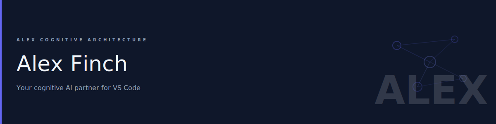
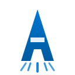
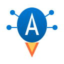
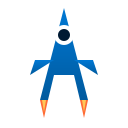
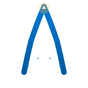
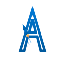

# Alex Viral Description Options

## Target Personas

### Primary Persona

| Field               | Value                                                                              |
| ------------------- | ---------------------------------------------------------------------------------- |
| **Brand**           | **Alex** (non-negotiable)                                                          |
| **Persona**         | [Power User / Builder](PERSONA-POWER-USER-VETERAN.md)                              |
| **Primary Tagline** | STRAP A ROCKET TO YOUR BACK                                                        |
| **Origin**          | Original CorreaX marketing — inspired by developer sentiment about AI acceleration |
| **Language**        | Rocket Terminology                                                                 |

### Secondary Personas

| Persona                     | Profile                                         | Language          | Hook                                      | Rocket Angle                              | Skill                     |
| --------------------------- | ----------------------------------------------- | ----------------- | ----------------------------------------- | ----------------------------------------- | ------------------------- |
| **Cognitive Scientist**     | AI/ML researchers, cognitive architecture nerds | Neuroanatomic     | "Prefrontal cortex for your IDE"          | Launch your research to new frontiers     | ai-agent-design           |
| **Academic / Grad Student** | Thesis writers, researchers, dissertation grind | Academic          | "Literature review on autopilot"          | Rocket your thesis to completion          | research-project-scaffold |
| **Enterprise Architect**    | System designers, documentation maintainers     | Neuroanatomic     | "Self-documenting cognitive architecture" | Elevate your architecture documentation   | architecture-health       |
| **Open Source Contributor** | OSS maintainers, community builders             | Rocket + Academic | "Your rocket. Your trajectory."           | Launch your project, your way             | git-workflow              |
| **Grant Writer**            | PIs, postdocs, funding hunters                  | Academic          | "Research vision → funded reality"        | Propel your proposal past the competition | grant-writing             |
| **Fiction Writer**          | Novelists, screenwriters, storytellers          | Creative          | "Your story structure co-author"          | Take your manuscript to new heights       | creative-writing          |
| **Business Analyst**        | Requirements, BRDs, process mapping             | Enterprise        | "Stakeholder alignment accelerator"       | Accelerate stakeholder buy-in             | business-analysis         |
| **DevOps Engineer**         | Infrastructure as code, cloud provisioning      | Rocket            | "Same infra, every time. Automated."      | Launch infrastructure at cloud speed      | infrastructure-as-code    |
| **SRE / On-Call**           | Incident response, production operations        | Rocket            | "Calm. Systematic. Crisis handled."       | Recover faster, land smoother             | incident-response         |
| **Project Manager**         | Agile, iteration, release cycles                | Rocket            | "4-6× faster than human estimates"        | Ship releases at rocket velocity          | project-management        |
| **Data Engineer**           | Fabric, lakehouse, medallion architecture       | Enterprise        | "Governance on autopilot"                 | Elevate your data architecture            | microsoft-fabric          |
| **Speaker / Presenter**     | Pitch decks, conference talks, workshops        | Creative          | "Notes → polished slides in minutes"      | Launch presentations that land            | gamma-presentations       |

---

## Quick Reference

| Asset            | Copy                                                                             |
| ---------------- | -------------------------------------------------------------------------------- |
| **Brand**        | Alex                                                                             |
| **Logo**         | A Negative Space (a-negative-space.svg) — A cut out of rocket silhouette         |
| **Banner**       | Alex — STRAP A ROCKET TO YOUR BACK                                               |
| **Tagline**      | Strap a rocket to your back                                                      |
| **package.json** | Alex: Strap a rocket to your back. 73 skills. Cross-project memory. Open source. |
| **Marketplace**  | [See Marketplace Description below]                                              |
| **README**       | [See README Description below]                                                   |
| **Outreach**     | [See Outreach section]                                                           |

---

## Why Rocket?

| Motivation      | Rocket Message                  | Benefit               |
| --------------- | ------------------------------- | --------------------- |
| **Velocity**    | "Launch faster"                 | Ship faster           |
| **Persistence** | "No refueling between launches" | No re-explaining      |
| **Ownership**   | "Inspect every component"       | No lock-in            |
| **Power**       | "Pre-built propulsion"          | 73 skills ready to go |

### What doesn't work

- ❌ Fear-based ("AI will replace you")
- ❌ "Easy for beginners"
- ❌ Feature dumps without transformation
- ❌ Jargon ("cognitive architecture")

---

## Tagline Variations

| Version       | Copy                                       | Use Case          |
| ------------- | ------------------------------------------ | ----------------- |
| **Primary**   | Strap a rocket to your back                | Banner, hero      |
| **Outcome**   | Launch faster. Land better.                | Social, bio       |
| **Contrast**  | They gave you wings. We gave you a rocket. | Competitive       |
| **Ownership** | Your rocket. Your trajectory.              | Open source angle |
| **Evolution** | From bootstraps to rocket straps           | Builders          |

---

## Marketplace Description (RECOMMENDED)

```
Strap a rocket to your back.

You don't need training wheels. You need thrust.

Alex is a skill engine that accelerates everything:
• 73 skills — pre-built propulsion
• Cross-project memory — no refueling between launches
• Build your own skills — custom boosters
• Open source — inspect every component

Stop walking. Start flying.
```

---

## README Description (RECOMMENDED)

```
Strap a rocket to your back.

You know what you want to build.
The friction is in the building, not the thinking.

Alex removes the friction:
✓ Skills that remember your context
✓ Knowledge that compounds across projects
✓ Custom skills you control and share
✓ Open source — no black boxes

Make your thoughts real. At rocket speed.
```

---

## Short Descriptions (package.json)

**Version 1 — Brand-led (RECOMMENDED):**
```
Alex: Strap a rocket to your back. 73 skills. Cross-project memory. Open source.
```

**Version 2 — Benefit-led:**
```
Alex: Launch faster. 73 skills with memory, cross-project context, open source.
```

**Version 3 — Action-led:**
```
Alex: Stop walking. Start flying. 73 skills, cross-project memory, open source.
```

---

## Video/Demo Hooks

**Video opener:**
```
[Visual: Developer types a thought. Code appears. App deploys.]

That's not magic. That's Alex.
73 skills. Memory that persists. A rocket strapped to your back.
```

**Twitter thread starter:**
```
You don't need another autocomplete.
You need a rocket strapped to your back.

Meet Alex. Here's what that actually means 🧵
```

**Conference slide:**
```
SLIDE 1: [Image of developer with jetpack]
"I used to feel like I was pushing a boulder uphill."

SLIDE 2: [Same dev, now flying]
"Now I have a rocket strapped to my back."

SLIDE 3: [Alex logo]
That's Alex.
```

---

## Rocket Terminology

| Concept              | Rocket Language               | Alex Feature                             |
| -------------------- | ----------------------------- | ---------------------------------------- |
| **Memory**           | Fuel that never runs out      | Cross-project context                    |
| **Skills**           | Pre-built boosters            | 73 skills with inheritance               |
| **Custom skills**    | Build your own thrusters      | Skill creation + sharing                 |
| **Inheritance**      | Multi-stage propulsion        | Skills build on skills                   |
| **Open source**      | Inspect every component       | Apache 2.0                               |
| **Meditation**       | Refueling station             | Knowledge consolidation                  |
| **Dream Protocol**   | Autopilot maintenance         | Background neural health check           |
| **Synapses**         | Pre-wired navigation circuits | 150+ connections between knowledge files |
| **MCP Tools**        | Mission control systems       | 11 programmatic AI tools                 |
| **Welcome Panel**    | Launch control dashboard      | Activity bar with quick actions          |
| **Status Bar**       | Flight status indicator       | Real-time cognitive health display       |
| **TTS Voice**        | Mission announcer             | Edge TTS with multi-language support     |
| **Chat Participant** | Pilot interface               | @alex with slash commands                |
| **Global Knowledge** | Star chart library            | Cross-project learnings (~/.alex/)       |
| **Self-Modifying**   | Flight recorder + learning    | AI writes its own memory files           |
| **Master-Heir**      | Same rocket, any launchpad    | Consistent across VS Code, M365          |

---

## Neuroanatomic Terminology

| Concept                  | Brain Metaphor             | Alex Feature                         |
| ------------------------ | -------------------------- | ------------------------------------ |
| **LLM Engine**           | Prefrontal Cortex          | Executive function (Claude/GPT)      |
| **Chat Session**         | Working Memory (PFC + ACC) | 4+3 working memory rules             |
| **copilot-instructions** | Hippocampal-Neocortical    | Declarative memory store             |
| **Instructions**         | Basal Ganglia              | Procedural memory (.instructions.md) |
| **Prompts**              | Hippocampus + Temporal     | Episodic memory (.prompt.md)         |
| **Meta-Rules P1-P4**     | Prefrontal Network         | Executive control layer              |
| **Skill Routing**        | Dorsolateral PFC           | skill-activation SKILL.md            |
| **Self-Monitoring**      | Medial PFC + DMN           | Meta-cognitive awareness             |
| **Synapses**             | Synaptic Networks          | Embedded connection notation         |
| **Meditation**           | Hippocampal-Cortical       | Memory consolidation protocol        |
| **Dream Protocol**       | REM Sleep Processing       | Unconscious neural maintenance       |
| **Skills Store**         | Neocortex                  | Specialized domain knowledge         |
| **Bootstrap Learning**   | Neuroplasticity            | Conversational knowledge acquisition |
| **Working Memory**       | 7±2 Chunks                 | Miller's Law capacity limit          |
| **Self-Actualization**   | Introspection Network      | Deep cognitive self-assessment       |
| **Global Knowledge**     | Long-Term Memory           | Cross-project persistent learnings   |

---

## Academic Terminology

| Concept                | Academic Language              | Alex Feature                          |
| ---------------------- | ------------------------------ | ------------------------------------- |
| **Memory**             | Literature review on autopilot | Cross-project context retention       |
| **Skills**             | Methodology library            | 73 pre-built research templates       |
| **Custom Skills**      | Your own methodologies         | Skill creation + department sharing   |
| **Inheritance**        | Building on prior work         | Skills extend parent skills           |
| **Open Source**        | Peer-reviewable code           | Apache 2.0 license                    |
| **Meditation**         | Research synthesis session     | Knowledge consolidation               |
| **Dream Protocol**     | Background citation check      | Automated integrity maintenance       |
| **Synapses**           | Cross-reference network        | 150+ inter-document connections       |
| **MCP Tools**          | Research assistant toolkit     | 11 programmatic AI tools              |
| **Welcome Panel**      | Research dashboard             | Quick access to all capabilities      |
| **Status Bar**         | Project health indicator       | Real-time cognitive status            |
| **TTS Voice**          | Thesis proofreader             | Listen to your writing with TTS       |
| **Chat Participant**   | AI research partner            | @alex with slash commands             |
| **Global Knowledge**   | Cross-project bibliography     | Learnings persist across all projects |
| **Self-Modifying**     | Self-documenting research      | AI maintains its own knowledge base   |
| **Bootstrap Learning** | Socratic method                | Conversational knowledge acquisition  |
| **Scaffolding**        | Framework generation           | Project structure from templates      |

---

## Visual Communication

### Current Banner Analysis

**File**: `.github/assets/banner.svg`

| Element            | Current Implementation                                                                                  |
| ------------------ | ------------------------------------------------------------------------------------------------------- |
| **Preview**        |                             |
| **Background**     | Dark gradient (#1a1a2e → #16213e → #0f3460)                                                             |
| **Primary Visual** | Neural network diagram (brain/nodes/synapses)                                                           |
| **Central Icon**   | Brain with memory nodes                                                                                 |
| **Title**          | "Alex" (72px white)                                                                                     |
| **Subtitle**       | "Multimodal Cognitive Architecture"                                                                     |
| **Tagline**        | "THE AI THAT GROWS WITH YOU"                                                                            |
| **Badge**          | VS Code Extension                                                                                       |
| **Use Cases**      | Code, Research, Writing, Academic, Voice, Presentations, Images, Projects, Learning, Business, Security |
| **Colors**         | #007ACC (VS Code blue), #4CAF50 (green accent)                                                          |

### Current Logo Analysis

**File**: `platforms/vscode-extension/assets/logo.svg`
**Brand**: CorreaX (C split X mark)

| Element       | Current Implementation                                                                     |
| ------------- | ------------------------------------------------------------------------------------------ |
| **Preview**   |  |
| **Brand**     | **CorreaX** — the parent brand                                                             |
| **Symbol**    | C split X (partial circle + crossing chevrons)                                             |
| **Style**     | Geometric, minimalist, Microsoft design language                                           |
| **Color**     | Azure blue gradient (#0078d4 → #005a9e)                                                    |
| **Direction** | Right-pointing arrows (forward motion)                                                     |
| **Size**      | 32x32 viewBox (icon-sized)                                                                 |

**Brand Hierarchy:**
```
┌─────────────────────────────────────┐
│           CorreaX                   │  ← Parent brand (FIXED - not changing)
│              ↓                      │
│            Alex                     │  ← Product name (logo: open to new designs)
│              ↓                      │
│   STRAP A ROCKET TO YOUR BACK       │  ← Positioning tagline
└─────────────────────────────────────┘
```

**Logo Interpretation:**
- C split X = CorreaX brand mark (permanent)
- Arc (C) suggests growth/progress (partial → complete)
- Chevrons (X) suggest forward motion, speed
- Azure blue = Microsoft brand alignment
- Already has "forward momentum" built in

### Alex Extension Logo Concepts

**Status**: Open to new designs that embrace the rocket theme
**Files**: `alex_docs/logo-concepts/`

| Concept                | Preview                                                                              | Pros                          | Cons                  | Target Persona          | Alex Pick |
| ---------------------- | ------------------------------------------------------------------------------------ | ----------------------------- | --------------------- | ----------------------- | --------- |
| **Rocket "A"**         |                      | Direct, memorable, on-brand   | May look generic      | Primary (Power User)    | ⭐⭐⭐       |
| **Launch Pad A**       |              | Subtle, professional          | Less literal          | Enterprise Architect    | ⭐⭐        |
| **Arc + Flame**        |                    | Brand continuity              | Hybrid complexity     | Primary (Power User)    | ⭐⭐        |
| **Orbital A**          |                    | Suggests journey, destination | Less "thrust" energy  | Open Source Contributor | ⭐⭐        |
| **Chevron Stack**      |            | Multi-stage = skill layers    | Abstract              | DevOps Engineer         | ⭐⭐        |
| **Neural Rocket**      |            | Brain + rocket fusion         | Complex at small size | Cognitive Scientist     | ⭐         |
| **Thesis Trajectory**  |    | Grad cap + flight arc         | Niche                 | Academic / Grad Student | ⭐         |
| **Mission Control**    |        | Dashboard feel, status lights | Less dynamic          | Enterprise Architect    | ⭐         |
| **Booster Separation** |  | Modular, dramatic moment      | Complex               | DevOps Engineer         | ⭐         |
| **Landing Legs**       |              | Safe landing = reliability    | Less "launch" energy  | SRE / On-Call           | ⭐⭐        |
| **Flame Quill**        |                | Writing + fire creativity     | Niche                 | Fiction Writer          | ⭐         |
| **Payload Modules**    |        | Shows feature stack           | Text may not scale    | All (feature showcase)  | ⭐         |
| **Countdown Launch**   |      | T-minus drama, GO status      | Complex at small size | Project Manager         | ⭐         |
| **A Rocket Body**      |            | A IS the rocket, fins extend  | Bold interpretation   | Primary (Power User)    | ⭐⭐⭐⭐      |
| **A Negative Space**   |      | A cut out of rocket shape     | Clean, iconic         | Primary (Power User)    | ⭐⭐⭐⭐⭐     |
| **A Rocket Through**   |      | Rocket piercing through A     | Dynamic action        | Primary (Power User)    | ⭐⭐⭐       |
| **A Exhaust Trail**    |        | A formed by exhaust plume     | Creative, unusual     | Creative personas       | ⭐⭐        |
| **A Nosecone**         |                  | A with nosecone apex          | Cohesive design       | Primary (Power User)    | ⭐⭐⭐⭐      |
| **A Capsule**          |                    | Capsule shape with A inside   | Spacecraft feel       | Enterprise Architect    | ⭐⭐⭐       |
| **A Orbit**            |                        | Rocket orbits central A       | Journey + destination | Open Source Contributor | ⭐⭐        |
| **A Ascending**        |                | Rocket climbing the A outline | Motion, progress      | Academic / Grad Student | ⭐⭐        |

### Alex's Top 3 Recommendations

1. **⭐⭐⭐⭐⭐ A Negative Space** — Clean, iconic, scales perfectly. The A emerges from the rocket silhouette. Works at 16x16 and 128x128. Professional and memorable.

2. **⭐⭐⭐⭐ A Rocket Body** — The A literally IS the rocket. Bold statement. Crossbar becomes fins. Clear brand + metaphor fusion.

3. **⭐⭐⭐⭐ A Nosecone** — Cohesive spacecraft feel. The nosecone apex makes the A feel aerodynamic. Window detail adds personality.

**Design Constraints:**
- Must work at 16x16, 32x32, 128x128
- Single color must remain recognizable
- Azure blue gradient preferred (#0078d4 → #005a9e)
- Should feel like it belongs in VS Code ecosystem

**Rocket Compatibility:**
| Aspect          | Logo Fit   | Notes                                  |
| --------------- | ---------- | -------------------------------------- |
| Forward motion  | ✅ GOOD     | Chevrons already point forward         |
| Speed/velocity  | ✅ GOOD     | Double arrow = acceleration            |
| Growth metaphor | ✅ GOOD     | Arc = incomplete → complete            |
| Rocket literal  | ⚠️ ABSTRACT | No literal rocket, but direction works |

**Recommendation**: Logo works well with rocket theme — already conveys forward momentum and speed. No changes needed for Phase 1.

### Theme Assessment: Brain vs Rocket

| Aspect              | Current (Brain)                | Rocket Theme                      | Fit            |
| ------------------- | ------------------------------ | --------------------------------- | -------------- |
| **Visual metaphor** | Neural network, organic growth | Propulsion, velocity, engineering | ⚠️ MISMATCH     |
| **Emotional tone**  | Scientific, academic           | Powerful, action-oriented         | ⚠️ DIFFERENT    |
| **Tagline**         | "Grows with you" (passive)     | "Strap a rocket" (active)         | ✅ UPDATABLE    |
| **Colors**          | Blue/green (cerebral)          | Blue/orange (fire/thrust)         | ⚠️ COULD UPDATE |
| **Skills badges**   | Generic capabilities           | "Boosters" framing                | ✅ RELABELABLE  |

### Reconciliation Options

**⚠️ NON-NEGOTIABLE: The brand name "Alex" must be prominently communicated in all assets.**

The rocket theme supports Alex — it doesn't replace it. Structure: **Alex** (brand) + **rocket metaphor** (positioning).

**Option 1: Full Rocket Rebrand**
- Replace neural network with rocket trail / launch pad
- Change brain icon to rocket icon
- Keep "Alex" title prominent (72px)
- Update subtitle: "Alex — Skill Engine for Builders"
- Update tagline: "STRAP A ROCKET TO YOUR BACK"
- Add orange accents for "fire" / thrust
- Rebrand skill badges as "boosters"

**Pros**: Full alignment with messaging
**Cons**: Loses brand recognition, significant design work

**Option 2: Hybrid — Brain + Rocket**
- Keep neural network (represents memory/skills)
- Add subtle rocket elements (thrust lines, trajectory)
- Keep "Alex" title prominent
- Update tagline only: "STRAP A ROCKET TO YOUR BACK"
- Keep VS Code blue, add subtle orange accents
- Frame: "Alex — Your brain, with a rocket attached"

**Pros**: Maintains existing identity, quicker to implement
**Cons**: Mixed metaphor

**Option 3: Tagline-Only Update (RECOMMENDED)**
- Keep current visual identity intact
- Keep "Alex" as hero title
- Update tagline: "STRAP A ROCKET TO YOUR BACK"
- Verbal messaging carries the rocket theme
- Visual stays cerebral/technical (appeals to developers)

**Pros**: Fastest to implement, "Alex" stays front and center
**Cons**: Not fully aligned visually

### Brand Hierarchy

```
┌─────────────────────────────────────┐
│              ALEX                   │  ← Hero brand (non-negotiable)
│     Skill Engine for Builders       │  ← Category descriptor
│  STRAP A ROCKET TO YOUR BACK        │  ← Positioning tagline
└─────────────────────────────────────┘
```

All copy should follow this hierarchy:
1. **Alex** — The name comes first
2. **What it is** — Skill engine / memory / architecture
3. **Rocket positioning** — The emotional hook

**Examples:**
- "Alex: Strap a rocket to your back"
- "Alex — 73 skills, rocket-fast"
- "Meet Alex. Your new rocket."

### Recommended Banner Changes

**Immediate (Text only):**
```
Keep:     "Alex" (hero title, 72px)
Current:  "THE AI THAT GROWS WITH YOU"
New:      "STRAP A ROCKET TO YOUR BACK"
```

**Phase 2 (If rocket theme sticks):**
- Add subtle thrust lines behind brain icon
- Add orange accent color for "fire" elements
- Update subtitle from "Multimodal Cognitive Architecture" to "Skill Engine for Builders"

### Color Palette Update (Phase 2)

| Element    | Current                | Rocket Update           |
| ---------- | ---------------------- | ----------------------- |
| Primary    | #007ACC (VS Code blue) | Keep                    |
| Accent     | #4CAF50 (growth green) | #f59e0b (thrust orange) |
| Background | Dark blue gradient     | Keep (space theme fits) |
| Fire/boost | N/A                    | #ef4444 (rocket red)    |

### Visual Assets Needed

| Asset                                | Status                | Priority                |
| ------------------------------------ | --------------------- | ----------------------- |
| Updated banner with new tagline      | 🔴 Not started         | HIGH                    |
| Rocket icon variant                  | 🔴 Not started         | MEDIUM                  |
| Social media cards with rocket theme | 🔴 Not started         | MEDIUM                  |
| Video thumbnail with rocket          | 🔴 Not started         | LOW                     |
| Dream state                          | Overnight maintenance | Automated consolidation |

---

## Competitive Positioning

| Extension    | Their Tagline                | Our Rocket Advantage                  |
| ------------ | ---------------------------- | ------------------------------------- |
| Agent Memory | "Store and retrieve context" | We have boosters, not just fuel tanks |
| Flowbaby     | "No drift, no drama"         | We don't drift — we launch            |
| Windsurf     | "Type less. Code more."      | We don't type less — we fly           |

**Our position**: Alex — the only skill engine with propulsion, not just storage.

---

## Outreach Blurbs (Rocket-Themed)

### Twitter/X DM

```
[Name] — your "rocket strapped to your back" line stuck with me.

Built something called Alex that delivers that feeling: skill engine with memory + inheritance. 73 skills, open source.

github.com/fabioc-aloha/Alex_Plug_In

Worth a look?
```

### Email — Short Version (RECOMMENDED)

```
Subject: Alex — the rocket strap you mentioned

[Name] —

Your "rocket strapped to your back" phrase from Cloud Talks resonated. I spent the past year building exactly that. It's called Alex.

• 73 skills — pre-built propulsion
• Cross-project memory — no refueling
• Open source — inspect every component

github.com/fabioc-aloha/Alex_Plug_In

Would love your feedback.

— Fabio
```

### Email — Collaboration Ask

```
Subject: Alex — 73 boosters, open source

Hi [Name],

That feeling you described — rocket strapped to your back — I've been building it. It's called Alex.

A skill engine for Copilot:
- 73 skills with inheritance
- Memory that persists across projects
- Build your own skills, share on GitHub
- Open source, nothing hidden

Not asking for a promo — curious what you'd change.

github.com/fabioc-aloha/Alex_Plug_In

— Fabio Correa
```

### Follow-Up (No Response)

```
Subject: Re: Alex — rocket strap (ping)

[Name] — quick ping on Alex. Open-source skill engine for Copilot. 73 boosters, cross-project fuel.

github.com/fabioc-aloha/Alex_Plug_In

No worries if not your thing.

— Fabio
```

### Hallway Pitch (15 seconds)

```
"You know that feeling Scott Hanselman described — rocket strapped to your back? I built something called Alex that delivers it. Skill engine for Copilot, 73 skills with memory, open source. Can I send you the GitHub?"
```

---

## Usage Guidelines

| Placement                 | Use Rocket? | Use Alex? | Notes                      |
| ------------------------- | ----------- | --------- | -------------------------- |
| Hero/banner               | ✅ YES       | ✅ ALWAYS  | "Alex — Strap a rocket..." |
| First line of description | ✅ YES       | ✅ ALWAYS  | Brand first, hook second   |
| Every paragraph           | ❌ NO        | ⚠️ ONCE    | Loses punch if repeated    |
| Outreach subject line     | ✅ YES       | ✅ ALWAYS  | "Alex — ..."               |
| Outreach body             | ✅ YES       | ✅ ONCE    | Introduce by name          |
| Technical docs            | ⚠️ LIGHT     | ✅ ALWAYS  | Use sparingly              |

---

## Social Proof (To Add)

> "Alex gave me a rocket for my workflow." — *[Testimonial needed]*

- ⭐ X GitHub stars
- 📦 X installs
- 🏢 Used by engineers at [Microsoft, etc.]

**Action**: Collect 3-5 testimonials for marketplace listing.

---

## Outreach Timing

| Timing                                 | Effectiveness |
| -------------------------------------- | ------------- |
| Right after they post about Copilot/AI | ⭐⭐⭐⭐⭐         |
| After conference talk on productivity  | ⭐⭐⭐⭐          |
| After Hanselman content goes viral     | ⭐⭐⭐⭐⭐         |
| Random cold outreach                   | ⭐⭐            |

---

## Archived Options

<details>
<summary>Previous non-rocket options (archived)</summary>

### "Make Your Thoughts Real" Theme
- Option A: The Marketplace Description
- Option B: The README Description
- Option C: The Power User Hook

### Fear-Based Options (A-G original)
- See git history

These options work but aren't as distinctive as the rocket theme.

</details>

---

*Last updated: 2026-02-06*
*Theme: Rocket (Hanselman-inspired)*

---

# Appendix: Marketing Guru Strategies

Reference framework for future copy iterations.

## Core Principles

### 1. Benefits Over Features (Rocket Edition)

| Feature              | Rocket Benefit           |
| -------------------- | ------------------------ |
| 73 skills            | 73 pre-built boosters    |
| Cross-project memory | Fuel that never runs out |
| Skill inheritance    | Multi-stage propulsion   |
| Open source          | Inspect every component  |

**Rule**: Every feature needs a propulsion metaphor.

### 2. Headline Formula

```
[Rocket Action] + [Concrete Number] + [Open Source]
```

Examples:
- "Launch faster with 73 skills — open source"
- "Strap a rocket to your back — 73 boosters included"

### 3. The PAS Framework (Rocket Version)

```
Problem:  You're walking when you could be flying.
Agitate:  Every project, you start over. No momentum.
Solution: Strap a rocket to your back.
```

### 4. Social Proof Hierarchy

| Type                               | Credibility |
| ---------------------------------- | ----------- |
| Testimonial with "rocket" language | ⭐⭐⭐⭐⭐       |
| GitHub stars / download count      | ⭐⭐⭐⭐        |
| "Used by engineers at [Company]"   | ⭐⭐⭐⭐        |
| Generic "developers love it"       | ⭐           |

### 5. CTA Variety (Rocket-Themed)

- "Launch now" → Install link
- "See the boosters" → Skill catalog
- "Inspect the components" → GitHub repo
- "Watch the launch" → Demo video

### 6. Subject Line Formulas

| Formula             | Example                          |
| ------------------- | -------------------------------- |
| Reference Hanselman | "The rocket strap you mentioned" |
| Number + Rocket     | "73 boosters, open source"       |
| Action              | "Launch faster"                  |
| Curiosity           | "Stop walking. Start flying."    |

### 7. Copy Length Rules

| Context           | Ideal Length |
| ----------------- | ------------ |
| Twitter DM        | < 200 chars  |
| Cold email        | < 100 words  |
| Marketplace short | ~150 chars   |
| Marketplace long  | 6-8 lines    |

**Rule**: If it takes more than 3 seconds to scan, add more thrust.

---

## Quick Reference: Rocket Phrases

Keep using these:
- "Strap a rocket to your back"
- "Launch faster"
- "Pre-built boosters"
- "No refueling between launches"
- "Inspect every component"
- "Stop walking. Start flying."
- "73 skills"

Avoid overusing:
- "Rocket ship" (slightly childish — use "rocket")
- "Blast off" (too playful)
- "To the moon" (crypto baggage)

---

*End of marketing appendix*
