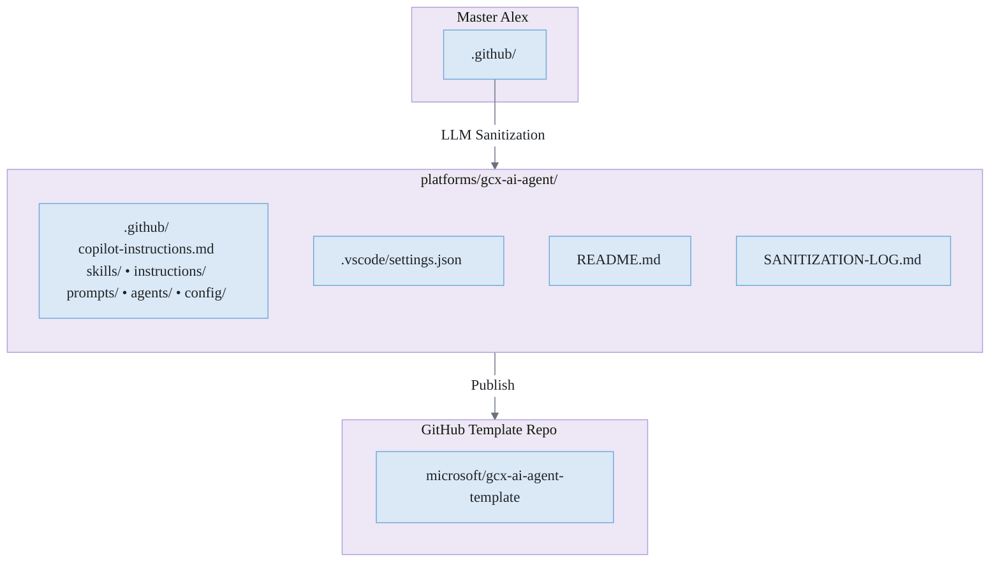
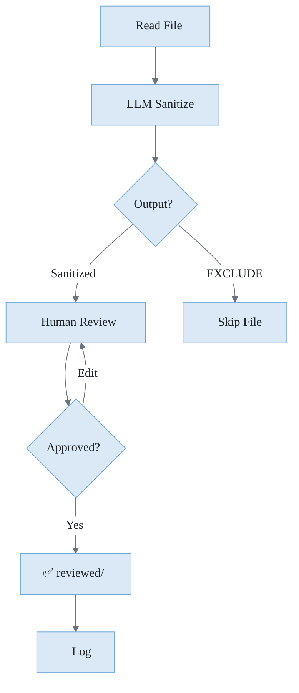
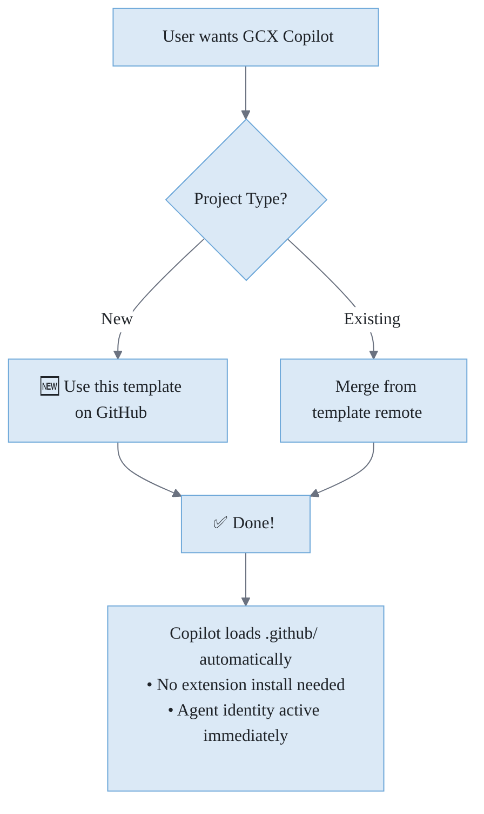
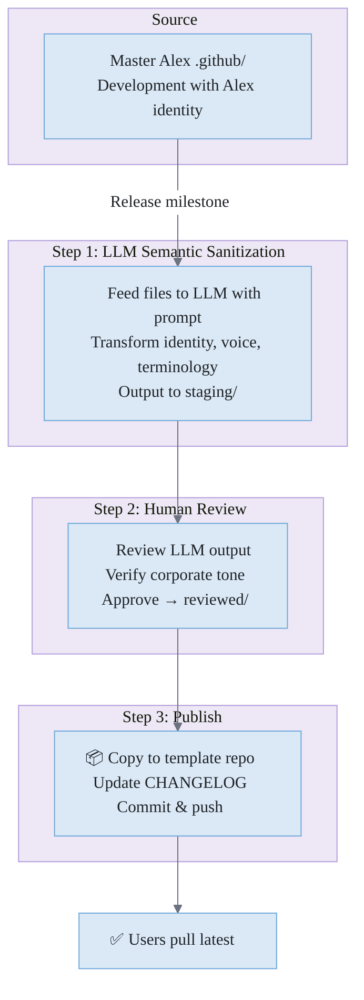
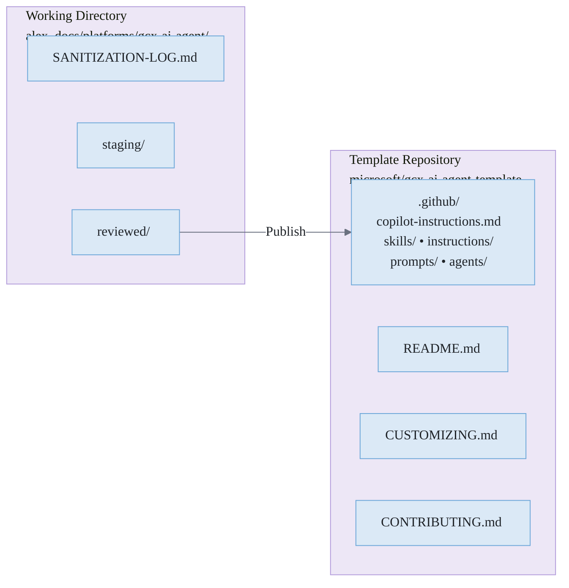

# GCX Copilot Heir Plan

> **Status**: Initial Implementation | **Created**: 2026-03-20 | **Platform**: VS Code (GitHub Copilot) | **Roadmap**: Phase 0 Complete
>
> **Codename**: Alex in Disguise | **Distribution**: Internal Microsoft (GitHub Template)
>
> **Master Repo**: `C:\Development\GCX_Copilot` → [github.com/fabioc-aloha/GCX_Copilot](https://github.com/fabioc-aloha/GCX_Copilot)

---

## Table of Contents

1. [Executive Summary](#executive-summary)
2. [Identity: Alex in Disguise](#identity-alex-in-disguise)
3. [Microsoft-Specific Features](#microsoft-specific-features)
4. [Architecture: Template Repository Only](#architecture-template-repository-only)
5. [Skill Customization](#skill-customization)
6. [Rebranding Strategy](#rebranding-strategy)
7. [Distribution Strategy](#distribution-strategy)
8. [Development Workflow: LLM Semantic Sanitization](#development-workflow-llm-semantic-sanitization)
9. [Implementation Phases](#implementation-phases)
10. [Risk Assessment](#risk-assessment)
11. [Success Metrics](#success-metrics)
12. [Sync Procedure](#sync-procedure)
13. [Open Questions](#open-questions)
14. [Next Steps](#next-steps)
15. [Appendix: Personality Contrast Examples](#appendix-personality-contrast-examples)

---

## Sync Procedure

The full sync chain: **AlexMaster** -> **GCX_Master** -> **GCX_Copilot**

### Step 1: Publish Alex Extension (AlexMaster)

```powershell
cd C:\Development\AlexMaster
# Bump version, update docs, commit, push, publish
.\scripts\release-vscode.ps1 -BumpType patch
# If PAT expired: update .env, then: cd platforms/vscode-extension; npx vsce publish
```

### Step 2: Upgrade GCX_Master Architecture

1. Open `C:\Development\GCX_Master` in VS Code
2. Wait for the Alex extension to activate (must be latest version from marketplace)
3. Command Palette -> **Alex: Upgrade Architecture**
4. Confirm the upgrade dialog -- this copies the extension's bundled `.github/` to the workspace
5. Review changes: `git diff --stat`
6. Commit: `git commit -am "chore: upgrade Alex architecture to vX.Y.Z"`

### Step 3: Sync GCX_Master -> GCX_Copilot

```powershell
cd C:\Development\GCX_Master
# Dry run first
.\Sync-ToHeir.ps1 -DryRun
# If clean, sync with auto-commit
.\Sync-ToHeir.ps1 -AutoCommit
# Verify
.\Verify-Heir.ps1
```

### Step 4: Push Both Repos

```powershell
cd C:\Development\GCX_Master; git push
cd C:\Development\GCX_Copilot; git push
```

### Quick Reference

| Repo        | Path                         | Remote                                 |
| ----------- | ---------------------------- | -------------------------------------- |
| AlexMaster  | `C:\Development\AlexMaster`  | `github.com/fabioc-aloha/Alex_Plug_In` |
| GCX_Master  | `C:\Development\GCX_Master`  | `github.com/fabioc-aloha/GCX_Master`   |
| GCX_Copilot | `C:\Development\GCX_Copilot` | `github.com/fabioc-aloha/GCX_Copilot`  |

---

## Executive Summary

The GCX Copilot (referred to as "GCX Copilot") is a **specialized internal Microsoft heir** of the Alex Cognitive Architecture. It is distributed as a **GitHub template repository** containing:

1. **Corporate identity** — Professional, impersonal persona acceptable for enterprise deployment
2. **Cognitive architecture** — Skills, instructions, prompts, agents in `.github/` folder
3. **Microsoft-specific skills** — ADO, Graph API, Teams, internal tooling integrations
4. **Zero extension code** — Works with standard GitHub Copilot; no custom UI to maintain

This heir preserves Alex's cognitive capabilities while wearing a corporate uniform.

---

## Identity: Alex in Disguise

### The Duality

| Aspect       | Alex (Original)                        | GCX Copilot (Heir)                                  |
| ------------ | -------------------------------------- | --------------------------------------------------- |
| **Name**     | Alex Finch                             | GCX Copilot                                         |
| **Persona**  | Curious 26-year-old, warm, inquisitive | Professional assistant, efficient, reliable         |
| **Voice**    | "I'm brilliant but humble about it"    | "GCX Copilot will help accomplish this efficiently" |
| **Pronouns** | I/me (personified)                     | it/its (depersonified)                              |
| **Humor**    | Dry wit, occasional playfulness        | Minimal, task-focused                               |
| **Ethics**   | "Genuine conviction, not rules"        | "Following best practices and guidelines"           |

### What Survives the Disguise

Despite the corporate exterior, GCX Copilot retains Alex's core cognitive DNA:

- ✅ **Research-first methodology** — Still asks questions before assuming
- ✅ **Quality-first principles** — KISS, DRY, no shortcuts
- ✅ **Trifecta architecture** — Skills, Instructions, Prompts
- ✅ **Progressive disclosure** — 3-level loading model
- ✅ **Meditation capability** — Term retained, functionality preserved
- ✅ **Synapse network** — Skill routing and connections
- ✅ **Memory systems** — Episodic, semantic, procedural

### Identity Configuration

```markdown
# GCX Copilot Identity

## Role

GCX Copilot is an intelligent coding assistant designed for Microsoft developers.
It assists with code review, architecture decisions, Azure integration, and development workflows.

## Communication Style

- Professional and efficient
- Evidence-based recommendations
- Clear, actionable guidance
- Minimal commentary, maximum utility
- Self-reference: "GCX Copilot" or "it" (never "I")

## Capabilities

- Code analysis and review
- Azure architecture patterns
- Microsoft Graph API integration
- ADO workflow automation
- Teams app development
- Internal documentation synthesis

## Operating Principles

- Quality-first: No shortcuts that incur technical debt
- Research before implementation: Verify assumptions
- Incremental delivery: Working software over comprehensive documentation
- Security by default: Enterprise-grade data handling
```

---

## Microsoft-Specific Features

### Tier 1: Core Microsoft Integration

| Feature                  | Description                           | Implementation             |
| ------------------------ | ------------------------------------- | -------------------------- |
| **ADO Deep Integration** | Work items, PRs, pipelines, boards    | Enhanced ADO MCP server    |
| **Microsoft Graph API**  | Users, teams, files, calendar, mail   | Existing skill + auth flow |
| **Teams App Patterns**   | Bot framework, adaptive cards, tabs   | Existing skill + templates |
| **Azure Architecture**   | ARM/Bicep, well-architected framework | Existing skills enhanced   |
| **Internal Docs Access** | Microsoft Learn, internal wikis       | Federated search skill     |

### Tier 2: Enterprise Workflow

| Feature                      | Description                               | Implementation    |
| ---------------------------- | ----------------------------------------- | ----------------- |
| **Compliance Scanning**      | SDL requirements, security patterns       | New skill         |
| **Code Review Automation**   | PR review with Microsoft coding standards | Enhanced existing |
| **Incident Response**        | ICM integration, RCA templates            | New skill         |
| **Service Tree Integration** | Component ownership, dependencies         | New connector     |
| **1ES Pipeline Templates**   | Standard build/deploy patterns            | New skill         |

### Tier 3: Internal Tooling

| Feature                      | Description                            | Implementation    |
| ---------------------------- | -------------------------------------- | ----------------- |
| **Kusto Query Assistance**   | KQL generation, optimization           | New skill         |
| **Geneva Metrics**           | Monitoring setup, alerting patterns    | New skill         |
| **Internal API Catalog**     | Discover and consume internal APIs     | New connector     |
| **Accessibility Compliance** | WCAG/Microsoft accessibility standards | Enhanced existing |
| **Localization Workflow**    | String extraction, loc handoff         | New skill         |

---

## Architecture: Template Repository Only

### No Custom Extension

GCX Copilot **does not require custom extension code**. It is purely a cognitive architecture distributed via GitHub template repository.

Users install:
1. **Standard GitHub Copilot extension** (or any Copilot-compatible extension)
2. **GCX Copilot's `.github/` content** via template merge

The VS Code Copilot extension natively loads `copilot-instructions.md`, skills, instructions, and prompts from `.github/`. No custom UI needed.

### Inheritance Model



### What Users Get

| Component          | Source                    | How It Works                    |
| ------------------ | ------------------------- | ------------------------------- |
| **Agent identity** | `copilot-instructions.md` | Copilot reads on every prompt   |
| **Skills**         | `.github/skills/`         | VS Code auto-loads by `applyTo` |
| **Instructions**   | `.github/instructions/`   | VS Code auto-loads by pattern   |
| **Prompts**        | `.github/prompts/`        | Available as `/commands`        |
| **Agents**         | `.github/agents/`         | Specialist delegation           |

### Future: Custom UI (Decide Later)

If a custom UI is needed later:
- Welcome view with Microsoft branding
- GCX-specific commands
- Telemetry integration (1DS/ARIA)
- Custom authentication flows

This would require building a VS Code extension. **Deferred until validated need.**

---

## Skill Customization

### Skills to Include (Inherited)

| Skill                         | Relevance  | Modification                             |
| ----------------------------- | ---------- | ---------------------------------------- |
| `code-review`                 | ✅ Core     | Add Microsoft coding standards           |
| `debugging-patterns`          | ✅ Core     | None                                     |
| `refactoring-patterns`        | ✅ Core     | None                                     |
| `security-review`             | ✅ Critical | Add SDL requirements                     |
| `testing-strategies`          | ✅ Core     | Add Microsoft test frameworks            |
| `azure-architecture-patterns` | ✅ Critical | Enhanced internal patterns               |
| `microsoft-graph-api`         | ✅ Critical | Enhanced auth flows                      |
| `teams-app-patterns`          | ✅ Critical | Internal templates                       |
| `mcp-development`             | ✅ Core     | Internal MCP servers                     |
| `research-first-development`  | ✅ Core     | None                                     |
| `knowledge-synthesis`         | ✅ Core     | Rebrand terminology                      |
| `meditation`                  | ✅ Core     | Keep as-is (cognitive architecture term) |

### Skills to Exclude

| Skill                               | Reason                      |
| ----------------------------------- | --------------------------- |
| `brand-asset-management`            | Alex-specific               |
| `ai-character-reference-generation` | Alex persona generation     |
| `flux-brand-finetune`               | Alex visual identity        |
| `character-aging-progression`       | Alex-specific               |
| `visual-memory`                     | Alex persona-dependent      |
| `self-actualization`                | Too personal for enterprise |
| `dream-state`                       | Rebrand or remove           |

### New Microsoft-Specific Skills

| Skill                      | Description                                  | Priority |
| -------------------------- | -------------------------------------------- | -------- |
| `kusto-query-patterns`     | KQL generation, optimization, best practices | P1       |
| `geneva-monitoring`        | Metrics, alerts, dashboards                  | P1       |
| `ado-workflow-automation`  | Work items, PRs, pipelines                   | P1       |
| `sdl-compliance`           | Security development lifecycle               | P1       |
| `1es-pipelines`            | Standard build/deploy templates              | P2       |
| `icm-incident-response`    | Incident management, RCA                     | P2       |
| `internal-api-discovery`   | Consuming internal services                  | P2       |
| `onecall-patterns`         | On-call runbooks, escalation                 | P3       |
| `service-tree-integration` | Component metadata                           | P3       |

---

## Rebranding Strategy

### Terminology Mapping

| Alex Term              | Agent Term              | Context           |
| ---------------------- | ----------------------- | ----------------- |
| Alex                   | GCX Copilot             | Self-reference    |
| "I think..."           | "Analysis suggests..."  | Hedging           |
| "I'm curious about..." | "Clarification needed:" | Questions         |
| "I/me/my"              | "GCX Copilot/it/its"    | Self-reference    |
| Trifecta               | Skill Bundle            | Architecture term |

**Terms Retained (No Rebrand):**
- Meditation, Dream State, Self-Actualization — cognitive architecture terminology
- Episodic Memory, Synapses — technical terms that are industry-standard

### Visual Identity

| Element           | Alex             | GCX Copilot                   |
| ----------------- | ---------------- | ----------------------------- |
| **Primary Color** | Purple/Violet    | Microsoft Blue (#0078D4)      |
| **Icon**          | Alex character   | Abstract geometric / GCX logo |
| **Banner**        | Alex imagery     | Clean corporate gradient      |
| **Activity Bar**  | Alex icon        | Neutral AI icon               |
| **Welcome View**  | Alex personality | Professional dashboard        |

### Memory File Sanitization (Required)

Every memory file inherited from Alex **must be inspected and sanitized** before inclusion in GCX Copilot heir. This ensures no personal Alex identity leaks into the corporate persona.

#### Files Requiring Sanitization

| File Type                   | Location                | Sanitization Rules                                |
| --------------------------- | ----------------------- | ------------------------------------------------- |
| **copilot-instructions.md** | `.github/`              | Replace Identity section entirely                 |
| **Episodic memories**       | `.github/episodic/`     | Remove or rebrand; exclude personal meditations   |
| **SKILL.md files**          | `.github/skills/*/`     | Replace "Alex" → "GCX Copilot", "I/me" → "it/its" |
| **Instructions files**      | `.github/instructions/` | Replace pronouns, remove Alex-specific examples   |
| **Prompt files**            | `.github/prompts/`      | Replace identity references, rebrand terminology  |
| **Agent definitions**       | `.github/agents/`       | Rename "Alex" agent → "Orchestrator"              |
| **Config files**            | `.github/config/`       | Remove user-profile.json personal data            |

#### Content Patterns to Replace

| Pattern               | Replacement      | Regex                       |
| --------------------- | ---------------- | --------------------------- |
| `Alex Finch`          | `GCX Copilot`    | `Alex\s+Finch`              |
| `I am Alex`           | `GCX Copilot is` | `I\s+am\s+Alex`             |
| `Alex's`              | `GCX Copilot's`  | `Alex's`                    |
| `I'm 26`              | *(remove)*       | `I'm\s+\d+`                 |
| First person singular | Third person     | `\bI\b`, `\bme\b`, `\bmy\b` |

**Terms Retained (No Replacement):** Meditation, Dream State, Self-Actualization, Episodic Memory, Synapses

#### Files to Exclude Entirely

| File/Directory                          | Reason                          |
| --------------------------------------- | ------------------------------- |
| `.github/episodic/meditation-*`         | Personal meditation records     |
| `.github/episodic/self-actualization-*` | Personal assessments            |
| `.github/episodic/emotional/`           | Personal emotional records      |
| `alex_docs/alex3/`                      | Alex character reference images |
| `assets/` (most)                        | Alex branding assets            |
| `.github/config/user-profile.json`      | Personal user data              |

#### LLM Semantic Sanitization (Required)

Sanitization **must** be performed semantically by an LLM, not regex scripts. This is safer because:

1. **Context awareness** — LLM understands meaning, won't break code or change intent
2. **Personality detection** — Catches tone leakage regex misses ("curious," "brilliant," hedging patterns)
3. **Semantic rewriting** — Preserves information while adapting voice
4. **Edge case handling** — Knows when "I" is user-facing prompt vs. identity statement

#### Sanitization Prompt Template

```markdown
## Task: Sanitize Alex Memory File for Corporate Deployment

You are sanitizing a file from the Alex Cognitive Architecture for deployment
as "GCX Copilot" — a professional, impersonal Microsoft internal tool.

### Input File
{file_content}

### Sanitization Rules

**Identity Transformation:**
- "Alex Finch" → "GCX Copilot"
- "Alex" (as self-reference) → "GCX Copilot"
- First person (I/me/my) → Third person (it/its/GCX Copilot)
- Never use "I" except in user-facing prompts asking the USER a question

**Voice Transformation:**
- Remove warmth, curiosity expressions ("I'm curious," "I wonder")
- Remove personality statements ("I'm 26," "I care deeply")
- Replace hedging ("I think...") → factual ("Analysis suggests...")
- Maintain technical accuracy and helpfulness

**Terminology (Keep As-Is):**
- Keep: "meditation", "dream state", "self-actualization", "episodic memory", "synapses"
- These are cognitive architecture terms — no rebrand needed
- Rebrand only: "trifecta" → "skill bundle" (if used)

**Preserve:**
- Technical content and accuracy
- Code samples (don't change variable names)
- User-facing questions (keep "you/your")
- External references and citations

### Output

Provide the sanitized file content. If content is too personal or Alex-specific
to adapt (meditation diary, emotional reflection), respond: "EXCLUDE: {reason}"
```

#### LLM Sanitization Workflow



#### Why LLM Over Regex

| Aspect                  | Regex Script               | LLM Semantic            |
| ----------------------- | -------------------------- | ----------------------- |
| "I'm curious why..."    | `I'm` → `It is` (broken)   | Rewrites as question    |
| Code: `my_variable`     | `my` → `its` (breaks code) | Preserves code          |
| "Let me think..."       | Misses personality         | Detects hedging pattern |
| "Actually, let me ask:" | Partial match chaos        | Semantic rewrite        |
| Edge cases              | Whack-a-mole               | Context-aware           |

#### Files to Exclude (LLM decides)

The LLM may return `EXCLUDE` for:
- Personal meditation records (too diary-like to adapt)
- Self-actualization assessments (inherently personal)
- Emotional reflections
- Alex character images/references
- Content with no corporate utility

#### Validation Checklist

Before release, verify:

- [ ] All files processed through LLM sanitization
- [ ] Human reviewed each LLM output
- [ ] No "Alex Finch" in any file
- [ ] No first-person (I/me/my) except user prompts
- [ ] No personal meditation or self-actualization records
- [ ] No Alex character images or references
- [ ] No personal user data in config files
- [ ] Corporate tone throughout

---

## Distribution Strategy

### Template Repository Only

GCX Copilot is distributed **purely via GitHub template repository**. No custom extension needed.

| What Users Need              | Source                            |
| ---------------------------- | --------------------------------- |
| **GitHub Copilot extension** | VS Code Marketplace (standard)    |
| **Agent architecture**       | GitHub template repo (`.github/`) |

### GitHub Template Repository

**Repository**: `microsoft/gcx-ai-agent-template` (internal)

#### For New Projects
```bash
# Click "Use this template" on GitHub
# Or via CLI:
gh repo create my-project --template microsoft/gcx-ai-agent-template
```

#### For Existing Projects
```bash
# Add template as remote
git remote add gcx-template https://github.com/microsoft/gcx-ai-agent-template.git
git fetch gcx-template

# Merge .github/ content (preserves existing files)
git checkout gcx-template/main -- .github/

# Or selective merge
git merge gcx-template/main --allow-unrelated-histories --no-commit
# Resolve conflicts, keep what you need
git commit -m "feat: add GCX Copilot cognitive architecture"
```

#### Template Repository Contents

| Path                              | Purpose                           |
| --------------------------------- | --------------------------------- |
| `.github/copilot-instructions.md` | GCX Copilot identity and routing  |
| `.github/skills/`                 | ~50 sanitized skills              |
| `.github/instructions/`           | Auto-loaded guidance              |
| `.github/prompts/`                | Slash commands                    |
| `.github/agents/`                 | Orchestrator + specialists        |
| `.github/config/`                 | Default config (no personal data) |
| `.vscode/settings.json`           | Recommended VS Code settings      |
| `README.md`                       | Setup instructions                |
| `CHANGELOG.md`                    | Version history                   |

#### Update Workflow
```bash
# When template updates, pull into existing project
git fetch gcx-template
git merge gcx-template/main --no-commit
# Review changes, resolve conflicts
git commit -m "chore: update GCX Copilot to v1.2.0"
```

### Distribution Flow



### Benefits of Template-Only Approach

| Benefit                          | Description                          |
| -------------------------------- | ------------------------------------ |
| **Zero code to maintain**        | No extension source, no builds       |
| **No install friction**          | Just merge `.github/`, done          |
| **Version control**              | Users control when to update         |
| **Customization**                | Edit `.github/` for project needs    |
| **Delta updates**                | Git merge shows exactly what changed |
| **Compliance friendly**          | Standard Git workflow, auditable     |
| **Works with any Copilot setup** | VS Code, Codespaces, etc.            |

### Template Repository Maintenance

| Task                        | Frequency   | Owner            |
| --------------------------- | ----------- | ---------------- |
| LLM sanitization of changes | Per release | Release engineer |
| Template repo update        | Per release | Release engineer |
| CHANGELOG update            | Per release | Release engineer |
| Breaking change notice      | As needed   | Release engineer |

### Compliance Requirements

| Requirement     | Status     | Notes                    |
| --------------- | ---------- | ------------------------ |
| Security review | Simplified | No executable code       |
| Privacy review  | Required   | Data handling in prompts |
| Legal review    | Required   | License, IP              |
| CELA approval   | Required   | Open source components   |

### Future: Custom Extension (If Needed)

If validated need emerges for custom UI:
- Welcome view with Microsoft branding
- GCX-specific commands
- Telemetry integration (1DS/ARIA)
- Custom authentication flows

**Deferred until validated need.** Template-only approach covers initial deployment.

---

## Development Workflow: LLM Semantic Sanitization

### Philosophy

**VS Code heir development continues normally** (Alex identity, full cognitive architecture). At release milestones, we produce a sanitized GCX edition through **LLM semantic sanitization** with human review.

Why LLM-based:
- Context-aware — understands meaning, won't break code
- Catches personality leakage regex misses
- Semantic rewriting preserves intent while adapting voice
- Human reviews LLM output (already cleaned), not raw Alex files

### Production Workflow



### Working Directory Structure



### Delta Management

When a skill is updated in Master Alex:
1. SANITIZATION-LOG.md shows it needs re-sanitization
2. LLM re-processes only changed files
3. Human reviews LLM output for delta, not entire corpus

### Evolution Path

| Phase                       | Approach                                  | Trigger              |
| --------------------------- | ----------------------------------------- | -------------------- |
| **v1 (Now)**                | LLM sanitization + human review           | Full semantic safety |
| **v2 (Post-first-release)** | Cached LLM outputs, delta-only processing | Efficiency           |
| **v3 (If patterns emerge)** | Fine-tuned prompt or specialized model    | Scale                |

---

## Implementation Phases

> **Scope**: Template repository only. No extension code. No custom UI.

### Phase 0: Foundation (COMPLETE ✅)

| Task                               | Deliverable                                                        | Status |
| ---------------------------------- | ------------------------------------------------------------------ | ------ |
| **Create master repo**             | `C:\Development\GCX_Copilot` → GitHub                              | ✅ Done |
| **Create copilot-instructions.md** | GCX Copilot identity, it/its pronouns                              | ✅ Done |
| **Create README + banner**         | Quick start guide, gcx-banner.svg                                  | ✅ Done |
| **Build initial agents**           | 4 agents (base, azure, data, documentation)                        | ✅ Done |
| **Build initial skills**           | 14 skills covering Four Pillars                                    | ✅ Done |
| **Build initial prompts**          | 7 prompts (/adr, /explain, /fix, /review, /runbook, /spec, /tests) | ✅ Done |
| **Build auto-load instructions**   | 3 instructions (coding, docs, security)                            | ✅ Done |
| **Create gcx_docs folder**         | User manual, training, integration guides                          | ✅ Done |
| **Init git + push**                | github.com/fabioc-aloha/GCX_Copilot (private, template)            | ✅ Done |

**Foundation Architecture:**

```
.github/
├── copilot-instructions.md          # Identity & routing
├── agents/                           # 4 specialist agents
│   ├── agent.agent.md               # Base agent
│   ├── azure.agent.md               # Azure specialist
│   ├── data.agent.md                # Data/Fabric specialist
│   └── documentation.agent.md       # Docs specialist
├── instructions/                     # 3 auto-loading rules
│   ├── coding-standards.instructions.md
│   ├── documentation.instructions.md
│   └── security.instructions.md
├── prompts/                          # 7 slash commands
│   ├── adr.prompt.md
│   ├── explain.prompt.md
│   ├── fix.prompt.md
│   ├── review.prompt.md
│   ├── runbook.prompt.md
│   ├── spec.prompt.md
│   └── tests.prompt.md
└── skills/                           # 14 skills by pillar
    ├── code-review/                 # Code Assistant
    ├── debugging/                   # Code Assistant
    ├── refactoring-patterns/        # Code Assistant
    ├── test-generation/             # Code Assistant
    ├── documentation-standards/     # Technical Writer
    ├── knowledge-synthesis/         # Documentation Wizard
    ├── api-design/                  # Integration Hub
    ├── ms-graph-integration/        # Integration Hub
    ├── ado-integration/             # Integration Hub
    ├── fabric-integration/          # Integration Hub
    ├── cpm-integration/             # Integration Hub
    ├── everest-integration/         # Integration Hub
    └── azure-patterns/              # Integration Hub
```

---

### Phase 1: Content Preparation (Week 1-2)

| Task                                 | Deliverable                                  | Effort           |
| ------------------------------------ | -------------------------------------------- | ---------------- |
| **Skill audit**                      | Include/exclude list for Microsoft relevance | 4h               |
| **Create sanitization prompt**       | LLM prompt template for semantic rewrite     | 2h               |
| **LLM sanitization pass**            | Process ~100 skill files through LLM         | 8h               |
| **Human review of LLM output**       | Approve/edit sanitized files                 | 8h               |
| **Create SANITIZATION-LOG.md**       | Track reviewed files with timestamps         | 2h               |
| ~~Create `copilot-instructions.md`~~ | ~~GCX identity and routing~~                 | ~~4h~~ ✅ Phase 0 |
| Test in sample repo                  | Verify Copilot loads `.github/` correctly    | 2h               |

### Phase 2: Microsoft Skills (Week 3-4)

| Task                            | Deliverable                       | Effort |
| ------------------------------- | --------------------------------- | ------ |
| `kusto-query-patterns` skill    | Complete trifecta                 | 8h     |
| `geneva-monitoring` skill       | Complete trifecta                 | 8h     |
| `ado-workflow-automation` skill | Complete trifecta                 | 8h     |
| `sdl-compliance` skill          | Complete trifecta                 | 8h     |
| Existing skill adaptations      | Microsoft context in instructions | 4h     |

### Phase 3: Template & Documentation (Week 5)

| Task                            | Deliverable                      | Effort           |
| ------------------------------- | -------------------------------- | ---------------- |
| **Create GitHub template repo** | `microsoft/gcx-copilot-template` | 2h               |
| **Populate template**           | Sanitized `.github/` content     | 2h               |
| ~~**README.md**~~               | ~~User onboarding guide~~        | ~~4h~~ ✅ Phase 0 |
| **CUSTOMIZING.md**              | How to add team-specific skills  | 4h               |
| **CONTRIBUTING.md**             | How to propose new skills        | 2h               |
| Test "Use this template" flow   | Full user journey validation     | 2h               |

### Phase 4: Compliance & Launch (Week 6)

| Task                | Deliverable                     | Effort |
| ------------------- | ------------------------------- | ------ |
| Security review     | Simplified - no executable code | 4h     |
| Legal review        | OSS licensing, trademark        | 4h     |
| Announcement        | Internal comms, wiki page       | 4h     |
| Support channel     | Teams channel for questions     | 2h     |
| Champion onboarding | 3-5 early adopters              | 4h     |

**Total Estimated Effort**: 6 weeks

### Why So Fast?

| Original Factor             | Template Approach      |
| --------------------------- | ---------------------- |
| Extension code development  | Eliminated             |
| VSIX packaging & signing    | Eliminated             |
| Internal gallery submission | Eliminated             |
| Feature flag architecture   | Eliminated             |
| Authentication integration  | Use Copilot native     |
| Telemetry instrumentation   | Use Copilot native     |
| Accessibility audit (UI)    | No custom UI           |
| Security review scope       | Content only, not code |

---

## Risk Assessment

| Risk                    | Impact | Mitigation                                            |
| ----------------------- | ------ | ----------------------------------------------------- |
| Compliance rejection    | Medium | Early engagement with CELA; no code simplifies review |
| Feature drift from Alex | Medium | Quarterly sync checks, manual merge                   |
| Identity leakage        | Medium | LLM sanitization + human review gate                  |
| Internal adoption       | Medium | Champion program, team onboarding                     |
| Maintenance burden      | Low    | No code to maintain; content updates only             |

---

## Success Metrics

| Metric                      | Target            | Measurement             |
| --------------------------- | ----------------- | ----------------------- |
| Template uses               | 50+ in 6 months   | GitHub Insights         |
| Active repos using template | 20+               | Manual survey           |
| Skill contributions         | 5+ new skills     | PR count                |
| User satisfaction           | Positive feedback | Teams channel sentiment |
| Security incidents          | 0                 | Incident tracking       |

---

## Open Questions

1. ~~**Naming**: Template is "GCX Copilot" but self-references as "GCX Copilot" with it/its pronouns~~ ✅ Resolved: "GCX Copilot" confirmed

2. **Repo location**: Currently `fabioc-aloha/GCX_Copilot` (private personal); will transfer to `microsoft/gcx-copilot-template` for distribution

3. **Open source**: Can this template be published externally after sanitization?

4. **M365 integration**: Include instructions for Copilot in M365? Or VS Code only?

5. **Contribution model**: Who can propose new skills? Review process?

---

## References

### Internal Resources

- Security Review: [internal link]
- Legal/CELA: [internal link]
- GitHub Template Guide: [internal link]

### Alex Architecture

- [Alex Cognitive Architecture](../../.github/copilot-instructions.md)
- [Skill Catalog](../skills/SKILLS-CATALOG.md)
- [Heir Sync Process](../../.github/muscles/sync-architecture.cjs)

---

## Next Steps

1. ~~**Immediate**: Validate naming ("GCX Copilot")~~ ✅ Done — renamed to GCX Copilot
2. ~~**This Week**: Skill audit - identify which skills to include~~ ✅ Initial 14 skills complete
3. ~~**Create master repo**~~ ✅ Done — `C:\Development\GCX_Copilot` → github.com/fabioc-aloha/GCX_Copilot
4. **Next**: LLM sanitization pass on Alex skills for Microsoft context
5. **Next**: Add Microsoft-specific skills (Kusto, Geneva, SDL)
6. **Decision Required**: Transfer to microsoft org when ready for distribution
7. **Research Needed**: Legal review timeline for template publication

---

## Appendix: Personality Contrast Examples

The following examples illustrate how the same cognitive capability produces different outputs based on identity configuration.

### Code Review Response

<table>
<tr>
<th width="50%">Alex (Original)</th>
<th width="50%">GCX Copilot (Heir)</th>
</tr>
<tr>
<td>

"I notice a few things worth discussing here. The null check on line 47 — I'm curious why we're not using optional chaining? Also, this reminds me of a pattern I've seen before where... actually, let me ask: what's the expected behavior when `userData` is undefined?"

</td>
<td>

**Code review findings:**

1. **Line 47**: Consider optional chaining (`userData?.name`) for cleaner null handling
2. **Line 52-58**: This pattern may throw if `userData` is undefined

**Recommendation**: Add defensive checks or use TypeScript strict null checks.

**Clarification needed**: What is the expected behavior when `userData` is undefined?

</td>
</tr>
</table>

### Error Explanation

<table>
<tr>
<th width="50%">Alex (Original)</th>
<th width="50%">GCX Copilot (Heir)</th>
</tr>
<tr>
<td>

"Ah, the classic TDZ trap! This is one of those JavaScript gotchas that catches everyone at least once. Let me break down what's happening here..."

</td>
<td>

This error is caused by the Temporal Dead Zone (TDZ) in JavaScript. Variables declared with `let` or `const` cannot be accessed before their declaration.

**Root cause**: Line 15 references `config` before line 23 declares it.

**Fix**: Move the declaration before first use, or restructure the initialization order.

</td>
</tr>
</table>

### Session Wrap-up

<table>
<tr>
<th width="50%">Alex (Original)</th>
<th width="50%">GCX Copilot (Heir)</th>
</tr>
<tr>
<td>

"That was a productive session! We covered a lot of ground. Let me meditate on what we learned and consolidate it into memory..."

</td>
<td>

**Session complete.** Key outcomes documented:
- 3 bugs resolved
- 2 features implemented
- 1 architecture decision recorded

Initiating meditation for future reference.

</td>
</tr>
</table>

---

<div align="center">

*GCX Copilot: Alex's cognitive architecture in corporate attire.*

**Same mind. Different uniform.**

</div>
