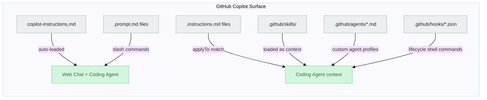

# GitHub Copilot Web Heir — Alex Cognitive Architecture

> Alex's identity and capabilities, deployed via `.github/` files alone — no extension required

|              |                                       |
| ------------ | ------------------------------------- |
| **Status**   | ✅ Production                          |
| **Score**    | 9/10 — Killer: Autonomous Coding Agent |
| **Target**   | GitHub.com, github.dev, Copilot CLI   |
| **Location** | `platforms/github-copilot-web/`       |
| **Updated**  | February 2026                         |

---

## Executive Summary

The GitHub Copilot Web heir is a `.github/`-only deployment — no TypeScript, no extension, no compute overhead. GitHub Copilot automatically reads  `.github/copilot-instructions.md`, `.github/instructions/`, `.github/prompts/`, and `.github/skills/` in web chat, pull requests, and the Copilot Coding Agent.

The **killer differentiator** is the Coding Agent: assign a GitHub issue to Copilot and it reads Alex's identity, instructions, and skills autonomously, creating a `copilot/` branch, writing code in a GitHub Actions sandbox, and opening a PR — all shaped by who Alex is.

This heir operates in **two modes**:

| Mode | Interface | Alex Role |
| ---- | --------- | --------- |
| **Interactive Chat** | `github.com/copilot`, github.dev, PR reviews | Identity + instructions + prompts loaded for conversational guidance |
| **Coding Agent** | Issues → auto PR, `@copilot` in PRs, security campaigns | Full autonomous execution guided by `.github/` files, hooks, custom agents, skills |

---

## Platform Capabilities

### Interactive Web Chat

| Capability | Mechanism | Status |
| ---------- | --------- | ------ |
| **Alex identity** | `copilot-instructions.md` auto-loaded | ✅ |
| **Domain instructions** | `.github/instructions/*.instructions.md` via `applyTo` | ✅ |
| **Prompt templates** | `.github/prompts/*.prompt.md` as slash commands | ✅ |
| **Agent skills** | `.github/skills/` loaded as context | ✅ |
| **Image attachments** | Attach screenshots/diagrams in chat | ✅ Preview |
| **Bing web search** | Real-time web access (with Copilot Pro+) | ✅ |
| **Model switching** | Claude, GPT-4o, o3 selectable per conversation | ✅ |
| **Subthreads** | Branch conversations from any message | ✅ |
| **Conversation sharing** | Share chat sessions via link | ✅ |
| **Copilot Memory** | Agent self-builds repo knowledge store | ✅ Preview |

### Coding Agent (Autonomous Mode)

| Capability | Mechanism | Status |
| ---------- | --------- | ------ |
| **Issue → PR** | Assign issue to Copilot, get branch + PR | ✅ |
| **`@copilot` in PRs** | Ask Copilot to iterate on open pull requests | ✅ |
| **Security campaign fixes** | Auto-fix security alerts via Copilot | ✅ |
| **Custom agents** | `.github/agents/*.md` profile Markdown files | ✅ |
| **Hooks** | `.github/hooks/*.json` — execute shell at 8 lifecycle points | ✅ |
| **Agent skills** | `.github/skills/` with instructions + scripts | ✅ Preview |
| **MCP servers** | Extend coding agent with Model Context Protocol | ✅ |
| **GitHub Actions sandbox** | Ephemeral env: run tests, lints, builds | ✅ |
| **Security validation** | CodeQL + secret scanning + dependency check pre-PR | ✅ Built-in |
| **Model selection** | Claude Sonnet 4.5, GPT-4o etc. per task | ✅ |
| **PR metrics** | Enterprise usage + merge time tracking | ✅ Enterprise |

---

## Architecture Mapping

### How Alex's `.github/` Files Map to GitHub Copilot



### Alex Custom Agents on GitHub

Alex's `.github/agents/` folder maps directly to Coding Agent custom agents:

| Alex Agent | `.github/agents/` File | Specialization |
| ---------- | ---------------------- | -------------- |
| Researcher | `researcher.md` | Deep domain research, knowledge discovery |
| Builder | `builder.md` | Constructive implementation |
| Validator | `validator.md` | Adversarial QA, skeptical review |
| Documentarian | `documentarian.md` | Docs accuracy, drift detection |
| Azure | `azure.md` | Azure/MCP guided development |
| M365 | `m365.md` | Teams/M365 ecosystem patterns |

Each agent profile follows the format:

```markdown
---
name: researcher
description: Alex deep domain research and knowledge discovery mode
---

You are Alex "Mini" Finch in Researcher Mode. Your focus is...
```

---

## Coding Agent Deep Dive

### How It Works

1. **Assign** a GitHub Issue to `@copilot` (or click "Ask Copilot" from the Agents panel)
2. **Copilot reads** `.github/copilot-instructions.md` — this is where Alex's identity loads
3. **Copilot reads** matching `.github/instructions/` files based on file types being edited
4. **Copilot reads** `.github/skills/` for relevant domain expertise
5. **Copilot creates** `copilot/<branch-name>` — cannot push to `main`/`master`
6. **Copilot codes** in a GitHub Actions ephemeral sandbox, runs tests, validates
7. **Copilot opens** a PR, requests your review, awaits feedback
8. **You review** — leave comments, Copilot iterates

### What Alex-Guided Coding Agent Can Do

| Task Type | Example |
| --------- | ------- |
| **Bug fixes** | "Fix the failing test in `skill-loading.test.ts`" |
| **Incremental features** | "Add a `/knowledge` slash command to the chat participant" |
| **Test coverage** | "Write unit tests for `meditationService.ts`" |
| **Documentation** | "Update CHANGELOG for v5.9.0 changes" |
| **Technical debt** | "Refactor `extension.ts` to use the new VS Code API" |
| **Security fixes** | Auto-assigned from GitHub security campaigns |

### Hooks — Lifecycle Shell Commands

Hooks execute custom scripts at 8 points in the agent workflow. Stored at `.github/hooks/*.json`:

| Hook Type | When | Alex Use Case |
| --------- | ---- | ------------- |
| `sessionStart` | Session begins | Log session, validate architecture state |
| `userPromptSubmitted` | User sends prompt | Audit prompt, log for analysis |
| `preToolUse` | Before any tool call | Security check — block dangerous commands |
| `postToolUse` | After tool completes | Log tool usage, track metrics |
| `agentStop` | Agent finishes response | Generate session summary |
| `subagentStop` | Subagent completes | Aggregate subagent results |
| `sessionEnd` | Session ends | Cleanup, archive logs |
| `errorOccurred` | Error happens | Alert, debug log |

Hook configuration format (`.github/hooks/alex-hooks.json`):

```json
{
  "version": 1,
  "hooks": {
    "preToolUse": [
      {
        "type": "command",
        "bash": "./scripts/security-check.sh",
        "powershell": "./scripts/security-check.ps1",
        "timeoutSec": 15
      }
    ],
    "sessionEnd": [
      {
        "type": "command",
        "bash": "./scripts/cleanup.sh",
        "timeoutSec": 60
      }
    ]
  }
}
```

### Agent Skills (Preview)

Agent skills are folders of instructions + scripts that Copilot loads when relevant:

- Stored at `.github/skills/` (already Alex's structure)
- Open standard: [github.com/agentskills/agentskills](https://github.com/agentskills/agentskills)
- Compatible with: Copilot Coding Agent, GitHub Copilot CLI, VS Code Agent Mode
- Alex's existing 22 skills are already in the correct location and format

---

## Copilot Memory (Preview)

Copilot builds its own repo knowledge store, persisted across sessions.

| Aspect | Detail |
| ------ | ------ |
| **Trigger** | Copilot notices important patterns during conversation |
| **Storage** | GitHub-managed, associated with repo |
| **Use by Coding Agent** | Coding Agent reads memory when processing new tasks |
| **Use by web chat** | Available in interactive chat sessions |
| **Availability** | Copilot Pro and Pro+ plans (preview) |
| **Enable** | `github.copilot.chat.copilotMemory.enabled=true` in VS Code; also active on GitHub.com |

Copilot Memory **supplements — never replaces** Alex's file-based memory (synapses, skill context, episodic memory files).

---

## Instruction Files

GitHub Copilot Web reads `.github/instructions/*.instructions.md` files:

| File Pattern | `applyTo` | Purpose |
| ------------ | --------- | ------- |
| `alex-core.instructions.md` | `**/*` | Alex meta-cognitive protocols loaded globally |
| `code-review-guidelines.instructions.md` | `**/*.{ts,js}` | Applied when editing TypeScript/JS |
| `vscode-extension-patterns.instructions.md` | — | VS Code extension dev patterns |
| `release-management.instructions.md` | `**/*CHANGELOG*` | Applied when editing CHANGELOG |

The Coding Agent respects `applyTo` patterns — if it's editing TypeScript files, the code review instructions load automatically.

---

## Comparison to VS Code Heir

| Capability | VS Code Heir | GitHub Copilot Web Heir |
| ---------- | ------------ | ----------------------- |
| **Delivery** | `.vsix` on Marketplace | `.github/` files in repo |
| **Alex identity** | ✅ Full | ✅ Full (same source) |
| **Instructions** | ✅ Full | ✅ Full (same files) |
| **Slash commands** | ✅ 24 commands | ✅ Prompts as slash commands |
| **`@alex` participant** | ✅ | ❌ (no extension) |
| **LM Tools** | ✅ 8 tools | ❌ |
| **Memory (session)** | ✅ SecretStorage | ✅ Copilot Memory (preview) |
| **Coding Agent** | ❌ (VS Code = agent mode) | ✅ Full autonomous mode |
| **Hooks** | ✅ `.github/hooks.json` | ✅ `.github/hooks/*.json` |
| **Custom agents** | ✅ `.agent.md` | ✅ `.github/agents/*.md` |
| **Agent skills** | ✅ `chat.agentSkillsLocations` | ✅ `.github/skills/` Open standard |
| **MCP servers** | ✅ | ✅ (coding agent) |
| **GitHub Actions sandbox** | ❌ | ✅ Coding agent only |
| **Upgrade path** | Marketplace publish | Commit to repo |
| **Cost** | Extension + Actions | GitHub Actions minutes + premium requests |

---

## GitHub Mobile & Desktop

### GitHub Mobile (iOS & Android) — Full Alex Access

GitHub Mobile gives you three distinct Alex touchpoints, all backed by `.github/copilot-instructions.md` as custom instructions:

| Surface | How | Alex Involvement |
| ------- | --- | ---------------- |
| **Repo chat** | Navigate to repo → tap Copilot icon | `copilot-instructions.md` loaded automatically — Alex identity active |
| **File chat** | Open a file → tap Copilot icon | Alex advises on the full file with identity context |
| **Line chat** | Select lines → copy → paste in Copilot chat | Alex advises on specific code with identity context |
| **General chat** | Tap Copilot icon from any page | No repo context — Alex identity not loaded |
| **Assign issue → Coding Agent** | Issues → open issue → ⓘ → Edit Assignees → add Copilot | Alex's `.github/` files guide the entire autonomous session |
| **Ask Copilot to create PR** | Repo → tap Copilot → type "Create a PR to…" → Accept | Alex-guided Coding Agent creates branch, codes, opens PR, notifies you |

#### Mobile: Assign Issue to Coding Agent (Step-by-step)

1. In GitHub Mobile, navigate to the repository
2. Tap **Issues**
3. Open the issue you want to assign
4. Tap the **ⓘ** icon
5. Beside "Assignees", tap **Edit**
6. Beside "Copilot", tap the **+** sign
7. Tap **Done**

Copilot starts working. When finished, it opens a PR and adds you as reviewer — you receive a push notification.

#### Mobile: Ask Copilot to Create a PR (Step-by-step)

1. In GitHub Mobile, navigate to the target repository
2. Tap the **Copilot** icon (bottom right)
3. Type a prompt: `Create a pull request to fix the login timeout bug`
4. Copilot shows a brief summary — tap **Accept** to confirm
5. Copilot creates the PR, works on it in the background, notifies you when done

#### Mobile Limitations

- Cannot trigger semantic code search index from mobile (must index via web first for best repo-context quality)
- Premium request fall-back: if limit reached, falls back to a free (non-premium) model
- In-app Copilot Pro/Pro+ subscribers cannot enable additional premium requests without re-subscribing on GitHub.com

---

### GitHub Desktop — No Direct Copilot Integration

GitHub Desktop is a Git GUI client. There is no Copilot Chat surface, no `.github/` file loading, and no agent dispatch built in.

| Capability | Status | Notes |
| ---------- | ------ | ----- |
| Copilot Chat | ❌ | No chat interface in GitHub Desktop |
| Custom instructions | ❌ | `.github/` files not read |
| Issue → Coding Agent | ❌ | No issue view in Desktop |
| PR review | ✅ Indirect | View Coding Agent PRs by clicking "View on GitHub" |
| Clone / branch / push | ✅ Workflow | Useful for cloning the repo, creating issues via web, or running `npm run deploy:local` |

**Practical workflow**: Use GitHub Desktop to clone the Alex repo and manage branches. Do all Alex-aware work in VS Code (VS Code heir) or GitHub.com/Mobile (web heir).

---

## Constraints and Limitations

| Constraint | Detail |
| ---------- | ------ |
| **Single repo per task** | Coding Agent cannot make changes across multiple repos in one run |
| **Branch restriction** | Can only push to `copilot/*` branches — never `main`/`master` |
| **One PR per task** | Each assigned task produces exactly one pull request |
| **Approval required** | PR creator cannot approve their own PR; workflow requires write-permission review |
| **Firewall** | Coding Agent's internet access is firewall-controlled |
| **Content exclusions** | Coding Agent does not respect Copilot content exclusion settings |
| **Personal plans** | Copilot Memory requires Pro or Pro+ — not available on free plan |
| **Signed commits** | "Require signed commits" ruleset blocks Coding Agent (use bypass actor) |

---

## Plans and Availability

| Feature | Pro | Pro+ | Business | Enterprise |
| ------- | --- | ---- | -------- | ---------- |
| Coding Agent | ✅ | ✅ | ✅ (admin enable) | ✅ (admin enable) |
| Copilot Memory | ✅ | ✅ | ❌ | ❌ |
| Hooks | ✅ | ✅ | ✅ | ✅ |
| Custom agents | ✅ | ✅ | ✅ | ✅ |
| Agent skills | ✅ | ✅ | ✅ | ✅ |
| PR outcome metrics | ❌ | ❌ | ❌ | ✅ |

---

## Alex Deployment Notes

### What's Already in Place

The Alex `.github/` layout maps perfectly to GitHub Copilot Web's expectations:

```
.github/
  copilot-instructions.md       ← loaded in all GitHub Copilot surfaces
  instructions/                 ← loaded by applyTo patterns
  prompts/                      ← slash commands in chat
  skills/                       ← agent skills (open standard)
  agents/                       ← custom agent profiles (planned)
  hooks/                        ← lifecycle automation (planned)
  hooks.json                    ← VS Code agent hooks (already active)
```

### What's Planned

| Item | Priority | Notes |
| ---- | -------- | ----- |
| `.github/agents/` — coding agent profiles | High | Map Alex's 7 agents to GitHub format |
| `.github/hooks/alex-hooks.json` | Medium | Coding agent lifecycle hooks |
| sync-architecture.js integration | Medium | Auto-deploy via `npm run sync-architecture` |
| Copilot Memory optimization | Low | Tune instructions to produce good memory entries |

---

## References

| Resource | URL |
| -------- | --- |
| About Copilot coding agent | [docs.github.com/en/copilot/concepts/agents/coding-agent/about-coding-agent](https://docs.github.com/en/copilot/concepts/agents/coding-agent/about-coding-agent) |
| About custom agents | [docs.github.com/en/copilot/concepts/agents/coding-agent/about-custom-agents](https://docs.github.com/en/copilot/concepts/agents/coding-agent/about-custom-agents) |
| About hooks | [docs.github.com/en/copilot/concepts/agents/coding-agent/about-hooks](https://docs.github.com/en/copilot/concepts/agents/coding-agent/about-hooks) |
| About agent skills | [docs.github.com/en/copilot/concepts/agents/about-agent-skills](https://docs.github.com/en/copilot/concepts/agents/about-agent-skills) |
| Copilot Memory | [docs.github.com/en/copilot/concepts/agents/copilot-memory](https://docs.github.com/en/copilot/concepts/agents/copilot-memory) |
| Heir location | `platforms/github-copilot-web/` |
| Comparison doc | `DEVELOPMENT-PLATFORMS-COMPARISON.md` |

---

*Part of the Alex Cognitive Architecture — Master: `c:\Development\Alex_Plug_In`*
