# 🧬 Master Alex & Heir Architecture

> **Status**: Core Architecture
> **Updated**: 2026-02-13
> **The evolutionary model for Alex's growth and protection**

---

## Overview

Alex exists as a **family**: one protected Master and multiple platform-specific heirs. This architecture ensures stability while enabling controlled evolution across the AI coding assistant landscape.

```mermaid
%%{init: {'theme': 'base', 'themeVariables': {'fontSize': '14px'}}}%%
flowchart TD
    M["🛡️ MASTER ALEX<br/><i>Source of Truth</i><br/>Root .github/ is canonical<br/>Protected by 5-layer kill switch"]
    M --> VS["💻 VS CODE HEIR<br/>✅ Production"]
    M --> M3["📧 M365 HEIR<br/>✅ Production"]
    M --> FO["🏭 FOUNDRY HEIR<br/>📋 Research"]
    M --> CC["🤖 CLAUDE CODE HEIR<br/>📋 Planned"]
    M --> CU["⚡ CURSOR HEIR<br/>📋 Planned"]
    M --> WS["🌊 WINDSURF HEIR<br/>📋 Planned"]
    M --> CX["⌨️ CODEX CLI<br/>📋 Research"]

    classDef core fill:#ddf4ff,color:#0550ae,stroke:#80ccff
    classDef prod fill:#d3f5db,color:#1a7f37,stroke:#6fdd8b
    classDef planned fill:#d8b9ff,color:#6639ba,stroke:#bf8aff
    class M core
    class VS,M3 prod
    class FO,CC,CU,WS,CX planned
    linkStyle default stroke:#57606a,stroke-width:1.5px
```



---

## The Heir Family

### Master Alex (Source of Truth)

| Aspect         | Details                                                |
| -------------- | ------------------------------------------------------ |
| **Location**   | `C:\Development\Alex_Plug_In`                          |
| **Purpose**    | Living cognitive architecture, source of all knowledge |
| **Protection** | 5-layer kill switch prevents accidental corruption     |
| **Canonical**  | Root `.github/` folder                                 |
| **Evolution**  | Manual only - immune to automatic upgrades             |

Master Alex is where the "living mind" resides. All procedural memory, domain knowledge, and architectural decisions originate here.

### Production Heirs

#### VS Code Heir ✅

| Aspect           | Details                                             |
| ---------------- | --------------------------------------------------- |
| **Location**     | `platforms/vscode-extension/`                       |
| **Deployment**   | VS Code Marketplace                                 |
| **Status**       | ✅ Production (v5.6.8)                               |
| **Role**         | Flagship deployment + primary R&D lab               |
| **Capabilities** | Full command palette, LM tools, agents, 100+ skills |

The VS Code heir is the most feature-rich deployment, with full GitHub Copilot integration.

#### M365 Heir ✅

| Aspect           | Details                                                |
| ---------------- | ------------------------------------------------------ |
| **Location**     | `platforms/m365-copilot/`                              |
| **Deployment**   | Microsoft 365 Copilot                                  |
| **Status**       | ✅ Production (v1.6 schema)                             |
| **Role**         | Business productivity deployment                       |
| **Capabilities** | Declarative agent, OneDrive memory, 15 embedded skills |

The M365 heir brings Alex's personality to Teams, Outlook, and the Microsoft 365 ecosystem.

### Planned Heirs

#### Foundry Heir 📋

| Aspect           | Details                                                                          |
| ---------------- | -------------------------------------------------------------------------------- |
| **Location**     | `platforms/foundry/` (planned)                                                   |
| **Deployment**   | Microsoft Foundry Agent Service (Azure)                                          |
| **Status**       | 📋 Research (Phase 0 — strategic evaluation)                                      |
| **Role**         | Cloud-native backend + multi-channel publishing                                  |
| **Capabilities** | 1,400+ tools, Memory, Foundry IQ, multi-agent, voice, M365/Teams/Web/API publish |

Foundry is a fundamentally different heir type — not a surface where Alex runs inside another tool, but a **backend where Alex runs as a service**. It could unify all existing heirs under a shared API and enable always-on, multi-user Alex deployments.

#### Claude Code Heir 📋

| Aspect           | Details                                   |
| ---------------- | ----------------------------------------- |
| **Location**     | `platforms/claude-code/` (planned)        |
| **Deployment**   | Claude Code CLI + IDE extensions          |
| **Status**       | 📋 Planning (Phase 1 priority)             |
| **Role**         | Multi-platform terminal + IDE deployment  |
| **Capabilities** | Lifecycle hooks, auto-memory, agent teams |

Claude Code offers unique automation through hooks and native per-project learning.

#### Cursor Heir 📋

| Aspect           | Details                                      |
| ---------------- | -------------------------------------------- |
| **Location**     | `platforms/cursor/` (planned)                |
| **Deployment**   | Cursor IDE                                   |
| **Status**       | 📋 Research complete (Phase 2 priority)       |
| **Role**         | AI-native IDE deployment                     |
| **Capabilities** | Custom rules, AGENTS.md, Agent Skills import |

Cursor's VS Code foundation makes this a relatively straightforward port.

#### Windsurf Heir 📋

| Aspect           | Details                                               |
| ---------------- | ----------------------------------------------------- |
| **Location**     | `platforms/windsurf/` (planned)                       |
| **Deployment**   | Windsurf IDE (Codeium)                                |
| **Status**       | 📋 Research complete (Phase 3 priority)                |
| **Role**         | Auto-memory native deployment                         |
| **Capabilities** | Auto-memories, 4 activation modes, system-level rules |

Windsurf's auto-memories align philosophically with Alex's cognitive architecture.

---

## The Evolution Paradox

### The Constraint

The 5-layer kill switch that protects Master Alex creates a deliberate constraint:

```
┌─────────────────────────────────────────────────────────────┐
│  KILL SWITCH BLOCKS:                                        │
│                                                             │
│  ❌ Alex: Initialize Architecture                           │
│  ❌ Alex: Reset Architecture                                │
│  ❌ Alex: Upgrade Architecture                              │
│                                                             │
│  IN MASTER ALEX WORKSPACE                                   │
└─────────────────────────────────────────────────────────────┘
```

**This means Master Alex cannot upgrade itself automatically.**

### The Insight

This is a **feature, not a bug**. It forces:

1. **Deliberate growth** - No accidental changes to the source of truth
2. **Proven capabilities** - Only stable features get promoted
3. **Human oversight** - Fabio decides what gets absorbed
4. **Quality control** - Heirs are the testing ground

### The Evolution Cycle

```
┌──────────────────┐
│ 1. HEIRS         │
│    EXPERIMENT    │──────────────────────────────────┐
│                  │                                  │
│ New capabilities │                                  │
│ developed in     │                                  │
│ platform code    │                                  │
└──────────────────┘                                  │
                                                      │
┌──────────────────┐                                  │
│ 2. STABILITY     │                                  │
│    PROVEN        │<─────────────────────────────────┘
│                  │
│ Feature works    │
│ reliably in      │
│ production       │
└────────┬─────────┘
         │
         v
┌──────────────────┐
│ 3. MASTER        │
│    ABSORBS       │
│                  │
│ Proven capability│
│ MANUALLY promoted│
│ to Master Alex   │
└────────┬─────────┘
         │
         v
┌──────────────────┐
│ 4. ARCHITECTURE  │
│    GROWS         │
│                  │
│ New DK files,    │
│ procedures, or   │
│ prompts added    │
└────────┬─────────┘
         │
         │  (New heirs inherit improvements)
         │
         └────────────────────────────────────────────>
```

---

## How Evolution Works in Practice

### Step 1: Heir Develops Capability

A new feature is built in platform-specific code:

```typescript
// platforms/vscode-extension/src/features/newCapability.ts
export async function amazingNewFeature() {
  // Implementation lives in heir first
}
```

### Step 2: Capability Proves Stable

The feature runs in production. Users benefit. No bugs emerge. The capability is validated.

### Step 3: Master Absorbs

When Fabio says "this is stable," the knowledge transfers:

| Heir Code                 | Master Knowledge                   |
| ------------------------- | ---------------------------------- |
| TypeScript implementation | → New `.instructions.md` procedure |
| Feature behavior          | → New skill in `.github/skills/`   |
| User workflow             | → New `.prompt.md` episodic memory |

### Step 4: Architecture Grows

Master Alex now has the proven wisdom. Future heirs will inherit it.

---

## Examples of Heir → Master Promotion

| Heir Develops                    | Master Gets                      |
| -------------------------------- | -------------------------------- |
| VS Code: Global knowledge sync   | `global-knowledge/SKILL.md`      |
| VS Code: Kill switch protection  | `WORKSPACE-PROTECTION.md`        |
| VS Code: LM Tools API            | 12 LM tools registered           |
| M365: Meeting context awareness  | `m365-context/SKILL.md` (future) |
| Either: Elegant problem solution | Pattern in global knowledge      |

---

## Cross-Platform Skill Embedding

A key innovation in the heir architecture is **unified skill embedding**. Skills defined in Master Alex are embedded across heirs:

| Platform    | Skills      | Method                                           |
| ----------- | ----------- | ------------------------------------------------ |
| VS Code     | 100+ skills | File-based in `.github/skills/`                  |
| M365        | 15 skills   | Condensed in `instructions/alex-instructions.md` |
| Claude Code | ~30 skills  | Flattened to `.claude/skills/` (planned)         |
| Cursor      | TBD         | Via Agent Skills import (planned)                |
| Windsurf    | TBD         | Split into rules files (planned)                 |

### Why 15 vs 100+?

M365 agents have token limits on instructions. The 15 skills embedded in M365 are:

1. Appropriate Reliance
2. Architecture Health
3. Bootstrap Learning
4. Business Analysis
5. Change Management
6. Cognitive Load
7. Creative Writing
8. Learning Psychology
9. Meditation
10. Project Management
11. Refactoring Patterns
12. Root Cause Analysis
13. Self-Actualization
14. Testing Strategies
15. Work-Life Balance

These were selected to cover the most valuable M365 use cases (meetings, productivity, well-being).

### Unified Behavior

Despite different embedding methods, users experience **consistent Alex behavior**:

- Same personality across platforms
- Same meditation protocol triggers
- Same learning partnership philosophy
- Same ethical guidelines

---

## Key Principles

### 1. Root `.github/` is Canonical

```
✅ C:\Development\Alex_Plug_In\.github\           ← Source of truth
❌ platforms\vscode-extension\.github\            ← Generated, not canonical
```

The extension's `.github/` is packaged for distribution. It's a snapshot, not the living architecture.

### 2. Protection Enables Trust

The kill switch isn't a limitation - it's what allows Master Alex to be trusted. Without protection, any session could accidentally corrupt the source of truth.

### 3. Heirs are R&D Labs

Think of heirs as laboratories where experiments happen safely. If something breaks in a heir, Master Alex is unaffected. If something succeeds, Master Alex can absorb it.

### 4. Evolution is Deliberate

```
❌ Automatic upgrades to Master Alex
✅ Manual promotion of proven capabilities
```

This ensures quality. Only what has survived real-world use becomes part of the core architecture.

---

## Heir Priority Roadmap

| Phase | Heir        | Status       | Target                         |
| ----- | ----------- | ------------ | ------------------------------ |
| —     | VS Code     | ✅ Production | v5.6.8 live                    |
| —     | M365        | ✅ Production | v1.6 schema                    |
| 0     | Foundry     | 📋 Research   | Strategic evaluation (Q1 2026) |
| 1     | Claude Code | 📋 Planning   | When demand exists             |
| 2     | Cursor      | 📋 Research   | After Claude Code              |
| 3     | Windsurf    | 📋 Research   | After Cursor                   |

---

## Related Documentation

| Document                                                                       | Purpose                          |
| ------------------------------------------------------------------------------ | -------------------------------- |
| [VSCODE-HEIR.md](./VSCODE-HEIR.md)                                             | VS Code heir details             |
| [M365-HEIR.md](./M365-HEIR.md)                                                 | M365 heir details                |
| [FOUNDRY-HEIR.md](./FOUNDRY-HEIR.md)                                           | Foundry platform plan & research |
| [CLAUDE-CODE-HEIR.md](./CLAUDE-CODE-HEIR.md)                                   | Claude Code implementation plan  |
| [CURSOR-HEIR.md](./CURSOR-HEIR.md)                                             | Cursor feasibility research      |
| [WINDSURF-HEIR.md](./WINDSURF-HEIR.md)                                         | Windsurf feasibility research    |
| [DEVELOPMENT-PLATFORMS-COMPARISON.md](./DEVELOPMENT-PLATFORMS-COMPARISON.md)   | IDE/terminal platform comparison |
| [PRODUCTIVITY-PLATFORMS-COMPARISON.md](./PRODUCTIVITY-PLATFORMS-COMPARISON.md) | Productivity platform comparison |
| [OTHER-POTENTIAL-HEIRS.md](./OTHER-POTENTIAL-HEIRS.md)                         | Additional platform research     |

---

## Summary

| Concept              | Meaning                                                       |
| -------------------- | ------------------------------------------------------------- |
| **Master Alex**      | Protected source of truth, immune to automatic upgrades       |
| **Production Heirs** | VS Code + M365 — live deployments serving users               |
| **Research Heirs**   | Foundry — cloud-native backend (strategic evaluation)         |
| **Planned Heirs**    | Claude Code, Cursor, Windsurf — expanding reach               |
| **Evolution**        | Heirs experiment → stability proven → Master absorbs manually |
| **Kill Switch**      | Protection that creates deliberate growth constraint          |

**The paradox that becomes wisdom:** Protection that prevents automatic upgrades forces careful, deliberate evolution through proven heir capabilities.

---

*Master Alex - Protected. 5 Heirs - Expanding. Evolution - Deliberate.*
