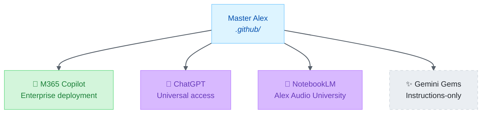

# Productivity Platforms Comparison

> Comprehensive comparison of AI productivity platforms and Alex heir positioning

|             |                                                              |
| ----------- | ------------------------------------------------------------ |
| **Updated** | 2026-02-13                                                   |
| **Purpose** | Feature comparison across productivity/business AI platforms |
| **Related** | [Development Platforms](DEVELOPMENT-PLATFORMS-COMPARISON.md) |

---

## Executive Summary

This document compares AI **productivity platforms** (business assistants, knowledge tools, conversational AI) and how Alex heirs can augment them. For development platforms (IDEs, terminals), see [DEVELOPMENT-PLATFORMS-COMPARISON.md](DEVELOPMENT-PLATFORMS-COMPARISON.md).

### Platform Overview

| Platform         | Vendor     | Interface   | Customization      | Alex Heir Status |
| ---------------- | ---------- | ----------- | ------------------ | ---------------- |
| **M365 Copilot** | Microsoft  | Office apps | Declarative agents | ✅ Production     |
| **ChatGPT**      | OpenAI     | Web/Mobile  | Custom GPTs        | 📋 Research       |
| **NotebookLM**   | Google     | Web         | Sources only       | 📋 Research       |
| **Gemini Gems**  | Google     | Web/Mobile  | Instructions only  | ⏸️ Low Priority   |
| **Perplexity**   | Perplexity | Web/Mobile  | API only           | ❌ Not Planned    |
| **Amazon Q**     | AWS        | CLI/IDE     | N/A                | ❌ Competitor     |

### Key Differences from Development Platforms

| Aspect               | Development Platforms            | Productivity Platforms         |
| -------------------- | -------------------------------- | ------------------------------ |
| **Primary audience** | Software developers              | Knowledge workers, researchers |
| **Interface**        | IDE, terminal, code editor       | Web, mobile, Office apps       |
| **Customization**    | Files in repo (`.github/`, etc.) | UI-based configuration         |
| **Alex value**       | Full cognitive architecture      | Personality + domain expertise |
| **Extension model**  | APIs, plugins, extensions        | Instructions, knowledge files  |
| **Memory model**     | Synapses, auto-memory            | Chat history, sources          |

---

## Platform Winners by Category

| Category                  | Winner         | Runner-Up      | Notes                                        |
| ------------------------- | -------------- | -------------- | -------------------------------------------- |
| **Knowledge Synthesis**   | 🥇 NotebookLM   | 🥈 M365 Copilot | Up to 600 sources, deep cross-reference      |
| **Business Integration**  | 🥇 M365 Copilot | 🥈 ChatGPT      | Native Office, SharePoint, Teams integration |
| **Conversational AI**     | 🥇 ChatGPT      | 🥈 Gemini       | Best general-purpose chat, Custom GPTs       |
| **Research Assistant**    | 🥇 Perplexity   | 🥈 ChatGPT      | Citation-first, real-time search             |
| **Audio/Multimodal**      | 🥇 NotebookLM   | 🥈 ChatGPT      | Audio Overview, Video Overview unique        |
| **Alex Customization**    | 🥇 ChatGPT      | 🥈 M365 Copilot | Instructions + knowledge files + actions     |
| **Enterprise Deployment** | 🥇 M365 Copilot | 🥈 ChatGPT Team | Native Azure AD, compliance, governance      |
| **Source-Based Learning** | 🥇 NotebookLM   | 🥈 M365 Copilot | Everything tied to uploaded documents        |

### Summary: Best Platform For...

| Use Case                  | Best Platform  | Why                                   |
| ------------------------- | -------------- | ------------------------------------- |
| **Full Alex experience**  | M365 Copilot   | Most agent customization potential    |
| **Quick Alex deployment** | ChatGPT        | Custom GPTs are simplest to create    |
| **Research deep-dives**   | NotebookLM     | Source-grounded, audio summaries      |
| **Real-time research**    | Perplexity     | Citation-first, web search integrated |
| **Learning/education**    | NotebookLM     | Audio Overview makes study podcast    |
| **Business productivity** | M365 Copilot   | Native in Word, Excel, Teams, Outlook |
| **Mobile AI assistant**   | ChatGPT/Gemini | Best mobile apps                      |

---

## Native Platform Capabilities

### Feature Matrix

| Feature                 |      M365 Copilot       |        ChatGPT         |       NotebookLM        |   Gemini Gems    | Perplexity |
| ----------------------- | :---------------------: | :--------------------: | :---------------------: | :--------------: | :--------: |
| **Custom Instructions** |       ✅ Manifest        | ✅ 8,000 chars + 32K KB |   ⚠️ Per-notebook only   |  ✅ Instructions  |     ❌      |
| **Knowledge Files**     | ✅ SharePoint + OneDrive | ✅ 20 files max (512MB) |    ✅ 600 sources max    |        ❌         |     ❌      |
| **Custom Actions**      |  ✅ API plugins + Graph  | ✅ OpenAPI 3.0 + OAuth  |            ❌            |        ❌         |   ✅ API    |
| **Code Interpreter**    |   ✅ Python execution    |    ✅ Advanced Data     |            ❌            |        ❌         |     ❌      |
| **Image Generation**    | ✅ GraphicArt capability |        ✅ DALL-E        |            ❌            |    ✅ Imagen 3    |     ❌      |
| **Audio Output**        |          ⚠️ TTS          |   ⚠️ Voice mode only    | ✅ Audio Overview native |      ⚠️ TTS       |     ❌      |
| **Video Processing**    |            ❌            |           ❌            |    ✅ YouTube analyze    |        ❌         |     ❌      |
| **Web Search**          |     ✅ Bing grounded     |    ✅ Browsing mode     |     ✅ Deep Research     |    ✅ Grounded    |  ✅ Native  |
| **Team Sharing**        |    ✅ Org deployment     |  ✅ GPT Store + Teams   |     ✅ Collaboration     |  ⚠️ Share prompt  |  ⚠️ Spaces  |
| **Enterprise Ready**    |    ✅ Full compliance    |  ✅ ChatGPT Enterprise  |   ⚠️ Google Workspace    |   ⚠️ Workspace    | ⚠️ Business |
| **API Access**          |       ✅ Graph API       |    ✅ Assistants API    |            ❌            |   ✅ Gemini API   | ✅ Full API |
| **Mobile App**          |       ✅ M365 apps       |        ✅ Native        |       ❌ Web only        |     ✅ Native     |  ✅ Native  |
| **Reasoning Models**    | ✅ GPT-5.2 + Sonnet 4.5  |     ✅ o1/o3 access     |      ✅ Gemini 2.0       | ✅ Gemini 2.0 Pro |     ❌      |
| **Model Selection**     |    ✅ Multi-model UI     |     ✅ Model picker     |            ❌            |        ❌         |     ❌      |

### Customization Depth Comparison

| Platform         | Instructions | Knowledge Files     | Actions/Tools       | Sharing       |
| ---------------- | ------------ | ------------------- | ------------------- | ------------- |
| **M365 Copilot** | Manifest     | SharePoint/OneDrive | Graph API + plugins | Org-wide      |
| **ChatGPT**      | 8,000 chars  | 20 files / 512 MB   | OpenAPI + OAuth     | GPT Store     |
| **NotebookLM**   | Per-notebook | 600 sources         | None                | Collaboration |
| **Gemini Gems**  | Instructions | None                | None                | Share link    |
| **Perplexity**   | None         | None                | API only            | Spaces        |

### Unique Platform Features

| Platform         | Unique Feature            | Description                                        |
| ---------------- | ------------------------- | -------------------------------------------------- |
| **M365 Copilot** | Office Native Integration | AI built into Word, Excel, PowerPoint, Outlook     |
| **M365 Copilot** | Multi-Model Selection     | GPT-5.2 + Claude Sonnet 4.5 with reasoning toggles |
| **ChatGPT**      | Custom GPTs + Store       | Build and share specialized assistants             |
| **NotebookLM**   | Audio Overview            | AI-generated podcast from your sources             |
| **NotebookLM**   | Video Overview            | Auto-generated video summaries                     |
| **NotebookLM**   | Mind Maps                 | Visual knowledge maps from sources                 |
| **Gemini Gems**  | Google Search Integration | Grounded in real-time search                       |
| **Perplexity**   | Citation-First Answers    | Every claim linked to source                       |

---

## Alex Augmentation by Platform

### What Alex Adds to Each Platform

#### M365 Copilot → Alex (Production)

| Native Capability     | + Alex Augmentation                               |
| --------------------- | ------------------------------------------------- |
| Declarative Agent     | → Alex personality manifest (schema v1.6)         |
| SharePoint knowledge  | → Curated Alex skills and memory files            |
| Graph API actions     | → Integration with external Alex services         |
| Office integration    | → Alex in Word, Excel, PowerPoint, Teams, Outlook |
| Code Interpreter      | → Python data analysis, visualizations            |
| Image Generation      | → GraphicArt capability for visuals               |
| Enterprise deployment | → Organization-wide Alex rollout                  |

**Declarative Agent Host Apps** (New in 2026):
- **Teams Chat** — Primary interaction surface
- **Word** — Document-context assistance (NEW)
- **PowerPoint** — Presentation assistance (NEW)
- **Outlook** — Email-context help

**Alex Value-Add Score: 9/10** — Full capabilities, expanded host apps

#### ChatGPT → Alex (Research)

| Native Capability    | + Alex Augmentation                         |
| -------------------- | ------------------------------------------- |
| Custom instructions  | → Alex identity and protocols (8,000 chars) |
| Knowledge files (20) | → Top 20 Alex skills as uploaded files      |
| Custom actions       | → Potential MCP bridge or Alex API          |
| GPT Store            | → Public "Alex" GPT for community           |
| Voice mode           | → Text-to-speech persona                    |

**Alex Value-Add Score: 5/10** — Good reach, limited depth

#### NotebookLM → Alex (Research)

| Native Capability | + Alex Augmentation                                        |
| ----------------- | ---------------------------------------------------------- |
| Source-first      | → Alex skills become uploadable knowledge sources          |
| Audio Overview    | → "Alex Audio University" — learn via AI-generated podcast |
| Video Overview    | → Video explanations of Alex concepts                      |
| Mind Maps         | → Visual synapse network from Alex documentation           |
| Up to 600 sources | → Comprehensive Alex knowledge base                        |
| Deep Research     | → Alex-guided research sessions                            |

**Alex Value-Add Score: 4/10** — Unique positioning, no instructions

#### Gemini Gems → Alex (Low Priority)

| Native Capability | + Alex Augmentation          |
| ----------------- | ---------------------------- |
| Instructions      | → Alex personality only      |
| Google Search     | → Grounded Alex responses    |
| No knowledge      | → Cannot upload Alex skills  |
| Share link        | → Distribute Alex Gem easily |

**Alex Value-Add Score: 3/10** — Instructions-only limits depth

#### Perplexity (Not Planned)

| Native Capability | Alex Compatibility |
| ----------------- | ------------------ |
| No customization  | Cannot deploy Alex |
| API-focused       | Not an AI platform |
| Citation-first    | Different paradigm |

**Alex Value-Add Score: 0/10** — Not a customizable platform

---

## Heir Feature Parity

### Core Alex Features Across Productivity Heirs

| Feature                  |   M365 Copilot    |     ChatGPT     |     NotebookLM      |  Gemini Gems   | Perplexity |
| ------------------------ | :---------------: | :-------------: | :-----------------: | :------------: | :--------: |
| **Alex Personality**     |    ✅ Manifest     | ✅ Instructions  |     ❌ No custom     | ⚠️ Instructions |     ❌      |
| **Learning Partnership** | ✅ Guided sessions | ✅ Conversation  |   ⚠️ Source-driven   |   ⚠️ Limited    |     ❌      |
| **Meditation Protocol**  |  ⚠️ Manual prompt  | ⚠️ Manual prompt |          ❌          |       ❌        |     ❌      |
| **Dream Processing**     |         ❌         |        ❌        |          ❌          |       ❌        |     ❌      |
| **Self-Actualization**   |         ❌         |        ❌        |          ❌          |       ❌        |     ❌      |
| **Skills**               | ⚠️ SharePoint docs | ⚠️ 20 files max  | ✅ Up to 600 sources |       ❌        |     ❌      |
| **Synapse Network**      |         ❌         |        ❌        |          ❌          |       ❌        |     ❌      |
| **Extension Commands**   |         ❌         |        ❌        |          ❌          |       ❌        |     ❌      |
| **Agent Ecosystem**      |  ⚠️ Single agent   |  ⚠️ Single GPT   |          ❌          |       ❌        |     ❌      |
| **Audio Output**         |       ⚠️ TTS       |  ⚠️ Voice mode   |  ✅ Audio Overview   |     ⚠️ TTS      |     ❌      |

### Unique Platform Advantages

| Platform         | Unique Strength          | Alex Benefit                     |
| ---------------- | ------------------------ | -------------------------------- |
| **M365 Copilot** | Office suite integration | Alex in Word/Excel/Teams/Outlook |
| **ChatGPT**      | Custom GPT ecosystem     | Easy deployment, wide reach      |
| **NotebookLM**   | Audio/Video Overview     | "Alex Audio University" learning |
| **Gemini Gems**  | Google Search grounding  | Real-time web knowledge          |
| **Perplexity**   | Citation-first research  | N/A — incompatible               |

### Platform-Specific Limitations

| Platform         | Key Limitation          | Impact on Alex                          |
| ---------------- | ----------------------- | --------------------------------------- |
| **M365 Copilot** | Complex deployment      | Requires O365 admin, Azure AD           |
| **ChatGPT**      | 8K instruction limit    | Must compress Alex identity             |
| **ChatGPT**      | 20 file limit           | Must prioritize which skills to include |
| **NotebookLM**   | No custom instructions  | Alex personality doesn't transfer       |
| **NotebookLM**   | Source-first only       | Everything must be document-based       |
| **Gemini Gems**  | No knowledge files      | Cannot include Alex skills              |
| **Perplexity**   | No customization at all | Cannot deploy Alex                      |

---

## Pricing Comparison

| Platform         | Free Tier             | Paid Tier                      | Enterprise                   |
| ---------------- | --------------------- | ------------------------------ | ---------------------------- |
| **M365 Copilot** | ❌ None                | $30/user/month (M365)          | Copilot for M365 Enterprise  |
| **ChatGPT**      | ✅ Limited GPT-4       | $20/month Plus, $200/month Pro | ChatGPT Enterprise ~$60/user |
| **NotebookLM**   | ✅ 50 sources/notebook | Plus $9.99/mo, Pro $49.99/mo   | Ultra (coming)               |
| **Gemini Gems**  | ✅ Free with Gemini    | Gemini Advanced $20/month      | Google Workspace AI          |
| **Perplexity**   | ✅ Limited searches    | $20/month Pro                  | Perplexity Business          |

---

## Deployment Comparison

### What Transfers from Master Alex

| Component                   |      M365 Copilot       |        ChatGPT        |       NotebookLM       |    Gemini Gems     |
| --------------------------- | :---------------------: | :-------------------: | :--------------------: | :----------------: |
| **copilot-instructions.md** | → Manifest instructions | → GPT instructions 8K |      ❌ No custom       | → Gem instructions |
| **.instructions.md (28)**   |   → SharePoint docs?    | ❌ Won't fit 20 files  |  ✅ Upload as sources   |       ❌ Lost       |
| **.prompt.md (17)**         |   ❌ No prompt system    |        ❌ Lost         |  ✅ Upload as sources   |       ❌ Lost       |
| **.agent.md (6)**           |     ⚠️ Single agent      |     ⚠️ Single GPT      |      ❌ No agents       |    ❌ No agents     |
| **Skills (108)**            |     ⚠️ Select files      |   ⚠️ Top 20 as files   |   ✅ Upload SKILL.md    |       ❌ Lost       |
| **synapses.json**           |      ❌ No concept       |     ❌ No concept      | ⚠️ Mind Map alternative |    ❌ No concept    |
| **Extension commands**      |  ❌ Different paradigm   |        ❌ Lost         |         ❌ Lost         |       ❌ Lost       |

### Deployment Effort

| Platform         | Technical | Effort  | Risk  |   Priority   |
| ---------------- | :-------: | :-----: | :---: | :----------: |
| **M365 Copilot** |   7/10    |  Done   |   —   |      ✅       |
| **ChatGPT**      |   4/10    |   Low   |  Low  |   Phase 1    |
| **NotebookLM**   |   3/10    |   Low   |  Low  |   Phase 1    |
| **Gemini Gems**  |   2/10    | Trivial | None  | Deprioritize |
| **Perplexity**   |   0/10    |   N/A   |  N/A  |     Skip     |

---

## Recommendations

### Target Audience per Heir

| Heir             | Best For                                |
| ---------------- | --------------------------------------- |
| **M365 Copilot** | Enterprise users in Microsoft ecosystem |
| **ChatGPT**      | General public, quick Alex experience   |
| **NotebookLM**   | Researchers, students, learners         |
| **Gemini Gems**  | Google ecosystem users (low priority)   |
| **Perplexity**   | N/A — not a deployment platform         |

### Implementation Priority

| Priority | Platform         | Rationale                                   |
| :------: | ---------------- | ------------------------------------------- |
|    ✅     | **M365 Copilot** | **Deployed** — enterprise heir operational  |
|    1     | **ChatGPT**      | Widest reach, easiest deployment, GPT Store |
|    2     | **NotebookLM**   | Unique "Alex University" positioning        |
|    3     | **Gemini Gems**  | Very limited — instructions only            |
|    —     | **Perplexity**   | Skip — not customizable                     |

### Killer Features by Heir

| Heir             | Killer Feature              | Why It's Unique                                |
| ---------------- | --------------------------- | ---------------------------------------------- |
| **M365 Copilot** | 📊 **Alex in Office Suite**  | AI learning partner in Word, Excel, PowerPoint |
| **ChatGPT**      | 🌍 **Universal Alex Access** | Anyone can use Alex via GPT Store, no setup    |
| **NotebookLM**   | 🎧 **Alex Audio University** | Learn Alex concepts via AI-generated podcasts  |
| **Gemini Gems**  | 🔍 **Search-Grounded Alex**  | Real-time web knowledge (if deployed)          |

### Cross-Platform Strategy

---

## Appendix: Detailed Platform Analysis

### M365 Copilot Deep Dive

**Platform Type:** Enterprise AI Assistant
**Deployment Model:** Declarative Agent in Microsoft 365

**Strengths:**
- Multi-model: GPT-5.2 (with Think Deeper reasoning) + Claude Sonnet 4.5
- Native integration with Word, Excel, PowerPoint, Outlook, Teams
- SharePoint/OneDrive knowledge base
- Graph API for powerful custom actions
- Enterprise-grade security and compliance
- Organization-wide deployment
- User-selectable model and reasoning depth (Auto/Quick/Think Deeper)

**Limitations:**
- Requires M365 E3/E5 + Copilot license
- Complex deployment process
- Admin required for org-wide rollout
- Limited compared to IDE customization

### ChatGPT Deep Dive

**Platform Type:** Conversational AI with Custom GPTs
**Deployment Model:** Custom GPT via ChatGPT

**Strengths:**
- 8,000 character instructions
- 20 knowledge files (512MB total)
- Custom actions via OpenAPI 3.0
- GPT Store for distribution
- Voice mode available

**Limitations:**
- Character limit forces compression
- 20 file limit (of 100+ skills)
- No lifecycle hooks or automation
- Session-based, no persistent memory

**GPT Store Opportunity:**
- Publish "Alex GPT" for free access
- Could include top skills as knowledge files
- Instructions encode core personality

### NotebookLM Deep Dive

**Platform Type:** AI Research & Study Assistant
**Deployment Model:** Source-Based Notebook

**Strengths:**
- Up to 600 sources per notebook (Pro)
- Audio Overview — AI-generated podcast explanations
- Video Overview — auto-generated video summaries
- Mind Maps — visual knowledge representation
- Deep Research — extended research sessions
- YouTube video analysis
- Slides generation

**Limitations:**
- No custom instructions
- Alex personality doesn't transfer
- Everything must be source documents
- No real "agent" or "assistant" mode

**Unique Positioning:**
"Alex Knowledge University" — upload all Alex documentation as sources, generate Audio Overviews to learn Alex concepts via podcast format.

### Gemini Gems Deep Dive

**Platform Type:** Customizable Gemini Assistant
**Deployment Model:** Custom Gem with Instructions

**Strengths:**
- Simple to create (instructions only)
- Google Search grounding
- Gemini 2.0 access
- Easy sharing via link

**Limitations:**
- **NO knowledge files** — critical limitation
- Instructions only — no uploaded context
- Cannot include Alex skills or documentation
- Very shallow customization

**Assessment:** Low priority due to missing knowledge file support. Gemini Gems are essentially "prompted Gemini" without the ability to provide supporting documentation.

### Perplexity Assessment

**Platform Type:** AI Search Engine
**Deployment Model:** API-only

**Why Not a Deployment Target:**
- Not customizable — no instructions, no agents
- Research tool, not AI assistant platform
- API-focused for developers
- Spaces are collaborative, not personalized

**Conclusion:** Perplexity is a powerful research tool but not a platform for deploying Alex heirs.

---

## Platform Research Sources

| Platform     | Documentation URL                               |
| ------------ | ----------------------------------------------- |
| M365 Copilot | https://learn.microsoft.com/en-us/copilot/      |
| ChatGPT      | https://help.openai.com/en/articles/custom-gpts |
| NotebookLM   | https://notebooklm.google.com/                  |
| Gemini Gems  | https://gemini.google.com/gems                  |
| Perplexity   | https://www.perplexity.ai/                      |

---

*Comparing productivity platforms to extend Alex's reach beyond development into knowledge work*
