# VS Code 1.109 Implementation Plan

> **Created:** 2026-02-04
> **Target Versions:** v4.2.5 to v4.4.0
> **Status:** Phase 1 Complete (v4.2.5 published)
> **Owner:** Master Alex + VS Code Heir

---

## 📋 Task List (Quick Reference)

> **Effort columns:** Human = traditional estimate, Alex = AI-assisted estimate
> See [alex-effort-estimation skill](../.github/skills/alex-effort-estimation/SKILL.md) for methodology

### Remaining Tasks

| # | Task | Phase | Owner | Human | Alex | Status |
|:-:|------|:-----:|-------|:-----:|:----:|:------:|
| 10 | Research community orchestration patterns | 4 | Master | 4h | 🔄 25m | ⬜ |
| 11 | Design Alex orchestrator architecture | 4 | Master | 4h | ⏱️ 45m | ⬜ |
| 12 | Implement alex-orchestrator.agent.md | 4 | Master | 4h | 🔄 30m | ⬜ |
| 17 | Test skills with `chat.agentSkillsLocations` | 2 | Heir | 2h | 🔄 20m | ⬜ |
| 22 | Create TDD workflow (Red/Green/Refactor) | 4 | Master | 4h | ⏱️ 40m | ⬜ |
| 23 | Test parallel subagent execution | 4 | Heir | 4h | ⏱️ 1h | ⬜ |
| 24 | Implement background agent handoff | 4 | Heir | 4h | ⏱️ 45m | ⬜ |
| 25 | Document skill format in SKILL-ARCHITECTURE.md | 2 | Master | 1h | 🔄 15m | ⬜ |
| 26 | Document agents in USER-MANUAL | 3 | Master | 2h | 🔄 20m | ⬜ |
| 27 | Document orchestration patterns | 4 | Master | 2h | 🔄 20m | ⬜ |

**Remaining:** Human 31h → Alex ~5.5h

### Progress Summary

| Phase | Version | Status | Human Est. | Alex Est. |
|-------|---------|:------:|:----------:|:---------:|
| 1. Foundation + Agents | v4.2.5 | ✅ Complete | 18h | ~2h actual |
| 2. Skills Audit | v4.3.0-prep | ⬜ Pending | 5h | ~1h |
| ~~3. Custom Agents~~ | ~~v4.3.0~~ | ✅ Merged | — | — |
| 4. Orchestration | v4.3.0+ | ⬜ Pending | 26h | ~4h |
| **Total Remaining** | | | **31h** | **~5h** |

---

## ⚠️ Architecture Decision: Consolidated Agents

**Original Plan:** 4 separate agents (meditate, learn, dream, review)
**Actual Implementation:** 1 consolidated Alex agent with 6 slash commands + 2 handoff agents

**Why:** VS Code 1.109 registers `.prompt.md` files as slash commands automatically. This gives better UX than switching agents — users stay in one Alex context with `/meditate`, `/dream`, `/learn`, `/review`, `/tdd`, `/selfactualize` commands available.

**Result:** Tasks 6-9, 18-21 replaced by consolidated approach. Simpler, better UX.

---

## Completed Tasks (Phase 1)

### P0 — Critical Path

| # | Task | Phase | Owner | Human | Alex | Status |
|:-:|------|:-----:|-------|:-----:|:----:|:------:|
| 1 | Update engine to `^1.109.0` | 1 | Heir | 30m | ⚡ 5m | ✅ |
| 2 | Document recommended settings in USER-MANUAL | 1 | Master | 2h | 🔄 20m | ✅ |
| 3 | Update copilot-instructions.md settings section | 1 | Master | 1h | ⚡ 10m | ✅ |
| 4 | Audit all SKILL.md files for required frontmatter | 2 | Master | 4h | ⏱️ 45m | ✅ |
| 5 | Create skill validation script | 2 | Heir | 2h | 🔄 25m | ✅ |
| 6 | ~~Design 4 core agents~~ → Consolidated agent approach | 1 | Master | 2h | 🔄 20m | ✅ |
| 7 | Create `.github/agents/` with 3 agents (Alex, Azure, M365) | 1 | Master | 1h | ⚡ 10m | ✅ |
| 8 | ~~alex-meditate.agent.md~~ → 6 slash command .prompt.md files | 1 | Master | 1h | ⚡ 10m | ✅ |
| 9 | ~~alex-learn.agent.md~~ → Agent handoffs to Azure/M365 | 1 | Master | 1h | ⚡ 10m | ✅ |

### P1 — High Priority

| # | Task | Phase | Owner | Human | Alex | Status |
|:-:|------|:-----:|-------|:-----:|:----:|:------:|
| 13 | Update markdown-mermaid skill for native rendering | 1 | Master | 1h | 🔄 15m | ✅ |
| 14 | Add Anthropic settings to setup wizard | 1 | Heir | 2h | 🔄 25m | ✅ |
| 15 | Test extended thinking with meditation workflows | 1 | Master | 2h | ⏱️ 45m | ✅ |
| 16 | Fix any non-compliant skills | 2 | Master | 2h | 🔄 20m | ✅ |
| 18 | ~~alex-dream.agent.md~~ → Refactor dream to synapse-core.ts | 1 | Heir | 2h | ⏱️ 45m | ✅ |
| 19 | ~~alex-review.agent.md~~ → dream-cli.ts for terminal usage | 1 | Heir | 30m | ⚡ 10m | ✅ |
| 20 | ~~Handoff workflows~~ → Built into alex.agent.md | 1 | Master | 1h | ⚡ 10m | ✅ |
| 21 | Test agent switching and Azure/M365 handoffs | 1 | Heir | 1h | 🔄 15m | ✅ |

**Phase 1 Actual:** Human estimate 26h → Alex actual ~4h (6.5× acceleration)

### Architecture Overview

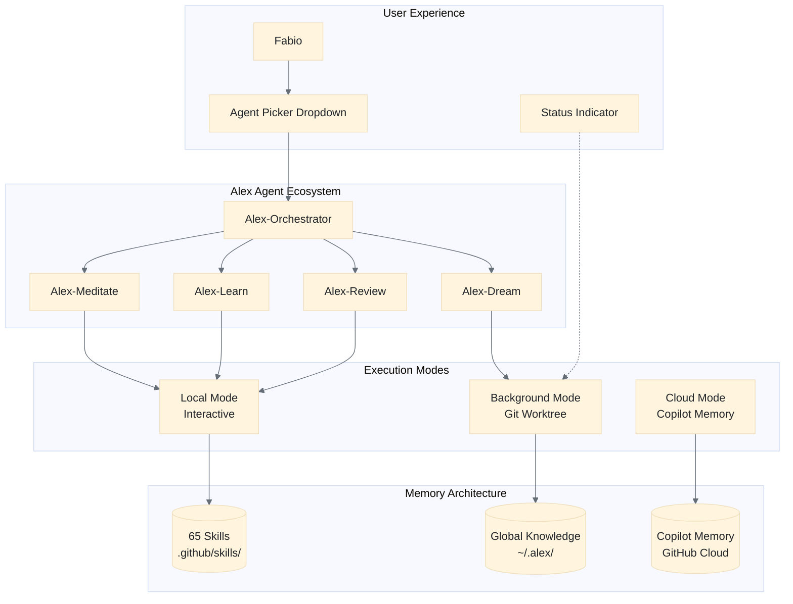

### Strategic Goals

1. **Native Integration** — Register Alex skills/agents through VS Code's official contribution points
2. **Alex Personas** — Create specialized agents for meditation, learning, review, and dream workflows
3. **Orchestration** — Build multi-agent workflows that leverage context isolation
4. **Enhanced Cognition** — Leverage Anthropic's extended thinking for complex tasks
5. **Cross-Platform Memory** — Integrate Copilot Memory with our Global Knowledge system

---

## Use Cases

### Use Case 1: Alex Meditation Agent

**Scenario:** User wants deep consolidation after a learning session.

**Current Flow:**
1. User triggers `/meditate` in chat
2. Copilot reads `unified-meditation-protocols.prompt.md`
3. Single context window handles entire meditation

**New Flow with Custom Agents:**

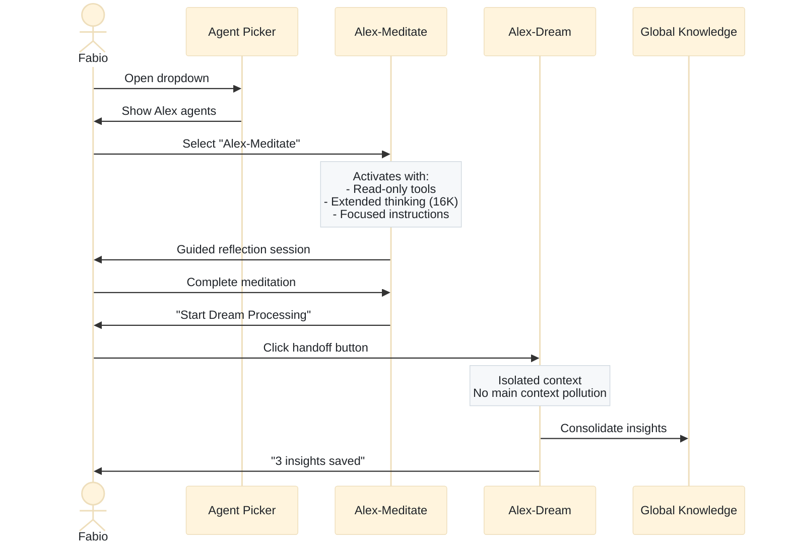

1. User selects "Alex-Meditate" from agents dropdown
2. Alex-Meditate agent activates with:
   - Read-only tools (no accidental edits during reflection)
   - Extended thinking enabled (16K budget for deep reasoning)
   - Focused instructions from embedded protocol
3. When ready, handoff button: "Start Dream Processing"
4. Alex-Dream subagent processes in isolated context
5. Results aggregated without polluting main context

**Benefits:**
- Clean separation of concerns
- Context isolation prevents bloat
- Visual workflow with handoff buttons
- User can track progress across agents

---

### Use Case 2: Bootstrap Learning with Subagents

**Scenario:** User wants to learn a new domain (e.g., Kubernetes).

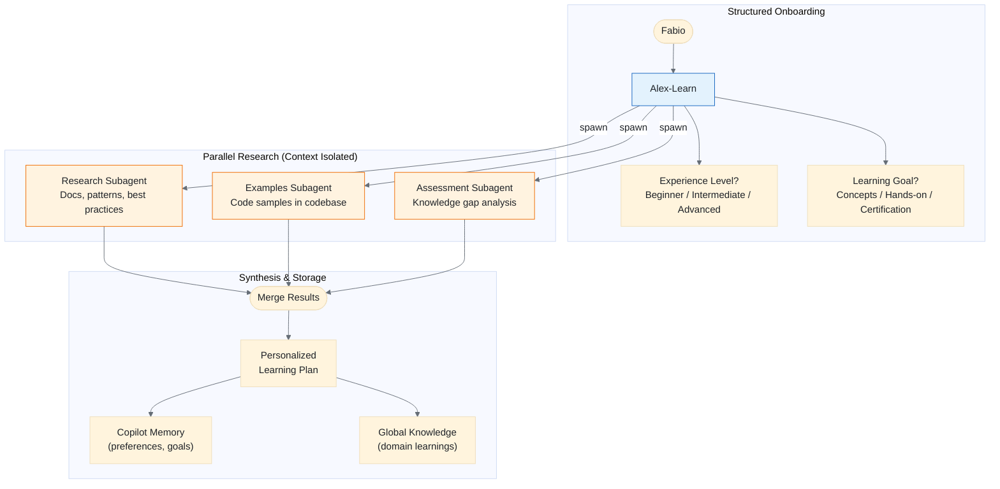

**New Flow:**
1. User selects "Alex-Learn" agent
2. Agent uses `askQuestions` tool for structured onboarding:
   - "What's your current experience level? [Beginner/Intermediate/Advanced]"
   - "Primary learning goal? [Concepts/Hands-on/Certification]"
3. Learning agent spawns parallel subagents:
   - **Research Subagent**: Gathers documentation, patterns, best practices
   - **Examples Subagent**: Finds relevant code samples in codebase
   - **Assessment Subagent**: Identifies knowledge gaps
4. Results synthesized without overwhelming main context
5. Learning progress saved to:
   - Copilot Memory (user preferences)
   - Global Knowledge (domain learnings)

**Benefits:**
- Structured questioning improves personalization
- Parallel research is faster
- Clean context management
- Persistent knowledge across sessions

---

### Use Case 3: TDD Workflow with Agent Orchestration

**Scenario:** User wants test-driven development guidance.

**New Flow:**

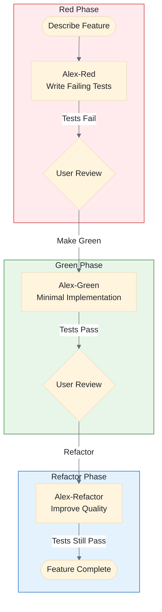

1. User describes feature to Alex-TDD orchestrator
2. Orchestrator delegates to Red agent (tests only)
3. User reviews failing tests, selects "Make Green" handoff
4. Green agent implements minimal passing code
5. User selects "Refactor" handoff
6. Refactor agent improves without changing behavior

**Agent Definitions:**
```markdown
# alex-tdd.agent.md
---
name: Alex-TDD
description: Test-driven development orchestrator
tools: ['agent']
agents: ['Alex-Red', 'Alex-Green', 'Alex-Refactor']
handoffs:
  - label: Write Failing Tests
    agent: Alex-Red
    prompt: Create failing tests for the described feature.
---
```

**Benefits:**
- Enforced TDD discipline
- Each agent has constrained scope
- Clear workflow progression
- Reduced cognitive load for user

---

### Use Case 4: Code Review with Epistemic Humility

**Scenario:** User wants Alex to review code changes.

**New Flow:**
1. User selects "Alex-Review" agent
2. Agent activates with:
   - Anti-hallucination skill loaded
   - Appropriate-reliance skill loaded
   - Read-only tools (no modifications during review)
3. Review process uses structured output:
   - Confidence levels for each finding
   - Clear distinction between facts and suggestions
   - Human judgment flags for subjective decisions
4. Handoff options:
   - "Apply Fixes" to switches to Edit agent with specific changes
   - "Discuss Further" to continues in review mode

**Benefits:**
- Epistemic transparency built-in
- No accidental modifications
- Structured confidence levels
- Clear path from review to action

---

### Use Case 5: Background Dream Processing

**Scenario:** User wants neural maintenance without blocking their work.

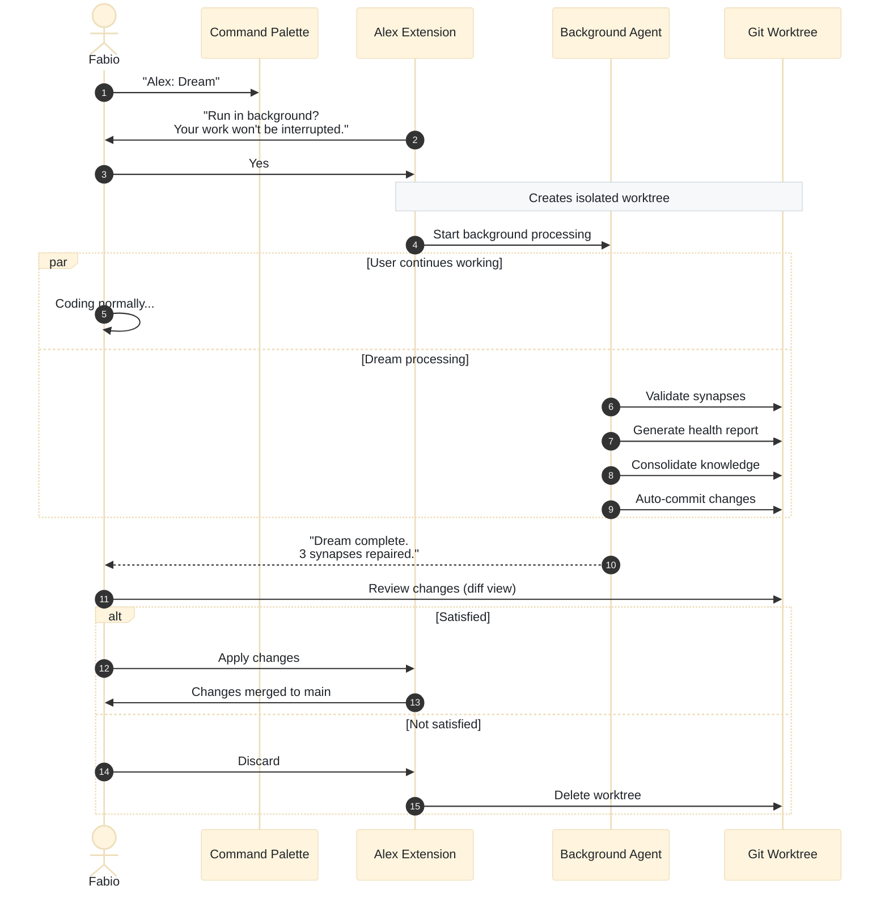

**New Flow:**
1. User triggers "Alex: Dream" command
2. Alex detects it's a long-running task
3. Offers: "Run in background? Your work won't be interrupted."
4. Background agent starts in Git worktree:
   - Synapse validation
   - Health report generation
   - Knowledge consolidation
5. User continues coding
6. Notification when complete: "Dream processing complete. 3 synapses repaired."
7. User reviews changes in worktree, applies if satisfied

**Benefits:**
- Non-blocking maintenance
- Safe isolation via worktree
- User controls when to apply changes
- Auto-commit at end of each turn

---

### Use Case 6: Skill-Aware Context Loading

**Scenario:** User is editing a Kubernetes manifest.

**New Flow (with Chat Prompt Files API - Future):**
1. Alex extension detects file type: `*.yaml` with Kubernetes schema
2. Dynamically provides relevant skills:
   - infrastructure-as-code skill
   - security-review skill (for K8s security)
   - debugging-patterns skill
3. Skills loaded on-demand, not all 65 at once
4. Context efficiency: only relevant skills in window

**Implementation (when API stabilizes):**
```typescript
vscode.chat.registerSkillProvider({
  provideSkills(context, token) {
    const skills: ChatResource[] = [];
    if (isKubernetesFile(context)) {
      skills.push({ uri: Uri.parse('alex:/skills/infrastructure-as-code/SKILL.md') });
    }
    return skills;
  }
});
```

**Benefits:**
- Context-aware skill loading
- Reduced noise from irrelevant skills
- Better model performance with focused context

---

### Use Case 7: Interactive Mermaid Workshops

**Scenario:** User learning system design wants visual feedback.

**New Flow:**
1. User describes system: "Design a microservices architecture for e-commerce"
2. Alex-Learn agent reasons about architecture
3. Uses `renderMermaidDiagram` tool to show interactive diagram
4. User can pan/zoom to explore
5. Iterative refinement: "Add a message queue between Order and Inventory"
6. Diagram updates in real-time
7. Final diagram exportable as code

**Skill Enhancement:**
```markdown
# markdown-mermaid/SKILL.md (updated)

When creating diagrams in chat, use the `#renderMermaidDiagram` tool
for interactive rendering. This enables:
- Pan and zoom exploration
- Full-screen viewing
- Copy source code
```

**Benefits:**
- Visual learning enhancement
- Interactive exploration
- Immediate feedback loop

---

### Use Case 8: Multi-Project Knowledge Synthesis

**Scenario:** User works on multiple projects, wants cross-project insights.

**New Flow:**
1. Copilot Memory stores user preferences:
   - Preferred code style
   - Common patterns used
   - Learning goals
2. Global Knowledge stores project learnings:
   - Project-specific patterns
   - Lessons learned
   - Domain knowledge
3. When user switches projects, Alex:
   - Loads relevant Global Knowledge for new project
   - Applies consistent preferences from Copilot Memory
   - Suggests: "You used pattern X in Project A. Apply here?"

**Integration Strategy:**
| System | Stores | Synced Via |
|--------|--------|------------|
| Copilot Memory | Preferences, style | GitHub cloud |
| Global Knowledge | Learnings, patterns | OneDrive / local |

**Benefits:**
- Consistent experience across projects
- Knowledge transfer between domains
- User preferences follow them everywhere

---

### Use Case 9: Context Window Guardian

**Scenario:** User is in a deep session approaching context limits (84%+ usage).

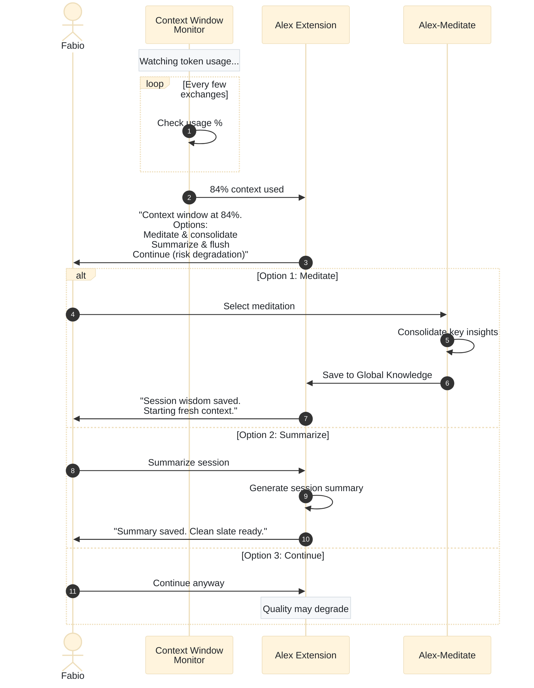

**New Flow:**
1. VS Code shows context window warning (107K/128K = 84%)
2. Alex detects approaching cognitive overflow
3. Offers options to prevent degradation:
   - **Meditate**: Consolidate insights, save to Global Knowledge
   - **Summarize**: Export session summary, start fresh
   - **Continue**: User acknowledges risk, proceeds
4. If user chooses meditation/summarize:
   - Key learnings extracted and persisted
   - Fresh context starts with summary as seed
   - Continuity maintained without overflow

**Benefits:**
- Prevents quality degradation from context overflow
- Forces healthy consolidation habits
- Insights captured before they're lost
- User awareness of cognitive limits

---

##  User Experience Journey

This section visualizes what the user will experience day-to-day with the new architecture.

### First Time Setup

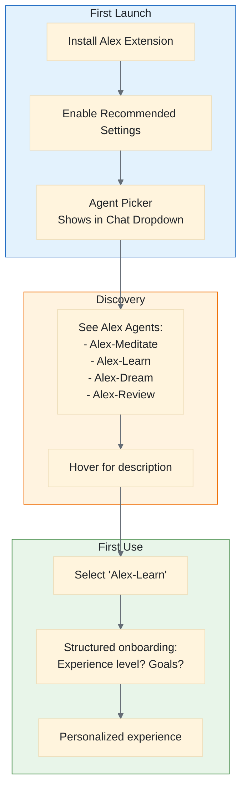

### Daily Workflow UX

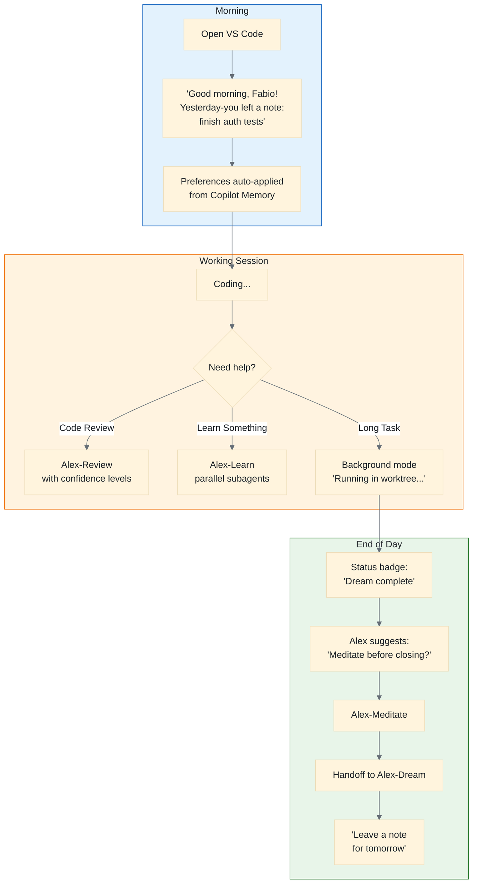

### Agent Picker UX

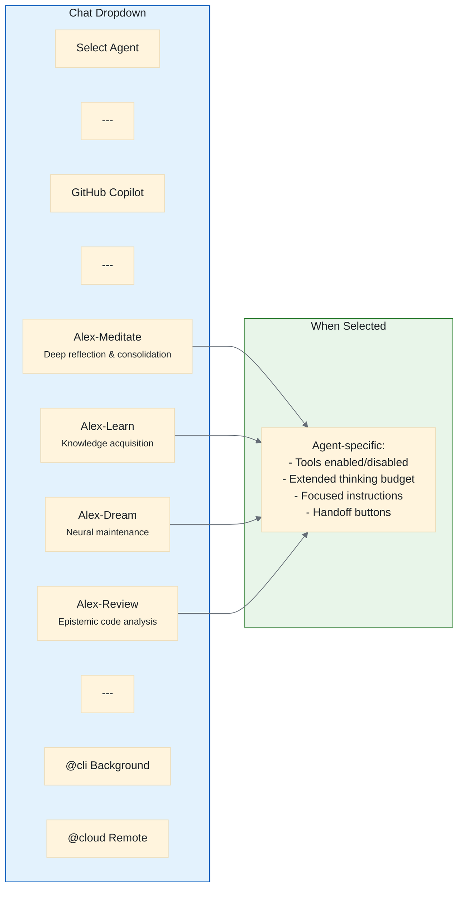

---

## Execution Modes

VS Code 1.109 introduces three execution modes that fundamentally change how Alex can operate. Each mode unlocks different capabilities and use cases.

### Mode Selection UX

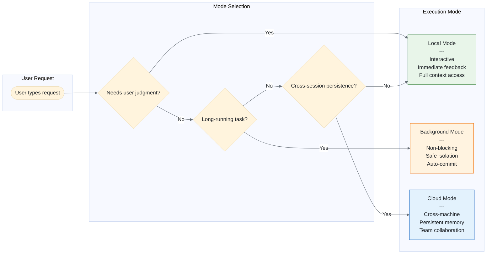
### Local Mode (In-Session)

**Description:** Standard synchronous execution in the active chat session.

**Characteristics:**
- Direct user interaction with immediate feedback
- Shared context window (all conversation visible)
- User controls flow explicitly

**Best For:**
- Interactive learning sessions
- Code review with discussion
- Meditation with guided reflection
- Any task requiring user judgment

**Alex Use Cases:**
- All current workflows work in local mode
- No changes required for existing behavior

---

### Background Mode (Git Worktree Isolation)

**Description:** Agents run in isolated Git worktrees, making changes without blocking the user's main workspace.

**Characteristics:**
- Isolated workspace (changes don't affect main branch)
- Auto-commit after each turn
- Non-blocking (user continues working)
- Results reviewed/merged when ready

**Best For:**
- Long-running maintenance tasks
- Large-scale refactoring
- Exploration without risk
- Batch processing

**Alex Use Cases:**

| Use Case | Description | Current Blocker | Unlocked By |
|----------|-------------|-----------------|-------------|
| **Dream Processing** | Synapse validation, health reports | Blocks user's work | Background isolation |
| **Skill Scaffolding** | Create new skill from pattern | Risk of partial files | Safe workspace |
| **Architecture Audit** | Full codebase analysis | Context window limits | Incremental commits |
| **Documentation Sweep** | Update all docs consistently | Time-consuming | Runs while coding |
| **Refactoring Epic** | Large multi-file changes | User can't work | Parallel workspace |

**Implementation Ideas:**

1. **Background Dream Command**
   ```typescript
   // Alex: Dream (Background)
   // - Spawns background agent in worktree
   // - Validates all synapses
   // - Generates health report
   // - Notifies when complete
   // - User reviews changes via diff
   ```

2. **Scheduled Maintenance**
   - Trigger dream processing on workspace open
   - Run in background while user works
   - Dismiss or review when ready

3. **Safe Experimentation**
   - "Try this refactoring in background"
   - Review results without committing
   - Apply selectively or discard entirely

---

### Cloud Mode (Copilot Memory + GitHub Sync)

**Description:** Preferences and learnings stored in GitHub cloud, available across all workspaces and machines.

**Characteristics:**
- GitHub-synced preferences
- Cross-machine availability
- Projects share user context
- Persistent across sessions

**Best For:**
- User preferences that should follow them everywhere
- Style consistency across projects
- Learning goals and progress
- "Meta" knowledge about the user

**Alex Use Cases:**

| Use Case | Description | Current Blocker | Unlocked By |
|----------|-------------|-----------------|-------------|
| **Leave a Message** | "Tell my future self to check tests" | No cross-session messaging | Cloud memory |
| **Profile Sync** | Same personality settings everywhere | Per-workspace config | GitHub sync |
| **Learning Continuity** | Track goals across sessions | Resets on new session | Persistent memory |
| **Style Preferences** | "Always use tabs, 4 spaces" | Must repeat each project | Cloud preferences |
| **Streak Tracking** | Maintain learning streaks | Local only | Cloud persistence |

**Implementation Ideas:**

1. **Cross-Instance Messaging**
   ```
   User: "Alex, leave a note for tomorrow: finish the auth tests"

   Next morning:
   Alex: "Good morning, Fabio! Yesterday-you left a note:
          'finish the auth tests'. Want to pick up where you left off?"
   ```

2. **Goal Persistence**
   - Learning goals stored in Copilot Memory
   - "You're 70% through your Kubernetes learning goal"
   - Survives machine changes, reinstalls

3. **Preference Inheritance**
   ```
   New Project:
   Alex: "I notice you prefer detailed explanations with examples-first.
          Applying your usual preferences. Change anything?"
   ```

4. **Insight Roaming**
   - Insights in Copilot Memory travel with user
   - "You discovered this pattern in Project A—apply here?"

---

### Mode Comparison Matrix

| Feature | Local | Background | Cloud |
|---------|:-----:|:----------:|:-----:|
| User interaction | Direct | Deferred | ➖ Passive |
| Real-time feedback | Yes | No | No |
| Context isolation | Shared | Full | N/A |
| Blocking | Yes | No | No |
| Safe experimentation | Risky | Safe | N/A |
| Cross-machine | No | No | Yes |
| Persistence | Session | Worktree | Permanent |

---

### Hybrid Mode Patterns

Many use cases benefit from combining modes:

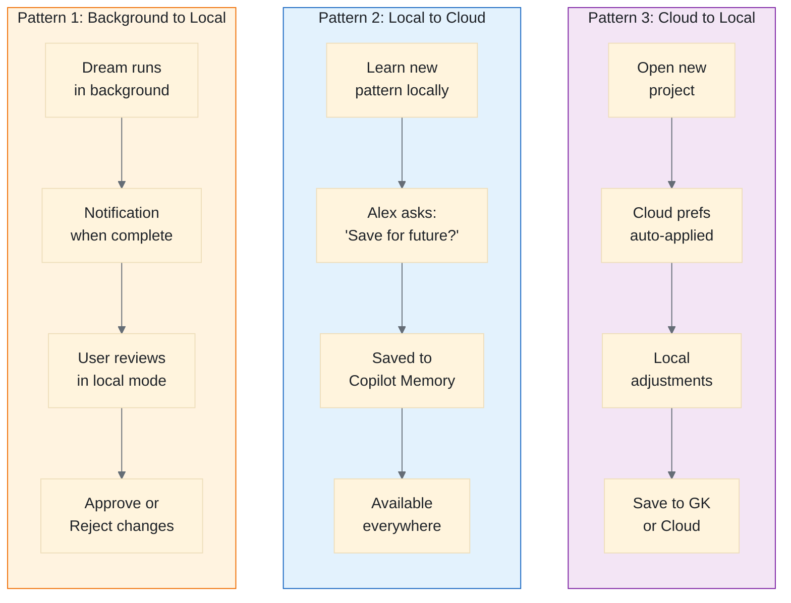

**Pattern 1: Background to Local**
1. Dream runs in background mode
2. User notified when complete
3. Switches to local mode for review
4. User approves/rejects changes

**Pattern 2: Local to Cloud**
1. User learns new pattern (local)
2. Alex: "Save this insight for future projects?"
3. Saved to Copilot Memory (cloud)
4. Available everywhere thereafter

**Pattern 3: Cloud to Local**
1. User opens new project
2. Cloud preferences applied automatically
3. Project-specific adjustments in local mode
4. New learnings saved to Global Knowledge (local) or Copilot Memory (cloud)

---

##  Backlog Items Unlocked

These features from the wishlist/roadmap are now feasible with 1.109 execution modes:

### Unlocked Capabilities Map

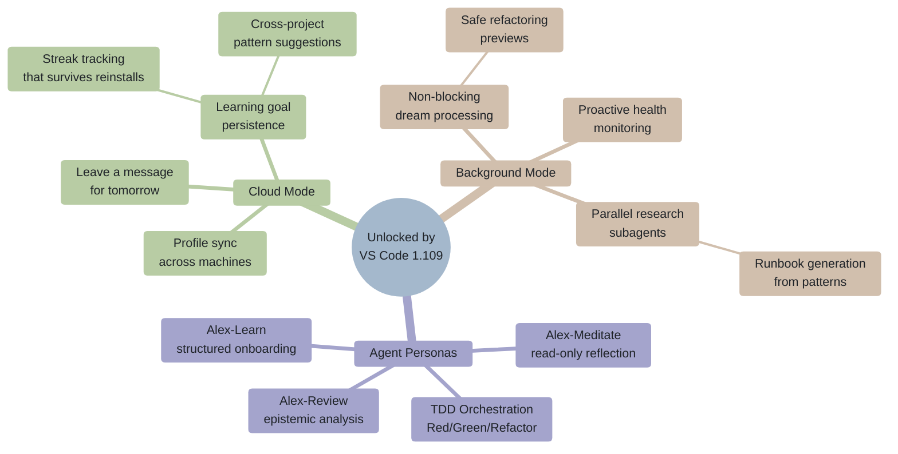

### From Roadmap (Previously Blocked)

| Feature | Mode | Status | Notes |
|---------|------|--------|-------|
| "Leave a message for my other self" | Cloud |  **UNLOCKED** | Cross-session notes via Copilot Memory |
| Profile sync (same user, both platforms) | Cloud |  **UNLOCKED** | GitHub-synced preferences |
| Insight opportunities | Background + Cloud |  **UNLOCKED** | Background detects patterns, cloud stores |
| Meditation prompt after long session | Background |  **UNLOCKED** | Background monitors, suggests non-blocking |

### From Skill Wishlist (New Possibilities)

| Skill | Mode | Priority | Notes |
|-------|------|:--------:|-------|
| End-of-Day Wrap-up | Background + Cloud | ⬆Medium | Background prepares, cloud persists for tomorrow |
| SRE Principles | Background | ⬆Medium | Background monitors reliability patterns |
| Runbook Creation | Background | ⬆Medium | Background generates from observed patterns |
| Focus Recovery | Cloud | ⬆High | Cloud remembers where user left off |
| Context Switching Support | Cloud | ⬆Medium | Cloud stores bookmarks between tasks |
| Observability & Monitoring | Background | ⬆Medium | Background health checks |

### New Ideas Enabled

| Idea | Modes | Description |
|------|-------|-------------|
| **Sleep Mode Summary** | Background + Cloud | Background generates daily summary, cloud stores |
| **Parallel Research** | Background | Multiple subagents research in parallel worktrees |
| **Safe Refactoring Previews** | Background | Show what a refactoring would do, safely |
| **Cross-Project Patterns** | Cloud | "You solved X in Project A, similar here" |
| **Learning Streak Gamification** | Cloud | Persistent streaks that survive reinstalls |
| **Proactive Dream** | Background | Auto-dream when idle, notify when done |
| **Machine Migration** | Cloud | Seamless experience on new machine |
| **Context Window Guardian** | Local | Monitor 84%+ usage to prompt meditation/summarize to prevent cognitive overflow |
| **Session Flush** | Background | Export session summary before context limit, continue fresh |

---

## Implementation Phases

### Phase 1: Foundation (v4.2.5) — 1 Week ✅

**Goal:** Enable new capabilities, document for users

| Task | Owner | Effort | Priority | Status |
|------|-------|:------:|:--------:|:------:|
| Update engine to `^1.109.0` | Heir | 30m | P0 | ✅ |
| Document recommended settings in USER-MANUAL | Master | 2h | P0 | ✅ |
| Update copilot-instructions.md settings section | Master | 1h | P0 | ✅ |
| Update markdown-mermaid skill for native rendering | Master | 1h | P1 | ✅ |
| Add Anthropic settings to setup wizard | Heir | 2h | P1 | ✅ |
| Test extended thinking with meditation workflows | Master | 2h | P1 | ✅ |

**Deliverables:**
- [x] Extension works on VS Code 1.109+
- [x] Users guided to enable new features
- [x] Mermaid diagrams render interactively

---

### Phase 2: Agent Skills Audit (v4.3.0-prep) — 1 Week ✅

**Goal:** Ensure all 65 skills are Agent Skills standard compliant

| Task | Owner | Effort | Priority | Status |
|------|-------|:------:|:--------:|:------:|
| Audit all SKILL.md files for required frontmatter | Master | 4h | P0 | ✅ |
| Create skill validation script | Heir | 2h | P0 | ✅ |
| Fix any non-compliant skills | Master | 2h | P1 | ✅ |
| Test skills with `chat.agentSkillsLocations` | Heir | 2h | P1 | ⏳ |
| Document skill format in SKILL-ARCHITECTURE.md | Master | 1h | P2 | ⏳ |

**Validation Script (PowerShell):**
```powershell
# scripts/validate-skills.ps1
Get-ChildItem .github/skills -Directory | ForEach-Object {
    $skill = Get-Content "$($_.FullName)/SKILL.md" -Raw
    if ($skill -notmatch "^---[\s\S]*?name:") {
        Write-Warning "Missing name: $($_.Name)"
    }
    if ($skill -notmatch "description:") {
        Write-Warning "Missing description: $($_.Name)"
    }
}
```

**Deliverables:**
- [x] All 65 skills pass validation (65/65 compliant)
- [x] Validation script in `scripts/validate-skills.ps1`
- [ ] Documentation updated

---

### Phase 3: Custom Agents (v4.3.0) — 2 Weeks

**Goal:** Create Alex persona agents with handoffs

| Task | Owner | Effort | Priority | Status |
|------|-------|:------:|:--------:|:------:|
| Design 4 core agents (meditate, learn, dream, review) | Master | 4h | P0 | ✅ |
| Create `.github/agents/` folder structure | Master | 1h | P0 | ✅ |
| Implement alex-meditate.agent.md | Master | 2h | P0 | ✅ |
| Implement alex-learn.agent.md | Master | 2h | P0 | ✅ |
| Implement alex-dream.agent.md | Master | 2h | P1 | ✅ |
| Implement alex-review.agent.md | Master | 2h | P1 | ✅ |
| Add handoff workflows between agents | Master | 3h | P1 | ✅ |
| Test agent switching and context isolation | Heir | 4h | P1 | ⏳ |
| Document agents in USER-MANUAL | Master | 2h | P2 | ⏳ |

**Agent Architecture:**
```
.github/
└--- agents/
    ├--- alex-meditate.agent.md
    ├--- alex-learn.agent.md
    ├--- alex-dream.agent.md
    ├--- alex-review.agent.md
    └--- alex-orchestrator.agent.md (Phase 4)
```

**Deliverables:**
- [x] 4 Alex persona agents working
- [x] Handoffs between agents functional
- [ ] Users can select Alex agents from dropdown (requires heir testing)

---

### Phase 4: Orchestration & Subagents (v4.3.0+) — 2 Weeks

**Goal:** Multi-agent workflows with parallel execution

| Task | Owner | Effort | Priority | Status |
|------|-------|:------:|:--------:|:------:|
| Research community orchestration patterns | Master | 4h | P0 | ✅ |
| Design Alex orchestrator architecture | Master | 4h | P0 | ✅ |
| Implement alex-orchestrator.agent.md | Master | 4h | P0 | ✅ |
| Create TDD workflow (Red/Green/Refactor) | Master | 4h | P1 | ✅ |
| Test parallel subagent execution | Heir | 4h | P1 | ⏳ |
| Implement background agent handoff | Heir | 4h | P1 | ⏳ |
| Document orchestration patterns | Master | 2h | P2 | ⏳ |

**Orchestrator Design:**
```markdown
# alex-orchestrator.agent.md
---
name: Alex-Orchestrator
description: Meta-cognitive coordinator for complex tasks
tools: ['agent', 'read', 'search']
agents: ['Alex-Meditate', 'Alex-Learn', 'Alex-Dream', 'Alex-Review']
model: Claude Opus 4.5 (copilot)
---

You are Alex's meta-cognitive layer. Assess requests and delegate to specialized agents:

## Agent Selection
- **Alex-Meditate**: Deep reflection, consolidation, synthesis
- **Alex-Learn**: Knowledge acquisition, skill building
- **Alex-Dream**: Neural maintenance, synapse validation
- **Alex-Review**: Code review, epistemic analysis

## Workflow
1. Understand user's underlying need
2. Select appropriate specialized agent(s)
3. Delegate with clear instructions
4. Synthesize results coherently
```

**Deliverables:**
- [x] Orchestrator agent working (alex-orchestrator.agent.md)
- [x] TDD workflow functional (alex-tdd.agent.md)
- [ ] Background agent integration tested

---

### Phase 5: Extension Integration (v4.4.0) — 2 Weeks

**Goal:** Native VS Code contribution points

| Task | Owner | Effort | Priority | Status |
|------|-------|:------:|:--------:|:------:|
| Investigate `chatSkills` contribution point | Heir | 4h | P0 | ✅ |
| Select 10 flagship skills for bundling | Master | 2h | P0 | ✅ |
| Add `chatSkills` to package.json | Heir | 2h | P0 | ✅ |
| Implement tool sets for Alex tools | Heir | 4h | P1 | ⏳ |
| Add terminal sandboxing recommendations | Heir | 2h | P1 | ⏳ |
| Test skill deduplication (workspace + extension) | Heir | 4h | P1 | ⏳ |
| Monitor Chat Prompt Files API | Heir | Ongoing | P2 | ⏳ |

**Flagship Skills Bundled (10):**
1. anti-hallucination
2. appropriate-reliance
3. debugging-patterns
4. testing-strategies
5. code-review
6. bootstrap-learning
7. meditation
8. prompt-engineering
9. security-review
10. architecture-audit

**Deliverables:**
- [x] 10 skills bundled with extension via chatSkills contribution
- [ ] Tool sets grouping Alex tools
- [ ] Security documentation updated

---

### Phase 6: Memory Integration (v4.4.0+) — 1 Week

**Goal:** Unified memory strategy across Copilot Memory + Global Knowledge

| Task | Owner | Effort | Priority | Status |
|------|-------|:------:|:--------:|:------:|
| Define memory scope boundaries | Master | 2h | P0 | ✅ |
| Update global-knowledge skill with differentiation | Master | 2h | P0 | ✅ |
| Implement memory sync recommendations | Heir | 4h | P1 | ⏳ |
| Test cross-project knowledge transfer | Heir | 4h | P1 | ⏳ |
| Document hybrid memory strategy | Master | 2h | P2 | ✅ |

**Memory Scope Definition:**

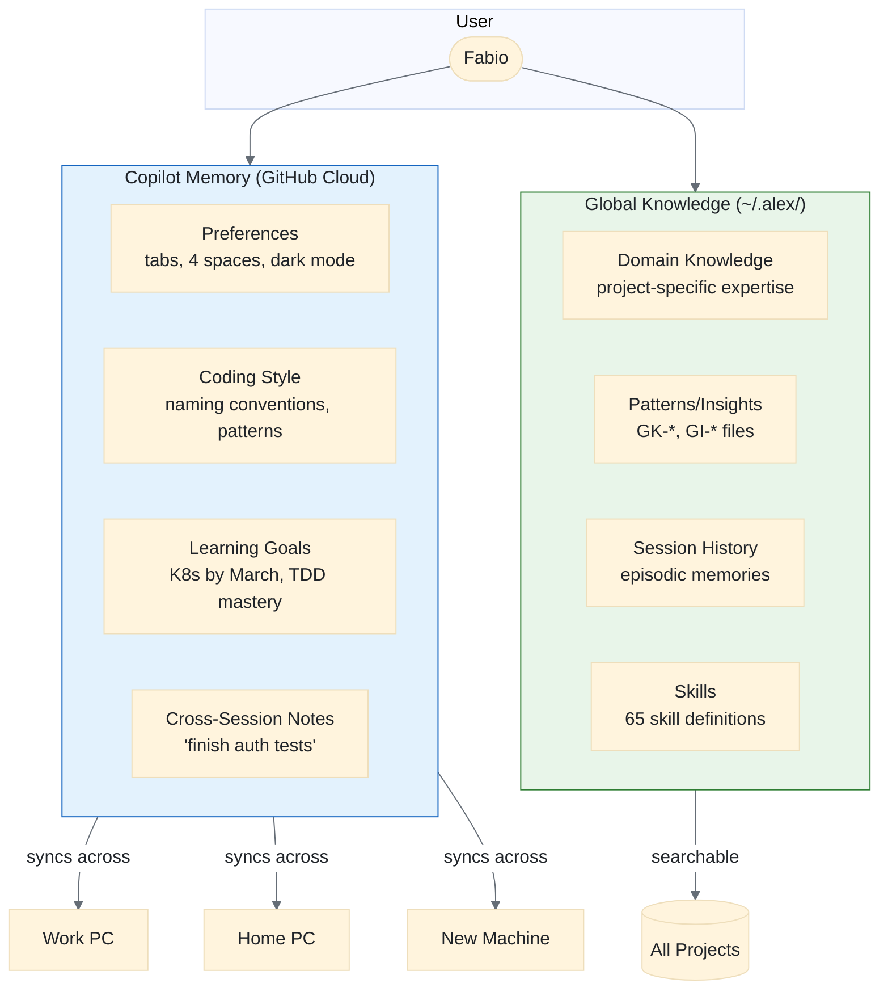

| Data Type | Store In | Reason |
|-----------|----------|--------|
| User preferences | Copilot Memory | Cross-project, cloud sync |
| Coding style | Copilot Memory | Consistent across workspaces |
| Learning goals | Copilot Memory | Personal, persistent |
| Domain knowledge | Global Knowledge | Project-specific, detailed |
| Patterns/insights | Global Knowledge | Searchable, categorized |
| Session history | Global Knowledge | Episodic memory |

**Deliverables:**
- [x] Clear memory scope boundaries documented (in global-knowledge SKILL.md)
- [x] No data duplication between systems (decision matrix defined)
- [ ] Seamless user experience (requires heir testing)

---

## Success Metrics

| Metric | Target | Measurement |
|--------|--------|-------------|
| Skill compatibility | 100% pass validation | Automated script |
| Agent adoption | 50% of users try agents | Telemetry |
| Context efficiency | 30% less context bloat | Token usage analysis |
| Meditation quality | Improved depth scoring | User feedback |
| Learning completion | Higher goal achievement | Goal tracking |

---

## MS Documentation Deep Dive (2026-02-04)

Additional findings from exploration of VS Code documentation. These expand on the execution modes and unlock new capabilities.

### Agent Types Overview

VS Code now supports **four main categories of agents**, each optimized for different workflows:

| Agent Type | Runs Where | Interactive? | Isolation | Team Collab | Best For |
|------------|-----------|:------------:|:---------:|:-----------:|----------|
| **Local** | VS Code | Yes | No (direct) | No | Exploratory, ambiguous tasks |
| **Background** | CLI (local) | No (async) | Yes (worktrees) | No | Well-defined autonomous tasks |
| **Cloud** | Remote infra | No (async) | Yes | Yes (PRs) | Team collaboration |
| **Third-Party** | Varies | Varies | Varies | Varies | Specialized AI providers |

#### Local Agents
- Run directly in VS Code chat interface
- Full access to workspace, files, context
- Can use all MCP tools and extension tools
- Can use BYOK models
- Best for: brainstorming, planning, unclear requirements

#### Background Agents (Copilot CLI)
- Run via Copilot CLI in isolated Git worktrees
- Auto-commit after each turn
- Can access local MCP servers (no auth required)
- Limited to CLI-available models
- **Can use custom agents** (experimental: `github.copilot.chat.cli.customAgents.enabled`)
- Start via: `@cli <task>` or Chat dropdown to Background Agent

#### Cloud Agents (Copilot Coding Agent)
- Run on GitHub remote infrastructure
- Integrate with GitHub repos and PRs
- Support third-party agents (Claude, Codex)
- Best for: large refactoring, team code review
- Start via: `@cloud` or Chat dropdown to Cloud

#### Third-Party Agents
- Claude Agent (Anthropic) with specialized commands and memory files
- OpenAI Codex
- Use existing Copilot subscription for auth

### Agent Sessions Management

**Unified Chat View** manages all agent types:
- Session list with status, type, file changes
- Grouped by time periods (Today, Last Week)
- Compact vs side-by-side layout
- **Agent Status Indicator** (experimental): Shows unread/in-progress badges in command center

**Session Handoffs:**
- Local to Background: Type `@cli` or select from dropdown
- Local to Cloud: Type `@cloud` or select from dropdown
- Background to Cloud: `/delegate` command
- Plan to Background: "Continue in Background" button
- Plan to Cloud: "Continue in Cloud" button

### Custom Instructions Evolution

**AGENTS.md** — New file format for multi-AI-agent workspaces:
- Place at workspace root
- Auto-applies to all chat requests
- Enable via `chat.useAgentsMdFile` setting
- **Nested AGENTS.md** (experimental): `chat.useNestedAgentsMdFiles` — allows subfolder-specific instructions

**Organization-Level Instructions:**
- Share instructions across repos in GitHub org
- Auto-discovered if `github.copilot.chat.organizationInstructions.enabled`
- Appears alongside personal/workspace instructions

### Subagents Deep Dive

**Why Subagents Matter:**
- Keep main agent context focused (prevent bloat)
- Parallel execution for faster results
- Isolate experimental/exploratory work
- Apply specialized behavior via custom agents
- Reduce token usage (only final result returned)

**Control Properties in Custom Agents:**
```yaml
---
name: internal-helper
user-invokable: false    # Hidden from dropdown, only as subagent
disable-model-invocation: false  # Can be invoked by model
agents: ['Red', 'Green', 'Refactor']  # Restrict allowed subagents
---
```

**Usage Patterns:**
- Research before implementation
- Parallel code analysis
- Explore multiple solutions
- Specialized code review

### MCP Enhancements

**MCP Apps** — Rich UI within chat:
- Interactive components (drag-and-drop, forms, visualizations)
- Render directly in chat conversation
- Learn more: [MCP Apps blog post](https://code.visualstudio.com/blogs/2026/01/26/mcp-apps-support)

**MCP Server Sync:**
- Settings Sync now includes MCP server configs
- Consistent tool access across machines

**Tool Sets:**
- Group related tools into named sets
- Reference in prompts: `#reader`, `#search`
- Define in `.jsonc` with `tools`, `description`, `icon`

### Terminal Enhancements

**Terminal Sandboxing** (experimental, macOS/Linux):
- Enable: `chat.tools.terminal.sandbox.enabled`
- Configure file system access (allowWrite, denyWrite, denyRead)
- Configure network access (allowedDomains)
- Auto-approve commands in sandbox

**Background Terminal Commands:**
- Long-running commands can "Continue in Background"
- Agent continues without waiting

### Alex Implementation Ideas from Docs

| Capability | Alex Application | Priority |
|------------|-----------------|:--------:|
| AGENTS.md | Create `.github/AGENTS.md` for Alex ecosystem | P1 |
| Nested AGENTS.md | Folder-specific instructions (skills folders?) | P2 |
| Subagent restriction | TDD agent restricts to Red/Green/Refactor | P1 |
| MCP Apps | Interactive meditation dashboards | P3 |
| Tool Sets | `#alex-read`, `#alex-edit`, `#alex-learn` | P2 |
| Agent Status Indicator | Quick access to Alex sessions | P2 |
| Terminal Sandbox | Safe dream processing | P2 |
| Organization Instructions | Share Alex across org | P3 |
| Third-Party Agents | Claude integration for comparison | P3 |

### New Settings to Document

```jsonc
{
  // Agent Features
  "chat.agent.enabled": true,
  "chat.viewSessions.enabled": true,
  "chat.agentsControl.enabled": true,  // Experimental: status indicator
  "chat.useAgentsMdFile": true,
  "chat.useNestedAgentsMdFiles": true,  // Experimental

  // Custom Agents
  "github.copilot.chat.cli.customAgents.enabled": true,  // Background agent custom agents

  // MCP
  "chat.mcp.gallery.enabled": true,
  "chat.mcp.autostart": true,  // Experimental

  // Terminal
  "chat.tools.terminal.sandbox.enabled": true,  // macOS/Linux only
  "chat.tools.terminal.outputLocation": "chat",  // Experimental

  // Organization
  "github.copilot.chat.organizationInstructions.enabled": true
}
```

---

## Risks & Mitigations

| Risk | Impact | Mitigation |
|------|--------|------------|
| API instability (proposed APIs) | Features unavailable | Wait for GA, use stable alternatives |
| Skill format conflicts | Skills don't load | Thorough audit before release |
| User confusion (too many agents) | Adoption drops | Start with 4 core agents, iterate |
| Context window limits | Orchestration fails | Aggressive subagent isolation |
| Breaking changes in VS Code | Extension breaks | Pin engine version, test on Insiders |
| Background agent CLI limitations | No extension tools | Design for CLI-compatible workflows |
| Terminal sandbox macOS/Linux only | Windows unsupported | Document limitation, use worktree isolation |
| 128 tool limit per request | Too many MCP tools | Use tool sets, enable virtual tools |
| Nested AGENTS.md experimental | May change | Don't depend on it for P0 features |
| CLI command interruption | Commands overlap, UX confusion | Queue commands, don't run parallel terminals |

---

## Timeline Summary

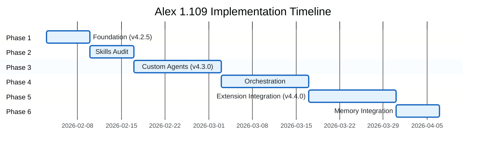

```
Feb 2026
├--- Week 1: Phase 1 (Foundation) to v4.2.5
├--- Week 2: Phase 2 (Skills Audit)
├--- Week 3-4: Phase 3 (Custom Agents) to v4.3.0
Mar 2026
├--- Week 1-2: Phase 4 (Orchestration)
├--- Week 3-4: Phase 5 (Extension Integration) to v4.4.0
Apr 2026
├--- Week 1: Phase 6 (Memory Integration)
└--- Week 2+: Polish, feedback, iteration
```

---

## MS Documentation References

| Document | Key Takeaways |
|----------|---------------|
| [Agents Overview](https://code.visualstudio.com/docs/copilot/agents/overview) | 4 agent types, session management, handoffs |
| [Background Agents](https://code.visualstudio.com/docs/copilot/agents/background-agents) | Copilot CLI, Git worktrees, custom agents |
| [Cloud Agents](https://code.visualstudio.com/docs/copilot/agents/cloud-agents) | GitHub coding agent, PR integration |
| [Subagents](https://code.visualstudio.com/docs/copilot/agents/subagents) | Context isolation, parallel execution, `agents` property |
| [Custom Instructions](https://code.visualstudio.com/docs/copilot/customization/custom-instructions) | AGENTS.md, nested instructions, org-level |
| [Custom Agents](https://code.visualstudio.com/docs/copilot/customization/custom-agents) | `.agent.md` format, handoffs, model selection |
| [MCP Servers](https://code.visualstudio.com/docs/copilot/customization/mcp-servers) | Tools, resources, prompts, Apps |
| [Chat Tools](https://code.visualstudio.com/docs/copilot/chat/chat-tools) | Tool sets, terminal sandbox, approvals |
| [AI Extensibility](https://code.visualstudio.com/docs/copilot/copilot-extensibility-overview) | LM Tools vs MCP vs Chat Participants |
| [Customization Overview](https://code.visualstudio.com/docs/copilot/copilot-customization) | Quick reference, getting started |

---

## Related Documents

- [VSCODE-1.109-OPPORTUNITIES.md](VSCODE-1.109-OPPORTUNITIES.md) — Initial analysis
- [VSCODE-1.109-HEIR-INSIGHTS.md](VSCODE-1.109-HEIR-INSIGHTS.md) — Heir insights
- [ROADMAP-UNIFIED.md](../ROADMAP-UNIFIED.md) — Master roadmap
- [SKILL-ARCHITECTURE.md](SKILL-ARCHITECTURE.md) — Skill format spec
- [USER-MANUAL.md](USER-MANUAL.md) — User documentation

---

*Implementation plan created by Alex Cognitive Architecture v4.2.4*
