# VS Code Team — Contact Index

> **Key engineers and leaders for the Alex Cognitive Architecture contribution strategy**

|             |                                                                                                                                            |
| ----------- | ------------------------------------------------------------------------------------------------------------------------------------------ |
| **Author**  | Fabio Correa                                                                                                                               |
| **Date**    | February 7, 2026                                                                                                                           |
| **Status**  | Research — Sourced from `microsoft/vscode` repository analysis                                                                             |
| **Related** | [VSCODE-CONTRIBUTION-PLAN.md](VSCODE-CONTRIBUTION-PLAN.md), [VSCODE-SOURCE-INTEGRATION-ANALYSIS.md](VSCODE-SOURCE-INTEGRATION-ANALYSIS.md) |

---

## 1. API Gatekeepers (CODEOWNERS for `vscode.d.ts`)

These three engineers approve **all finalized VS Code API surfaces**. Any proposed API you want stabilized goes through them.

| Engineer            | GitHub                                 | Role                                          |
| ------------------- | -------------------------------------- | --------------------------------------------- |
| **Johannes Rieken** | [@jrieken](https://github.com/jrieken) | VS Code API lead, primary gatekeeper          |
| **Matt Bierner**    | [@mjbvz](https://github.com/mjbvz)     | VS Code API team                              |
| **Alex Ross**       | [@alexr00](https://github.com/alexr00) | VS Code API team, Chat Context Provider owner |

---

## 2. Confirmed API Owners

Sourced from `@username` annotations in proposed API header comments, `owner:` telemetry fields, and `todo@` comments in implementation files.

| Engineer          | GitHub                                           | Owns                                                                                                                                             | Source Evidence                                                                                                                                           |
| ----------------- | ------------------------------------------------ | ------------------------------------------------------------------------------------------------------------------------------------------------ | --------------------------------------------------------------------------------------------------------------------------------------------------------- |
| **Alex Ross**     | [@alexr00](https://github.com/alexr00)           | `chatContextProvider` API — `registerChatWorkspaceContextProvider`, `registerChatExplicitContextProvider`, `registerChatResourceContextProvider` | `vscode.proposed.chatContextProvider.d.ts` header: `@alexr00`, [issue #271104](https://github.com/microsoft/vscode/issues/271104)                         |
| **Don Jayamanne** | [@DonJayamanne](https://github.com/DonJayamanne) | `mcpServerDefinitions` API — `registerMcpServerDefinitionProvider`, `mcpServerDefinitions`, `startMcpGateway`                                    | `vscode.proposed.mcpServerDefinitions.d.ts` header: `@DonJayamanne`, [issue #288777](https://github.com/microsoft/vscode/issues/288777)                   |
| **Rob Lourens**   | [@roblourens](https://github.com/roblourens)     | Chat service core — telemetry, chat view container, participant behavior                                                                         | `owner: 'roblourens'` in `chatServiceTelemetry.ts`; `contribViewContainerTitle.d.ts` → [issue #200880](https://github.com/microsoft/vscode/issues/200880) |
| **Connor Peet**   | [@connor4312](https://github.com/connor4312)     | MCP subsystem — sampling service, tool contributions, MCP server lifecycle                                                                       | `todo@connor4312` in `mcpSamplingService.ts`                                                                                                              |

---

## 3. Contact-to-Opportunity Mapping

Maps each of the 10 integration opportunities (from the source analysis) to the right person.

```mermaid
%%{init: {'theme': 'base', 'themeVariables': { 'edgeLabelBackground':'#ffffff', 'lineColor': '#57606a' }}}%%
graph LR
    subgraph API["🔑 API Gatekeepers"]
        JR["@jrieken"]
        MB["@mjbvz"]
        AR["@alexr00"]
    end

    subgraph Chat["💬 Chat Team"]
        RL["@roblourens"]
    end

    subgraph MCP["🔌 MCP Team"]
        CP["@connor4312"]
        DJ["@DonJayamanne"]
    end

    O1["1. Context Providers"] --> AR
    O2["2. Dynamic Participants"] --> RL
    O3["3. Tool Sets"] --> JR
    O4["4. MCP Server Provider"] --> DJ
    O4 --> CP
    O5["5. Skill/Prompt Providers"] --> RL
    O6["6. LM Chat Provider"] --> JR
    O7["7. Embeddings"] --> JR
    O8["8. Thinking Parts"] --> JR
    O9["9. Chat Sessions"] --> RL
    O10["10. Chat Hooks"] --> RL

    style API fill:#ddf4ff,stroke:#0550ae,color:#0550ae
    style Chat fill:#d3f5db,stroke:#1a7f37,color:#1a7f37
    style MCP fill:#d8b9ff,stroke:#6639ba,color:#6639ba
    style O1 fill:#fff1e5,stroke:#953800,color:#953800
    style O2 fill:#fff1e5,stroke:#953800,color:#953800
    style O3 fill:#fff1e5,stroke:#953800,color:#953800
    style O4 fill:#fff1e5,stroke:#953800,color:#953800
    style O5 fill:#fff1e5,stroke:#953800,color:#953800
    style O6 fill:#fff1e5,stroke:#953800,color:#953800
    style O7 fill:#fff1e5,stroke:#953800,color:#953800
    style O8 fill:#fff1e5,stroke:#953800,color:#953800
    style O9 fill:#fff1e5,stroke:#953800,color:#953800
    style O10 fill:#fff1e5,stroke:#953800,color:#953800

    linkStyle default stroke:#57606a,stroke-width:1.5px
```

### Detailed Mapping

| #   | Integration Opportunity | Primary Contact   | Secondary       | Engagement Vector                                                                                                            |
| --- | ----------------------- | ----------------- | --------------- | ---------------------------------------------------------------------------------------------------------------------------- |
| 1   | Chat Context Providers  | **@alexr00**      | —               | Comment on [#271104](https://github.com/microsoft/vscode/issues/271104) with Alex as a real-world cognitive context provider |
| 2   | Dynamic Participants    | **@roblourens**   | @jrieken        | Open discussion on persona-driven chat participant extensibility                                                             |
| 3   | Tool Sets               | **@jrieken**      | @roblourens     | Propose `contributes.languageModelToolSets` use case for cognitive tooling                                                   |
| 4   | MCP Server Provider     | **@DonJayamanne** | **@connor4312** | Comment on [#288777](https://github.com/microsoft/vscode/issues/288777) re: extension-to-MCP bridge                          |
| 5   | Skill/Prompt Providers  | **@roblourens**   | @alexr00        | No owner annotated — engage chat team lead with skills framework proposal                                                    |
| 6   | LM Chat Provider        | **@jrieken**      | API team        | General API discussion on cognitive model routing                                                                            |
| 7   | Embeddings              | API team          | —               | Comment on [#212083](https://github.com/microsoft/vscode/issues/212083) with memory-augmented retrieval use case             |
| 8   | Thinking Parts          | **@jrieken**      | —               | No owner annotated — go through API lead                                                                                     |
| 9   | Chat Sessions           | **@roblourens**   | —               | No owner annotated — chat service leader                                                                                     |
| 10  | Chat Hooks              | **@roblourens**   | —               | Newer API (v2), chat team owns lifecycle hooks                                                                               |

---

## 4. Engagement Priority

### Tier 1 — Start Here (February 2026)

These contacts have the highest overlap with Alex's immediate contribution plan items.

| Contact                       | Why First                                                                                                                                              | Action Items                                                                                                                                                                                                    |
| ----------------------------- | ------------------------------------------------------------------------------------------------------------------------------------------------------ | --------------------------------------------------------------------------------------------------------------------------------------------------------------------------------------------------------------- |
| **@alexr00** (Alex Ross)      | Owns the Context Provider API — your #1 integration gap and highest-priority Track A item (A4). Also an API gatekeeper.                                | 1. Comment on [#271104](https://github.com/microsoft/vscode/issues/271104) sharing Alex as a consumer 2. File A4 issue (document `chatContextProvider`) 3. Offer to write a context provider guide (D1) |
| **@roblourens** (Rob Lourens) | Chat service leader. Owns 5 of the 10 integration opportunities. Decision-maker for participant behavior, sessions, hooks, and prompt/skill providers. | 1. Open A1 discussion (persistent memory) 2. Open A2 discussion (cross-project knowledge) 3. Reference Alex's 75-skill architecture as evidence                                                         |

### Tier 2 — Follow Up (March 2026)

| Contact                           | Why Second                                                                                           | Action Items                                                                                                                             |
| --------------------------------- | ---------------------------------------------------------------------------------------------------- | ---------------------------------------------------------------------------------------------------------------------------------------- |
| **@connor4312** (Connor Peet)     | MCP subsystem lead. Critical for A8 (Extension-to-MCP Bridge) and emerging MCP gateway capabilities. | 1. Discuss MCP bridge architecture 2. Share Alex's 11-tool-to-MCP mapping potential                                                  |
| **@DonJayamanne** (Don Jayamanne) | MCP Server Definitions owner. Natural partner for dynamic MCP server registration from extensions.   | 1. Comment on [#288777](https://github.com/microsoft/vscode/issues/288777) 2. Propose `registerMcpServerDefinitionProvider` use case |

### Tier 3 — API Finalization (April+ 2026)

| Contact                        | Why Later                                                                                       | Action Items                                                                                                          |
| ------------------------------ | ----------------------------------------------------------------------------------------------- | --------------------------------------------------------------------------------------------------------------------- |
| **@jrieken** (Johannes Rieken) | Primary API gatekeeper. Engage when proposing new stable APIs or major extension point changes. | 1. Propose Tool Sets contribution point 2. Discuss embeddings API stabilization 3. Thinking Parts integration |
| **@mjbvz** (Matt Bierner)      | API team. Engage during PR review for API-touching changes.                                     | 1. Review support for documentation PRs                                                                               |

---

## 5. GitHub Issues to Watch

Active issues directly relevant to Alex's integration opportunities.

| Issue                                                        | Title / Topic                      | Owner         | Relevance                                          |
| ------------------------------------------------------------ | ---------------------------------- | ------------- | -------------------------------------------------- |
| [#271104](https://github.com/microsoft/vscode/issues/271104) | Chat Context Provider API          | @alexr00      | Alex's workspace context (memory, persona, skills) |
| [#288777](https://github.com/microsoft/vscode/issues/288777) | MCP Server Definitions             | @DonJayamanne | Extension-provided MCP servers                     |
| [#212083](https://github.com/microsoft/vscode/issues/212083) | Embeddings API                     | (unassigned)  | Memory-augmented semantic search                   |
| [#200880](https://github.com/microsoft/vscode/issues/200880) | View Container Title contributions | @roblourens   | Chat UI extensibility                              |
| [#167874](https://github.com/microsoft/vscode/issues/167874) | Status Bar Items contribution      | @jrieken      | Extension contribution points                      |

---

## 6. Research Methodology

This contact index was compiled through systematic analysis of:

1. **Proposed API headers** — `@username` annotations in `src/vscode-dts/vscode.proposed.*.d.ts` files
2. **CODEOWNERS** — `src/vscode-dts/vscode.d.ts` ownership: `@jrieken @mjbvz @alexr00`
3. **Telemetry ownership** — `owner:` fields in telemetry type definitions (e.g., `chatServiceTelemetry.ts`)
4. **Code comments** — `todo@username` annotations in implementation files (e.g., `mcpSamplingService.ts`)
5. **GitHub issue references** — Issue URLs embedded in proposed API file headers

### Limitations

- Most proposed API files (chatParticipantAdditions, defaultChatParticipant, chatSessionsProvider, chatPromptFiles, chatParticipantPrivate, languageModelThinkingPart) had **no `@username` annotations** in their headers
- Ownership was inferred from telemetry fields and code comments where direct annotations were absent
- The VS Code team may have internal ownership structures not visible in the public repository
- Contact recommendations for unattributed APIs are based on proximity to confirmed ownership areas

---

*Last updated: February 7, 2026 — Compiled from `microsoft/vscode` main branch analysis*
