# VS Code Heir — Alex Cognitive Architecture

> The flagship heir deployment for GitHub Copilot and VS Code

|              |                               |
| ------------ | ----------------------------- |
| **Status**   | ✅ Production                  |
| **Version**  | 5.7.0 (February 2026)         |
| **Engine**   | VS Code ^1.109.0              |
| **Location** | `platforms/vscode-extension/` |

---

## Executive Summary

The VS Code heir is Alex's most feature-rich deployment, leveraging GitHub Copilot's full extensibility: chat participants, language model tools, custom agents, and MCP servers. It serves as both the production deployment (VS Code Marketplace) and the primary R&D lab for new capabilities.

### Platform Capabilities (VS Code 1.109+)

| Capability                    | Implementation                                                       | Status  |
| ----------------------------- | -------------------------------------------------------------------- | ------- |
| **Chat Participant**          | `@alex` mention in Copilot Chat                                      | ✅       |
| **Language Model Tools**      | Cognitive tools (MCP-style)                                          | ✅       |
| **Custom Agents**             | Alex, Azure, M365, Researcher, Builder, Validator, Documentarian     | ✅       |
| **Agent Skills**              | Skills via `chat.agentSkillsLocations` + slash commands              | ✅       |
| **Skills as Slash Commands**  | Type `/` to invoke any skill directly                                | ✅ NEW   |
| **Slash Commands**            | `/meditate`, `/dream`, `/learn`, `/review`, `/tdd`, `/selfactualize` | ✅       |
| **Extension Commands**        | Full command palette integration                                     | ✅       |
| **Agent Hooks (Preview)**     | Custom shell commands at `PreToolUse`, `PostToolUse`, etc.           | ✅ NEW   |
| **Subagents**                 | Parallel execution with isolated context windows                     | ✅ NEW   |
| **Claude Compatibility**      | VS Code reads `CLAUDE.md`, `.claude/agents/`, `.claude/skills/`      | ✅ NEW   |
| **Copilot Memory**            | Cross-session memory storage via `github.copilot.chat.copilotMemory` | Preview |
| **MCP Apps**                  | Rich interactive UI from MCP servers                                 | ✅ NEW   |
| **Plan Agent**                | 4-phase workflow: Discovery → Alignment → Design → Refinement        | ✅ NEW   |
| **Agent Orchestration**       | Multi-agent workflows with custom agents + subagents                 | ✅ NEW   |
| **Organization Instructions** | Enterprise-wide custom instructions                                  | ✅ NEW   |

---

## Architecture Mapping

### How VS Code Features Map to Alex

```mermaid
%%{init: {'theme': 'base', 'themeVariables': {'fontSize': '14px'}}}%%
flowchart LR
    subgraph VSCode["VS Code Copilot Native Features"]
        CI[copilot-instructions.md] -->|maps to| DM[Declarative Memory]
        INS[.instructions.md files] -->|maps to| PM[Procedural Memory]
        PR[.prompt.md files] -->|maps to| EM[Episodic Memory / Slash Commands]
        AG[.agent.md files] -->|maps to| SA[Specialized Agents]
        SK[.github/skills/] -->|maps to| DE[Domain Expertise]
        SY[synapses.json] -->|maps to| NC[Neural Connectivity — Alex-only]
    end

    classDef source fill:#eaeef2,color:#24292f,stroke:#afb8c1
    classDef mapped fill:#d3f5db,color:#1a7f37,stroke:#6fdd8b
    classDef alexonly fill:#ffebe9,color:#cf222e,stroke:#f5a3a3
    class CI,INS,PR,AG,SK,SY source
    class DM,PM,EM,SA,DE mapped
    class NC alexonly
    style VSCode fill:#ddf4ff,color:#0550ae,stroke:#80ccff
    linkStyle default stroke:#57606a,stroke-width:1.5px
```



### The LLM as Executive Function

In Alex's cognitive architecture, the Large Language Model (Claude Opus) serves as the **executive function**—the prefrontal cortex that orchestrates all cognitive processes.

| Cognitive Component    | Brain Analog            | VS Code Implementation    |
| ---------------------- | ----------------------- | ------------------------- |
| **Executive Function** | Prefrontal Cortex       | Claude Opus (LLM)         |
| Declarative Memory     | Hippocampal-Neocortical | `copilot-instructions.md` |
| Procedural Memory      | Basal Ganglia           | `.instructions.md` files  |
| Episodic Memory        | Hippocampus + Temporal  | `.prompt.md` files        |
| Skill Knowledge        | Cortical Specialization | `.github/skills/`         |
| Neural Connectivity    | Synaptic Networks       | `synapses.json`           |

---

## VS Code Settings

### Required Settings (VS Code 1.109+)

```json
{
  "chat.agent.enabled": true,
  "chat.agentSkillsLocations": [".github/skills"],
  "chat.useAgentsMdFile": true,
  "claude-opus-4-*.extendedThinkingEnabled": true,
  "claude-opus-4-*.thinkingBudget": 16384,
  "chat.mcp.gallery.enabled": true,
  "chat.hooks.enabled": true
}
```

### Recommended Anthropic Settings

```json
{
  "github.copilot.chat.anthropic.thinking.budgetTokens": 16000,
  "github.copilot.chat.anthropic.toolSearchTool.enabled": true,
  "github.copilot.chat.anthropic.contextEditing.enabled": true
}
```

### Agent Session Settings

```json
{
  "chat.requestQueuing.enabled": true,
  "chat.agentsControl.enabled": true,
  "github.copilot.chat.copilotMemory.enabled": true,
  "github.copilot.chat.searchSubagent.enabled": true,
  "chat.customAgentInSubagent.enabled": true
}
```

### Terminal Security Settings (macOS/Linux)

```json
{
  "chat.tools.terminal.sandbox.enabled": true,
  "chat.tools.terminal.sandbox.network": ["*.github.com", "*.azure.com"]
}
```

---

## Extension Commands (70 Total)

| Category         | Commands                                                                                                                                                                     |
| ---------------- | ---------------------------------------------------------------------------------------------------------------------------------------------------------------------------- |
| **Architecture** | `initialize`, `reset`, `upgrade`, `completeMigration`, `showMigrationCandidates`                                                                                             |
| **Cognitive**    | `dream`, `selfActualize`                                                                                                                                                     |
| **Knowledge**    | `syncKnowledge`, `pushKnowledge`, `pullKnowledge`, `searchRelatedKnowledge`, `knowledgeQuickPick`, `saveSelectionAsInsight`                                                  |
| **Learning**     | `startSession`, `endSession`, `togglePauseSession`, `sessionActions`, `createGoal`, `showGoals`, `incrementGoal`                                                             |
| **Development**  | `codeReview`, `debugThis`, `generateDiagram`, `generateTests`, `runAudit`, `releasePreflight`                                                                                |
| **Utility**      | `showStatus`, `openDocs`, `exportForM365`, `askAboutSelection`, `openHealthDashboard`, `viewBetaTelemetry`, `generateSkillCatalog`, `setupEnvironment`, `refreshWelcomeView` |

---

## Language Model Tools (12 Total)

| Tool                                 | Purpose                             |
| ------------------------------------ | ----------------------------------- |
| `alex_cognitive_architecture_status` | Check architecture health           |
| `alex_cognitive_memory_search`       | Search memory files                 |
| `alex_cognitive_synapse_health`      | Validate synapses                   |
| `alex_cognitive_self_actualization`  | Run self-assessment                 |
| `alex_cognitive_user_profile`        | Manage user profile                 |
| `alex_cognitive_focus_context`       | Get focus session and goals         |
| `alex_platform_mcp_recommendations`  | MCP tool recommendations            |
| `alex_knowledge_search`              | Search cross-project knowledge      |
| `alex_knowledge_save_insight`        | Save insights to global knowledge   |
| `alex_knowledge_promote`             | Promote project knowledge to global |
| `alex_knowledge_status`              | Global knowledge stats              |
| `alex_quality_heir_validation`       | Validate heir integrity             |

---

## Agent Ecosystem

### Available Agents

| Agent                  | Purpose                        | Tools                        |
| ---------------------- | ------------------------------ | ---------------------------- |
| **Alex**               | Unified orchestrator           | All tools                    |
| **Alex-Researcher**    | Deep domain exploration        | read, search, codebase       |
| **Alex-Builder**       | Constructive implementation    | read, write, edit, terminal  |
| **Alex-Validator**     | Adversarial QA                 | read, search, problems, test |
| **Alex-Documentarian** | Documentation accuracy & drift | read, search, write          |
| **Azure**              | Azure cloud development        | Azure MCP tools              |
| **M365**               | Microsoft 365 development      | M365-specific tools          |

### Agent Selection Mental Model

- **Researcher**: "What do I need to understand?"
- **Builder**: "How do I create this?"
- **Validator**: "How do I break this?"

### Agent Control Frontmatter (1.109+)

Custom agents support new frontmatter for advanced control:

```markdown
---
name: my-agent
user-invokable: false        # Hide from UI, only accessible programmatically
disable-model-invocation: true # Prevent automatic subagent invocation
agents: ['Modify', 'Search']  # Limit which subagents can be called
model: ['Claude Opus 4.5 (copilot)', 'GPT-5 (copilot)']  # Fallback models
---
```

### Agent Session Types

VS Code 1.109 unifies agent sessions across environments:

| Session Type     | Description                        | Alex Use Case           |
| ---------------- | ---------------------------------- | ----------------------- |
| **Local**        | Runs in VS Code (default)          | Interactive development |
| **Background**   | Runs in git worktree, auto-commits | Dream processing        |
| **Cloud**        | Runs on GitHub infrastructure      | Repository management   |
| **Claude Agent** | Uses Anthropic's Claude Agent SDK  | Extended thinking tasks |

---

## Development Testing

### Extension Development Host (F5)

**NEVER test the extension in Master Alex workspace.** Always use the Extension Development Host:

```
Main VS Code (code writing)           Extension Development Host (testing)
┌─────────────────────────────┐      ┌─────────────────────────────┐
│ Workspace: vscode-extension │      │ [Extension Development Host]│
│                             │      │                             │
│ Press F5 ──────────────────────────► Open: C:\Dev\Alex_Sandbox   │
│                             │      │                             │
│ Safe editing                │      │ Safe testing                │
└─────────────────────────────┘      └─────────────────────────────┘
```

**Steps:**
1. Open `platforms/vscode-extension` folder
2. Press F5 (launches Development Host)
3. In new window, open `C:\Development\Alex_Sandbox`
4. Test commands safely

---

## Strengths vs Other Platforms

| Feature                | VS Code Advantage                    |
| ---------------------- | ------------------------------------ |
| **API Access**         | Full VS Code + Copilot extensibility |
| **Agent Skills**       | Industry-leading skill coverage      |
| **Synapse Network**    | Unique to VS Code heir               |
| **Extension Commands** | Rich command palette integration     |
| **MCP Tools**          | Registered cognitive tools           |
| **Marketplace**        | Global distribution                  |

---

## New in VS Code 1.109

### Agent Hooks (Preview)

Lifecycle hooks for custom automation at key agent events:

| Hook Event      | Trigger Point             | Alex Application                      |
| --------------- | ------------------------- | ------------------------------------- |
| `SessionStart`  | When agent session begins | Load user profile, set working memory |
| `SessionStop`   | When agent session ends   | Auto-meditation save                  |
| `PreToolUse`    | Before any tool execution | Audit/security checks                 |
| `PostToolUse`   | After tool completes      | Quality gates, linting                |
| `SubagentStart` | When subagent spawned     | Context injection                     |
| `SubagentStop`  | When subagent completes   | Result aggregation                    |

Configure via `/hooks` command or `.github/hooks.json`.

### Chat UX Improvements

| Feature                    | Description                                                |
| -------------------------- | ---------------------------------------------------------- |
| **Message Steering**       | Redirect agent mid-task by sending follow-up while running |
| **Message Queueing**       | Queue messages for sequential processing                   |
| **Context Window Details** | Token usage breakdown by category in chat input            |
| **Mermaid Diagrams**       | Interactive diagrams in chat responses                     |
| **Ask Questions Tool**     | Agent asks clarifying questions with option selectors      |
| **Inline Chat Revamp**     | Lightweight affordance when selecting text                 |
| **Thinking Token Display** | Real-time visibility into model reasoning (Anthropic)      |

### Plan Agent Workflow

Structured 4-phase implementation planning:

1. **Discovery** — Autonomously explores codebase, searches files
2. **Alignment** — Asks clarifying questions before committing to plan
3. **Design** — Drafts comprehensive plan with locations and snippets
4. **Refinement** — Adds verification criteria and documents decisions

Invoke via `/plan` command.

### Claude Compatibility

VS Code now reads Claude configuration files directly:

| Claude Location         | VS Code Equivalent        |
| ----------------------- | ------------------------- |
| `CLAUDE.md`             | `copilot-instructions.md` |
| `.claude/rules/`        | `.github/instructions/`   |
| `.claude/agents/`       | `.github/agents/`         |
| `.claude/skills/`       | `.github/skills/`         |
| `.claude/settings.json` | Hook configurations       |

---

## Limitations

| Limitation                   | Workaround                                 |
| ---------------------------- | ------------------------------------------ |
| Hooks Preview-only           | Enable `chat.hooks.enabled` setting        |
| Terminal sandbox macOS/Linux | Windows not yet supported for sandboxing   |
| Copilot Memory Preview       | Enable setting, manage via GitHub settings |
| Single IDE                   | Cross-platform via Claude compatibility    |

---

## Roadmap

### Implemented (v5.7.0 + VS Code 1.109)

- ✅ Agent Skills contribution point (GA)
- ✅ Custom agents via `.agent.md`
- ✅ Extended thinking for meditation
- ✅ Slash commands for workflows
- ✅ Skills as slash commands (1.109)
- ✅ Subagents with parallel execution (1.109)
- ✅ Agent hooks (Preview, 1.109)
- ✅ Claude compatibility (1.109)
- ✅ Plan agent 4-phase workflow (1.109)
- ✅ Agent orchestration patterns (1.109)
- ✅ Organization-wide instructions (1.109)

### In Progress

- 🔄 Copilot Memory integration (Preview available)
- 🔄 Background agent for dream processing (auto-commit ready)
- 🔄 Terminal sandboxing (macOS/Linux only)
- 🔄 External indexing for non-GitHub repos

### Future

- ⬜ Windows terminal sandboxing
- ⬜ TDD workflow automation
- ⬜ Full lifecycle hook automation

---

## Related Documentation

| Document                                                     | Purpose                           |
| ------------------------------------------------------------ | --------------------------------- |
| [MASTER-HEIR-ARCHITECTURE.md](./MASTER-HEIR-ARCHITECTURE.md) | Overall heir architecture         |
| [archive/VSCODE-1.109-IMPLEMENTATION-PLAN.md](./archive/)    | Historical implementation details |
| [../vscode/USER-MANUAL.md](../vscode/USER-MANUAL.md)         | End-user documentation            |

### VS Code Documentation

| Resource                    | URL                                                                            |
| --------------------------- | ------------------------------------------------------------------------------ |
| VS Code 1.109 Release Notes | <https://code.visualstudio.com/updates/v1_109>                                 |
| Agent Skills                | <https://code.visualstudio.com/docs/copilot/customization/agent-skills>        |
| Custom Agents               | <https://code.visualstudio.com/docs/copilot/customization/custom-agents>       |
| Agent Hooks                 | <https://code.visualstudio.com/docs/copilot/customization/hooks>               |
| Custom Instructions         | <https://code.visualstudio.com/docs/copilot/customization/custom-instructions> |
| MCP Servers                 | <https://code.visualstudio.com/docs/copilot/customization/mcp-servers>         |
| Cloud Agents                | <https://code.visualstudio.com/docs/copilot/agents/cloud-agents>               |
| Background Agents           | <https://code.visualstudio.com/docs/copilot/agents/background-agents>          |

---

*VS Code Heir — The flagship Alex deployment with full Copilot extensibility*
