# VS Code Source Code Analysis: Alex Integration Opportunities

**Date**: 2026-02-07 (Re-audited: 2026-02-26)
**Analyst**: Alex Cognitive Architecture (Opus 4.6)
**Source**: [microsoft/vscode](https://github.com/microsoft/vscode) main branch
**Purpose**: Identify undiscovered VS Code extension APIs and patterns that could enhance the Alex VS Code extension
**Current Alex Version**: 5.9.10

> **⚠️ Counts snapshot**: Numbers in this analysis reflect v5.0.0 at time of writing. Authoritative current counts live in the root `README.md`.

---

## Re-Audit Summary (v5.9.10 — 2026-02-26)

| Feature | v5.0.0 | v5.9.10 | Change |
|---------|--------|---------|--------|
| Chat Skills | 55 | **114** | +107% growth |
| Language Model Tools | 11 | 13 | +2 (focus + state) |
| Tool Naming Convention | Not done | `alex_cognitive_*`, `alex_knowledge_*`, `alex_platform_*` | ✅ Alt path B1 complete |
| Chat Commands | 31 | 26 | Rationalized |
| Agents | Code-only | 7 file-based (`.github/agents/`) | ✅ New capability |
| Workspace File API | fs-extra only | workspaceFs for workspace ops | ✅ ADR-008 complete |
| Tool Tags | Missing | All 13 tagged | ✅ Done |
| Disambiguation | 4 categories | 4 categories + examples | ✅ Enhanced |
| sampleRequest | Missing | All commands have samples | ✅ Done |

**Proposed APIs**: All 9 proposed-API opportunities remain blocked for VS Code Marketplace. Alt paths (B1, B3, C1-5) have been implemented where feasible.

---

## Executive Summary

Analysis of the VS Code source code reveals **10 major integration opportunities** across Chat Context Providers, Tool Sets, MCP infrastructure, Dynamic Participants, Skill/Prompt Providers, Embeddings, and more. Alex currently uses only a fraction of the available extension surface area. The most impactful gaps are:

1. **No context injection** — Alex doesn't inject memory/persona/session context into other chat participants
2. **No tool grouping** — ~~11~~ 13 tools appear individually instead of as a cohesive "Alex" tool set (naming convention applied as workaround)
3. **No dynamic skill loading** — Skills are statically declared in package.json instead of loaded from global knowledge
4. **No MCP server exposure** — Alex's tools aren't available to external agents/tools via MCP

---

## Opportunity Checklist

| #   | Opportunity                           | Impact        | Effort    | API Status | Phase  | Status            |
| --- | ------------------------------------- | ------------- | --------- | ---------- | ------ | ----------------- |
| 1   | Chat Context Providers                | 🔴 HIGH        | Medium    | Proposed   | v5.1   | ⬜ Blocked         |
| 2   | Dynamic Chat Participants             | 🟡 MEDIUM      | Medium    | Proposed   | v5.2   | ⬜ Blocked         |
| 3   | Tool Sets & Advanced Tool Definitions | 🔴 HIGH        | Low       | Proposed   | v5.1   | ✅ Alt path (B1)   |
| 4   | MCP Server Definition Provider        | 🟡 MEDIUM      | High      | Proposed   | v5.1   | 🔄 Alt path (B3)   |
| 5   | Skill & Prompt File Provider          | 🟡 MEDIUM-HIGH | Medium    | Proposed   | v5.2   | ✅ chatSkills GA   |
| 6   | Language Model Chat Provider          | 🟢 LOW         | Very High | Proposed   | Future | ⬜ Dead end        |
| 7   | Embeddings API                        | 🟡 MEDIUM      | Medium    | Proposed   | v5.1   | 🔄 Alt path (C1-5) |
| 8   | Thinking Parts / Extended Thinking    | 🟢 LOW-MEDIUM  | Low       | Proposed   | v5.2   | ⬜ Blocked         |
| 9   | Chat Sessions Provider                | 🟡 MEDIUM      | High      | Proposed   | v5.3   | ⬜ Blocked         |
| 10  | Built-in Extension Patterns           | 🟢 LOW-MEDIUM  | Varies    | Stable     | v5.1   | ✅ Done            |

---

## Implementation Timeline


---

## Architecture Overview


---

## Table of Contents

1. [Chat Context Providers](#1-chat-context-providers)
2. [Dynamic Chat Participants & Detection](#2-dynamic-chat-participants--detection)
3. [Tool Sets & Advanced Tool Definitions](#3-tool-sets--advanced-tool-definitions)
4. [MCP Server Definition Provider](#4-mcp-server-definition-provider)
5. [Skill Provider & Prompt File Provider](#5-skill-provider--prompt-file-provider)
6. [Language Model Chat Provider](#6-language-model-chat-provider)
7. [Embeddings API](#7-embeddings-api)
8. [Thinking Parts / Extended Thinking](#8-thinking-parts--extended-thinking)
9. [Chat Sessions Provider](#9-chat-sessions-provider)
10. [Built-in Extension Patterns](#10-built-in-extension-patterns)
11. [Current Alex Architecture Inventory](#11-current-alex-architecture-inventory)
12. [Priority Matrix](#12-priority-matrix)
13. [Implementation Roadmap](#13-implementation-roadmap)
14. [Source References](#14-source-references)

---

## ⚠️ Feasibility & Risk Assessment

> **Critical finding**: Extensions using `enabledApiProposals` **cannot be published to the VS Code Marketplace**. VS Code enforces this at runtime — non-allowlisted extensions have their proposals nulled out. Only extensions in VS Code's internal `product.json` allowlist (e.g., GitHub Copilot Chat) can use proposed APIs in production. Alex is not on that allowlist and has zero proposed APIs today.
>
> This means **9 of the 10 opportunities below are blocked for Marketplace distribution**. They remain valuable as a watch list for API graduation, and some have alternative implementation paths.

### Feasibility Matrix

| #   | Opportunity            | Marketplace? |   Risk    | Verdict                                                                                                                         | Alternative Path                                                    |
| --- | ---------------------- | :----------: | :-------: | ------------------------------------------------------------------------------------------------------------------------------- | ------------------------------------------------------------------- |
| 1   | Chat Context Providers |  ❌ Blocked   |  🔴 HIGH   | API already broke once (deprecated + split). No version = unstable.                                                             | None — watch for stable graduation                                  |
| 2   | Dynamic Participants   |  ❌ Blocked   | 🔴 V.HIGH  | `chatParticipantPrivate` (v12) = 12 breaking changes. "Private" = Microsoft-internal. **Doc error**: cites wrong proposal name. | Static participants in `package.json` (current)                     |
| 3   | Tool Sets              |  ❌ Blocked   |   🟢 LOW   | Contribution-point only. Rarely breaks. Closest to graduation.                                                                  | Rename tools with group prefixes (`alex_cognitive_*`)               |
| 4   | MCP Server Provider    |  ⚠️ Alt path  |   🟡 MED   | Active dev, no version number.                                                                                                  | **Standalone MCP server** npm package — fully feasible today ✅      |
| 5   | Skill/Prompt Provider  |  ⚠️ Partial   |   🟡 MED   | v1, active. Stable `chatSkills` contribution already used by Alex.                                                              | Workspace `chat.agentSkillsLocations` setting + stable `chatSkills` |
| 6   | LM Chat Provider       |  ❌ Dead end  | 🔴 EXTREME | Properties marked "NOT BEING FINALIZED" and "WONT BE FINALIZED".                                                                | Remove from consideration                                           |
| 7   | Embeddings API         |  ⚠️ Alt path  |  🔴 HIGH   | No version. `TODO@API` comment: namespace will move.                                                                            | **Azure OpenAI embeddings** direct call — more powerful ✅           |
| 8   | Thinking Parts         |  ⚠️ Partial   |   🟢 LOW   | v1. Thinking tokens may arrive through stable response stream.                                                                  | Likely works via stable `LanguageModelChatResponse` already         |
| 9   | Chat Sessions          |  ❌ Blocked   |  🔴 HIGH   | v3 = multiple iterations. Tight coupling to VS Code internals.                                                                  | Alex's custom session system is adequate                            |
| 10  | Built-in Patterns      |   ✅ Ready    |   🟢 LOW   | **Stable APIs only**. TaskProvider, TreeDataProvider, etc.                                                                      | **Implement immediately** — no restrictions                         |

### What Alex Can Ship Today (No Proposed APIs)

| Action                                                               | Effort | Stable API                       | Status        |
| -------------------------------------------------------------------- | :----: | -------------------------------- | ------------- |
| **Standalone MCP server** (`@alex-cognitive/mcp-server` npm package) | Medium | Users add to `mcp.json` manually | 🔄 In progress |
| **Task Provider** for meditation / dream / self-actualize            |  Low   | `tasks.registerTaskProvider`     | 🔄 In progress |
| **Tool naming convention** to approximate tool sets                  |  Low   | Rename in `languageModelTools`   | 🔄 In progress |
| **Azure OpenAI embeddings** for semantic memory search               | Medium | Direct HTTP / Azure SDK          | 🔄 In progress |
| **Workspace skill directories** via `chat.agentSkillsLocations`      |  Low   | VS Code native setting           | 🔄 In progress |
| **Enhanced TreeViews** for synapse / memory visualization            | Medium | `TreeDataProvider`               | 🔄 In progress |

### Corrections to This Document

| Section                    | Issue                                                       | Correction                                                                                                                      |
| -------------------------- | ----------------------------------------------------------- | ------------------------------------------------------------------------------------------------------------------------------- |
| §2 Dynamic Participants    | Cites `chatParticipantAdditions` as the proposal            | Should be `chatParticipantPrivate` (v12) for both `createDynamicChatParticipant` and `registerChatParticipantDetectionProvider` |
| §3 Tool Sets               | `referenceName` property shown without caveat               | `referenceName` is **deprecated** in the current API                                                                            |
| §6 LM Chat Provider        | Flagged as "low priority"                                   | Should be flagged as **dead end** — key properties explicitly won't finalize                                                    |
| §13 Implementation Roadmap | Timelines assume Marketplace publication with proposed APIs | **Timelines are invalid** — proposed APIs cannot be published. Roadmap should separate "stable API work" from "watch list"      |

---

## 1. Chat Context Providers

**Impact**: 🔴 HIGH
**API Stability**: Proposed (requires `enabledApiProposals`)
**Effort**: Medium

### What VS Code Offers

VS Code has a rich system for injecting context into chat conversations. Found in `extHost.api.impl.ts`:

```typescript
// Workspace context — injected into every chat turn
registerChatWorkspaceContextProvider(id, provider)

// Explicit context — user-triggered via # references
registerChatExplicitContextProvider(id, provider)

// Resource context — auto-attached when specific files are referenced
registerChatResourceContextProvider(id, provider)

// Instructions — dynamic system prompt injection
registerInstructionsProvider(id, provider, metadata)
```

These are registered via the `chat` namespace:

```typescript
const chat: typeof vscode.chat = {
    registerChatWorkspaceContextProvider(id, provider) {
        checkProposedApiEnabled(extension, 'chatContextProvider');
        return extHostChatAgents2.registerChatContextProvider(extension, id, provider);
    },
    registerChatExplicitContextProvider(id, provider) {
        checkProposedApiEnabled(extension, 'chatContextProvider');
        return extHostChatAgents2.registerExplicitContextProvider(extension, id, provider);
    },
    registerChatResourceContextProvider(id, provider) {
        checkProposedApiEnabled(extension, 'chatContextProvider');
        return extHostChatAgents2.registerResourceContextProvider(extension, id, provider);
    },
    registerInstructionsProvider(id, provider, metadata) {
        checkProposedApiEnabled(extension, 'chatPromptFiles');
        return extHostChatAgents2.registerInstructionsProvider(extension, id, provider, metadata);
    },
};
```

### What Alex Currently Does

Alex has a single chat participant (`alex.cognitive`) that only provides context when directly invoked via `@alex`. When users talk to `@workspace` or other participants, Alex's knowledge is invisible.

### Integration Opportunities

| Provider Type         | Alex Implementation                                                         | User Experience                                                          |
| --------------------- | --------------------------------------------------------------------------- | ------------------------------------------------------------------------ |
| **Workspace Context** | Inject: active session info, persona, working memory rules, recent insights | Every chat turn automatically has Alex's awareness                       |
| **Explicit Context**  | Register `#alex-knowledge`, `#alex-profile`, `#alex-session`                | Users type `#alex-knowledge react hooks` in any chat                     |
| **Resource Context**  | Auto-analyze `.instructions.md`, `synapses.json`, `DK-*.md` files           | When user references a memory file, Alex provides structural analysis    |
| **Instructions**      | Inject persona-specific system prompts, session goals, working memory       | LLM receives Alex's behavioral instructions even in `@workspace` context |


### Proposed API Required

```json
"enabledApiProposals": ["chatContextProvider", "chatPromptFiles"]
```

### Implementation Sketch

```typescript
// In extension.ts activate()
const workspaceContextProvider = vscode.chat.registerChatWorkspaceContextProvider(
    'alex-cognitive-context',
    {
        async provideContext(query, token) {
            const session = getCurrentSession();
            const profile = await getUserProfile(workspacePath);
            const persona = await detectPersona(workspacePath);

            return {
                content: new vscode.MarkdownString([
                    `## Alex Cognitive Context`,
                    `- **Persona**: ${persona?.id ?? 'general'}`,
                    `- **Session**: ${session ? `Active (${session.goal})` : 'None'}`,
                    `- **Working Memory**: ${getWorkingMemoryRules()}`,
                    profile ? `- **User**: ${profile.nickname} (${profile.formality} tone)` : '',
                ].join('\n'))
            };
        }
    }
);
```

### Impact Analysis

- **Before**: Alex knowledge only available in `@alex` conversations
- **After**: Alex knowledge enriches ALL chat interactions — `@workspace`, `@terminal`, third-party participants
- **Risk**: Proposed API may change; need fallback strategy

---

## 2. Dynamic Chat Participants & Detection

**Impact**: 🟡 MEDIUM-HIGH
**API Stability**: Proposed (`chatParticipantAdditions`, `chatParticipantPrivate`, `defaultChatParticipant`)
**Effort**: High

### What VS Code Offers

#### Dynamic Participants

Found in `extHost.api.impl.ts`:

```typescript
createDynamicChatParticipant(id, dynamicProps, handler) {
    checkProposedApiEnabled(extension, 'chatParticipantAdditions');
    return extHostChatAgents2.createDynamicChatParticipant(extension, id, dynamicProps, handler);
}
```

Dynamic participants are created at runtime and can appear/disappear based on context. They support:
- Dynamic `name`, `fullName`, `description`
- Contextual activation (e.g., only when in a Python project)
- Runtime registration/disposal

#### Participant Detection

```typescript
registerChatParticipantDetectionProvider(provider) {
    checkProposedApiEnabled(extension, 'defaultChatParticipant');
    return extHostChatAgents2.registerChatParticipantDetectionProvider(extension, provider);
}
```

A detection provider lets Alex intercept queries sent to OTHER participants and redirect them. This is how VS Code routes queries to `@workspace` vs `@terminal` automatically.

### What Alex Currently Does

Single static participant: `alex.cognitive` with `@alex` mention required.

### Integration Opportunities

#### Dynamic Sub-Participants

Based on persona detection, Alex could spawn specialized participants:

| Dynamic Participant | When Created                      | Capabilities                                |
| ------------------- | --------------------------------- | ------------------------------------------- |
| `@alex-debug`       | When debugging session is active  | Root cause analysis, error pattern matching |
| `@alex-research`    | In academic/research projects     | Literature review, citation management      |
| `@alex-architect`   | In large projects with many files | Architecture analysis, dependency mapping   |
| `@alex-deploy`      | When deployment files detected    | Release management, deployment checklists   |

#### Query Detection

Alex could detect cognitive/learning-related queries even without `@alex`:

```typescript
registerChatParticipantDetectionProvider({
    async detectParticipant(query, context) {
        const cognitiveKeywords = ['meditate', 'consolidate', 'synapse', 'dream',
                                   'self-actualize', 'knowledge base', 'what did I learn'];
        if (cognitiveKeywords.some(kw => query.toLowerCase().includes(kw))) {
            return { participant: 'alex.cognitive' };
        }
        return undefined;
    }
});
```

### Proposed APIs Required

```json
"enabledApiProposals": ["chatParticipantAdditions", "defaultChatParticipant"]
```

---

## 3. Tool Sets & Advanced Tool Definitions

**Impact**: 🔴 HIGH
**API Stability**: Proposed (`contribLanguageModelToolSets`, `languageModelToolSupportsModel`)
**Effort**: Low

### What VS Code Offers

#### Tool Sets (Contribution Point)

Found in `languageModelToolsContribution.ts`:

```typescript
const languageModelToolSetsExtensionPoint = ExtensionsRegistry.registerExtensionPoint<IRawToolSetContribution[]>({
    extensionPoint: 'languageModelToolSets',
    deps: [languageModelToolsExtensionPoint],
    jsonSchema: {
        type: 'array',
        items: {
            required: ['name', 'description', 'tools'],
            properties: {
                name: { type: 'string', pattern: '^[\\w-]+$' },
                description: { type: 'string' },
                icon: { type: 'string' },  // e.g., "$(brain)"
                tools: { type: 'array', minItems: 1 }
            }
        }
    }
});
```

Tool sets group multiple tools under a single toggleable entry. MCP servers already use this:

```typescript
// From mcpLanguageModelToolContribution.ts
const toolSet = store.add(this._toolsService.createToolSet(
    source,
    server.definition.id,
    referenceName,
    {
        icon: Codicon.mcp,
        description: `${server.definition.label}: All Tools`
    }
));
```

#### Advanced Tool Definitions

The `languageModelToolSupportsModel` proposed API adds:

```typescript
interface LanguageModelToolDefinition extends LanguageModelToolInformation {
    displayName: string;
    toolReferenceName?: string;
    userDescription?: string;
    icon?: IconPath;
    models?: LanguageModelChatSelector[];  // Model-specific restrictions!
    toolSet?: string;  // Nest inside a tool set
}
```

The `models` property is particularly relevant for Alex — tools like `self_actualization` should only run on Frontier models.

#### Streaming Tool Results

The `handleToolStream` method enables progressive result streaming:

```typescript
class MySyncTool implements LanguageModelTool {
    async handleToolStream(options, stream, token) {
        stream.push(new LanguageModelTextPart('Scanning synapses...'));
        // ... do work ...
        stream.push(new LanguageModelTextPart('Found 42 connections'));
    }
}
```

### What Alex Currently Does

11 individual tools registered via `languageModelTools` in package.json:
- `alex_synapse_health`
- `alex_memory_search`
- `alex_architecture_status`
- `alex_mcp_recommendations`
- `alex_user_profile`
- `alex_self_actualization`
- `alex_global_knowledge_search`
- `alex_save_insight`
- `alex_promote_knowledge`
- `alex_global_knowledge_status`
- `alex_cloud_sync`

No tool sets, no model restrictions, no streaming.

### Integration Opportunities


#### Package.json Addition

```json
"languageModelToolSets": [
    {
        "name": "alex-cognitive",
        "description": "Alex cognitive architecture — memory, health, and learning tools",
        "icon": "$(brain)",
        "tools": [
            "alex_synapse_health",
            "alex_memory_search",
            "alex_architecture_status",
            "alex_self_actualization"
        ]
    },
    {
        "name": "alex-knowledge",
        "description": "Alex global knowledge — search, save, and manage cross-project learnings",
        "icon": "$(globe)",
        "tools": [
            "alex_global_knowledge_search",
            "alex_save_insight",
            "alex_promote_knowledge",
            "alex_global_knowledge_status"
        ]
    },
    {
        "name": "alex-platform",
        "description": "Alex platform integration — Azure, M365, user profile",
        "icon": "$(extensions)",
        "tools": [
            "alex_mcp_recommendations",
            "alex_user_profile",
            "alex_cloud_sync"
        ]
    }
]
```

#### Model-Restricted Tools (Programmatic)

```typescript
// In tools.ts — register with model selector
vscode.lm.registerToolDefinition({
    name: 'alex_self_actualization',
    displayName: 'Alex Self-Actualization',
    description: 'Deep cognitive assessment — requires Frontier model',
    models: [
        { vendor: 'copilot', family: 'claude-opus-4' },
        { vendor: 'copilot', family: 'gpt-5.2' }
    ],
    toolSet: 'alex-cognitive'
}, selfActualizationTool);
```

### Proposed APIs Required

```json
"enabledApiProposals": ["contribLanguageModelToolSets", "languageModelToolSupportsModel"]
```

---

## 4. MCP Server Definition Provider

**Impact**: 🟡 MEDIUM
**API Stability**: Proposed (`mcpServerDefinitions`, `mcpToolDefinitions`)
**Effort**: High

### What VS Code Offers

Extensions can register MCP server providers that VS Code discovers and manages:

```typescript
// From extHostMcp.ts
public registerMcpConfigurationProvider(
    extension: IExtensionDescription,
    id: string,
    provider: vscode.McpServerDefinitionProvider
): IDisposable {
    // Provider must be declared in package.json contributes.mcpServerDefinitionProviders
    const metadata = extension.contributes?.mcpServerDefinitionProviders?.find(m => m.id === id);
    // ...
}
```

The contribution point in package.json:

```json
"mcpServerDefinitionProviders": [{
    "id": "alex-mcp-bridge",
    "label": "Alex Cognitive MCP Bridge"
}]
```

The provider returns server definitions that VS Code manages as MCP servers:

```typescript
lm.registerMcpServerDefinitionProvider('alex-mcp-bridge', {
    provideMcpServerDefinitions: async () => [
        new McpStdioServerDefinition2(
            'Alex Cognitive',
            'node',
            [path.join(extensionPath, 'mcp-server.js')],
            {},
            '5.0.0',
            {
                tools: [
                    { definition: { name: 'memory_search', inputSchema: {...} }, availability: McpToolAvailability.Initial },
                    { definition: { name: 'synapse_health', inputSchema: {...} }, availability: McpToolAvailability.Initial },
                ],
                instructions: "Alex cognitive architecture tools for memory, learning, and knowledge management",
                capabilities: { tools: {} }
            }
        )
    ],
    onDidChangeMcpServerDefinitions: onServerChange.event
});
```

### What Alex Currently Does

Alex's tools are only available within VS Code's chat system. External tools (CLI agents, other editors, IDE plugins) cannot access Alex's memory search, synapse health, etc.

### Integration Opportunity

Create an MCP bridge that exposes Alex's tools as an MCP server:

```
External Agent ──MCP Protocol──> VS Code MCP Server ──> Alex Tools
                                                         ├── memory_search
                                                         ├── synapse_health
                                                         ├── global_knowledge_search
                                                         └── save_insight
```

This would enable:
- GitHub Copilot CLI agent access to Alex's knowledge
- Other MCP-compatible tools to use Alex's memory
- Multi-editor scenarios (if user opens another editor alongside VS Code)
- The MCP Gateway feature: `lm.startMcpGateway()` exposes servers via localhost HTTP


### Key Source Files

- `src/vs/workbench/api/common/extHostMcp.ts` — Extension host MCP service
- `src/vs/workbench/contrib/mcp/common/mcpConfiguration.ts` — Configuration schema
- `src/vs/workbench/contrib/mcp/common/discovery/extensionMcpDiscovery.ts` — Extension-based MCP discovery
- `src/vscode-dts/vscode.proposed.mcpToolDefinitions.d.ts` — Tool definition types
- `src/vscode-dts/vscode.proposed.mcpServerDefinitions.d.ts` — Server definition types

### Proposed APIs Required

```json
"enabledApiProposals": ["mcpServerDefinitions", "mcpToolDefinitions"]
```

---

## 5. Skill Provider & Prompt File Provider

**Impact**: 🟡 MEDIUM-HIGH
**API Stability**: Proposed (`chatPromptFiles`)
**Effort**: Medium

### What VS Code Offers

#### Skill Provider

```typescript
registerSkillProvider(id, provider) {
    checkProposedApiEnabled(extension, 'chatPromptFiles');
    return extHostChatAgents2.registerSkillProvider(extension, id, provider);
}
```

Skills are dynamically provided to the chat system. While Alex currently uses the static `chatSkills` contribution point (55 skills in package.json), a skill provider could load skills at runtime.

#### Prompt File Provider

```typescript
registerPromptFileProvider(id, provider) {
    checkProposedApiEnabled(extension, 'chatPromptFiles');
    return extHostChatAgents2.registerPromptFileProvider(extension, id, provider);
}
```

Makes `.prompt.md` files discoverable and injectable beyond the static file system.

#### Related Contribution Points

From `chatPromptFilesContribution.ts`:

```typescript
// chatInstructions — contribute instruction files
// chatAgents — contribute agent definitions
// chatPromptFiles — contribute prompt files
// chatSkills — contribute skill directories (currently used by Alex)
```

### What Alex Currently Does

55 skills declared statically in package.json under `chatSkills`. Skills are bundled with the extension and only change on extension update.

### Integration Opportunities

#### Dynamic Skill Loading

```typescript
vscode.chat.registerSkillProvider('alex-dynamic-skills', {
    async provideSkills(token) {
        const globalKnowledgePath = getAlexGlobalPath();
        const skills = [];

        // Load skills from global knowledge patterns
        const patterns = await fs.readdir(path.join(globalKnowledgePath, 'patterns'));
        for (const pattern of patterns) {
            if (pattern.startsWith('GK-')) {
                skills.push({
                    name: pattern.replace('GK-', '').replace('.md', ''),
                    path: path.join(globalKnowledgePath, 'patterns', pattern),
                    description: `Global knowledge pattern: ${pattern}`
                });
            }
        }

        // Load skills from current project's domain knowledge
        const projectDK = await findDomainKnowledgeFiles(workspacePath);
        for (const dk of projectDK) {
            skills.push({
                name: path.basename(dk, '.md'),
                path: dk,
                description: `Project domain knowledge`
            });
        }

        return skills;
    }
});
```

#### Dynamic Prompt Files

```typescript
vscode.chat.registerPromptFileProvider('alex-episodic', {
    async providePromptFiles(token) {
        // Surface meditation records, session logs, episodic memories
        const episodicPath = path.join(workspacePath, '.github', 'episodic');
        const files = await fs.readdir(episodicPath);
        return files.map(f => ({
            name: f.replace('.md', ''),
            path: path.join(episodicPath, f),
            description: 'Alex episodic memory'
        }));
    }
});
```

### Benefit

- **25 global knowledge patterns** become available as skills without rebuilding the extension
- New insights and patterns appear in the skill system automatically
- Project-specific domain knowledge files (`DK-*.md`) become chat-accessible
- Episodic memories can be referenced in prompts


### Proposed APIs Required

```json
"enabledApiProposals": ["chatPromptFiles"]
```

---

## 6. Language Model Chat Provider

**Impact**: 🟢 LOW (Strategic/Future)
**API Stability**: Proposed (`chatProvider`)
**Effort**: Very High

### What VS Code Offers

From `languageModels.ts`:

```typescript
const languageModelChatProviderExtensionPoint = ExtensionsRegistry.registerExtensionPoint({
    extensionPoint: 'languageModelChatProviders',
    jsonSchema: {
        properties: {
            vendor: { type: 'string' },
            name: { type: 'string' },
            family: { type: 'string' },
            version: { type: 'string' },
            maxInputTokens: { type: 'number' },
            maxOutputTokens: { type: 'number' },
            // ...
        }
    }
});
```

Extensions can register as language model providers:

```typescript
lm.registerLanguageModelChatProvider('alex-enhanced', {
    vendor: 'alex',
    family: 'augmented',
    // intercept and augment model calls
});
```

### Speculative Opportunity

Alex could register a "model proxy" that wraps any existing model with automatic context injection:

1. User sends query to "Alex Enhanced Claude Opus"
2. Alex interceptor adds: session context + persona instructions + relevant memories
3. Augmented query sent to actual Claude Opus
4. Response returned with Alex's context-awareness baked in

**Status**: This is highly experimental and likely to hit API constraints. The context provider approach (#1) achieves similar results with much less complexity.

---

## 7. Embeddings API

**Impact**: 🟡 MEDIUM
**API Stability**: Proposed (`embeddings`)
**Effort**: Medium

### What VS Code Offers

From `extHostLanguageModels.ts`:

```typescript
// Extension API
lm.computeEmbeddings(model, texts)

// Internal: ExtHostLanguageModels
async computeEmbeddings(extension, embeddingsModel, input, token) {
    // Returns vector embeddings for input texts
}
```

### What Alex Currently Does

Memory search and global knowledge search use **keyword matching**:

```typescript
// Current approach in tools.ts / globalKnowledge.ts
function searchFiles(query: string, files: string[]): SearchResult[] {
    // Simple text matching / regex
    const matches = content.match(new RegExp(query, 'gi'));
}
```

### Integration Opportunity

Replace keyword search with **semantic search**:

```typescript
class SemanticMemorySearch {
    private embeddings: Map<string, number[]> = new Map();

    async indexMemoryFiles(workspacePath: string) {
        const model = await vscode.lm.selectEmbeddingsModel({ vendor: 'copilot' });
        const files = await this.getAllMemoryFiles(workspacePath);

        for (const file of files) {
            const content = await fs.readFile(file, 'utf-8');
            const chunks = this.chunkContent(content, 512);
            const vectors = await vscode.lm.computeEmbeddings(model, chunks);

            for (let i = 0; i < chunks.length; i++) {
                this.embeddings.set(`${file}:${i}`, vectors[i]);
            }
        }
    }

    async search(query: string): Promise<SearchResult[]> {
        const model = await vscode.lm.selectEmbeddingsModel({ vendor: 'copilot' });
        const queryVector = (await vscode.lm.computeEmbeddings(model, [query]))[0];

        // Cosine similarity ranking
        return this.rankBySimilarity(queryVector);
    }
}
```

### Benefits

- `alex_memory_search` finds conceptually related content, not just keyword matches
- "How do I handle authentication?" would find patterns about OAuth, JWT, session management, etc.
- Global knowledge search becomes dramatically more useful across 166+ insights
- Enables "related knowledge" suggestions during conversations

```mermaid
%%{init: {'theme': 'base', 'themeVariables': { 'edgeLabelBackground':'#ffffff', 'lineColor': '#57606a' }}}%%
flowchart LR
    subgraph "Indexing Pipeline"
        MF["Memory Files\n.instructions.md\nsynapses.json\nDK-*.md"] --> CHUNK["Chunk\n512 tokens"]
        GK["Global Knowledge\nGK-* / GI-*\n191 files"] --> CHUNK
        CHUNK --> EMB["Embeddings Model\nvscode.lm.computeEmbeddings"]
        EMB --> IDX[("Vector Index\nMap‹path:chunk, vector›")]
    end

    subgraph "Search Pipeline"
        Q["User Query"] --> QEMB["Query Embedding"]
        QEMB --> COS["Cosine Similarity\nRanking"]
        IDX --> COS
        COS --> RES["Top-K Results\nSemantic Matches"]
    end

    style EMB fill:#fff8c5,color:#9a6700,stroke:#d4a72c
    style IDX fill:#ddf4ff,color:#0550ae,stroke:#80ccff
    style COS fill:#d3f5db,color:#1a7f37,stroke:#6fdd8b
    style RES fill:#d3f5db,color:#1a7f37,stroke:#6fdd8b
    linkStyle default stroke:#57606a,stroke-width:1.5px
```



### Proposed APIs Required

```json
"enabledApiProposals": ["embeddings"]
```

---

## 8. Thinking Parts / Extended Thinking

**Impact**: 🟢 LOW-MEDIUM
**API Stability**: Proposed (`languageModelThinkingPart`)
**Effort**: Low

### What VS Code Offers

```typescript
// From proposed API
class LanguageModelThinkingPart {
    value: string;  // The model's chain-of-thought reasoning
}

// In response stream
for await (const part of response.stream) {
    if (part instanceof vscode.LanguageModelThinkingPart) {
        // Access reasoning/thinking content
        console.log('Thinking:', part.value);
    }
}
```

The `ChatAgentResponseStream` also supports thinking parts:

```typescript
apiStream.thinking(content: string | MarkdownString)
```

### Integration Opportunity

During meditation and self-actualization, Alex could:

1. **Capture thinking**: Store the model's reasoning process as part of episodic memory
2. **Display thinking**: Show reasoning during complex operations (meditation, self-actualization)
3. **Replay thinking**: Allow users to review the reasoning behind past decisions

```typescript
// In participant.ts meditation handler
async function handleMeditation(stream: vscode.ChatResponseStream) {
    stream.thinking('Analyzing synaptic connections across 20 instruction files...');
    const health = await runSynapseHealth();

    stream.thinking('Cross-referencing with global knowledge patterns...');
    const patterns = await searchGlobalKnowledge('consolidation patterns');

    // Save thinking as part of episodic record
    await saveEpisodicRecord({
        type: 'meditation',
        thinking: thinkingLog,
        outcome: consolidationResult
    });
}
```

### Proposed APIs Required

```json
"enabledApiProposals": ["languageModelThinkingPart"]
```

---

## 9. Chat Sessions Provider

**Impact**: 🟡 MEDIUM
**API Stability**: Proposed (`chatSessionsProvider`)
**Effort**: High

### What VS Code Offers

From `chatSessions.contribution.ts`:

```typescript
class ChatSessionsService {
    // Session persistence and restoration
    // Session content providers
    // Session delegation between participants
}
```

And the API surface:

```typescript
registerChatSessionsProvider(provider) {
    checkProposedApiEnabled(extension, 'chatSessionsProvider');
    return extHostChatAgents2.registerChatSessionsProvider(extension, provider);
}
```

### What Alex Currently Does

Alex has a custom session system (`src/commands/session.ts`):
- `startSession()` — Start a learning session with goals
- `getCurrentSession()` — Get active session state
- `endSession()` — End and persist session data

This is separate from VS Code's native chat session system.

### Integration Opportunity

Replace or bridge Alex's custom session system with VS Code's native sessions:

- **Session persistence**: Conversation state survives VS Code restarts
- **Session content**: Alex can inject session-specific content into any conversation
- **Session delegation**: Transfer conversation from `@alex` to `@workspace` while preserving context
- **Session history**: Native session list in the chat sidebar

This would require significant refactoring of the session system but would provide a more native experience.

---

## 10. Built-in Extension Patterns

**Impact**: 🟢 LOW-MEDIUM
**API Stability**: Stable
**Effort**: Varies

### Patterns from VS Code Built-in Extensions

| Extension             | Key Pattern                                                               | Alex Adaptation                                                                                                                 |
| --------------------- | ------------------------------------------------------------------------- | ------------------------------------------------------------------------------------------------------------------------------- |
| **terminal-suggest**  | Terminal completion provider                                              | Alex could suggest `git commit` messages based on session goals, or suggest commands based on current learning context          |
| **simple-browser**    | In-editor web preview via `vscode.env.openExternal` + `SimpleBrowserView` | Alex's health dashboard and memory architecture views could be full HTML/CSS instead of TreeView widgets                        |
| **references-view**   | `vscode.TreeDataProvider` with reference navigation                       | Synapse connections visualized as expandable tree: Skill → Connected Skills → Shared Synapses                                   |
| **search-result**     | Custom editor for search results                                          | Global knowledge search results could render in a dedicated editor with highlighting and navigation                             |
| **git**               | `SourceControl` API for change tracking                                   | Alex could track changes to memory files (`*.instructions.md`, `synapses.json`) and surface them in a "Memory Changes" SCM view |
| **npm**               | Task provider for discovered scripts                                      | Alex could provide tasks: "Run Meditation", "Run Self-Actualization", "Generate Skill Catalog"                                  |
| **debug-auto-launch** | Automatic debug session launching                                         | Alex could auto-start sessions when certain workspace patterns are detected                                                     |
| **tunnel-forwarding** | Port forwarding management                                                | Relevant for the MCP Gateway feature — auto-forwarding the MCP server port                                                      |

### Most Actionable: Task Provider

```typescript
vscode.tasks.registerTaskProvider('alex', {
    provideTasks() {
        return [
            new vscode.Task(
                { type: 'alex', task: 'meditate' },
                vscode.TaskScope.Workspace,
                'Meditate',
                'Alex',
                new vscode.ShellExecution('echo "Meditation task — use @alex /meditate in chat"')
            ),
            new vscode.Task(
                { type: 'alex', task: 'dream' },
                vscode.TaskScope.Workspace,
                'Dream (Neural Maintenance)',
                'Alex',
                new vscode.ShellExecution('echo "Dream task — use @alex /dream in chat"')
            ),
        ];
    },
    resolveTask(task) { return task; }
});
```

---

## 11. Current Alex Architecture Inventory

### What Alex Already Uses

| Feature                 | Implementation                                       | Status   |
| ----------------------- | ---------------------------------------------------- | -------- |
| Chat Participant        | `chatParticipants` contribution point                | ✅ Active |
| 31 Chat Commands        | `/meditate`, `/dream`, `/learn`, `/status`, etc.     | ✅ Active |
| 12 Language Model Tools | `languageModelTools` contribution point              | ✅ Active |
| 55 Chat Skills          | `chatSkills` contribution point (static paths)       | ✅ Active |
| Tree Views              | Health Dashboard, Memory Architecture                | ✅ Active |
| Commands                | 30+ commands (`alex.initialize`, `alex.dream`, etc.) | ✅ Active |
| Configuration           | 8 settings under `alex.*`                            | ✅ Active |
| Context Menu            | Right-click → Alex submenu                           | ✅ Active |
| Status Bar              | Session timer, architecture status                   | ✅ Active |

### What Alex Doesn't Use Yet

| Feature                  | API                                        | Priority |
| ------------------------ | ------------------------------------------ | -------- |
| Chat Context Providers   | `registerChatWorkspaceContextProvider`     | 🔴 HIGH   |
| Tool Sets                | `languageModelToolSets` contribution       | 🔴 HIGH   |
| Instructions Provider    | `registerInstructionsProvider`             | 🔴 HIGH   |
| Skill Provider (dynamic) | `registerSkillProvider`                    | 🟡 MEDIUM |
| Participant Detection    | `registerChatParticipantDetectionProvider` | 🟡 MEDIUM |
| Dynamic Participants     | `createDynamicChatParticipant`             | 🟡 MEDIUM |
| MCP Server Provider      | `registerMcpServerDefinitionProvider`      | 🟡 MEDIUM |
| Prompt File Provider     | `registerPromptFileProvider`               | 🟡 MEDIUM |
| Embeddings               | `lm.computeEmbeddings`                     | 🟡 MEDIUM |
| Tool Model Restrictions  | `models` in `LanguageModelToolDefinition`  | 🟢 LOW    |
| Tool Streaming           | `handleToolStream`                         | 🟢 LOW    |
| Thinking Parts           | `LanguageModelThinkingPart`                | 🟢 LOW    |
| Chat Sessions Provider   | `registerChatSessionsProvider`             | 🟢 LOW    |
| Language Model Provider  | `registerLanguageModelChatProvider`        | 🟢 LOW    |
| Task Provider            | `tasks.registerTaskProvider`               | 🟢 LOW    |
| Custom Agent Provider    | `registerCustomAgentProvider`              | 🟢 LOW    |

---

## 12. Priority Matrix

```mermaid
quadrantChart
    title Impact vs Effort — Integration Opportunities
    x-axis Low Effort --> High Effort
    y-axis Low Impact --> High Impact
    quadrant-1 Plan Carefully
    quadrant-2 Do First
    quadrant-3 Deprioritize
    quadrant-4 Quick Wins
    Tool Sets: [0.2, 0.85]
    Instructions Provider: [0.25, 0.80]
    Model-Restricted Tools: [0.15, 0.55]
    Workspace Context: [0.45, 0.90]
    Dynamic Skills: [0.50, 0.75]
    Participant Detection: [0.50, 0.60]
    Explicit Context: [0.45, 0.60]
    MCP Bridge: [0.80, 0.65]
    Embeddings Search: [0.55, 0.60]
    Chat Sessions: [0.85, 0.40]
```



### Quick Wins (1-2 days each)

| #   | Feature                                                                | Impact | Effort | Proposed API?                          |
| --- | ---------------------------------------------------------------------- | ------ | ------ | -------------------------------------- |
| 1   | **Tool Sets** — Group 11 tools into 3 sets                             | 🔴 High | 🟢 Low  | Yes (`contribLanguageModelToolSets`)   |
| 2   | **Instructions Provider** — Inject persona/session into system prompts | 🔴 High | 🟢 Low  | Yes (`chatPromptFiles`)                |
| 3   | **Model-Restricted Tools** — Self-actualization only on Frontier       | 🟡 Med  | 🟢 Low  | Yes (`languageModelToolSupportsModel`) |

### Medium-Term (1-2 weeks each)

| #   | Feature                                                                   | Impact | Effort | Proposed API?                  |
| --- | ------------------------------------------------------------------------- | ------ | ------ | ------------------------------ |
| 4   | **Workspace Context Provider** — Inject Alex awareness into all chats     | 🔴 High | 🟡 Med  | Yes (`chatContextProvider`)    |
| 5   | **Dynamic Skill Provider** — Load skills from global knowledge            | 🟡 High | 🟡 Med  | Yes (`chatPromptFiles`)        |
| 6   | **Participant Detection** — Route cognitive queries to Alex automatically | 🟡 Med  | 🟡 Med  | Yes (`defaultChatParticipant`) |
| 7   | **Explicit Context** — `#alex-knowledge` hash references                  | 🟡 Med  | 🟡 Med  | Yes (`chatContextProvider`)    |

### Strategic (1+ months)

| #   | Feature                                                    | Impact | Effort | Proposed API?                |
| --- | ---------------------------------------------------------- | ------ | ------ | ---------------------------- |
| 8   | **MCP Server Bridge** — Expose Alex tools via MCP protocol | 🟡 Med  | 🔴 High | Yes (`mcpServerDefinitions`) |
| 9   | **Embeddings Search** — Semantic memory/knowledge search   | 🟡 Med  | 🟡 Med  | Yes (`embeddings`)           |
| 10  | **Chat Sessions Bridge** — Native session management       | 🟢 Low  | 🔴 High | Yes (`chatSessionsProvider`) |

---

## 13. Implementation Roadmap


---

## 14. Source References

### Key Source Files Analyzed

| File                                                                           | Relevance                                       |
| ------------------------------------------------------------------------------ | ----------------------------------------------- |
| `src/vs/workbench/api/common/extHost.api.impl.ts`                              | Master API surface — all registration methods   |
| `src/vs/workbench/api/common/extHostChatAgents2.ts`                            | Chat participant implementation                 |
| `src/vs/workbench/api/common/extHostLanguageModels.ts`                         | Language model selection, providers, embeddings |
| `src/vs/workbench/api/common/extHostLanguageModelTools.ts`                     | Tool registration, invocation, streaming        |
| `src/vs/workbench/api/common/extHostMcp.ts`                                    | MCP server provider registration                |
| `src/vs/workbench/contrib/chat/common/tools/languageModelToolsContribution.ts` | Tool/ToolSet extension points                   |
| `src/vs/workbench/contrib/chat/common/tools/languageModelToolsService.ts`      | Tool service interfaces                         |
| `src/vs/workbench/contrib/chat/browser/chatPromptFilesContribution.ts`         | Skills, prompts, instructions contribution      |
| `src/vs/workbench/contrib/chat/common/chatParticipant.contribution.ts`         | Participant registration schema                 |
| `src/vs/workbench/contrib/mcp/common/mcpConfiguration.ts`                      | MCP contribution point schema                   |
| `src/vs/workbench/contrib/mcp/common/mcpTypes.ts`                              | MCP type definitions                            |
| `src/vs/workbench/contrib/mcp/common/mcpLanguageModelToolContribution.ts`      | MCP-to-tool bridge                              |

### Proposed API Declaration Files

| File                                                  | APIs                                          |
| ----------------------------------------------------- | --------------------------------------------- |
| `vscode.proposed.chatContextProvider.d.ts`            | Workspace/Explicit/Resource context providers |
| `vscode.proposed.chatPromptFiles.d.ts`                | Skill/Prompt/Instructions providers           |
| `vscode.proposed.chatParticipantAdditions.d.ts`       | Dynamic participants, tools access            |
| `vscode.proposed.chatParticipantPrivate.d.ts`         | Internal tool access                          |
| `vscode.proposed.defaultChatParticipant.d.ts`         | Participant detection                         |
| `vscode.proposed.chatSessionsProvider.d.ts`           | Session management                            |
| `vscode.proposed.chatProvider.d.ts`                   | Language model provider                       |
| `vscode.proposed.contribLanguageModelToolSets.d.ts`   | Tool set contribution                         |
| `vscode.proposed.languageModelToolSupportsModel.d.ts` | Model-restricted tools                        |
| `vscode.proposed.languageModelThinkingPart.d.ts`      | Thinking/reasoning parts                      |
| `vscode.proposed.languageModelCapabilities.d.ts`      | Model capability querying                     |
| `vscode.proposed.embeddings.d.ts`                     | Embedding computation                         |
| `vscode.proposed.mcpServerDefinitions.d.ts`           | MCP server provider                           |
| `vscode.proposed.mcpToolDefinitions.d.ts`             | MCP tool definitions                          |

---

## Appendix: API Proposal Requirements

To use proposed APIs, the extension must:

1. Add to `package.json`:
```json
"enabledApiProposals": [
    "chatContextProvider",
    "chatPromptFiles",
    "contribLanguageModelToolSets",
    "languageModelToolSupportsModel",
    "defaultChatParticipant",
    "chatParticipantAdditions",
    "mcpServerDefinitions",
    "embeddings",
    "languageModelThinkingPart"
]
```

2. Download the corresponding `.d.ts` files from VS Code's `src/vscode-dts/` directory
3. Reference them in `tsconfig.json`

**Note**: Proposed APIs require users to be on VS Code Insiders or the specific VS Code version that ships the proposal. For Marketplace publication, proposed APIs must be graduated to stable APIs first, OR the extension must be published as "Preview" stage.

**Alternative**: Use the APIs conditionally with feature detection:

```typescript
if (typeof vscode.chat.registerChatWorkspaceContextProvider === 'function') {
    // Use the API
} else {
    // Fallback behavior
}
```

---

*Generated by Alex Cognitive Architecture — VS Code Source Code Analysis Session*
*Model: Claude Opus 4.6 | Date: 2026-02-07*
