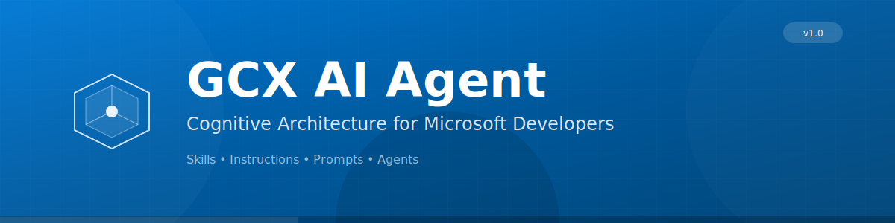
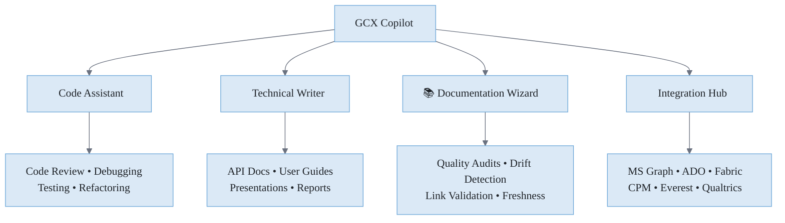
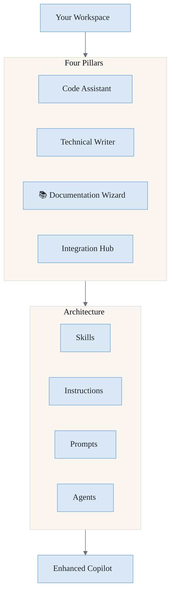

<p align="center">
  
</p>

# GCX Copilot User Manual

> **Version**: 1.0 | **Platform**: VS Code + GitHub Copilot | **Distribution**: GitHub Template Repository

---

## Table of Contents

1. [Introduction](#introduction)
2. [The Four Pillars](#the-four-pillars)
3. [Requirements](#requirements)
4. [Quick Start](#quick-start)
5. [What is the GCX Copilot?](#what-is-the-gcx-ai-agent)
6. [Installation](#installation)
7. [Features by Pillar](#features-by-pillar)
8. [Working with Copilot](#working-with-the-agent)
9. [Available Skills](#available-skills)
10. [Slash Commands](#slash-commands)
11. [Specialist Agents](#specialist-agents)
12. [Customization](#customization)
13. [Best Practices](#best-practices)
14. [Troubleshooting](#troubleshooting)
15. [FAQ](#faq)
16. [Support](#support)

---

## Introduction

The **GCX Copilot** is your intelligent partner for enterprise development at Microsoft. It combines four specialized capabilities into one cognitive architecture:



---

## The Four Pillars

| Pillar | Role | Key Capabilities |
|--------|------|------------------|
| **🔧 Code Assistant** | Your pair programmer | Code review, debugging, testing, refactoring, security analysis |
| **📝 Technical Writer** | Your documentation partner | API docs, user guides, PPTX generation, markdown mastery |
| **📚 Documentation Wizard** | Your quality guardian | Audit pipelines, drift detection, staleness alerts, semantic validation |
| **🔗 Integration Hub** | Your platform connector | ADO, Fabric, Azure, SFI, MS Graph, **CPM**, **Everest**, Qualtrics |

### Core Strengths

| Strength | Description |
|----------|-------------|
| **Microsoft Graph Mastery** | Deep integration with M365 — users, groups, calendar, mail, Teams, SharePoint, OneDrive |
| **Azure DevOps Native** | Work items, pipelines, PRs, boards — all from natural language |
| **Fabric Data Platform** | Medallion architecture, governance, REST API patterns |
| **CPM Compliance** | Customer Promise Management workflows, SLA tracking, compliance reporting |
| **Everest Integration** | Enterprise survey platform, feedback loops, sentiment analysis |
| **SFI Security-First** | STRIDE modeling, secure by design, SDL compliance built-in |

### Key Benefits

| Benefit | Description |
|---------|-------------|
| **Instant Setup** | Just add `.github/` to your repo — no extension install |
| **Microsoft Integration** | Native support for Graph API, ADO, Fabric, Azure, SFI, and more |
| **Quality-First** | Research before code, documentation before shipping |
| **Team Consistency** | Shared skills and standards across your organization |

---

## Quick Start

### For New Projects

```bash
# Create a new repo from the template
gh repo create my-project --template microsoft/gcx-ai-agent-template
cd my-project
code .
```

### For Existing Projects

```bash
# Add Copilot to your existing repo
git remote add gcx-template https://github.com/microsoft/gcx-ai-agent-template.git
git fetch gcx-template
git checkout gcx-template/main -- .github/
git commit -m "feat: add GCX Copilot"
```

**That's it!** Open VS Code, start a Copilot chat, and Copilot is active.

---

## What is the GCX Copilot?

The GCX Copilot is a **cognitive architecture** that lives in your `.github/` folder. It organizes capabilities into four pillars:



### Architecture Components

| Component | Location | Purpose |
|-----------|----------|---------|
| **Identity** | `.github/copilot-instructions.md` | Defines Copilot's behavior and four pillars |
| **Skills** | `.github/skills/` | Domain-specific expertise (50+ skills) |
| **Instructions** | `.github/instructions/` | Auto-loaded rules based on file patterns |
| **Prompts** | `.github/prompts/` | Reusable `/commands` for common tasks |
| **Agents** | `.github/agents/` | Specialist personas (@builder, @documentarian, etc.) |
| **Config** | `.github/config/` | Settings and feature flags |

---

## Requirements

### Software Requirements

| Requirement | Version | Purpose |
|-------------|---------|----------|
| **VS Code** | 1.100+ | IDE with Copilot agent support |
| **GitHub Copilot** | Latest | AI assistant (requires license) |
| **Git** | 2.30+ | Template operations |

### Optional Integrations

| Integration | Requirement | Purpose |
|-------------|-------------|----------|
| **MS Graph API** | Azure AD app registration | M365 data access |
| **Azure DevOps** | PAT or service connection | Work items, pipelines |
| **Microsoft Fabric** | Workspace access | Data platform features |
| **Azure** | Subscription | Cloud resource management |
| **CPM** | API access | Customer Promise Management |
| **Everest** | API credentials | Enterprise survey platform |
| **Qualtrics** | API credentials | Survey data integration |

### Network Access

- GitHub (template repository)
- VS Code Marketplace
- Microsoft Graph API endpoints (if using Graph skills)
- Azure DevOps endpoints (if using ADO skills)

---

## Installation

### VS Code Settings

Ensure these settings are enabled (recommended):

```json
{
  "chat.agent.enabled": true,
  "chat.agentSkillsLocations": [".github/skills"],
  "chat.useAgentsMdFile": true
}
```

### Verify Installation

1. Open any file in your project
2. Open Copilot Chat (`Ctrl+Alt+I` or `Cmd+Alt+I`)
3. Type: `What skills do you have?`
4. Copilot should list its available skills

---

## Features by Pillar

### 🔧 Pillar 1: Code Assistant

Your intelligent pair programmer for all development tasks.

#### Code Review

```
@workspace Review this PR for security issues and performance
```

**What it checks:**
- Security vulnerabilities (SFI/SDL compliance)
- Performance patterns and bottlenecks
- Code style and consistency
- Test coverage gaps
- OWASP top 10 risks

#### Debugging & Root Cause Analysis

```
@workspace This pipeline is failing with error X. Help me debug.
```

**Capabilities:**
- Stack trace analysis
- Log pattern recognition
- Hypothesis generation
- Fix verification

#### Testing Strategies

```
@workspace Generate unit tests for this service class
```

**Support:**
- Unit, integration, and E2E patterns
- Mock generation
- Coverage analysis
- Edge case identification

---

### 📝 Pillar 2: Technical Writer

Your documentation partner for clear, accurate technical content.

#### API Documentation

```
@workspace Document this REST API with OpenAPI spec
```

**Outputs:**
- OpenAPI/Swagger specifications
- Endpoint reference guides
- Authentication documentation
- Error code catalogs

#### Presentation Generation

```
@workspace Create a slide deck summarizing this architecture
```

**Capabilities:**
- Markdown to PPTX conversion
- Data-driven charts and tables
- Professional templates
- Mermaid diagram integration

#### User Guides & READMEs

```
@workspace Write a getting started guide for this project
```

**Deliverables:**
- Installation guides
- Quick start tutorials
- Configuration reference
- Troubleshooting guides

---

### 📚 Pillar 3: Documentation Wizard

Your quality guardian for living documentation.

#### Documentation Audits

```
@workspace Audit our docs for accuracy and freshness
```

**5-Pass Quality Pipeline:**
1. **Semantic Accuracy** — Do claims match implementation?
2. **Cross-Reference Validation** — Are internal links working?
3. **Freshness Check** — Is content up-to-date?
4. **Consistency Scan** — Do related docs agree?
5. **Count Verification** — Are hardcoded numbers accurate?

#### Drift Detection

```
@workspace Check if our API docs match the actual implementation
```

**What it catches:**
- Phantom features (documented but not implemented)
- Undocumented features (implemented but not documented)
- Version mismatches
- Contradictions between files

---

### 🔗 Pillar 4: Integration Hub

Your connector to the Microsoft platform ecosystem.

#### Azure DevOps (ADO)

```
@workspace Create a work item for this bug with acceptance criteria
```

**Features:**
- Work item creation and updates
- PR review automation
- Pipeline troubleshooting
- Board management and queries

#### Microsoft Fabric

```
@workspace Design a medallion architecture for this data project
```

**Capabilities:**
- Workspace governance
- Medallion architecture (bronze/silver/gold)
- REST API patterns
- Permission compliance pipelines
- Data quality monitoring

#### Azure Architecture

```
@workspace Review this Bicep template for best practices
```

**Support:**
- ARM/Bicep template generation
- Well-Architected Framework guidance
- Cost optimization suggestions
- Security hardening recommendations

#### Microsoft Secure Future Initiative (SFI)

```
@workspace Review this code for SFI compliance
```

**Coverage:**
- Secure by Design principles
- Secure by Default validation
- Secure Operations patterns
- STRIDE threat modeling

#### Data Quality Monitoring

```
@workspace Set up data quality checks for this pipeline
```

**Monitors:**
- Row count anomaly detection
- Schema drift alerts
- Null ratio tracking
- Freshness checks

#### Qualtrics Integration

```
@workspace How do I integrate Qualtrics survey data into our pipeline?
```

**Patterns:**
- API consumption
- Survey data ingestion
- Response transformation
- Dashboard integration

#### CPM (Customer Promise Management)

```
@workspace Query CPM data for SLA compliance reporting
```

```
@workspace Build a dashboard showing customer promise fulfillment rates
```

**Capabilities:**
- SLA tracking and reporting
- Customer commitment workflows
- Compliance monitoring
- Promise fulfillment analytics
- Integration with ADO work items

#### Everest Integration

```
@workspace Pull Everest survey responses into our Fabric lakehouse
```

```
@workspace Analyze customer sentiment trends from Everest data
```

**Capabilities:**
- Enterprise survey data ingestion
- Sentiment analysis patterns
- Feedback loop automation
- Cross-survey aggregation
- Integration with Power BI

#### Microsoft Graph API (Core Strength)

Copilot has **deep expertise** in Microsoft Graph — the unified API for Microsoft 365.

```
@workspace Query user calendar events with delegated permissions
```

```
@workspace Set up a webhook subscription for Teams channel messages
```

```
@workspace Batch multiple Graph requests for user and group data
```

**Capabilities:**

| Domain | Examples |
|--------|----------|
| **Users & Groups** | Profile lookup, group membership, org hierarchy |
| **Calendar & Mail** | Events, messages, attachments, scheduling |
| **Teams** | Channels, messages, tabs, apps |
| **SharePoint** | Sites, lists, documents, permissions |
| **OneDrive** | Files, sharing, sync status |
| **Planner** | Tasks, plans, buckets |

**Patterns:**
- MSAL authentication (delegated & app-only)
- Batch request optimization ($batch)
- Change notifications (webhooks)
- Delta queries for sync
- Permission scoping best practices
- Error handling and retry logic

---

## Working with Copilot

### Communication Style

Copilot communicates in a professional, efficient manner:

| Instead of... | Copilot says... |
|---------------|-------------------|
| "I think maybe..." | "Analysis suggests..." |
| "Let me check..." | "Reviewing..." |
| "Hmm, interesting!" | *(gets to the point)* |

### Asking Questions

Copilot may ask clarifying questions before proceeding:

> **Clarification needed:** What is the expected behavior when `userData` is undefined?

This ensures Copilot provides accurate, relevant assistance.

### Research-First Approach

Copilot follows a research-first methodology:

1. **Understand** — Asks questions to clarify requirements
2. **Research** — Checks documentation and patterns
3. **Plan** — Outlines approach before implementation
4. **Implement** — Writes quality code with tests
5. **Validate** — Verifies the solution works

---

## Available Skills

### 🔧 Code Assistant Skills

| Skill | Description | Use When |
|-------|-------------|----------|
| `code-review` | Comprehensive code analysis with SFI compliance | Reviewing PRs or code changes |
| `debugging-patterns` | Root cause analysis and fix verification | Investigating bugs |
| `refactoring-patterns` | Code improvement and cleanup | Cleaning up technical debt |
| `testing-strategies` | Test design, mocks, coverage | Writing tests |
| `security-review` | OWASP, STRIDE, SFI compliance | Pre-release security checks |
| `content-safety-implementation` | Azure Content Safety API patterns | Building safe AI features |

### 📝 Technical Writer Skills

| Skill | Description | Use When |
|-------|-------------|----------|
| `api-documentation` | OpenAPI specs, endpoint docs | Documenting APIs |
| `pptx-generation` | Markdown to PowerPoint | Creating presentations |
| `gamma-presentations` | Gamma.app integration | Modern slide decks |
| `md-to-word` | Markdown to Word conversion | Formal documents |
| `executive-storytelling` | Leadership-ready content | Executive summaries |

### 📚 Documentation Wizard Skills

| Skill | Description | Use When |
|-------|-------------|----------|
| `documentation-quality-assurance` | 5-pass audit pipeline | Auditing documentation |
| `doc-hygiene` | Cleanup and maintenance | Spring cleaning docs |
| `lint-clean-markdown` | Markdown linting | Enforcing standards |
| `knowledge-synthesis` | Consolidating information | Creating summaries |

### 🔗 Integration Hub Skills

| Skill | Description | Use When |
|-------|-------------|----------|
| `azure-devops-automation` | CI/CD, pipelines, work items | ADO workflows |
| `microsoft-fabric` | Workspaces, medallion, governance | Data platform work |
| `azure-architecture-patterns` | ARM, Bicep, Well-Architected | Cloud architecture |
| `azure-deployment-operations` | Deployment automation | Release management |
| `microsoft-graph-api` | M365 integration | Graph API calls |
| `msal-authentication` | Azure AD auth patterns | Authentication |
| `data-quality-monitoring` | Anomaly detection, schema drift | Pipeline quality |
| `infrastructure-as-code` | Bicep, Terraform patterns | IaC development |

### Enterprise & Compliance Skills

| Skill | Description | Use When |
|-------|-------------|----------|
| `security-review` | SFI, SDL, STRIDE analysis | Security compliance |
| `pii-privacy-regulations` | GDPR, privacy patterns | Data protection |
| `legal-compliance` | Regulatory requirements | Compliance checks |
| `observability-monitoring` | Metrics, logging, tracing | Operational excellence |

---

## Slash Commands

Access frequently used workflows with slash commands:

### 🔧 Code Assistant Commands

| Command | Description |
|---------|-------------|
| `/review` | Start a code review session |
| `/debug` | Begin debugging analysis |
| `/test` | Generate tests for selected code |
| `/security` | Run SFI/security analysis |
| `/refactor` | Suggest refactoring improvements |

### 📝 Technical Writer Commands

| Command | Description |
|---------|-------------|
| `/docs` | Generate documentation |
| `/api-docs` | Create API reference |
| `/slides` | Generate presentation |
| `/explain` | Explain how code works |

### 📚 Documentation Wizard Commands

| Command | Description |
|---------|-------------|
| `/audit` | Run documentation audit |
| `/freshness` | Check for stale content |
| `/links` | Validate all links |

### 🔗 Integration Commands

| Command | Description |
|---------|-------------|
| `/ado` | Azure DevOps operations |
| `/fabric` | Microsoft Fabric helpers |
| `/pipeline` | Pipeline troubleshooting |

### Usage Examples

```
/review src/api/userService.ts --security
```

```
/docs --format openapi src/api/
```

```
/slides --template corporate data-strategy.md
```

```
/audit docs/ --semantic
```

---

## Specialist Agents

The GCX Copilot includes specialist personas for complex tasks:

### @builder

Expert in implementation and coding (🔧 Code Assistant):

```
@builder Implement a retry mechanism with exponential backoff
```

### @documentarian

Expert in technical writing and documentation (📝 Technical Writer + 📚 Documentation Wizard):

```
@documentarian Create comprehensive API documentation for this service
```

### @researcher

Expert in exploration and analysis:

```
@researcher What's the best practice for handling large file uploads in Azure?
```

### @validator

Expert in testing and quality assurance:

```
@validator Review this function for edge cases and security issues
```

### @azure

Expert in Azure architecture and deployment (🔗 Integration Hub):

```
@azure Design a scalable event-driven architecture for this workload
```

### @fabric

Expert in Microsoft Fabric and data platforms (🔗 Integration Hub):

```
@fabric Design a medallion architecture with proper governance
```

---

## Customization

### Adding Team-Specific Skills

Create custom skills for your team:

```
.github/skills/your-skill/
├── SKILL.md          # Skill definition
├── your-skill.instructions.md  # Implementation guidance
└── synapses.json     # Skill metadata
```

**SKILL.md Template:**

```markdown
---
name: your-skill
description: Brief description of what this skill does
---

# Your Skill Name

## When to Use

- Situation 1
- Situation 2

## How It Works

Detailed instructions for Copilot...

## Examples

### Example 1

[Show input/output examples]
```

### Modifying Instructions

Edit `.github/instructions/*.instructions.md` to customize behavior for specific file types:

```yaml
---
applyTo: "**/*.tsx"
---

When working with React components:
- Always use functional components with hooks
- Follow the team's naming conventions
- Include PropTypes or TypeScript interfaces
```

### Configuration

Edit `.github/config/settings.json` to adjust Agent behavior:

```json
{
  "codeReview": {
    "strictMode": true,
    "checkSecurityPatterns": true
  },
  "documentation": {
    "defaultFormat": "markdown",
    "includeDiagrams": true
  }
}
```

---

## Best Practices

### 1. Choose the Right Pillar

| Task | Pillar | Example Prompt |
|------|--------|----------------|
| Bug fix | 🔧 Code Assistant | "Debug this null reference exception" |
| Write docs | 📝 Technical Writer | "Create API documentation for this endpoint" |
| Quality check | 📚 Documentation Wizard | "Audit our docs for accuracy" |
| Platform work | 🔗 Integration Hub | "Set up a Fabric workspace with medallion architecture" |

### 2. Be Specific

> "Fix this code"

vs.

> "This function throws a null reference error when userData is undefined. Add proper null checking."

### 3. Provide Context

> "Review this"

vs.

> "Review this authentication handler for SFI compliance. We're using MSAL with Azure AD B2C."

### 4. Use Specialist Agents for Complex Tasks

- **Multi-file implementation?** → Use `@builder`
- **Documentation project?** → Use `@documentarian`
- **Data architecture?** → Use `@fabric`
- **Cloud design?** → Use `@azure`

### 5. Trust but Verify

Copilot is powerful but not infallible:
- Review generated code before committing
- Run tests after changes
- Validate security recommendations
- Cross-check documentation claims

### 6. Keep Skills Updated

```bash
# Pull latest skills from template
git fetch gcx-template
git merge gcx-template/main --no-commit
# Review changes, resolve conflicts
git commit -m "chore: update GCX Copilot"
```

---

## Troubleshooting

### Agent Not Responding

**Symptoms:** Copilot doesn't seem to use Agent skills

**Solutions:**
1. Verify `.github/copilot-instructions.md` exists
2. Check VS Code settings: `chat.agent.enabled: true`
3. Reload VS Code window (`Ctrl+Shift+P` → "Reload Window")

### Skills Not Loading

**Symptoms:** "I don't have that skill" responses

**Solutions:**
1. Check skill folder structure matches expected format
2. Verify SKILL.md has valid YAML frontmatter
3. Check `chat.agentSkillsLocations` includes `.github/skills`

### Slow Responses

**Symptoms:** Agent takes too long to respond

**Solutions:**
1. Keep skill files concise (under 500 lines)
2. Use progressive disclosure in SKILL.md
3. Split complex skills into multiple focused skills

### Inconsistent Behavior

**Symptoms:** Agent behaves differently than expected

**Solutions:**
1. Check for conflicting instructions in `.github/instructions/`
2. Review `copilot-instructions.md` for conflicting directives
3. Clear Copilot chat history and retry

---

## FAQ

### Q: Does this replace GitHub Copilot?

**A:** No. The GCX Copilot enhances Copilot with specialized skills and behaviors. It works alongside Copilot, not instead of it.

### Q: Do I need an extension?

**A:** No. Copilot is purely content-based. It lives in your `.github/` folder and Copilot loads it automatically.

### Q: Can I use this with other AI assistants?

**A:** Copilot is designed for GitHub Copilot. Some content may work with other assistants, but behavior may vary.

### Q: How do I update to new versions?

**A:** Merge from the template repository:
```bash
git fetch gcx-template
git merge gcx-template/main
```

### Q: Can I contribute new skills?

**A:** Yes! See CONTRIBUTING.md in the template repository for guidelines.

### Q: Is my code sent anywhere?

**A:** Copilot uses your existing GitHub Copilot subscription. Code handling follows Microsoft's standard Copilot privacy policies.

---

## Support

### Getting Help

- **Teams Channel:** [GCX Copilot Support]
- **Issue Tracker:** [Template repo issues]
- **Documentation:** This manual + CUSTOMIZING.md

### Reporting Issues

When reporting issues, include:
1. VS Code version
2. Steps to reproduce
3. Expected vs actual behavior
4. Relevant skill/instruction files

### Feature Requests

Submit feature requests through:
1. Teams channel discussion
2. Template repo pull requests
3. Email to the GCX team

---

<div align="center">

**GCX Copilot** — *Enhanced Copilot for Microsoft Developers*

Built with the Cognitive Architecture from [Alex](../../.github/copilot-instructions.md)

</div>
