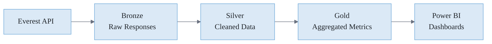

# Everest Integration Guide

> Enterprise survey platform — feedback loops, sentiment analysis, and survey data integration.

---

## Overview

Everest is the enterprise survey and feedback platform. The GCX Copilot helps you ingest Everest data, analyze sentiment trends, and integrate survey insights into your data pipelines and dashboards.

---

## Prerequisites

| Requirement | Purpose |
|-------------|---------|
| Everest API Access | Data queries |
| API Key | Authentication |
| Survey Project Access | Data permissions |
| Azure Key Vault | Credential storage |

---

## Setup

### Step 1: Obtain API Credentials

Contact your Everest administrator to obtain:
- API endpoint URL
- API key
- Project/survey access permissions

### Step 2: Store Credentials Securely

```
@workspace Set up Key Vault for Everest credentials
```

---

## Common Operations

### Survey Data Ingestion

```
@workspace Pull Everest survey responses into our Fabric lakehouse
```

```
@workspace Set up automated daily sync of Everest data
```

```
@workspace Export all responses from survey ID 12345
```

### Sentiment Analysis

```
@workspace Analyze customer sentiment trends from Everest data
```

```
@workspace Build a sentiment dashboard from survey responses
```

```
@workspace Compare sentiment across different survey periods
```

### Feedback Loops

```
@workspace Create an alert when negative sentiment exceeds threshold
```

```
@workspace Route survey feedback to appropriate teams
```

```
@workspace Track feedback-to-action cycle time
```

### Cross-Survey Aggregation

```
@workspace Combine data from multiple Everest surveys
```

```
@workspace Build a unified customer feedback view
```

```
@workspace Identify trends across survey types
```

### Power BI Integration

```
@workspace Create a Power BI dataset from Everest data
```

```
@workspace Build an Everest sentiment dashboard in Power BI
```

```
@workspace Set up scheduled refresh for Everest reports
```

---

## Data Model

| Entity | Description |
|--------|-------------|
| **Survey** | Survey definition and configuration |
| **Response** | Individual survey submission |
| **Question** | Survey questions and types |
| **Score** | Calculated metrics (NPS, CSAT, etc.) |

---

## Common Metrics

| Metric | Description | Calculation |
|--------|-------------|-------------|
| **NPS** | Net Promoter Score | Promoters - Detractors |
| **CSAT** | Customer Satisfaction | Satisfied / Total |
| **CES** | Customer Effort Score | Ease of interaction |
| **Response Rate** | Participation | Responses / Invitations |

---

## Best Practices

1. **Automate ingestion** — Set up scheduled data pulls
2. **Normalize scores** — Standardize across survey types
3. **Track trends** — Focus on changes over time
4. **Close the loop** — Connect feedback to action items
5. **Privacy compliance** — Handle PII appropriately

---

## Integration with Fabric



---

## Related Skills

- `everest-integration` — Everest patterns
- `microsoft-fabric` — Data platform integration
- `data-quality-monitoring` — Quality checks
- `observability-monitoring` — Alerting
