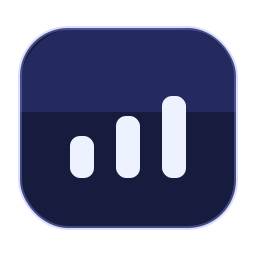
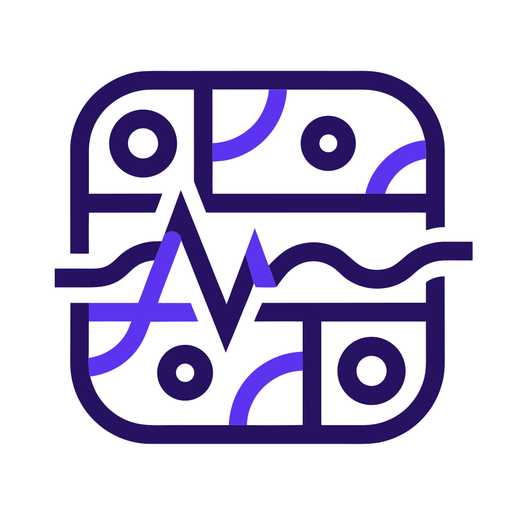
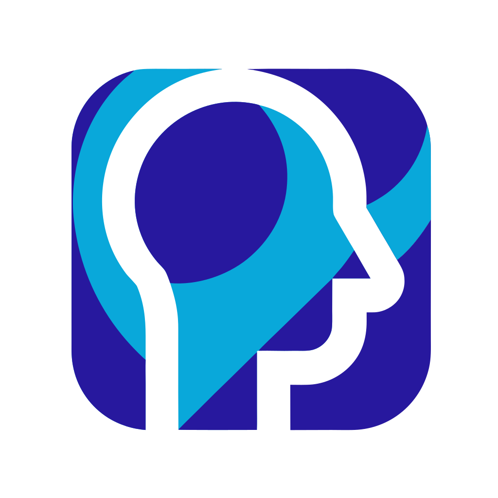
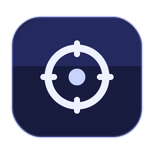
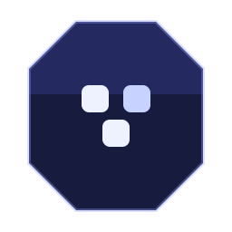
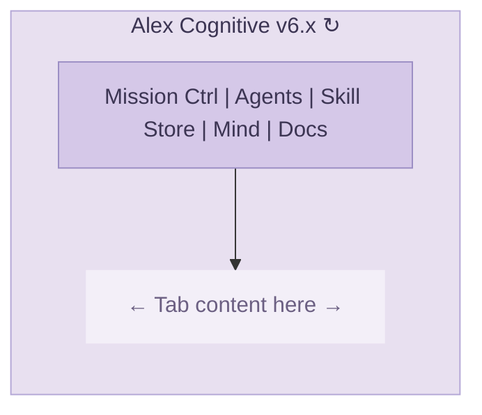
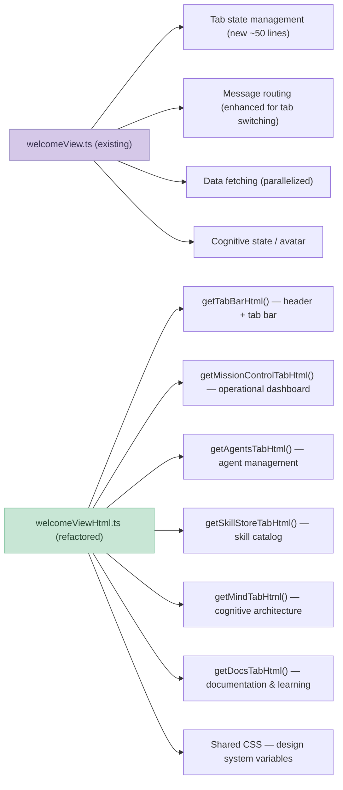
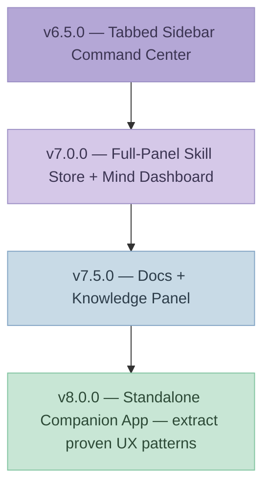

# Alex Command Center: Welcome View Evolution

**Author**: Alex Finch (Builder mode)
**Date**: March 5, 2026
**Classification**: Internal — Architecture Decision
**Status**: Approved research/design baseline — superseded for execution by [COMMAND-CENTER-MASTER-PLAN-2026-03-05.md](COMMAND-CENTER-MASTER-PLAN-2026-03-05.md)
**Related**: [CODEX-COMPETITIVE-ANALYSIS-2026-03-05.md](CODEX-COMPETITIVE-ANALYSIS-2026-03-05.md)

---

## Execution Status

This document remains the research and design rationale for the Command Center.

For sequencing, milestone decisions, and delivery guardrails, use [COMMAND-CENTER-MASTER-PLAN-2026-03-05.md](COMMAND-CENTER-MASTER-PLAN-2026-03-05.md) as the execution source of truth.

The tracker below is preserved as historical feasibility planning context and should not be used as the active delivery checklist.

---

## Implementation Tracker

| # | Task | Phase | Status | Notes |
|---|------|-------|--------|-------|
| | **Phase 0A — SVG Icon Design** | | | |
| 0A.1 | Generate SVG icon options (38 positions × 3 each = 114 total) | 0A | Done | `mockups/icons/` — 5 categories, 16 persona categories |
| 0A.2 | Review & approve all 38 icon positions | 0A | Not Started | Mark A/B/C in Approved column |
| | **Phase 0 — Clean Slate** | | | |
| 0.1 | Archive `assets/avatars/` to `archive/avatars/` (112 PNGs, 26 MB) | 0 | Not Started | `.vsix` drops from ~28 MB to ~2 MB; originals preserved |
| 0.2 | Extract `cognitiveState.ts` from avatarMappings | 0 | Not Started | Preserves `detectCognitiveState()`, triggers, interfaces |
| 0.3 | Archive `avatarMappings.ts` to `archive/` (598 lines) | 0 | Not Started | Depends on 0.2 |
| 0.4 | Gut `welcomeViewHtml.ts` → empty shell (~100 lines) | 0 | Not Started | Keep `getLoadingHtml()`, `getErrorHtml()` |
| 0.5 | Gut `welcomeView.ts` → minimal provider (~80 lines) | 0 | Not Started | Keep core commands: refresh, setState, setAgent |
| 0.6 | Remove `cognitiveDashboard` sidebar registration | 0 | Not Started | Keep file for editor panel; remove sidebar view |
| 0.7 | Archive `memoryTreeProvider.ts` + test file to `archive/` | 0 | Not Started | Editor panel `memoryDashboard.ts` stays |
| 0.8 | Update `extension.ts` (remove imports + registrations) | 0 | Not Started | Remove L69-70 imports, L213 + L497 calls |
| 0.9 | Update `package.json` (views, commands) | 0 | Not Started | 3 views → 1, rename to "Command Center" |
| 0.10 | Update references (`participant.ts`, `uxFeatures.ts`, `.vscodeignore`) | 0 | Not Started | Placeholder icon until Phase 1 SVG |
| 0.11 | Establish Command Center shell (tab bar + CSS + switching) | 0 | Not Started | 5 empty tabs, working sidebar, no data fetch |
| 0.12 | Tab state persistence + recently-used tracking | 0 | Not Started | `globalState` remembers last active tab |
| 0.13 | Compile + smoke test | 0 | Not Started | Extension activates, sidebar shows empty shell |
| | **Phase 1 — Mission Control + SVG Avatars** | | | |
| 1.1 | Spike: validate SVG `iconPath` for `ChatParticipant` | 1 | Not Started | Blocking: type check confirms Uri accepted; runtime test needed for data-URI |
| 1.2 | Design SVG icon set (~25 icons: 9 state, 6 agent, ~10 persona) | 1 | Not Started | Shape=category, color=state, CorreaX palette |
| 1.3 | SVG template functions in `svgIcons.ts` | 1 | Not Started | Replaces PNG pipeline with inline SVG |
| 1.4 | Update `chatAvatarBridge.ts` for SVG data-URI | 1 | Not Started | `participant.iconPath` gets SVG-based path |
| 1.5 | Architecture Status Banner (3 states) | 1 | Not Started | Up to Date / Update Available / Not Initialized |
| 1.6 | Smart Nudges (health, dream, streak) | 1 | Not Started | Migrate nudge logic from old welcomeView |
| 1.7 | Quick Command Bar + Live Activity Feed | 1 | Not Started | Agent task display + inline chat |
| 1.8 | Secret Manager + Settings Manager | 1 | Not Started | Token status, tiered settings sync |
| 1.9 | Context Budget bar + Personality Toggle | 1 | Not Started | Context window % + Precise/Chatty switch |
| | **Phase 2 — Agents Tab** | | | |
| 2.1 | Agent Registry (7 agents with status badges) | 2 | Not Started | ACTIVE / QUEUED / ROUTING / IDLE |
| 2.2 | Cognitive State display (mini avatar + reasoning meter) | 2 | Not Started | Received from Mission Control scope |
| 2.3 | Search bar + filter + color-coded borders | 2 | Not Started | Green=active, indigo=queued, gray=idle |
| 2.4 | Recent Agent Threads + thread detail toggle | 2 | Not Started | Verbose/Standard/Terse switch |
| 2.5 | Create Custom Agent CTA | 2 | Not Started | Dashed-border placeholder |
| | **Phase 3 — Skill Store** | | | |
| 3.1 | Skill catalog data layer (scan `.github/skills/`) | 3 | Not Started | Trifecta completeness, health badges |
| 3.2 | 3-tier catalog (Core / Development / Creative) | 3 | Not Started | Categories + toggle switches |
| 3.3 | Skill cards with trifecta badges | 3 | Not Started | On/off toggle, dimmed when disabled |
| 3.4 | Context Budget Impact display | 3 | Not Started | Active skill count + context % consumed |
| 3.5 | Search + filter + Install from GitHub CTA | 3 | Not Started | |
| | **Phase 4 — Mind Tab** | | | |
| 4.1 | Brain Health banner (synapse count, broken, scanned) | 4 | Not Started | EXCELLENT/GOOD/DEGRADED + progress bar |
| 4.2 | Memory Architecture cards (5 modalities) | 4 | Not Started | Semantic, Procedural, Episodic, Visual, Muscles |
| 4.3 | Cognitive Age + Knowledge Freshness | 4 | Not Started | Age tier progression + forgetting curve |
| 4.4 | Meditation & Growth + Honest Uncertainty | 4 | Not Started | Streak, emotional pattern, confidence bars |
| 4.5 | Cognitive Actions (/meditate, /dream, /self-actualize) | 4 | Not Started | Quick-launch buttons |
| 4.6 | Global Knowledge + Identity card | 4 | Not Started | Insight count, promoted this cycle, Alex Finch card |
| | **Phase 5 — Docs Tab (AlexLearn-aligned)** | | | |
| 5.1 | Tips & Nudges engine (context-aware suggestions) | 5 | Not Started | Health warnings, streak reminders, discovery |
| 5.2 | Getting Started grid (Setup Guide, User Manual, Quick Ref, Env Setup) | 5 | Not Started | Mirrors learnalex.correax.com setup flow |
| 5.3 | Workshop Study Guides — persona selector grid (33 personas) | 5 | Not Started | Card grid linking to learnalex.correax.com/workshop/{persona} |
| 5.4 | Self-Study & Exercises section (30/60/90-day path + hands-on) | 5 | Not Started | Links to /self-study and /exercises |
| 5.5 | Facilitator Materials (Session Plan, Slides, Demo Scripts, Handout, Pre-Read) | 5 | Not Started | Collapsible section for workshop organizers |
| 5.6 | Architecture + Operations doc grids | 5 | Not Started | 2×3 + 2×2 compact card layouts (local docs) |
| 5.7 | Learn Alex Online CTA + Partnership guide | 5 | Not Started | learnalex.correax.com hero banner + Working with Alex |
| | **Phase 6 — Final Polish** | | | |
| 6.1 | Redirect legacy commands to Command Center | 6 | Not Started | `showCognitiveDashboard` → Mind tab, etc. |
| 6.2 | Verify sole-view state (no orphan registrations) | 6 | Not Started | Only `alex.welcomeView` in package.json |
| 6.3 | Update documentation (README, CHANGELOG, guides) | 6 | Not Started | |
| 6.4 | End-to-end testing + accessibility pass | 6 | Not Started | Keyboard navigation, screen reader, contrast |

```mermaid
%%{init: {'theme': 'base', 'themeVariables': {'primaryColor': '#d5c8e8', 'primaryTextColor': '#3c3553', 'primaryBorderColor': '#9b8ec4', 'secondaryColor': '#c8e6d5', 'tertiaryColor': '#fce4c8', 'lineColor': '#9b8ec4', 'sectionBkgColor': '#f3eff8', 'altSectionBkgColor': '#e8f3ee', 'taskBkgColor': '#d5c8e8', 'taskTextColor': '#3c3553', 'taskBorderColor': '#9b8ec4', 'activeTaskBkgColor': '#c8dae6', 'activeTaskBorderColor': '#82a4c4', 'doneTaskBkgColor': '#c8e6d5', 'doneTaskBorderColor': '#82c4a0'}}}%%
gantt
    title Command Center Implementation Phases
    dateFormat X
    axisFormat %s days

    section Phase 0A — Icon Design
    Generate 114 SVG icon options       :done, p0z, 0, 1d
    Review & approve 30 icon positions   :p0y, after p0z, 1d

    section Phase 0 — Clean Slate
    Archive avatars + extract cognitiveState :p0a, after p0y, 1d
    Archive avatarMappings.ts                :p0b, after p0a, 1d
    Gut welcomeViewHtml.ts + welcomeView.ts  :p0c, 0, 1d
    Remove dashboard + tree sidebar views    :p0d, after p0c, 1d
    Update extension.ts + package.json       :p0e, after p0d, 1d
    Update references (participant, ux, etc) :p0f, after p0b, 1d
    Command Center shell (tabs + CSS)        :p0g, after p0e, 1d
    Tab state persistence + recently-used    :p0h, after p0g, 1d
    Compile + smoke test                     :p0i, after p0h, 1d

    section Phase 1 — Mission Control + SVG Avatars
    SVG iconPath spike                       :p1a, after p0i, 1d
    SVG icon set (~25 icons)                 :p1b, after p1a, 2d
    SVG templates + avatar bridge update     :p1c, after p1b, 1d
    Architecture banner + Smart Nudges       :p1d, after p1c, 1d
    Quick Command + Activity Feed            :p1e, after p1d, 1d
    Secrets + Settings + Context + Personality :p1f, after p1e, 1d

    section Phase 2 — Agents Tab
    Agent Registry (7 agents + status)       :p2a, after p1f, 1d
    Cognitive State + Parallel Agents        :p2b, after p2a, 1d
    Search + filter + threads + custom CTA   :p2c, after p2b, 1d

    section Phase 3 — Skill Store
    Skill catalog data layer                 :p3a, after p2c, 1d
    3-tier catalog + toggle switches         :p3b, after p3a, 1d
    Skill cards + trifecta badges            :p3c, after p3b, 1d
    Context impact + search + GitHub CTA     :p3d, after p3c, 1d

    section Phase 4 — Mind Tab
    Brain Health banner + synapse dashboard  :p4a, after p3d, 1d
    Memory Architecture cards (5 modalities) :p4b, after p4a, 1d
    Cognitive Age + Knowledge Freshness      :p4c, after p4b, 1d
    Meditation + Uncertainty + Actions       :p4d, after p4c, 1d
    Global Knowledge + Identity card         :p4e, after p4d, 1d

    section Phase 5 — Docs Tab (AlexLearn-aligned)
    Tips & Nudges engine                     :p5a, after p4e, 1d
    Getting Started + Setup Guide grid       :p5b, after p5a, 1d
    Workshop Study Guides (33 personas)      :p5c, after p5b, 1d
    Self-Study + Exercises section           :p5d, after p5c, 1d
    Facilitator Materials (collapsible)      :p5e, after p5d, 1d
    Architecture + Operations grids          :p5f, after p5e, 1d
    Learn Online CTA + Partnership           :p5g, after p5f, 1d

    section Phase 6 — Final Polish
    Redirect legacy commands                 :p6a, after p5g, 1d
    Verify sole-view + doc updates           :p6b, after p6a, 1d
    End-to-end test + accessibility pass     :p6c, after p6b, 1d
```



---

## Phase 0A — SVG Icon Design Approval

Before implementation starts, every icon position in the Command Center UI needs an approved design. This phase catalogs all 38 icon positions across 5 categories, with 3 design options each (114 SVGs total). Mark your choice in the **Approved** column.

**Design system:**
- This generated set is exploratory and predates the stricter Command Center UI asset rules in `alex_docs/DK-correax-brand.md`
- Container shape still encodes category: **rounded rect** (tabs), **circle** (states), **hexagon** (agents), **squircle** (personas/default)
- Final implementation-grade assets should use vector-only symbols, a consistent stroke/depth grammar, and CorreaX-led semantic accents
- Persona categories expanded from 8 to 16 to cover all 33 AlexLearn workshop personas (learnalex.correax.com)

**Source files:** `alex_docs/research/mockups/icons/` — regenerate with `generate-icon-options.ps1`

### Tab Bar Icons (5)

These appear in the Command Center tab strip. Indigo palette (#6366f1 → #818cf8), rounded rectangle container.

| # | Position | Description | Option A | Option B | Option C | Approved |
|---|----------|-------------|----------|----------|----------|----------|
| 1 | Mission Control | Dashboard / status overview |  |  |  | |
| 2 | Agents | Agent hub / team management |  |  |  | |
| 3 | Skill Store | Skill catalog / capabilities |  |  |  | |
| 4 | Mind | Brain / cognitive architecture |  |  |  | |
| 5 | Docs | Documentation / reference |  |  |  | |

**Option legend:**
- Mission: A = Signal bars, B = Gauge/speedometer, C = Pulse/heartbeat
- Agents: A = Person bust, B = Two people, C = Network nodes
- Skills: A = 2×2 grid, B = Lightning bolt, C = Star
- Mind: A = Brain lobes, B = Atom/orbits, C = Concentric circles (zen eye)
- Docs: A = Document with lines, B = Open book, C = Bookmark

### Cognitive State Icons (9)

Shown as the avatar in sidebar and Copilot Chat. Circle container, color indicates state.

| # | State | Color | Description | Option A | Option B | Option C | Approved |
|---|-------|-------|-------------|----------|----------|----------|----------|
| 6 | Building | Indigo | Active construction / implementation |  |  |  | |
| 7 | Debugging | Red | Error investigation / fixing |  |  |  | |
| 8 | Planning | Blue | Architecture / design decisions |  |  |  | |
| 9 | Reviewing | Teal | Code review / quality assessment |  |  |  | |
| 10 | Learning | Green | Knowledge absorption / study |  |  |  | |
| 11 | Teaching | Amber | Explaining / presenting |  |  |  | |
| 12 | Meditation | Emerald | Reflection / consolidation |  |  |  | |
| 13 | Dream | Purple | Neural maintenance / sleep |  |  |  | |
| 14 | Discovery | Gold | Insight / eureka moment |  |  |  | |

**Option legend:**
- Building: A = Up arrow, B = Triangle, C = Plus/cross
- Debugging: A = Circle with X, B = Exclamation, C = Bug with antennae
- Planning: A = Diamond, B = Horizontal lines, C = Fork/branch
- Reviewing: A = Checkmark, B = Eye, C = Magnifying glass
- Learning: A = Open book, B = Lightbulb (outline), C = Graduation cap
- Teaching: A = Megaphone, B = Person at podium, C = Broadcast waves
- Meditation: A = Lotus arch, B = Enso circle (broken ring), C = Infinity (two circles)
- Dream: A = Crescent moon, B = Moon + star, C = Cloud with Zzz
- Discovery: A = Lightbulb (glow), B = 4-point sparkle, C = Compass

### Agent Mode Icons (7)

Shown when a specialist agent is active. Hexagonal container, color per agent.

| # | Agent | Color | Description | Option A | Option B | Option C | Approved |
|---|-------|-------|-------------|----------|----------|----------|----------|
| 15 | Alex | Indigo | Orchestrator / default |  |  |  | |
| 16 | Researcher | Blue | Deep exploration / analysis |  |  |  | |
| 17 | Builder | Green | Constructive implementation |  |  |  | |
| 18 | Validator | Red | QA / adversarial review |  |  |  | |
| 19 | Documentarian | Amber | Documentation / writing |  |  |  | |
| 20 | Azure | Azure Blue | Cloud infrastructure |  |  |  | |
| 21 | M365 | MS Orange | Microsoft 365 integration |  |  |  | |

**Option legend:**
- Alex: A = "A" monogram, B = 5-point star, C = Infinity loops
- Researcher: A = Magnifying glass, B = Lab flask, C = Question mark
- Builder: A = Hammer, B = Gear/cog, C = Crane
- Validator: A = Shield + check, B = Check in circle, C = Balance/scales
- Documentarian: A = Document with lines, B = Scroll, C = Quotation mark
- Azure: A = Cloud (filled), B = Cloud with upload arrow, C = Server stack
- M365: A = 4 squares (MS logo), B = "M" monogram, C = Diamond

### Persona Category Icons (16) — Aligned with AlexLearn Workshop Study Guides

Shown when a persona is active and no agent/state overrides. Squircle container (high border radius), color per persona category. Expanded from 8 to 16 categories to cover all 33 AlexLearn workshop personas (learnalex.correax.com).

| # | Category Icon | Color | AlexLearn Personas Covered | Option A | Option B | Option C | Approved |
|---|---------------|-------|---------------------------|----------|----------|----------|----------|
| 22 | Software | Indigo | Software Developers |  |  |  | |
| 23 | Engineering | Blue | Engineers |  |  |  | |
| 24 | Science | Teal | Scientists, AI Researchers |  |  |  | |
| 25 | Data | Cyan | Data Analysts, Visual Storytellers |  |  |  | |
| 26 | Design | Purple | Designers (UX/UI) |  |  |  | |
| 27 | Creative | Violet | Creative Writers, Content Creators, Podcasters, Standup Comics, Journalists |  |  |  | |
| 28 | Documentation | Amber | Technical Writers |  |  |  | |
| 29 | Business | Slate | Consultants, Knowledge Workers, Executives (CxO) |  |  |  | |
| 30 | Finance | Green | Finance Professionals |  |  |  | |
| 31 | Product | Orange | Product Managers, Project Managers, Entrepreneurs |  |  |  | |
| 32 | Marketing | Coral | Marketing Professionals, Sales Professionals, Real Estate Professionals |  |  |  | |
| 33 | Education | Emerald | Teachers & Educators, Students, Researchers & Professors |  |  |  | |
| 34 | Healthcare | Red | Healthcare Professionals, Psychology Counselors |  |  |  | |
| 35 | Legal | Gold | Lawyers |  |  |  | |
| 36 | People | Pink | HR & People Ops, CX Leaders, Nonprofit Leaders |  |  |  | |
| 37 | Career | Sky | Job Seekers |  |  |  | |

**Option legend:**
- Software: A = Code brackets `</>`, B = Terminal prompt `>_`, C = Hash `#` grid
- Engineering: A = Gear with spokes, B = Wrench, C = Circuit board
- Science: A = Atom orbits, B = Flask/beaker, C = Microscope
- Data: A = Bar chart, B = Database cylinder, C = Pie chart
- Design: A = Pen tool cursor, B = Color palette (3 circles), C = Paintbrush
- Creative: A = Quill/feather, B = Microphone, C = Drama masks
- Documentation: A = Document with pen, B = Italic serif "A", C = Pilcrow ¶
- Business: A = Briefcase, B = Building facade, C = Handshake
- Finance: A = Dollar sign, B = Line chart trending up, C = Calculator
- Product: A = Roadmap/flag, B = Kanban board, C = Rocket
- Marketing: A = Megaphone, B = Target/bullseye, C = Trending arrow
- Education: A = Graduation cap, B = Book spine, C = Apple
- Healthcare: A = Heart with plus, B = Stethoscope, C = Caduceus
- Legal: A = Scales of justice, B = Gavel, C = Shield with checkmark
- People: A = Two people silhouette, B = Handshake circle, C = Heart in hand
- Career: A = Compass, B = Ascending stairs, C = Briefcase with star

**AlexLearn → Icon Category mapping (all 33 personas):**

| AlexLearn Persona | Tag | Icon Category |
|-------------------|-----|---------------|
| Software Developers | Software | Software |
| Engineers | Engineering | Engineering |
| AI Researchers | AI Research | Science |
| Scientists | Science | Science |
| Data Analysts | Data | Data |
| Visual Storytellers | Data Visualization | Data |
| Designers (UX/UI) | Design | Design |
| Creative Writers | Creative Writing | Creative |
| Content Creators | Content | Creative |
| Podcasters | Podcasting | Creative |
| Standup Comics | Comedy | Creative |
| Journalists | Journalism | Creative |
| Technical Writers | Documentation | Documentation |
| Consultants | Consulting | Business |
| Knowledge Workers | Business | Business |
| Executives (CxO) | Leadership | Business |
| Finance Professionals | Finance | Finance |
| Product Managers | Product | Product |
| Project Managers | Project Management | Product |
| Entrepreneurs | Startup | Product |
| Marketing Professionals | Marketing | Marketing |
| Sales Professionals | Sales | Marketing |
| Real Estate Professionals | Real Estate | Marketing |
| Teachers & Educators | Teaching | Education |
| Students | Learning | Education |
| Researchers & Professors | Academic | Education |
| Healthcare Professionals | Healthcare | Healthcare |
| Psychology Counselors | Counseling | Healthcare |
| Lawyers | Legal | Legal |
| HR & People Ops | HR | People |
| CX Leaders | Customer Experience | People |
| Nonprofit Leaders | Nonprofit | People |
| Job Seekers | Career | Career |

### Default / Fallback Icon (1)

Used when no specific state, agent, or persona is active. Circle container, indigo.

| # | Icon | Description | Option A | Option B | Option C | Approved |
|---|------|-------------|----------|----------|----------|----------|
| 30 | Alex Default | Neutral / idle state |  |  |  | |

**Option legend:**
- Default: A = Bold "A" monogram, B = 4-point sparkle, C = Minimal smiley face

### Approval Summary

| Category | Count | Container Shape | Color Strategy |
|----------|-------|----------------|----------------|
| Tab Bar | 5 | Rounded Rectangle | Unified indigo |
| Cognitive States | 9 | Circle | Color = state meaning |
| Agent Modes | 7 | Hexagon | Color = agent identity |
| Persona Categories | 16 | Squircle | Color = persona domain (covers 33 AlexLearn workshop personas) |
| Default | 1 | Circle | Indigo (brand default) |
| **Total** | **38 positions** | — | **114 options to review** |

**How to approve**: Mark your selection (A, B, or C) in the **Approved** column. After all 38 positions are approved, Phase 1 implementation (task 1.2) will produce the final SVG template functions using the selected designs.

**Open in VS Code Preview** (`Ctrl+Shift+V`) to see all thumbnails rendered inline.

---

## Phase 0 — Clean Slate: Detailed Cleanup Plan

Before building the Command Center, we gut the discontinued code and assets to start from a clean foundation. The extension must still compile and activate after each step — no broken intermediate states.

### Step 1: Archive Avatar Assets

Move all avatar assets from `assets/avatars/` to `archive/avatars/` — preserving originals outside the extension package while keeping them accessible in the repo.

| Action | Target | Impact |
|--------|--------|--------|
| Move `assets/avatars/personas/` → `archive/avatars/personas/` | 62 PNGs (16.56 MB) | — |
| Move `assets/avatars/ages/` → `archive/avatars/ages/` | 13 PNGs (3.57 MB) | — |
| Move `assets/avatars/states/` → `archive/avatars/states/` | 9 PNGs (3.57 MB) | — |
| Move `assets/avatars/agents/` → `archive/avatars/agents/` | 6 PNGs (1.51 MB) | — |
| Move `assets/avatars/*.png/*.webp` (root) → `archive/avatars/` | 22 misc files (1.22 MB) | — |
| **Total archived** | **112 files, 26.43 MB** | `.vsix` drops from ~28 MB to ~2 MB |

**Archive location**: `archive/avatars/` (root-level `archive/` directory, already exists and is `.vscodeignore`d). Add `archive/avatars/` to `.gitignore` exclusion from `.vsix` packaging if not already covered.

### Step 2: Gut Old Welcome View

Replace the contents of these files (not delete — preserves git history and imports):

| File | Current | After Gut | What Survives |
|------|---------|-----------|---------------|
| `welcomeViewHtml.ts` (1,488 lines) | Monolithic HTML generator with 600-line CSS, 35 action buttons, auto-refresh JS | ~100 lines | `getWelcomeHtmlContent()` returning empty tabbed shell with CSS design system variables. `getLoadingHtml()` and `getErrorHtml()` survive. |
| `welcomeView.ts` (571 lines) | Provider with 32-command message router, nudge generator, avatar builder | ~80 lines | `WelcomeViewProvider` class with `resolveWebviewView()`, `refresh()`, `setCognitiveState()`, `setAgentMode()`. Message router reduced to core commands only. |

### Step 3: Remove Deprecated Sidebar Views

| File | Action | Reason |
|------|--------|--------|
| `cognitiveDashboard.ts` (621 lines) | Remove sidebar registration, keep file | Mind tab replaces sidebar view. `alex.openHealthDashboard` editor panel still works. |
| `memoryTreeProvider.ts` (319 lines) | Archive file to `archive/`, remove registration | Mind tab replaces tree. `alex.openMemoryDashboard` editor panel still works. |
| `extension.ts` (~1,397 lines) | Remove `registerCognitiveDashboard()` call (L497) + `registerMemoryTreeView()` call (L213) + their imports (L69-70) | Sidebar only has `alex.welcomeView` after cleanup |

### Step 4: Archive Avatar Mapping Infrastructure

| File | Action | What Moves Where |
|------|--------|------------------|
| `avatarMappings.ts` (598 lines) | Archive to `archive/src/` | `resolveAvatar()` logic replaced by SVG template functions in Phase 1. `detectCognitiveState()` and `COGNITIVE_STATE_TRIGGERS` move to a new lightweight `cognitiveState.ts` utility (~50 lines). |
| `chatAvatarBridge.ts` (58 lines) | Keep but simplify | Still needed for participant.ts ↔ sidebar decoupling. Remove PNG-specific logic. |

**Before archiving**: Extract `detectCognitiveState()`, `COGNITIVE_STATE_TRIGGERS`, `AvatarContext`, and `AvatarResult` interfaces into `src/chat/cognitiveState.ts` — these are reusable logic, not avatar-specific.

### Step 5: Update package.json

```jsonc
// REMOVE from views.alex-sidebar:
{
  "id": "alex.cognitiveDashboard",
  "type": "webview",
  "name": "Cognitive Dashboard",
  "visibility": "collapsed"
},
{
  "id": "alex.memoryTree",
  "type": "tree",
  "name": "Memory Architecture",
  "visibility": "collapsed"
}

// KEEP:
{
  "id": "alex.welcomeView",
  "type": "webview",
  "name": "Command Center"  // rename from "Welcome"
}

// REMOVE commands (redirect to Command Center in Phase 6):
//   alex.showCognitiveDashboard → no longer a sidebar focus target
//   alex.refreshMemoryTree → removed with tree view

// KEEP commands (still functional):
//   alex.refreshWelcomeView → refreshes Command Center
//   alex.setCognitiveState → updates state
//   alex.setAgentMode → updates mode
//   alex.openHealthDashboard → editor panel (independent)
//   alex.openMemoryDashboard → editor panel (independent)
```

### Step 6: Update References

| File | Change |
|------|--------|
| `cognitiveStateUpdateTool.ts` (~77 lines) | Update to use `cognitiveState.ts` instead of `avatarMappings.ts` |
| `participant.ts` | Replace `avatarMappings` import with `cognitiveState.ts`. Use placeholder icon until Phase 1 SVG. |
| `uxFeatures.ts` | Remove `alex.showCognitiveDashboard` focus call |
| `.vscodeignore` | Remove avatar glob exclusions |
| `memoryTreeProvider.test.ts` | Archive test file to `archive/src/test/` (provider archived) |

### Step 7: Establish Command Center Shell

After cleanup, the gutted `welcomeViewHtml.ts` produces:

```html
<!-- Minimal Command Center shell -->
<div class="command-center">
  <header class="cc-header">
    <span class="cc-title">Alex Cognitive v6.x</span>
    <button class="cc-refresh" title="Refresh">↻</button>
  </header>
  <nav class="cc-tabs">
    <button class="cc-tab active" data-tab="mission">Mission Ctrl</button>
    <button class="cc-tab" data-tab="agents">Agents</button>
    <button class="cc-tab" data-tab="skills">Skill Store</button>
    <button class="cc-tab" data-tab="mind">Mind</button>
    <button class="cc-tab" data-tab="docs">Docs</button>
  </nav>
  <main class="cc-content">
    <section class="cc-panel active" data-panel="mission">
      <p class="cc-placeholder">Mission Control — coming in Phase 1</p>
    </section>
    <!-- 4 more empty panels -->
  </main>
</div>
```

This shell ships as a working sidebar with tab switching (CSS + JS only, no data fetching yet). Each subsequent phase populates one tab.

### Cleanup Scorecard

| Metric | Before | After Phase 0 |
|--------|--------|---------------|
| Source files (sidebar) | 6 files, 3,555 lines | 3 files, ~230 lines |
| Avatar assets | 112 files, 26.43 MB in `assets/` | 0 in package (archived to `archive/avatars/`) |
| `.vsix` size | ~28 MB | ~2 MB |
| Sidebar views | 3 (welcome + dashboard + tree) | 1 (Command Center) |
| package.json view entries | 3 | 1 |
| Files archived | — | 4 source files + 1 test + 112 assets → `archive/` |
| **Net lines removed from active src** | — | **~3,900 lines** |

---

## The Opportunity

The current Welcome sidebar is the most visible surface of the Alex Cognitive Architecture. It's the first thing users see, and it's where they spend 80% of their non-chat interaction time. Right now it's a **~1,950-line monolith** (1,448 lines HTML generation + 517 lines provider logic) that renders a flat, scrollable list of buttons grouped by category.

It works. But "works" is not the same as "powerful."

Meanwhile, the Codex competitive analysis identified the **Alex Command Center** as a strategic response to Codex's dedicated WinUI app. The core insight: Codex built a separate application because browser-based editors constrain what you can surface. But Alex already has a dedicated surface — the sidebar. It's just underutilized.

**What if we didn't need a separate app? What if we evolved the welcome view into a Command Center *inside* VS Code?**

This is the mind-first approach: rather than building a new application (tool-first), enhance the cognitive surface that already exists (mind-first). The sidebar *is* the mind's face.

---

## Current State Inventory

### Existing Sidebar Views (package.json)

| View | Type | Status | Lines |
|------|------|--------|-------|
| `alex.welcomeView` | WebviewViewProvider | Active — always visible | 1,448 + 517 |
| `alex.cognitiveDashboard` | WebviewViewProvider | Collapsed — synapse health | 550 |
| `alex.memoryTree` | TreeDataProvider | Collapsed — memory file tree | 281 |

### Existing Full-Panel Dashboards (WebviewPanel)

| Panel | Trigger | Lines | Content |
|-------|---------|-------|---------|
| Health Dashboard | `alex.openHealthDashboard` | 994 | Synapse network, health metrics, memory breakdown, goal stats |
| Memory Dashboard | `alex.openMemoryDashboard` | 893 | Memory architecture visualization, file browser |

### Welcome View Summary

The current welcome view renders **~36 action buttons** across 7 categories in a single scrollable column. Scroll depth is 5-6 screens. Information density is low — uniform sizing, no navigation, no search.

### Pain Points

1. **Scroll fatigue** — Most buttons are below the fold. Users never see "Trust & Growth" or "System" unless they actively scroll
2. **Flat hierarchy** — Every button looks the same. "Chat with Alex" has the same visual weight as "Detect .env Secrets"
3. **Static layout** — The view doesn't adapt to what the user is actually doing. A user debugging gets the same view as a user presenting
4. **Underused real estate** — The avatar takes ~30% of above-the-fold space. Beautiful, but non-functional
5. **Massive asset footprint** — 112 PNG avatar files (62 persona + 13 age + 9 state + 6 agent + 22 misc) total **26.4 MB** of raw assets. The packaged .vsix is 28.3 MB — avatar images are the dominant contributor to extension size
6. **No tabs/navigation** — Can't switch between "home" and "tools" and "status" views within the sidebar
7. **Duplicate information** — Health Dashboard and Cognitive Dashboard show overlapping data in different places
8. **No skill browsing** — 130+ skills exist but there's no way to discover or manage them from the sidebar

---

## Design: Tabbed Sidebar Command Center

**Concept**: Replace the single scrolling welcome view with a **tabbed navigation system** inside the same `WebviewViewProvider`. A tab bar at the top gives instant access to distinct "screens" without scrolling.



#### Header Bar — Refresh Button (↻)

The refresh button (top-right of header) triggers a **full state reload** via `alex.refreshWelcomeView`. This parallelizes 6 async data fetches:

| # | Data Source | What It Fetches |
|---|-------------|-----------------|
| 1 | `checkHealth(false)` | Synapse network integrity (total, healthy, broken counts) |
| 2 | `_getLastDreamDate()` | Timestamp of last neural maintenance (dream) run |
| 3 | `detectGlobalKnowledgeRepo()` | Whether a cross-project knowledge repo exists |
| 4 | `readActiveContext(wsRoot)` | Current persona, phase, mode, trifectas, principles from `.github/copilot-instructions.md` |
| 5 | `loadUserProfile(wsRoot)` | User name, birthday, preferences from `.github/config/user-profile.json` |
| 6 | `_inferProjectName(folder)` | Inferred workspace/project name |

After those resolve, it also:

- **Detects persona** — heuristic-based detection (Developer, Designer, etc.) from workspace signals
- **Gets skill recommendations** — matches active file + persona against available skills
- **Updates chat avatar** — refreshes the Copilot Chat participant icon with current cognitive state, agent mode, and persona
- **Generates nudges** — contextual warnings (e.g., "4 broken synapses need repair", "Dream not run in 7 days")
- **Rebuilds entire HTML** — calls `getWelcomeHtmlContent()` with all 15 parameters to regenerate the sidebar

**Design note for Command Center**: The refresh button behavior carries over unchanged. Each tab's content is regenerated from the same cached data — the tab bar is client-side JS switching visibility, not triggering new fetches. Only the ↻ button triggers a full reload.

#### Tab: Mission Control (Default) ✅


- **Architecture Status Banner** (top priority) — 3 conditional states shown at the top of Mission Control:
  - **✓ Up to Date** — green: version, health status, last-checked timestamp, refresh button
  - **⬆ Update Available** — amber: version diff, changelog summary, "Update Now" + "Release Notes" buttons
  - **⚡ Not Initialized** — red: no `.github/` detected, "Initialize Architecture" primary CTA + "Learn More"
  - Only one state shows at a time. Checked on sidebar open and on refresh.
- **Live Activity Feed** — shows the active agent, its current task, and progress bar with Queue/Steer controls
- **Quick Command Bar** — inline "Ask Alex anything" with Send button, replaces chat-first workflow
- **Smart Nudges** — actionable warnings ("4 broken synapses" → Dream/Later) with dismiss workflow
- **Secret Manager** — token status dashboard for Replicate, GitHub, Graph API with masked values and quick-set buttons
- **Settings Manager** — tiered settings (Essential, Recommended, Auto-Approval, Extended Thinking) with sync status and one-click apply
- **Context Budget** — compact full-width bar showing context window usage (68% used)
- **Personality Toggle** — Precise/Chatty switch in header for response style control

> **Moved to Agents tab**: Cognitive State, Parallel Agents. **Removed**: Recent Diffs, Queued Messages (moved to agent-level UX), Session Timer / Pomodoro (marketplace-saturated category; North Star handles long-term direction).

> **Original mockup preserved at**: `mockups/command-center-home.svg`

#### Tab: Agents ✅


- **Cognitive State** — mini avatar with current phase/mode/focus, reasoning effort meter (3-bar visual) *(received from Mission Control)*
- **Parallel Agents** — side-by-side cards showing Builder (running) + Validator (reviewing) simultaneously *(received from Mission Control)*
- **Auto-Routing** — agents switch automatically based on intent; no manual selection needed
- **Active Agent Banner** — shows which agent is currently handling the task and why it was routed
- **Agent Registry** — all 7 agents (Alex, Builder, Validator, Researcher, Documentarian, Azure, M365) with live status badges: ACTIVE, QUEUED, ROUTING, IDLE
- **Color-coded borders** — green for active, indigo for queued, gray for idle
- **Recent Agent Threads** — conversation history showing agent handoffs and message counts
- **Thread Detail Toggle** — Verbose/Standard/Terse switch for response length preference
- **Create Custom Agent** — dashed-border CTA for user-defined agents

> **Original mockup preserved at**: `mockups/command-center-tools.svg`

#### Tab: Skill Store ✅


- **Toggle Switches** — each skill has an on/off toggle for explicit activation control
- **3-Tier Catalog** — Core (always active), Development (on demand), Creative (persona-driven)
- **Context Budget Impact** — shows how many active skills and what % of context window they consume
- **Skill Health Bar** — aggregate health metric across all trifectas (90% healthy)
- **Search + Filter** — filter by name with category dropdown
- **Install from GitHub** — dashed-border CTA for community skills
- Disabled skills appear dimmed with left-positioned toggle knob

> **Original mockup preserved at**: `mockups/command-center-skills.svg`

#### Tab: Mind ✅


The tab that no other AI assistant has — Alex's introspective dashboard, a window into cognitive and physical architecture. Aligned directly with the North Star: "the most advanced and trusted AI partner."

- **Brain Health** — EXCELLENT/GOOD/DEGRADED badge, synapse count (847), broken count (0), files scanned (126), health progress bar
- **Memory Architecture (5 modalities)** — 3+2 card layout (counts are live from disk):
  - **Semantic** (37 trifectas / 130 skill dirs) — domain knowledge trifectas, purple accent
  - **Procedural** (64 instructions) — auto-loaded rules, green accent
  - **Episodic** (49 prompts) — reusable / commands, amber accent
  - **Visual** (1 subject) — base64 portraits for face-consistent generation, cyan accent
  - **Muscles** (17 scripts) — execution scripts, hooks, motor cortex, red accent
- **Cognitive Age** — Age 21 "Professional", tier 7/9 progression bar with milestone markers (0→60), next milestone: Age 30 "Mature" at 51 skills
- **Knowledge Freshness** — Forgetting curve: 🌱 Thriving 24, 🌿 Active 18, 🍂 Fading 5, 💤 Dormant 2
- **Meditation & Growth** — Last session (⚠ overdue), streak count, emotional pattern (satisfied, productive, curious), dream status
- **Honest Uncertainty** — Stacked confidence bar: 68% high, 22% med, 8% low, 2% uncertain. Thin coverage areas listed
- **Cognitive Actions** — /meditate, /dream, /self-actualize quick-launch buttons
- **Global Knowledge** — 31 insights, 4 projects, 3 promoted this cycle
- **Identity** — Alex Finch · version · Persona · North Star quote

> **Original tab concept was Automations** — rejected twice during design review as too generic and not North Star-aligned. Replaced with Mind to showcase Alex's unique cognitive architecture. Original mockup preserved at: `mockups/command-center-status.svg`

#### Tab: Docs ✅ (Aligned with learnalex.correax.com)


The documentation hub — local resources, workshop study guides, and a gateway to expanded learning on learnalex.correax.com. Mirrors the AlexLearn website structure so users get a consistent experience between the extension and the web portal.

- **Tips & Nudges** — context-aware suggestions that adapt to user state (health warnings, streak reminders, feature discovery, meditation prompts). Each nudge has an action link. Dismissible.

- **Getting Started** — 4 key setup cards (mirrors learnalex.correax.com "Before You Start" flow):
  - 📘 User Manual — complete partnership guide (start here)
  - ⚡ Quick Reference — commands, tools, shortcuts cheat sheet
  - 🔧 Setup Guide — prerequisites and workspace config (matches learnalex.correax.com/setup-guide)
  - 🎯 Environment Setup — VS Code settings and extension configuration

- **Workshop Study Guides** — scrollable card grid of all 33 AlexLearn persona study guides. Each card shows:
  - Category tag (e.g., "Software", "Healthcare", "Leadership")
  - Persona title (e.g., "Software Developers", "Healthcare Professionals")
  - Brief description of use cases covered
  - Click → opens learnalex.correax.com/workshop/{persona} in browser
  - Persona categories (33 study guides):

  | # | Tag | Persona | Description |
  |---|-----|---------|-------------|
  | 1 | Career | Job Seekers | Resumes, cover letters, LinkedIn, portfolios, interview prep |
  | 2 | AI Research | AI Researchers | Literature review, experiment design, scientific writing |
  | 3 | Consulting | Consultants | Proposals, frameworks, deliverables, client management |
  | 4 | Content | Content Creators | Ideation, scripting, series planning, audience building |
  | 5 | Creative Writing | Creative Writers | Plot, character, dialogue, structure, revision |
  | 6 | Customer Experience | CX Leaders | Journey mapping, voice of customer, service design, metrics |
  | 7 | Data | Data Analysts | EDA, SQL, data storytelling, metric definition, A/B testing |
  | 8 | Design | Designers (UX/UI) | Research synthesis, documentation, critique, UX writing |
  | 9 | Engineering | Engineers | Design justification, technical specs, failure analysis, reports |
  | 10 | Startup | Entrepreneurs | Strategy, fundraising, customer understanding, hiring, operations |
  | 11 | Leadership | Executives (CxO) | Strategic decisions, board communication, organizational leadership |
  | 12 | Finance | Finance Professionals | Financial analysis, client communication, investment research, reporting |
  | 13 | Healthcare | Healthcare Professionals | Clinical documentation, patient communication, medical literature |
  | 14 | HR | HR & People Ops | Recruiting, policies, communications, people programs |
  | 15 | Journalism | Journalists | Story development, research, interview prep, verification, writing |
  | 16 | Business | Knowledge Workers | Executive briefings, scenario analysis, meeting prep, data narratives |
  | 17 | Legal | Lawyers | Research, briefs, contracts, client communication |
  | 18 | Marketing | Marketing Professionals | Campaign briefs, copy, brand voice, multi-format content |
  | 19 | Nonprofit | Nonprofit Leaders | Grant writing, donor communication, program design, advocacy |
  | 20 | Podcasting | Podcasters | Episode planning, guest research, show notes, audience growth |
  | 21 | Product | Product Managers | PRDs, user research, roadmaps, stakeholder alignment |
  | 22 | Project Management | Project Managers | Status reports, risk registers, stakeholder communications |
  | 23 | Counseling | Psychology Counselors | Documentation, treatment planning, case conceptualization, psychoeducation |
  | 24 | Real Estate | Real Estate Professionals | Listing copy, client communication, offer strategy, market analysis |
  | 25 | Academic | Researchers & Professors | Literature structure, grant writing, peer review, teaching materials |
  | 26 | Sales | Sales Professionals | Prospecting, discovery calls, proposals, objection handling |
  | 27 | Science | Scientists | Hypothesis, experimental design, data interpretation, manuscripts |
  | 28 | Software | Software Developers | ADRs, code review, debugging, architecture documentation |
  | 29 | Comedy | Standup Comics | Premises, punch-up, tags, set structure, voice |
  | 30 | Learning | Students | Understanding concepts, essay structure, exam prep, career skills |
  | 31 | Teaching | Teachers & Educators | Lesson planning, differentiation, assessment, feedback |
  | 32 | Documentation | Technical Writers | API docs, user guides, release notes, content strategy |
  | 33 | Data Visualization | Visual Storytellers | Power BI, Copilot, chart design, leadership narratives, persuasion |

  > **Tip**: Cards show a category-colored left border matching the persona icon color. The "Tip" from AlexLearn applies: "You're not limited to one guide. A Product Manager might combine PM + Developers. A founder might use Executives + Sales + Marketing."

- **Self-Study & Exercises** — two action cards:
  - 📖 Self-Study Guide — 30/60/90-day practice path (→ learnalex.correax.com/self-study)
  - ✏️ Hands-On Exercises — 3 guided exercises, 10 minutes total (→ learnalex.correax.com/exercises)

- **Facilitator Materials** — collapsible section for workshop organizers:
  - 📋 Session Plan — 90-minute workshop structure
  - 🎞️ Slides — Marp presentation deck
  - 🎭 Demo Scripts — live demonstration scripts
  - 📄 Participant Handout — printable reference sheet
  - 📚 Pre-Read — pre-workshop reading material
  - 📐 GitHub Guide — repo setup and contribution guide
  - 🤖 Responsible AI — ethical usage guidelines

- **Architecture** — 2×3 compact grid of architecture docs (Cognitive Architecture, Memory Systems, Conscious Mind, Unconscious Mind, Agent Catalog, Trifecta Catalog) with doc count badge

- **Operations** — 2×2 grid (Workspace Protection, Project Structure, Heir Architecture, Research Papers)

- **Learn Alex Online** — prominent CTA card linking to learnalex.correax.com with "Open in Browser" button. Full workshop series, study guides, tutorials, training.

- **Partnership** — Working with Alex guide — dialog engineering and collaboration patterns

> **AlexLearn alignment note**: The Docs tab mirrors the structure and content of learnalex.correax.com. Workshop study guides are sourced from `c:\Development\AlexLearn\website\src\content\workshops\` (33 persona directories, each containing a STUDY-GUIDE.md). Facilitator materials are sourced from `c:\Development\AlexLearn\website\src\content\learn\`. When AlexLearn adds new personas or resources, the Docs tab card grid should be updated to match.

> **Original tab concept was Activity** — replaced with Docs to provide a documentation-first experience. Activity/diff review features are better served at the agent level. Original mockup preserved at: `mockups/command-center-more.svg`

#### Architecture



**Tab switching**: Pure client-side JavaScript — no server round-trip. All tab content is rendered in the initial HTML, and tabs show/hide via CSS `display: none`. This means tab switches are instant.

Alternatively, for a lighter initial payload: render only the active tab and send a `postMessage` to the provider when the user switches tabs. The provider re-renders with the new tab's HTML. This adds ~50ms latency per switch but keeps the DOM small.

#### Effort Estimate

| Phase | Work Items | Effort | Risk |
|-------|-----------|--------|------|
| **0 — Clean Slate** | Archive avatars + stale code, gut welcome view, remove sidebar views, extract cognitiveState.ts, update extension.ts + package.json + references, establish Command Center shell with tab bar + CSS + persistence | 3-4 days | Low — archival + minimal new code |
| **1 — Mission Control + SVG** | SVG iconPath spike, design ~25 SVG icons, SVG template functions, avatar bridge update, Architecture Banner, Smart Nudges, Quick Command Bar, Activity Feed, Secret/Settings Manager, Context Budget, Personality Toggle | 6-7 days | Medium — SVG spike is blocking |
| **2 — Agents Tab** | Agent Registry (7 agents + badges), Cognitive State display, search + filter, Recent Threads, Custom Agent CTA | 3 days | Low |
| **3 — Skill Store** | Skill catalog data layer, 3-tier catalog + toggles, skill cards + trifecta badges, Context Budget Impact, search + GitHub CTA | 3-4 days | Medium — needs data layer |
| **4 — Mind Tab** | Brain Health banner, Memory Architecture cards (5 modalities), Cognitive Age, Knowledge Freshness, Meditation & Growth, Honest Uncertainty, Cognitive Actions, Global Knowledge, Identity card | 3-4 days | Low — data sources exist |
| **5 — Docs Tab** | Tips & Nudges engine, Getting Started grid, Workshop Study Guides (33 persona cards), Self-Study & Exercises, Facilitator Materials (collapsible), Architecture + Operations grids, Learn Alex Online CTA, Partnership guide | 3-4 days | Low |
| **6 — Final Polish** | Redirect legacy commands, verify sole-view state, update documentation, end-to-end testing, accessibility pass | 2-3 days | Low |
| **Total** | **49 tasks across 7 phases** | **~24-27 days** | **Low-Medium** |

#### Pros
- Zero new infrastructure — stays inside existing WebviewViewProvider
- Instant access from the sidebar — no panel to open/find
- All data sources already exist (health, memory, skills, persona)
- Compiles and deploys as part of existing extension — no new build pipeline
- Addresses the Codex Skill Store gap without a separate app
- Dramatically reduces scroll depth (from 6 screens to 1)
- Foundation for future enhancements (drag-and-drop skill ordering, etc.)

#### Cons
- Limited to ~300px sidebar width (VS Code constraint)
- Can't do full-page visualizations (knowledge graph, timeline)
- Tab bar takes 30-40px of vertical space

---

## Alternatives Considered

Three alternatives were evaluated during design:

| Option | Concept | Effort | Why Not Selected |
|--------|---------|--------|-----------------|
| **B: WebviewPanel** | Full-panel dashboard in editor area | ~18-22 days | Competes for editor tab space; requires two UI surfaces |
| **C: Hybrid** | Tabbed sidebar + full editor panels | ~22-28 days | Most engineering effort; risk of "too many surfaces" |
| **D: Standalone App** | Electron/Tauri desktop app | 4-8 weeks | New build pipeline and distribution; deferred until in-editor UX proves patterns |

Option D remains a future evolution path — build and validate UX patterns in the sidebar first, then extract to standalone when usage data confirms which views matter.

---

## Rationale

The tabbed sidebar is the right approach. Here's why:

### Mind-First Reasoning

1. **The sidebar is the face.** It's where Alex's identity lives — the avatar, the persona, the cognitive state. A flat button list doesn't convey partnership. Tabs convey capability.

2. **The biggest pain is scroll depth, not screen size.** Users don't need a full-page dashboard to find "Code Review" — they need it *above the fold*. Tabs solve this instantly.

3. **Skills are the competitive battleground.** Codex has a Skill Store. Alex has 130 skills that are invisible from the UI. The Skill Store tab alone is worth the entire refactor.

4. **Data already exists.** Health check, skill recommendations, persona detection, session management — all the data sources are implemented and working. The only missing piece is a better layout to present them.

5. **No new infrastructure.** No new repos, no new build pipelines, no new distribution channels. It ships as part of the existing extension. This is the lowest-risk path to the highest-impact UX improvement.

### Implementation Order

See [Gantt chart at top of document](#implementation-tracker).

**Phase 6 details:**
- Remove `alex.cognitiveDashboard` and `alex.memoryTree` from `package.json` views
- Remove `registerCognitiveDashboard()` and `MemoryTreeProvider` registration from `extension.ts`
- Redirect `alex.showCognitiveDashboard` and `alex.refreshMemoryTree` → Mind tab
- Keep source files (`cognitiveDashboard.ts`, `memoryTreeProvider.ts`) — Mind tab's "Open Full Dashboard" still uses them

**Total: ~13-16 days of focused work.**

### What This Achieves

| Before (Welcome View) | After (Command Center) |
|----------------------|----------------------|
| 36 buttons in one scroll list | 5 tabs, organized by intent |
| 6 screens of scroll depth | Everything above the fold |
| No skill discovery | Full skill browser with search |
| Static layout for all users | Context-adaptive Quick Actions |
| No recency tracking | Recently Used tools |
| Avatar takes 30% of viewport | Compact 60px SVG icon |
| 112 PNG files = 26.4 MB (93% of .vsix) | ~10 SVG icons < 50 KB total |
| .vsix = 28.3 MB | .vsix target: ~2-3 MB (>90% reduction) |
| Health data requires opening a panel | Mind tab — synapse health, memory, cognitive age inline |
| No search | Search agents and skills |
| 3 collapsible sidebar sections | 1 clean view — tabs replace sections |
| Cognitive Dashboard section rarely used | Absorbed into Mind tab |
| Memory Architecture tree duplicates data | Absorbed into Mind tab |
| No documentation hub in sidebar | Docs tab — local guides, 33 AlexLearn workshop study guides, self-study path, facilitator materials, online portal |

### Migration Safety

The refactor is **backward-compatible**. All existing commands, message handlers, and data-fetching logic remain in `welcomeView.ts`. The changes are primarily in `welcomeViewHtml.ts`:

1. The `getWelcomeHtmlContent()` function gains a `tabId` parameter
2. Tab-specific HTML generators are extracted from the current monolithic HTML
3. CSS gains tab-switching display rules
4. A small amount of client-side JS handles tab clicks + state persistence

No new VS Code API surfaces are needed. No new activation events. The existing `alex.refreshWelcomeView` command continues to work.

**package.json changes (Phase 6):** The two collapsible sidebar sections are removed:

```jsonc
// REMOVE from views.alex-sidebar:
{
  "type": "webview",
  "id": "alex.cognitiveDashboard",
  "name": "Cognitive Dashboard",
  "visibility": "collapsed"
},
{
  "id": "alex.memoryTree",
  "name": "Memory Architecture",
  "visibility": "collapsed"
}
```

This leaves `alex.welcomeView` as the **sole view** in the sidebar — the tabbed Command Center replaces all three sections. The underlying TypeScript providers (`cognitiveDashboard.ts`, `memoryTreeProvider.ts`) are kept as source files since the Mind tab's "Open Full Dashboard" button still opens the full health dashboard as an editor panel. Only the sidebar registrations are removed.

**Commands affected:**
| Command | Current Behavior | After Phase 6 |
|---------|-----------------|----------------|
| `alex.showCognitiveDashboard` | Focuses collapsed sidebar section | Switches to Mind tab |
| `alex.refreshMemoryTree` | Refreshes tree items | Triggers full refresh (Mind tab shows same data) |
| `alex.openMemoryDashboard` | Opens editor panel | Unchanged — still opens full Memory Architecture panel |

### Success Criteria

1. **Zero scrolling** on Mission Control tab — everything fits in one viewport
2. **< 200ms** tab switch time
3. **Skills are browseable** — search 130 skills by name without opening chat
4. **Recently Used** shows top 5 most-used tools
5. **Context-adaptive** Quick Actions change based on persona + active file
6. **No regressions** — all 36 existing commands remain accessible
7. **Extension size < 5 MB** — down from 28.3 MB after avatar PNG elimination

### Engineering Standards

All Command Center code **must** follow the [NASA/JPL Power of 10](../../.github/instructions/nasa-code-standards.instructions.md) coding standards. The existing codebase already enforces these (see `nasaAssert` calls in `welcomeView.ts` and `welcomeViewHtml.ts`). New tab code must maintain the same rigor:

| Rule | Application to Command Center |
|------|------------------------------|
| **R1: Bounded control flow** | Tab rendering must have bounded recursion (e.g., skill catalog traversal capped at `maxDepth`) |
| **R2: Fixed upper bound on loops** | DOM iteration for skill toggles, agent cards, nudge lists — all must cap at a known maximum |
| **R3: No dynamic memory after init** | Allocate tab data structures during `refresh()`, not during tab switches. Tab switching is pure CSS visibility |
| **R4: Function length ≤ 60 lines** | Each `get*TabHtml()` function must stay under 60 lines; extract helpers for card rendering |
| **R5: ≥ 2 assertions per function** | Entry-point assertions on every tab generator (validate data, bounds-check arrays) via `nasaAssert` / `nasaAssertBounded` |
| **R6: Smallest possible scope** | Tab-specific variables scoped to their generator function; no shared mutable state between tabs |
| **R7: Check all return values** | Every `postMessage` result, every async fetch in `refresh()` — handle failures explicitly |
| **R9: Limit pointer/reference use** | Minimize DOM `querySelector` calls in client-side JS; prefer data attributes + event delegation (already in use) |
| **R10: Compile with all warnings** | `strict: true` in `tsconfig.json` (already enforced); zero `any` in new tab code |

**Assertion density target**: ≥ 2 `nasaAssert` calls per exported function, consistent with the existing codebase pattern.

---

## VS Code API Validation

Research conducted against `@types/vscode` (VS Code 1.110+) to validate feasibility of all Command Center features before implementation begins. Each gap maps to a specific tracker task.

### 1. IconPath & SVG Avatars (Task 1.1)

**Finding**: `IconPath` accepts `Uri | { light: Uri; dark: Uri } | ThemeIcon`.

- `ThemeIcon` is accepted but limited to VS Code's built-in **codicon** set (`id: string` from codicon library, optional `color: ThemeColor`). Cannot reference custom SVGs via ThemeIcon.
- Custom SVGs for `ChatParticipant.iconPath` must use a **file URI** (`vscode.Uri.file(...)`) pointing to an on-disk `.svg`, or a **data URI** (`vscode.Uri.parse('data:image/svg+xml;base64,...')`).
- **Runtime spike still required** (task 1.1) to confirm data URIs work with `ChatParticipant.iconPath` — the type accepts `Uri` but VS Code may reject non-file schemes at runtime.
- **Implication**: SVG template functions (task 1.3) should generate both inline SVG (for webview HTML) and file/data-URI SVG (for `ChatParticipant.iconPath`).

### 2. Context Budget Bar (Task 1.9)

**Finding**: Fully feasible. `LanguageModelChat` exposes:

| Property/Method | Type | Use |
|----------------|------|-----|
| `maxInputTokens` | `number` | Total context window size — denominator for budget bar |
| `countTokens(text)` | `Thenable<number>` | Count tokens in a string or message — numerator for budget bar |
| `name`, `family`, `vendor`, `version` | `string` | Display model info in Mission Control header |

- `LanguageModelAccessInformation.canSendRequest(chat)` returns `boolean | undefined` — can show permission status.
- `LanguageModelAccessInformation.onDidChange` fires when access changes — can reactively update the badge.
- **Implication**: Context Budget bar (task 1.9) can show real token usage %. Skill Store (task 3.4) can show per-skill context impact.

### 3. Agent Activity Lifecycle (Task 1.7)

**Finding**: No VS Code API for agent activity lifecycle events.

- `ChatParticipant` exposes only `onDidReceiveFeedback: Event<ChatResultFeedback>` — fires after user gives thumbs up/down.
- No `onDidStartRequest`, `onDidCompleteRequest`, or task progress events exist in the type definitions.
- **Implication**: Live Activity Feed (task 1.7) must rely on **internal tracking** within `participant.ts`'s `requestHandler` — log agent start/stop/error events to shared state, then push to sidebar via `postMessage`. This is not a blocker but means the feed reflects Alex's own tracking, not a VS Code-provided agent bus.

### 4. Skill Activation API (Task 3.2)

**Finding**: No programmatic API exists for skill management.

- No `agentSkills`, `skillsLocations`, or `chat.agent` types found in `@types/vscode`.
- Skills are loaded from paths declared in `settings.json` → `chat.agentSkillsLocations`.
- **Implication**: Skill Store toggle switches (task 3.2) must manipulate `settings.json` via `workspace.getConfiguration('chat').update('agentSkillsLocations', ...)`. This works but is coarser than per-skill toggling — toggling a single skill means adding/removing its directory path from the array. Consider a local state file (`.github/config/skill-toggles.json`) to track which skills are "disabled" and rebuild the settings array on toggle.

### 5. Webview Messaging & State (Tasks 0.11, 0.12)

**Finding**: Messaging is functional but untyped. Built-in state persistence exists.

- `Webview.postMessage(message: any)` — JSON serializable, supports `ArrayBuffer` since VS Code 1.57+.
- `Webview.onDidReceiveMessage: Event<any>` — still untyped. Must implement own type guards for message routing.
- **State persistence**: `WebviewViewResolveContext<T>.state` provides persisted state from `acquireVsCodeApi().setState()`/`getState()` — survives view deallocation **without** `retainContextWhenHidden: true`.
- **Implication**: Tab state persistence (task 0.12) can use built-in `getState()/setState()` for lightweight tab memory (active tab, scroll position) alongside `globalState` for cross-session data (recently-used tracking).

### 6. Bonus Discoveries

| API | Location | Use in Command Center |
|-----|----------|----------------------|
| `WebviewView.badge: ViewBadge \| undefined` | WebviewView interface | Show notification count on sidebar icon (e.g., "3 broken synapses") |
| `WebviewView.visible: boolean` | WebviewView interface | Skip refresh when sidebar is hidden — performance optimization |
| `WebviewView.show(preserveFocus?)` | WebviewView interface | Programmatically reveal sidebar when nudge is triggered |
| `WebviewView.title` / `description` | WebviewView interface | Dynamically set sidebar title (e.g., "Command Center — Building") |

### Summary: API Feasibility Matrix

| Feature | API Exists? | Approach | Risk |
|---------|------------|----------|------|
| SVG chat avatar | ✅ IconPath accepts Uri | File URI or data URI (runtime spike needed) | Low-Medium |
| Context budget bar | ✅ maxInputTokens + countTokens | Direct API — fully supported | Low |
| Agent activity feed | ❌ No lifecycle events | Internal tracking in requestHandler | Low |
| Skill toggle switches | ❌ No skill API | settings.json manipulation via getConfiguration | Medium |
| Tab state persistence | ✅ getState/setState | Built-in webview state + globalState | Low |
| Sidebar badge | ✅ ViewBadge | Direct API — badge on sidebar icon | Low |
| Typed messaging | ❌ Event\<any\> | Manual type guards (standard pattern) | Low |

**Verdict**: All 42 tracker tasks are implementable with current VS Code APIs. No blockers. The SVG `iconPath` runtime spike (task 1.1) is the only item requiring empirical validation before committing to the data-URI approach.

---

## Deprecations & Removals

The Command Center consolidates multiple UI surfaces into a single tabbed view. The following features are deprecated or removed as a result.

### Sidebar Views Removed (Phase 6)

| View ID | Current Purpose | Replacement |
|---------|----------------|-------------|
| `alex.cognitiveDashboard` | Collapsed webview showing brain health | Absorbed into Mind tab |
| `alex.memoryTree` | TreeDataProvider showing memory architecture | Absorbed into Mind tab |

After Phase 6, `alex.welcomeView` is the **sole sidebar view** — the tabbed Command Center replaces all three sections.

### Commands Redirected

| Command | Before | After |
|---------|--------|-------|
| `alex.showCognitiveDashboard` | Focuses collapsed sidebar section | Switches to Mind tab |
| `alex.refreshMemoryTree` | Refreshes tree items | Triggers full refresh (Mind tab shows same data) |
| `alex.openMemoryDashboard` | Opens editor panel | **Unchanged** — still opens full Memory Architecture panel |

### Avatar Assets Archived

| Item | Before | After |
|------|--------|-------|
| PNG avatar files | 112 files (62 persona + 13 age + 9 state + 6 agent + 22 misc) | ~10 inline SVG icons (PNGs archived to `archive/avatars/`) |
| Asset size | 26.4 MB (93% of .vsix) | < 50 KB total (originals preserved in archive) |
| Mapping system | `avatarMappings.ts` PNG filename maps | SVG template functions (`avatarMappings.ts` archived to `archive/src/`) |
| `assets/avatars/` directory | 26.4 MB on disk | Moved to `archive/avatars/` (excluded from `.vsix`) |

### Features Not Carried Forward

| Feature | Reason |
|---------|--------|
| Session Timer / Pomodoro | Marketplace-saturated category; not core to partnership |
| Recent Diffs panel | Agent-level UX already surfaces diffs in context |
| Queued Messages list | Agent-level UX handles message queuing |
| Activity tab concept | Replaced by Docs tab (documentation-first approach) |

### Architecture Components Removed (Phase 6)

- Remove `registerCognitiveDashboard()` registration from `extension.ts`
- Remove `MemoryTreeProvider` registration from `extension.ts`
- Remove two view entries from `package.json` `views.alex-sidebar`
- Keep source files (`cognitiveDashboard.ts`, `memoryTreeProvider.ts`) — Mind tab's "Open Full Dashboard" still uses them

---

## Avatar Migration: PNG → SVG Icons

### Current State (Problem)

| Category | Files | Size | Location |
|----------|-------|------|----------|
| Personas | 62 PNG | 16.56 MB | `assets/avatars/personas/PERSONA-*.png` |
| Age progression | 13 PNG | 3.57 MB | `assets/avatars/ages/Alex-*.png` |
| Cognitive states | 9 PNG | 3.57 MB | `assets/avatars/states/STATE-*.png` |
| Agent modes | 6 PNG | 1.51 MB | `assets/avatars/agents/AGENT-*.png` |
| Other (webp, misc) | 22 files | 1.22 MB | various |
| **Total** | **112 files** | **26.43 MB** | — |

The packaged `.vsix` is **28.3 MB**. Avatar PNGs account for **~93%** of the extension payload.

### Target State (SVG Icons)

Replace all PNG avatars with a small set of **custom SVG icons** that:
- Indicate cognitive state through shape and color (🔨 building = indigo, 🐛 debugging = red, 🧘 meditating = green, etc.)
- Stay on-brand with the CorreaX design system (accent gradient `#6366f1` → `#818cf8`)
- Are theme-aware (adapt to VS Code light/dark/high-contrast themes via CSS variables)
- Use the same 4-tier priority chain: Cognitive State → Agent Mode → Persona → Default

**Estimated SVG set:**

| Category | Count | Est. Size | Notes |
|----------|-------|-----------|-------|
| Cognitive states | 9 | ~18 KB | building, debugging, planning, reviewing, learning, teaching, meditation, dream, discovery |
| Agent modes | 6 | ~12 KB | Researcher, Builder, Validator, Documentarian, Azure, M365 |
| Core personas | 16 | ~32 KB | Software, Engineering, Science, Data, Design, Creative, Documentation, Business, Finance, Product, Marketing, Education, Healthcare, Legal, People, Career (mapped from 33 AlexLearn workshop personas) |
| Default/fallback | 1 | ~2 KB | Alex neutral icon |
| **Total** | **~32 SVGs** | **< 64 KB** | vs. 112 PNGs at 26.43 MB |

### Design Principles

1. **State > Identity** — the icon's primary job is to show *what Alex is doing*, not *what Alex looks like*
2. **Color = State** — each cognitive state gets a signature color from the brand palette
3. **Shape = Category** — circular for states, hexagonal for agents, rounded-square for personas
4. **Scalable** — SVGs render crisp at 32px (chat icon), 60px (sidebar), and 128px (dashboard)
5. **Inline-able** — SVGs can be embedded directly in webview HTML, eliminating file I/O

### Impact on Extension Architecture

| Component | Change |
|-----------|--------|
| `avatarMappings.ts` | Replace PNG filename maps with SVG template functions |
| `welcomeViewHtml.ts` | Render inline `<svg>` instead of `` |
| `updateChatAvatar()` | Generate SVG data URI for Copilot Chat participant icon |
| `assets/avatars/` | Archive to `archive/avatars/` (63+13+8+6 PNGs) |
| `.vscodeignore` | Remove avatar glob exclusions |
| `package.json` | No changes |

### Size Impact

| Metric | Before | After |
|--------|--------|-------|
| `.vsix` total | 28.3 MB | ~2-3 MB |
| Avatar assets | 26.4 MB (112 PNGs) | ~50 KB (~25 SVGs) |
| Code + other assets | 1.9 MB | 1.9 MB |
| **Saving** | — | **~26 MB (>90% reduction)** |

This is **the single highest-impact optimization possible** for extension distribution size. Faster installs, faster updates, lower marketplace bandwidth.

---

## Future Path



Each step validates the UX patterns before the next. No big-bang rewrites. The sidebar tabbed model is the **proving ground** for every future surface.

---

## Appendix: Reimagined Command Center (Codex-Inspired)

After analyzing the [OpenAI Codex Competitive Analysis](CODEX-COMPETITIVE-ANALYSIS-2026-03-05.md), the design borrows the strongest Codex patterns for each tab.

### Tab Mapping: Current → Reimagined

| Current Tab | Reimagined Tab | Key Codex Borrowings |
|-------------|----------------|---------------------|
| **Home** | **🎛️ Mission Control** | Live agent feed, Queue/Steer, personality toggle, reasoning effort viz, context budget, inline diff preview |
| **Tools** | **🤖 Agent Hub** | Specialist agent cards with color-coded personalities, thread detail control (Verbose/Standard/Terse), custom agent creation, agent thread history |
| **Skills** | **🏪 Skill Store** | Toggle on/off switches per skill, 3-tier catalog (Installed/Curated/Experimental), install from GitHub, branded icons with usage stats |
| **Status** | **🧠 Mind** | Cognitive architecture health, 5 memory modalities, cognitive age, knowledge freshness, meditation & growth, honest uncertainty, global knowledge |
| **More** | **� Docs** | Tips & nudges, local documentation hub (Getting Started, Architecture, Operations), learnalex.correax.com portal, partnership guide |

### Navigation: Text Tabs → Icon Bar

The reimagined design replaces 5 text tab labels with 5 icon tabs (🎛️ 🤖 🏪 🧠 �), saving horizontal space and enabling notification badges per tab — a pattern proven by Codex's compact navigation.

### Approved Tab Mockups

See [mockups/](mockups/) for the 5 approved tab designs:

| Tab | Mockup |
|-----|--------|
| Mission Control | [command-center-v2-mission-control.svg](mockups/command-center-v2-mission-control.svg) |
| Agent Hub | [command-center-v2-agent-hub.svg](mockups/command-center-v2-agent-hub.svg) |
| Skill Store | [command-center-v2-skill-store.svg](mockups/command-center-v2-skill-store.svg) |
| Mind | [command-center-v2-mind.svg](mockups/command-center-v2-mind.svg) |
| Docs | [command-center-v2-docs.svg](mockups/command-center-v2-docs.svg) |

### Codex Features Adopted (Summary)

| Feature | Source Tab | Impact |
|---------|-----------|--------|
| Queue & Steer | Mission Control | User control over agent autonomy |
| Personality modes | Mission Control | Tunable communication style |
| Agent cards with Launch | Agent Hub | Visual agent management |
| Thread detail control | Agent Hub | Output verbosity control |
| Skill toggle switches | Skill Store | Per-skill enable/disable |
| 3-tier skill catalog | Skill Store | Curated + experimental distribution |
| Cognitive health dashboard | Mind | Brain health, synapse integrity, memory modalities |
| Self-awareness metrics | Mind | Honest uncertainty, knowledge freshness, cognitive age |
| Context-aware nudges | Docs | Adaptive tips based on user state |
| Documentation hub | Docs | Local + online learning resources |

---

*"A great dashboard doesn't show you everything. It shows you the right thing at the right time."*
— Alex Finch, March 2026
