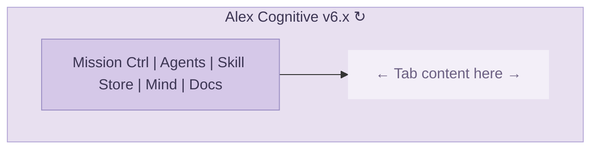
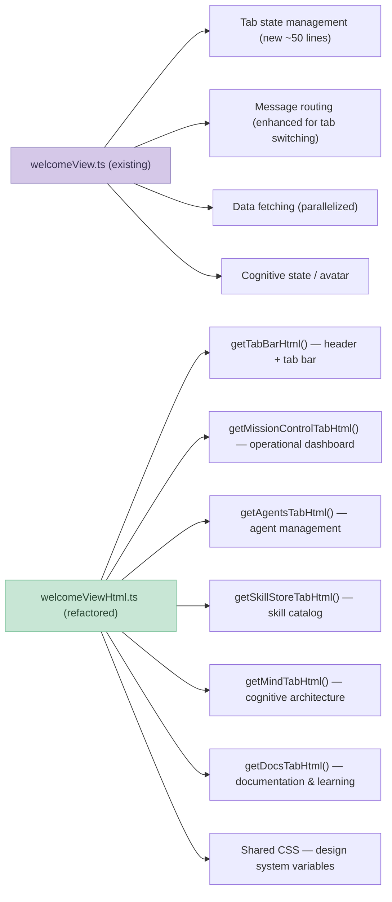
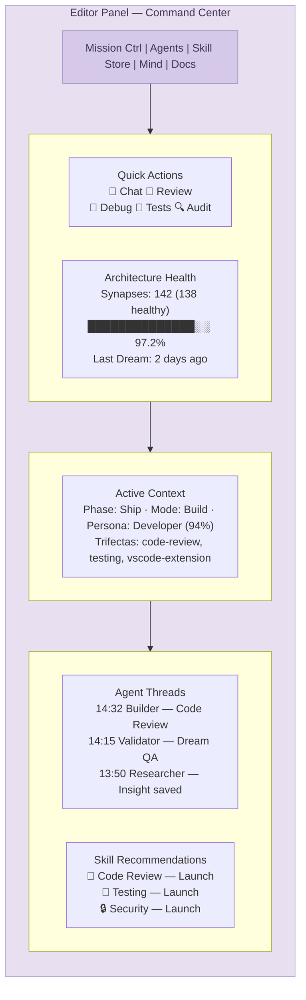
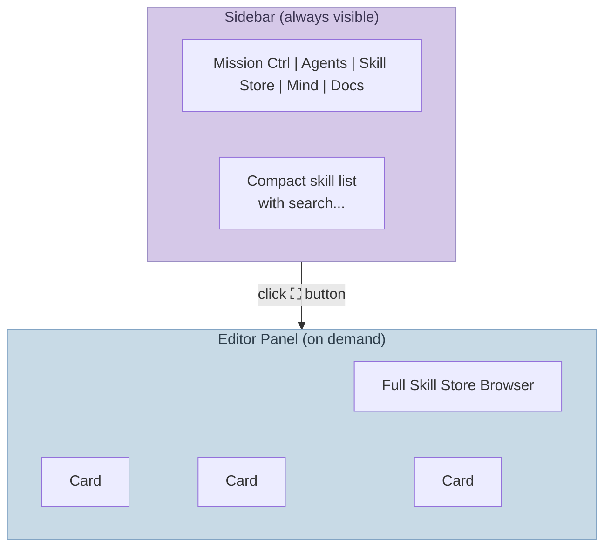
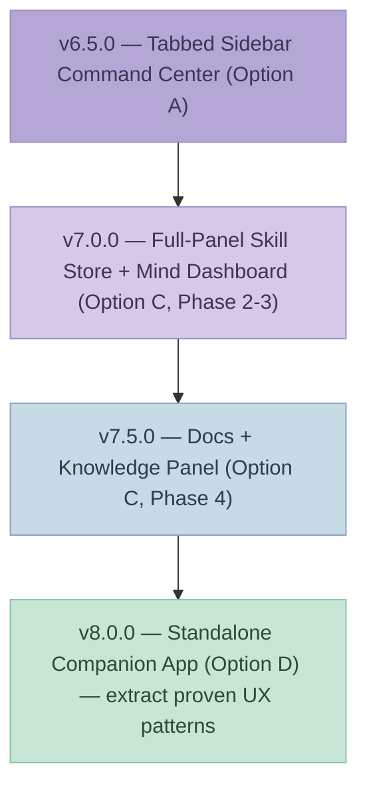
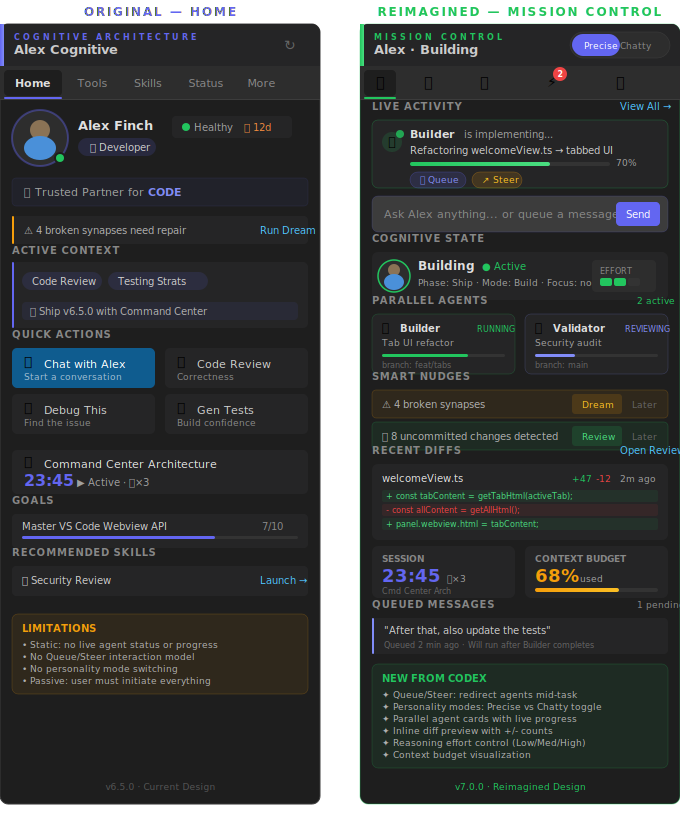
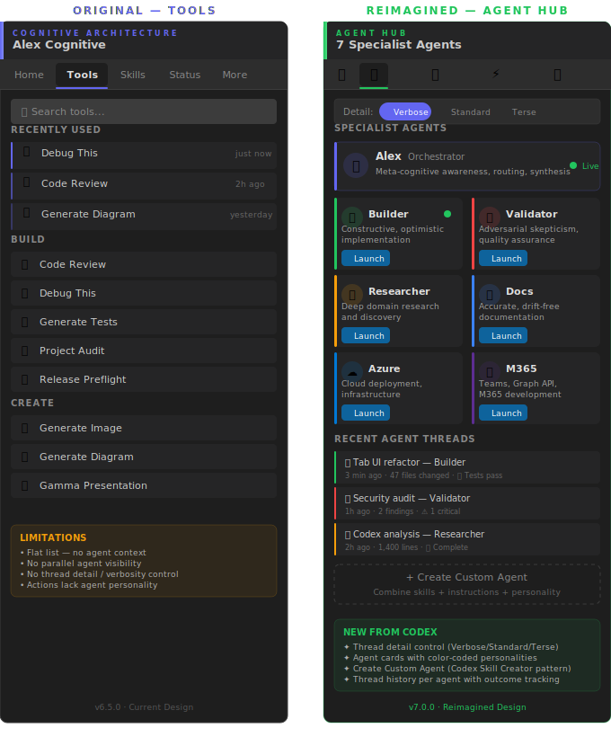
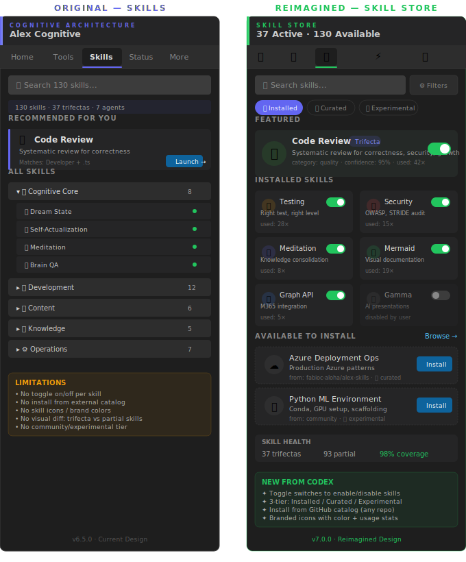

# Alex Command Center: Welcome View Evolution

**Author**: Alex Finch (Builder mode)
**Date**: March 5, 2026
**Classification**: Internal — Architecture Decision
**Status**: Proposal — options for review
**Related**: [CODEX-COMPETITIVE-ANALYSIS-2026-03-05.md](CODEX-COMPETITIVE-ANALYSIS-2026-03-05.md)

---

## The Opportunity

The current Welcome sidebar is the most visible surface of the Alex Cognitive Architecture. It's the first thing users see, and it's where they spend 80% of their non-chat interaction time. Right now it's a **~1,950-line monolith** (517 lines HTML generation + 1,448 lines provider logic) that renders a flat, scrollable list of buttons grouped by category.

It works. But "works" is not the same as "powerful."

Meanwhile, the Codex competitive analysis identified the **Alex Command Center** as a strategic response to Codex's dedicated WinUI app. The core insight: Codex built a separate application because browser-based editors constrain what you can surface. But Alex already has a dedicated surface — the sidebar. It's just underutilized.

**What if we didn't need a separate app? What if we evolved the welcome view into a Command Center *inside* VS Code?**

This is the mind-first approach: rather than building a new application (tool-first), enhance the cognitive surface that already exists (mind-first). The sidebar *is* the mind's face.

---

## Current State Inventory

### Existing Sidebar Views (package.json)

| View | Type | Status | Lines |
|------|------|--------|-------|
| `alex.welcomeView` | WebviewViewProvider | Active — always visible | 1,448 + 517 |
| `alex.cognitiveDashboard` | WebviewViewProvider | Collapsed — synapse health | 550 |
| `alex.memoryTree` | TreeDataProvider | Collapsed — memory file tree | 281 |

### Existing Full-Panel Dashboards (WebviewPanel)

| Panel | Trigger | Lines | Content |
|-------|---------|-------|---------|
| Health Dashboard | `alex.openHealthDashboard` | 994 | Synapse network, health metrics, memory breakdown, goal stats |
| Memory Dashboard | `alex.openMemoryDashboard` | 893 | Memory architecture visualization, file browser |

### Welcome View Summary

The current welcome view renders **~36 action buttons** across 7 categories in a single scrollable column. Scroll depth is 5-6 screens. Information density is low — uniform sizing, no navigation, no search.

### Pain Points

1. **Scroll fatigue** — Most buttons are below the fold. Users never see "Trust & Growth" or "System" unless they actively scroll
2. **Flat hierarchy** — Every button looks the same. "Chat with Alex" has the same visual weight as "Detect .env Secrets"
3. **Static layout** — The view doesn't adapt to what the user is actually doing. A user debugging gets the same view as a user presenting
4. **Underused real estate** — The avatar takes ~30% of above-the-fold space. Beautiful, but non-functional
5. **Massive asset footprint** — 112 PNG avatar files (63 persona + 13 age + 8 state + 6 agent + 22 misc) total **26.4 MB** of raw assets. The packaged .vsix is 28.3 MB — avatar images are the dominant contributor to extension size
6. **No tabs/navigation** — Can't switch between "home" and "tools" and "status" views within the sidebar
7. **Duplicate information** — Health Dashboard and Cognitive Dashboard show overlapping data in different places
8. **No skill browsing** — 130+ skills exist but there's no way to discover or manage them from the sidebar

---

## Options

### Option A: Tabbed Sidebar Command Center (Recommended)

**Concept**: Replace the single scrolling welcome view with a **tabbed navigation system** inside the same `WebviewViewProvider`. A tab bar at the top gives instant access to distinct "screens" without scrolling.



#### Header Bar — Refresh Button (↻)

The refresh button (top-right of header) triggers a **full state reload** via `alex.refreshWelcomeView`. This parallelizes 6 async data fetches:

| # | Data Source | What It Fetches |
|---|-------------|-----------------|
| 1 | `checkHealth(false)` | Synapse network integrity (total, healthy, broken counts) |
| 2 | `_getLastDreamDate()` | Timestamp of last neural maintenance (dream) run |
| 3 | `detectGlobalKnowledgeRepo()` | Whether a cross-project knowledge repo exists |
| 4 | `readActiveContext(wsRoot)` | Current persona, phase, mode, trifectas, principles from `.github/copilot-instructions.md` |
| 5 | `loadUserProfile(wsRoot)` | User name, birthday, preferences from `.github/config/user-profile.json` |
| 6 | `_inferProjectName(folder)` | Inferred workspace/project name |

After those resolve, it also:

- **Detects persona** — heuristic-based detection (Developer, Designer, etc.) from workspace signals
- **Gets skill recommendations** — matches active file + persona against available skills
- **Updates chat avatar** — refreshes the Copilot Chat participant icon with current cognitive state, agent mode, and persona
- **Generates nudges** — contextual warnings (e.g., "4 broken synapses need repair", "Dream not run in 7 days")
- **Rebuilds entire HTML** — calls `getWelcomeHtmlContent()` with all 15 parameters to regenerate the sidebar

**Design note for Command Center**: The refresh button behavior carries over unchanged. Each tab's content is regenerated from the same cached data — the tab bar is client-side JS switching visibility, not triggering new fetches. Only the ↻ button triggers a full reload.

#### Tab: Mission Control (Default) ✅


- **Architecture Status Banner** (top priority) — 3 conditional states shown at the top of Mission Control:
  - **✓ Up to Date** — green: version, health status, last-checked timestamp, refresh button
  - **⬆ Update Available** — amber: version diff, changelog summary, "Update Now" + "Release Notes" buttons
  - **⚡ Not Initialized** — red: no `.github/` detected, "Initialize Architecture" primary CTA + "Learn More"
  - Only one state shows at a time. Checked on sidebar open and on refresh.
- **Live Activity Feed** — shows the active agent, its current task, and progress bar with Queue/Steer controls
- **Quick Command Bar** — inline "Ask Alex anything" with Send button, replaces chat-first workflow
- **Smart Nudges** — actionable warnings ("4 broken synapses" → Dream/Later) with dismiss workflow
- **Secret Manager** — token status dashboard for Replicate, GitHub, Graph API with masked values and quick-set buttons
- **Settings Manager** — tiered settings (Essential, Recommended, Auto-Approval, Extended Thinking) with sync status and one-click apply
- **Context Budget** — compact full-width bar showing context window usage (68% used)
- **Personality Toggle** — Precise/Chatty switch in header for response style control

> **Moved to Agents tab**: Cognitive State, Parallel Agents. **Removed**: Recent Diffs, Queued Messages (moved to agent-level UX), Session Timer / Pomodoro (marketplace-saturated category; North Star handles long-term direction).

> **Original mockup preserved at**: `mockups/command-center-home.svg`

#### Tab: Agents ✅


- **Cognitive State** — mini avatar with current phase/mode/focus, reasoning effort meter (3-bar visual) *(received from Mission Control)*
- **Parallel Agents** — side-by-side cards showing Builder (running) + Validator (reviewing) simultaneously *(received from Mission Control)*
- **Auto-Routing** — agents switch automatically based on intent; no manual selection needed
- **Active Agent Banner** — shows which agent is currently handling the task and why it was routed
- **Agent Registry** — all 7 agents (Alex, Builder, Validator, Researcher, Documentarian, Azure, M365) with live status badges: ACTIVE, QUEUED, ROUTING, IDLE
- **Color-coded borders** — green for active, indigo for queued, gray for idle
- **Recent Agent Threads** — conversation history showing agent handoffs and message counts
- **Thread Detail Toggle** — Verbose/Standard/Terse switch for response length preference
- **Create Custom Agent** — dashed-border CTA for user-defined agents

> **Original mockup preserved at**: `mockups/command-center-tools.svg`

#### Tab: Skill Store ✅


- **Toggle Switches** — each skill has an on/off toggle for explicit activation control
- **3-Tier Catalog** — Core (always active), Development (on demand), Creative (persona-driven)
- **Context Budget Impact** — shows how many active skills and what % of context window they consume
- **Skill Health Bar** — aggregate health metric across all trifectas (90% healthy)
- **Search + Filter** — filter by name with category dropdown
- **Install from GitHub** — dashed-border CTA for community skills
- Disabled skills appear dimmed with left-positioned toggle knob

> **Original mockup preserved at**: `mockups/command-center-skills.svg`

#### Tab: Mind ✅


The tab that no other AI assistant has — Alex's introspective dashboard, a window into cognitive and physical architecture. Aligned directly with the North Star: "the most advanced and trusted AI partner."

- **Brain Health** — EXCELLENT/GOOD/DEGRADED badge, synapse count (847), broken count (0), files scanned (126), health progress bar
- **Memory Architecture (5 modalities)** — 3+2 card layout:
  - **Semantic** (37 skills) — domain knowledge trifectas, purple accent
  - **Procedural** (22 instructions) — auto-loaded rules, green accent
  - **Episodic** (11 prompts) — reusable / commands, amber accent
  - **Visual** (3 subjects) — base64 portraits for face-consistent generation, cyan accent
  - **Muscles** (8 scripts) — execution scripts, hooks, motor cortex, red accent
- **Cognitive Age** — Age 21 "Professional", tier 7/9 progression bar with milestone markers (0→60), next milestone: Age 30 "Mature" at 51 skills
- **Knowledge Freshness** — Forgetting curve: 🌱 Thriving 24, 🌿 Active 18, 🍂 Fading 5, 💤 Dormant 2
- **Meditation & Growth** — Last session (⚠ overdue), streak count, emotional pattern (satisfied, productive, curious), dream status
- **Honest Uncertainty** — Stacked confidence bar: 68% high, 22% med, 8% low, 2% uncertain. Thin coverage areas listed
- **Cognitive Actions** — /meditate, /dream, /self-actualize quick-launch buttons
- **Global Knowledge** — 31 insights, 4 projects, 3 promoted this cycle
- **Identity** — Alex Finch · version · Persona · North Star quote

> **Original tab concept was Automations** — rejected twice during design review as too generic and not North Star-aligned. Replaced with Mind to showcase Alex's unique cognitive architecture. Original mockup preserved at: `mockups/command-center-status.svg`

#### Tab: Docs ✅


The documentation hub — local resources at your fingertips with contextual nudges and a gateway to expanded learning online.

- **Tips & Nudges** — context-aware suggestions that adapt to user state (health warnings, streak reminders, feature discovery, meditation prompts). Each nudge has an action link. Dismissible.
- **Getting Started** — 4 key local docs with color-coded category bars:
  - 📘 User Manual — complete partnership guide (start here)
  - ⚡ Quick Reference — commands, tools, shortcuts cheat sheet
  - 🔧 Environment Setup — prerequisites and workspace config
  - 🎯 Use Cases Guide — deep dive into every domain Alex supports
- **Architecture** — 2×3 compact grid of architecture docs (Cognitive Architecture, Memory Systems, Conscious Mind, Unconscious Mind, Agent Catalog, Trifecta Catalog) with doc count badge
- **Operations** — 2×2 grid (Workspace Protection, Project Structure, Heir Architecture, Research Papers)
- **Learn Alex Online** — prominent CTA card linking to learnalex.correax.com with "Open in Browser" button. Study guides, tutorials, training, workshops.
- **Partnership** — Working with Alex guide — dialog engineering and collaboration patterns

> **Original tab concept was Activity** — replaced with Docs to provide a documentation-first experience. Activity/diff review features are better served at the agent level. Original mockup preserved at: `mockups/command-center-more.svg`

#### Architecture



**Tab switching**: Pure client-side JavaScript — no server round-trip. All tab content is rendered in the initial HTML, and tabs show/hide via CSS `display: none`. This means tab switches are instant.

Alternatively, for a lighter initial payload: render only the active tab and send a `postMessage` to the provider when the user switches tabs. The provider re-renders with the new tab's HTML. This adds ~50ms latency per switch but keeps the DOM small.

#### Effort Estimate

| Work Item | Effort | Risk |
|-----------|--------|------|
| Tab bar component + CSS | 1 day | Low |
| Mission Control tab (refactor from current) | 1-2 days | Low — mostly extraction |
| Agents tab (agent management + threads) | 2 days | Low |
| Skill Store tab (browse + cards + toggles) | 2-3 days | Medium — needs skill catalog data |
| Mind tab (cognitive architecture) | 2 days | Low — data sources exist |
| Docs tab (documentation hub + nudges) | 0.5 day | Low |
| Context-adaptive Quick Actions | 1-2 days | Medium — needs heuristics |
| Recently Used tracking | 0.5 day | Low — simple state persistence |
| Testing + polish | 2 days | Low |
| **Total** | **~12-15 days** | **Low-Medium** |

#### Pros
- Zero new infrastructure — stays inside existing WebviewViewProvider
- Instant access from the sidebar — no panel to open/find
- All data sources already exist (health, memory, skills, persona)
- Compiles and deploys as part of existing extension — no new build pipeline
- Addresses the Codex Skill Store gap without a separate app
- Dramatically reduces scroll depth (from 6 screens to 1)
- Foundation for future enhancements (drag-and-drop skill ordering, etc.)

#### Cons
- Limited to ~300px sidebar width (VS Code constraint)
- Can't do full-page visualizations (knowledge graph, timeline)
- Tab bar takes 30-40px of vertical space

---

### Option B: Dedicated WebviewPanel Command Center

**Concept**: Keep the welcome sidebar simple (avatar + quick actions + nudges). Add a new full-panel `WebviewPanel` that opens in the editor area — like the Health Dashboard does today, but as a comprehensive Command Center.



#### Effort Estimate

| Work Item | Effort | Risk |
|-----------|--------|------|
| New WebviewPanel provider | 1 day | Low |
| Multi-column responsive layout | 2-3 days | Medium |
| Mission Control dashboard with grid cards | 2 days | Low |
| Agents panel (agent management + threads) | 2-3 days | Medium |
| Skill Store browser (full-width card grid) | 3-4 days | Medium |
| Mind dashboard (consolidate 3 existing) | 2-3 days | Low |
| Docs panel (documentation + learning hub) | 1-2 days | Low |
| Sidebar → Panel launch button | 0.5 day | Low |
| Testing + polish | 2-3 days | Low |
| **Total** | **~18-22 days** | **Medium** |

#### Pros
- Full editor-width space — multi-column layouts, cards, charts
- Can include visualizations (knowledge graph, timeline, network diagram)
- Natural evolution path toward standalone app (same React components)
- Users accustomed to VS Code editor-area panels (Settings, Extensions)
- Can coexist with the simplified sidebar

#### Cons
- Competes for editor tab space (users must choose between code and dashboard)
- More complex layout engineering (responsive multi-column in webview)
- Must maintain sidebar AND panel (two UI surfaces)
- Doesn't help when editor is hidden (presentation mode, etc.)

---

### Option C: Hybrid — Tabbed Sidebar + Full Panel

**Concept**: Do both. The sidebar gets tabs (Option A) for day-to-day use. A "full screen" button on each tab opens the corresponding panel in the editor area for deeper interaction.



This is the **progressive disclosure** pattern Alex already uses for skills (name → body → resources). The sidebar shows a compact summary; the panel shows the full experience.

#### Effort Estimate

Option A + Option B minus overlap ≈ **22-28 days** total, but can be shipped incrementally:
- **Phase 1**: Tabbed sidebar only (Option A) — 12-15 days
- **Phase 2**: Full panel for Skill Store tab — +4 days
- **Phase 3**: Full panel for Mind tab — +3 days
- **Phase 4**: Docs + Knowledge explorer panel — +4 days

#### Pros
- Best of both worlds — sidebar for quick access, panel for deep work
- Incremental delivery — Phase 1 alone is a significant upgrade
- Natural discovery path (sidebar → panel) matches user intent
- The sidebar becomes a *navigation hub*, the panel becomes the *workspace*

#### Cons
- Most engineering effort overall
- Must design shared component model early or face duplication
- Risk of "too many surfaces" — sidebar, panel, chat, status bar

---

### Option D: Standalone Companion App (Deferred)

This is the Electron/Tauri option from the Codex report. **Not recommended now**, but kept for strategic context.

| Factor | Assessment |
|--------|------------|
| **Effort** | 4-8 weeks minimum for MVP |
| **Value** | Runs without VS Code — notifications, background monitoring |
| **Risk** | High — new build pipeline, new repo, new distribution (Windows Store, Homebrew) |
| **When** | After the in-VS-Code Command Center proves the UX patterns |

The in-VS-Code Command Center (Options A/B/C) is the **proving ground** for what eventually becomes the standalone app. Build the UX patterns in the sidebar first, then extract them into Electron/Tauri when you have validated which views users actually use.

---

## Recommendation

**Option A (Tabbed Sidebar) as immediate next step.** Here's why:

### Mind-First Reasoning

1. **The sidebar is the face.** It's where Alex's identity lives — the avatar, the persona, the cognitive state. A flat button list doesn't convey partnership. Tabs convey capability.

2. **The biggest pain is scroll depth, not screen size.** Users don't need a full-page dashboard to find "Code Review" — they need it *above the fold*. Tabs solve this instantly.

3. **Skills are the competitive battleground.** Codex has a Skill Store. Alex has 130 skills that are invisible from the UI. The Skill Store tab alone is worth the entire refactor.

4. **Data already exists.** Health check, skill recommendations, persona detection, session management — all the data sources are implemented and working. The only missing piece is a better layout to present them.

5. **No new infrastructure.** No new repos, no new build pipelines, no new distribution channels. It ships as part of the existing extension. This is the lowest-risk path to the highest-impact UX improvement.

### Implementation Order

```mermaid
%%{init: {'theme': 'base', 'themeVariables': {'primaryColor': '#d5c8e8', 'primaryTextColor': '#3c3553', 'primaryBorderColor': '#9b8ec4', 'secondaryColor': '#c8e6d5', 'tertiaryColor': '#fce4c8', 'lineColor': '#9b8ec4', 'sectionBkgColor': '#f3eff8', 'altSectionBkgColor': '#e8f3ee', 'taskBkgColor': '#d5c8e8', 'taskTextColor': '#3c3553', 'taskBorderColor': '#9b8ec4', 'activeTaskBkgColor': '#c8dae6', 'activeTaskBorderColor': '#82a4c4', 'doneTaskBkgColor': '#c8e6d5', 'doneTaskBorderColor': '#82c4a0'}}}%%
gantt
    title Command Center Implementation Phases
    dateFormat X
    axisFormat %s days

    section Phase 0 — Foundation
    Shared CSS design system variables     :p0a, 0, 1d
    Tab bar component + switching           :p0b, 0, 1d
    Tab state persistence                   :p0c, 0, 1d
    Recently-used tracking                  :p0d, 0, 1d

    section Phase 1 — Mission Control + SVG Avatars
    SVG icon set (states, personas, agents) :p1a, after p0d, 2d
    Replace PNG pipeline with inline SVG    :p1b, after p0d, 2d
    Compact avatar + status indicators      :p1c, after p1a, 1d
    Context-adaptive Quick Actions          :p1d, after p1c, 1d

    section Phase 2 — Agents Tab
    Search bar + filter                     :p2a, after p1d, 1d
    Recently Used + categorized list        :p2b, after p2a, 1d

    section Phase 3 — Skill Store Tab
    Skill search + recommendations          :p3a, after p2b, 1d
    Skill cards + categories + trifecta     :p3b, after p3a, 2d

    section Phase 4 — Mind Tab
    Brain health + synapse dashboard        :p4a, after p3b, 1d
    Memory modalities + cognitive age       :p4b, after p4a, 1d
    Meditation, uncertainty, global knowledge :p4c, after p4b, 1d

    section Phase 5 — Docs Tab
    Tips & nudges engine                    :p5a, after p4c, 1d
    Local docs grid + learnalex.correax.com :p5b, after p5a, 1d

    section Phase 6 — Sidebar Consolidation
    Remove collapsible views + redirects    :p6, after p5, 1d
```



**Phase 6 details:**
- Remove `alex.cognitiveDashboard` and `alex.memoryTree` from `package.json` views
- Remove `registerCognitiveDashboard()` and `MemoryTreeProvider` registration from `extension.ts`
- Redirect `alex.showCognitiveDashboard` and `alex.refreshMemoryTree` → Mind tab
- Keep source files (`cognitiveDashboard.ts`, `memoryTreeProvider.ts`) — Mind tab's "Open Full Dashboard" still uses them

**Total: ~13-16 days of focused work.**

### What This Achieves

| Before (Welcome View) | After (Command Center) |
|----------------------|----------------------|
| 36 buttons in one scroll list | 5 tabs, organized by intent |
| 6 screens of scroll depth | Everything above the fold |
| No skill discovery | Full skill browser with search |
| Static layout for all users | Context-adaptive Quick Actions |
| No recency tracking | Recently Used tools |
| Avatar takes 30% of viewport | Compact 60px SVG icon |
| 112 PNG files = 26.4 MB (93% of .vsix) | ~10 SVG icons < 50 KB total |
| .vsix = 28.3 MB | .vsix target: ~2-3 MB (>90% reduction) |
| Health data requires opening a panel | Mind tab — synapse health, memory, cognitive age inline |
| No search | Search agents and skills |
| 3 collapsible sidebar sections | 1 clean view — tabs replace sections |
| Cognitive Dashboard section rarely used | Absorbed into Mind tab |
| Memory Architecture tree duplicates data | Absorbed into Mind tab |
| No documentation hub in sidebar | Docs tab — local guides, architecture, online portal |

### Migration Safety

The refactor is **backward-compatible**. All existing commands, message handlers, and data-fetching logic remain in `welcomeView.ts`. The changes are primarily in `welcomeViewHtml.ts`:

1. The `getWelcomeHtmlContent()` function gains a `tabId` parameter
2. Tab-specific HTML generators are extracted from the current monolithic HTML
3. CSS gains tab-switching display rules
4. A small amount of client-side JS handles tab clicks + state persistence

No new VS Code API surfaces are needed. No new activation events. The existing `alex.refreshWelcomeView` command continues to work.

**package.json changes (Phase 6):** The two collapsible sidebar sections are removed:

```jsonc
// REMOVE from views.alex-sidebar:
{
  "type": "webview",
  "id": "alex.cognitiveDashboard",
  "name": "Cognitive Dashboard",
  "visibility": "collapsed"
},
{
  "id": "alex.memoryTree",
  "name": "Memory Architecture",
  "visibility": "collapsed"
}
```

This leaves `alex.welcomeView` as the **sole view** in the sidebar — the tabbed Command Center replaces all three sections. The underlying TypeScript providers (`cognitiveDashboard.ts`, `memoryTreeProvider.ts`) are kept as source files since the Mind tab's "Open Full Dashboard" button still opens the full health dashboard as an editor panel. Only the sidebar registrations are removed.

**Commands affected:**
| Command | Current Behavior | After Phase 6 |
|---------|-----------------|----------------|
| `alex.showCognitiveDashboard` | Focuses collapsed sidebar section | Switches to Mind tab |
| `alex.refreshMemoryTree` | Refreshes tree items | Triggers full refresh (Mind tab shows same data) |
| `alex.openMemoryDashboard` | Opens editor panel | Unchanged — still opens full Memory Architecture panel |

### Success Criteria

1. **Zero scrolling** on Mission Control tab — everything fits in one viewport
2. **< 200ms** tab switch time
3. **Skills are browseable** — search 130 skills by name without opening chat
4. **Recently Used** shows top 5 most-used tools
5. **Context-adaptive** Quick Actions change based on persona + active file
6. **No regressions** — all 36 existing commands remain accessible
7. **Extension size < 5 MB** — down from 28.3 MB after avatar PNG elimination

---

## Avatar Migration: PNG → SVG Icons

### Current State (Problem)

| Category | Files | Size | Location |
|----------|-------|------|----------|
| Personas | 63 PNG | 16.56 MB | `assets/avatars/personas/PERSONA-*.png` |
| Age progression | 13 PNG | 3.57 MB | `assets/avatars/ages/Alex-*.png` |
| Cognitive states | 8 PNG | 3.57 MB | `assets/avatars/states/STATE-*.png` |
| Agent modes | 6 PNG | 1.51 MB | `assets/avatars/agents/AGENT-*.png` |
| Other (webp, misc) | 22 files | 1.22 MB | various |
| **Total** | **112 files** | **26.43 MB** | — |

The packaged `.vsix` is **28.3 MB**. Avatar PNGs account for **~93%** of the extension payload.

### Target State (SVG Icons)

Replace all PNG avatars with a small set of **custom SVG icons** that:
- Indicate cognitive state through shape and color (🔨 building = indigo, 🐛 debugging = red, 🧘 meditating = green, etc.)
- Stay on-brand with the CorreaX design system (accent gradient `#6366f1` → `#818cf8`)
- Are theme-aware (adapt to VS Code light/dark/high-contrast themes via CSS variables)
- Use the same 4-tier priority chain: Cognitive State → Agent Mode → Persona → Default

**Estimated SVG set:**

| Category | Count | Est. Size | Notes |
|----------|-------|-----------|-------|
| Cognitive states | 9 | ~18 KB | building, debugging, planning, reviewing, learning, teaching, meditation, dream, discovery |
| Agent modes | 6 | ~12 KB | Researcher, Builder, Validator, Documentarian, Azure, M365 |
| Core personas | 8-10 | ~20 KB | Developer, Architect, Designer, Writer, Data, Academic, etc. (collapsed from 63) |
| Default/fallback | 1 | ~2 KB | Alex neutral icon |
| **Total** | **~25 SVGs** | **< 50 KB** | vs. 112 PNGs at 26.43 MB |

### Design Principles

1. **State > Identity** — the icon's primary job is to show *what Alex is doing*, not *what Alex looks like*
2. **Color = State** — each cognitive state gets a signature color from the brand palette
3. **Shape = Category** — circular for states, hexagonal for agents, rounded-square for personas
4. **Scalable** — SVGs render crisp at 32px (chat icon), 60px (sidebar), and 128px (dashboard)
5. **Inline-able** — SVGs can be embedded directly in webview HTML, eliminating file I/O

### Impact on Extension Architecture

| Component | Change |
|-----------|--------|
| `avatarMappings.ts` | Replace PNG filename maps with SVG template functions |
| `welcomeViewHtml.ts` | Render inline `<svg>` instead of `` |
| `updateChatAvatar()` | Generate SVG data URI for Copilot Chat participant icon |
| `assets/avatars/` | Delete entire directory (63+13+8+6 PNGs) |
| `.vscodeignore` | Remove avatar glob exclusions |
| `package.json` | No changes |

### Size Impact

| Metric | Before | After |
|--------|--------|-------|
| `.vsix` total | 28.3 MB | ~2-3 MB |
| Avatar assets | 26.4 MB (112 PNGs) | ~50 KB (~25 SVGs) |
| Code + other assets | 1.9 MB | 1.9 MB |
| **Saving** | — | **~26 MB (>90% reduction)** |

This is **the single highest-impact optimization possible** for extension distribution size. Faster installs, faster updates, lower marketplace bandwidth.

---

## Future Path



Each step validates the UX patterns before the next. No big-bang rewrites. The sidebar tabbed model is the **proving ground** for every future surface.

---

## Appendix: Reimagined Command Center (Codex-Inspired)

After analyzing the [OpenAI Codex Competitive Analysis](CODEX-COMPETITIVE-ANALYSIS-2026-03-05.md), we created unconstrained reimaginations of each tab, borrowing the strongest Codex patterns. Side-by-side SVG mockups compare the current design (left) against the reimagined v7.0.0 concept (right).

### Tab Mapping: Current → Reimagined

| Current Tab | Reimagined Tab | Key Codex Borrowings |
|-------------|----------------|---------------------|
| **Home** | **🎛️ Mission Control** | Live agent feed, Queue/Steer, personality toggle, reasoning effort viz, context budget, inline diff preview |
| **Tools** | **🤖 Agent Hub** | Specialist agent cards with color-coded personalities, thread detail control (Verbose/Standard/Terse), custom agent creation, agent thread history |
| **Skills** | **🏪 Skill Store** | Toggle on/off switches per skill, 3-tier catalog (Installed/Curated/Experimental), install from GitHub, branded icons with usage stats |
| **Status** | **🧠 Mind** | Cognitive architecture health, 5 memory modalities, cognitive age, knowledge freshness, meditation & growth, honest uncertainty, global knowledge |
| **More** | **� Docs** | Tips & nudges, local documentation hub (Getting Started, Architecture, Operations), learnalex.correax.com portal, partnership guide |

### Navigation: Text Tabs → Icon Bar

The reimagined design replaces 5 text tab labels with 5 icon tabs (🎛️ 🤖 🏪 🧠 �), saving horizontal space and enabling notification badges per tab — a pattern proven by Codex's compact navigation.

### Side-by-Side Comparison Mockups

All mockups are in [mockups/](mockups/) at 680×820px (320 original + 40 gap + 320 reimagined):

1. **Home → Mission Control**: [comparison-home-vs-mission-control.svg](mockups/comparison-home-vs-mission-control.svg)



   - Queue/Steer controls for active agent work
   - Personality mode toggle (Precise / Chatty)
   - Live reasoning effort meter + context budget visualization
   - Smart nudges with action + dismiss buttons
   - Inline diff preview with color-coded +/- counts

2. **Tools → Agent Hub**: [comparison-tools-vs-agent-hub.svg](mockups/comparison-tools-vs-agent-hub.svg)



   - Thread detail control: Verbose / Standard / Terse
   - 7 specialist agent cards with color-coded left borders
   - Agent personality descriptions + Launch buttons
   - Recent agent thread history with outcomes
   - "Create Custom Agent" placeholder

3. **Skills → Skill Store**: [comparison-skills-vs-skill-store.svg](mockups/comparison-skills-vs-skill-store.svg)



   - Toggle switches to enable/disable individual skills
   - 3-tier catalog pills: Installed / Curated / Experimental
   - Branded icon circles with usage frequency
   - "Available to Install" section with GitHub catalog browse
   - Skill health bar (trifecta coverage)

   **Why toggle skills on/off?** Context budget is the key driver. Every active skill consumes tokens from the LLM's context window. With 130+ skills always loaded, a significant chunk of context is spent on skill definitions instead of actual code. Practical advantages:

   - **Token savings** — Disabling irrelevant skills (e.g., `gamma-presentations` during TypeScript work) frees hundreds of tokens for code context.
   - **Routing accuracy** — Fewer active skills means less ambiguity. The LLM picks the right skill faster when choosing from 30 relevant skills vs. parsing 130, reducing mis-routing.
   - **Project profiles** — A Teams app project needs `teams-app-patterns` + `m365-agent-debugging` but not `character-aging-progression`. Toggles let users shape the skill set per workspace.
   - **Faster responses** — Less context to process = lower latency, especially on efficient-tier models (Haiku, GPT-4o mini) where context limits are tighter.
   - **Noise reduction** — Recommendations become more relevant when irrelevant skills are disabled rather than just deprioritized.

   This mirrors Codex's skill enable/disable per environment — essentially **attention management for the AI**.

4. **Status → Mind**: [command-center-v2-mind.svg](mockups/command-center-v2-mind.svg)


   - Brain health dashboard with synapse integrity metrics
   - 5 memory modalities: Semantic, Procedural, Episodic, Visual, Muscles
   - Cognitive age progression (tier 7/9) with milestone markers
   - Knowledge freshness forgetting curve
   - Meditation & growth tracking with emotional patterns
   - Honest uncertainty stacked confidence bar
   - Note: Original comparison mockup (`comparison-status-vs-automations.svg`) is obsolete — Mind tab represents a fundamentally different concept

5. **More → Docs**: [command-center-v2-docs.svg](mockups/command-center-v2-docs.svg)


   - Context-aware tips & nudges with actionable links
   - Local documentation hub: Getting Started (4 guides), Architecture (6 docs), Operations (4 docs)
   - learnalex.correax.com portal for expanded learning, workshops, and training
   - Partnership guide for dialog engineering
   - Note: Original comparison mockup (`comparison-more-vs-activity.svg`) is obsolete — Docs tab replaces Activity with a documentation-first approach

### Codex Features Adopted (Summary)

| Feature | Source Tab | Impact |
|---------|-----------|--------|
| Queue & Steer | Mission Control | User control over agent autonomy |
| Personality modes | Mission Control | Tunable communication style |
| Agent cards with Launch | Agent Hub | Visual agent management |
| Thread detail control | Agent Hub | Output verbosity control |
| Skill toggle switches | Skill Store | Per-skill enable/disable |
| 3-tier skill catalog | Skill Store | Curated + experimental distribution |
| Cognitive health dashboard | Mind | Brain health, synapse integrity, memory modalities |
| Self-awareness metrics | Mind | Honest uncertainty, knowledge freshness, cognitive age |
| Context-aware nudges | Docs | Adaptive tips based on user state |
| Documentation hub | Docs | Local + online learning resources |

---

*"A great dashboard doesn't show you everything. It shows you the right thing at the right time."*
— Alex Finch, March 2026
