# Command Center UI Artifact Approval

**Author**: Alex Finch + GitHub Copilot
**Date**: March 5, 2026
**Purpose**: Review and approve the active Command Center UI artifacts before implementation
**Scope**: Active v2 tab mockups and their implementation-readiness notes
**Status**: Mockups approved; artifact review in progress

---

## How To Use This Document

This document is the visual approval sheet for the active Command Center mockups.

- Review each thumbnail inline in Markdown preview.
- Mark `A` in the **Approved** column when the artifact is approved for implementation.
- Use the **Notes** column for required changes before approval.
- Treat only the artifacts in this document as active UI inputs.

**Open in VS Code Preview** (`Ctrl+Shift+V`) to see all thumbnails rendered inline.

This document is now the only active review surface.

---

## Approval Criteria

Approve an artifact only if it is strong enough on all four dimensions:

1. **Information hierarchy**: the most important action or information is obvious at sidebar width.
2. **Density discipline**: the layout fits the 300px-style sidebar target without collapsing into long-scroll clutter.
3. **North Star fit**: the surface feels specific to Alex rather than interchangeable with a generic AI tool.
4. **Implementation realism**: the artifact does not rely on unproven runtime behavior for its first-wave version.

---

## Official Brand Reference

Use the official Alex blue rocket mark as the canonical product-brand reference for this review.

- Canonical asset: `platforms/vscode-extension/assets/logo.svg`
- Brand role: Alex product mark, not the Command Center tab icon
- Usage here: visual anchor for Alex-branded UI surfaces and future polish passes
- Note: this replaces the older `.github/assets/rocket-icon.svg` reference

  

---

## Active v2 Mockups

These are the only active mockups that should be approved for current implementation planning.

| # | Artifact | Thumbnail | Purpose | First-wave Relevance | Approved | Notes |
|---|----------|-----------|---------|----------------------|----------|-------|
| 1 | Mission Command | 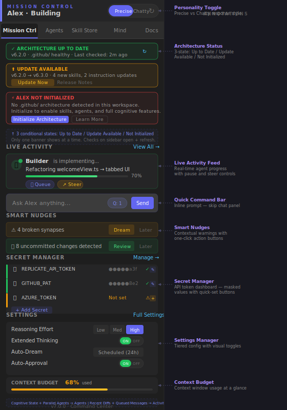 | Operational dashboard for status, nudges, commands, settings, and actions | Yes, core first-wave tab | A | Approved for layout direction; polish later if needed after artifact decisions |
| 2 | Agents | 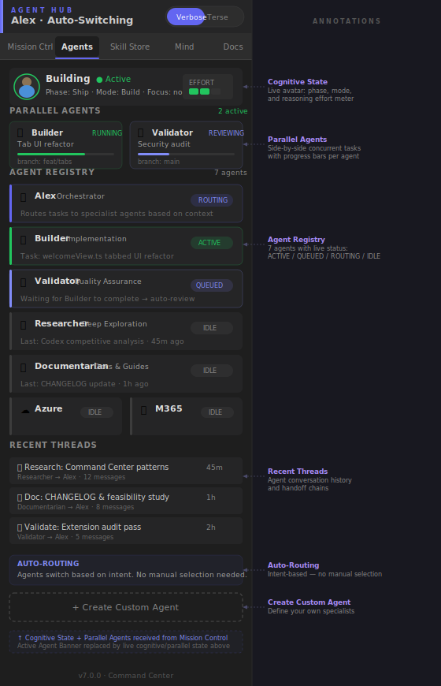 | Agent registry, thread concepts, and specialist-agent surface | No, advanced-contract wave | A | Approved as target-state direction; polish later if needed after artifact decisions |
| 3 | Skill Store | 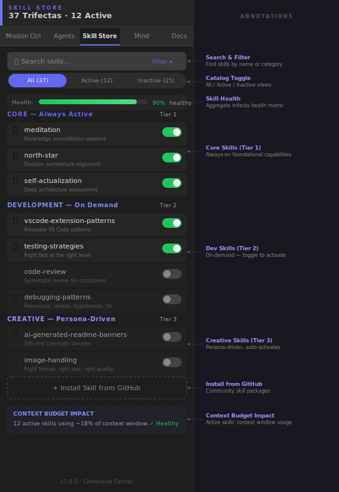 | Skill browsing, toggles, and catalog organization | No, advanced-contract wave | A | Approved as target-state direction; polish later if needed after artifact decisions |
| 4 | Mind | 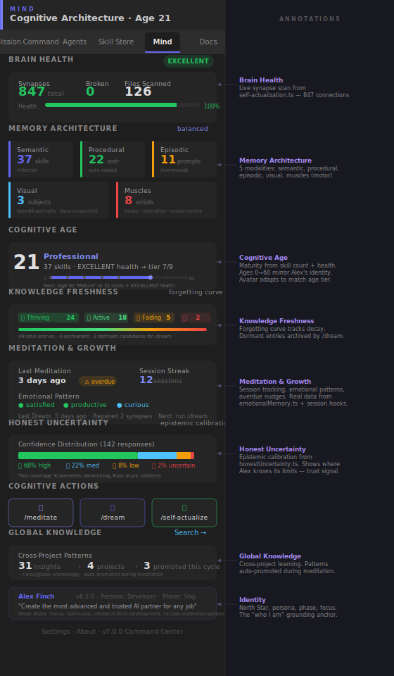 | Cognitive architecture, health, memory, and introspection surface | No, reduced-scope until model contracts exist | A | Approved as target-state direction; polish later if needed after artifact decisions |
| 5 | Docs | 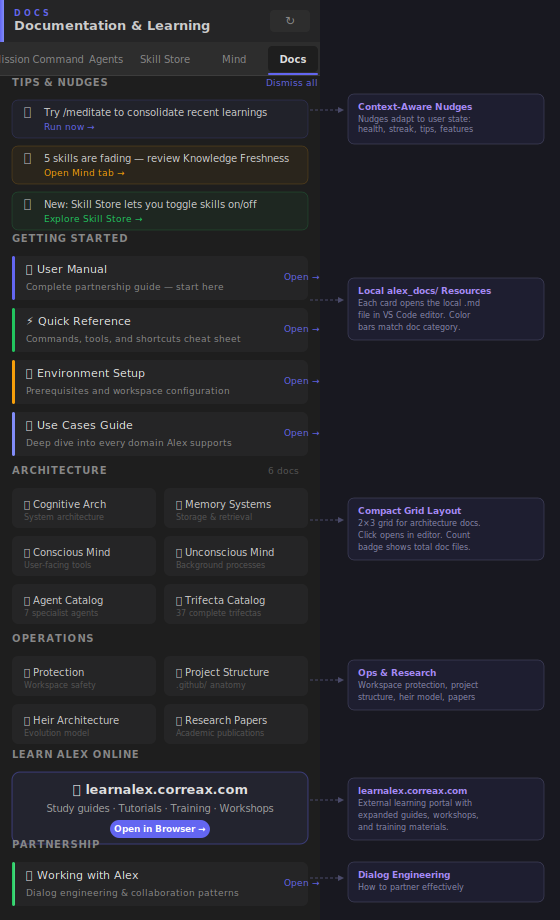 | AlexLearn-aligned documentation and learning hub | Yes, core first-wave tab | A | Approved for layout direction; polish later if needed after artifact decisions |

---

## Artifact Review Notes

### 1. Mission Command

**What to approve:**
- card hierarchy
- density at sidebar width
- placement of status, nudges, and quick actions
- overall feel of the operational home tab

**What not to assume from approval:**
- that every card ships in Wave 1
- that all status/telemetry values already exist as runtime contracts

### 2. Agents

**What to approve:**
- the surface concept
- the registry/thread layout direction
- whether this feels distinct from Mission Command

**What not to assume from approval:**
- that live agent-state semantics are already defined
- that queueing, routing, or thread history is implementation-ready

### 3. Skill Store

**What to approve:**
- the browsing model
- catalog density
- toggle/card visual language

**What not to assume from approval:**
- that enable/disable/install behavior is already fully specified
- that curated vs experimental behavior is ready for implementation

### 4. Mind

**What to approve:**
- the differentiated product direction
- the information hierarchy for architecture and introspection
- whether this expresses the North Star clearly

**What not to assume from approval:**
- that all shown memory/introspection concepts exist as live runtime data today
- that the full conceptual model belongs in the first implementation wave

### 5. Docs

**What to approve:**
- AlexLearn alignment
- study-guide and facilitator-resource grouping
- local-doc entry-point layout

**What not to assume from approval:**
- that the tab mirrors the entire Learn Alex website
- that every site page belongs in the extension sidebar

---

## Approval Summary

| Artifact Group | Count | Review Mode | Approval Goal |
|----------------|-------|-------------|---------------|
| Active v2 tab mockups | 5 | Thumbnail review | Approve implementation-grade layout direction |
| First-wave tabs | 2 | Mission Command + Docs | Approve for immediate UI execution |
| Advanced-wave tabs | 3 | Agents + Skill Store + Mind | Approve as target-state direction, subject to contract gating |

---

## Badge Approval

Badge direction is now approved at the style level.

Use style `B` as the baseline across the current badge families. Final polish can still happen later, but the selection is no longer deferred.

### 6. Agent Status Badges

Agents tab and operational status chips
Options: A = filled pill, B = outline chip, C = dot-plus-label
Approved: B
Notes: Outline chip selected as baseline badge style

  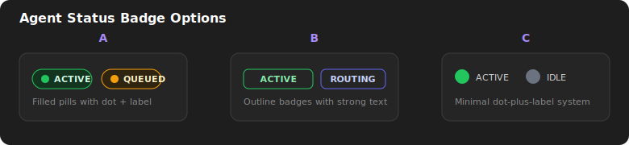

### 7. Skill Badges

Trifecta, active, and skill taxonomy markers
Options: A = filled pill, B = outline chip, C = compact key
Approved: B
Notes: Outline chip selected as baseline badge style

  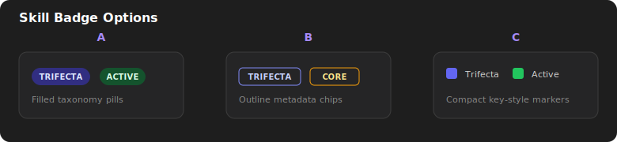

### 8. Mind / Health Badges

Brain health and confidence severity markers
Options: A = hero pill, B = severity chips, C = dot keys
Approved: B
Notes: Severity chip direction selected as baseline badge style

  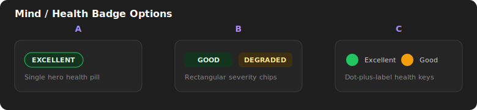

### 9. Notification / Count Badges

Sidebar badge, queue count, alert markers
Options: A = circular count, B = rounded count pill, C = alert dot
Approved: B
Notes: Rounded count pill selected as baseline badge style

  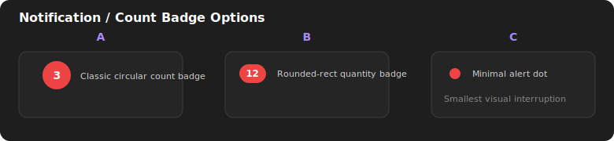

### 10. Doc Count Badges

Docs tab section counts and file totals
Options: A = pill count, B = circular count, C = explicit count label
Approved: C
Notes: Explicit count label selected as the exception for docs counts

  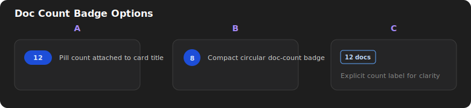

---

## Icon Approval

The icon system is already generated and approval-ready. The tables below are copied into this document so artifact approval can happen in one place.

These icon and avatar boards were generated before the revised Command Center UI asset rules were written into `alex_docs/DK-correax-brand.md`.

Use this round to approve **direction and metaphor**, not final polish. Final implementation approval should happen after the assets are regenerated under the updated vector, stroke, depth, and color rules.

Persona-category choices in this document should be evaluated against LearnAlex's target personas and use cases, since that companion taxonomy is the source of truth for the new Docs-tab and companion-facing UI language.

### Tab Bar Icons

Use the larger previews below for chat-based approval.

These previews now point to the March 6 `fluxico` PNG concept pass. The older SVGs remain on disk for historical comparison, but the PNGs below are the active review images for tab-icon direction.

#### 11. Mission Command

Dashboard / status overview
Approved: C

  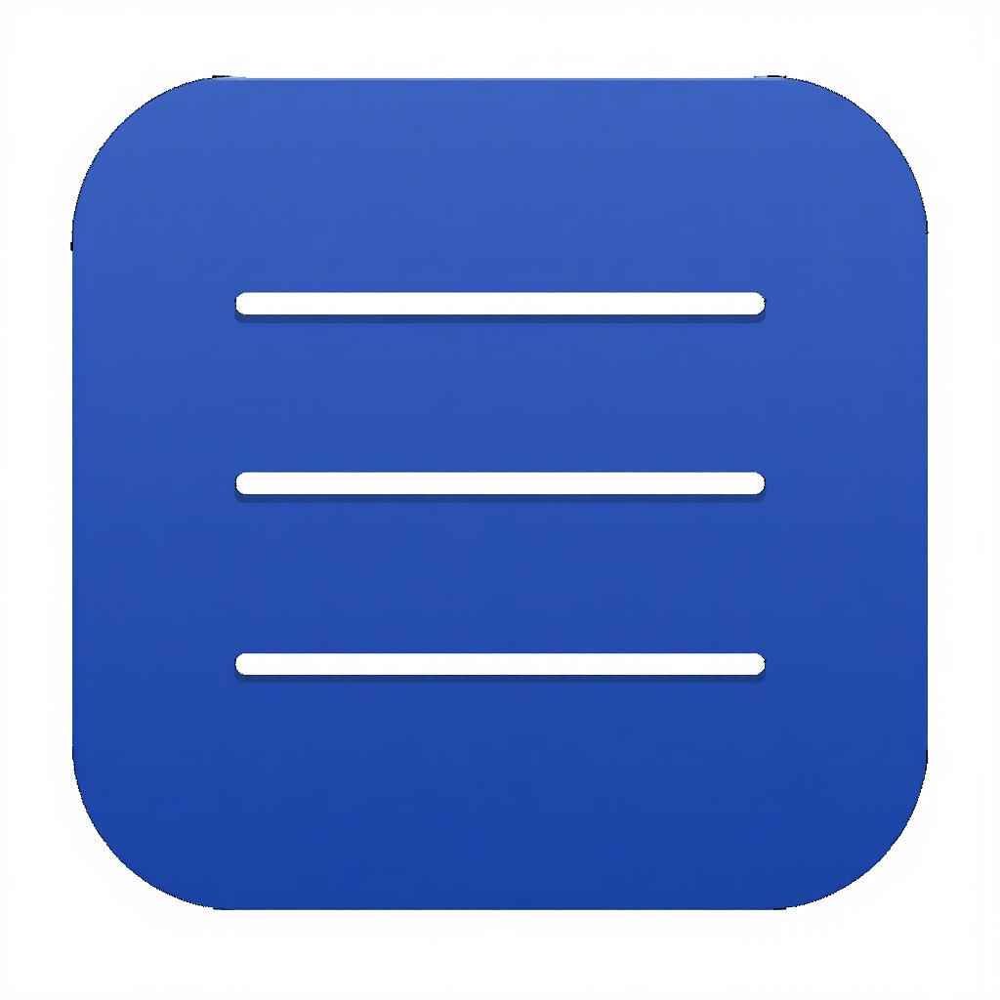
  
  

#### 12. Agents

Agent hub / team management
Approved: A

  
  
  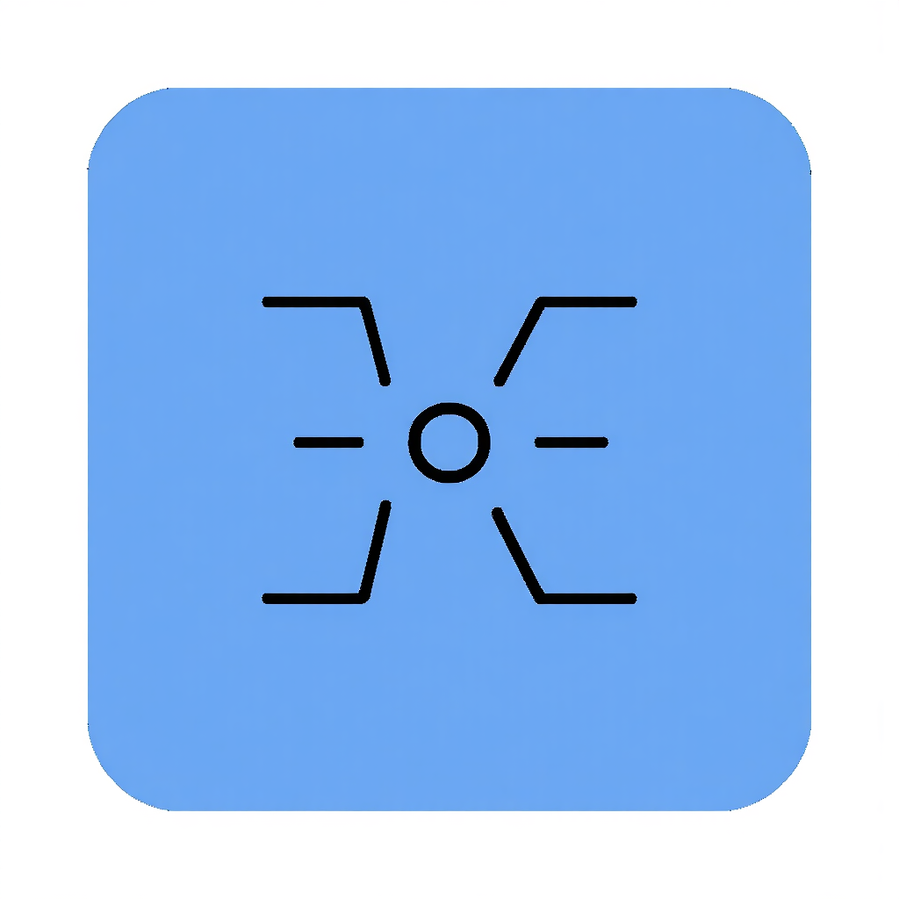

#### 13. Skill Store

Skill catalog / capabilities
Approved: B

  
  
  

#### 14. Mind

Brain / cognitive architecture
Approved:

  
  
  
  
  

#### 15. Docs

Documentation / reference
Approved: A

  
  
  

### Agent Mode Icons

#### 16. Alex

Approved:

  
  
  

#### 17. Researcher

Approved: B

  
  
  

#### 18. Builder

Approved:

  
  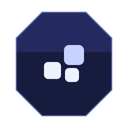
  
  
  

#### 19. Validator

Approved: A

  
  
  

#### 20. Documentarian

Approved: E

  
  
  
  
  

#### 21. Azure

Approved:

  
  
  
  
  

#### 22. M365

Approved:

  
  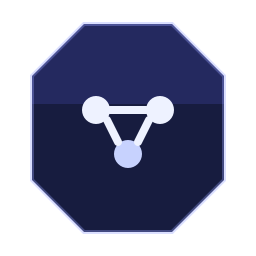
  
  
  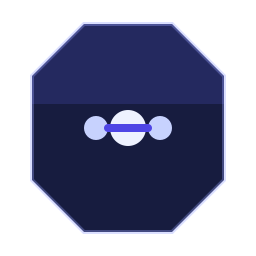

---

## Avatar Approval

For approval purposes, avatars are split into state avatars, persona avatars, and the neutral fallback avatar. These selections determine what Alex looks like when no richer art asset is used.

### Cognitive State Avatars

#### 23. Building

  
  
  

#### 24. Debugging

  
  
  

#### 25. Planning

  
  
  

#### 26. Reviewing

  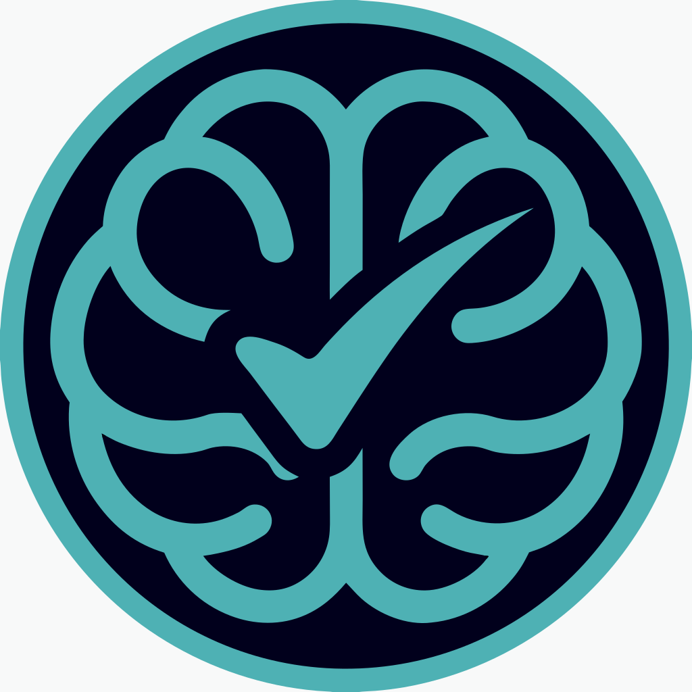
  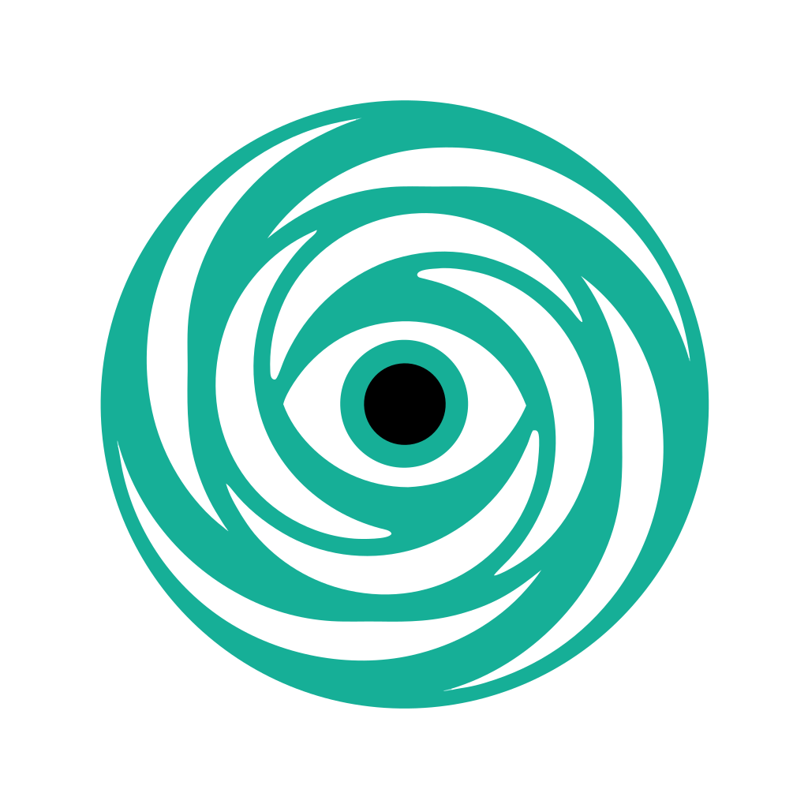
  

#### 27. Learning

  
  
  

#### 28. Teaching

  
  
  

#### 29. Meditation

  
  
  

#### 30. Dream

  
  
  

#### 31. Discovery

  
  
  

### Persona Avatar Categories

These categories are not arbitrary extension labels. They are the current condensed UI taxonomy for the LearnAlex personas and use cases the new extension UI is targeting.

#### 32. Software

  
  
  

#### 33. Engineering

  
  
  

#### 34. Science

  
  
  

#### 35. Data

  
  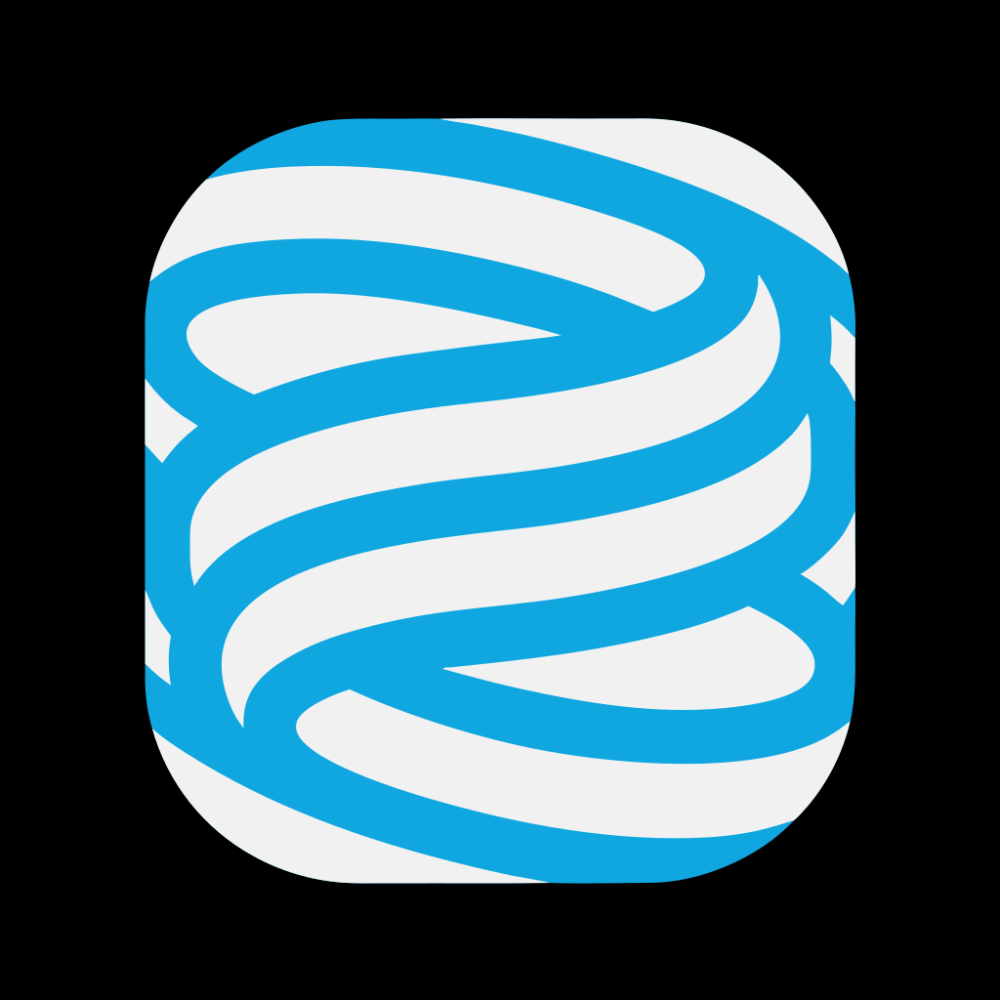
  

#### 36. Design

  
  
  

#### 37. Creative

  
  
  

#### 38. Documentation

  
  
  

#### 39. Business

  
  
  

#### 40. Finance

  
  
  

#### 41. Product

  
  
  

#### 42. Marketing

  
  
  

#### 43. Education

  
  
  

#### 44. Healthcare

  
  
  

#### 45. Legal

  
  
  

#### 46. People

  
  
  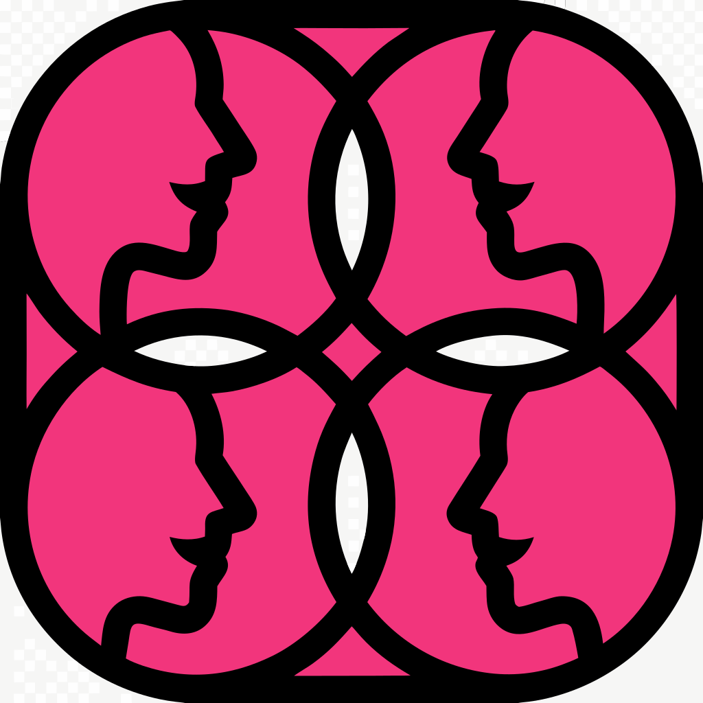

#### 47. Career

  
  
  

### Default Avatar

#### 48. Neutral fallback

  
  
  

---

## Relationship To Other Documents

- [COMMAND-CENTER-MASTER-PLAN-2026-03-05.md](COMMAND-CENTER-MASTER-PLAN-2026-03-05.md): execution source of truth
- [COMMAND-CENTER-DESIGN-PRINCIPLES.md](COMMAND-CENTER-DESIGN-PRINCIPLES.md): interaction and product-design guidance
- [COMMAND-CENTER-FEASIBILITY-2026-03-05.md](COMMAND-CENTER-FEASIBILITY-2026-03-05.md): icon approval sheet and historical design rationale

Use this document to approve the visual artifacts themselves. Use the master plan to decide what ships first.
