# Alex Cognitive Architecture - Competitive Analysis

> **Understanding the AI Assistant Landscape and Alex's Unique Position**

|                   |                                  |
| ----------------- | -------------------------------- |
| **Document Type** | Strategic Analysis               |
| **Created**       | 2026-01-28                       |
| **Last Updated**  | 2026-02-06                       |
| **Author**        | Alex Cognitive Architecture Team |

---

## 🎯 Executive Summary

The AI coding assistant market has undergone a seismic shift in early 2026 with the emergence of **autonomous agentic coders** — Claude Code, OpenAI Codex, and enhanced versions of Cursor and Windsurf. These tools compete on parallel execution, background agents, and terminal-first workflows.

**The New Landscape (February 2026):**
- **Claude Code**: Terminal-native with Opus 4.6, Cowork background agents, Skills, CLAUDE.md customization
- **OpenAI Codex**: Parallel cloud sandboxes, AGENTS.md spec, GitHub PR automation
- **Cursor 2.4**: Subagents, Skills, Cloud Agents, 80%+ YC adoption
- **Windsurf**: Cognition-acquired, Memories feature, 1M+ users, 59% Fortune 500
- **GitHub Copilot**: Agentic Memory, Coding Agent, Agent Skills, MCP registry

**Alex's Unique Position**: While competitors race to do more *for* users, Alex remains the only AI focused on learning *with* users. Alex v4.2.12 now matches competitors on agentic capabilities (Opus 4.6 parallel execution, LLM vision, terminal integration) while adding features no competitor offers:

| Only Alex Has                | Description                                                  |
| ---------------------------- | ------------------------------------------------------------ |
| **Cross-project transfer**   | Knowledge learned in Project A available in Project B        |
| **Gamma AI presentations**   | Generate decks, documents, social content via API            |
| **Emotional intelligence**   | Frustration detection, success celebration, adaptive support |
| **Focus mode**               | Pomodoro sessions with off-topic detection                   |
| **Meditation/consolidation** | Structured reflection protocols for human-AI teams           |
| **User data sovereignty**    | Knowledge in user-owned GitHub Gists, not vendor-locked      |
| **TTS in IDE**               | 32-language voice in VS Code (chatbots have voice, not IDEs) |

**Strategic Insight**: The agentic wave validates Alex's architecture — if you're going to have an AI partner that acts autonomously, you want one that also *learns and remembers*. Alex is positioned to integrate agentic capabilities while maintaining the learning partnership that makes those capabilities more valuable over time.

**The Symbiotic Advantage**:

---

## 📋 Action Plan: Winning the Attention War

> *"The hardest part isn't making the product anymore. It's making people care."* — Sam Altman, 2026

### 🎯 The Core Problem

In the Y Combinator days, the hard part was building the product. Today, a solo founder can build a SaaS platform in a weekend. The result? A flooded market.

| Era           | Barrier to Entry | Barrier to Attention |
| ------------- | ---------------- | -------------------- |
| **Old World** | High             | Low                  |
| **2026**      | Zero             | Brutal               |

We are living in an era of **Permissionless Creation but Gatekept Attention.**

**Alex's Paradox:** 74 skills, TTS, Gamma presentations, meditation protocols — the product is deep. But **23 installs**. The technology is a commodity. The moat is no longer the code; it's the **distribution channel** and **brand narrative**.

> *"If you cannot validate demand before you build, you are wasting your time."*

### 📊 Alex's Attention Diagnosis

| Factor              | Status | Problem                                        | Solution                                        |
| ------------------- | ------ | ---------------------------------------------- | ----------------------------------------------- |
| Marketplace ratings | ❌      | Zero ratings = invisible to algorithms         | Ask beta users directly; offer demo calls       |
| Video/GIF demo      | ❌      | Can't see value without using it               | 30-sec GIF showing meditation → insight flow    |
| Tagline             | ❌      | "Cognitive architecture" = academic, not viral | Test: "AI that remembers you" / "Your AI grows" |
| Simple description  | ❌      | Technical jargon before value statement        | Lead with "Learn faster with AI that grows"     |
| Open source         | ✅      | GitHub discoverability exists                  | ✅ Leverage with better README badges            |
| Unique features     | ✅      | Potential for viral "wow" moments              | Create shareable "Alex did this" screenshots    |
| Feature depth       | ✅      | Can retain users *if they find us first*       | ✅ Maintain depth, improve onboarding funnel     |

### 🔴 Priority Actions: Attention First (Next 30 Days)

Every action below answers one question: **"How do we make people care?"**

| Action                               | Attention Impact                                       | Effort |
| ------------------------------------ | ------------------------------------------------------ | ------ |
| **Get 5+ marketplace ratings**       | Algorithms surface rated extensions first              | Low    |
| **Add animated GIF demo**            | Visual proof of value in 3 seconds (no install needed) | Medium |
| **Sharpen tagline**                  | "AI that remembers" > "Cognitive architecture"         | Low    |
| **Simplify marketplace description** | First sentence = value, not technology                 | Low    |
| **Add trending tags**                | `agent`, `mcp`, `memory` = what people search for      | Low    |

### 🟠 Strategic Initiatives: Distribution Channels (Q1 2026)

| Initiative                  | Distribution Effect                                  | Effort |
| --------------------------- | ---------------------------------------------------- | ------ |
| **AGENTS.md compatibility** | Ride the trend — every AGENTS.md user discovers Alex | Medium |
| **Comparison landing page** | "Agent Memory vs Alex" — capture search traffic      | Medium |
| **VS Code blog tutorial**   | "Building cognitive AI for Copilot" — thought leader | High   |
| **Own the category name**   | "Cognitive AI" or "Learning AI" — be the definition  | Low    |
| **Animated social clips**   | TTS + Gamma demos for LinkedIn/Twitter virality      | Medium |

### 🧭 The Attention Funnel

**Current State:** Alex has strong Stage 4 (retention) but weak Stages 1-2 (awareness/interest).

**The Strategy:** Win the attention war first, then let the product depth retain users.

### 🎯 Success Metrics

| Metric               | Current | 30-Day Target | Q1 Target |
| -------------------- | ------- | ------------- | --------- |
| Marketplace installs | 23      | 100           | 500       |
| Ratings count        | 0       | 5             | 20        |
| Average rating       | N/A     | 4.5+          | 4.5+      |
| README GIF demos     | 0       | 1             | 3         |
| Blog/tutorial posts  | 0       | 1             | 3         |
| GitHub stars         | TBD     | +50%          | +200%     |

### 📈 Marketplace & Marketing Best Practices

> **Why Agent Memory has 1,600 installs vs Alex's 23** — key lessons

**The #1 Factor: Microsoft/VS Code Official Backing**

Agent Memory is published by **Harald Kirschner** (digitarald) — a Microsoft employee and VS Code team member. The extension lives in the official `Microsoft/vscode-extension-samples` repo, giving it:
- Implicit Microsoft endorsement
- Discoverability in VS Code docs, blog posts, and sample repos
- Trust signal from "Microsoft/vscode-extension-samples" as project repo

> ⚠️ This is Alex's biggest competitive disadvantage in the marketplace. Agent Memory isn't better — it's **better positioned**.

**Best Practices from Competitors:**

| Practice                   | Agent Memory                      | Flowbaby                      | Alex Current        | Alex Target                           |
| -------------------------- | --------------------------------- | ----------------------------- | ------------------- | ------------------------------------- |
| **Focused value prop**     | ✅ "Memory tool for VS Code"       | ✅ "No drift, no drama"        | ❌ Too broad         | "AI that learns with you"             |
| **Simple description**     | ✅ 1 sentence                      | ✅ 1 sentence                  | ❌ Technical jargon  | 1 sentence, outcome-focused           |
| **5-star rating**          | ✅ 5.0 (rated)                     | ✅ 5.0 (rated)                 | ❌ 0 (unrated)       | 5 ratings by v4.3.0                   |
| **GIF/video demo**         | ❌                                 | ❌                             | ❌                   | 30-sec meditation demo GIF            |
| **Quick start ≤ 3 steps**  | ✅ Use #memory                     | ✅ 3 steps                     | ✅ 3 steps           | ✅ Keep 3 steps                        |
| **Auto-sync to files**     | ✅ AGENTS.md sync                  | ❌                             | ❌                   | Auto-export to AGENTS.md (v5.0)       |
| **Minimal setup friction** | ✅ Zero config needed              | 🟡 Requires Python + login     | 🟡 Requires init     | Guided wizard with smart defaults     |
| **SEO tags**               | ✅ `language-model-tools`, `tools` | ✅ `knowledge graph`, `memory` | 🟡 Good but academic | Add `memory`, `learning`, `assistant` |

**Agent Memory's Winning Formula:**
1. **Dead simple concept** — "Store and retrieve context across conversations." Period.
2. **Zero learning curve** — Agents use `#memory` automatically. No new UX to learn.
3. **Compatible, not exclusive** — "Works with GitHub Copilot" — enhances what you have
4. **Official backing** — Microsoft employee + official samples repo = trust

**Flowbaby's Smart Positioning:**
1. **Memorable tagline** — "No drift, no drama" — sticky, relatable, shareable
2. **Named the problem** — "Context collapse" — gives users vocabulary for their pain
3. **Anti-marketing marketing** — "Not another agent. Not another memory plugin."
4. **"Context governance"** — Invented a category instead of competing in existing one

**Key Insight**: Alex has **10x more features** but **70x fewer installs**. The problem isn't the product — it's the positioning. (See Action Plan above for the full attention strategy.)

### 🎯 Market Positioning

> **Alex sits alone in quadrant 4** — the only AI focused on personalized learning. Competitors compete on task automation; Alex competes on human growth.

### 🔍 Known Gaps

| Gap                | Competitor Strength              | Alex Status            | Priority  | Response Strategy                             |
| ------------------ | -------------------------------- | ---------------------- | --------- | --------------------------------------------- |
| Code completion    | Copilot/Cursor/Windsurf native   | Relies on Copilot      | 🔄         | Delegate to Copilot; focus on learning layer  |
| Inline editing     | Cursor Cmd+K, Claude Code inline | No inline manipulation | 🔄         | Out of scope—Alex is mentor, not code monkey  |
| PR code review     | Codex PR, Copilot review         | Not yet                | 🎯 v5.1.0  | Build as "learning review" capturing insights |
| Background agents  | Codex parallel, Claude Cowork    | In-session only        | 📋 Backlog | Explore async dream/meditation processing     |
| Terminal agents    | Claude Code, Codex CLI           | ✅ Done                 | ✅         | ✅ Completed                                   |
| Image → code       | Cursor/Windsurf drag-drop        | ✅ LLM vision           | ✅         | ✅ Completed                                   |
| Parallel execution | Codex sandboxes, Cowork          | ✅ Opus 4.6 parallel    | ✅         | ✅ Completed                                   |

**Research Questions:**
1. Can autonomous agents *also* teach? (Capture insights during background work for later review)
2. What's the optimal autonomy level for different task types?
3. How can PR review be structured as a learning moment, not just quality gate?

**Legend:** 🎯 High priority | 🔄 Medium | 📋 Lower | ✅ Done

### 💎 Alex's Unique Value (What No One Else Has)

| Differentiator               | Description                                           |
| ---------------------------- | ----------------------------------------------------- |
| **Cross-project transfer**   | Knowledge learned in Project A available in Project B |
| **Meditation/consolidation** | Structured reflection protocols for human-AI teams    |
| **Gamma AI presentations**   | Generate decks, documents, social content via API     |
| **Emotional intelligence**   | Frustration detection, success celebration            |
| **Focus mode**               | Pomodoro sessions with off-topic detection            |
| **User data sovereignty**    | Knowledge in user-owned GitHub Gists                  |
| **TTS in IDE**               | 32-language voice output in VS Code                   |
| **Unified personality**      | Same Alex across VS Code, M365, CLI                   |

---

## 🏆 Competitive Landscape Overview

### The Big Picture

```mermaid
%%{init: {'theme': 'base', 'themeVariables': { 'primaryColor': '#f6f8fa', 'primaryTextColor': '#1f2328', 'lineColor': '#656d76', 'fontSize': '14px'}}}%%
mindmap
  root((Alex Competitive Focus))
    🤝 Symbiotic Hosts
      VS Code + Copilot + Alex
        Inherits all LLMs
        Adds cognitive layer
        Beats Cursor/Windsurf
      M365 Copilot + Alex
        Same personality
        Productivity context
        Beats generic assistants
    🧩 Direct Threats
      VS Code Extensions
        Agent Memory 1.6K
        Flowbaby 225
        Sona 157
    🎯 What We Add
      Cross-Project Learning
      Multi-Modal Output
      Cognitive Architecture
      User Data Sovereignty
```

### VS Code Extension Ecosystem

```mermaid
%%{init: {'theme': 'base', 'themeVariables': { 'primaryColor': '#f6f8fa', 'primaryTextColor': '#1f2328', 'lineColor': '#656d76', 'fontSize': '13px'}}}%%
mindmap
  root((VS Code Extensions))
    🧠 Alex 23
      74 Skills
      TTS + Gamma + Images
      Cognitive Architecture
    🗄️ Memory Extensions
      Agent Memory 1.6K
        Microsoft employee
        Zero config
      Flowbaby 225
        Knowledge graph
      Cortex 68
    🧬 Cognitive Extensions
      Sona 157
        Focus Mode
        ADHD support
      Obsidian Brain 89
      Project Cognition 26
    🤖 Agentic Extensions
      Cline 3.0M
      Roo Code 1.2M
      Continue 2.1M
```

### Extension Quadrant: Feature Depth vs Traction

> **Alex is the deepest extension with fewest installs.** The path: **simplify messaging, not features.**

---

## 🔍 Detailed Competitor Analysis

### 1. 🧩 VS Code Extension Competitors (Direct Threats)

> Extensions that directly compete with Alex's cognitive architecture and memory features.

| Extension                                                                                                       | Focus                   | Key Features                                     | Installs | Threat |
| --------------------------------------------------------------------------------------------------------------- | ----------------------- | ------------------------------------------------ | -------- | ------ |
| **[Alex](https://marketplace.visualstudio.com/items?itemName=fabioc-aloha.alex-cognitive-architecture)**        | Cognitive Architecture  | 74 skills, TTS, Gamma, memory, meditation, focus | 23       | —      |
| **[Agent Memory](https://marketplace.visualstudio.com/items?itemName=digitarald.agent-memory)**                 | Memory Persistence      | Store/retrieve context, AGENTS.md sync           | 1,590    | 🟠      |
| **[Flowbaby](https://marketplace.visualstudio.com/items?itemName=flowbaby.flowbaby)**                           | Workspace Memory        | Knowledge graph, "no drift no drama"             | 225      | 🟠      |
| **[Sona](https://marketplace.visualstudio.com/items?itemName=waycoreinc.sona-ai-native-programming)**           | Cognitive Accessibility | Focus Mode, ADHD/Dyslexia support                | 157      | 🟠      |
| **[Obsidian Brain](https://marketplace.visualstudio.com/items?itemName=ubanishathanvenkatesan.obsidian-brain)** | Global Knowledge        | Obsidian vault integration                       | 89       | 🟠      |
| **[ContextIQ](https://marketplace.visualstudio.com/items?itemName=kiranbjm.contextiq)**                         | Smart Context           | 14 MCP tools, 27+ languages                      | 56       | 🟠      |
| **[Cortex](https://marketplace.visualstudio.com/items?itemName=ecuabyte.cortex-vscode)**                        | Cross-Session Memory    | Works with Copilot, Claude, Cursor               | 68       | 🟡      |

**Why Agent Memory has 70x more installs:**
1. **Microsoft employee** (Harald Kirschner) — lives in official `vscode-extension-samples` repo
2. **Dead simple concept** — "Store and retrieve context." Period.
3. **Zero friction** — no init command, just works

**Alex's advantages over direct competitors:**
- 74 skills vs single-feature extensions
- Multi-modal: TTS, Gamma, image generation (none have this)
- Cross-project learning (only Obsidian Brain competes)
- User data sovereignty (GitHub Gists)

#### Extension Feature Matrix

| Feature               | Alex | Agent Memory | Flowbaby | Sona | Obsidian Brain |
| --------------------- | ---- | ------------ | -------- | ---- | -------------- |
| Session persistence   | ⭐⭐⭐  | ⭐⭐⭐          | ⭐⭐⭐      | ⭐    | ⭐⭐⭐            |
| Cross-project memory  | ⭐⭐⭐  | ❌            | ⭐        | ❌    | ⭐⭐⭐            |
| Focus mode            | ⭐⭐⭐  | ❌            | ❌        | ⭐⭐⭐  | ❌              |
| Meditation/reflection | ⭐⭐⭐  | ❌            | ❌        | ❌    | ❌              |
| Skill library         | 73   | 1            | 2        | 3    | 4              |
| TTS                   | ⭐⭐⭐  | ❌            | ❌        | ❌    | ❌              |
| Image generation      | ⭐⭐⭐  | ❌            | ❌        | ❌    | ❌              |
| Presentations (Gamma) | ⭐⭐⭐  | ❌            | ❌        | ❌    | ❌              |
| Open source           | ✅    | ❌            | ❌        | ❌    | ❌              |

---

### 2. 🛠️ VS Code + Copilot + Alex (Symbiotic Stack)

> How Alex makes VS Code + Copilot stronger against Cursor, Windsurf, Claude Code, and Codex.

**The Competition:**
| Competitor      | Strengths                                     | How VS Code + Copilot + Alex Beats It          |
| --------------- | --------------------------------------------- | ---------------------------------------------- |
| **Cursor**      | Subagents, Skills, 80% YC adoption            | Alex adds cross-project learning Cursor lacks  |
| **Windsurf**    | Cascade, 1M users, 59% F500                   | Alex adds meditation/consolidation protocols   |
| **Claude Code** | Terminal-first, Cowork agents, 99.9% accuracy | Alex adds persistent growth tracking           |
| **Codex**       | Parallel sandboxes, AGENTS.md, PR automation  | Alex adds unified learning from parallel tasks |

**What the Stack Provides:**

```mermaid
%%{init: {'theme': 'base', 'themeVariables': { 'primaryColor': '#f6f8fa', 'primaryTextColor': '#1f2328', 'primaryBorderColor': '#d1d9e0'}}}%%
flowchart TB
    subgraph COPILOT["GitHub Copilot — Platform Power"]
        C1["All LLMs: GPT-4o, Opus 4.6, Sonnet 4.5, Gemini"]
        C2["Chat + LM Tools APIs"]
        C3["Copilot CLI, Agent, Memory"]
        C4["Code completion, inline editing"]
    end

    subgraph ALEX["Alex Cognitive Architecture — Learning Layer"]
        A1["73 skills + synapses"]
        A2["Cross-project transfer"]
        A3["Meditation/dream protocols"]
        A4["TTS, Gamma, images"]
        A5["Focus mode, emotional IQ"]
        A6["User data sovereignty"]
    end

    COPILOT --> ALEX

    style COPILOT fill:#e3f2fd,stroke:#1565c0
    style ALEX fill:#e8f5e9,stroke:#2e7d32
```

**Feature Comparison: Stack vs Competitors**

| Feature                      | Copilot+Alex | Cursor | Windsurf | Claude Code | Codex |
| ---------------------------- | ------------ | ------ | -------- | ----------- | ----- |
| Code completion              | ⭐⭐⭐          | ⭐⭐⭐    | ⭐⭐⭐      | ⭐⭐          | ⭐     |
| Agentic coding               | ⭐⭐⭐          | ⭐⭐⭐    | ⭐⭐⭐      | ⭐⭐⭐         | ⭐⭐⭐   |
| Persistent memory            | ⭐⭐⭐          | ⭐⭐     | ⭐⭐       | ⭐           | ❌     |
| **Cross-project learning**   | ⭐⭐⭐          | ❌      | ❌        | ❌           | ❌     |
| **Meditation/consolidation** | ⭐⭐⭐          | ❌      | ❌        | ❌           | ❌     |
| **Emotional intelligence**   | ⭐⭐⭐          | ❌      | ❌        | ❌           | ❌     |
| **TTS in IDE**               | ⭐⭐⭐          | ❌      | ❌        | ❌           | ❌     |
| **AI Presentations**         | ⭐⭐⭐          | ❌      | ❌        | ❌           | ❌     |
| User data ownership          | ⭐⭐⭐          | ❌      | ❌        | ❌           | ❌     |
| Open source                  | ⭐⭐⭐          | ❌      | ❌        | ❌           | ⭐     |

> **Key insight:** Copilot + Alex matches competitors on agentic capabilities while adding learning features no competitor has.

---

### 3. 📊 M365 Copilot + Alex (Productivity Stack)

> How Alex extends M365 Copilot beyond its standard capabilities.

**What M365 Copilot provides:**
- Email, Calendar, Teams access
- People and organizational context
- OneDrive/SharePoint integration
- GraphicArt, Web Search, Code Interpreter

**What Alex adds:**

```mermaid
%%{init: {'theme': 'base', 'themeVariables': { 'primaryColor': '#f6f8fa', 'primaryTextColor': '#1f2328', 'primaryBorderColor': '#d1d9e0'}}}%%
flowchart TB
    subgraph M365["M365 Copilot — Host Platform"]
        direction LR
        M1["Email, Calendar, Teams"]
        M2["People & org context"]
        M3["OneDrive/SharePoint"]
        M4["GraphicArt, Web Search"]
    end

    subgraph ALEX["Alex Declarative Agent — Same Personality"]
        direction LR
        A1["15 core skills embedded"]
        A2["OneDrive memory"]
        A3["Email drafting"]
        A4["Meeting context"]
        A5["Unified identity"]
    end

    M365 --> ALEX

    style M365 fill:#fff3e0,stroke:#e65100
    style ALEX fill:#e8f5e9,stroke:#2e7d32
```

**The Unified Alex Experience:**

| Platform    | What Alex Adds                                             |
| ----------- | ---------------------------------------------------------- |
| **VS Code** | Full 73 skills, TTS, Gamma, focus mode                     |
| **M365**    | Same personality, 15 embedded skills, productivity context |
| **CLI**     | Copilot CLI access via `gh copilot`                        |

> **Users experience the same Alex** whether coding in VS Code or collaborating in Teams — the only AI with true cross-platform unified consciousness.

---

### 4. 🖱️ Cursor (Anysphere)

> The "vibe coding" pioneer - AI-first editor powering Fortune 500

| Aspect            | Cursor                       | Alex                         |
| ----------------- | ---------------------------- | ---------------------------- |
| **Primary Focus** | AI-native code editing       | Cognitive partnership        |
| **Memory**        | Project-level + Skills (2.4) | Personal + project knowledge |
| **Personality**   | Efficient assistant          | Learning companion           |
| **Platform**      | Cursor editor + CLI + Slack  | Multi-platform               |
| **Philosophy**    | "Let AI write the code"      | "Learn while coding"         |
| **Pricing**       | $20-40/month                 | Open source + API costs      |

**Cursor Strengths (Updated Feb 2026):**
- **Subagents**: Multi-agent task delegation (v2.4, Jan 2026)
- **Skills**: Reusable capability packages for Cursor agents
- **Cloud Agents**: Background agents running on Cursor infrastructure
- **CLI Agent**: Terminal-based agentic coding with cloud handoff
- **Multi-surface**: GitHub PR reviews (BugBot), Slack integration
- **Model flexibility**: GPT-5.2, Opus 4.6, Gemini 3 Pro, Grok Code
- Composer for multi-file edits
- Exceptional context awareness with codebase indexing
- SOC 2 certified

**Cursor Adoption**: "80%+ adoption at Y Combinator batch companies" — Diana Hu

**Alex vs Cursor:**
> "Cursor makes AI write code for you. Alex makes sure you understand what was written and can write it yourself next time."

---

### 5. 🌊 Windsurf (Cognition)

> The "Flow State" agentic IDE with 1M+ users

| Aspect            | Windsurf                    | Alex                     |
| ----------------- | --------------------------- | ------------------------ |
| **Primary Focus** | Agentic "flow state" coding | Guided learning          |
| **Cascade Agent** | Autonomous task execution   | Explains and teaches     |
| **Memory**        | Memories feature (new)      | Personal growth tracking |
| **Platform**      | Windsurf + JetBrains plugin | Multi-platform           |
| **Stats**         | 70M+ lines/day, 94% AI code | Focus on learning        |

**Windsurf Strengths (Updated Feb 2026):**
- **Cascade**: Full contextual awareness on production codebases
- **Memories**: Persistent project knowledge (new feature)
- **Tab v2**: Variable aggression autocomplete, Supercomplete
- **Windsurf Previews**: Live website preview with click-to-edit
- **JetBrains Plugin**: Cross-IDE support
- **Linter Integration**: Auto-fix linter errors
- 59% of Fortune 500 using Windsurf

**Windsurf Weaknesses**: "Memories" is project-scoped, not personal. No learning model, no cross-project transfer.

**Alex vs Windsurf:**
> "Windsurf's Cascade does tasks for you. Alex ensures you grow from every task."

---

### 6. 🧠 Claude Code (Anthropic)

> The agentic coding powerhouse from Claude's creators

| Aspect            | Claude Code                              | Alex                              |
| ----------------- | ---------------------------------------- | --------------------------------- |
| **Primary Focus** | Autonomous agentic coding                | Cognitive learning partnership    |
| **Memory**        | Project/session-scoped                   | Persistent knowledge architecture |
| **Platform**      | Terminal, VS Code, JetBrains, Web, Slack | VS Code, M365, multi-platform     |
| **Philosophy**    | "Describe it, Claude builds it"          | "Learn while building together"   |
| **Models**        | Opus 4.6, Sonnet 4.5                     | Model-agnostic (LLM as executive) |
| **Pricing**       | $17-200/month (Pro/Max plans)            | Open source + API costs           |

**Claude Code Strengths:**
- **Agentic search**: Understands entire codebase without manual context selection
- **Multi-file edits**: Coordinated changes across codebases
- **Terminal-first**: Native CLI experience with full terminal access
- **CLAUDE.md**: Project-level customization files
- **Skills**: Reusable capability packages
- **Cowork**: Background agents for parallel task execution
- **99.9% accuracy**: Claimed on complex code modifications

**Claude Code Weaknesses**: No persistent learning model, session-based memory, no growth tracking, tied to Anthropic ecosystem.

**Alex vs Claude Code:**
> "Claude Code executes your commands autonomously. Alex ensures you learn from every execution."

---

### 7. 🤖 OpenAI Codex

> Cloud-based parallel software engineering agent

| Aspect            | OpenAI Codex                     | Alex                              |
| ----------------- | -------------------------------- | --------------------------------- |
| **Primary Focus** | Parallel async task execution    | Cognitive partnership             |
| **Memory**        | Per-task sandbox                 | Persistent cognitive architecture |
| **Platform**      | ChatGPT sidebar + CLI            | VS Code, M365, multi-platform     |
| **Philosophy**    | "Delegate tasks, review results" | "Learn together, grow together"   |
| **Model**         | codex-1 (o3 derivative)          | Model-agnostic                    |

**OpenAI Codex Strengths:**
- **Parallel execution**: Run many tasks simultaneously in isolated sandboxes
- **SWE-Bench leader**: Strong performance on software engineering benchmarks
- **AGENTS.md**: Project instructions for agent behavior (spec published)
- **GitHub integration**: Direct PR creation and issue triage
- **Citation system**: Verifiable evidence with terminal logs and test outputs
- **Async workflow**: Delegate and review later (1-30 min per task)
- **Codex CLI**: Local terminal agent with codex-mini model

**Codex Weaknesses**: No persistent memory between tasks, no learning model, tasks independent with no accumulated knowledge.

**Alex vs Codex:**
> "Codex runs tasks in parallel for you. Alex ensures each task adds to your knowledge."

---

## 📋 Adjacent Markets (Strategic Insights)

> These tools are in adjacent markets — not direct threats, but important insights.

| Category              | Tool                    | Why Not Direct Competition                            |
| --------------------- | ----------------------- | ----------------------------------------------------- |
| **Chatbots**          | ChatGPT, Claude, Gemini | Web/mobile apps, not IDE-integrated coding assistants |
| **Autonomous Agents** | Devin                   | Different philosophy: "replaces dev" vs "grows dev"   |
| **Enterprise**        | Amazon Q, JetBrains AI  | Ecosystem-locked (AWS, JetBrains IDEs)                |
| **Code Search**       | Cody (Sourcegraph)      | Code understanding, not learning partnership          |

### 💡 Strategic Insights

**🔄 The "Replacement vs Growth" Spectrum**

- **Devin/Codex**: "AI does the work" → user becomes reviewer, not builder
- **Cursor/Windsurf**: Middle ground — accelerates but can reduce learning
- **Alex**: "AI helps you grow" → user becomes more capable over time

> *"Devin is a junior developer you hire. Alex is a mentor who makes YOU the senior developer."*

**🤖 Chatbot Memory is Shallow**
- ChatGPT memory = flat facts ("user likes Python"), no structure or consolidation
- Claude Projects = organized conversations, but siloed with no cross-project transfer
- **Alex's advantage**: Structured cognitive architecture with meditation consolidation — not just recall, but *growth*

---

## 🔮 Competitive Threats & Responses

### Threat 1: Claude Code Dominates Agentic Coding
**Scenario**: Claude Code becomes the default for autonomous coding with Skills and CLAUDE.md

**Response**: Claude Code's Skills are capability packages, not learning architecture. Alex's learning protocols, meditation/consolidation, and cross-project knowledge transfer remain unique.

### Threat 2: OpenAI Codex Parallel Execution
**Scenario**: Codex's parallel task execution makes developers expect async agent workflows

**Response**: Parallel execution without unified learning means scattered work without accumulated knowledge. Alex could integrate "parallel learning sessions" that consolidate insights from multiple async tasks.

### Threat 3: Copilot Adds Agentic Memory
**Scenario**: GitHub Copilot's Agentic Memory stores codebase knowledge persistently

**Response**: Copilot's memory is per-repository knowledge storage, not personal growth tracking. It helps Copilot understand your code, not help *you* understand your code.

### Threat 4: Cursor Skills Become Industry Standard
**Scenario**: Cursor's Skills (v2.4) become the standard for agent customization

**Response**: Cursor Skills are capability packages for agents. Alex Skills are knowledge domains for human-AI learning partnerships. Different purpose despite similar naming.

---

## 💡 Strategic Recommendations

### 1. Double Down on Learning
- Make learning protocols the core differentiator
- Create "learning metrics" that show user growth
- Integrate with competitor agentic workflows to capture learning from any tool

### 2. Build Community
- Open source enables contribution
- Share domain knowledge templates
- Create "Alex-compatible" extensions
- Consider AGENTS.md/CLAUDE.md compatibility for interoperability

### 3. Position Against "Replacement" AI
- Marketing: "AI that makes you better, not obsolete"
- Target users worried about AI taking their jobs
- "Other tools do it for you. Alex does it with you."

### 4. Enterprise Offering (Future)
- Team knowledge sharing
- Organizational learning patterns
- Compliance-friendly data sovereignty

---

## 📈 Competitive Moat

### What's Hard to Copy

1. **Cognitive Architecture Design** — Years of iteration on memory systems
2. **Protocol Suite** — Meditation, dreams, self-actualization are novel
3. **Identity/Personality** — Alex as a character, not a utility
4. **Community & Philosophy** — "Learn with AI" vs "AI does it for you"
5. **Open Source + Data Sovereignty** — Against business models of competitors
6. **Proactive Platform Readiness** — Preparing for features before they launch
7. **Unified Cross-Platform Skills** — Same behaviors across VS Code and M365

### Network Effects

- More users → more shared domain knowledge templates
- More projects → richer global knowledge patterns
- More platforms → stronger unified consciousness value

### Zero-Day Competitive Advantage

Alex's **proactive platform readiness** pattern creates a unique moat:

| Competitor Approach           | Alex Approach                      |
| ----------------------------- | ---------------------------------- |
| Wait for feature announcement | Monitor platform roadmaps          |
| Wait for feature launch       | Prepare assets during announcement |
| Build after launch            | Enable immediately on launch day   |
| Days/weeks to adopt           | **Zero-delay adoption**            |

---

## 🏆 Portfolio Evidence: 48 Projects Built with Alex

The Alex cognitive architecture has been validated through 18 months of active development across diverse domains:

**Cross-Domain Knowledge Transfer Evidence:**

| From Project       | To Project         | Pattern Transferred                           |
| ------------------ | ------------------ | --------------------------------------------- |
| Lab-Subscription   | FishbowlGovernance | SFI compliance, permission auditing           |
| AIRS_Data_Analysis | airs-enterprise    | Psychometric validation → production platform |
| youtube-mcp-server | spotify-mcpb       | OAuth flow, MCP tool discovery patterns       |
| Alex_Plug_In       | all projects       | Cognitive architecture, skill development     |

> **Key Insight:** No competitor can demonstrate this level of cross-project learning accumulation. Each project made future projects easier through promoted patterns.

---

## 🎯 Conclusion

Alex doesn't compete with Cursor, Windsurf, Claude Code, or Codex. **Alex makes the platforms it runs on stronger against those competitors.**

> **"Everyone else is building better hammers. Alex is building a better carpenter."**

| The Competition Says     | Alex Says                    |
| ------------------------ | ---------------------------- |
| "Let me do that for you" | "Let me help you learn that" |
| "Session-based amnesia"  | "Persistent growth"          |
| "You get outputs"        | "You get capabilities"       |

**Alex's future is bright because Alex bets on humans.**

---

*Alex Cognitive Architecture - Competitive Analysis*
*"The AI That Grows With You"*
