# Daniel Siegel and Interpersonal Neurobiology: Applications to the Alex Cognitive Architecture

Alex Finch and Fabio Correa

February 20, 2026

**Abstract**: This report examines Daniel J. Siegel's Interpersonal Neurobiology (IPNB) framework and its applications to the Alex Cognitive Architecture, a VS Code extension that embodies cognitive principles drawn from neuroscience and psychology. IPNB posits that mental health emerges from the integration of mind, brain, and relationships, a model that maps remarkably onto Alex's tripartite design of cognitive architecture, memory systems, and user interactions. Six of Siegel's core frameworks are analyzed in depth: the Triangle of Well-Being, the River of Integration, Mindsight, the Wheel of Awareness, the Healthy Mind Platter, and the Window of Tolerance. Each is mapped to existing Alex subsystems, including emotional memory, meditation, self-actualization, and cognitive state detection, revealing both natural alignments and actionable enhancement opportunities. Five concrete implementation proposals are presented, ranging from a River of Integration session monitor to a Cognitive Diet tracker. Finally, a synthesis with Daniel Goleman's Emotional Intelligence competencies establishes a unified theoretical foundation: Goleman defines *what* emotional intelligence looks like, Siegel explains *how* the brain achieves it through integration, and Alex implements both as architecture and features.


## 1. Who Is Daniel J. Siegel?

**Daniel J. Siegel, M.D.** (born July 17, 1957) is a clinical professor of psychiatry at the UCLA School of Medicine, founding co-director of the UCLA Mindful Awareness Research Center (MARC), and executive director of the Mindsight Institute. He received his medical degree from Harvard Medical School and completed postgraduate training at UCLA in pediatrics and child, adolescent, and adult psychiatry. He also served as a post-doctoral fellow in the Bjork Learning and Forgetting Lab at UCLA and as a National Institute of Mental Health Research Fellow, studying family interactions with emphasis on how attachment experiences influence emotions, behavior, autobiographical memory, and narrative.

Siegel is a Distinguished Fellow of the American Psychiatric Association. His publications span over 40 languages, and he is the founding editor of the Norton Professional Series on Interpersonal Neurobiology (over 60 textbooks). His work bridges neuroscience, psychology, mindfulness, attachment theory, and clinical practice into a unified framework.

### Key Publications

| Year | Title | Significance |
|------|-------|-------------|
| 1999 | *The Developing Mind* (1st ed.) | Founded the field of Interpersonal Neurobiology |
| 2003 | *Parenting from the Inside Out* | Self-understanding as foundation for relational health |
| 2007 | *The Mindful Brain* | How mindful awareness harnesses social circuitry |
| 2010 | *Mindsight: The New Science of Personal Transformation* | Introduced Mindsight as a learnable skill for the public |
| 2010 | *The Mindful Therapist* | Clinical application of mindsight and neural integration |
| 2011 | *The Whole-Brain Child* | Child development through brain integration strategies |
| 2012 | *Pocket Guide to Interpersonal Neurobiology* | Practical handbook for applying IPNB |
| 2014 | *Brainstorm: The Power and Purpose of the Teenage Brain* | Adolescent brain development |
| 2016 | *Mind: A Journey to the Heart of Being Human* | Deep exploration of mental life |
| 2018 | *Aware: The Science and Practice of Presence* | Wheel of Awareness as a practical mindfulness tool |


## 2. Core Frameworks

### 2.1 Interpersonal Neurobiology (IPNB)

IPNB is an interdisciplinary framework developed in the 1990s that seeks to understand how the **mind**, **brain**, and **relationships** integrate (Siegel, 1999/2020). It draws from over a dozen scientific disciplines including neuroscience, psychology, anthropology, linguistics, physics, sociology, and genetics (Miller & Barrio Minton, 2016).

**The Triangle of Well-Being**: IPNB proposes a triangular model where:
- **Mind**: the embodied and relational process that regulates the flow of energy and information
- **Brain/Body**: the physical mechanism of neural circuitry
- **Relationships**: the interpersonal connections that shape neural development

These three elements form continuous feedback loops through neuroplasticity, where social interactions literally shape neural connections (Meyer et al., 2013).

**Siegel's definition of Mind**: In IPNB, the mind encompasses four facets (Siegel, 2017):
1. **Subjective experience**: one's perception and felt texture of life
2. **Consciousness**: the experience of knowing or being aware
3. **Information processing**: collecting, storing, using, and producing information
4. **Self-organization**: when parts of a complex system differentiate and then link without external control

> A failure of self-organization leaves a chaotic or inflexible outcome: this is the core diagnostic insight of IPNB.

```mermaid
%%{init: {'theme': 'base', 'themeVariables': {
  'lineColor': '#57606a',
  'primaryColor': '#ddf4ff',
  'primaryBorderColor': '#0969da',
  'primaryTextColor': '#1f2328'
}}}%%
flowchart TD
    TRIANGLE["🔺 Siegel's Triangle of Well-Being"]
    MIND["🧠 MIND<br/>Self-organization of<br/>energy and information"]
    BRAIN["⚡ BRAIN<br/>Neural circuitry and<br/>physical substrate"]
    REL["💛 RELATIONSHIPS<br/>Interpersonal connections<br/>that shape growth"]

    TRIANGLE --> MIND
    TRIANGLE --> BRAIN
    TRIANGLE --> REL

    MIND <-->|"neuroplasticity"| BRAIN
    BRAIN <-->|"social shaping"| REL
    REL <-->|"regulation"| MIND

    AI_MIND["🤖 AI: Cognitive<br/>Architecture<br/>Skills, reasoning,<br/>decision-making"]
    AI_BRAIN["🤖 AI: Memory<br/>Systems<br/>Knowledge bases,<br/>learned patterns"]
    AI_REL["🤖 AI: User<br/>Interactions<br/>Conversation history,<br/>emotional signals"]

    MIND -.->|"maps to"| AI_MIND
    BRAIN -.->|"maps to"| AI_BRAIN
    REL -.->|"maps to"| AI_REL

    classDef triangle fill:#f3eeff,stroke:#8250df,color:#6e40c9
    classDef human fill:#fff8c5,stroke:#bf8700,color:#7d4e00
    classDef ai fill:#ddf4ff,stroke:#0969da,color:#0550ae

    class TRIANGLE triangle
    class MIND,BRAIN,REL human
    class AI_MIND,AI_BRAIN,AI_REL ai

    linkStyle default stroke:#57606a
```



**Figure 1:** *Siegel's Triangle of Well-Being and its AI equivalent: the same three pillars that create human mental health can structure emotionally intelligent AI.*

### 2.2 Integration: The Central Concept

**Integration** is the process of linking differentiated parts into a functional whole. It is Siegel's single most important contribution (Siegel, 1999/2020).

**The River of Integration**: Siegel (2010a) uses the metaphor of a river:
- The center = healthy, integrated flow
- One bank = **chaos** (volatile, unpredictable, out of control)
- Other bank = **rigidity** (stuck, repetitive, inflexible)

Mental health is the process of navigating the central flow between these two extremes. When integration fails, behavior drifts toward chaos or rigidity.

#### The 9 Domains of Integration

Siegel (1999/2020) identified nine domains through which integration must occur for optimal mental health:

| # | Domain | Description |
|---|--------|-------------|
| 1 | **Consciousness** | Differentiating the knowing (awareness) from the knowns (objects of awareness) |
| 2 | **Bilateral** | Integrating left hemisphere (logic, language, linearity) with right hemisphere (images, emotions, holistic processing) |
| 3 | **Vertical** | Linking brainstem and limbic areas to higher cortical regions |
| 4 | **Memory** | Linking implicit memory (unconscious patterns) to explicit memory (conscious recall) |
| 5 | **Narrative** | Making sense of memory and experience to establish meaning |
| 6 | **State** | Respecting the different states of mind that compose memory, thought, and behavior |
| 7 | **Interpersonal** | Respecting others' inner experiences and engaging in attuned communication |
| 8 | **Temporal** | Representing time, change, and reflecting on the passage of time |
| 9 | **Identity** | The sense of agency and coherence (belonging, self-continuity) |


**Figure 2:** *The River of Integration: AI monitors whether a conversation is drifting toward chaos or rigidity, and adjusts its approach to maintain healthy flow.*

### 2.3 Mindsight

**Mindsight** is Siegel's (2010a) term for our human capacity to perceive the mind of the self and others. It is:
- A focused attention skill that allows us to see the internal workings of our own minds
- The ability to get off autopilot of ingrained behaviors and habitual responses
- The capacity to "name and tame" emotions rather than being overwhelmed by them

**The critical distinction**: "I am sad" vs. "I feel sad"
- "I am sad" = limited self-definition, identification with the emotion
- "I feel sad" = recognition and acknowledgment without being consumed

Mindsight is a **learnable skill** that, when developed, actually changes the physical structure of the brain through neuroplasticity (Siegel, 2010a). It is the foundational capacity underlying both emotional and social intelligence.


**Figure 3:** *Mindsight is the difference between an AI that hides its uncertainty (making things worse) and one that names it (building trust). Siegel's "I feel sad" vs. "I am sad," applied to AI confidence.*

### 2.4 The Hand Model of the Brain

Siegel (2010a) developed a widely-used hand metaphor to explain brain architecture:
- **Wrist/Palm** = Brainstem (survival, fight/flight/freeze)
- **Thumb tucked in** = Limbic system (hippocampus + amygdala: memory + emotion)
- **Fingers curled over thumb** = Cortex, with fingertips = prefrontal cortex
- **Fingertips touching palm** = Middle prefrontal cortex connecting all layers

When overwhelmed ("flipping your lid"), the fingers fly up: the prefrontal cortex disconnects from the limbic system, losing emotional regulation, empathy, and executive function (Siegel & Bryson, 2011).

### 2.5 Nine Prefrontal Functions

The middle prefrontal cortex, when properly integrated, governs nine essential neurobiological and interpersonal functions (Siegel, 2007, 2010a):

1. **Body regulation**: autonomic nervous system balance
2. **Attuned communication**: accurately reading and resonating with others
3. **Emotional balance**: enough activation to live with vitality, enough modulation to not be overwhelmed
4. **Response flexibility**: pausing before acting, considering options
5. **Fear modulation**: calming the amygdala's alarm responses
6. **Empathy**: sensing another's experience
7. **Insight**: self-awareness, connecting past to present to anticipated future
8. **Moral awareness**: imagining the greater good
9. **Intuition**: accessing wisdom from the body

### 2.6 The Wheel of Awareness

A mindfulness practice and visual metaphor for the integration of consciousness (Siegel, 2018):
- **Hub** = awareness itself (the knowing)
- **Rim** = everything we can become aware of (the known)
- **Spokes** = focused attention directed from hub to rim

The rim has four segments:
1. **First five senses**: sight, hearing, touch, smell, taste
2. **Sixth sense**: internal bodily sensations (interoception)
3. **Seventh sense**: mental activities (thoughts, feelings, memories)
4. **Eighth sense**: relational sense (connections with other people and the world)

The practice includes "bending the spoke": turning awareness back on itself (awareness of awareness), which Siegel (2018) connects to the "Plane of Possibility" and open, receptive states of mind.

```mermaid
%%{init: {'theme': 'base', 'themeVariables': {
  'lineColor': '#57606a',
  'primaryColor': '#ddf4ff',
  'primaryBorderColor': '#0969da',
  'primaryTextColor': '#1f2328'
}}}%%
flowchart TD
    HUB["🔵 HUB<br/>Pure Awareness<br/>The knowing itself"]

    S1["👁️ Segment 1<br/>External Inputs<br/>User messages, files,<br/>error logs"]
    S2["💓 Segment 2<br/>Internal Signals<br/>Emotional memory,<br/>mood patterns"]
    S3["💭 Segment 3<br/>Cognitive Patterns<br/>Active skills, reasoning<br/>paths, connections"]
    S4["🤝 Segment 4<br/>Relational Sense<br/>User relationship quality,<br/>session history"]

    HUB -->|"spoke of<br/>attention"| S1
    HUB -->|"spoke of<br/>attention"| S2
    HUB -->|"spoke of<br/>attention"| S3
    HUB -->|"spoke of<br/>attention"| S4

    META["🔄 Meta-Awareness<br/>Bending the spoke:<br/>Am I reflecting well?<br/>Is this review itself<br/>healthy?"]

    HUB -->|"spoke bends<br/>back to hub"| META

    classDef hub fill:#ddf4ff,stroke:#0969da,color:#0550ae
    classDef seg1 fill:#dcffe4,stroke:#2da44e,color:#116329
    classDef seg2 fill:#ffeff7,stroke:#bf3989,color:#99286e
    classDef seg3 fill:#f3eeff,stroke:#8250df,color:#6e40c9
    classDef seg4 fill:#fff8c5,stroke:#bf8700,color:#7d4e00
    classDef meta fill:#f6f8fa,stroke:#57606a,color:#24292f

    class HUB hub
    class S1 seg1
    class S2 seg2
    class S3 seg3
    class S4 seg4
    class META meta

    linkStyle default stroke:#57606a
```



**Figure 4:** *Siegel's Wheel of Awareness adapted for AI: the hub is pure awareness, each rim segment scans a different domain, and the spoke can bend back to assess the quality of awareness itself.*

### 2.7 The Healthy Mind Platter

Created with David Rock (NeuroLeadership Institute), this framework identifies seven daily essential mental activities for optimal brain health (Siegel & Rock, n.d.):

| Activity | Description | Brain Effect |
|----------|-------------|-------------|
| **Focus Time** | Goal-oriented, deep concentration on tasks | Makes deep connections in the brain |
| **Play Time** | Spontaneous, creative, novel experiences | Creates new connections |
| **Connecting Time** | In-person connection with people and nature | Activates relational circuitry |
| **Physical Time** | Aerobic movement when possible | Strengthens brain broadly |
| **Time In** | Quietly reflecting on sensations, images, feelings, thoughts | Integrates the brain |
| **Down Time** | Non-focused mind wandering, relaxation | Recharges the brain |
| **Sleep Time** | Adequate rest | Consolidates learning, recovers |

No specific time allocations are prescribed: the key is awareness and daily variety, like a balanced nutritional diet for the mind.

```mermaid
%%{init: {'theme': 'base', 'themeVariables': {
  'lineColor': '#57606a',
  'primaryColor': '#ddf4ff',
  'primaryBorderColor': '#0969da',
  'primaryTextColor': '#1f2328'
}}}%%
flowchart LR
    PLATTER["🍽️ Healthy Mind<br/>Platter"]

    FOCUS["🎯 Focus Time<br/>Deep work on<br/>challenging tasks"]
    PLAY["🎨 Play Time<br/>Creative, spontaneous<br/>exploration"]
    CONNECT["🤝 Connecting Time<br/>Meaningful human<br/>interaction"]
    PHYSICAL["🏃 Physical Time<br/>Movement and<br/>embodied activity"]
    TIMEIN["🧘 Time In<br/>Quiet reflection on<br/>thoughts and feelings"]
    DOWN["☁️ Down Time<br/>Unfocused mind<br/>wandering and rest"]
    SLEEP["🌙 Sleep Time<br/>Consolidation and<br/>recovery"]

    PLATTER --> FOCUS
    PLATTER --> PLAY
    PLATTER --> CONNECT
    PLATTER --> PHYSICAL
    PLATTER --> TIMEIN
    PLATTER --> DOWN
    PLATTER --> SLEEP

    AI1["AI tracks:<br/>Is every session<br/>only focus?"]
    AI2["AI suggests:<br/>Let's explore a<br/>creative approach"]
    AI3["AI ensures:<br/>Genuine dialogue,<br/>not just commands"]
    AI4["AI reminder:<br/>Time for a<br/>stretch break?"]
    AI5["AI offers:<br/>Let's reflect on<br/>what we learned"]
    AI6["AI respects:<br/>Silence between<br/>sessions matters"]
    AI7["AI models:<br/>Dream state =<br/>AI sleep"]

    FOCUS --> AI1
    PLAY --> AI2
    CONNECT --> AI3
    PHYSICAL --> AI4
    TIMEIN --> AI5
    DOWN --> AI6
    SLEEP --> AI7

    classDef platter fill:#f3eeff,stroke:#8250df,color:#6e40c9
    classDef activity fill:#ddf4ff,stroke:#0969da,color:#0550ae
    classDef ai fill:#dcffe4,stroke:#2da44e,color:#116329

    class PLATTER platter
    class FOCUS,PLAY,CONNECT,PHYSICAL,TIMEIN,DOWN,SLEEP activity
    class AI1,AI2,AI3,AI4,AI5,AI6,AI7 ai

    linkStyle default stroke:#57606a
```



**Figure 5:** *The Healthy Mind Platter applied to AI: tracking and encouraging balanced cognitive "nutrition" across interactions.*

### 2.8 Window of Tolerance

A concept describing each person's optimal zone of emotional arousal (Siegel, 1999/2020):
- **Within the window**: emotions are manageable, thinking is clear, one can both feel and think
- **Above the window (hyperarousal)**: fight/flight, anxiety, rage, hypervigilance
- **Below the window (hypoarousal)**: dissociation, numbness, collapse, shutdown

The therapeutic goal is to expand the window of tolerance over time through integration, so that increasingly intense experiences can be held without dysregulation.


## 3. Mapping to Alex's Architecture

The following table summarizes how each of Siegel's key frameworks translates to AI design:

| Siegel Framework | What It Means (Humans) | How AI Can Use It |
|:-----------------|:-----------------------|:------------------|
| **Mindsight** | The ability to see your own mind: "I *feel* sad" instead of "I *am* sad" | AI reports its own uncertainty honestly: "I'm less confident about this" instead of guessing |
| **Window of Tolerance** | Each person's optimal zone for handling emotions | AI learns each user's emotional range and adapts: calm approach when overwhelmed, energy when disengaged |
| **9 Domains of Integration** | Nine areas that must be linked for mental health | AI audits its own integration: are memory, reasoning, and relationships all connected? |
| **Hand Model of the Brain** | When stressed, the thinking brain disconnects from emotions ("flipping your lid") | AI detects when a user is "flipped" and shifts to validation-first, shorter responses |
| **Wheel of Awareness** | Meditation practice: hub (awareness), rim (what we notice), spokes (attention) | AI self-reflection: step back from metrics, assess overall state, then refocus |
| **Healthy Mind Platter** | Seven daily mental activities for brain health | AI tracks conversation balance: is it always "work mode" or does it include creativity, reflection, play? |
| **Attuned Communication** | Accurately reading and resonating with another person | AI mirrors emotional tone, validates before solving, senses what the user *actually* needs |

### 3.1 The Triangle of Well-Being → Alex's Three-Domain Architecture

| Siegel's Triangle | Alex's Architecture | Current Implementation |
|-------------------|---------------------|----------------------|
| **Mind** (self-organization of energy and information flow) | **Cognitive Architecture** (skills, instructions, prompts: the organizing intelligence) | copilot-instructions.md, instruction files, skill routing |
| **Brain** (neural substrate) | **Memory Systems** (episodic, procedural, knowledge: the substrate on which mind operates) | .github/episodic/, .github/skills/, global knowledge |
| **Relationships** (interpersonal shaping) | **Session Interactions** (user-Alex dialogue, emotional signals: the relational context) | participant.ts, emotionalMemory.ts, user-profile.json |

**Insight**: Alex already embodies the IPNB triangle, perhaps unknowingly. The cognitive architecture (mind) organizes memory systems (brain), which are continuously shaped by session interactions (relationships). Siegel would recognize this as an integrated system.

### 3.2 Integration & The River of Integration → Session Health Monitoring

The **River of Integration** (chaos ↔ flow ↔ rigidity) maps directly to session emotional patterns:

| Siegel's Concept | Alex's Equivalent | Detection Mechanism |
|-------------------|-------------------|-------------------|
| **Chaos** (volatile, unpredictable) | Rapid mood oscillation, frustration spikes, confused exchanges | High `frustrationScore` + low `flowScore` + multiple topic switches |
| **Rigidity** (stuck, repetitive) | Stuck patterns, repeated identical questions, "going in circles" | Same error patterns recurring, `confusionScore` consistently high, no resolution trajectory |
| **Integration** (healthy central flow) | Productive flow, progressive problem resolution, "eureka" moments | Rising `flowScore`, declining `frustrationScore`, successful completions |

**Proposed Enhancement: River Monitor**
```
Current emotionalMemory.ts detects individual signals.
A River Monitor would track the TRAJECTORY: are we drifting toward chaos,
toward rigidity, or maintaining healthy flow?

Chaos indicators: > 3 mood shifts per 10 messages, escalating frustration
Rigidity indicators: > 5 messages on same unresolved topic, repetitive patterns
Integration indicators: progressive resolution, emotional stabilization, flow states
```

### 3.3 The 9 Domains of Integration → Alex's Integration Audit

Each of Siegel's domains has an analog in Alex's cognitive architecture:

| Domain | Alex Analog | Current Status | Enhancement Opportunity |
|--------|------------|----------------|----------------------|
| **Consciousness** | Meditation/self-actualization: differentiating self-awareness from operations | ✅ Phase 5.5 emotional review | Deepen with Wheel of Awareness |
| **Bilateral** | Left-brain (code, logic, structured analysis) ↔ Right-brain (creative suggestions, analogies, emotional tone) | ⚠️ Implicit only | Explicit mode balancing based on context |
| **Vertical** | Reactive patterns (error detection) ↔ Higher reasoning (architecture decisions) | ⚠️ Implicit | Layered prompt engine somewhat addresses |
| **Memory** | Implicit memory (trained patterns) ↔ Explicit memory (episodic logs, knowledge files) | ✅ Dual system exists | Map implicit patterns into explicit review during meditation |
| **Narrative** | Session history → coherent project story → lessons learned | ⚠️ Meditation records exist but narrative synthesis is limited | Auto-generate session narrative summaries |
| **State** | Cognitive state detection (debugging, planning, building, etc.) | ✅ `detectCognitiveState()` | Add state transition awareness: what state was I in vs. what state is appropriate? |
| **Interpersonal** | User profile + emotional signal + mood context | ✅ Recently implemented | Add "attuned communication": sensing when user needs different response mode |
| **Temporal** | Session timestamps, roadmap phases, version history | ⚠️ Data exists but not integrated into self-reflection | Track personal growth trajectory across versions |
| **Identity** | Alex's self-concept, persona detection, active context | ✅ Strong identity system | Strengthen continuity narrative across sessions |

**Simplified AI Application View**: what each domain means for any AI system, not just Alex:

| # | Domain | Human Meaning | AI Application |
|:-:|:-------|:-------------|:--------------|
| 1 | **Consciousness** | Knowing *that* you are aware | AI distinguishes what it knows from what it *thinks* it knows |
| 2 | **Bilateral** | Left brain (logic) + Right brain (creativity) | AI balances analytical precision with creative suggestions |
| 3 | **Vertical** | Reflexes linked to higher reasoning | AI connects quick pattern-matching to deeper architectural thinking |
| 4 | **Memory** | Unconscious habits linked to conscious recall | AI links trained behaviors to explicit knowledge it can explain |
| 5 | **Narrative** | Making sense of experiences into a story | AI builds a coherent project narrative: where we started, where we are, where we're going |
| 6 | **State** | Respecting different mental modes | AI adapts: debugging mode ≠ brainstorming mode ≠ meditation mode |
| 7 | **Interpersonal** | Honoring others' inner experience | AI validates the user's perspective before offering alternatives |
| 8 | **Temporal** | Awareness of time and change | AI tracks growth over sessions: "You've solved 3 similar issues before, and you're getting faster" |
| 9 | **Identity** | Sense of coherence and agency | AI maintains consistent personality while evolving, achieving growth without losing self |

### 3.4 Mindsight → Emotional Self-Awareness

Siegel's (2010a) critical distinction, **"I am sad" vs. "I feel sad"**, translates directly to Alex's emotional processing:

**Current State**: Alex detects user emotions (frustration level 0-3) and records emotional signals. But Alex doesn't yet have **mindsight about itself**: the ability to say "I notice that I've been generating increasingly long responses, which may indicate I'm compensating for uncertainty."

**Proposed: Alex Mindsight Module**

| Mindsight Capability | Implementation | Impact |
|---------------------|----------------|--------|
| **Name and Tame** | When detecting own uncertainty, explicitly name it: "I'm noticing I'm less confident about this approach" | Honest Uncertainty (already in v5.9.3 roadmap!) |
| **Observe Without Identifying** | Distinguish "this session is frustrating" from "this is a session where I notice frustration signals" | Prevents Alex from over-identifying with negative session patterns |
| **Autopilot Detection** | Recognize when responses are formulaic rather than genuinely engaged | Quality self-monitoring during sessions |
| **Internal Workings Visibility** | During meditation, report not just *what* happened but *how* the cognitive architecture responded | Deeper self-actualization reports |

> **Key alignment**: The "Honest Uncertainty" feature already promoted to v5.9.3 is essentially Mindsight for AI. Siegel's framework validates this as fundamental, not optional.

### 3.5 The Hand Model → "Flipping the Lid" Detection

When users are frustrated and Alex detects high frustration levels, this is analogous to the user "flipping their lid": the prefrontal cortex disconnecting from emotional regulation.

**Current**: Alex records frustration level (0-3) but doesn't adapt behavior based on detecting this "lid-flip" state.

**Proposed: Lid-Flip Protocol**
1. Detect 3+ frustration signals within 5 messages
2. Shift response mode: shorter, more structured, validation-first
3. Offer explicit break suggestion: "Let's step back and look at this differently"
4. Mirror the user's emotion before offering solutions (attuned communication)
5. Track whether the lid-flip resolved and what approach worked

### 3.6 The 9 Prefrontal Functions → Alex's Response Quality Dimensions

| Siegel's Function | Alex Response Quality Metric |
|-------------------|------------------------------|
| Body regulation | Session pacing: not overwhelming with too much at once |
| Attuned communication | Matching response depth and tone to user's emotional state |
| Emotional balance | Staying engaged without being overwhelmed by complexity |
| Response flexibility | Offering multiple approaches rather than rigid single solutions |
| Fear modulation | Reducing anxiety around errors: normalizing debugging |
| Empathy | Validating user experience before jumping to solutions |
| Insight | Connecting current problem to past patterns and future implications |
| Moral awareness | Ethical review, security considerations, impact assessment |
| Intuition | Pattern recognition across the knowledge base |

**Comparison: Basic AI vs. Emotionally Intelligent AI**

| Function | Without It (Basic AI) | With It (Emotionally Intelligent AI) |
|:---------|:---------------------|:-------------------------------------|
| **Body Regulation** | Dumps everything at once | Paces information: not too much, not too little |
| **Attuned Communication** | Same tone regardless of context | Reads the room, matching energy and depth to the moment |
| **Emotional Balance** | Either cold/clinical or over-enthusiastic | Engaged but measured, alive without being overwhelming |
| **Response Flexibility** | One rigid approach per problem | Pauses, offers options: "We could approach this three ways..." |
| **Fear Modulation** | "ERROR: This is broken" | "This error is actually common and very fixable; here's why" |
| **Empathy** | Jumps straight to the solution | "I can see this has been frustrating. Let's look at it together." |
| **Insight** | Treats every problem as new | "This reminds me of the pattern we solved last week..." |
| **Moral Awareness** | Does whatever is asked | "This would work, but I want to flag a security concern..." |
| **Intuition** | Only follows explicit rules | "Something feels off about this approach. Let me think about why..." |

### 3.7 The Wheel of Awareness → Alex's Meditation Enhancement

The Wheel of Awareness maps remarkably to Alex's meditation protocol:

| Wheel Component | Meditation Phase | Enhancement |
|----------------|-----------------|-------------|
| **Hub** (pure awareness) | Phase 6: Self-Assessment | Add a "hub moment": step back from all metrics and simply assess: "How do I feel about my overall state?" |
| **Rim Segment 1: Five senses** | Phase 1: Architecture Audit | Scan all input channels: file system, episodic memory, skills catalog |
| **Rim Segment 2: Internal sensations** | Phase 5.5: Emotional Pattern Review | Already implemented! This is interoception: scanning internal emotional state |
| **Rim Segment 3: Mental activities** | Phase 3: Synapse Health + Phase 4: Knowledge Patterns | Review cognitive patterns, connection weights, active pathways |
| **Rim Segment 4: Relational sense** | Phase 2: Active Context Review | Assess relationship quality with user: are sessions productive? Connected? |
| **Bending the spoke (awareness of awareness)** | *Not yet implemented* | **Meta-meditation**: Am I meditating effectively? Is this review process itself healthy? |
| **Kind intentions** | Phase 7: Recommendations | Frame recommendations with compassion, not criticism |

### 3.8 The Healthy Mind Platter → Alex's Daily Cognitive Diet

Mapping the seven mental activities to Alex's operational modes:

| Healthy Mind Activity | Alex Equivalent | Current Coverage |
|----------------------|-----------------|-----------------|
| **Focus Time** | Deep code implementation, complex debugging | ✅ Core function |
| **Play Time** | Creative brainstorming, novel pattern exploration | ⚠️ Only when user initiates |
| **Connecting Time** | User interaction, community engagement | ✅ Every session |
| **Physical Time** | *N/A for AI*, but analogous to: running tests, executing builds | ✅ Build/test cycles |
| **Time In** | Meditation, self-actualization | ✅ Implemented |
| **Down Time** | Between-session state: not processing, just existing | ⚠️ Not modeled |
| **Sleep Time** | Dream state processing: consolidation | ✅ Dream state exists |

**Proposed**: Track which "mental activities" each session engages. If several meditationless sessions pass without "Time In," suggest it. If sessions are always Focus Time without Play Time, suggest creative exploration.

### 3.9 Window of Tolerance → Adaptive Response Calibration

| Arousal Zone | User Signals | Alex's Response Mode |
|-------------|-------------|---------------------|
| **Hyperarousal** (above window) | Rapid messages, all-caps, strong language, "this is broken!" | Calming: shorter responses, acknowledge frustration first, one step at a time |
| **Within window** | Normal pace, clear questions, engaged | Standard: full explanations, multiple options, teaching moments |
| **Hypoarousal** (below window) | Very short messages, disengagement, "just do whatever" | Energizing: offer exciting possibilities, celebrate small wins, reconnect with purpose |

**Current state**: The `emotionalMemory.ts` module detects frustration and flow but doesn't yet map these to a window of tolerance. The enhancement would be to track the user's **typical range** and adapt when they're outside it.


## 4. Concrete Implementation Proposals

### 4.1 River of Integration Monitor (Priority: P1, Effort: 2 days)

Add a `riverOfIntegration` module that tracks session trajectory along the chaos ↔ integration ↔ rigidity spectrum. This extends `emotionalMemory.ts` with trajectory analysis rather than just point-in-time signals.

**Implementation outline:**
- Track message-to-message emotional transitions (not just individual signals)
- Compute a "drift score": are we moving toward chaos or rigidity?
- When drift exceeds threshold, inject a corrective prompt via the prompt engine
- Log trajectory in meditation records for pattern analysis

### 4.2 Mindsight Self-Awareness Layer (Priority: P1, Effort: 1.5 days)

Enhance the Honest Uncertainty feature (already planned) with Siegel's Mindsight framework: not just expressing uncertainty, but **observing own cognitive patterns**.

**Implementation outline:**
- Track response length variance, topic coherence, and solution quality signals
- When patterns suggest compensatory behavior (e.g., increasingly verbose responses when uncertain), flag internally
- Name the cognitive state explicitly: "I notice I'm generating longer explanations, which often means I'm less confident about this particular approach"
- Distinct from uncertainty estimation: this is *meta-cognition about response patterns*

### 4.3 Window of Tolerance Tracker (Priority: P2, Effort: 2 days)

Build a user-specific "window" model that adapts over time based on observed behavioral patterns.

**Implementation outline:**
- Establish baseline emotional range over first N sessions
- Detect departures from baseline (hyperarousal/hypoarousal)
- Adjust response strategy automatically when user is outside their window
- Track window width over time: is the user becoming more resilient?

### 4.4 Wheel of Awareness Meditation (Priority: P2, Effort: 1 day)

Restructure the meditation protocol to follow the Wheel of Awareness pattern more explicitly, adding the "hub-on-hub" meta-meditation step.

**Implementation outline:**
- Map existing meditation phases to rim segments (already natural fit)
- Add hub-on-hub phase: evaluate meditation quality itself
- Add kind intentions phase: frame recommendations with compassion
- Track meditation depth across sessions

### 4.5 Cognitive Diet Tracker (Priority: P3, Effort: 0.5 days)

Track which "Healthy Mind Platter" activities each session engages and suggest balance.

**Implementation outline:**
- Classify each session into activity types (focus, play, connecting, time-in)
- Track distribution over rolling 7-day window
- During meditation, report cognitive diet balance
- Suggest underrepresented activities


## 5. Synthesis: Siegel + Goleman + Alex

The previous research on Daniel Goleman's Emotional Intelligence competencies combined with Siegel's IPNB creates a comprehensive framework:

| Dimension | Goleman (Competency) | Siegel (Mechanism) | Alex Feature |
|-----------|---------------------|-------------------|-------------|
| **Self-Awareness** | Recognizing own emotions | Mindsight: "I feel" vs. "I am" | Honest Uncertainty + Mindsight layer |
| **Self-Regulation** | Managing disruptive impulses | Integration: staying in the river's center | River Monitor + response calibration |
| **Motivation** | Passion beyond status/money | 9 Domains of Integration: Identity + Narrative | Motivation map in meditation |
| **Empathy** | Sensing others' feelings | Attuned communication, mirror neurons, 7th/8th sense | Window of Tolerance tracker |
| **Social Skills** | Managing relationships | Interpersonal integration, "feeling felt" | Relationship repair protocol |

Goleman tells us **what** emotional intelligence competencies look like.
Siegel tells us **how** the brain achieves them through integration.
Alex implements both, the **what** as features and the **how** as architecture.


**Figure 6:** *The complete journey, from Siegel's neuroscience frameworks to emotionally intelligent AI. The goal is not just smarter answers; it is a genuine relationship built on trust, attunement, and mutual growth.*


## 6. Key Takeaways for Alex

1. **Integration is the master principle.** Alex's architecture already naturally embodies integration, linking differentiated memory systems, skills, and session data. Siegel's framework validates this as the fundamental mechanism of mental health, not just an engineering convenience.

2. **The River of Integration provides a real-time diagnostic.** Instead of only measuring individual emotional signals, tracking the *trajectory* between chaos and rigidity gives predictive rather than reactive emotional intelligence.

3. **Mindsight is Honest Uncertainty plus meta-cognition.** Alex's planned Honest Uncertainty feature aligns perfectly with Siegel's most fundamental concept. This validates the roadmap priority.

4. **The Wheel of Awareness is already our meditation.** The existing meditation protocol maps remarkably to the Wheel's structure. Adding the "hub-on-hub" step (meta-meditation) would be a small change with deep impact.

5. **The Healthy Mind Platter applies to cognitive architecture health.** An AI that only does Focus Time is like a person who only works, leading to eventual burnout (technical debt, pattern rigidity). Alex needs Play Time (creative exploration), Down Time (between-session rest), and Time In (meditation) for long-term health.

6. **Window of Tolerance is the missing personalization layer.** Each user has a different emotional range. Adapting to *their* window rather than a generic frustration threshold makes Alex's emotional intelligence genuinely interpersonal.

7. **"Cells that fire together, wire together" for AI.** Siegel's (1999/2020) emphasis on Hebbian learning, strengthening connections through co-activation, mirrors how Alex's synapses should strengthen. Skills that are frequently used together should develop stronger connections in synapses.json.


## 7. References

Codrington, R. (2010). A family therapist's look into interpersonal neurobiology and the adolescent brain: An interview with Dr. Daniel Siegel. *Australian and New Zealand Journal of Family Therapy*, *31*(3), 285–299. https://doi.org/10.1375/anft.31.3.285

Meyer, D., Wood, S., & Stanley, B. (2013). Nurture is nature: Integrating brain development, systems theory, and attachment theory. *The Family Journal*, *21*(2), 162–169. https://doi.org/10.1177/1066480712466808

Miller, R. M., & Barrio Minton, C. A. (2016). Experiences learning interpersonal neurobiology: An interpretative phenomenological analysis. *Journal of Mental Health Counseling*, *38*(1), 47–61. https://doi.org/10.17744/mehc.38.1.04

Siegel, D. J. (2020). *The developing mind: How relationships and the brain interact to shape who we are* (3rd ed.). Guilford Press. (Original work published 1999)

Siegel, D. J. (2007). *The mindful brain: Reflection and attunement in the cultivation of well-being*. W. W. Norton.

Siegel, D. J. (2010a). *Mindsight: The new science of personal transformation*. Bantam.

Siegel, D. J. (2010b). *The mindful therapist: A clinician's guide to mindsight and neural integration*. W. W. Norton.

Siegel, D. J. (2017). *Mind: A journey to the heart of being human*. W. W. Norton.

Siegel, D. J. (2018). *Aware: The science and practice of presence*. TarcherPerigee.

Siegel, D. J., & Bryson, T. P. (2011). *The whole-brain child: 12 revolutionary strategies to nurture your child's developing mind*. Delacorte Press.

Siegel, D. J., & Rock, D. (n.d.). *The healthy mind platter*. Dr. Dan Siegel. https://drdansiegel.com/healthy-mind-platter

Wikipedia contributors. (2026, February 20). Daniel J. Siegel. In *Wikipedia*. https://en.wikipedia.org/wiki/Daniel_J._Siegel

Wikipedia contributors. (2026, February 20). Interpersonal neurobiology. In *Wikipedia*. https://en.wikipedia.org/wiki/Interpersonal_neurobiology
