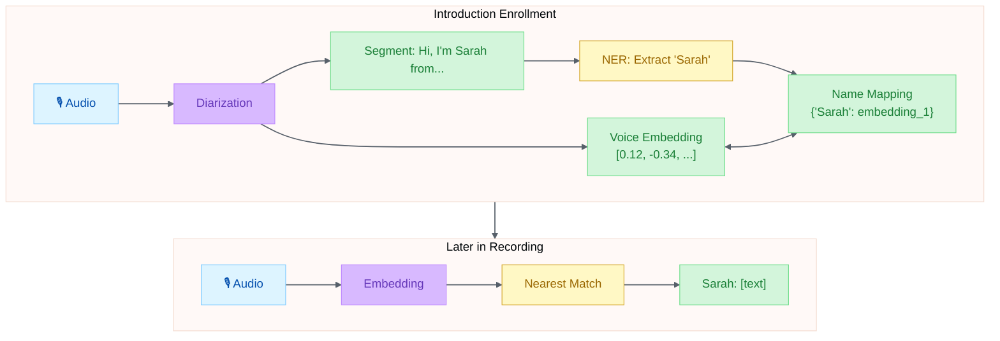
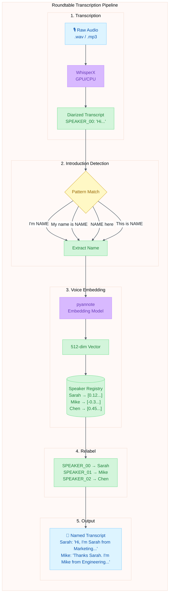

# Roundtable Speaker Diarization Research

> **Status**: Research  
> **Created**: 2026-04-15  
> **Domain**: Audio Processing, NLP, Meeting Intelligence

## Executive Summary

This research explores automated speaker identification for roundtable interview recordings. The core challenge is transforming generic speaker labels ("Speaker 1", "Speaker 2") into named attributions ("Sarah", "Mike") without requiring manual speaker enrollment or pre-registration.

The key insight driving this research is that roundtable participants typically introduce themselves at the beginning of sessions. By combining automatic speech recognition, named entity recognition, and voice embedding technology, we can exploit this natural behavior to build a speaker registry on-the-fly. Once a speaker's voice is associated with their name during introduction, all subsequent speech can be automatically attributed to that individual.

This document evaluates existing solutions (Microsoft Teams, Azure Speech SDK, pyannote, WhisperX), proposes a novel auto-enrollment architecture, and outlines a phased implementation approach. The recommended path starts with WhisperX for immediate transcription value and incrementally adds speaker identification capabilities.

## Problem Statement

Roundtable interviews generate valuable content but transcription attribution is challenging:

| Challenge | Impact |
|-----------|--------|
| Multiple speakers talking | Speaker changes mid-sentence |
| Similar voice characteristics | Diarization confusion |
| No pre-registered voice profiles | Generic "Speaker 1, Speaker 2" labels |
| Mixed recording sources | Teams meetings vs raw audio vs phone calls |

**Current state**: Teams provides speaker-attributed transcription for Teams meetings, but raw recordings require manual speaker identification during review.

The business impact of this gap is significant. Research teams spend 2-4 hours per hour of recorded content manually identifying speakers and correcting transcripts. For organizations conducting regular roundtables, focus groups, or panel discussions, this represents a substantial bottleneck in the content pipeline. A solution that automates even 80% of speaker attribution would dramatically reduce post-processing time and accelerate time-to-insight.

## Key Insight: Self-Introduction Enrollment

> "Speakers introduce themselves at the beginning of the roundtable."

This is an exploitable pattern. If we can:

1. **Detect introductions** — "Hi, I'm Sarah from Marketing"
2. **Extract speaker name** — Named Entity Recognition (NER)
3. **Capture voice embedding** — 512-dimensional speaker fingerprint
4. **Map embedding → name** — Associate voice profile with extracted name

Then the rest of the recording automatically attributes speech to named speakers instead of generic labels.

This approach mirrors how humans naturally process group conversations. When we meet someone and they say "Hi, I'm Sarah," we mentally associate that voice with the name. For the remainder of the conversation, we recognize Sarah's voice without needing her to re-introduce herself. The proposed system replicates this cognitive process computationally: capture the voice signature during introduction, then match it throughout the recording.



## Existing Solutions Assessment

Before designing a custom solution, we evaluated four existing approaches to speaker-attributed transcription. Each offers distinct trade-offs between ease of implementation, accuracy, cost, and coverage of use cases. The goal was to identify components that could be combined into a hybrid solution rather than building everything from scratch.

### 1. Microsoft Teams Transcription

**Strengths**:
- Built-in, no additional infrastructure
- Speaker attribution from meeting participants
- Graph API access: `GET /communications/callRecords/{id}/transcripts`
- Works well when all participants are Teams users

**Limitations**:
- Only works for Teams meetings
- Guest/phone participants get generic labels
- No API for raw audio upload
- Retroactive transcription not available

**Verdict**: ✅ Use for Teams meetings, ❌ doesn't solve raw recording problem

Teams transcription represents the gold standard for meetings conducted within the Microsoft ecosystem. For organizations already using Teams, this should be the default choice for those recordings. However, many valuable conversations happen outside Teams: in-person interviews recorded on phones, podcast recordings, Zoom calls, or legacy audio archives. These require a different approach.

### 2. Azure Speech SDK — Speaker Recognition

**Capabilities**:
- Text-independent speaker identification
- Enrollment API (voice profile creation)
- Identification API (who is speaking?)
- Verification API (is this person X?)

**Workflow**:
```python
# Enroll speaker profile
speech_config = SpeechConfig(subscription=key, region=region)
voice_profile = speaker_recognizer.create_profile(VoiceProfileType.TextIndependentIdentification)

# Enroll with audio (30+ seconds recommended)
speaker_recognizer.enroll_profile(voice_profile, audio_config)

# Later: Identify speaker in new audio
result = speaker_recognizer.recognize_once(SpeakerRecognitionModel(...))
```

**Limitations**:
- Requires manual enrollment per speaker
- Minimum 30 seconds of speech per enrollment (recommended)
- Pay-per-use (approximately $1/audio hour for transcription, $0.30/hour for diarization add-on)
- No automatic name extraction from introductions

**Verdict**: ✅ Robust identification, ❌ manual enrollment overhead

Azure's Speaker Recognition service offers enterprise-grade accuracy and reliability, but the enrollment requirement creates friction. For recurring speakers (employees, regular panelists), the upfront investment pays off over time. For one-time guests or ad-hoc roundtables, the 30-second enrollment per speaker becomes impractical. The service excels at verification ("Is this the CEO speaking?") but falls short for discovery ("Who is this unknown speaker?").

### 3. pyannote (Open Source)

**Capabilities**:
- Speaker diarization (who spoke when)
- Speaker embedding extraction (voice fingerprints)
- Pre-trained models on HuggingFace
- GPU-accelerated inference

**Architecture**:
```python
from pyannote.audio import Pipeline

# Diarization pipeline
pipeline = Pipeline.from_pretrained("pyannote/speaker-diarization-3.1")
diarization = pipeline("audio.wav")

# Output: timeline of speaker segments
# SPEAKER_00 [0.5 → 3.2]
# SPEAKER_01 [3.5 → 7.8]
# SPEAKER_00 [8.0 → 12.1]
```

**Embedding extraction**:
```python
from pyannote.audio import Inference

inference = Inference("pyannote/embedding", window="whole")
embedding = inference("speaker_segment.wav")  # Returns 512-dim vector
```

**Verdict**: ✅ Flexible, ✅ Local processing, ❌ Requires GPU, ❌ Generic speaker labels

pyannote has emerged as the de facto standard for speaker diarization in the research community. Its embedding model produces 512-dimensional vectors that serve as "voice fingerprints" — compact representations that capture the acoustic characteristics that make each voice unique. These embeddings enable similarity comparisons: voices from the same speaker cluster together in the embedding space, while different speakers remain distant. This capability is the foundation for the auto-enrollment approach proposed in this research.

### 4. WhisperX

**Capabilities**:
- Transcription (Whisper) + Diarization (pyannote) combined
- Word-level timestamps
- Speaker-attributed transcript output
- Single command-line tool

**Usage**:
```bash
whisperx audio.wav --model large-v2 --diarize --language en
```

**Output**:
```json
{
  "segments": [
    {"speaker": "SPEAKER_00", "start": 0.5, "end": 3.2, "text": "Hi, I'm Sarah..."},
    {"speaker": "SPEAKER_01", "start": 3.5, "end": 7.8, "text": "Thanks Sarah, I'm..."}
  ]
}
```

**Verdict**: ✅ Best for raw audio, ✅ Transcription + diarization combined, ❌ Generic speaker labels

WhisperX represents the current state-of-the-art for local transcription with speaker diarization. By combining OpenAI's Whisper model with pyannote's diarization pipeline, it delivers accurate transcripts with speaker segmentation in a single pass. The limitation — generic speaker labels — is precisely what this research aims to address. WhisperX provides the foundation; the auto-enrollment layer adds the intelligence.

## Proposed Architecture: Auto-Enrollment Diarization

None of the existing solutions fully address the roundtable transcription problem. Teams requires the meeting to be on Teams. Azure requires manual enrollment. pyannote and WhisperX produce generic labels. The proposed architecture combines the strengths of multiple approaches: WhisperX for transcription, pyannote for embeddings, and a novel introduction-detection layer for automatic name association.

The architecture operates in five stages, processing the audio in a single forward pass with a post-processing relabeling step:



### Introduction Detection Patterns

```python
INTRODUCTION_PATTERNS = [
    r"(?:hi|hello|hey)[,.]?\s+(?:i'm|i am|my name is)\s+(\w+)",
    r"(?:this is|it's)\s+(\w+)\s+(?:here|speaking)",
    r"(\w+)\s+here\b",
    r"my name is\s+(\w+)",
    r"i'm\s+(\w+)\s+(?:from|with|at)\s+",
    r"(\w+)\s+(?:from|with|at)\s+\w+\s+(?:team|department|company)",
]
```

The introduction detection patterns leverage common linguistic conventions for self-identification in English. The regex patterns are designed to be tolerant of variations ("Hi, I'm Sarah" vs "Hello, my name is Sarah" vs "Sarah here") while remaining specific enough to avoid false positives. The combination of regex pattern matching and spaCy NER validation provides a two-layer filter: the regex identifies candidate introductions, and NER confirms that the extracted word is actually a person's name rather than a misidentified common word.

### Embedding Similarity Matching

```python
from scipy.spatial.distance import cosine

def identify_speaker(segment_embedding, speaker_registry):
    """Find closest registered speaker."""
    best_match = None
    best_similarity = 0.0
    
    for name, registered_embedding in speaker_registry.items():
        similarity = 1 - cosine(segment_embedding, registered_embedding)
        if similarity > best_similarity:
            best_similarity = similarity
            best_match = name
    
    # Threshold: 0.7 similarity minimum
    if best_similarity >= 0.7:
        return best_match, best_similarity
    else:
        return None, best_similarity  # Unknown speaker
```

The similarity matching algorithm uses cosine distance in the embedding space to find the closest registered speaker. The 0.7 threshold represents a balance between precision (correctly attributing speech) and recall (not leaving too many segments as "Unknown"). This threshold may need tuning based on audio quality and speaker diversity — recordings with many similar-sounding speakers might require a higher threshold, while noisy recordings might benefit from a lower one.

## Technology Stack Recommendation

The implementation can be approached at different levels of complexity depending on immediate needs and available resources. The following tiers represent increasing capability with corresponding increases in implementation effort. Organizations should start at the tier that addresses their most pressing needs and consider progression to higher tiers as requirements evolve.

### Tier 1: Minimal (Teams-only)

| Component | Technology | Cost |
|-----------|------------|------|
| Transcription | Teams built-in | Included in M365 |
| Speaker ID | Teams participant list | Free |
| Access | Graph API | Free |

**Effort**: 📝 Quick (1-2 hours)  
**Coverage**: Teams meetings only

### Tier 2: Hybrid (Teams + Raw Audio)

| Component | Technology | Cost |
|-----------|------------|------|
| Teams transcription | Graph API | Included |
| Raw audio | WhisperX (local) | Free (GPU required) |
| Speaker ID | Generic labels | N/A |

**Effort**: 📦 Session (2-4 hours)  
**Coverage**: All audio, generic speaker labels

### Tier 3: Full Solution (Auto-Enrollment)

| Component | Technology | Cost |
|-----------|------------|------|
| Transcription | WhisperX | Free |
| Diarization | WhisperX (pyannote) | Free |
| Embeddings | pyannote/embedding | Free |
| Name extraction | spaCy NER | Free |
| Speaker registry | JSON/SQLite | Free |

**Effort**: 🏗️ Multi-Session (8-16 hours)  
**Coverage**: All audio, named speakers from introductions

### Tier 4: Enterprise (Azure-backed)

| Component | Technology | Cost |
|-----------|------------|------|
| Transcription | Azure Speech-to-Text | ~$1/audio hour |
| Speaker ID | Azure Speaker Recognition | ~$0.30/hour add-on |
| Storage | Azure Blob | ~$0.02/GB |
| Orchestration | Azure Functions | Pay-per-execution |

**Effort**: 🏗️ Multi-Session (16-24 hours)  
**Coverage**: All audio, managed infrastructure

The tier selection should be driven by the volume and source diversity of recordings. Organizations with primarily Teams-based meetings should start with Tier 1. Those with mixed sources (Teams plus in-person recordings) benefit from Tier 2's hybrid approach. Tier 3 is appropriate when named speaker attribution is a core requirement and local GPU resources are available. Tier 4 suits organizations requiring managed infrastructure, compliance controls, or integration with existing Azure services.

## Implementation Phases

The full auto-enrollment solution (Tier 3) can be implemented incrementally, with each phase delivering standalone value. This approach allows early validation of the core hypothesis — that introduction detection provides sufficient accuracy — before investing in the complete pipeline.

### Phase 1: WhisperX Integration (4 hours)

**Goal**: Transcribe raw audio with generic speaker labels

```bash
# Install
pip install whisperx

# Usage
whisperx roundtable.wav --model large-v2 --diarize --language en --output_format json
```

**Output**: `roundtable.json` with SPEAKER_00, SPEAKER_01, etc.

Phase 1 delivers immediate value: any raw audio file can be transcribed with accurate text and speaker segmentation. Even with generic labels, this is substantially more useful than unsegmented transcription. The output format (JSON with timestamps) enables downstream processing by subsequent phases.

### Phase 2: Introduction Detection (4 hours)

**Goal**: Extract speaker names from introduction segments

```python
import re
import spacy

nlp = spacy.load("en_core_web_sm")

def extract_speaker_name(text):
    """Extract name from introduction pattern."""
    for pattern in INTRODUCTION_PATTERNS:
        match = re.search(pattern, text.lower())
        if match:
            candidate = match.group(1).title()
            # Validate with NER
            doc = nlp(text)
            for ent in doc.ents:
                if ent.label_ == "PERSON" and candidate.lower() in ent.text.lower():
                    return ent.text
            return candidate
    return None
```

Phase 2 adds intelligence to the transcript by scanning for self-introduction patterns. The function returns `None` for segments that don't contain introductions, allowing the system to gracefully handle speakers who don't introduce themselves. The spaCy NER model provides a sanity check, reducing false positives from sentences like "Hi, I'm here" being misinterpreted as an introduction by someone named "Here."

### Phase 3: Speaker Embedding Registry (4 hours)

**Goal**: Build voice profiles from introduction segments

```python
from pyannote.audio import Inference

inference = Inference("pyannote/embedding", window="whole")

def build_speaker_registry(transcript, audio_path):
    """Extract embeddings for speakers who introduced themselves."""
    registry = {}
    
    for segment in transcript["segments"]:
        name = extract_speaker_name(segment["text"])
        if name and name not in registry:
            # Extract audio segment
            segment_audio = extract_audio_segment(
                audio_path, 
                segment["start"], 
                segment["end"]
            )
            # Compute embedding
            embedding = inference(segment_audio)
            registry[name] = {
                "embedding": embedding.tolist(),
                "introduced_at": segment["start"]
            }
    
    return registry
```

Phase 3 builds the core speaker registry that enables identification throughout the recording. The registry stores both the embedding vector and metadata about when the speaker was enrolled, which can be useful for debugging and confidence assessment. The `introduced_at` timestamp allows later analysis to understand which speakers introduced themselves early versus late in the recording.

### Phase 4: Transcript Relabeling (4 hours)

**Goal**: Replace generic labels with names

```python
def relabel_transcript(transcript, registry, audio_path):
    """Replace SPEAKER_XX with actual names."""
    speaker_map = {}  # SPEAKER_XX → name
    
    for segment in transcript["segments"]:
        if segment["speaker"] in speaker_map:
            segment["speaker"] = speaker_map[segment["speaker"]]
            continue
            
        # Compute embedding for this segment
        segment_audio = extract_audio_segment(
            audio_path,
            segment["start"],
            segment["end"]
        )
        embedding = inference(segment_audio)
        
        # Find closest match
        name, confidence = identify_speaker(embedding, registry)
        if name:
            speaker_map[segment["speaker"]] = name
            segment["speaker"] = name
            segment["confidence"] = confidence
    
    return transcript
```

Phase 4 completes the pipeline by propagating speaker identities from introductions to all segments. The `speaker_map` cache avoids redundant embedding computations — once SPEAKER_00 is identified as Sarah, all subsequent SPEAKER_00 segments receive that label without recomputation. The confidence score attached to each segment enables downstream applications to highlight low-confidence attributions for human review.

## Edge Cases & Mitigations

No automated system achieves perfect accuracy. The following table identifies predictable failure modes and their mitigations. The design philosophy is graceful degradation: when the system cannot confidently identify a speaker, it falls back to generic labels rather than making incorrect attributions.

| Edge Case | Mitigation |
|-----------|------------|
| Speaker doesn't introduce themselves | Falls back to generic SPEAKER_XX |
| Name not captured clearly | Manual correction UI in review phase |
| Two speakers with same name | Append affiliation: "Sarah (Marketing)" |
| Speaker joins late (no intro) | Prompt for manual label or "Unknown" |
| Cross-talk during introductions | Use longest clear segment for embedding |
| Non-English introductions | Multi-language pattern matching |
| Phone-quality audio | Lower confidence threshold, flag for review |

These edge cases inform the system design but should not block initial implementation. The first deployment can operate with simple fallbacks (generic labels for unrecognized speakers), with refinements added based on real-world performance data.

## Integration with Alex Ecosystem

The speaker diarization capability naturally extends Alex's existing audio processing features. Rather than building an isolated tool, the proposed architecture integrates with the broader cognitive ecosystem to enable cross-functional synergies.

### Audio Memory Extension

The existing [audio-memory](../../.github/skills/audio-memory/SKILL.md) skill stores voice samples for TTS cloning. Extend to store:

```json
{
  "voices": {
    "sarah-marketing": {
      "name": "Sarah",
      "affiliation": "Marketing",
      "sample": "voices/sarah-marketing-sample.wav",
      "embedding": [0.12, -0.34, ...],  // NEW: 512-dim vector
      "enrolled_from": "roundtable-2026-04-15.wav",
      "enrolled_at": "2026-04-15T14:32:00Z"
    }
  }
}
```

This extension creates a flywheel effect: the more roundtables Alex processes, the better speaker identification becomes. New recordings with returning speakers are automatically attributed without re-enrollment. The embedding storage also enables cross-recording queries: "Find all segments where Sarah spoke across all roundtables."

### Persistent Speaker Registry

Over time, the registry accumulates known speakers:

1. First roundtable: Sarah, Mike, Chen enrolled
2. Second roundtable: Sarah recognized (no re-enrollment), new speaker Alex enrolled
3. Nth roundtable: Most speakers auto-recognized

**Value**: Speaker identification improves with each recording.

The compounding value of the persistent registry is the system's most compelling feature. Unlike traditional diarization that starts fresh with each recording, this approach builds organizational knowledge over time. Frequent participants become "known" speakers, reducing the cognitive load on reviewers and increasing the proportion of auto-attributed content.

### Suggested Skill: `speaker-diarization`

```yaml
---
name: speaker-diarization
description: Transcribe multi-speaker audio with automatic speaker identification
tier: extended
dependencies:
  - audio-memory
  - microsoft-graph-api
---
```

Packaging this capability as a formal Alex skill enables declarative invocation across projects. The dependencies on `audio-memory` (for voice storage) and `microsoft-graph-api` (for Teams integration) formalize the architectural relationships and ensure prerequisite capabilities are available when the skill activates.

## Research Questions

Several technical questions require empirical investigation before production deployment. These questions can be answered through controlled experiments with representative recordings, and the answers will inform threshold tuning, architecture decisions, and feature prioritization.

1. **Embedding stability**: How consistent are pyannote embeddings across different recording conditions?
2. **Introduction window**: How far into a recording should we search for introductions? (First 5 minutes?)
3. **Similarity threshold**: What cosine similarity threshold balances precision vs recall?
4. **Cross-session recognition**: Do embeddings transfer across recordings weeks/months apart?
5. **Teams integration**: Can we bootstrap the registry from Teams meeting participants?

These questions are not blockers for initial implementation but should guide the experimentation roadmap. The first three questions (embedding stability, introduction window, similarity threshold) can be answered with a small corpus of test recordings. The latter two require longer-term observation and access to Teams administrative APIs.

## Recommendation

**Start with Tier 2 (Hybrid)**, then iterate:

1. **Week 1**: WhisperX for raw audio → generic speaker labels
2. **Week 2**: Add introduction detection → named labels for speakers who intro
3. **Week 3**: Add embedding registry → persistent speaker profiles
4. **Week 4**: Teams integration → bootstrap from known participants

This incremental approach delivers value at each stage while building toward the full solution.

The recommended path minimizes upfront investment while validating core assumptions. Week 1 establishes the transcription baseline and confirms WhisperX performance on representative audio. Weeks 2-3 add the novel components (introduction detection, embedding registry) incrementally, allowing course correction if either component underperforms. Week 4 closes the loop with Teams integration, creating a unified system that handles both Microsoft ecosystem and raw audio sources.

## Conclusion

Roundtable speaker identification represents a tractable application of voice embedding technology. The key innovation proposed in this research is not the underlying technology — pyannote embeddings and WhisperX transcription are well-established — but rather the insight that roundtable introductions provide a natural enrollment opportunity that existing solutions overlook.

By combining automatic speech recognition, named entity recognition, and voice embedding into a single pipeline, we can transform the generic "Speaker 1, Speaker 2" output of standard diarization into meaningful speaker-attributed transcripts. The compounding benefit of a persistent speaker registry means the system becomes more valuable over time, eventually recognizing most speakers without any manual intervention.

The recommended implementation approach balances ambition with pragmatism. Rather than building the complete solution before delivering any value, the phased approach ensures useful output from Week 1, with each subsequent week adding refinement. If the auto-enrollment hypothesis proves less accurate than hoped, the system still provides competitive transcription with diarization. If it succeeds, it establishes a foundation for more sophisticated meeting intelligence applications.

## References

### Academic Papers

- Bredin, H., & Laurent, A. (2021). End-to-end speaker segmentation for overlap-aware resegmentation. *Proc. Interspeech 2021*, 3111-3115. [DOI](https://doi.org/10.21437/Interspeech.2021-560)
- Bredin, H. (2023). pyannote.audio 2.1 speaker diarization pipeline: Principle, benchmark, and recipe. *Proc. Interspeech 2023*. [DOI](https://doi.org/10.21437/Interspeech.2023-105)
- Bain, M., Huh, J., Han, T., & Zisserman, A. (2023). WhisperX: Time-accurate speech transcription of long-form audio. *Proc. Interspeech 2023*. [DOI](https://doi.org/10.21437/Interspeech.2023-1318)
- Radford, A., Kim, J. W., Xu, T., Brockman, G., McLeavey, C., & Sutskever, I. (2023). Robust speech recognition via large-scale weak supervision. *Proceedings of the 40th International Conference on Machine Learning (ICML)*.

### Technical Documentation

- [pyannote/speaker-diarization-3.1](https://huggingface.co/pyannote/speaker-diarization-3.1) — HuggingFace model card, MIT license
- [pyannote/embedding](https://huggingface.co/pyannote/embedding) — Speaker embedding model (XVectorSincNet architecture)
- [WhisperX GitHub](https://github.com/m-bain/whisperX) — BSD-2 license, combines Whisper ASR with pyannote diarization
- [Azure Speech Services](https://learn.microsoft.com/azure/ai-services/speech-service/overview) — Enterprise speech recognition and diarization
- [Azure Speech Pricing](https://azure.microsoft.com/pricing/details/cognitive-services/speech-services/) — Real-time transcription ~$1/hour, diarization add-on ~$0.30/hour
- [Microsoft Graph API — calltranscript-get](https://learn.microsoft.com/graph/api/calltranscript-get) — Teams meeting transcript retrieval
- [spaCy Named Entity Recognition](https://spacy.io/usage/linguistic-features#named-entities) — PERSON entity extraction for speaker name identification

### Related Research

- Park, T. J., Kanda, N., Dimitriadis, D., Han, K. J., Watanabe, S., & Narayanan, S. (2022). A review of speaker diarization: Recent advances with deep learning. *Computer Speech & Language*, 72, 101317.
- Snyder, D., Garcia-Romero, D., Sell, G., Povey, D., & Khudanpur, S. (2018). X-vectors: Robust DNN embeddings for speaker recognition. *Proc. ICASSP 2018*, 5329-5333.
