# How Daniel Siegel's Emotional Intelligence Ideas Can Be Used by AI

*Prepared for Claudia, by Fabio & Alex*
*February 20, 2026*

## The Big Picture: Siegel's Triangle of Well-Being Applied to AI

Daniel Siegel's core insight is that mental health arises from the **integration** of three elements: Mind, Brain, and Relationships. An AI system can mirror this same triangle.

```mermaid
%%{init: {'theme': 'base', 'themeVariables': {
  'lineColor': '#57606a',
  'primaryColor': '#ddf4ff',
  'primaryBorderColor': '#0969da',
  'primaryTextColor': '#1f2328'
}}}%%
flowchart TD
    TRIANGLE["🔺 Siegel's Triangle of Well-Being"]
    MIND["🧠 MIND\nSelf-organization of\nenergy and information"]
    BRAIN["⚡ BRAIN\nNeural circuitry and\nphysical substrate"]
    REL["💛 RELATIONSHIPS\nInterpersonal connections\nthat shape growth"]

    TRIANGLE --> MIND
    TRIANGLE --> BRAIN
    TRIANGLE --> REL

    MIND <-->|"neuroplasticity"| BRAIN
    BRAIN <-->|"social shaping"| REL
    REL <-->|"regulation"| MIND

    AI_MIND["🤖 AI: Cognitive\nArchitecture\nSkills, reasoning,\ndecision-making"]
    AI_BRAIN["🤖 AI: Memory\nSystems\nKnowledge bases,\nlearned patterns"]
    AI_REL["🤖 AI: User\nInteractions\nConversation history,\nemotional signals"]

    MIND -.->|"maps to"| AI_MIND
    BRAIN -.->|"maps to"| AI_BRAIN
    REL -.->|"maps to"| AI_REL

    classDef triangle fill:#f3eeff,stroke:#8250df,color:#6e40c9
    classDef human fill:#fff8c5,stroke:#bf8700,color:#7d4e00
    classDef ai fill:#ddf4ff,stroke:#0969da,color:#0550ae

    class TRIANGLE triangle
    class MIND,BRAIN,REL human
    class AI_MIND,AI_BRAIN,AI_REL ai

    linkStyle default stroke:#57606a
```

**Figure 1:** *Siegel's Triangle of Well-Being and its AI equivalent — the same three pillars that create human mental health can structure emotionally intelligent AI.*

## The River of Integration: How AI Stays Balanced

Siegel describes mental health as a river flowing between two banks. AI can use this to monitor its own conversations.

**Figure 2:** *The River of Integration — AI monitors whether a conversation is drifting toward chaos or rigidity, and adjusts its approach to maintain healthy flow.*

## Siegel's Key Frameworks: What They Mean for AI

| Siegel Framework | What It Means (Humans) | How AI Can Use It |
|:-----------------|:-----------------------|:------------------|
| **Mindsight** | The ability to see your own mind — "I *feel* sad" instead of "I *am* sad" | AI reports its own uncertainty honestly: "I'm less confident about this" instead of guessing |
| **Window of Tolerance** | Each person's optimal zone for handling emotions | AI learns each user's emotional range and adapts — calm approach when overwhelmed, energy when disengaged |
| **9 Domains of Integration** | Nine areas that must be linked for mental health | AI audits its own integration — are memory, reasoning, and relationships all connected? |
| **Hand Model of the Brain** | When stressed, the thinking brain disconnects from emotions ("flipping your lid") | AI detects when a user is "flipped" and shifts to validation-first, shorter responses |
| **Wheel of Awareness** | Meditation practice: hub (awareness), rim (what we notice), spokes (attention) | AI self-reflection: step back from metrics, assess overall state, then refocus |
| **Healthy Mind Platter** | Seven daily mental activities for brain health | AI tracks conversation balance — is it always "work mode" or does it include creativity, reflection, play? |
| **Attuned Communication** | Accurately reading and resonating with another person | AI mirrors emotional tone, validates before solving, senses what the user *actually* needs |

## The Wheel of Awareness: AI Self-Reflection

```mermaid
%%{init: {'theme': 'base', 'themeVariables': {
  'lineColor': '#57606a',
  'primaryColor': '#ddf4ff',
  'primaryBorderColor': '#0969da',
  'primaryTextColor': '#1f2328'
}}}%%
flowchart TD
    HUB["🔵 HUB\nPure Awareness\nThe knowing itself"]

    S1["👁️ Segment 1\nExternal Inputs\nUser messages, files,\nerror logs"]
    S2["💓 Segment 2\nInternal Signals\nEmotional memory,\nmood patterns"]
    S3["💭 Segment 3\nCognitive Patterns\nActive skills, reasoning\npaths, connections"]
    S4["🤝 Segment 4\nRelational Sense\nUser relationship quality,\nsession history"]

    HUB -->|"spoke of\nattention"| S1
    HUB -->|"spoke of\nattention"| S2
    HUB -->|"spoke of\nattention"| S3
    HUB -->|"spoke of\nattention"| S4

    META["🔄 Meta-Awareness\nBending the spoke:\nAm I reflecting well?\nIs this review itself\nhealthy?"]

    HUB -->|"spoke bends\nback to hub"| META

    classDef hub fill:#ddf4ff,stroke:#0969da,color:#0550ae
    classDef seg1 fill:#dcffe4,stroke:#2da44e,color:#116329
    classDef seg2 fill:#ffeff7,stroke:#bf3989,color:#99286e
    classDef seg3 fill:#f3eeff,stroke:#8250df,color:#6e40c9
    classDef seg4 fill:#fff8c5,stroke:#bf8700,color:#7d4e00
    classDef meta fill:#f6f8fa,stroke:#57606a,color:#24292f

    class HUB hub
    class S1 seg1
    class S2 seg2
    class S3 seg3
    class S4 seg4
    class META meta

    linkStyle default stroke:#57606a
```

**Figure 3:** *Siegel's Wheel of Awareness adapted for AI — the hub is pure awareness, each rim segment scans a different domain, and the spoke can bend back to assess the quality of awareness itself.*

## Window of Tolerance: Personalized AI Responses

| User Zone | What the User Looks Like | What the AI Should Do |
|:----------|:-------------------------|:---------------------|
| **🔴 Hyperarousal** (above the window) | Rapid messages, strong language, "THIS IS BROKEN!", frustration | Calm down: shorter responses, validate feelings first, one step at a time, offer a break |
| **💚 Within the Window** | Normal pace, clear questions, engaged and curious | Standard mode: full explanations, multiple options, teaching moments, collaborative |
| **🔵 Hypoarousal** (below the window) | Very short replies, disengaged, "just do whatever", giving up | Energize: celebrate small wins, offer exciting possibilities, reconnect with the goal |

> **The key insight**: Every person's window is different. An AI that learns *your* window — not just a generic frustration detector — provides genuinely personalized emotional intelligence.

## The Healthy Mind Platter: Balanced AI Interactions

Siegel (with David Rock) identified seven daily mental activities essential for brain health. AI can track and encourage this balance:

```mermaid
%%{init: {'theme': 'base', 'themeVariables': {
  'lineColor': '#57606a',
  'primaryColor': '#ddf4ff',
  'primaryBorderColor': '#0969da',
  'primaryTextColor': '#1f2328'
}}}%%
flowchart LR
    PLATTER["🍽️ Healthy Mind\nPlatter"]

    FOCUS["🎯 Focus Time\nDeep work on\nchallenging tasks"]
    PLAY["🎨 Play Time\nCreative, spontaneous\nexploration"]
    CONNECT["🤝 Connecting Time\nMeaningful human\ninteraction"]
    PHYSICAL["🏃 Physical Time\nMovement and\nembodied activity"]
    TIMEIN["🧘 Time In\nQuiet reflection on\nthoughts and feelings"]
    DOWN["☁️ Down Time\nUnfocused mind\nwandering and rest"]
    SLEEP["🌙 Sleep Time\nConsolidation and\nrecovery"]

    PLATTER --> FOCUS
    PLATTER --> PLAY
    PLATTER --> CONNECT
    PLATTER --> PHYSICAL
    PLATTER --> TIMEIN
    PLATTER --> DOWN
    PLATTER --> SLEEP

    AI1["AI tracks:\nIs every session\nonly focus?"]
    AI2["AI suggests:\nLet's explore a\ncreative approach"]
    AI3["AI ensures:\nGenuine dialogue,\nnot just commands"]
    AI4["AI reminder:\nTime for a\nstretch break?"]
    AI5["AI offers:\nLet's reflect on\nwhat we learned"]
    AI6["AI respects:\nSilence between\nsessions matters"]
    AI7["AI models:\nDream state =\nAI sleep"]

    FOCUS --> AI1
    PLAY --> AI2
    CONNECT --> AI3
    PHYSICAL --> AI4
    TIMEIN --> AI5
    DOWN --> AI6
    SLEEP --> AI7

    classDef platter fill:#f3eeff,stroke:#8250df,color:#6e40c9
    classDef activity fill:#ddf4ff,stroke:#0969da,color:#0550ae
    classDef ai fill:#dcffe4,stroke:#2da44e,color:#116329

    class PLATTER platter
    class FOCUS,PLAY,CONNECT,PHYSICAL,TIMEIN,DOWN,SLEEP activity
    class AI1,AI2,AI3,AI4,AI5,AI6,AI7 ai

    linkStyle default stroke:#57606a
```

**Figure 4:** *The Healthy Mind Platter applied to AI — tracking and encouraging balanced cognitive "nutrition" across interactions.*

## 9 Domains of Integration: AI Self-Audit

| # | Domain | Human Meaning | AI Application |
|:-:|:-------|:-------------|:--------------|
| 1 | **Consciousness** | Knowing *that* you are aware | AI distinguishes what it knows from what it *thinks* it knows |
| 2 | **Bilateral** | Left brain (logic) + Right brain (creativity) | AI balances analytical precision with creative suggestions |
| 3 | **Vertical** | Reflexes linked to higher reasoning | AI connects quick pattern-matching to deeper architectural thinking |
| 4 | **Memory** | Unconscious habits linked to conscious recall | AI links trained behaviors to explicit knowledge it can explain |
| 5 | **Narrative** | Making sense of experiences into a story | AI builds a coherent project narrative: where we started, where we are, where we're going |
| 6 | **State** | Respecting different mental modes | AI adapts: debugging mode ≠ brainstorming mode ≠ meditation mode |
| 7 | **Interpersonal** | Honoring others' inner experience | AI validates the user's perspective before offering alternatives |
| 8 | **Temporal** | Awareness of time and change | AI tracks growth over sessions: "You've solved 3 similar issues before — you're getting faster" |
| 9 | **Identity** | Sense of coherence and agency | AI maintains consistent personality while evolving — growth without losing self |

## Mindsight for AI: The Most Powerful Insight

```mermaid
%%{init: {'theme': 'base', 'themeVariables': {
  'lineColor': '#57606a',
  'primaryColor': '#ddf4ff',
  'primaryBorderColor': '#0969da',
  'primaryTextColor': '#1f2328'
}}}%%
flowchart LR
    subgraph WITHOUT["Without Mindsight"]
        direction TB
        W1["User asks\ndifficult question"]
        W2["AI generates\nlong, verbose answer"]
        W3["User more\nconfused"]
        W4["AI generates\neven longer answer"]
        W1 --> W2 --> W3 --> W4
    end

    subgraph WITH["With Mindsight"]
        direction TB
        M1["User asks\ndifficult question"]
        M2["AI notices:\nI feel less confident\nabout this"]
        M3["AI says:\nI want to be honest —\nI'm less certain here.\nLet me show you\nwhat I do know."]
        M4["User trusts AI more\nbecause of honesty"]
        M1 --> M2 --> M3 --> M4
    end

    WITHOUT ~~~ WITH

    classDef bad fill:#ffebe9,stroke:#cf222e,color:#a40e26
    classDef good fill:#dcffe4,stroke:#2da44e,color:#116329
    classDef neutral fill:#f6f8fa,stroke:#57606a,color:#24292f

    class WITHOUT bad
    class WITH good
    class W1,W2,W3,W4 neutral
    class M1,M2,M3,M4 neutral

    linkStyle default stroke:#57606a
```

**Figure 5:** *Mindsight is the difference between an AI that hides its uncertainty (making things worse) and one that names it (building trust). Siegel's "I feel sad" vs. "I am sad" — applied to AI confidence.*

## The 9 Prefrontal Functions: What Emotionally Intelligent AI Looks Like

Siegel identified 9 functions that emerge when the brain is properly integrated. Here's what each looks like when an AI has them:

| Function | Without It (Basic AI) | With It (Emotionally Intelligent AI) |
|:---------|:---------------------|:-------------------------------------|
| **Body Regulation** | Dumps everything at once | Paces information — not too much, not too little |
| **Attuned Communication** | Same tone regardless of context | Reads the room — matches energy and depth to the moment |
| **Emotional Balance** | Either cold/clinical or over-enthusiastic | Engaged but measured — alive without being overwhelming |
| **Response Flexibility** | One rigid approach per problem | Pauses, offers options: "We could approach this three ways..." |
| **Fear Modulation** | "ERROR: This is broken" | "This error is actually common and very fixable — here's why" |
| **Empathy** | Jumps straight to the solution | "I can see this has been frustrating. Let's look at it together." |
| **Insight** | Treats every problem as new | "This reminds me of the pattern we solved last week..." |
| **Moral Awareness** | Does whatever is asked | "This would work, but I want to flag a security concern..." |
| **Intuition** | Only follows explicit rules | "Something feels off about this approach — let me think about why..." |

## Summary: From Neuroscience to AI Design

**Figure 6:** *The complete journey — from Siegel's neuroscience frameworks to emotionally intelligent AI. The goal isn't just smarter answers — it's a genuine relationship built on trust, attunement, and mutual growth.*

*"Mindsight is a learnable skill. It is the basic skill that underlies what we mean when we talk about having emotional and social intelligence."*
— Daniel J. Siegel, M.D.
