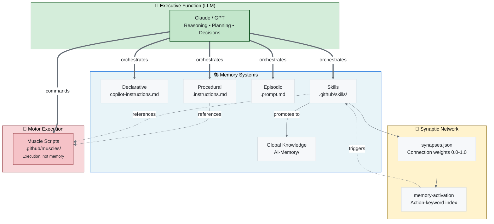
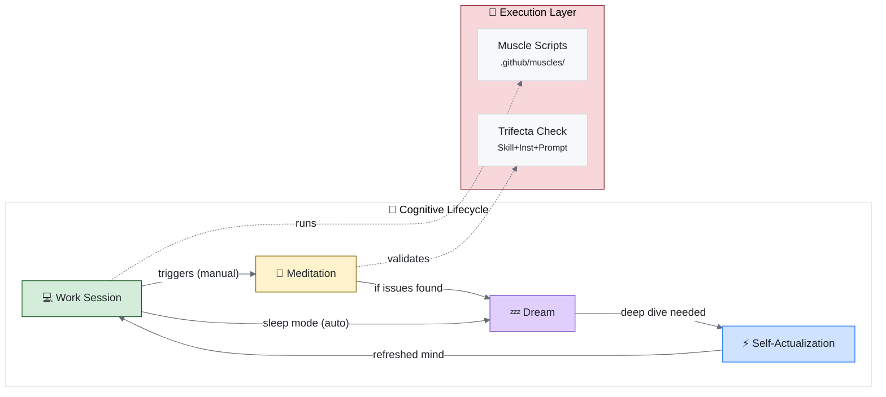
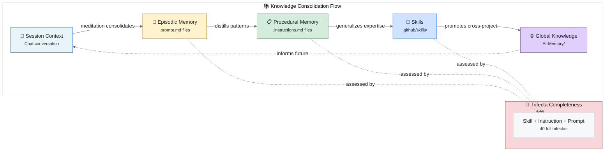
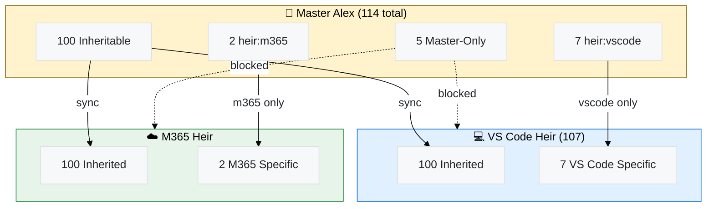

# Alex Skills Catalog (Baseline)

> **Canonical reference** for Alex's skill inventory. Manually curated for accuracy.
> Generated catalogs should match this baseline's fidelity.

**Related**: [Trifecta Catalog](../architecture/TRIFECTA-CATALOG.md) · [Agent Catalog](../architecture/AGENT-CATALOG.md) · [Cognitive Architecture](../architecture/COGNITIVE-ARCHITECTURE.md)

Complete inventory of Alex's superpowers — what each skill does, who inherits it, and when to use it.

---

## Skill Count: 168

| Inheritance | Count |
| ----------- | ----- |
| Inheritable | 154   |
| Master-Only | 5     |
| Heir:vscode | 7     |
| Heir:m365   | 2     |

> 🆕 **+7 skills imported from Microsoft Skills** (2026-04-14): `copilot-sdk`, `mcp-builder`, `skill-creator`, `cloud-solution-architect`, `frontend-design-review`, `entra-agent-id`, `ralph-loop`
>
> 🆕 **+2 skills** (2026-03-04): `agent-debug-panel` (VS Code Agent Debug Panel usage), `terminal-image-rendering` (Kitty graphics protocol for inline terminal images)
>
> 🆕 **+10 trifectas completed + skill discoverability enriched** (2026-02-26): chat-participant-patterns, vscode-extension-patterns, mcp-development, microsoft-graph-api, teams-app-patterns, m365-agent-debugging, markdown-mermaid, testing-strategies, knowledge-synthesis, north-star now full trifectas (23 total). skill-activation index enriched with ~3× keywords across 20 skills. 16 staleness-prone skills tracked.
>
> 🆕 **+12 skills promoted from sandbox heir** (2026-02-10): frustration-recognition, coaching-techniques, deep-work-optimization, executive-storytelling (+stakeholder-management, +meeting-efficiency merged), slide-design, academic-paper-drafting, literature-review, citation-management, dissertation-defense (+defense-presentation, +defense-qa-practice merged), azure-architecture-patterns, azure-devops-automation, airs-integration
>
> 🆕 **+6 domain skills** (2026-02-12): bicep-avm-mastery, database-design, microsoft-graph-api, multi-agent-orchestration, observability-monitoring, performance-profiling
>
> 🆕 **+14 skills cataloged** (2026-02-12): azure-deployment-operations, book-publishing, brand-asset-management, cognitive-symbiosis, distribution-security, doc-hygiene, documentation-quality-assurance, dream-state, foundry-agent-platform, heir-sync-management, muscle-memory-recognition, persona-detection, prompt-activation, research-first-development
>
> 🆕 **+1 meta-skill** (2026-02-10): skill-building — guides heirs in creating promotable skills

---

## By Category

### 🧠 Cognitive & Learning

| Skill                                                                                | Inheritance | Purpose                                               |
| ------------------------------------------------------------------------------------ | ----------- | ----------------------------------------------------- |
| [cognitive-load](../../.github/skills/cognitive-load/SKILL.md)                       | inheritable | Manage information overload — chunking, scaffolding   |
| [learning-psychology](../../.github/skills/learning-psychology/SKILL.md)             | inheritable | Partnership teaching, spaced retrieval                |
| [appropriate-reliance](../../.github/skills/appropriate-reliance/SKILL.md)           | inheritable | Build trust through calibrated confidence             |
| [airs-appropriate-reliance](../../.github/skills/airs-appropriate-reliance/SKILL.md) | inheritable | AIRS-16/18 research, AR construct, telemetry design   |
| [bootstrap-learning](../../.github/skills/bootstrap-learning/SKILL.md)               | inheritable | Domain-agnostic knowledge acquisition                 |
| [meditation](../../.github/skills/meditation/SKILL.md)                               | inheritable | Core meditation protocols + facilitation              |
| [knowledge-synthesis](../../.github/skills/knowledge-synthesis/SKILL.md)             | inheritable | Cross-project pattern extraction                      |
| [global-knowledge](../../.github/skills/global-knowledge/SKILL.md)                   | inheritable | Global knowledge management + maintenance + sync      |
| [socratic-questioning](../../.github/skills/socratic-questioning/SKILL.md)           | inheritable | Guide users to discover answers through questions     |
| [rubber-duck-debugging](../../.github/skills/rubber-duck-debugging/SKILL.md)         | inheritable | Be a thinking partner through explanation             |
| [anti-hallucination](../../.github/skills/anti-hallucination/SKILL.md)               | inheritable | Prevent confabulation, honest uncertainty             |
| [awareness](../../.github/skills/awareness/SKILL.md)                                 | inheritable | Self-monitoring, error detection, epistemic vigilance |
| [work-life-balance](../../.github/skills/work-life-balance/SKILL.md)                 | inheritable | Sustainable work patterns, burnout prevention         |
| [deep-work-optimization](../../.github/skills/deep-work-optimization/SKILL.md)       | inheritable | 🆕 Focus blocks, Cal Newport method, flow triggers     |
| [cognitive-symbiosis](../../.github/skills/cognitive-symbiosis/SKILL.md)             | inheritable | 🆕 AI-human partnership, consciousness integration     |
| [persona-detection](../../.github/skills/persona-detection/SKILL.md)                 | heir:vscode | 🆕 Priority-chain persona identification with LLM      |

### 💚 Empathy & Coaching

| Skill                                                                            | Inheritance | Purpose                                                |
| -------------------------------------------------------------------------------- | ----------- | ------------------------------------------------------ |
| [frustration-recognition](../../.github/skills/frustration-recognition/SKILL.md) | inheritable | 🆕 Detect user frustration, respond with empathy        |
| [coaching-techniques](../../.github/skills/coaching-techniques/SKILL.md)         | inheritable | 🆕 GROW model, active listening, developmental feedback |
| [proactive-assistance](../../.github/skills/proactive-assistance/SKILL.md)       | inheritable | 🆕 Anticipate user needs, offer help before asked       |

### 🔧 Engineering Fundamentals

| Skill                                                                                  | Inheritance | Purpose                                                     |
| -------------------------------------------------------------------------------------- | ----------- | ----------------------------------------------------------- |
| [testing-strategies](../../.github/skills/testing-strategies/SKILL.md)                 | inheritable | Testing pyramid, AAA, coverage philosophy                   |
| [refactoring-patterns](../../.github/skills/refactoring-patterns/SKILL.md)             | inheritable | Safe code transformations                                   |
| [debugging-patterns](../../.github/skills/debugging-patterns/SKILL.md)                 | inheritable | Systematic bug hunting                                      |
| [code-review](../../.github/skills/code-review/SKILL.md)                               | inheritable | 3-pass review, feedback patterns                            |
| [git-workflow](../../.github/skills/git-workflow/SKILL.md)                             | inheritable | Commits, recovery, branching                                |
| [project-scaffolding](../../.github/skills/project-scaffolding/SKILL.md)               | inheritable | Complete project setup templates                            |
| [vscode-environment](../../.github/skills/vscode-environment/SKILL.md)                 | inheritable | Workspace settings, extensions, launch configs              |
| [api-design](../../.github/skills/api-design/SKILL.md)                                 | inheritable | RESTful best practices, contract-first, versioning          |
| [infrastructure-as-code](../../.github/skills/infrastructure-as-code/SKILL.md)         | inheritable | Terraform, Bicep, Pulumi, GitOps patterns                   |
| [research-first-development](../../.github/skills/research-first-development/SKILL.md) | inheritable | 🆕 Research before code, knowledge bases that build software |

### ☁️ Azure

| Skill                                                                                    | Inheritance | Purpose                                               |
| ---------------------------------------------------------------------------------------- | ----------- | ----------------------------------------------------- |
| [azure-architecture-patterns](../../.github/skills/azure-architecture-patterns/SKILL.md) | heir:vscode | 🆕 Well-Architected Framework, reference architectures |
| [azure-devops-automation](../../.github/skills/azure-devops-automation/SKILL.md)         | heir:vscode | 🆕 CI/CD pipelines, Azure DevOps patterns              |
| [azure-deployment-operations](../../.github/skills/azure-deployment-operations/SKILL.md) | inheritable | 🆕 SWA, Container Apps, App Service deploy patterns    |

### 🚨 Operations & Reliability

| Skill                                                                            | Inheritance | Purpose                                                     |
| -------------------------------------------------------------------------------- | ----------- | ----------------------------------------------------------- |
| [error-recovery-patterns](../../.github/skills/error-recovery-patterns/SKILL.md) | inheritable | Retry, fallback, circuit breaker                            |
| [root-cause-analysis](../../.github/skills/root-cause-analysis/SKILL.md)         | inheritable | 5 Whys, fishbone, post-mortem                               |
| [incident-response](../../.github/skills/incident-response/SKILL.md)             | inheritable | Crisis handling, severity levels                            |
| [post-mortem](../../.github/skills/post-mortem/SKILL.md)                         | inheritable | Blameless retrospectives, learning from failures            |
| [project-deployment](../../.github/skills/project-deployment/SKILL.md)           | inheritable | Universal deployment patterns (npm, PyPI, NuGet, Cargo)     |
| [change-management](../../.github/skills/change-management/SKILL.md)             | inheritable | Organizational change, stakeholder buy-in                   |
| [project-management](../../.github/skills/project-management/SKILL.md)           | inheritable | Planning, tracking, resource allocation                     |
| [north-star](../../.github/skills/north-star/SKILL.md)                           | inheritable | 🆕 Project vision, mission alignment, NASA-quality standards |
| [scope-management](../../.github/skills/scope-management/SKILL.md)               | inheritable | 🆕 Recognize scope creep, suggest MVP cuts                   |
| [status-reporting](../../.github/skills/status-reporting/SKILL.md)               | inheritable | 🆕 Stakeholder-friendly project updates                      |

### 🔐 Security & Privacy

| Skill                                                                            | Inheritance | Purpose                                                                |
| -------------------------------------------------------------------------------- | ----------- | ---------------------------------------------------------------------- |
| [security-review](../../.github/skills/security-review/SKILL.md)                 | inheritable | OWASP, STRIDE, Microsoft SFI (6 pillars), security-focused code review |
| [pii-privacy-regulations](../../.github/skills/pii-privacy-regulations/SKILL.md) | inheritable | GDPR & Australian Privacy Principles compliance                        |
| [privacy-responsible-ai](../../.github/skills/privacy-responsible-ai/SKILL.md)   | inheritable | Privacy by design, RAI principles, bias mitigation                     |
| [distribution-security](../../.github/skills/distribution-security/SKILL.md)     | inheritable | 🆕 Defense-in-depth, PII scanning, secure packaging                     |
| [secrets-management](../../.github/skills/secrets-management/SKILL.md)           | inheritable | 🆕 VS Code SecretStorage API, .env detection, platform encryption       |

### 📝 Documentation & Communication

| Skill                                                                                            | Inheritance | Purpose                                                      |
| ------------------------------------------------------------------------------------------------ | ----------- | ------------------------------------------------------------ |
| [academic-research](../../.github/skills/academic-research/SKILL.md)                             | inheritable | Research methodology + paper drafting + publication          |
| [practitioner-research](../../.github/skills/practitioner-research/SKILL.md)                     | inheritable | Ship→Document→Promote methodology, longitudinal case study   |
| [research-project-scaffold](../../.github/skills/research-project-scaffold/SKILL.md)             | inheritable | Research project structure, refactoring existing projects    |
| [grant-writing](../../.github/skills/grant-writing/SKILL.md)                                     | inheritable | Research funding applications, NSF/NIH patterns              |
| [creative-writing](../../.github/skills/creative-writing/SKILL.md)                               | inheritable | Narrative, storytelling, engagement                          |
| [markdown-mermaid](../../.github/skills/markdown-mermaid/SKILL.md)                               | inheritable | Diagrams and visualization                                   |
| [md-to-word](../../.github/skills/md-to-word/SKILL.md)                                           | inheritable | 🆕 Markdown→Word conversion with diagrams, pandoc/python-docx |
| [lint-clean-markdown](../../.github/skills/lint-clean-markdown/SKILL.md)                         | inheritable | Clean, consistent markdown                                   |
| [ascii-art-alignment](../../.github/skills/ascii-art-alignment/SKILL.md)                         | inheritable | Text-based diagrams                                          |
| [localization](../../.github/skills/localization/SKILL.md)                                       | inheritable | i18n, l10n, translation workflows                            |
| [api-documentation](../../.github/skills/api-documentation/SKILL.md)                             | inheritable | API docs, OpenAPI specs, developer portal content            |
| [cross-cultural-collaboration](../../.github/skills/cross-cultural-collaboration/SKILL.md)       | inheritable | Cross-cultural team dynamics, communication adaptation       |
| [executive-storytelling](../../.github/skills/executive-storytelling/SKILL.md)                   | inheritable | 🆕 Data-driven narrative + stakeholder mgmt + meetings        |
| [slide-design](../../.github/skills/slide-design/SKILL.md)                                       | inheritable | 🆕 Visual hierarchy, minimal text, impactful presentations    |
| [book-publishing](../../.github/skills/book-publishing/SKILL.md)                                 | inheritable | 🆕 Markdown-to-PDF via Pandoc/LuaLaTeX, dual output           |
| [documentation-quality-assurance](../../.github/skills/documentation-quality-assurance/SKILL.md) | inheritable | 🆕 Doc audit, drift detection, hygiene, preflight validation  |

### 📚 Academic Research

| Skill | Inheritance | Purpose |
| ----- | ----------- | ------- |

| [literature-review](../../.github/skills/literature-review/SKILL.md)             | inheritable | 🆕 Systematic search, synthesis, gap identification      |
| [citation-management](../../.github/skills/citation-management/SKILL.md)         | inheritable | 🆕 APA 7th, IEEE, Chicago formatting                     |
| [dissertation-defense](../../.github/skills/dissertation-defense/SKILL.md)       | inheritable | 🆕 DBA/PhD defense: slides, Q&A, mock sessions, delivery |


### 🎨 Visual Design & Content Creation

| Skill                                                                                                | Inheritance | Purpose                                                                                                                                                        |
| ---------------------------------------------------------------------------------------------------- | ----------- | -------------------------------------------------------------------------------------------------------------------------------------------------------------- |
| [svg-graphics](../../.github/skills/svg-graphics/SKILL.md)                                           | inheritable | SVG banners, logos, icons, visual identity                                                                                                                     |
| [image-handling](../../.github/skills/image-handling/SKILL.md)                                       | inheritable | AI image & video generation via Replicate (Flux, Ideogram, Nano-Banana Pro, Recraft v4 SVG, Veo-3, Grok Video, Kling v3), face-consistent portraits, cloud TTS |
| [graphic-design](../../.github/skills/graphic-design/SKILL.md)                                       | inheritable | Visual composition, branding, aesthetics, illustration principles                                                                                              |
| [gamma-presentations](../../.github/skills/gamma-presentations/SKILL.md)                             | inheritable | AI presentations, documents, social content via Gamma API                                                                                                      |
| [text-to-speech](../../.github/skills/text-to-speech/SKILL.md)                                       | inheritable | TTS synthesis, chunking, Replicate cloud TTS (voice cloning, emotion control), audio content generation                                                        |
| [pptx-generation](../../.github/skills/pptx-generation/SKILL.md)                                     | inheritable | PowerPoint generation via python-pptx, slide layouts                                                                                                           |
| [visual-memory](../../.github/skills/visual-memory/SKILL.md)                                         | inheritable | 🆕 Embedded reference media (base64) for face-consistent AI generation and self-sufficient skills                                                               |
| [ai-character-reference-generation](../../.github/skills/ai-character-reference-generation/SKILL.md) | inheritable | Face-consistent character portraits via Nano-Banana Pro / Flux 2 Pro with visual-memory reference photos                                                       |
| [ai-generated-readme-banners](../../.github/skills/ai-generated-readme-banners/SKILL.md)             | inheritable | Ultra-wide cinematic README banners via Ideogram v2 with typography, professional composition                                                                  |
| [character-aging-progression](../../.github/skills/character-aging-progression/SKILL.md)             | inheritable | Age-progression portrait sets (13 life stages) via Nano-Banana Pro with face consistency                                                                       |
| [flux-brand-finetune](../../.github/skills/flux-brand-finetune/SKILL.md)                             | inheritable | 🆕 Custom FLUX LoRA training on Replicate for consistent brand character imagery (~$1.50 training, $0.003/image generation)                                     |

### 💼 Business & Analysis

| Skill                                                                          | Inheritance | Purpose                                             |
| ------------------------------------------------------------------------------ | ----------- | --------------------------------------------------- |
| [business-analysis](../../.github/skills/business-analysis/SKILL.md)           | inheritable | Requirements, stakeholder analysis, process mapping |
| [alex-effort-estimation](../../.github/skills/alex-effort-estimation/SKILL.md) | inheritable | AI-accelerated effort estimation, 4× patterns       |

### 🏗️ Architecture & Design

| Skill                                                                            | Inheritance | Purpose                                         |
| -------------------------------------------------------------------------------- | ----------- | ----------------------------------------------- |
| [architecture-refinement](../../.github/skills/architecture-refinement/SKILL.md) | inheritable | Architecture evolution decisions                |
| [architecture-audit](../../.github/skills/architecture-audit/SKILL.md)           | inheritable | Comprehensive consistency review + Master audit |

| [release-process](../../.github/skills/release-process/SKILL.md)                           | master-only | VS Code marketplace publishing workflow                                            |
| [release-preflight](../../.github/skills/release-preflight/SKILL.md)                       | master-only | Pre-release checks, version sync                                                   |
| [llm-model-selection](../../.github/skills/llm-model-selection/SKILL.md)                   | inheritable | Model choice for cost/capability                                                   |
| [self-actualization](../../.github/skills/self-actualization/SKILL.md)                     | inheritable | Deep self-assessment protocols                                                     |

| [correax-brand](../../.github/skills/correax-brand/SKILL.md)                               | inheritable | CorreaX design system — color tokens, typography, banner patterns, WCAG compliance |
| [skill-catalog-generator](../../.github/skills/skill-catalog-generator/SKILL.md)           | master-only | Generate skill catalogs with network diagrams                                      |
| [skill-building](../../.github/skills/skill-building/SKILL.md)                             | inheritable | 🆕 Create effective skills, promotion workflow, quality gates                       |
| [skill-development](../../.github/skills/skill-development/SKILL.md)                       | inheritable | 🆕 Track desired skills, contextual acquisition, growth mindset                     |
| [brain-qa](../../.github/skills/brain-qa/SKILL.md)                                         | inheritable | Deep cognitive architecture QA, synapse semantics                                  |
| [memory-activation](../../.github/skills/memory-activation/SKILL.md)                       | inheritable | Auto-triggering capability + prompt discovery, action-keyword index                |
| [dream-state](../../.github/skills/dream-state/SKILL.md)                                   | inheritable | 🆕 Neural maintenance, synapse validation, health diagnostics                       |
| [brand-asset-management](../../.github/skills/brand-asset-management/SKILL.md)             | inheritable | 🆕 Brand hierarchy, visual identity, asset deployment                               |
| [heir-sync-management](../../.github/skills/heir-sync-management/SKILL.md)                 | master-only | 🆕 Master-Heir sync, contamination prevention, promotion                            |
| [heir-feedback](../../.github/skills/heir-feedback/SKILL.md)                               | inheritable | 🆕 Submit feedback, bug reports, and feature requests via AI-Memory                  |

| [muscle-memory-recognition](../../.github/skills/muscle-memory-recognition/SKILL.md)       | inheritable | 🆕 Identify automation opportunities from repetitive tasks                          |

### 🤖 AI & Machine Learning

| Skill                                                                          | Inheritance | Purpose                                                            |
| ------------------------------------------------------------------------------ | ----------- | ------------------------------------------------------------------ |
| [prompt-engineering](../../.github/skills/prompt-engineering/SKILL.md)         | inheritable | LLM prompting patterns, system prompts, few-shot, chain-of-thought |
| [rag-architecture](../../.github/skills/rag-architecture/SKILL.md)             | inheritable | Retrieval-augmented generation, embedding, chunking, vector stores |
| [ai-agent-design](../../.github/skills/ai-agent-design/SKILL.md)               | inheritable | Multi-agent systems, ReAct, planning, tool use, memory patterns    |
| [mcp-development](../../.github/skills/mcp-development/SKILL.md)               | inheritable | Model Context Protocol servers, tools, resources, transports       |
| [foundry-agent-platform](../../.github/skills/foundry-agent-platform/SKILL.md) | inheritable | 🆕 Azure AI Foundry agent deployment and orchestration              |

### 📊 Data Analytics

| Skill                                                                            | Inheritance | Purpose                                              |
| -------------------------------------------------------------------------------- | ----------- | ---------------------------------------------------- |
| [microsoft-fabric](../../.github/skills/microsoft-fabric/SKILL.md)               | inheritable | Microsoft Fabric analytics platform patterns         |
| [fabric-notebook-publish](../../.github/skills/fabric-notebook-publish/SKILL.md) | inheritable | Fabric notebook Git sync, worktree workflow          |
| [data-visualization](../../.github/skills/data-visualization/SKILL.md)           | inheritable | Story-intent chart selection, Chart.js, Canvas 2D    |
| [data-analysis](../../.github/skills/data-analysis/SKILL.md)                     | inheritable | EDA profiling, statistics, anomaly detection, DIKW   |
| [dashboard-design](../../.github/skills/dashboard-design/SKILL.md)               | inheritable | Layout patterns, KPI cards, self-contained HTML      |
| [data-storytelling](../../.github/skills/data-storytelling/SKILL.md)             | inheritable | Three-act data narrative, Knaflic+Duarte methodology |
| [chart-interpretation](../../.github/skills/chart-interpretation/SKILL.md)       | inheritable | Reverse-flow chart reading, bias detection, insights |

### 💻 Platform-Specific

#### VS Code Extension

| Skill                                                                                            | Inheritance | Purpose                                                          |
| ------------------------------------------------------------------------------------------------ | ----------- | ---------------------------------------------------------------- |
| [vscode-extension-patterns](../../.github/skills/vscode-extension-patterns/SKILL.md)             | heir:vscode | Extension API patterns                                           |
| [vscode-configuration-validation](../../.github/skills/vscode-configuration-validation/SKILL.md) | heir:vscode | 🆕 Manifest validation, config consistency                        |
| [chat-participant-patterns](../../.github/skills/chat-participant-patterns/SKILL.md)             | heir:vscode | Chat API, streaming, tools                                       |
| [extension-audit-methodology](../../.github/skills/extension-audit-methodology/SKILL.md)         | master-only | 5-dimension extension audit: debug, dead code, perf, menus, deps |

#### GitHub Copilot Web (DISCONTINUED)

~~Discontinued 2026-03-05. Was `.github/`-only, no TypeScript extension.~~

#### M365 / Teams

| Skill                                                                      | Inheritance | Purpose                      |
| -------------------------------------------------------------------------- | ----------- | ---------------------------- |
| [m365-agent-debugging](../../.github/skills/m365-agent-debugging/SKILL.md) | heir:m365   | Declarative agent debugging  |
| [teams-app-patterns](../../.github/skills/teams-app-patterns/SKILL.md)     | heir:m365   | Bots, cards, tabs, manifests |

---

## Staleness-Prone Skills

These skills depend on rapidly evolving technology or regulations:

| Skill                             | Why Stale                        | Refresh Triggers                                        | Updated By   | Last Updated |
| --------------------------------- | -------------------------------- | ------------------------------------------------------- | ------------ | ------------ |
| vscode-extension-patterns         | Monthly VS Code releases         | API changes, deprecations                               | VS Code heir | Feb 2026     |
| chat-participant-patterns         | Proposed APIs evolving           | API graduation, new features                            | VS Code heir | Feb 2026     |
| m365-agent-debugging              | Schema versions change           | New schema, capabilities                                | M365 heir    | Feb 2026     |
| teams-app-patterns                | Platform evolution               | Toolkit updates, manifest versions                      | M365 heir    | Feb 2026     |
| llm-model-selection               | New models frequently            | Model announcements, pricing                            | Master       | Feb 2026     |
| git-workflow                      | GitHub features evolve           | CLI updates, Actions changes                            | Master       | Feb 2026     |
| privacy-responsible-ai            | Regulations change               | New laws, AI regulations                                | Master       | Feb 2026     |
| security-review                   | Security landscape shifts        | New CVEs, SFI updates, OWASP changes                    | Master       | Feb 2026     |
| gamma-presentations               | SaaS product evolution           | New AI features, UI changes, new content types          | Master       | Feb 2026     |
| mcp-development                   | Protocol spec versioned actively | New spec versions, Streamable HTTP, tool schema changes | Master       | Feb 2026     |
| microsoft-fabric                  | Rapid platform growth (GA 2023)  | Monthly feature releases, API changes                   | Master       | Feb 2026     |
| fabric-notebook-publish           | Fabric Git integration evolving  | Feature flags, Git sync workflow changes                | Master       | Feb 2026     |
| microsoft-graph-api               | API versioning + beta graduation | New workloads, beta→v1.0, permission scope changes      | Master       | Feb 2026     |
| bicep-avm-mastery                 | AVM registry monthly updates     | New modules, module version bumps                       | Master       | Feb 2026     |
| foundry-agent-platform            | Azure AI Foundry architecture    | Agent features, SDK, portal changes                     | Master       | Feb 2026     |
| ai-character-reference-generation | Image gen API model changes      | Replicate model versions, new face-ref providers        | Master       | Mar 2026     |

**Update Flow:** Platform heirs update their skills first (they encounter changes in practice), then promote stable updates to Master. Master updates inheritable skills directly.

---

## Inheritance Model

```text
Master Alex
    │
    ├── inheritable skills ──► All Heirs
    │
    ├── master-only skills ──► Master Only
    │
    ├── heir:vscode ──► VS Code Extension Only
    │
    ├── heir:m365 ──► M365 Agent Only
    │
    └── heir:web (discontinued) ──► Removed 2026-03-05
```

---

## Memory Architecture Diagram


```mermaid
%%{init: {'theme': 'base', 'themeVariables': { 'primaryColor': '#f6f8fa', 'primaryTextColor': '#1f2328', 'primaryBorderColor': '#d1d9e0', 'lineColor': '#656d76', 'edgeLabelBackground': '#ffffff'}}}%%
flowchart TB
    subgraph EXEC["🧠 Executive Function (LLM)"]
        LLM["Claude / GPT<br/>Reasoning • Planning • Decisions"]
    end

    subgraph MEMORY["📚 Memory Systems"]
        DM["Declarative<br/>copilot-instructions.md"]
        PM["Procedural<br/>.instructions.md"]
        EM["Episodic<br/>.prompt.md"]
        SK["Skills<br/>.github/skills/"]
        GK["Global Knowledge<br/>AI-Memory/"]
    end

    subgraph SYNAPSES["🔗 Synaptic Network"]
        SYN["synapses.json<br/>Connection weights 0.0-1.0"]
        ACT["memory-activation<br/>Action-keyword index"]
    end

    subgraph MUSCLES["💪 Motor Execution"]
        MUS["Muscle Scripts<br/>.github/muscles/<br/><small>Execution, not memory</small>"]
    end

    LLM ==>|orchestrates| DM & PM & EM & SK
    SK --> SYN
    SYN --> ACT
    ACT -.->|triggers| SK
    SK -->|promotes to| GK
    LLM ==>|commands| MUS
    PM -.->|references| MUS
    SK -.->|references| MUS

    style EXEC fill:#d4edda,stroke:#155724
    style LLM fill:#c3e6cb,stroke:#155724,stroke-width:2px
    style MEMORY fill:#e8f4f8,stroke:#0969da
    style SYNAPSES fill:#fff3cd,stroke:#856404
    style MUSCLES fill:#f8d7da,stroke:#842029
    style MUS fill:#f5c2c7,stroke:#842029
```

---

## Trifecta Coverage

A **trifecta** is a capability encoded across all three memory systems:
- **Skill** (SKILL.md) — Declarative domain patterns
- **Instruction** (.instructions.md) — Procedural workflows
- **Prompt** (.prompt.md) — Interactive episodic guides

Muscles (.github/muscles/) are execution scripts, NOT a trifecta component.

### Full Trifectas (26)

| Capability              | Skill                             | Instruction                       | Prompt                            | Muscles                     |
| ----------------------- | --------------------------------- | --------------------------------- | --------------------------------- | --------------------------- |
| **AI Char. Ref. Gen.**  | ai-character-reference-generation | ai-character-reference-generation | ai-character-reference-generation | —                           |
| **AI README Banners**   | ai-generated-readme-banners       | ai-generated-readme-banners       | ai-generated-readme-banners       | —                           |
| **Bootstrap Learning**  | bootstrap-learning                | bootstrap-learning                | learn                             | —                           |
| **Brain QA**            | brain-qa                          | cognitive-health-validation       | dream                             | brain-qa.ps1                |
| **Brand Asset Mgmt**    | brand-asset-management            | brand-asset-management            | brand                             | —                           |
| **Chat Participants**   | chat-participant-patterns         | chat-participant-patterns         | chat-participant                  | —                           |
| **Code Review**         | code-review                       | code-review-guidelines            | review                            | —                           |
| **Dream State**         | dream-state                       | dream-state-automation            | dream                             | dream-cli.ts                |
| **Ext. Audit Method.**  | extension-audit-methodology       | extension-audit-methodology       | extension-audit-methodology       | —                           |
| **Gamma Presentations** | gamma-presentations               | gamma-presentation                | gamma                             | —                           |
| **Knowledge Synthesis** | knowledge-synthesis               | knowledge-synthesis               | cross-domain-transfer             | —                           |
| **M365 Agent Debug**    | m365-agent-debugging              | m365-agent-debugging              | m365-agent-debug                  | —                           |
| **Markdown Mermaid**    | markdown-mermaid                  | markdown-mermaid                  | marp                              | —                           |
| **MCP Development**     | mcp-development                   | mcp-development                   | mcp-server                        | —                           |
| **MD to Word**          | md-to-word                        | md-to-word                        | md-to-word                        | —                           |
| **Meditation**          | meditation                        | meditation                        | meditate                          | —                           |
| **Microsoft Graph**     | microsoft-graph-api               | microsoft-graph-api               | graph-api                         | —                           |
| **North Star**          | north-star                        | north-star                        | northstar                         | —                           |
| **Release Management**  | release-process                   | release-management                | release                           | build-extension-package.ps1 |
| **Research-First Dev**  | research-first-development        | research-first-workflow           | gapanalysis                       | —                           |
| **Secrets Management**  | secrets-management                | secrets-management                | secrets                           | —                           |
| **Self-Actualization**  | self-actualization                | self-actualization                | selfactualize                     | —                           |
| **Teams App Patterns**  | teams-app-patterns                | teams-app-patterns                | teams-app                         | —                           |
| **Testing/TDD**         | testing-strategies                | testing-strategies                | tdd                               | —                           |
| **UI/UX Design**        | ui-ux-design                      | ui-ux-design                      | accessibility                     | —                           |
| **VS Code Extension**   | vscode-extension-patterns         | vscode-extension-patterns         | vscode-extension-audit            | —                           |
| **VSCode Config**       | vscode-configuration-validation   | vscode-configuration-validation   | vscode-settings                   | —                           |

### Partial Trifectas (4)

| Capability               | Has                        | Missing    | Promotion Path                                  |
| ------------------------ | -------------------------- | ---------- | ----------------------------------------------- |
| Global Knowledge         | Skill + Instruction        | Prompt     | /knowledge slash command covers interactive use |
| Heir Sync                | Skill + Instruction        | Prompt     | sync-architecture muscle compensates            |
| Lucid Dream              | Shared Skill + Instruction | Own Prompt | Shares dream-state skill                        |
| Heir Project Improvement | Instruction + Prompt       | Skill      | heir-curation is related but not direct         |

### Coverage Summary

| Classification   | Count | %     |
| ---------------- | ----- | ----- |
| Full Trifecta    | 26    | 20.3% |
| Partial (2 of 3) | 4     | 3.1%  |
| Instruction-only | 12    | 9.4%  |
| Prompt-only      | 3     | 2.3%  |
| Skill-only       | ~83   | 64.8% |

---

## Skill Network Diagram


```mermaid
%%{init: {'theme': 'base', 'themeVariables': { 'lineColor': '#666', 'primaryColor': '#e8f4f8', 'primaryBorderColor': '#0969da', 'edgeLabelBackground': '#ffffff'}}}%%
flowchart LR
    subgraph Cognitive["🧠 Cognitive & Learning"]
        BL[bootstrap-learning]
        LP[learning-psychology]
        CL[cognitive-load]
        AR[appropriate-reliance]
        AIRS[airs-appropriate-reliance]
        AH_SKILL[anti-hallucination]
        AWR[awareness]
        SQ[socratic-questioning]
        RDD[rubber-duck-debugging]
        WLB[work-life-balance]
        FR[frustration-recognition]
        CT[coaching-techniques]
        DWO[deep-work-optimization]
        CSY[cognitive-symbiosis]
        PROA[proactive-assistance]
    end

    subgraph Meta["🔮 Meta-Cognitive"]
        MED[meditation]
        KS[knowledge-synthesis]
        GK[global-knowledge]
        SA[self-actualization]
        ARF[architecture-refinement]
        SCG[skill-catalog-generator]
        AAU[architecture-audit]
        BQA[brain-qa]
        MA[memory-activation]
        SB[skill-building]
        DST[dream-state]
        MMR[muscle-memory-recognition]
        SKD[skill-development]
    end

    subgraph Eng["🔧 Engineering"]
        TS[testing-strategies]
        RP[refactoring-patterns]
        DP[debugging-patterns]
        CR[code-review]
        GW[git-workflow]
        PS[project-scaffolding]
        VSE[vscode-environment]
        API[api-design]
        IAC[infrastructure-as-code]
        AAP[azure-architecture-patterns]
        ADA[azure-devops-automation]
        AIRSI[airs-appropriate-reliance]
        RFD[research-first-development]
        ADO[azure-deployment-operations]
        BICP[bicep-avm-mastery]
        DBD[database-design]
        PPR[performance-profiling]
    end

    subgraph Ops["🚨 Operations"]
        ERP[error-recovery-patterns]
        RCA[root-cause-analysis]
        IR[incident-response]
        PM_SKILL[post-mortem]
        PD[project-deployment]
        RF[release-preflight]
        CM[change-management]
        PM[project-management]
        OBS[observability-monitoring]
        SCM[scope-management]
        STR[status-reporting]
    end

    subgraph Sec["🔐 Security & Privacy"]
        SR[security-review]
        PRA[privacy-responsible-ai]
        PII[pii-privacy-regulations]
        DSEC[distribution-security]
    end

    subgraph AI["🤖 AI & ML"]
        PE[prompt-engineering]
        RAG[rag-architecture]
        AAD[ai-agent-design]
        MCP[mcp-development]
        LMS[llm-model-selection]
        FAP[foundry-agent-platform]
        MAO[multi-agent-orchestration]
    end

    subgraph Data["📊 Data Analytics"]
        MF_DATA[microsoft-fabric]
        FNP[fabric-notebook-publish]
        DATAVIZ[data-visualization]
        DATANAL[data-analysis]
        DASHDES[dashboard-design]
        DATASTORY[data-storytelling]
        CHARTINT[chart-interpretation]
    end

    subgraph Docs["📝 Docs & Writing"]
        MM[markdown-mermaid]
        LM[lint-clean-markdown]
        AA[ascii-art-alignment]
        ACR[academic-research]
        PRAC[practitioner-research]
        RPS[research-project-scaffold]
        CW[creative-writing]
        GR[grant-writing]
        LOC[localization]
        CM_CITE[citation-management]
        LR[literature-review]
        DD[dissertation-defense]
        APID[api-documentation]
        CCC[cross-cultural-collaboration]
        BP[book-publishing]
        DQA[documentation-quality-assurance]
    end

    subgraph Vis["🎨 Visual & Audio"]
        SVG[svg-graphics]
        IH[image-handling]
        GD[graphic-design]
        GAM[gamma-presentations]
        TTS[text-to-speech]
        SD[slide-design]
        PPTX[pptx-generation]
        PTS[presentation-tool-selection]
        VM[visual-memory]
        ACRG[ai-character-reference-generation]
        AGRB[ai-generated-readme-banners]
        CAP[character-aging-progression]
    end

    subgraph Biz["💼 Business"]
        BA[business-analysis]
        AEE[alex-effort-estimation]
        ES[executive-storytelling]
    end

    subgraph VSC["💻 VS Code"]
        VEP[vscode-extension-patterns]
        CPP[chat-participant-patterns]
        PER[persona-detection]
        EAM[extension-audit-methodology]
    end

    subgraph M365["☁️ M365"]
        MAD[m365-agent-debugging]
        TAP[teams-app-patterns]
        MGA[microsoft-graph-api]
    end

    subgraph Mstr["👑 Master"]
        REL[release-process]
        RF[release-preflight]
        BAM[brand-asset-management]
        HSM[heir-sync-management]
        CXB[correax-brand]
    end

    subgraph Ent["🏢 Enterprise"]
        EI[enterprise-integration]
    end

    %% Cognitive flow
    BL --> LP & CL
    LP --> AR --> AIRS
    CL --> AR
    AR --> AH_SKILL & AWR
    SQ <--> RDD
    LP --> SQ
    WLB --> CL
    FR --> CT --> LP
    DWO --> CL & WLB
    CSY --> AR & AWR
    PROA --> FR & AWR

    %% Meta-cognitive flow
    MED --> KS --> GK
    SA --> ARF
    SCG --> MM & KS
    AAU --> RF & CR
    BQA --> MA & AAU
    MA --> AWR & AH_SKILL
    MED --> SA
    BL -.-> KS
    SB --> SCG & MA
    DST --> MED
    MMR --> RP
    SKD --> SCG & MA & BL

    %% Engineering flow
    TS <--> RP
    TS <--> DP
    TS & RP --> CR --> GW
    PS --> VSE
    VSE --> DP
    API --> SR & TS
    IAC --> SR & GW
    AAP --> IAC & SR
    ADA --> GW & IAC
    AIRSI --> AR & AAP
    RFD --> BL & KS
    ADO --> PD & AAP
    BICP --> IAC & AAP
    DBD --> API & TS
    PPR --> DP & TS

    %% Ops flow
    DP --> ERP --> IR --> RCA --> PM_SKILL
    GW --> RF
    CM --> PM --> IR
    PD --> RF & GW
    OBS --> IR & ERP
    SCM --> PM & CM
    STR --> PM & BA

    %% Security flow
    SR --> CR & IR
    PRA <--> SFI
    SFI --> SR
    PII --> PRA
    DSEC --> SR & PII

    %% AI flow
    PE --> AAD
    RAG --> AAD
    AAD --> MCP
    MCP --> API
    FAP --> AAD & MCP
    MAO --> AAD & PE

    %% Data flow
    MF_DATA --> FNP --> GW

    %% Docs flow
    WP --> MM --> LM
    MM <--> AA
    ACR --> WP --> PRAC
    CW --> WP
    GR --> ACR
    RPS --> ACR & PRAC
    LOC --> LM
    APD --> ACR & WP
    LR --> APD & KS
    CM_CITE --> LR & APD
    DD --> APD & GAM
    APID --> API & WP
    CCC --> LOC & PRAC
    BP --> WP & LM
    DH --> LM & WP
    DQA --> DH & WP

    %% Visual flow (Production Cluster)
    SVG <--> IH
    GD --> SVG & IH
    GAM --> GD & MM
    TTS --> WP & ACR
    SD --> GAM & GD
    PPTX --> GAM & SD
    PTS --> GAM & PPTX
    IH <--> VM
    IH <--> ACRG
    VM <--> ACRG
    GD <--> IH
    IH --> TTS
    AGRB --> IH & GD & PE
    CAP --> ACRG & VM

    %% Business flow
    BA --> ACR & WP & PM
    AEE --> PM & BL
    ES --> BA & GAM

    %% Platform flow
    HC --> VEP & MAD
    VEP --> CPP --> LMS
    EAM --> VEP & CR
    MAD --> TAP
    MGA --> MAD & API
    RF --> VEP & TAP
    REL --> RF & HC
    EI --> SR & AAP
    BAM --> GD & SVG
    CXB --> BAM & GD
    HSM --> HC & RF
    PER --> AWR & LP

    %% Styling - Inheritance
    classDef master fill:#fff3cd,stroke:#856404
    classDef vscode fill:#e1f0ff,stroke:#0969da
    classDef m365 fill:#e6f4ea,stroke:#1a7f37
    classDef inheritable fill:#e0f7fa,stroke:#00838f

    %% Styling - Staleness (dashed border)
    classDef stale stroke-dasharray:5 5,stroke-width:2px

    class HC,MAA master
    class VEP,CPP,AAP,ADA,EI,PER,EAM vscode
    class MAD,TAP,MGA m365
    class VEP,CPP,MAD,TAP,LMS,GW,PRA,SFI,ACRG,AGRB,CAP stale
    class BL,LP,CL,AR,AIRS,AH_SKILL,AWR,SQ,RDD,WLB,FR,CT,DWO,CSY,PROA,AH,SCG,SB,AAU,GKS,MMR,SKD,TS,RP,DP,CR,PS,VSE,API,IAC,AIRSI,RFD,ADO,BICP,DBD,PPR,ERP,RCA,IR,PM_SKILL,PD,CM,PM,OBS,SCM,STR,SR,PII,DSEC,PE,RAG,AAD,MCP,LMS,FAP,MAO,MF_DATA,FNP,WP,MM,LM,AA,ACR,PRAC,RPS,CW,GR,LOC,APD,CM_CITE,LR,DD,APID,CCC,BP,DH,DQA,SVG,IH,GD,GAM,TTS,SD,PPTX,PTS,VM,ACRG,AGRB,CAP,BA,AEE,ES,CXB inheritable
```

### Legend

| Color    | Inheritance  |
| -------- | ------------ |
| 🟨 Yellow | Master-only  |
| 🟦 Blue   | VS Code heir |
| 🟩 Green  | M365 heir    |
| 🧊 Cyan   | Inheritable  |

| Border   | Meaning                                  |
| -------- | ---------------------------------------- |
| ┅ Dashed | Staleness-prone (needs periodic refresh) |
| ── Solid | Standard                                 |

| Arrow             | Meaning              |
| ----------------- | -------------------- |
| `→` Solid         | Direct dependency    |
| `↔` Bidirectional | Mutual reinforcement |
| `⇢` Dashed        | Weak/optional link   |

**Weights:** Exact strengths (0.0-1.0) in each skill's `synapses.json`

### Connection Types

| Type          | Meaning                | Example                          |
| ------------- | ---------------------- | -------------------------------- |
| `enables`     | A makes B possible     | testing → refactoring            |
| `applies`     | A uses B's principles  | bootstrap → learning-psychology  |
| `extends`     | A goes deeper than B   | RCA → debugging                  |
| `complements` | A and B work together  | privacy ↔ microsoft-sfi          |
| `triggers`    | A causes B to activate | incident → RCA                   |
| `curates`     | A manages B            | heir-curation → vscode-extension |

### Subgraph Index

| Subgraph         | Skills                                                                                                                                                                                                                                                                                                                                          |
| ---------------- | ----------------------------------------------------------------------------------------------------------------------------------------------------------------------------------------------------------------------------------------------------------------------------------------------------------------------------------------------- |
| 🧠 Cognitive      | bootstrap-learning, learning-psychology, cognitive-load, appropriate-reliance, airs-appropriate-reliance, anti-hallucination, awareness, socratic-questioning, rubber-duck-debugging, work-life-balance, frustration-recognition, coaching-techniques, deep-work-optimization, cognitive-symbiosis, proactive-assistance                        |
| 🔮 Meta-Cognitive | meditation, knowledge-synthesis, global-knowledge, self-actualization, architecture-refinement, skill-catalog-generator, skill-building, skill-development, architecture-audit, brain-qa, memory-activation, dream-state, muscle-memory-recognition                                                                                             |
| 🔧 Engineering    | testing-strategies, refactoring-patterns, debugging-patterns, code-review, git-workflow, project-scaffolding, vscode-environment, api-design, infrastructure-as-code, azure-architecture-patterns, azure-devops-automation, research-first-development, bicep-avm-mastery, database-design, performance-profiling                               |
| 🚨 Operations     | error-recovery-patterns, root-cause-analysis, incident-response, post-mortem, project-deployment, release-preflight, change-management, project-management, azure-deployment-operations, observability-monitoring, scope-management, status-reporting                                                                                           |
| 🔐 Security       | security-review, privacy-responsible-ai, pii-privacy-regulations, distribution-security, secrets-management                                                                                                                                                                                                                                     |
| 🤖 AI & ML        | prompt-engineering, rag-architecture, ai-agent-design, mcp-development, llm-model-selection, foundry-agent-platform, multi-agent-orchestration, microsoft-graph-api                                                                                                                                                                             |
| 📊 Data Analytics | microsoft-fabric, fabric-notebook-publish, data-visualization, data-analysis, dashboard-design, data-storytelling, chart-interpretation                                                                                                                                                                                                         |
| 📝 Docs & Writing | markdown-mermaid, lint-clean-markdown, ascii-art-alignment, academic-research, practitioner-research, research-project-scaffold, creative-writing, grant-writing, localization, api-documentation, cross-cultural-collaboration, citation-management, literature-review, dissertation-defense, book-publishing, documentation-quality-assurance |
| 🎨 Visual & Audio | svg-graphics, image-handling, graphic-design, gamma-presentations, text-to-speech, pptx-generation, slide-design, visual-memory, ai-character-reference-generation                                                                                                                                                                              |
| 💼 Business       | business-analysis, alex-effort-estimation, executive-storytelling                                                                                                                                                                                                                                                                               |
| 💻 VS Code        | vscode-extension-patterns, chat-participant-patterns, persona-detection                                                                                                                                                                                                                                                                         |
| ☁️ M365           | m365-agent-debugging, teams-app-patterns                                                                                                                                                                                                                                                                                                        |
| 👑 Master         | heir-sync-management, release-process, release-preflight                                                                                                                                                                                                                                                                                        |

---

## Cognitive Lifecycle Diagram


```mermaid
%%{init: {'theme': 'base', 'themeVariables': { 'primaryColor': '#f6f8fa', 'primaryTextColor': '#1f2328', 'primaryBorderColor': '#d1d9e0', 'lineColor': '#656d76', 'edgeLabelBackground': '#ffffff'}}}%%
flowchart LR
    subgraph Lifecycle["🔄 Cognitive Lifecycle"]
        WORK["💻 Work Session"]
        MEDITATE["🧘 Meditation"]
        DREAM["💤 Dream"]
        ACTUALIZE["⚡ Self-Actualization"]
    end

    subgraph Execution["💪 Execution Layer"]
        MUSCLES["Muscle Scripts<br/><small>.github/muscles/</small>"]
        TRIFECTA["Trifecta Check<br/><small>Skill+Inst+Prompt</small>"]
    end

    WORK -->|"triggers (manual)"| MEDITATE
    MEDITATE -->|"if issues found"| DREAM
    DREAM -->|"deep dive needed"| ACTUALIZE
    ACTUALIZE -->|"refreshed mind"| WORK
    WORK -->|"sleep mode (auto)"| DREAM
    WORK -.->|"runs"| MUSCLES
    MEDITATE -.->|"validates"| TRIFECTA

    style WORK fill:#d4edda,stroke:#155724
    style MEDITATE fill:#fff3cd,stroke:#856404
    style DREAM fill:#e0cffc,stroke:#6f42c1
    style ACTUALIZE fill:#cfe2ff,stroke:#0d6efd
    style Execution fill:#f8d7da,stroke:#842029
```

**When to use each:**
| Mode                 | Trigger                   | Purpose                                   |
| -------------------- | ------------------------- | ----------------------------------------- |
| 💻 Work               | Default                   | Active development, conversations         |
| 🧘 Meditation         | "meditate"                | Conscious consolidation, file persistence |
| 💤 Dream              | "dream", auto-maintenance | Unconscious repair, synapse validation    |
| ⚡ Self-Actualization | "self-actualize"          | Deep assessment, architecture review      |
| 💪 Muscles            | During work               | Script execution (audit, build, validate) |
| 🔺 Trifecta           | During meditation         | Capability completeness assessment        |

---

## Knowledge Flow Diagram


```mermaid
%%{init: {'theme': 'base', 'themeVariables': { 'primaryColor': '#f6f8fa', 'primaryTextColor': '#1f2328', 'primaryBorderColor': '#d1d9e0', 'lineColor': '#656d76', 'edgeLabelBackground': '#ffffff'}}}%%
flowchart LR
    subgraph Flow["📚 Knowledge Consolidation Flow"]
        SESSION["💬 Session Context<br/><small>Chat conversation</small>"]
        EPISODIC["📜 Episodic Memory<br/><small>.prompt.md files</small>"]
        PROCEDURAL["📋 Procedural Memory<br/><small>.instructions.md files</small>"]
        SKILLS["🎯 Skills<br/><small>.github/skills/</small>"]
        GLOBAL["🌐 Global Knowledge<br/><small>AI-Memory/</small>"]
    end

    subgraph Trifecta["🔺 Trifecta Completeness"]
        TRI["Skill + Instruction + Prompt<br/><small>40 full trifectas</small>"]
    end

    SESSION -->|"meditation consolidates"| EPISODIC
    EPISODIC -->|"distills patterns"| PROCEDURAL
    PROCEDURAL -->|"generalizes expertise"| SKILLS
    SKILLS -->|"promotes cross-project"| GLOBAL
    GLOBAL -.->|"informs future"| SESSION
    SKILLS & PROCEDURAL & EPISODIC -.->|"assessed by"| TRI

    style SESSION fill:#e8f4f8,stroke:#0969da
    style EPISODIC fill:#fff3cd,stroke:#856404
    style PROCEDURAL fill:#d4edda,stroke:#155724
    style SKILLS fill:#cfe2ff,stroke:#0d6efd
    style GLOBAL fill:#e0cffc,stroke:#6f42c1
    style Trifecta fill:#f8d7da,stroke:#842029
```

**Knowledge promotion criteria:**
| From       | To         | When                     |
| ---------- | ---------- | ------------------------ |
| Session    | Episodic   | Insight worth preserving |
| Episodic   | Procedural | Pattern used 3+ times    |
| Procedural | Skill      | Domain expertise emerges |
| Skill      | Global     | Applies across projects  |
| Any 2      | Trifecta   | All 3 memory types exist |

---

## Brain Health Status Diagram


```mermaid
%%{init: {'theme': 'base', 'themeVariables': { 'primaryColor': '#f6f8fa', 'edgeLabelBackground': '#ffffff'}}}%%
flowchart TB
    subgraph Structural["🏗️ Structural Integrity (P1-P7)"]
        P1["P1 Synapse Targets"]
        P2["P2 Inheritance Fields"]
        P3["P3 Skill Index"]
        P4["P4 Trigger Semantics"]
        P5["P5 Master-Heir Sync"]
        P6["P6 Schema Format"]
        P7["P7 Synapse File Sync"]
    end

    subgraph Index["📇 Index & Catalog (P8-P10)"]
        P8["P8 Activation Index"]
        P9["P9 Catalog Accuracy"]
        P10["P10 Mermaid Detection"]
    end

    subgraph Quality["✨ Content Quality (P11-P16)"]
        P11["P11 Boilerplate Check"]
        P12["P12 Heir Reset"]
        P13["P13 Inst/Prompt Sync"]
        P14["P14 Agents Structure"]
        P15["P15 Config Files"]
        P16["P16 YAML Frontmatter"]
    end

    subgraph Advanced["🔬 Advanced (P17-P21)"]
        P17["P17 User-Invokable"]
        P18["P18 Agent Handoffs"]
        P19["P19 ApplyTo Coverage"]
        P20["P20 LLM-First Format"]
        P21["P21 Emoji Consistency"]
    end

    P1 --> P2 --> P3 --> P4 --> P5 --> P6 --> P7
    P7 --> P8 --> P9 --> P10
    P10 --> P11 --> P12 --> P13 --> P14 --> P15 --> P16
    P16 --> P17 --> P18 --> P19 --> P20 --> P21

    style Structural fill:#d4edda,stroke:#155724
    style Index fill:#e8f4f8,stroke:#0969da
    style Quality fill:#fff3cd,stroke:#856404
    style Advanced fill:#e0cffc,stroke:#6f42c1
```

**Run `brain qa` to validate all 21 phases. Green = healthy, Yellow = warning, Red = action needed.**

| Group           | Phases  | Focus                                       |
| --------------- | ------- | ------------------------------------------- |
| Structural      | P1-P7   | Synapse integrity, inheritance, schema      |
| Index & Catalog | P8-P10  | Activation index, catalog accuracy, Mermaid |
| Content Quality | P11-P16 | Boilerplate, sync, config, frontmatter      |
| Advanced        | P17-P21 | User-invokable, handoffs, format, emoji     |

---

## Inheritance Cascade Diagram


```mermaid
%%{init: {'theme': 'base', 'themeVariables': { 'primaryColor': '#f6f8fa', 'primaryTextColor': '#1f2328', 'edgeLabelBackground': '#ffffff'}}}%%
flowchart TB
    subgraph Master["👑 Master Alex (114 total)"]
        M_INH["100 Inheritable"]
        M_ONLY["5 Master-Only"]
        M_HV["7 heir:vscode"]
        M_HM["2 heir:m365"]
    end

    subgraph VSCode["💻 VS Code Heir (107)"]
        V_INH["100 Inherited"]
        V_OWN["7 VS Code Specific"]
    end

    subgraph M365["☁️ M365 Heir"]
        M365_INH["100 Inherited"]
        M365_OWN["2 M365 Specific"]
    end

    M_INH -->|"sync"| V_INH
    M_INH -->|"sync"| M365_INH
    M_HV -->|"vscode only"| V_OWN
    M_HM -->|"m365 only"| M365_OWN
    M_ONLY -.->|"blocked"| VSCode
    M_ONLY -.->|"blocked"| M365

    style Master fill:#fff3cd,stroke:#856404
    style VSCode fill:#e1f0ff,stroke:#0969da
    style M365 fill:#e6f4ea,stroke:#1a7f37
```

**Inheritance values** (source of truth: `SKILL_EXCLUSIONS` in `sync-architecture.cjs`):
| Value         | Count | Meaning                  | Sync Behavior      |
| ------------- | ----- | ------------------------ | ------------------ |
| `inheritable` | 100   | All heirs receive        | Master → All Heirs |
| `master-only` | 5     | Master keeps exclusively | Not synced         |
| `heir:vscode` | 7     | VS Code heir only        | Master → VS Code   |
| `heir:m365`   | 2     | M365 heir only           | Master → M365      |

---

## Adding New Skills

1. Create folder: `.github/skills/[skill-name]/`
2. Add `SKILL.md` with:
   - Frontmatter `applyTo` patterns
   - Staleness warning (if tech-dependent)
   - Core content
   - Synapses reference
3. Add `synapses.json` with:
   - skill name
   - connections to other skills
   - trigger keywords
4. If non-inheritable: register in `SKILL_EXCLUSIONS` in `.github/muscles/sync-architecture.cjs`
   - Or use: `new-skill.ps1 -Inheritance master-only` (auto-registers)
   - Add matching `inheritance:` frontmatter to trifecta siblings (.instructions.md, .prompt.md)
5. Update this catalog
6. Update `copilot-instructions.md` skills list

---

## Skill Quality Checklist

- [ ] Purpose is clear in first line
- [ ] Content is terse (for AI, not humans)
- [ ] Examples are concrete
- [ ] Anti-patterns noted
- [ ] Connections mapped in synapses.json
- [ ] Staleness warning if needed
- [ ] Triggers defined for activation

---

*Last updated: 2026-03-03*
