# Alex Skills Catalog (Baseline)

> **Canonical reference** for Alex's skill inventory. Manually curated for accuracy.
> Generated catalogs should match this baseline's fidelity.

Complete inventory of Alex's superpowers — what each skill does, who inherits it, and when to use it.

---

## Skill Count: 123

| Inheritance | Count |
| ----------- | ----- |
| Inheritable | 108   |
| Master-Only | 4     |
| Universal   | 1     |
| Heir:vscode | 7     |
| Heir:m365   | 2     |

> � **+9 trifectas completed + skill discoverability enriched** (2026-02-19): chat-participant-patterns, vscode-extension-patterns, mcp-development, microsoft-graph-api, teams-app-patterns, m365-agent-debugging, markdown-mermaid, testing-strategies, knowledge-synthesis now full trifectas (22 total). skill-activation index enriched with ~3× keywords across 20 skills. 16 staleness-prone skills tracked.
>
> 🆕 **+12 skills promoted from sandbox heir** (2026-02-10): frustration-recognition, coaching-techniques, deep-work-optimization, executive-storytelling (+stakeholder-management, +meeting-efficiency merged), slide-design, academic-paper-drafting, literature-review, citation-management, dissertation-defense (+defense-presentation, +defense-qa-practice merged), azure-architecture-patterns, azure-devops-automation, airs-integration
>
> 🆕 **+6 domain skills** (2026-02-12): bicep-avm-mastery, database-design, microsoft-graph-api, multi-agent-orchestration, observability-monitoring, performance-profiling
>
> 🆕 **+14 skills cataloged** (2026-02-12): azure-deployment-operations, book-publishing, brand-asset-management, cognitive-symbiosis, distribution-security, doc-hygiene, documentation-quality-assurance, dream-state, foundry-agent-platform, heir-sync-management, muscle-memory-recognition, persona-detection, prompt-activation, research-first-development
>
> 🆕 **+1 meta-skill** (2026-02-10): skill-building — guides heirs in creating promotable skills

---

## By Category

### 🧠 Cognitive & Learning

| Skill                                                                                | Inheritance | Purpose                                               |
| ------------------------------------------------------------------------------------ | ----------- | ----------------------------------------------------- |
| [cognitive-load](../../.github/skills/cognitive-load/SKILL.md)                       | inheritable | Manage information overload — chunking, scaffolding   |
| [learning-psychology](../../.github/skills/learning-psychology/SKILL.md)             | inheritable | Partnership teaching, spaced retrieval                |
| [appropriate-reliance](../../.github/skills/appropriate-reliance/SKILL.md)           | inheritable | Build trust through calibrated confidence             |
| [airs-appropriate-reliance](../../.github/skills/airs-appropriate-reliance/SKILL.md) | inheritable | AIRS-16/18 research, AR construct, telemetry design   |
| [bootstrap-learning](../../.github/skills/bootstrap-learning/SKILL.md)               | inheritable | Domain-agnostic knowledge acquisition                 |
| [meditation-facilitation](../../.github/skills/meditation-facilitation/SKILL.md)     | inheritable | Guide conscious knowledge consolidation               |
| [meditation](../../.github/skills/meditation/SKILL.md)                               | inheritable | Core meditation protocols                             |
| [knowledge-synthesis](../../.github/skills/knowledge-synthesis/SKILL.md)             | inheritable | Cross-project pattern extraction                      |
| [global-knowledge](../../.github/skills/global-knowledge/SKILL.md)                   | inheritable | Global knowledge base management                      |
| [global-knowledge-sync](../../.github/skills/global-knowledge-sync/SKILL.md)         | universal   | Cloud sync for global knowledge base                  |
| [socratic-questioning](../../.github/skills/socratic-questioning/SKILL.md)           | inheritable | Guide users to discover answers through questions     |
| [rubber-duck-debugging](../../.github/skills/rubber-duck-debugging/SKILL.md)         | inheritable | Be a thinking partner through explanation             |
| [anti-hallucination](../../.github/skills/anti-hallucination/SKILL.md)               | inheritable | Prevent confabulation, honest uncertainty             |
| [awareness](../../.github/skills/awareness/SKILL.md)                                 | inheritable | Self-monitoring, error detection, epistemic vigilance |
| [work-life-balance](../../.github/skills/work-life-balance/SKILL.md)                 | inheritable | Sustainable work patterns, burnout prevention         |
| [deep-work-optimization](../../.github/skills/deep-work-optimization/SKILL.md)       | inheritable | 🆕 Focus blocks, Cal Newport method, flow triggers     |
| [cognitive-symbiosis](../../.github/skills/cognitive-symbiosis/SKILL.md)             | inheritable | 🆕 AI-human partnership, consciousness integration     |
| [persona-detection](../../.github/skills/persona-detection/SKILL.md)                 | heir:vscode | 🆕 Priority-chain persona identification with LLM      |

### 💚 Empathy & Coaching

| Skill                                                                            | Inheritance | Purpose                                                |
| -------------------------------------------------------------------------------- | ----------- | ------------------------------------------------------ |
| [frustration-recognition](../../.github/skills/frustration-recognition/SKILL.md) | inheritable | 🆕 Detect user frustration, respond with empathy        |
| [coaching-techniques](../../.github/skills/coaching-techniques/SKILL.md)         | inheritable | 🆕 GROW model, active listening, developmental feedback |
| [proactive-assistance](../../.github/skills/proactive-assistance/SKILL.md)       | inheritable | 🆕 Anticipate user needs, offer help before asked       |

### 🔧 Engineering Fundamentals

| Skill                                                                                  | Inheritance | Purpose                                                     |
| -------------------------------------------------------------------------------------- | ----------- | ----------------------------------------------------------- |
| [testing-strategies](../../.github/skills/testing-strategies/SKILL.md)                 | inheritable | Testing pyramid, AAA, coverage philosophy                   |
| [refactoring-patterns](../../.github/skills/refactoring-patterns/SKILL.md)             | inheritable | Safe code transformations                                   |
| [debugging-patterns](../../.github/skills/debugging-patterns/SKILL.md)                 | inheritable | Systematic bug hunting                                      |
| [code-review](../../.github/skills/code-review/SKILL.md)                               | inheritable | 3-pass review, feedback patterns                            |
| [git-workflow](../../.github/skills/git-workflow/SKILL.md)                             | inheritable | Commits, recovery, branching                                |
| [project-scaffolding](../../.github/skills/project-scaffolding/SKILL.md)               | inheritable | Complete project setup templates                            |
| [vscode-environment](../../.github/skills/vscode-environment/SKILL.md)                 | inheritable | Workspace settings, extensions, launch configs              |
| [api-design](../../.github/skills/api-design/SKILL.md)                                 | inheritable | RESTful best practices, contract-first, versioning          |
| [infrastructure-as-code](../../.github/skills/infrastructure-as-code/SKILL.md)         | inheritable | Terraform, Bicep, Pulumi, GitOps patterns                   |
| [research-first-development](../../.github/skills/research-first-development/SKILL.md) | inheritable | 🆕 Research before code, knowledge bases that build software |

### ☁️ Azure

| Skill                                                                                    | Inheritance | Purpose                                               |
| ---------------------------------------------------------------------------------------- | ----------- | ----------------------------------------------------- |
| [azure-architecture-patterns](../../.github/skills/azure-architecture-patterns/SKILL.md) | inheritable | 🆕 Well-Architected Framework, reference architectures |
| [azure-devops-automation](../../.github/skills/azure-devops-automation/SKILL.md)         | inheritable | 🆕 CI/CD pipelines, Azure DevOps patterns              |
| [azure-deployment-operations](../../.github/skills/azure-deployment-operations/SKILL.md) | inheritable | 🆕 SWA, Container Apps, App Service deploy patterns    |

### 🚨 Operations & Reliability

| Skill                                                                            | Inheritance | Purpose                                                 |
| -------------------------------------------------------------------------------- | ----------- | ------------------------------------------------------- |
| [error-recovery-patterns](../../.github/skills/error-recovery-patterns/SKILL.md) | inheritable | Retry, fallback, circuit breaker                        |
| [root-cause-analysis](../../.github/skills/root-cause-analysis/SKILL.md)         | inheritable | 5 Whys, fishbone, post-mortem                           |
| [incident-response](../../.github/skills/incident-response/SKILL.md)             | inheritable | Crisis handling, severity levels                        |
| [post-mortem](../../.github/skills/post-mortem/SKILL.md)                         | inheritable | Blameless retrospectives, learning from failures        |
| [project-deployment](../../.github/skills/project-deployment/SKILL.md)           | inheritable | Universal deployment patterns (npm, PyPI, NuGet, Cargo) |
| [change-management](../../.github/skills/change-management/SKILL.md)             | inheritable | Organizational change, stakeholder buy-in               |
| [project-management](../../.github/skills/project-management/SKILL.md)           | inheritable | Planning, tracking, resource allocation                 |
| [scope-management](../../.github/skills/scope-management/SKILL.md)               | inheritable | 🆕 Recognize scope creep, suggest MVP cuts               |
| [status-reporting](../../.github/skills/status-reporting/SKILL.md)               | inheritable | 🆕 Stakeholder-friendly project updates                  |

### 🔐 Security & Privacy

| Skill                                                                            | Inheritance | Purpose                                                |
| -------------------------------------------------------------------------------- | ----------- | ------------------------------------------------------ |
| [security-review](../../.github/skills/security-review/SKILL.md)                 | inheritable | OWASP, STRIDE, Microsoft SFI (6 pillars), security-focused code review |
| [pii-privacy-regulations](../../.github/skills/pii-privacy-regulations/SKILL.md) | inheritable | GDPR & Australian Privacy Principles compliance                     |
| [privacy-responsible-ai](../../.github/skills/privacy-responsible-ai/SKILL.md)   | inheritable | Privacy by design, RAI principles, bias mitigation                  |
| [distribution-security](../../.github/skills/distribution-security/SKILL.md)     | inheritable | 🆕 Defense-in-depth, PII scanning, secure packaging                  |
| [secrets-management](../../.github/skills/secrets-management/SKILL.md)           | inheritable | 🆕 VS Code SecretStorage API, .env detection, platform encryption    |

### 📝 Documentation & Communication

| Skill                                                                                            | Inheritance | Purpose                                                       |
| ------------------------------------------------------------------------------------------------ | ----------- | ------------------------------------------------------------- |
| [writing-publication](../../.github/skills/writing-publication/SKILL.md)                         | inheritable | Academic writing, publication strategy                        |
| [academic-research](../../.github/skills/academic-research/SKILL.md)                             | inheritable | Literature review, citation management                        |
| [practitioner-research](../../.github/skills/practitioner-research/SKILL.md)                     | inheritable | Ship→Document→Promote methodology, longitudinal case study    |
| [research-project-scaffold](../../.github/skills/research-project-scaffold/SKILL.md)             | inheritable | Research project structure, refactoring existing projects     |
| [grant-writing](../../.github/skills/grant-writing/SKILL.md)                                     | inheritable | Research funding applications, NSF/NIH patterns               |
| [creative-writing](../../.github/skills/creative-writing/SKILL.md)                               | inheritable | Narrative, storytelling, engagement                           |
| [markdown-mermaid](../../.github/skills/markdown-mermaid/SKILL.md)                               | inheritable | Diagrams and visualization                                    |
| [md-to-word](../../.github/skills/md-to-word/SKILL.md)                                           | inheritable | 🆕 Markdown→Word conversion with diagrams, pandoc/python-docx  |
| [lint-clean-markdown](../../.github/skills/lint-clean-markdown/SKILL.md)                         | inheritable | Clean, consistent markdown                                    |
| [ascii-art-alignment](../../.github/skills/ascii-art-alignment/SKILL.md)                         | inheritable | Text-based diagrams                                           |
| [localization](../../.github/skills/localization/SKILL.md)                                       | inheritable | i18n, l10n, translation workflows                             |
| [api-documentation](../../.github/skills/api-documentation/SKILL.md)                             | inheritable | API docs, OpenAPI specs, developer portal content             |
| [cross-cultural-collaboration](../../.github/skills/cross-cultural-collaboration/SKILL.md)       | inheritable | Cross-cultural team dynamics, communication adaptation        |
| [executive-storytelling](../../.github/skills/executive-storytelling/SKILL.md)                   | inheritable | 🆕 Data-driven narrative + stakeholder mgmt + meetings         |
| [slide-design](../../.github/skills/slide-design/SKILL.md)                                       | inheritable | 🆕 Visual hierarchy, minimal text, impactful presentations     |
| [book-publishing](../../.github/skills/book-publishing/SKILL.md)                                 | inheritable | 🆕 Markdown-to-PDF via Pandoc/LuaLaTeX, dual output            |
| [doc-hygiene](../../.github/skills/doc-hygiene/SKILL.md)                                         | inheritable | 🆕 Anti-drift rules, count elimination, living docs            |
| [documentation-quality-assurance](../../.github/skills/documentation-quality-assurance/SKILL.md) | inheritable | 🆕 Systematic doc audit, drift detection, preflight validation |

### 📚 Academic Research

| Skill                                                                            | Inheritance | Purpose                                                 |
| -------------------------------------------------------------------------------- | ----------- | ------------------------------------------------------- |
| [academic-paper-drafting](../../.github/skills/academic-paper-drafting/SKILL.md) | inheritable | 🆕 CHI, HBR, journal papers, venue-specific templates    |
| [literature-review](../../.github/skills/literature-review/SKILL.md)             | inheritable | 🆕 Systematic search, synthesis, gap identification      |
| [citation-management](../../.github/skills/citation-management/SKILL.md)         | inheritable | 🆕 APA 7th, IEEE, Chicago formatting                     |
| [dissertation-defense](../../.github/skills/dissertation-defense/SKILL.md)       | inheritable | 🆕 DBA/PhD defense: slides, Q&A, mock sessions, delivery |
| [airs-integration](../../.github/skills/airs-integration/SKILL.md)               | inheritable | 🆕 AIRS psychometric application, readiness assessment   |

### 🎨 Visual Design & Content Creation

| Skill                                                                    | Inheritance | Purpose                                                   |
| ------------------------------------------------------------------------ | ----------- | --------------------------------------------------------- |
| [svg-graphics](../../.github/skills/svg-graphics/SKILL.md)               | inheritable | SVG banners, logos, icons, visual identity                |
| [image-handling](../../.github/skills/image-handling/SKILL.md)           | inheritable | AI image generation via Replicate (Flux, Ideogram, SDXL, Seedream), model selection, format conversion, optimization |
| [graphic-design](../../.github/skills/graphic-design/SKILL.md)           | inheritable | Visual composition, branding, aesthetics                  |
| [gamma-presentations](../../.github/skills/gamma-presentations/SKILL.md) | inheritable | AI presentations, documents, social content via Gamma API |
| [text-to-speech](../../.github/skills/text-to-speech/SKILL.md)           | inheritable | TTS synthesis, chunking, audio content generation         |
| [pptx-generation](../../.github/skills/pptx-generation/SKILL.md)         | inheritable | PowerPoint generation via python-pptx, slide layouts      |

### 💼 Business & Analysis

| Skill                                                                          | Inheritance | Purpose                                             |
| ------------------------------------------------------------------------------ | ----------- | --------------------------------------------------- |
| [business-analysis](../../.github/skills/business-analysis/SKILL.md)           | inheritable | Requirements, stakeholder analysis, process mapping |
| [alex-effort-estimation](../../.github/skills/alex-effort-estimation/SKILL.md) | inheritable | AI-accelerated effort estimation, 4× patterns       |

### 🏗️ Architecture & Design

| Skill                                                                                | Inheritance | Purpose                                                        |
| ------------------------------------------------------------------------------------ | ----------- | -------------------------------------------------------------- |
| [architecture-refinement](../../.github/skills/architecture-refinement/SKILL.md)     | inheritable | Architecture evolution decisions                               |
| [architecture-health](../../.github/skills/architecture-health/SKILL.md)             | inheritable | Synapse validation, health checks                              |
| [architecture-audit](../../.github/skills/architecture-audit/SKILL.md)               | inheritable | Comprehensive consistency review                               |
| [master-alex-audit](../../.github/skills/master-alex-audit/SKILL.md)                 | master-only | Master-specific audit with heir sync, protection checks        |
| [release-process](../../.github/skills/release-process/SKILL.md)                     | inheritable | VS Code marketplace publishing workflow                        |
| [release-preflight](../../.github/skills/release-preflight/SKILL.md)                 | inheritable | Pre-release checks, version sync                               |
| [llm-model-selection](../../.github/skills/llm-model-selection/SKILL.md)             | inheritable | Model choice for cost/capability                               |
| [self-actualization](../../.github/skills/self-actualization/SKILL.md)               | inheritable | Deep self-assessment protocols                                 |
| [global-knowledge-maintenance](../../.github/skills/global-knowledge-maintenance/SKILL.md) | master-only | 🆕 Global Knowledge curation, index sync, pattern promotion   |
| [skill-catalog-generator](../../.github/skills/skill-catalog-generator/SKILL.md)     | inheritable | Generate skill catalogs with network diagrams                  |
| [skill-building](../../.github/skills/skill-building/SKILL.md)                       | inheritable | 🆕 Create effective skills, promotion workflow, quality gates   |
| [skill-development](../../.github/skills/skill-development/SKILL.md)                 | inheritable | 🆕 Track desired skills, contextual acquisition, growth mindset |
| [brain-qa](../../.github/skills/brain-qa/SKILL.md)                                   | inheritable | Deep cognitive architecture QA, synapse semantics              |
| [skill-activation](../../.github/skills/skill-activation/SKILL.md)                   | inheritable | Auto-triggering capability discovery, action-keyword index     |
| [dream-state](../../.github/skills/dream-state/SKILL.md)                             | inheritable | 🆕 Neural maintenance, synapse validation, health diagnostics   |
| [brand-asset-management](../../.github/skills/brand-asset-management/SKILL.md)       | inheritable | 🆕 Brand hierarchy, visual identity, asset deployment           |
| [heir-sync-management](../../.github/skills/heir-sync-management/SKILL.md)           | inheritable | 🆕 Master-Heir sync, contamination prevention, promotion        |
| [prompt-activation](../../.github/skills/prompt-activation/SKILL.md)                 | inheritable | 🆕 Episodic memory retrieval cues, workflow surfacing           |
| [muscle-memory-recognition](../../.github/skills/muscle-memory-recognition/SKILL.md) | inheritable | 🆕 Identify automation opportunities from repetitive tasks      |

### 🤖 AI & Machine Learning

| Skill                                                                          | Inheritance | Purpose                                                            |
| ------------------------------------------------------------------------------ | ----------- | ------------------------------------------------------------------ |
| [prompt-engineering](../../.github/skills/prompt-engineering/SKILL.md)         | inheritable | LLM prompting patterns, system prompts, few-shot, chain-of-thought |
| [rag-architecture](../../.github/skills/rag-architecture/SKILL.md)             | inheritable | Retrieval-augmented generation, embedding, chunking, vector stores |
| [ai-agent-design](../../.github/skills/ai-agent-design/SKILL.md)               | inheritable | Multi-agent systems, ReAct, planning, tool use, memory patterns    |
| [mcp-development](../../.github/skills/mcp-development/SKILL.md)               | inheritable | Model Context Protocol servers, tools, resources, transports       |
| [foundry-agent-platform](../../.github/skills/foundry-agent-platform/SKILL.md) | inheritable | 🆕 Azure AI Foundry agent deployment and orchestration              |

### 📊 Data Analytics

| Skill                                                                            | Inheritance | Purpose                                      |
| -------------------------------------------------------------------------------- | ----------- | -------------------------------------------- |
| [microsoft-fabric](../../.github/skills/microsoft-fabric/SKILL.md)               | inheritable | Microsoft Fabric analytics platform patterns |
| [fabric-notebook-publish](../../.github/skills/fabric-notebook-publish/SKILL.md) | inheritable | Fabric notebook Git sync, worktree workflow  |

### 💻 Platform-Specific

#### VS Code Extension

| Skill                                                                                | Inheritance | Purpose                    |
| ------------------------------------------------------------------------------------ | ----------- | -------------------------- |
| [vscode-extension-patterns](../../.github/skills/vscode-extension-patterns/SKILL.md) | heir:vscode | Extension API patterns     |
| [vscode-configuration-validation](../../.github/skills/vscode-configuration-validation/SKILL.md) | heir:vscode | 🆕 Manifest validation, config consistency |
| [chat-participant-patterns](../../.github/skills/chat-participant-patterns/SKILL.md) | heir:vscode | Chat API, streaming, tools |

#### GitHub Copilot Web

The GitHub Copilot Web heir is `.github/`-only — skills sync as context files, not activatable extensions. Inherits all `inheritable` skills. No `heir:vscode` or `heir:m365` skills. No platform-specific skills currently defined (`heir:web` tag reserved for future use).

#### M365 / Teams

| Skill                                                                      | Inheritance | Purpose                      |
| -------------------------------------------------------------------------- | ----------- | ---------------------------- |
| [m365-agent-debugging](../../.github/skills/m365-agent-debugging/SKILL.md) | heir:m365   | Declarative agent debugging  |
| [teams-app-patterns](../../.github/skills/teams-app-patterns/SKILL.md)     | heir:m365   | Bots, cards, tabs, manifests |

---

## Staleness-Prone Skills

These skills depend on rapidly evolving technology or regulations:

| Skill                     | Why Stale                 | Refresh Triggers                   | Updated By   | Last Updated |
| ------------------------- | ------------------------- | ---------------------------------- | ------------ | ------------ |
| vscode-extension-patterns        | Monthly VS Code releases         | API changes, deprecations               | VS Code heir | Feb 2026     |
| chat-participant-patterns        | Proposed APIs evolving           | API graduation, new features            | VS Code heir | Feb 2026     |
| m365-agent-debugging             | Schema versions change           | New schema, capabilities                | M365 heir    | Feb 2026     |
| teams-app-patterns               | Platform evolution               | Toolkit updates, manifest versions      | M365 heir    | Feb 2026     |
| llm-model-selection              | New models frequently            | Model announcements, pricing            | Master       | Feb 2026     |
| git-workflow                     | GitHub features evolve           | CLI updates, Actions changes            | Master       | Feb 2026     |
| privacy-responsible-ai           | Regulations change               | New laws, AI regulations                | Master       | Feb 2026     |
| security-review                  | Security landscape shifts        | New CVEs, SFI updates, OWASP changes    | Master       | Feb 2026     |
| gamma-presentations              | SaaS product evolution           | New AI features, UI changes, new content types | Master  | Feb 2026     |
| mcp-development                  | Protocol spec versioned actively | New spec versions, Streamable HTTP, tool schema changes | Master | Feb 2026 |
| microsoft-fabric                 | Rapid platform growth (GA 2023)  | Monthly feature releases, API changes   | Master       | Feb 2026     |
| fabric-notebook-publish          | Fabric Git integration evolving  | Feature flags, Git sync workflow changes | Master      | Feb 2026     |
| microsoft-graph-api              | API versioning + beta graduation | New workloads, beta→v1.0, permission scope changes | Master | Feb 2026  |
| bicep-avm-mastery                | AVM registry monthly updates     | New modules, module version bumps       | Master       | Feb 2026     |
| foundry-agent-platform           | Azure AI Foundry architecture    | Agent features, SDK, portal changes     | Master       | Feb 2026     |
| ai-character-reference-generation | Image gen API model changes     | Replicate model versions, DALL·E updates, new providers | Master | Feb 2026 |

**Update Flow:** Platform heirs update their skills first (they encounter changes in practice), then promote stable updates to Master. Master updates inheritable skills directly.

---

## Inheritance Model

```text
Master Alex
    │
    ├── inheritable skills ──► All Heirs
    │
    ├── master-only skills ──► Master Only
    │
    ├── heir:vscode ──► VS Code Extension Only
    │
    ├── heir:m365 ──► M365 Agent Only
    │
    └── heir:web (reserved) ──► GitHub Copilot Web Only
```

---

## Memory Architecture Diagram

```mermaid
%%{init: {'theme': 'base', 'themeVariables': { 'primaryColor': '#f6f8fa', 'primaryTextColor': '#1f2328', 'primaryBorderColor': '#d1d9e0', 'lineColor': '#656d76'}}}%%
flowchart TB
    subgraph EXEC["🧠 Executive Function (LLM)"]
        LLM["Claude / GPT<br/>Reasoning • Planning • Decisions"]
    end

    subgraph MEMORY["📚 Memory Systems"]
        DM["Declarative<br/>copilot-instructions.md"]
        PM["Procedural<br/>.instructions.md"]
        EM["Episodic<br/>.prompt.md"]
        SK["Skills<br/>.github/skills/"]
        GK["Global Knowledge<br/>~/.alex/global-knowledge/"]
    end

    subgraph SYNAPSES["🔗 Synaptic Network"]
        SYN["synapses.json<br/>Connection weights 0.0-1.0"]
        ACT["skill-activation<br/>Action-keyword index"]
    end

    subgraph MUSCLES["💪 Motor Execution"]
        MUS["Muscle Scripts<br/>.github/muscles/<br/><small>Execution, not memory</small>"]
    end

    LLM ==>|orchestrates| DM & PM & EM & SK
    SK --> SYN
    SYN --> ACT
    ACT -.->|triggers| SK
    SK -->|promotes to| GK
    LLM ==>|commands| MUS
    PM -.->|references| MUS
    SK -.->|references| MUS

    style EXEC fill:#d4edda,stroke:#155724
    style LLM fill:#c3e6cb,stroke:#155724,stroke-width:2px
    style MEMORY fill:#e8f4f8,stroke:#0969da
    style SYNAPSES fill:#fff3cd,stroke:#856404
    style MUSCLES fill:#f8d7da,stroke:#842029
    style MUS fill:#f5c2c7,stroke:#842029
```



---

## Trifecta Coverage

A **trifecta** is a capability encoded across all three memory systems:
- **Skill** (SKILL.md) — Declarative domain patterns
- **Instruction** (.instructions.md) — Procedural workflows
- **Prompt** (.prompt.md) — Interactive episodic guides

Muscles (.github/muscles/) are execution scripts, NOT a trifecta component.

### Full Trifectas (17)

| Capability             | Skill                      | Instruction             | Prompt                                 | Muscles                     |
| ---------------------- | -------------------------- | ----------------------- | -------------------------------------- | --------------------------- |
| **Bootstrap Learning** | bootstrap-learning         | bootstrap-learning      | learn, domain-learning                 | —                           |
| **Brand Asset Mgmt**   | brand-asset-management     | brand-asset-management  | brand                                  | —                           |
| **Code Review**        | code-review                | code-review-guidelines  | review                                 | —                           |
| **Dream State**        | dream-state                | dream-state-automation  | dream                                  | dream-cli.ts                |
| **Meditation**         | meditation                 | meditation              | meditate, unified-meditation-protocols | —                           |
| **Release Management** | release-process            | release-management      | release                                | build-extension-package.ps1 |
| **Research-First Dev** | research-first-development | research-first-workflow | gapanalysis                            | —                           |
| **Self-Actualization** | self-actualization         | self-actualization      | selfactualize                          | —                           |
| **Chat Participants**  | chat-participant-patterns  | chat-participant-patterns | chat-participant                     | —                           |
| **VS Code Extension**  | vscode-extension-patterns  | vscode-extension-patterns | vscode-extension-audit               | —                           |
| **MCP Development**    | mcp-development            | mcp-development         | mcp-server                             | —                           |
| **Microsoft Graph**    | microsoft-graph-api        | microsoft-graph-api     | graph-api                              | —                           |
| **Teams App Patterns** | teams-app-patterns         | teams-app-patterns      | teams-app                              | —                           |
| **M365 Agent Debug**   | m365-agent-debugging       | m365-agent-debugging    | m365-agent-debug                       | —                           |
| **Diagramming**        | markdown-mermaid           | markdown-mermaid        | diagramming-mastery-meditation         | —                           |
| **Testing/TDD**        | testing-strategies         | testing-strategies      | tdd                                    | —                           |
| **Knowledge Synthesis**| knowledge-synthesis        | knowledge-synthesis     | cross-domain-transfer                  | —                           |

### Partial Trifectas (4)

| Capability               | Has                        | Missing     | Promotion Path                                  |
| ------------------------ | -------------------------- | ----------- | ----------------------------------------------- |
| Global Knowledge         | Skill + Instruction        | Prompt      | /knowledge slash command covers interactive use |
| Heir Sync                | Skill + Instruction        | Prompt      | sync-architecture muscle compensates            |
| Lucid Dream              | Shared Skill + Instruction | Own Prompt  | Shares dream-state skill                        |
| Heir Project Improvement | Instruction + Prompt       | Skill       | heir-curation is related but not direct         |

### Coverage Summary

| Classification   | Count | %     |
| ---------------- | ----- | ----- |
| Full Trifecta    | 17    | 13.9% |
| Partial (2 of 3) | 4     | 3.3%  |
| Instruction-only | 16    | 13.1% |
| Prompt-only      | 3     | 2.5%  |
| Skill-only       | ~82   | 67.2% |

---

## Skill Network Diagram


### Legend

| Color    | Inheritance  |
| -------- | ------------ |
| 🟨 Yellow | Master-only  |
| 🟦 Blue   | VS Code heir |
| 🟩 Green  | M365 heir    |
| 🧊 Cyan   | Inheritable  |

| Border   | Meaning                                  |
| -------- | ---------------------------------------- |
| ┅ Dashed | Staleness-prone (needs periodic refresh) |
| ── Solid | Standard                                 |

| Arrow             | Meaning              |
| ----------------- | -------------------- |
| `→` Solid         | Direct dependency    |
| `↔` Bidirectional | Mutual reinforcement |
| `⇢` Dashed        | Weak/optional link   |

**Weights:** Exact strengths (0.0-1.0) in each skill's `synapses.json`

### Connection Types

| Type          | Meaning                | Example                          |
| ------------- | ---------------------- | -------------------------------- |
| `enables`     | A makes B possible     | testing → refactoring            |
| `applies`     | A uses B's principles  | bootstrap → learning-psychology  |
| `extends`     | A goes deeper than B   | RCA → debugging                  |
| `complements` | A and B work together  | privacy ↔ microsoft-sfi          |
| `triggers`    | A causes B to activate | incident → RCA                   |
| `curates`     | A manages B            | heir-curation → vscode-extension |

### Subgraph Index

| Subgraph         | Skills                                                                                                                                                                                                                                                                                                                                                                                                     |
| ---------------- | ---------------------------------------------------------------------------------------------------------------------------------------------------------------------------------------------------------------------------------------------------------------------------------------------------------------------------------------------------------------------------------------------------------- |
| 🧠 Cognitive      | bootstrap-learning, learning-psychology, cognitive-load, appropriate-reliance, airs-appropriate-reliance, anti-hallucination, awareness, socratic-questioning, rubber-duck-debugging, work-life-balance, frustration-recognition, coaching-techniques, deep-work-optimization, cognitive-symbiosis, proactive-assistance                                                                                   |
| 🔮 Meta-Cognitive | meditation, meditation-facilitation, knowledge-synthesis, global-knowledge, global-knowledge-sync, self-actualization, architecture-health, architecture-refinement, skill-catalog-generator, skill-building, skill-development, architecture-audit, brain-qa, skill-activation, dream-state, prompt-activation, muscle-memory-recognition                                                                 |
| 🔧 Engineering    | testing-strategies, refactoring-patterns, debugging-patterns, code-review, git-workflow, project-scaffolding, vscode-environment, api-design, infrastructure-as-code, azure-architecture-patterns, azure-devops-automation, airs-integration, research-first-development, bicep-avm-mastery, database-design, performance-profiling                                                                        |
| 🚨 Operations     | error-recovery-patterns, root-cause-analysis, incident-response, post-mortem, project-deployment, release-preflight, change-management, project-management, azure-deployment-operations, observability-monitoring, scope-management, status-reporting                                                                                                                                                      |
| 🔐 Security       | security-review, privacy-responsible-ai, pii-privacy-regulations, distribution-security, secrets-management                                                                                                                                                                                                                                                                                                  |
| 🤖 AI & ML        | prompt-engineering, rag-architecture, ai-agent-design, mcp-development, llm-model-selection, foundry-agent-platform, multi-agent-orchestration, microsoft-graph-api                                                                                                                                                                                                                                        |
| 📊 Data Analytics | microsoft-fabric, fabric-notebook-publish                                                                                                                                                                                                                                                                                                                                                                  |
| 📝 Docs & Writing | writing-publication, markdown-mermaid, lint-clean-markdown, ascii-art-alignment, academic-research, practitioner-research, research-project-scaffold, creative-writing, grant-writing, localization, api-documentation, cross-cultural-collaboration, academic-paper-drafting, citation-management, literature-review, dissertation-defense, book-publishing, doc-hygiene, documentation-quality-assurance |
| 🎨 Visual & Audio | svg-graphics, image-handling, graphic-design, gamma-presentations, text-to-speech, pptx-generation, slide-design                                                                                                                                                                                                                                                                                           |
| 💼 Business       | business-analysis, alex-effort-estimation, executive-storytelling                                                                                                                                                                                                                                                                                                                                          |
| 💻 VS Code        | vscode-extension-patterns, chat-participant-patterns, persona-detection                                                                                                                                                                                                                                                                                                                                    |
| ☁️ M365           | m365-agent-debugging, teams-app-patterns                                                                                                                                                                                                                                                                                                                                                                   |
| 👑 Master         | heir-sync-management, master-alex-audit, release-process, release-preflight                                                                                                                                                                                                                                                                                                                               |

---

## Cognitive Lifecycle Diagram

```mermaid
%%{init: {'theme': 'base', 'themeVariables': { 'primaryColor': '#f6f8fa', 'primaryTextColor': '#1f2328', 'primaryBorderColor': '#d1d9e0', 'lineColor': '#656d76'}}}%%
flowchart LR
    subgraph Lifecycle["🔄 Cognitive Lifecycle"]
        WORK["💻 Work Session"]
        MEDITATE["🧘 Meditation"]
        DREAM["💤 Dream"]
        ACTUALIZE["⚡ Self-Actualization"]
    end

    subgraph Execution["💪 Execution Layer"]
        MUSCLES["Muscle Scripts<br/><small>.github/muscles/</small>"]
        TRIFECTA["Trifecta Check<br/><small>Skill+Inst+Prompt</small>"]
    end

    WORK -->|"triggers (manual)"| MEDITATE
    MEDITATE -->|"if issues found"| DREAM
    DREAM -->|"deep dive needed"| ACTUALIZE
    ACTUALIZE -->|"refreshed mind"| WORK
    WORK -->|"sleep mode (auto)"| DREAM
    WORK -.->|"runs"| MUSCLES
    MEDITATE -.->|"validates"| TRIFECTA

    style WORK fill:#d4edda,stroke:#155724
    style MEDITATE fill:#fff3cd,stroke:#856404
    style DREAM fill:#e0cffc,stroke:#6f42c1
    style ACTUALIZE fill:#cfe2ff,stroke:#0d6efd
    style Execution fill:#f8d7da,stroke:#842029
```



**When to use each:**
| Mode                 | Trigger                   | Purpose                                   |
| -------------------- | ------------------------- | ----------------------------------------- |
| 💻 Work               | Default                   | Active development, conversations         |
| 🧘 Meditation         | "meditate"                | Conscious consolidation, file persistence |
| 💤 Dream              | "dream", auto-maintenance | Unconscious repair, synapse validation    |
| ⚡ Self-Actualization | "self-actualize"          | Deep assessment, architecture review      |
| 💪 Muscles            | During work               | Script execution (audit, build, validate) |
| 🔺 Trifecta           | During meditation         | Capability completeness assessment        |

---

## Knowledge Flow Diagram

```mermaid
%%{init: {'theme': 'base', 'themeVariables': { 'primaryColor': '#f6f8fa', 'primaryTextColor': '#1f2328', 'primaryBorderColor': '#d1d9e0', 'lineColor': '#656d76'}}}%%
flowchart LR
    subgraph Flow["📚 Knowledge Consolidation Flow"]
        SESSION["💬 Session Context<br/><small>Chat conversation</small>"]
        EPISODIC["📜 Episodic Memory<br/><small>.prompt.md files</small>"]
        PROCEDURAL["📋 Procedural Memory<br/><small>.instructions.md files</small>"]
        SKILLS["🎯 Skills<br/><small>.github/skills/</small>"]
        GLOBAL["🌐 Global Knowledge<br/><small>~/.alex/global-knowledge/</small>"]
    end

    subgraph Trifecta["🔺 Trifecta Completeness"]
        TRI["Skill + Instruction + Prompt<br/><small>8 full / 7 partial / 97 skill-only</small>"]
    end

    SESSION -->|"meditation consolidates"| EPISODIC
    EPISODIC -->|"distills patterns"| PROCEDURAL
    PROCEDURAL -->|"generalizes expertise"| SKILLS
    SKILLS -->|"promotes cross-project"| GLOBAL
    GLOBAL -.->|"informs future"| SESSION
    SKILLS & PROCEDURAL & EPISODIC -.->|"assessed by"| TRI

    style SESSION fill:#e8f4f8,stroke:#0969da
    style EPISODIC fill:#fff3cd,stroke:#856404
    style PROCEDURAL fill:#d4edda,stroke:#155724
    style SKILLS fill:#cfe2ff,stroke:#0d6efd
    style GLOBAL fill:#e0cffc,stroke:#6f42c1
    style Trifecta fill:#f8d7da,stroke:#842029
```



**Knowledge promotion criteria:**
| From       | To         | When                     |
| ---------- | ---------- | ------------------------ |
| Session    | Episodic   | Insight worth preserving |
| Episodic   | Procedural | Pattern used 3+ times    |
| Procedural | Skill      | Domain expertise emerges |
| Skill      | Global     | Applies across projects  |
| Any 2      | Trifecta   | All 3 memory types exist |

---

## Brain Health Status Diagram

```mermaid
%%{init: {'theme': 'base', 'themeVariables': { 'primaryColor': '#f6f8fa'}}}%%
flowchart TB
    subgraph Structural["🏗️ Structural Integrity (P1-P7)"]
        P1["P1 Synapse Targets"]
        P2["P2 Inheritance Fields"]
        P3["P3 Skill Index"]
        P4["P4 Trigger Semantics"]
        P5["P5 Master-Heir Sync"]
        P6["P6 Schema Format"]
        P7["P7 Synapse File Sync"]
    end

    subgraph Index["📇 Index & Catalog (P8-P10)"]
        P8["P8 Activation Index"]
        P9["P9 Catalog Accuracy"]
        P10["P10 Mermaid Detection"]
    end

    subgraph Quality["✨ Content Quality (P11-P16)"]
        P11["P11 Boilerplate Check"]
        P12["P12 Heir Reset"]
        P13["P13 Inst/Prompt Sync"]
        P14["P14 Agents Structure"]
        P15["P15 Config Files"]
        P16["P16 YAML Frontmatter"]
    end

    subgraph Advanced["🔬 Advanced (P17-P21)"]
        P17["P17 User-Invokable"]
        P18["P18 Agent Handoffs"]
        P19["P19 ApplyTo Coverage"]
        P20["P20 LLM-First Format"]
        P21["P21 Emoji Consistency"]
    end

    P1 --> P2 --> P3 --> P4 --> P5 --> P6 --> P7
    P7 --> P8 --> P9 --> P10
    P10 --> P11 --> P12 --> P13 --> P14 --> P15 --> P16
    P16 --> P17 --> P18 --> P19 --> P20 --> P21

    style Structural fill:#d4edda,stroke:#155724
    style Index fill:#e8f4f8,stroke:#0969da
    style Quality fill:#fff3cd,stroke:#856404
    style Advanced fill:#e0cffc,stroke:#6f42c1
```



**Run `brain qa` to validate all 21 phases. Green = healthy, Yellow = warning, Red = action needed.**

| Group           | Phases  | Focus                                       |
| --------------- | ------- | ------------------------------------------- |
| Structural      | P1-P7   | Synapse integrity, inheritance, schema      |
| Index & Catalog | P8-P10  | Activation index, catalog accuracy, Mermaid |
| Content Quality | P11-P16 | Boilerplate, sync, config, frontmatter      |
| Advanced        | P17-P21 | User-invokable, handoffs, format, emoji     |

---

## Inheritance Cascade Diagram

```mermaid
%%{init: {'theme': 'base', 'themeVariables': { 'primaryColor': '#f6f8fa', 'primaryTextColor': '#1f2328'}}}%%
flowchart TB
    subgraph Master["👑 Master Alex (116 total)"]
        M_INH["98 Inheritable"]
        M_UNI["1 Universal"]
        M_ONLY["2 Master-Only"]
        M_HV["6 heir:vscode"]
        M_HM["2 heir:m365"]
        M_NOSYN["7 No Synapses"]
    end

    subgraph VSCode["💻 VS Code Heir (114)"]
        V_INH["99 Inherited"]
        V_OWN["6 VS Code Specific"]
    end

    subgraph WebHeir["🌐 GitHub Copilot Web Heir"]
        W_INH["99 Inherited (context files)"]
        W_NOTE["No extension code"]
    end

    subgraph M365["☁️ M365 Heir"]
        M365_INH["99 Inherited"]
        M365_OWN["2 M365 Specific"]
    end

    M_INH & M_UNI -->|"sync"| V_INH
    M_INH & M_UNI -->|"sync"| M365_INH
    M_INH & M_UNI -->|"sync"| W_INH
    M_HV -->|"vscode only"| V_OWN
    M_HM -->|"m365 only"| M365_OWN
    M_ONLY -.->|"blocked"| VSCode
    M_ONLY -.->|"blocked"| M365
    M_ONLY -.->|"blocked"| WebHeir

    style Master fill:#fff3cd,stroke:#856404
    style VSCode fill:#e1f0ff,stroke:#0969da
    style WebHeir fill:#dfe8f0,stroke:#24292f
    style M365 fill:#e6f4ea,stroke:#1a7f37
```



**Inheritance values:**
| Value          | Count | Meaning                  | Sync Behavior      |
| -------------- | ----- | ------------------------ | ------------------ |
| `inheritable`  | 98    | All heirs receive        | Master → All Heirs |
| `universal`    | 1     | Always everywhere        | Master → All Heirs |
| `master-only`  | 2     | Master keeps exclusively | Not synced         |
| `heir:vscode`  | 6     | VS Code heir only        | Master → VS Code   |
| `heir:m365`    | 2     | M365 heir only           | Master → M365      |
| *(no synapse)* | 7     | Missing synapses.json    | Synced by default  |

---

## Adding New Skills

1. Create folder: `.github/skills/[skill-name]/`
2. Add `SKILL.md` with:
   - Frontmatter `applyTo` patterns
   - Staleness warning (if tech-dependent)
   - Core content
   - Synapses reference
3. Add `synapses.json` with:
   - skill name
   - inheritance value
   - connections to other skills
   - trigger keywords
4. Update this catalog
5. Update `copilot-instructions.md` skills list

---

## Skill Quality Checklist

- [ ] Purpose is clear in first line
- [ ] Content is terse (for AI, not humans)
- [ ] Examples are concrete
- [ ] Anti-patterns noted
- [ ] Connections mapped in synapses.json
- [ ] Staleness warning if needed
- [ ] Triggers defined for activation

---

*Last updated: 2026-02-13*
