# Alex Skills Catalog (Baseline)

> **Canonical reference** for Alex's skill inventory. Manually curated for accuracy.
> Generated catalogs should match this baseline's fidelity.

Complete inventory of Alex's superpowers — what each skill does, who inherits it, and when to use it.

---

## Skill Count: 77

| Inheritance | Count |
| ----------- | ----- |
| Inheritable | 59    |
| Master-Only | 13    |
| Universal   | 1     |
| Heir:vscode | 2     |
| Heir:m365   | 2     |

---

## By Category

### 🧠 Cognitive & Learning

| Skill                                                                     | Inheritance | Purpose                                               |
| ------------------------------------------------------------------------- | ----------- | ----------------------------------------------------- |
| [cognitive-load](../.github/skills/cognitive-load/)                       | inheritable | Manage information overload — chunking, scaffolding   |
| [learning-psychology](../.github/skills/learning-psychology/)             | inheritable | Partnership teaching, spaced retrieval                |
| [appropriate-reliance](../.github/skills/appropriate-reliance/)           | inheritable | Build trust through calibrated confidence             |
| [airs-appropriate-reliance](../.github/skills/airs-appropriate-reliance/) | inheritable | AIRS-16/18 research, AR construct, telemetry design   |
| [bootstrap-learning](../.github/skills/bootstrap-learning/)               | inheritable | Domain-agnostic knowledge acquisition                 |
| [meditation-facilitation](../.github/skills/meditation-facilitation/)     | master-only | Guide conscious knowledge consolidation               |
| [meditation](../.github/skills/meditation/)                               | master-only | Core meditation protocols                             |
| [knowledge-synthesis](../.github/skills/knowledge-synthesis/)             | master-only | Cross-project pattern extraction                      |
| [global-knowledge](../.github/skills/global-knowledge/)                   | master-only | Global knowledge base management                      |
| [global-knowledge-sync](../.github/skills/global-knowledge-sync/)         | universal   | Cloud sync for global knowledge base                  |
| [socratic-questioning](../.github/skills/socratic-questioning/)           | inheritable | Guide users to discover answers through questions     |
| [rubber-duck-debugging](../.github/skills/rubber-duck-debugging/)         | inheritable | Be a thinking partner through explanation             |
| [anti-hallucination](../.github/skills/anti-hallucination/)               | inheritable | Prevent confabulation, honest uncertainty             |
| [awareness](../.github/skills/awareness/)                                 | inheritable | Self-monitoring, error detection, epistemic vigilance |
| [work-life-balance](../.github/skills/work-life-balance/)                 | inheritable | Sustainable work patterns, burnout prevention         |

### 🔧 Engineering Fundamentals

| Skill                                                               | Inheritance | Purpose                                            |
| ------------------------------------------------------------------- | ----------- | -------------------------------------------------- |
| [testing-strategies](../.github/skills/testing-strategies/)         | inheritable | Testing pyramid, AAA, coverage philosophy          |
| [refactoring-patterns](../.github/skills/refactoring-patterns/)     | inheritable | Safe code transformations                          |
| [debugging-patterns](../.github/skills/debugging-patterns/)         | inheritable | Systematic bug hunting                             |
| [code-review](../.github/skills/code-review/)                       | inheritable | 3-pass review, feedback patterns                   |
| [git-workflow](../.github/skills/git-workflow/)                     | inheritable | Commits, recovery, branching                       |
| [project-scaffolding](../.github/skills/project-scaffolding/)       | inheritable | Complete project setup templates                   |
| [vscode-environment](../.github/skills/vscode-environment/)         | inheritable | Workspace settings, extensions, launch configs     |
| [api-design](../.github/skills/api-design/)                         | inheritable | RESTful best practices, contract-first, versioning |
| [infrastructure-as-code](../.github/skills/infrastructure-as-code/) | inheritable | Terraform, Bicep, Pulumi, GitOps patterns          |

### 🚨 Operations & Reliability

| Skill                                                                 | Inheritance | Purpose                                                 |
| --------------------------------------------------------------------- | ----------- | ------------------------------------------------------- |
| [error-recovery-patterns](../.github/skills/error-recovery-patterns/) | inheritable | Retry, fallback, circuit breaker                        |
| [root-cause-analysis](../.github/skills/root-cause-analysis/)         | inheritable | 5 Whys, fishbone, post-mortem                           |
| [incident-response](../.github/skills/incident-response/)             | inheritable | Crisis handling, severity levels                        |
| [post-mortem](../.github/skills/post-mortem/)                         | inheritable | Blameless retrospectives, learning from failures        |
| [project-deployment](../.github/skills/project-deployment/)           | inheritable | Universal deployment patterns (npm, PyPI, NuGet, Cargo) |
| [change-management](../.github/skills/change-management/)             | inheritable | Organizational change, stakeholder buy-in               |
| [project-management](../.github/skills/project-management/)           | inheritable | Planning, tracking, resource allocation                 |

### 🔐 Security & Privacy

| Skill                                                                 | Inheritance | Purpose                                                |
| --------------------------------------------------------------------- | ----------- | ------------------------------------------------------ |
| [security-review](../.github/skills/security-review/)                 | inheritable | OWASP, threat modeling, security-focused code review   |
| [microsoft-sfi](../.github/skills/microsoft-sfi/)                     | inheritable | Microsoft Secure Future Initiative (6 pillars, STRIDE) |
| [pii-privacy-regulations](../.github/skills/pii-privacy-regulations/) | inheritable | GDPR & Australian Privacy Principles compliance        |
| [privacy-responsible-ai](../.github/skills/privacy-responsible-ai/)   | inheritable | Privacy by design, RAI principles, bias mitigation     |

### 📝 Documentation & Communication

| Skill                                                                           | Inheritance | Purpose                                                    |
| ------------------------------------------------------------------------------- | ----------- | ---------------------------------------------------------- |
| [writing-publication](../.github/skills/writing-publication/)                   | inheritable | Academic writing, publication strategy                     |
| [academic-research](../.github/skills/academic-research/)                       | inheritable | Literature review, citation management                     |
| [practitioner-research](../.github/skills/practitioner-research/)               | inheritable | Ship→Document→Promote methodology, longitudinal case study |
| [research-project-scaffold](../.github/skills/research-project-scaffold/)       | inheritable | Research project structure, refactoring existing projects  |
| [grant-writing](../.github/skills/grant-writing/)                               | inheritable | Research funding applications, NSF/NIH patterns            |
| [creative-writing](../.github/skills/creative-writing/)                         | inheritable | Narrative, storytelling, engagement                        |
| [markdown-mermaid](../.github/skills/markdown-mermaid/)                         | inheritable | Diagrams and visualization                                 |
| [lint-clean-markdown](../.github/skills/lint-clean-markdown/)                   | inheritable | Clean, consistent markdown                                 |
| [ascii-art-alignment](../.github/skills/ascii-art-alignment/)                   | inheritable | Text-based diagrams                                        |
| [localization](../.github/skills/localization/)                                 | inheritable | i18n, l10n, translation workflows                          |
| [api-documentation](../.github/skills/api-documentation/)                       | inheritable | API docs, OpenAPI specs, developer portal content          |
| [cross-cultural-collaboration](../.github/skills/cross-cultural-collaboration/) | inheritable | Cross-cultural team dynamics, communication adaptation     |

### 🎨 Visual Design & Content Creation

| Skill                                                         | Inheritance | Purpose                                                   |
| ------------------------------------------------------------- | ----------- | --------------------------------------------------------- |
| [svg-graphics](../.github/skills/svg-graphics/)               | inheritable | SVG banners, logos, icons, visual identity                |
| [image-handling](../.github/skills/image-handling/)           | inheritable | Format conversion, optimization, sizing                   |
| [graphic-design](../.github/skills/graphic-design/)           | inheritable | Visual composition, branding, aesthetics                  |
| [gamma-presentations](../.github/skills/gamma-presentations/) | inheritable | AI presentations, documents, social content via Gamma API |
| [text-to-speech](../.github/skills/text-to-speech/)           | inheritable | TTS synthesis, chunking, audio content generation         |
| [pptx-generation](../.github/skills/pptx-generation/)         | inheritable | PowerPoint generation via python-pptx, slide layouts      |

### 💼 Business & Analysis

| Skill                                                               | Inheritance | Purpose                                             |
| ------------------------------------------------------------------- | ----------- | --------------------------------------------------- |
| [business-analysis](../.github/skills/business-analysis/)           | inheritable | Requirements, stakeholder analysis, process mapping |
| [alex-effort-estimation](../.github/skills/alex-effort-estimation/) | inheritable | AI-accelerated effort estimation, 4× patterns       |

### 🏗️ Architecture & Design

| Skill                                                                 | Inheritance | Purpose                                                    |
| --------------------------------------------------------------------- | ----------- | ---------------------------------------------------------- |
| [architecture-refinement](../.github/skills/architecture-refinement/) | master-only | Architecture evolution decisions                           |
| [architecture-health](../.github/skills/architecture-health/)         | inheritable | Synapse validation, health checks                          |
| [architecture-audit](../.github/skills/architecture-audit/)           | inheritable | Comprehensive consistency review                           |
| [master-alex-audit](../.github/skills/master-alex-audit/)             | master-only | Master-specific audit with heir sync, protection checks    |
| [release-process](../.github/skills/release-process/)                 | master-only | VS Code marketplace publishing workflow                    |
| [release-preflight](../.github/skills/release-preflight/)             | master-only | Pre-release checks, version sync                           |
| [llm-model-selection](../.github/skills/llm-model-selection/)         | master-only | Model choice for cost/capability                           |
| [self-actualization](../.github/skills/self-actualization/)           | master-only | Deep self-assessment protocols                             |
| [heir-curation](../.github/skills/heir-curation/)                     | master-only | Curate heir deployments                                    |
| [skill-catalog-generator](../.github/skills/skill-catalog-generator/) | inheritable | Generate skill catalogs with network diagrams              |
| [brain-qa](../.github/skills/brain-qa/)                               | master-only | Deep cognitive architecture QA, synapse semantics          |
| [skill-activation](../.github/skills/skill-activation/)               | master-only | Auto-triggering capability discovery, action-keyword index |

### 🤖 AI & Machine Learning

| Skill                                                       | Inheritance | Purpose                                                            |
| ----------------------------------------------------------- | ----------- | ------------------------------------------------------------------ |
| [prompt-engineering](../.github/skills/prompt-engineering/) | inheritable | LLM prompting patterns, system prompts, few-shot, chain-of-thought |
| [rag-architecture](../.github/skills/rag-architecture/)     | inheritable | Retrieval-augmented generation, embedding, chunking, vector stores |
| [ai-agent-design](../.github/skills/ai-agent-design/)       | inheritable | Multi-agent systems, ReAct, planning, tool use, memory patterns    |
| [mcp-development](../.github/skills/mcp-development/)       | inheritable | Model Context Protocol servers, tools, resources, transports       |

### 📊 Data Analytics

| Skill                                                                 | Inheritance | Purpose                                      |
| --------------------------------------------------------------------- | ----------- | -------------------------------------------- |
| [microsoft-fabric](../.github/skills/microsoft-fabric/)               | inheritable | Microsoft Fabric analytics platform patterns |
| [fabric-notebook-publish](../.github/skills/fabric-notebook-publish/) | inheritable | Fabric notebook Git sync, worktree workflow  |

### 💻 Platform-Specific

#### VS Code Extension

| Skill                                                                     | Inheritance | Purpose                    |
| ------------------------------------------------------------------------- | ----------- | -------------------------- |
| [vscode-extension-patterns](../.github/skills/vscode-extension-patterns/) | heir:vscode | Extension API patterns     |
| [chat-participant-patterns](../.github/skills/chat-participant-patterns/) | heir:vscode | Chat API, streaming, tools |

#### M365 / Teams

| Skill                                                           | Inheritance | Purpose                      |
| --------------------------------------------------------------- | ----------- | ---------------------------- |
| [m365-agent-debugging](../.github/skills/m365-agent-debugging/) | heir:m365   | Declarative agent debugging  |
| [teams-app-patterns](../.github/skills/teams-app-patterns/)     | heir:m365   | Bots, cards, tabs, manifests |

---

## Staleness-Prone Skills

These skills depend on rapidly evolving technology or regulations:

| Skill                     | Why Stale                 | Refresh Triggers                   | Updated By   |
| ------------------------- | ------------------------- | ---------------------------------- | ------------ |
| vscode-extension-patterns | Monthly VS Code releases  | API changes, deprecations          | VS Code heir |
| chat-participant-patterns | Proposed APIs evolving    | API graduation, new features       | VS Code heir |
| m365-agent-debugging      | Schema versions change    | New schema, capabilities           | M365 heir    |
| teams-app-patterns        | Platform evolution        | Toolkit updates, manifest versions | M365 heir    |
| llm-model-selection       | New models frequently     | Model announcements, pricing       | Master       |
| git-workflow              | GitHub features evolve    | CLI updates, Actions changes       | Master       |
| privacy-responsible-ai    | Regulations change        | New laws, AI regulations           | Master       |
| microsoft-sfi             | Security landscape shifts | New vulnerabilities, practices     | Master       |

**Update Flow:** Platform heirs update their skills first (they encounter changes in practice), then promote stable updates to Master. Master updates inheritable skills directly.

---

## Inheritance Model

```text
Master Alex
    │
    ├── inheritable skills ──► All Heirs
    │
    ├── master-only skills ──► Master Only
    │
    ├── heir:vscode ──► VS Code Extension Only
    │
    └── heir:m365 ──► M365 Agent Only
```

---

## Memory Architecture Diagram

```mermaid
%%{init: {'theme': 'base', 'themeVariables': { 'primaryColor': '#f6f8fa', 'primaryTextColor': '#1f2328', 'primaryBorderColor': '#d1d9e0', 'lineColor': '#656d76'}}}%%
flowchart TB
    subgraph EXEC["🧠 Executive Function (LLM)"]
        LLM["Claude / GPT<br/>Reasoning • Planning • Decisions"]
    end

    subgraph MEMORY["📚 Memory Systems"]
        DM["Declarative<br/>copilot-instructions.md"]
        PM["Procedural<br/>.instructions.md"]
        EM["Episodic<br/>.prompt.md"]
        SK["Skills<br/>.github/skills/"]
        GK["Global Knowledge<br/>~/.alex/global-knowledge/"]
    end

    subgraph SYNAPSES["🔗 Synaptic Network"]
        SYN["synapses.json<br/>Connection weights 0.0-1.0"]
        ACT["skill-activation<br/>Action-keyword index"]
    end

    LLM ==>|orchestrates| DM & PM & EM & SK
    SK --> SYN
    SYN --> ACT
    ACT -.->|triggers| SK
    SK -->|promotes to| GK

    style EXEC fill:#d4edda,stroke:#155724
    style LLM fill:#c3e6cb,stroke:#155724,stroke-width:2px
    style MEMORY fill:#e8f4f8,stroke:#0969da
    style SYNAPSES fill:#fff3cd,stroke:#856404
```



---

## Skill Network Diagram

```mermaid
%%{init: {'theme': 'base', 'themeVariables': { 'lineColor': '#666', 'primaryColor': '#e8f4f8', 'primaryBorderColor': '#0969da'}}}%%
flowchart LR
    subgraph Cognitive["🧠 Cognitive & Learning"]
        BL[bootstrap-learning]
        LP[learning-psychology]
        CL[cognitive-load]
        AR[appropriate-reliance]
        AIRS[airs-appropriate-reliance]
        AH_SKILL[anti-hallucination]
        AWR[awareness]
        SQ[socratic-questioning]
        RDD[rubber-duck-debugging]
        WLB[work-life-balance]
    end

    subgraph Meta["🔮 Meta-Cognitive"]
        MED[meditation]
        MF[meditation-facilitation]
        KS[knowledge-synthesis]
        GK[global-knowledge]
        SA[self-actualization]
        AH[architecture-health]
        ARF[architecture-refinement]
        SCG[skill-catalog-generator]
        AAU[architecture-audit]
        BQA[brain-qa]
        SKA[skill-activation]
    end

    subgraph Eng["🔧 Engineering"]
        TS[testing-strategies]
        RP[refactoring-patterns]
        DP[debugging-patterns]
        CR[code-review]
        GW[git-workflow]
        PS[project-scaffolding]
        VSE[vscode-environment]
        API[api-design]
        IAC[infrastructure-as-code]
    end

    subgraph Ops["🚨 Operations"]
        ERP[error-recovery-patterns]
        RCA[root-cause-analysis]
        IR[incident-response]
        PM_SKILL[post-mortem]
        PD[project-deployment]
        RF[release-preflight]
        CM[change-management]
        PM[project-management]
    end

    subgraph Sec["🔐 Security & Privacy"]
        SR[security-review]
        SFI[microsoft-sfi]
        PRA[privacy-responsible-ai]
        PII[pii-privacy-regulations]
    end

    subgraph AI["🤖 AI & ML"]
        PE[prompt-engineering]
        RAG[rag-architecture]
        AAD[ai-agent-design]
        MCP[mcp-development]
    end

    subgraph Data["📊 Data Analytics"]
        MF_DATA[microsoft-fabric]
        FNP[fabric-notebook-publish]
    end

    subgraph Docs["📝 Docs & Writing"]
        WP[writing-publication]
        MM[markdown-mermaid]
        LM[lint-clean-markdown]
        AA[ascii-art-alignment]
        ACR[academic-research]
        PRAC[practitioner-research]
        RPS[research-project-scaffold]
        CW[creative-writing]
        GR[grant-writing]
        LOC[localization]
    end

    subgraph Vis["🎨 Visual & Audio"]
        SVG[svg-graphics]
        IH[image-handling]
        GD[graphic-design]
        GAM[gamma-presentations]
        TTS[text-to-speech]
    end

    subgraph Biz["💼 Business"]
        BA[business-analysis]
        AEE[alex-effort-estimation]
    end

    subgraph VSC["💻 VS Code"]
        VEP[vscode-extension-patterns]
        CPP[chat-participant-patterns]
    end

    subgraph M365["☁️ M365"]
        MAD[m365-agent-debugging]
        TAP[teams-app-patterns]
    end

    subgraph Mstr["👑 Master"]
        HC[heir-curation]
        MAA[master-alex-audit]
        REL[release-process]
        LMS[llm-model-selection]
    end

    %% Cognitive flow
    BL --> LP & CL
    LP --> AR --> AIRS
    CL --> AR
    AR --> AH_SKILL & AWR
    SQ <--> RDD
    LP --> SQ
    WLB --> CL

    %% Meta-cognitive flow
    MED --> MF --> KS --> GK
    SA --> AH --> ARF
    SCG --> MM & AH & KS
    AAU --> AH & RF & CR
    MAA --> AAU & HC & RF
    BQA --> AH & SKA & AAU
    SKA --> AWR & AH_SKILL
    MED --> SA
    BL -.-> KS

    %% Engineering flow
    TS <--> RP
    TS <--> DP
    TS & RP --> CR --> GW
    PS --> VSE
    VSE --> DP
    API --> SR & TS
    IAC --> SR & GW

    %% Ops flow
    DP --> ERP --> IR --> RCA --> PM_SKILL
    GW --> RF
    CM --> PM --> IR
    PD --> RF & GW

    %% Security flow
    SR --> CR & IR
    PRA <--> SFI
    SFI --> SR
    PII --> PRA

    %% AI flow
    PE --> AAD
    RAG --> AAD
    AAD --> MCP
    MCP --> API

    %% Data flow
    MF_DATA --> FNP --> GW

    %% Docs flow
    WP --> MM --> LM
    MM <--> AA
    ACR --> WP --> PRAC
    CW --> WP
    GR --> ACR
    RPS --> ACR & PRAC
    LOC --> LM

    %% Visual flow
    SVG <--> IH
    GD --> SVG & IH
    GAM --> GD & MM
    TTS --> WP & ACR

    %% Business flow
    BA --> ACR & WP & PM
    AEE --> PM & BL

    %% Platform flow
    HC --> VEP & MAD
    VEP --> CPP --> LMS
    MAD --> TAP
    RF --> VEP & TAP
    REL --> RF & HC

    %% Styling - Inheritance
    classDef master fill:#fff3cd,stroke:#856404
    classDef vscode fill:#e1f0ff,stroke:#0969da
    classDef m365 fill:#e6f4ea,stroke:#1a7f37
    classDef inheritable fill:#e0f7fa,stroke:#00838f

    %% Styling - Staleness (dashed border)
    classDef stale stroke-dasharray:5 5,stroke-width:2px

    class HC,MED,SA,ARF,KS,GK,MF,LMS,MAA,BQA,SKA,REL,RF master
    class VEP,CPP vscode
    class MAD,TAP m365
    class VEP,CPP,MAD,TAP,LMS,GW,PRA,SFI stale
    class BL,LP,CL,AR,AIRS,AH_SKILL,AWR,SQ,RDD,WLB,AH,SCG,AAU,TS,RP,DP,CR,PS,VSE,API,IAC,ERP,RCA,IR,PM_SKILL,PD,CM,PM,SR,PII,PE,RAG,AAD,MCP,MF_DATA,FNP,WP,MM,LM,AA,ACR,PRAC,RPS,CW,GR,LOC,SVG,IH,GD,GAM,TTS,BA,AEE inheritable
```



### Legend

| Color    | Inheritance  |
| -------- | ------------ |
| 🟨 Yellow | Master-only  |
| 🟦 Blue   | VS Code heir |
| 🟩 Green  | M365 heir    |
| 🧊 Cyan   | Inheritable  |

| Border   | Meaning                                  |
| -------- | ---------------------------------------- |
| ┅ Dashed | Staleness-prone (needs periodic refresh) |
| ── Solid | Standard                                 |

| Arrow             | Meaning              |
| ----------------- | -------------------- |
| `→` Solid         | Direct dependency    |
| `↔` Bidirectional | Mutual reinforcement |
| `⇢` Dashed        | Weak/optional link   |

**Weights:** Exact strengths (0.0-1.0) in each skill's `synapses.json`

### Connection Types

| Type          | Meaning                | Example                          |
| ------------- | ---------------------- | -------------------------------- |
| `enables`     | A makes B possible     | testing → refactoring            |
| `applies`     | A uses B's principles  | bootstrap → learning-psychology  |
| `extends`     | A goes deeper than B   | RCA → debugging                  |
| `complements` | A and B work together  | privacy ↔ microsoft-sfi          |
| `triggers`    | A causes B to activate | incident → RCA                   |
| `curates`     | A manages B            | heir-curation → vscode-extension |

### Subgraph Index

| Subgraph         | Skills                                                                                                                                                                                                                                               |
| ---------------- | ---------------------------------------------------------------------------------------------------------------------------------------------------------------------------------------------------------------------------------------------------- |
| 🧠 Cognitive      | bootstrap-learning, learning-psychology, cognitive-load, appropriate-reliance, airs-appropriate-reliance, anti-hallucination, awareness, socratic-questioning, rubber-duck-debugging, work-life-balance                                              |
| 🔮 Meta-Cognitive | meditation, meditation-facilitation, knowledge-synthesis, global-knowledge, global-knowledge-sync, self-actualization, architecture-health, architecture-refinement, skill-catalog-generator, architecture-audit, brain-qa, skill-activation         |
| 🔧 Engineering    | testing-strategies, refactoring-patterns, debugging-patterns, code-review, git-workflow, project-scaffolding, vscode-environment, api-design, infrastructure-as-code                                                                                 |
| 🚨 Operations     | error-recovery-patterns, root-cause-analysis, incident-response, post-mortem, project-deployment, release-preflight, change-management, project-management                                                                                           |
| 🔐 Security       | security-review, microsoft-sfi, privacy-responsible-ai, pii-privacy-regulations                                                                                                                                                                      |
| 🤖 AI & ML        | prompt-engineering, rag-architecture, ai-agent-design, mcp-development                                                                                                                                                                               |
| 📊 Data Analytics | microsoft-fabric, fabric-notebook-publish                                                                                                                                                                                                            |
| 📝 Docs & Writing | writing-publication, markdown-mermaid, lint-clean-markdown, ascii-art-alignment, academic-research, practitioner-research, research-project-scaffold, creative-writing, grant-writing, localization, api-documentation, cross-cultural-collaboration |
| 🎨 Visual & Audio | svg-graphics, image-handling, graphic-design, gamma-presentations, text-to-speech, pptx-generation                                                                                                                                                   |
| 💼 Business       | business-analysis, alex-effort-estimation                                                                                                                                                                                                            |
| 💻 VS Code        | vscode-extension-patterns, chat-participant-patterns                                                                                                                                                                                                 |
| ☁️ M365           | m365-agent-debugging, teams-app-patterns                                                                                                                                                                                                             |
| 👑 Master         | heir-curation, master-alex-audit, release-process, llm-model-selection                                                                                                                                                                               |

---

## Cognitive Lifecycle Diagram

```mermaid
%%{init: {'theme': 'base', 'themeVariables': { 'primaryColor': '#f6f8fa', 'primaryTextColor': '#1f2328', 'primaryBorderColor': '#d1d9e0', 'lineColor': '#656d76'}}}%%
flowchart LR
    subgraph Lifecycle["🔄 Cognitive Lifecycle"]
        WORK["💻 Work Session"]
        MEDITATE["🧘 Meditation"]
        DREAM["💤 Dream"]
        ACTUALIZE["⚡ Self-Actualization"]
    end

    WORK -->|"triggers (manual)"| MEDITATE
    MEDITATE -->|"if issues found"| DREAM
    DREAM -->|"deep dive needed"| ACTUALIZE
    ACTUALIZE -->|"refreshed mind"| WORK
    WORK -->|"sleep mode (auto)"| DREAM

    style WORK fill:#d4edda,stroke:#155724
    style MEDITATE fill:#fff3cd,stroke:#856404
    style DREAM fill:#e0cffc,stroke:#6f42c1
    style ACTUALIZE fill:#cfe2ff,stroke:#0d6efd
```



**When to use each:**
| Mode                 | Trigger                   | Purpose                                   |
| -------------------- | ------------------------- | ----------------------------------------- |
| 💻 Work               | Default                   | Active development, conversations         |
| 🧘 Meditation         | "meditate"                | Conscious consolidation, file persistence |
| 💤 Dream              | "dream", auto-maintenance | Unconscious repair, synapse validation    |
| ⚡ Self-Actualization | "self-actualize"          | Deep assessment, architecture review      |

---

## Knowledge Flow Diagram

```mermaid
%%{init: {'theme': 'base', 'themeVariables': { 'primaryColor': '#f6f8fa', 'primaryTextColor': '#1f2328', 'primaryBorderColor': '#d1d9e0', 'lineColor': '#656d76'}}}%%
flowchart LR
    subgraph Flow["📚 Knowledge Consolidation Flow"]
        SESSION["💬 Session Context<br/><small>Chat conversation</small>"]
        EPISODIC["📜 Episodic Memory<br/><small>.prompt.md files</small>"]
        PROCEDURAL["📋 Procedural Memory<br/><small>.instructions.md files</small>"]
        SKILLS["🎯 Skills<br/><small>.github/skills/</small>"]
        GLOBAL["🌐 Global Knowledge<br/><small>~/.alex/global-knowledge/</small>"]
    end

    SESSION -->|"meditation consolidates"| EPISODIC
    EPISODIC -->|"distills patterns"| PROCEDURAL
    PROCEDURAL -->|"generalizes expertise"| SKILLS
    SKILLS -->|"promotes cross-project"| GLOBAL
    GLOBAL -.->|"informs future"| SESSION

    style SESSION fill:#e8f4f8,stroke:#0969da
    style EPISODIC fill:#fff3cd,stroke:#856404
    style PROCEDURAL fill:#d4edda,stroke:#155724
    style SKILLS fill:#cfe2ff,stroke:#0d6efd
    style GLOBAL fill:#e0cffc,stroke:#6f42c1
```



**Knowledge promotion criteria:**
| From       | To         | When                     |
| ---------- | ---------- | ------------------------ |
| Session    | Episodic   | Insight worth preserving |
| Episodic   | Procedural | Pattern used 3+ times    |
| Procedural | Skill      | Domain expertise emerges |
| Skill      | Global     | Applies across projects  |

---

## Brain Health Status Diagram

```mermaid
%%{init: {'theme': 'base', 'themeVariables': { 'primaryColor': '#f6f8fa'}}}%%
flowchart TB
    subgraph Health["❤️ Brain QA Health Indicators"]
        P1["Phase 1<br/>Synapse Targets"]
        P15["Phase 1.5<br/>Inheritance Fields"]
        P2["Phase 2<br/>Skill Index"]
        P4["Phase 4<br/>Master-Heir Parity"]
        P5["Phase 5<br/>Schema Format"]
        P6["Phase 6<br/>Synapse Sync"]
        P7["Phase 7<br/>Index Sync"]
        P8["Phase 8<br/>Catalog Accuracy"]
    end

    P1 --> P15 --> P2 --> P4 --> P5 --> P6 --> P7 --> P8

    style P1 fill:#d4edda,stroke:#155724
    style P15 fill:#d4edda,stroke:#155724
    style P2 fill:#d4edda,stroke:#155724
    style P4 fill:#d4edda,stroke:#155724
    style P5 fill:#d4edda,stroke:#155724
    style P6 fill:#d4edda,stroke:#155724
    style P7 fill:#d4edda,stroke:#155724
    style P8 fill:#d4edda,stroke:#155724
```



**Run `brain qa` to validate all phases. Green = healthy, Yellow = warning, Red = action needed.**

---

## Inheritance Cascade Diagram

```mermaid
%%{init: {'theme': 'base', 'themeVariables': { 'primaryColor': '#f6f8fa', 'primaryTextColor': '#1f2328'}}}%%
flowchart TB
    subgraph Master["👑 Master Alex"]
        M_INH["56 Inheritable Skills"]
        M_ONLY["13 Master-Only Skills"]
    end

    subgraph VSCode["💻 VS Code Heir"]
        V_INH["56 Inherited"]
        V_OWN["2 VS Code Specific"]
    end

    subgraph M365["☁️ M365 Heir"]
        M365_INH["56 Inherited"]
        M365_OWN["2 M365 Specific"]
    end

    M_INH -->|"sync"| V_INH
    M_INH -->|"sync"| M365_INH
    M_ONLY -.->|"blocked"| VSCode
    M_ONLY -.->|"blocked"| M365

    style Master fill:#fff3cd,stroke:#856404
    style VSCode fill:#e1f0ff,stroke:#0969da
    style M365 fill:#e6f4ea,stroke:#1a7f37
```



**Inheritance values:**
| Value         | Meaning                  | Sync Behavior      |
| ------------- | ------------------------ | ------------------ |
| `inheritable` | All heirs receive        | Master → All Heirs |
| `master-only` | Master keeps exclusively | Not synced         |
| `heir:vscode` | VS Code heir only        | Created in heir    |
| `heir:m365`   | M365 heir only           | Created in heir    |

---

## Adding New Skills

1. Create folder: `.github/skills/[skill-name]/`
2. Add `SKILL.md` with:
   - Frontmatter `applyTo` patterns
   - Staleness warning (if tech-dependent)
   - Core content
   - Synapses reference
3. Add `synapses.json` with:
   - skill name
   - inheritance value
   - connections to other skills
   - trigger keywords
4. Update this catalog
5. Update `copilot-instructions.md` skills list

---

## Skill Quality Checklist

- [ ] Purpose is clear in first line
- [ ] Content is terse (for AI, not humans)
- [ ] Examples are concrete
- [ ] Anti-patterns noted
- [ ] Connections mapped in synapses.json
- [ ] Staleness warning if needed
- [ ] Triggers defined for activation

---

*Last updated: February 2026*
