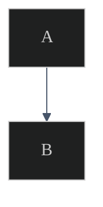

# CorreaX Mermaid Theme Snippet

> **Source**: DK §12 · Use this init block at the top of every Mermaid diagram in Alex documentation.
> **Copy** the `%%{init}%%` block and place it as the first line inside every ` ```mermaid ` code fence.

---

## Usage

````markdown

````

---

## Theme Variables Reference

| Variable | Value | Role |
|----------|-------|------|
| `background` | `#0f172a` | Diagram canvas (CorreaX dark bg) |
| `primaryColor` | `#1e293b` | Node fill |
| `primaryTextColor` | `#f1f5f9` | Node label text |
| `primaryBorderColor` | `#818cf8` | Node border (indigo) |
| `lineColor` | `#475569` | Edge / connector color |
| `secondaryColor` | `#1e293b` | Secondary node fill |
| `secondaryBorderColor` | `#2dd4bf` | Secondary node border (teal) |
| `tertiaryColor` | `#1e293b` | Tertiary node fill |
| `fontFamily` | `Segoe UI, system-ui, sans-serif` | Diagram text font |

---

## Compact One-Liner (for tight spaces)

```
%%{init:{'theme':'dark','themeVariables':{'background':'#0f172a','primaryColor':'#1e293b','primaryTextColor':'#f1f5f9','primaryBorderColor':'#818cf8','lineColor':'#475569','secondaryColor':'#1e293b','secondaryBorderColor':'#2dd4bf','tertiaryColor':'#1e293b','fontFamily':'Segoe UI, system-ui, sans-serif'}}}%%
```
