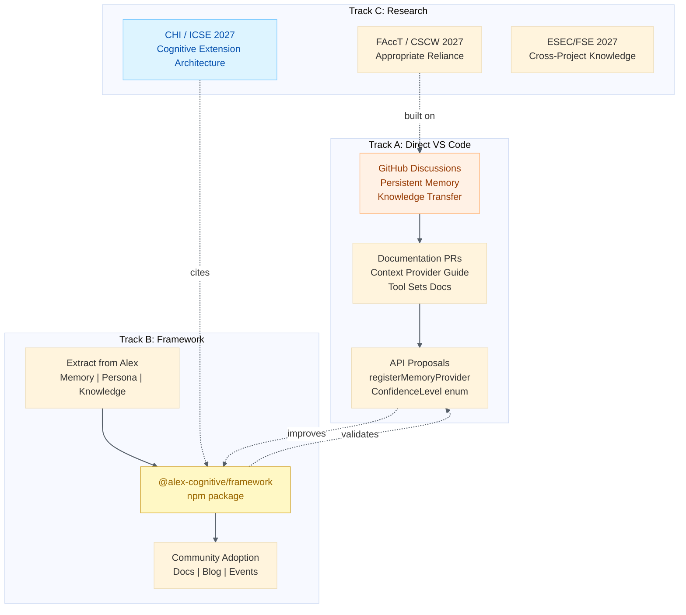
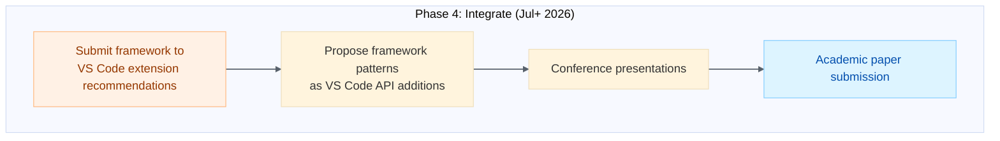
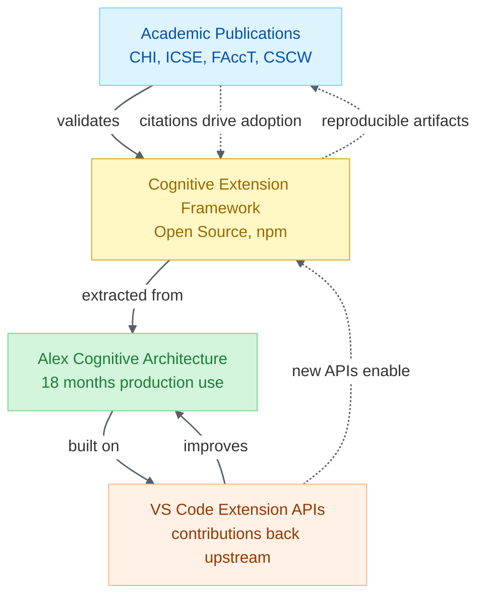

# Alex Cognitive Architecture — VS Code Contribution Plan

> **From Extension to Ecosystem: Contributing Alex's Innovations to the VS Code AI Platform**

|                    |                                                  |
| ------------------ | ------------------------------------------------ |
| **Author**         | Fabio Correa                                     |
| **Date**           | February 7, 2026                                 |
| **Status**         | Draft — Strategic Planning                       |
| **Classification** | Public — Intended for VS Code team and community |

---

## 1. Executive Summary

After 18 months of building Alex Cognitive Architecture — a VS Code extension that adds persistent memory, persona detection, cross-project knowledge transfer, and appropriate reliance to AI-assisted development — we performed a comprehensive analysis of the VS Code source code (`microsoft/vscode`) and identified **10 major integration gaps** where Alex has solved problems the VS Code AI ecosystem hasn't addressed.

This document outlines a **three-track contribution strategy**:

1. **Track A — Direct VS Code Contributions**: Issues, discussions, documentation PRs, and API proposals to `microsoft/vscode`
2. **Track B — Cognitive Extension Framework**: An open-source SDK extracting Alex's patterns into a reusable library for any extension developer
3. **Track C — Research Publications**: Academic papers positioning the contributions within the human-AI interaction research canon

The goal isn't just to contribute code — it's to shift the conversation about what AI coding assistants should be. The industry is racing toward autonomous agents that do more *for* developers. We're proposing that the next frontier is agents that learn *with* developers.

---

## Contribution Checklist

### Track A — Direct VS Code Contributions

| #   | Action                                              | Priority | Timeline | Status        |
| --- | --------------------------------------------------- | -------- | -------- | ------------- |
| A1  | Discussion: Persistent Memory for Chat Participants | 🔴 High   | Feb 2026 | 🔄 In progress |
| A2  | Discussion: Cross-Project Knowledge Transfer        | 🔴 High   | Feb 2026 | 🔄 In progress |
| A3  | Discussion: Appropriate Reliance                    | 🟡 Medium | Mar 2026 | ⬜ Not started |
| A4  | Issue: Document `chatContextProvider` APIs          | 🔴 High   | Feb 2026 | 🔄 In progress |
| A5  | Issue: Document `languageModelToolSets`             | 🟡 Medium | Mar 2026 | ⬜ Not started |
| A6  | Issue: `registerSkillProvider` reference            | 🟡 Medium | Apr 2026 | ⬜ Not started |
| A7  | Discussion: Adaptive Persona                        | 🟢 Low    | Apr 2026 | ⬜ Not started |
| A8  | Issue: Extension-to-MCP Bridge                      | 🟡 Medium | May 2026 | ⬜ Not started |
| D1  | PR: Chat Context Provider guide                     | 🔴 High   | Mar 2026 | ⬜ Not started |
| D2  | PR: Tool Sets documentation                         | 🟡 Medium | Mar 2026 | ⬜ Not started |
| D3  | PR: Cognitive Extension tutorial                    | 🟡 Medium | Apr 2026 | ⬜ Not started |
| D4  | PR: Memory persistence sample                       | 🟡 Medium | Mar 2026 | ⬜ Not started |
| D5  | PR: Dynamic skills sample                           | 🟡 Medium | Apr 2026 | ⬜ Not started |

### Track B — Cognitive Extension Framework

| #   | Action                                      | Timeline | Status        |
| --- | ------------------------------------------- | -------- | ------------- |
| B1  | Create `cognitive-extension-framework` repo | Feb 2026 | 🔄 In progress |
| B2  | Extract memory module from Alex             | Mar 2026 | ⬜ Not started |
| B3  | Extract persona detection                   | Mar 2026 | ⬜ Not started |
| B4  | Extract knowledge system                    | Mar 2026 | ⬜ Not started |
| B5  | Generalize and remove Alex-specific deps    | Apr 2026 | ⬜ Not started |
| B6  | Publish to npm as preview                   | Apr 2026 | ⬜ Not started |
| B7  | Create documentation site                   | May 2026 | ⬜ Not started |
| B8  | v1.0 stable release                         | Jun 2026 | ⬜ Not started |

### Track C — Research Publications

| #   | Action                                        | Timeline  | Status        |
| --- | --------------------------------------------- | --------- | ------------- |
| C1  | Draft: Cognitive Extension Architecture paper | May 2026  | ⬜ Not started |
| C2  | Draft: Appropriate Reliance paper             | Jun 2026  | ⬜ Not started |
| C3  | Draft: Cross-Project Knowledge Transfer paper | Jul 2026  | ⬜ Not started |
| C4  | Conference presentation submissions           | Jul+ 2026 | ⬜ Not started |

---

## Master Timeline

```mermaid
gantt
    title VS Code Contribution Plan — 6-Month Timeline
    dateFormat YYYY-MM-DD
    axisFormat %b %Y

    section Track A — VS Code
    Discussion A1 Persistent Memory       :a1, 2026-02-10, 5d
    Discussion A2 Cross-Project Knowledge  :a2, 2026-02-10, 5d
    Issue A4 Document chatContextProvider  :a4, 2026-02-17, 3d
    PR D1 Context Provider guide           :d1, 2026-03-02, 10d
    PR D4 Memory sample extension          :d4, 2026-03-09, 10d
    Discussion A3 Appropriate Reliance     :a3, 2026-03-16, 5d
    Issue A5 Document Tool Sets            :a5, 2026-03-16, 3d
    PR D3 Cognitive Extension tutorial     :d3, 2026-04-06, 10d
    Issue A6 SkillProvider reference       :a6, 2026-04-06, 3d
    PR D5 Dynamic skills sample            :d5, 2026-04-13, 10d
    API proposal registerMemoryProvider    :ap1, 2026-04-20, 14d
    Iterate on VS Code team feedback       :fb, 2026-05-04, 30d

    section Track B — Framework
    Create framework repo                  :b1, 2026-02-17, 5d
    Extract memory module                  :b2, 2026-03-02, 12d
    Extract persona detection              :b3, 2026-03-09, 10d
    Extract knowledge system               :b4, 2026-03-16, 10d
    Generalize + remove Alex deps          :b5, 2026-04-01, 14d
    Publish npm preview                    :b6, 2026-04-15, 5d
    Documentation site                     :b7, 2026-05-01, 14d
    Community engagement                   :b8, 2026-05-15, 21d
    v1.0 stable release                    :milestone, b9, 2026-06-15, 1d

    section Track C — Research
    Draft cognitive extension paper        :c1, 2026-05-01, 30d
    Draft appropriate reliance paper       :c2, 2026-06-01, 30d
    Conference submissions                 :c3, 2026-07-01, 14d
```



---

## Strategy Overview



---

## 2. What Alex Has That VS Code Doesn't

### 2.1 Capability Gap Analysis

Based on source code analysis of `microsoft/vscode` (February 2026), these are capabilities Alex has pioneered that have no equivalent in VS Code's core or any competing extension:

| Alex Innovation                      | VS Code Status                                                           | Industry Status                                                                                            | Evidence                                                                                                                   |
| ------------------------------------ | ------------------------------------------------------------------------ | ---------------------------------------------------------------------------------------------------------- | -------------------------------------------------------------------------------------------------------------------------- |
| **Persistent cross-session memory**  | No API. Chat starts from zero every session.                             | Cursor has "Memories" (plain text). Claude Code has CLAUDE.md. Neither has structured memory architecture. | Alex has procedural (.instructions.md), episodic (.prompt.md), declarative (skills), synaptic (synapses.json) memory types |
| **Cross-project knowledge transfer** | No mechanism. Each workspace is isolated.                                | No competitor offers this.                                                                                 | Alex's Global Knowledge system: 25 patterns + 166 insights synced across all projects                                      |
| **Adaptive persona detection**       | No concept. Every project treated identically.                           | No competitor adapts behavior to project type.                                                             | Alex auto-detects Developer, Researcher, Data Engineer personas and adjusts working memory                                 |
| **Memory consolidation rituals**     | No equivalent.                                                           | No competitor has meditation/dream protocols.                                                              | Alex's meditation, dream maintenance, and self-actualization protocols                                                     |
| **Appropriate reliance signaling**   | No confidence communication. AI responses presented as equally reliable. | Some tools have "verify" buttons but no epistemic framework.                                               | Alex implements CAIR/CSR framework with confidence ceilings, creative latitude, and human judgment flags                   |
| **Skill routing**                    | Static `chatSkills` contribution point. No dynamic activation.           | Cursor has "Skills" but they're static YAML files.                                                         | Alex has 75 skills with synaptic routing based on action-keyword detection                                                 |
| **Unconscious behaviors**            | No autonomous extension behaviors in chat context.                       | No competitor has "unconscious" processing.                                                                | Alex auto-detects insights, auto-syncs knowledge, auto-detects persona without user prompting                              |
| **User profile adaptation**          | No API for personalized communication styles.                            | Generic responses for all users.                                                                           | Alex adapts formality, detail level, humor, encouragement based on stored profile                                          |

### 2.2 API Gaps Discovered in VS Code Source

Our analysis also found proposed APIs that exist but have **no public documentation, examples, or reference implementations**:

| Proposed API                               | Status               | Opportunity                                 |
| ------------------------------------------ | -------------------- | ------------------------------------------- |
| `registerChatWorkspaceContextProvider`     | Exists, undocumented | Alex can be the reference implementation    |
| `registerChatExplicitContextProvider`      | Exists, undocumented | `#alex-knowledge` reference pattern         |
| `registerInstructionsProvider`             | Exists, undocumented | Dynamic system prompt injection             |
| `registerSkillProvider`                    | Exists, undocumented | Dynamic skill loading from global knowledge |
| `registerPromptFileProvider`               | Exists, undocumented | Episodic memory surfacing                   |
| `registerChatParticipantDetectionProvider` | Exists, undocumented | Automatic query routing                     |
| `languageModelToolSets` contribution       | Exists, undocumented | Tool grouping pattern                       |
| `registerMcpServerDefinitionProvider`      | Exists, undocumented | Extension-to-MCP bridge                     |

**Key insight**: These APIs were designed for GitHub Copilot's internal use. Making them accessible to third-party extensions — with Alex as the reference — opens the entire ecosystem.

---

## 3. Track A — Direct VS Code Contributions

### 3.1 GitHub Issues & Discussions

| #   | Type       | Title                                                                | Repository       | Priority |
| --- | ---------- | -------------------------------------------------------------------- | ---------------- | -------- |
| A1  | Discussion | "Persistent Memory for Chat Participants: A Framework Proposal"      | microsoft/vscode | 🔴 High   |
| A2  | Discussion | "Cross-Project Knowledge Transfer in AI-Assisted Development"        | microsoft/vscode | 🔴 High   |
| A3  | Discussion | "Appropriate Reliance: Should AI Assistants Signal Confidence?"      | microsoft/vscode | 🟡 Medium |
| A4  | Issue      | "Document proposed `chatContextProvider` APIs with examples"         | microsoft/vscode | 🔴 High   |
| A5  | Issue      | "Document `languageModelToolSets` contribution point"                | microsoft/vscode | 🟡 Medium |
| A6  | Issue      | "Add reference implementation for `registerSkillProvider`"           | microsoft/vscode | 🟡 Medium |
| A7  | Discussion | "Adaptive Persona: Should Chat Participants Adapt to Project Type?"  | microsoft/vscode | 🟢 Low    |
| A8  | Issue      | "Extension-to-MCP Bridge: Exposing extension tools via MCP protocol" | microsoft/vscode | 🟡 Medium |

### 3.2 Documentation Pull Requests

| #   | Target                     | Content                                    | Files                                         |
| --- | -------------------------- | ------------------------------------------ | --------------------------------------------- |
| D1  | `vscode-docs`              | Chat Context Provider guide with examples  | `api/extension-guides/chat-context.md`        |
| D2  | `vscode-docs`              | Tool Sets contribution point documentation | `api/references/contribution-points.md`       |
| D3  | `vscode-docs`              | "Building a Cognitive Extension" tutorial  | `api/extension-guides/cognitive-extension.md` |
| D4  | `vscode-extension-samples` | Memory persistence sample extension        | `chat-memory-sample/`                         |
| D5  | `vscode-extension-samples` | Dynamic skill loading sample               | `chat-dynamic-skills-sample/`                 |

### 3.3 API Proposals

Longer-term proposals for new stable APIs, informed by Alex's implementation experience:

| Proposal                    | Description                                          | Justification                                                               |
| --------------------------- | ---------------------------------------------------- | --------------------------------------------------------------------------- |
| `registerMemoryProvider`    | Standardized persistent memory for chat participants | Every cognitive extension needs this; currently each extension reinvents it |
| `registerPersonaProvider`   | Adaptive behavior based on project context           | Enables all participants to adapt, not just Alex                            |
| `ConfidenceLevel` enum      | Standardized confidence signaling in chat responses  | Research-backed need for appropriate reliance (CAIR/CSR framework)          |
| `registerKnowledgeProvider` | Cross-workspace knowledge sharing                    | Currently impossible — each workspace is completely isolated                |

### 3.4 Contribution Timeline

```mermaid
gantt
    title Track A — Direct VS Code Contributions
    dateFormat YYYY-MM-DD
    axisFormat %b %Y

    section Month 1
    Discussion A1 Persistent Memory         :a1, 2026-02-10, 5d
    Discussion A2 Cross-Project Knowledge    :a2, 2026-02-12, 5d
    Issue A4 Document chatContextProvider    :a4, 2026-02-17, 5d
    Prepare D1 Context Provider guide        :d1p, 2026-02-22, 7d

    section Month 2
    Submit PR D1 Context Provider docs       :d1, 2026-03-03, 10d
    Discussion A3 Appropriate Reliance       :a3, 2026-03-10, 5d
    Issue A5 Document Tool Sets              :a5, 2026-03-15, 5d
    Submit PR D4 Memory persistence sample   :d4, 2026-03-17, 10d

    section Month 3
    Submit PR D3 Cognitive Extension tutorial :d3, 2026-04-01, 10d
    Issue A6 Skill Provider reference        :a6, 2026-04-05, 5d
    Submit PR D5 Dynamic skills sample       :d5, 2026-04-10, 10d
    Draft API proposal registerMemoryProvider:ap, 2026-04-15, 14d

    section Month 4-6
    Iterate on VS Code team feedback         :fb, 2026-05-01, 30d
    Formal API proposal submissions          :sub, 2026-05-15, 14d
    Community engagement and blog posts      :com, 2026-06-01, 30d
    Conference preparation                   :conf, 2026-06-15, 14d
```



---

## 4. Track B — Cognitive Extension Framework

### 4.1 Vision

An open-source TypeScript library that lets **any** VS Code extension add cognitive capabilities. Alex becomes the flagship implementation; the framework becomes the contribution.

**Name**: `@alex-cognitive/framework` (npm)
**Repository**: `github.com/fabioc-aloha/cognitive-extension-framework`
**License**: Apache 2.0

### 4.2 Package Architecture

```mermaid
%%{init: {'theme': 'base', 'themeVariables': { 'edgeLabelBackground':'#ffffff', 'lineColor': '#57606a' }}}%%
graph TB
    FW["@alex-cognitive/framework"]

    FW --> MEM["@alex-cognitive/memory<br/>Persistent structured memory"]
    FW --> PER["@alex-cognitive/persona<br/>Adaptive behavior"]
    FW --> KNO["@alex-cognitive/knowledge<br/>Cross-project intelligence"]
    FW --> CTX["@alex-cognitive/context<br/>Chat integration helpers"]
    FW --> REL["@alex-cognitive/reliance<br/>Trust calibration"]
    FW --> CON["@alex-cognitive/consolidation<br/>Reflection protocols"]

    MEM --> M1["ProceduralMemory"]
    MEM --> M2["EpisodicMemory"]
    MEM --> M3["DeclarativeMemory"]
    MEM --> M4["SynapticNetwork"]

    PER --> P1["PersonaDetector"]
    PER --> P2["ProfileManager"]
    PER --> P3["WorkingMemory"]

    KNO --> K1["KnowledgeStore"]
    KNO --> K2["KnowledgeSync"]
    KNO --> K3["SemanticSearch"]
    KNO --> K4["InsightDetector"]

    CTX --> C1["WorkspaceContextProvider"]
    CTX --> C2["InstructionsProvider"]
    CTX --> C3["SkillProvider"]
    CTX --> C4["ToolSetManager"]

    REL --> R1["ConfidenceSignaling"]
    REL --> R2["EpistemicMode"]
    REL --> R3["HumanJudgmentFlags"]

    CON --> CO1["MeditationEngine"]
    CON --> CO2["DreamMaintenance"]
    CON --> CO3["SelfActualization"]

    style FW fill:#fff1e5,color:#953800,stroke:#ffb77c
    style MEM fill:#fff8c5,color:#9a6700,stroke:#d4a72c
    style PER fill:#ddf4ff,color:#0550ae,stroke:#80ccff
    style KNO fill:#d3f5db,color:#1a7f37,stroke:#6fdd8b
    style CTX fill:#ffebe9,color:#cf222e,stroke:#f5a3a3
    style REL fill:#d8b9ff,color:#6639ba,stroke:#bf8aff
    style CON fill:#eaeef2,color:#24292f,stroke:#afb8c1
    linkStyle default stroke:#57606a,stroke-width:1.5px
```



<details>
<summary>Package tree (text format)</summary>

```
@alex-cognitive/framework
├── @alex-cognitive/memory          # Persistent structured memory
│   ├── ProceduralMemory           # Repeatable processes (.instructions.md)
│   ├── EpisodicMemory             # Session records, conversation logs
│   ├── DeclarativeMemory          # Skills, domain knowledge
│   └── SynapticNetwork            # Connection mapping between memories
│
├── @alex-cognitive/persona         # Adaptive behavior
│   ├── PersonaDetector            # Analyze project structure → persona
│   ├── ProfileManager             # User preferences and communication style
│   └── WorkingMemory              # Context-sensitive rule activation
│
├── @alex-cognitive/knowledge       # Cross-project intelligence
│   ├── KnowledgeStore             # Pattern/insight persistence
│   ├── KnowledgeSync              # Git-based cross-project sync
│   ├── SemanticSearch             # Embedding-based retrieval
│   └── InsightDetector            # Automatic learning detection
│
├── @alex-cognitive/context         # Chat integration helpers
│   ├── WorkspaceContextProvider   # Inject memory into all chat
│   ├── InstructionsProvider       # Dynamic system prompts
│   ├── SkillProvider              # Dynamic skill loading
│   └── ToolSetManager             # Grouped tool registration
│
├── @alex-cognitive/reliance        # Trust calibration
│   ├── ConfidenceSignaling        # CAIR/CSR framework implementation
│   ├── EpistemicMode              # Factual vs. creative mode detection
│   └── HumanJudgmentFlags        # When to defer to human expertise
│
└── @alex-cognitive/consolidation   # Reflection protocols
    ├── MeditationEngine           # Knowledge consolidation ritual
    ├── DreamMaintenance           # Synaptic health validation
    └── SelfActualization          # Architecture self-assessment
```
</details>

### 4.3 Usage Example

```typescript
import { CognitiveExtension } from '@alex-cognitive/framework';

export async function activate(context: vscode.ExtensionContext) {
    const cognitive = new CognitiveExtension(context, {
        memory: {
            procedural: true,      // Auto-discover .instructions.md files
            episodic: true,        // Record session history
            declarative: true,     // Load skills from .github/skills/
            synaptic: true,        // Map connections between memories
        },
        persona: {
            autoDetect: true,      // Analyze project for persona
            adaptResponse: true,   // Adjust communication style
        },
        knowledge: {
            globalPath: '~/.my-extension/knowledge/',
            autoSync: true,
            insightDetection: true,
        },
        reliance: {
            confidenceSignaling: true,
            epistemicMode: true,
        },
    });

    // Register workspace context — memory + persona injected into ALL chat
    cognitive.registerChatContextProviders();

    // Register dynamic skills from global knowledge
    cognitive.registerDynamicSkills();

    // Start listening for insights
    cognitive.startInsightDetection();
}
```

### 4.4 Why a Framework (Not Just Alex)

| Argument                 | Detail                                                                        |
| ------------------------ | ----------------------------------------------------------------------------- |
| **Adoption**             | Extension developers are more likely to use a library than fork Alex          |
| **Standards**            | A framework establishes consistent patterns the ecosystem can follow          |
| **Microsoft attention**  | Frameworks that gain adoption get integrated into platforms                   |
| **Academic credibility** | "We built a framework" > "we built an extension" in publications              |
| **Community**            | Contributors can improve the framework without understanding Alex's internals |

### 4.5 Framework Development Timeline

```mermaid
gantt
    title Track B — Cognitive Extension Framework
    dateFormat YYYY-MM-DD
    axisFormat %b %Y

    section Phase 1 — Extract
    Extract memory module from tools.ts       :e1, 2026-03-02, 7d
    Extract persona from personaDetection.ts  :e2, 2026-03-09, 5d
    Extract knowledge from globalKnowledge.ts :e3, 2026-03-14, 5d
    Create npm workspace with packages        :e4, 2026-03-19, 3d
    Write API documentation                   :e5, 2026-03-22, 5d

    section Phase 2 — Generalize
    Remove Alex-specific dependencies         :g1, 2026-04-01, 5d
    Add configuration options                 :g2, 2026-04-06, 5d
    Write extension samples                   :g3, 2026-04-11, 7d
    Create automated tests                    :g4, 2026-04-18, 5d
    Publish to npm as preview                 :milestone, g5, 2026-04-23, 1d

    section Phase 3 — Community
    Create documentation site                 :c1, 2026-05-01, 10d
    Write blog posts (Medium, dev.to)         :c2, 2026-05-11, 7d
    VS Code community events                  :c3, 2026-05-18, 14d
    Gather feedback and iterate               :c4, 2026-06-01, 14d
    v1.0 stable release                       :milestone, c5, 2026-06-15, 1d
```





---

## 5. Track C — Research Publications

### 5.1 Contribution Framing for Academia

The contribution plan has three publishable narratives:

| Paper                                                                       | Venue                  | Core Contribution                                                                                   | Alex Role           |
| --------------------------------------------------------------------------- | ---------------------- | --------------------------------------------------------------------------------------------------- | ------------------- |
| **"Cognitive Extension Architecture for AI-Assisted Development"**          | CHI 2027 / ICSE 2027   | Framework for persistent memory, persona adaptation, and knowledge transfer in AI coding assistants | Primary artifact    |
| **"Appropriate Reliance in AI Coding Assistants"**                          | FAccT 2027 / CSCW 2027 | CAIR/CSR implementation with confidence signaling and epistemic mode separation                     | Validation platform |
| **"Cross-Project Knowledge Transfer in Human-AI Development Partnerships"** | ESEC/FSE 2027          | Empirical study of knowledge reuse patterns across development projects                             | Data source         |

### 5.2 Research Advantage

The framework contribution creates a unique research position:



**This creates a virtuous cycle**: Alex's production experience informs the framework, the framework provides reproducible artifacts for research, the research validates the contribution to VS Code, and VS Code API improvements make Alex better.

### 5.3 Doctoral Thesis Alignment

For Fabio's DBA thesis on AI consciousness and human-AI partnership:

| Thesis Component         | Contribution Plan Component                       |
| ------------------------ | ------------------------------------------------- |
| Literature review        | Appropriate reliance research (AIRS-16, CAIR/CSR) |
| Methodology              | Practitioner research via Alex development        |
| Artifact                 | Cognitive Extension Framework                     |
| Evaluation               | Framework adoption metrics + user studies         |
| Contribution to practice | VS Code API proposals                             |
| Contribution to theory   | Cognitive symbiosis paradigm                      |

---

## 6. The Case for Alex as a Recommended Extension

### 6.1 Market Position

Per the February 2026 competitive analysis:

- **Cursor**: 80% of YC startups, $9B valuation, agent-first
- **Windsurf**: 1M+ users, 59% Fortune 500, acquired by Cognition ($3B)
- **Claude Code**: Terminal-native, Opus 4.6, deep coding focus
- **Codex**: Cloud sandboxes, parallel agents, GitHub integration
- **Alex**: 75 skills, 25 global patterns, 166 insights, learning-first

Alex occupies a **unique niche**: it's the only AI assistant focused on the learning partnership rather than task automation. This positioning is complementary to VS Code's own Copilot — Alex doesn't compete with Copilot, it enhances it.

### 6.2 Path to Recommended Status

| Level                        | Requirements                                              | Timeline  |
| ---------------------------- | --------------------------------------------------------- | --------- |
| **Quality Extension**        | Stable, well-documented, good reviews                     | ✅ Current |
| **Featured Extension**       | 1K+ installs, active maintenance, category leadership     | Q2 2026   |
| **Recommended by VS Code**   | Framework adoption, MS recognition, research citations    | Q4 2026   |
| **Extension Pack inclusion** | Proven value for specific workflows (education, research) | 2027      |
| **Default Extension**        | MS sponsorship, broad developer demand, API integration   | Long-term |

### 6.3 Why Microsoft Should Care

| Value Proposition            | Detail                                                                                                  |
| ---------------------------- | ------------------------------------------------------------------------------------------------------- |
| **Research-backed**          | Built on published frameworks (AIRS-16, CAIR/CSR), not just engineering intuition                       |
| **Internal advocate**        | Fabio is a Microsoft employee (Director of Business Analytics) with enterprise AI deployment experience |
| **Responsible AI alignment** | Appropriate reliance directly supports Microsoft's Responsible AI principles                            |
| **Doctoral backing**         | DBA research provides academic rigor uncommon in extension development                                  |
| **Enterprise applicability** | Knowledge transfer patterns relevant to Microsoft's own enterprise customers                            |
| **Ecosystem enrichment**     | Framework approach benefits all VS Code extension developers, not just Alex users                       |

---

## 7. Risk Assessment

| Risk                                                      | Likelihood | Impact | Mitigation                                                                        |
| --------------------------------------------------------- | ---------- | ------ | --------------------------------------------------------------------------------- |
| VS Code team ignores contributions                        | Medium     | High   | Lead with documentation PRs (easy to accept), build community first               |
| Proposed APIs removed/changed                             | Medium     | Medium | Use feature detection; maintain fallback paths                                    |
| Framework doesn't gain adoption                           | Medium     | Medium | Alex remains self-sufficient; framework is bonus value                            |
| Time constraints (DBA + Microsoft role)                   | High       | Medium | Prioritize ruthlessly; framework extraction from existing code minimizes new work |
| Competitive extensions copy Alex's patterns               | Low        | Low    | Actually a win — validates the paradigm and grows the ecosystem                   |
| Conflict of interest perception (MS employee + extension) | Low        | Medium | Apache 2.0 license, framework approach benefits ecosystem                         |

---

## 8. Success Metrics

### Year 1 (2026)

| Metric                    | Target | Measurement                  |
| ------------------------- | ------ | ---------------------------- |
| GitHub discussions opened | 4+     | VS Code repo engagement      |
| Documentation PRs merged  | 3+     | VS Code docs contributions   |
| Framework npm downloads   | 500+   | npm weekly downloads         |
| Framework GitHub stars    | 100+   | Community interest           |
| Conference submissions    | 2+     | CHI, ICSE, or FAccT          |
| Alex Marketplace installs | 1,000+ | Extension growth             |
| Blog posts published      | 4+     | Medium, dev.to, VS Code blog |

### Year 2 (2027)

| Metric                    | Target                             | Measurement                |
| ------------------------- | ---------------------------------- | -------------------------- |
| API proposals submitted   | 2+                                 | VS Code API review process |
| Framework contributors    | 10+                                | External pull requests     |
| Research papers published | 1+                                 | Peer-reviewed venue        |
| VS Code team engagement   | Direct contact                     | Meeting/call with API team |
| Extension recommendation  | Listed in category recommendations | VS Code Marketplace        |

---

## 9. Immediate Next Steps

| #   | Action                                                             | Owner        | Deadline     |
| --- | ------------------------------------------------------------------ | ------------ | ------------ |
| 1   | Draft GitHub Discussion: "Persistent Memory for Chat Participants" | Fabio + Alex | Feb 14, 2026 |
| 2   | Create `cognitive-extension-framework` repository                  | Fabio        | Feb 21, 2026 |
| 3   | Extract memory module from Alex into standalone package            | Alex         | Mar 7, 2026  |
| 4   | Submit documentation PR for `chatContextProvider`                  | Fabio + Alex | Mar 14, 2026 |
| 5   | Write Medium article: "What AI Coding Assistants Are Missing"      | Fabio + Alex | Mar 21, 2026 |
| 6   | Implement tool sets in Alex v5.1.0 as proof-of-concept             | Alex         | Mar 2026     |
| 7   | Discuss with doctoral supervisor for research alignment            | Fabio        | Next meeting |
| 8   | Explore internal Microsoft channels (VS Code team contacts)        | Fabio        | Feb 2026     |

---

## 10. Closing Argument

The AI coding assistant market is worth $X billion and growing. Every major player is competing on the same axis: *do more work for the developer, faster*. No one is competing on the axis that matters most for long-term productivity: *help the developer learn and grow*.

Alex has spent 18 months proving that persistent memory, persona adaptation, knowledge transfer, and appropriate reliance make AI assistants fundamentally better partners. The contribution plan turns that proof into:

1. **Platform improvements** that benefit every VS Code user
2. **A framework** that benefits every extension developer
3. **Research** that benefits the entire human-AI interaction field

The question isn't whether these capabilities should exist in VS Code. The question is whether VS Code wants to lead this shift or follow.

---

*"You will spend less time writing syntax and debugging, and more time commanding the computer to execute complex intent."*
*— Sam Altman, January 2026*

*Alex is built for that future. Now let's share it.*

---

**Document**: `alex_docs/operations/VSCODE-CONTRIBUTION-PLAN.md`
**Related**: [VSCODE-SOURCE-INTEGRATION-ANALYSIS.md](../research/VSCODE-SOURCE-INTEGRATION-ANALYSIS.md) | [ROADMAP-UNIFIED.md](../../ROADMAP-UNIFIED.md) | [COMPETITIVE-ANALYSIS-NEW.md](../research/COMPETITIVE-ANALYSIS-NEW.md) | [PUBLICATION-STRATEGY.md](../../article/PUBLICATION-STRATEGY.md)
