# VS Code GitHub Copilot API & Feature Analysis

> **Complete inventory of every VS Code API Alex uses, mapped to VS Code source code internals**

|                    |                                                                                                                                            |
| ------------------ | ------------------------------------------------------------------------------------------------------------------------------------------ |
| **Author**         | Fabio Correa                                                                                                                               |
| **Date**           | February 7, 2026                                                                                                                           |
| **Extension**      | `fabioc-aloha.alex-cognitive-architecture` v5.0.0                                                                                          |
| **VS Code Engine** | `^1.109.0`                                                                                                                                 |
| **Proposed APIs**  | None (Marketplace-safe)                                                                                                                    |
| **Related**        | [VSCODE-SOURCE-INTEGRATION-ANALYSIS.md](VSCODE-SOURCE-INTEGRATION-ANALYSIS.md), [VSCODE-CONTRIBUTION-PLAN.md](VSCODE-CONTRIBUTION-PLAN.md) |

---

## Table of Contents

0. [Proposed Opportunity Implementation Plan](#proposed-opportunity-implementation-plan)
1. [Summary Dashboard](#1-summary-dashboard)
2. [Chat Participant API](#2-chat-participant-api)
3. [Language Model Tools API](#3-language-model-tools-api)
4. [Chat Skills Contribution Point](#4-chat-skills-contribution-point)
5. [Language Model API](#5-language-model-api)
6. [Chat Response Stream API](#6-chat-response-stream-api)
7. [Authentication API](#7-authentication-api)
8. [WebView & UI APIs](#8-webview--ui-apis)
9. [Workspace & File System APIs](#9-workspace--file-system-apis)
10. [Command System](#10-command-system)
11. [Configuration API](#11-configuration-api)
12. [Activation & Lifecycle](#12-activation--lifecycle)
13. [Source Code Insights](#13-source-code-insights)
14. [Enhancement Opportunities](#14-enhancement-opportunities)
15. [API Stability Assessment](#15-api-stability-assessment)

---

## Proposed Opportunity Implementation Plan

### Enhancement Checklist

| #   | Enhancement                                   | Impact       | Effort        | API Status | Phase   | Status        |
| --- | --------------------------------------------- | ------------ | ------------- | ---------- | ------- | ------------- |
| 1   | Declare undeclared tools in `package.json`    | 🟡 MEDIUM     | Trivial       | Stable     | v5.0.x  | ✅ Done        |
| 2   | Add `tags` to tools                           | 🟡 MEDIUM     | Low           | Stable     | v5.0.x  | ✅ Done        |
| 3   | Add `when` clauses to slash commands          | 🟡 MEDIUM     | Low           | Stable     | v5.1.0  | 🔄 In progress |
| 4   | Enable skill adherence prompt                 | 🟢 LOW-MEDIUM | Config change | Stable     | v5.1.0  | 🔄 In progress |
| 5   | Use `disableModelInvocation` for niche skills | 🟡 MEDIUM     | Low           | Stable     | v5.1.0  | 🔄 In progress |
| 6   | Add command disambiguation examples           | 🟡 MEDIUM     | Low           | Stable     | v5.0.x  | ✅ Done        |
| 7   | Use `sampleRequest` on slash commands         | 🟢 LOW        | Trivial       | Stable     | v5.0.x  | ✅ Done        |
| 8   | Add Walkthrough steps for premium features    | 🔴 HIGH       | Medium        | Stable     | v5.1.0  | 🔄 In progress |
| 9   | Tool progress during Dream/Meditation         | 🟡 MEDIUM     | Low           | Proposed   | v5.2.0+ | ⬜ Blocked     |
| 10  | Token usage tracking                          | 🟡 MEDIUM     | Medium        | Proposed   | v5.2.0+ | ⬜ Blocked     |
| 11  | Tool Sets grouping                            | 🔴 HIGH       | Low           | Proposed   | v5.2.0+ | ⬜ Blocked     |
| 12  | Next question suggestion                      | 🟡 MEDIUM     | Low           | Proposed   | v5.2.0+ | ⬜ Blocked     |
| 13  | Tool streaming                                | 🟡 MEDIUM     | Medium        | Proposed   | v5.2.0+ | ⬜ Blocked     |

> **8 of 13 enhancements use stable APIs and can ship immediately.** The remaining 5 require proposed APIs that are blocked for Marketplace publication — track them for future graduation.

### Implementation Timeline

```mermaid
gantt
    title API Enhancement Roadmap
    dateFormat YYYY-MM-DD
    axisFormat %b %Y

    section Patch — v5.0.1 (Quick Wins)
    Declare 2 undeclared tools in package.json  :s1, 2026-02-10, 1d
    Add tags to all 13 tools                    :s2, after s1, 1d
    Add sampleRequest to slash commands         :s3, after s1, 1d
    Enable skill adherence prompt               :s4, after s3, 1d
    Mark niche skills as manual-only            :s5, after s4, 2d
    Add when clauses to slash commands          :s6, after s5, 2d

    section Minor — v5.1.0
    Add disambiguation examples                 :s7, 2026-02-24, 3d
    Design walkthrough flow                     :s8a, after s7, 3d
    Implement walkthrough steps                 :s8b, after s8a, 5d
    Test and polish                             :s8c, after s8b, 3d

    section Track — v5.2.0+ (When APIs Graduate)
    Tool Sets grouping (13 → 3 sets)            :crit, t1, 2026-04-01, 3d
    Tool progress for Dream/Meditation          :t2, after t1, 3d
    Tool streaming for long operations          :t3, after t2, 5d
    Token usage tracking                        :t4, after t3, 3d
    Next question suggestion                    :t5, after t4, 2d
```



### Enhancement Architecture


---

## 1. Summary Dashboard

| Category             | Count | Alex Uses                                | Source Location                                  |
| -------------------- | :---: | ---------------------------------------- | ------------------------------------------------ |
| Chat Participants    |   1   | `alex.cognitive`                         | `participant.ts`                                 |
| Slash Commands       |  27   | `/meditate`, `/dream`, `/learn`, etc.    | `participant.ts`                                 |
| Language Model Tools |  13   | Cognitive tools + global knowledge       | `tools.ts`, `globalKnowledge.ts`, `cloudSync.ts` |
| Chat Skills          |  53   | Domain expertise via `.github/skills/`   | `package.json` contribution                      |
| VS Code Commands     |  44   | Initialize, Dream, Upgrade, etc.         | `extension.ts`                                   |
| Configuration Keys   |   8   | Protected mode, auto-insights, etc.      | `package.json` contribution                      |
| WebView Panels       |   4   | Health dashboard, Memory, Welcome, Audio | Various `views/` files                           |
| WebView Views        |   1   | Activity bar sidebar                     | `welcomeView.ts`                                 |
| Source Files         |  ~25  | TypeScript modules                       | `src/` directory                                 |
| Runtime Dependencies |   3   | `fs-extra`, `proper-lockfile`, `ws`      | `package.json`                                   |

---

## 2. Chat Participant API

### What Alex Declares

```jsonc
// package.json → contributes.chatParticipants
{
  "id": "alex.cognitive",
  "name": "alex",
  "fullName": "Alex Cognitive",
  "isSticky": true,
  "disambiguation": [
    { "category": "cognitive_architecture", ... },
    { "category": "azure_development", ... },
    { "category": "m365_development", ... },
    { "category": "epistemic", ... }
  ],
  "commands": [ /* 27 slash commands */ ]
}
```

### How Alex Uses It

| API                                    | File                  | Usage                                                                 |
| -------------------------------------- | --------------------- | --------------------------------------------------------------------- |
| `vscode.chat.createChatParticipant()`  | `participant.ts:2208` | Creates the `@alex` participant with handler function                 |
| `ChatRequestHandler`                   | `participant.ts:317`  | Main request handler dispatching to slash commands or general queries |
| `ChatRequest.command`                  | Throughout            | Slash command routing — 27 branches                                   |
| `ChatResponseStream.markdown()`        | Throughout            | Primary response output method                                        |
| `ChatResponseStream.progress()`        | Throughout            | Loading indicators ("Searching memory...", "Analyzing...")            |
| `ChatResponseStream.button()`          | Throughout            | Action buttons (open docs, run commands)                              |
| `ChatContext.history`                  | `participant.ts:841`  | Chat history for conversation continuity                              |
| `ChatRequestTurn` / `ChatResponseTurn` | `participant.ts:842`  | History turn parsing for context                                      |
| `ChatResult`                           | Return of handler     | Metadata returned to VS Code (e.g., command used)                     |
| `ChatResultFeedback`                   | `participant.ts:2217` | `onDidReceiveFeedback` — thumbs up/down tracking                      |
| `followupProvider`                     | `participant.ts:2210` | Suggests follow-up questions after responses                          |

### VS Code Source Code Analysis

**Registration Path**: `extHost.api.impl.ts:1590` → `extHostChatAgents2.ts:518` → `mainThreadChatAgents2.ts:165`

The participant flows through three layers:

```
Extension API                Extension Host              Main Thread
─────────────                ──────────────              ───────────
chat.createChatParticipant → ExtHostChatAgents2          MainThreadChatAgents2
                             .createChatAgent()    →     .$registerAgent()
                             creates ExtHostChatAgent    receives IChatAgentData
                                                         registers with ChatAgentService
```

**Key source insights:**

1. **Mandatory `package.json` declaration** (`mainThreadChatAgents2.ts:172-185`): VS Code enforces that `chatParticipant` MUST be declared in `package.json`. Extensions cannot register participants purely from code — if the ID isn't found in the contribution point, it throws: `"chatParticipant must be declared in package.json"`. Alex correctly does this.

2. **Name restrictions** (`chatParticipant.contribution.ts:224-239`): Names must match `/^[\w-]+$/`, fullName cannot contain ambiguous or invisible Unicode characters. Alex's name `"alex"` passes all checks.

3. **Name registry** (`chatAgents.ts:688-778`): VS Code maintains a `ChatAgentNameService` that fetches a participant name registry from `productService.chatParticipantRegistry` (a remote URL) every 5 minutes. This is a **restricted name list** — certain participant names may be reserved by Microsoft. Alex's name `"alex"` is currently not restricted.

4. **Disambiguation routing** (`chatParticipantContribTypes.ts:7-33`): The `disambiguation` array Alex declares (4 categories) feeds into VS Code's participant detection system. When a user types a message without `@alex`, VS Code can use these categories to route to the correct participant. Alex benefits from this for Azure and cognitive architecture queries.

5. **`isSticky: true`** means Alex persists as the active participant across messages — the user doesn't have to re-type `@alex` for each turn. This is set in the `metadata` field when registering the agent.

6. **Slash command `when` clauses** (`chatAgents.ts:299-326`): Individual slash commands can have `when` conditions that filter them based on context keys. Alex doesn't currently use `when` on commands — all 27 are always visible.

### Slash Commands (27)

| Command            | Purpose                                      | Category        |
| ------------------ | -------------------------------------------- | --------------- |
| `/meditate`        | Memory consolidation + session documentation | Core Cognitive  |
| `/dream`           | Neural maintenance + synapse validation      | Core Cognitive  |
| `/selfactualize`   | Deep architecture self-assessment            | Core Cognitive  |
| `/learn`           | Bootstrap learning protocol                  | Core Cognitive  |
| `/status`          | Architecture health overview                 | Diagnostics     |
| `/azure`           | Azure development assistance                 | Domain          |
| `/m365`            | M365 Copilot integration                     | Domain          |
| `/profile`         | User profile management                      | Personalization |
| `/knowledge`       | Global knowledge search                      | Knowledge Mgmt  |
| `/saveinsight`     | Save a learning to global knowledge          | Knowledge Mgmt  |
| `/promote`         | Promote project DK to global knowledge       | Knowledge Mgmt  |
| `/knowledgestatus` | Global knowledge base stats                  | Knowledge Mgmt  |
| `/sync`            | Cloud knowledge sync (merge)                 | Cloud           |
| `/push`            | Push knowledge to cloud                      | Cloud           |
| `/pull`            | Pull knowledge from cloud                    | Cloud           |
| `/docs`            | Open documentation                           | Help            |
| `/session`         | Learning session management                  | Session         |
| `/goals`           | Learning goal tracking                       | Session         |
| `/exportm365`      | Export memory for M365 Copilot               | Export          |
| `/help`            | Command reference                            | Help            |
| `/forget`          | Selective memory cleanup                     | Memory Mgmt     |
| `/confidence`      | Confidence-calibrated response               | Epistemic       |
| `/creative`        | Creative/divergent thinking mode             | Epistemic       |
| `/verify`          | Evidence verification mode                   | Epistemic       |

---

## 3. Language Model Tools API

### What Alex Declares

13 tools registered via `vscode.lm.registerTool()`. 11 declared in `package.json`, 2 registered only in code.

| #   | Tool ID                        | Reference Name        | Package.json? | Source               |
| --- | ------------------------------ | --------------------- | :-----------: | -------------------- |
| 1   | `alex_synapse_health`          | `synapse_health`      |      Yes      | `tools.ts`           |
| 2   | `alex_memory_search`           | `memory_search`       |      Yes      | `tools.ts`           |
| 3   | `alex_architecture_status`     | `architecture_status` |      Yes      | `tools.ts`           |
| 4   | `alex_mcp_recommendations`     | `mcp_recommendations` |      Yes      | `tools.ts`           |
| 5   | `alex_user_profile`            | `user_profile`        |      Yes      | `tools.ts`           |
| 6   | `alex_focus_context`           | —                     |      No       | `tools.ts`           |
| 7   | `alex_self_actualization`      | `self_actualization`  |      Yes      | `tools.ts`           |
| 8   | `alex_heir_validation`         | —                     |      No       | `tools.ts`           |
| 9   | `alex_global_knowledge_search` | `global_knowledge`    |      Yes      | `globalKnowledge.ts` |
| 10  | `alex_save_insight`            | `save_insight`        |      Yes      | `globalKnowledge.ts` |
| 11  | `alex_promote_knowledge`       | `promote_knowledge`   |      Yes      | `globalKnowledge.ts` |
| 12  | `alex_global_knowledge_status` | `knowledge_status`    |      Yes      | `globalKnowledge.ts` |
| 13  | `alex_cloud_sync`              | `cloud_sync`          |      Yes      | `cloudSync.ts`       |

### How Alex Uses It

| API                                | Usage                                                               |
| ---------------------------------- | ------------------------------------------------------------------- |
| `vscode.lm.registerTool(id, tool)` | Registers each tool implementation                                  |
| `LanguageModelTool<T>` interface   | All 13 tools implement `invoke()` and `prepareInvocation()`         |
| `LanguageModelToolResult`          | Return type — wraps `LanguageModelTextPart`                         |
| `LanguageModelTextPart`            | Text content within tool results                                    |
| `PreparedToolInvocation`           | Return from `prepareInvocation()` — includes `confirmationMessages` |

### VS Code Source Code Analysis

**Registration Path**: `extHostLanguageModelTools.ts:333` → `mainThreadLanguageModelTools.ts:87` → `languageModelToolsService.ts:247`

```
Extension API            Extension Host                    Main Thread
─────────────            ──────────────                    ───────────
lm.registerTool()  →     ExtHostLanguageModelTools         MainThreadLanguageModelTools
                         .registerTool()             →     .$registerTool()
                         stores in _registeredTools        registers with LanguageModelToolsService
                                                           .registerToolImplementation()
```

**Key source insights:**

1. **Tool data registration** (`languageModelToolsContribution.ts:42-71`): When Alex declares tools in `package.json`, VS Code generates activation events: `onLanguageModelTool:alex_synapse_health`, etc. This means Alex's extension host process only activates when a tool is actually invoked — improving startup time.

2. **Name restrictions** (`languageModelToolsContribution.ts:225-234`): Tool names starting with `copilot_` or `vscode_` are BLOCKED for non-Microsoft extensions. Alex correctly uses the `alex_` prefix. Tags with `copilot_` or `vscode_` prefixes are also blocked.

3. **Tool invocation flow** (`languageModelToolsService.ts:572-587`): When an LLM selects a tool:
   - VS Code checks if the tool's extension is activated via `activateByEvent`
   - If `prepareInvocation()` returns `confirmationMessages`, VS Code shows a confirmation UI to the user
   - User can Accept, Deny, or Skip the tool call
   - If Skipped, result is `"The user chose to skip the tool call"`
   - Alex uses this for `SynapseHealthTool` and `SelfActualizationTool`

4. **Tool confirmation upgrade** (`languageModelToolsConfirmationService.ts`): VS Code has a sophisticated tool confirmation system with custom buttons, quick tree items, and producer patterns. Alex only uses basic `confirmationMessages` — there's room to add custom confirmation UIs with "Approve All" or partial approval.

5. **Tool Sets** (`languageModelToolsContribution.ts:126-201`): VS Code now has a `languageModelToolSets` contribution point that groups tools into named sets. Alex doesn't use this yet. It requires the `contribLanguageModelToolSets` proposed API, but the contribution point itself works for stable API. This could group Alex's 13 tools into logical sets like "Cognitive", "Knowledge", "Cloud".

6. **`canBeReferencedInPrompt`**: When a tool has `toolReferenceName` and `userDescription`, users can manually attach it via the `#` reference in the chat input. All 11 of Alex's declared tools have reference names, so users can type `#synapse_health` etc.

7. **`displayName` required** (`languageModelToolsContribution.ts:212`): All tools MUST have `name`, `modelDescription`, and `displayName`. Alex complies.

8. **`tags`**: Tools can have tags that help the LLM filter relevant tools. Alex's tools don't currently use tags — adding tags like `cognitive`, `knowledge`, `cloud` could improve tool selection by the LLM.

9. **Tool progress** (`toolProgress.d.ts`): The `toolProgress` proposed API adds a `progress` parameter to `invoke()` with `message` and `increment` fields. This isn't stable yet, but when it graduates, Alex could show progress during long-running tools like dream/self-actualization.

10. **Two undeclared tools** (`alex_focus_context`, `alex_heir_validation`): These are registered via `lm.registerTool()` in code but not in `package.json`. This means they lack activation events and the LLM can only discover them if Alex's extension is already loaded. Since Alex activates on `onStartupFinished`, this works — but declaring them in `package.json` would be more correct and give them `toolReferenceName` for user attachment.

---

## 4. Chat Skills Contribution Point

### What Alex Declares

53 skills contributed via `package.json → contributes.chatSkills`, each pointing to a folder under `.github/skills/`:

<details>
<summary>Full list of 53 chat skills</summary>

`academic-research`, `ai-agent-design`, `airs-appropriate-reliance`, `anti-hallucination`, `api-design`, `appropriate-reliance`, `architecture-audit`, `architecture-health`, `ascii-art-alignment`, `awareness`, `bootstrap-learning`, `business-analysis`, `change-management`, `chat-participant-patterns`, `code-review`, `cognitive-load`, `creative-writing`, `debugging-patterns`, `error-recovery-patterns`, `gamma-presentations`, `git-workflow`, `grant-writing`, `graphic-design`, `image-handling`, `incident-response`, `infrastructure-as-code`, `learning-psychology`, `lint-clean-markdown`, `localization`, `markdown-mermaid`, `mcp-development`, `microsoft-sfi`, `pii-privacy-regulations`, `post-mortem`, `practitioner-research`, `privacy-responsible-ai`, `project-deployment`, `project-management`, `project-scaffolding`, `prompt-engineering`, `rag-architecture`, `refactoring-patterns`, `root-cause-analysis`, `rubber-duck-debugging`, `security-review`, `skill-catalog-generator`, `socratic-questioning`, `svg-graphics`, `testing-strategies`, `text-to-speech`, `vscode-environment`, `vscode-extension-patterns`, `work-life-balance`, `writing-publication`

</details>

### VS Code Source Code Analysis

**Registration Path**: `chatPromptFilesContribution.ts:97-137` → `PromptsService.registerContributedFile()`

```
package.json                   Extension Point Handler              Prompts Service
────────────                   ────────────────────────              ───────────────
chatSkills: [                  ChatPromptFilesExtensionPointHandler  IPromptsService
  { name, path, desc }   →    .handle(epSkills, chatSkills)    →    .registerContributedFile()
]                              Creates URI for skill path            Registers as PromptsType.skill
```

**Key source insights:**

1. **Unified prompt file system** (`chatPromptFilesContribution.ts:18-87`): VS Code treats skills, instructions, agents, and prompt files as variants of a single `ChatContributionPoint` enum. They all go through the same `ChatPromptFilesExtensionPointHandler` and register with the same `IPromptsService`. This means skills are fundamentally **files** that VS Code auto-discovers and makes available to the LLM.

2. **Skill loading mechanism** (`computeAutomaticInstructions.ts:316-326`): When skills are enabled (`chat.useAgentSkills = true`):
   - VS Code filters out skills with `disableModelInvocation: true` (manual-only skills)
   - Generates a `<skills>` block listing all available skill names and descriptions
   - Includes a **BLOCKING REQUIREMENT** instruction: "When a skill applies, you MUST load and read the SKILL.md file IMMEDIATELY as your first action"
   - Uses the `read` tool (file read) to load skill content on-demand

3. **Skill adherence prompt** (`chat.contribution.ts:867-879`): VS Code has an experimental `chat.useSkillAdherencePrompt` setting that injects a stronger instruction:
   > "Controls whether a stronger skill adherence prompt is used that encourages the model to immediately invoke skills when relevant rather than just announcing them."
   Alex extensions and users could enable this for better skill activation.

4. **Skill discovery** (`promptsServiceImpl.ts:931-947`): When computing agent skills, VS Code searches across multiple sources:
   - Personal skills (user-level)
   - Workspace skills (project-level — where Alex's skills live)
   - Extension contributions (Alex's `chatSkills` contribution)
   - Extension API registrations

   It deduplicates by name and logs telemetry about sources.

5. **Skill flags** (`chatCustomizationDiagnosticsAction.ts:761-788`):
   - `disableModelInvocation: true` → skill only activates on manual `/name` trigger
   - `userInvokable: false` → skill hidden from `/` menu

   Alex doesn't use either flag currently — all 53 skills are auto-invokable and user-visible.

6. **53 vs 75 discrepancy**: Alex declares 53 skills in `package.json`, but the workspace has ~75 skill folders. The additional 22 skills exist as workspace directories but aren't registered as VS Code contributions. They still work because VS Code's skill discovery scans the configured skill locations (`chat.agentSkillsLocations`), not just extension contributions.

7. **Skill locations config** (`chat.contribution.ts:897-913`): The `chat.agentSkillsLocations` setting controls where VS Code looks for skills. Alex's `setupEnvironment` command likely configures this to include `.github/skills`. The default paths are set per-workspace.

---

## 5. Language Model API

### How Alex Uses It

| API                               | File                                            | Purpose                                             |
| --------------------------------- | ----------------------------------------------- | --------------------------------------------------- |
| `vscode.lm.selectChatModels()`    | `participant.ts:938`, `personaDetection.ts:732` | Select best available LLM for requests              |
| `model.sendRequest()`             | `participant.ts:966`                            | Send prompts to the LLM and get streaming responses |
| `LanguageModelChatMessage.User()` | Multiple files                                  | Construct user-role messages for LLM prompts        |
| `LanguageModelError`              | `participant.ts:973`                            | Handle LLM errors (quota, rate limits, etc.)        |

### VS Code Source Code Analysis

**Key source insights:**

1. **Model selection** (`languageModels.ts:391-1265`): `selectChatModels()` accepts a selector with `vendor`, `family`, `version`, and `id` fields. Alex uses this to find the best available model — important because different Copilot tiers have different model access.

2. **Streaming response** (`extHostChatAgents2.ts`): When Alex calls `model.sendRequest()`, the response is an `AsyncIterable<LanguageModelChatResponsePart>`. Alex iterates this with `for await (const fragment of response.text)` for streaming output. The stream can contain:
   - `LanguageModelTextPart` — text tokens
   - `LanguageModelToolCallPart` — tool invocation requests (if tools were provided)
   - `LanguageModelThinkingPart` — extended thinking content (when enabled)

3. **Message types**: The old `LanguageModelChatSystemMessage`, `LanguageModelChatUserMessage`, `LanguageModelChatAssistantMessage` classes are deprecated. The current API uses `LanguageModelChatMessage.User()`, `.Assistant()`. Alex uses the modern API.

4. **Model picker preferences** (`languageModels.ts - CHAT_MODEL_PICKER_PREFERENCES_STORAGE_KEY`): VS Code stores user preferences for which model to use per-context. Alex's model selection via `selectChatModels()` respects these preferences.

5. **Language Model Chat Providers** (`languageModels.ts`): There's a `languageModelChatProviders` extension point for registering custom LLM providers. Alex doesn't register a provider (it uses Copilot's models) but could potentially register Azure OpenAI models as additional providers for the semantic skill graph embedding pipeline.

---

## 6. Chat Response Stream API

### How Alex Uses It

Alex generates responses through `ChatResponseStream`, which provides several output methods:

| Method              | Usage in Alex  | Purpose                                        |
| ------------------- | -------------- | ---------------------------------------------- |
| `stream.markdown()` | Primary output | Rich text responses with Markdown formatting   |
| `stream.progress()` | Loading states | Shows "Searching memory..." style indicators   |
| `stream.button()`   | Action prompts | Buttons like "Open Documentation", "Run Dream" |

### VS Code Source Code Analysis

**Key source insights:**

1. **Extended progress types** (proposed — `chatParticipantAdditions.d.ts:185-216`): The proposed API adds several response parts Alex doesn't currently use:
   - `ChatResponseQuestionCarouselPart` — carousel of questions inline in chat
   - `ChatResponseCodeCitationPart` — code citations with license info
   - `ChatResponseHookPart` — hook execution results
   - `ChatResultUsage` — token usage breakdown (prompt tokens, completion tokens)

   These are proposed-only and blocked for Marketplace, but worth tracking for future graduation.

2. **Token usage** (`chatParticipantAdditions.d.ts:797-836`): `ChatResultUsage` provides `promptTokens`, `completionTokens`, and `promptTokenDetails` with category breakdowns. Alex's meditation sessions would benefit from tracking token consumption — but this requires `chatParticipantAdditions` proposal.

3. **`nextQuestion`** (`chatParticipantAdditions.d.ts:821-827`): The proposed API lets responses set a `nextQuestion` with auto-filled prompt, target participant, and command. This would be powerful for Alex's learning flows (e.g., after meditation, suggest the next topic). Also proposed-only.

4. **`details`** property on `ChatResult` (proposed): Renders a detail string at the end of the response in certain UI contexts. Could be useful for showing token usage or session time after meditation.

---

## 7. Authentication API

### How Alex Uses It

| API                                                    | File              | Purpose                                             |
| ------------------------------------------------------ | ----------------- | --------------------------------------------------- |
| `vscode.authentication.getSession('github', ['gist'])` | `cloudSync.ts:87` | GitHub authentication for Gist-based knowledge sync |

### VS Code Source Code Analysis

Alex uses GitHub OAuth to sync global knowledge via GitHub Gists. The `'github'` provider is built into VS Code, and the `'gist'` scope grants read/write access to the user's Gists.

**Note**: The cloud sync via Gists is marked as deprecated in the codebase. The newer approach uses a Git repository (`~/.alex/global-knowledge/`) for cloud sync via standard Git operations. The authentication API usage may be removed in a future version.

---

## 8. WebView & UI APIs

### Activity Bar Sidebar

| Property           | Value                                                    |
| ------------------ | -------------------------------------------------------- |
| **Container**      | `alex-sidebar` with custom icon (`assets/logo-mono.svg`) |
| **View**           | `alex.welcomeView` — WebviewView type                    |
| **Implementation** | `welcomeView.ts:34` — `WebviewViewProvider`              |

```
vscode.window.registerWebviewViewProvider('alex.welcomeView', provider)
```

The sidebar provides a branded welcome experience with quick actions, session status, and health overview.

### WebView Panels (4)

| Panel                 | Title                         | File                    | Trigger                               |
| --------------------- | ----------------------------- | ----------------------- | ------------------------------------- |
| `alexHealthDashboard` | Alex Health Dashboard         | `healthDashboard.ts:49` | `alex.openHealthDashboard`            |
| `alexMemoryDashboard` | Alex Memory Architecture      | `memoryDashboard.ts:59` | `alex.openMemoryDashboard`            |
| `alexBetaTelemetry`   | Alex Diagnostics & Bug Report | `extension.ts:1060`     | `alex.viewBetaTelemetry`              |
| (Audio Player)        | TTS Audio Player              | `audioPlayer.ts:349`    | `alex.readAloud` / `alex.saveAsAudio` |

### Context Menu

| Property      | Details                                                                                            |
| ------------- | -------------------------------------------------------------------------------------------------- |
| **Submenu**   | `alex.contextMenu` (label: "🚀 Alex")                                                               |
| **Location**  | `editor/context` when `editorHasSelection`                                                         |
| **Items** (7) | Ask Alex, Code Review, Debug This, Generate Tests, Save as Insight, Search Related, Generate Image |

### Status Bar

| Property      | Details                                                      |
| ------------- | ------------------------------------------------------------ |
| **Alignment** | Right, priority 100                                          |
| **Update**    | Every 5 minutes + on `.github/**/*.md` file changes          |
| **Content**   | Health status, session timer, streak info, protection status |
| **Click**     | `alex.showStatus` QuickPick menu                             |

### VS Code Source Code Analysis

- **WebView security**: Alex uses `escapeHtml()` from `sanitize.ts` before rendering user content in all webviews — following VS Code best practices for XSS prevention.
- **Status bar**: Created via `vscode.window.createStatusBarItem()` at priority 100 (rightish position).
- **File system watcher**: `vscode.workspace.createFileSystemWatcher('.github/**/*.md')` triggers real-time health updates when memory files change.

---

## 9. Workspace & File System APIs

| API                                     | File                           | Purpose                                       |
| --------------------------------------- | ------------------------------ | --------------------------------------------- |
| `workspace.workspaceFolders`            | Throughout                     | First folder used as project root             |
| `workspace.getConfiguration('alex')`    | Multiple                       | Read extension settings                       |
| `workspace.findFiles()`                 | Health check, memory discovery | Glob-based file search                        |
| `workspace.openTextDocument()`          | Context menu commands          | Open documents for editing                    |
| `workspace.createFileSystemWatcher()`   | `extension.ts:1315`            | Watch `.github/**/*.md` for live health       |
| `workspace.onDidChangeWorkspaceFolders` | `extension.ts:1307`            | Respond to folder changes                     |
| `workspace.fs.writeFile()`              | Bug report export              | Write files via VS Code FS API                |
| `RelativePattern`                       | File matching                  | Pattern matching for workspace-relative paths |

### VS Code Source Code Analysis

Alex uses the standard stable workspace APIs. Notable patterns:

1. **First-folder convention**: Alex uses `workspace.workspaceFolders[0]` as the project root. This works for single-folder workspaces but could fail in multi-root workspaces if the Alex project isn't the first folder.

2. **File watcher granularity**: Watching `.github/**/*.md` is broad — fires on any markdown file under `.github/`. More specific patterns could reduce unnecessary health check recalculations.

---

## 10. Command System

### All 44 Commands

<details>
<summary>Complete command list</summary>

| Command ID                        | Title                                    | Category     |
| --------------------------------- | ---------------------------------------- | ------------ |
| `alex.initialize`                 | Alex: Initialize                         | Setup        |
| `alex.reset`                      | Alex: Reset                              | Setup        |
| `alex.dream`                      | Alex: Dream                              | Cognitive    |
| `alex.deepBrainQA`                | Alex: Deep Brain QA (Fix Issues)         | Diagnostics  |
| `alex.upgrade`                    | Alex: Upgrade                            | Maintenance  |
| `alex.completeMigration`          | Alex: Complete Migration                 | Maintenance  |
| `alex.showMigrationCandidates`    | Alex: Show Migration Candidates          | Maintenance  |
| `alex.selfActualize`              | Alex: Self-Actualize                     | Cognitive    |
| `alex.syncKnowledge`              | Alex: Sync Knowledge                     | Cloud        |
| `alex.pushKnowledge`              | Alex: Push to Cloud                      | Cloud        |
| `alex.pullKnowledge`              | Alex: Pull from Cloud                    | Cloud        |
| `alex.openDocs`                   | Alex: Documentation                      | Help         |
| `alex.showStatus`                 | Alex: Status                             | Diagnostics  |
| `alex.exportForM365`              | Alex: Export for M365 Copilot            | Export       |
| `alex.askAboutSelection`          | Ask Alex about this                      | Context Menu |
| `alex.saveSelectionAsInsight`     | Save to Alex Knowledge                   | Context Menu |
| `alex.searchRelatedKnowledge`     | Search Alex for related                  | Context Menu |
| `alex.generateImageFromSelection` | Generate Image from Selection            | Context Menu |
| `alex.knowledgeQuickPick`         | Alex: Search Knowledge                   | Knowledge    |
| `alex.startSession`               | Alex: Start Learning Session             | Session      |
| `alex.endSession`                 | Alex: End Session                        | Session      |
| `alex.togglePauseSession`         | Alex: Pause/Resume Session               | Session      |
| `alex.sessionActions`             | Alex: Session Actions                    | Session      |
| `alex.refreshWelcomeView`         | Alex: Refresh Welcome View               | UI           |
| `alex.createGoal`                 | Alex: Create Learning Goal               | Session      |
| `alex.showGoals`                  | Alex: Show Learning Goals                | Session      |
| `alex.readAloud`                  | Alex: Read Aloud                         | TTS          |
| `alex.readWithVoice`              | Alex: Read with Voice Selection          | TTS          |
| `alex.saveAsAudio`                | Alex: Save as Audio                      | TTS          |
| `alex.stopReading`                | Alex: Stop Reading                       | TTS          |
| `alex.incrementGoal`              | Alex: Increment Goal Progress            | Session      |
| `alex.openHealthDashboard`        | Alex: Health Dashboard                   | Diagnostics  |
| `alex.openMemoryDashboard`        | Alex: Memory Architecture (Premium)      | Diagnostics  |
| `alex.runAudit`                   | Alex: Run Project Audit                  | Quality      |
| `alex.releasePreflight`           | Alex: Release Preflight                  | Release      |
| `alex.validateHeir`               | Alex: Validate Heir (LLM Curation Check) | Maintenance  |
| `alex.codeReview`                 | Alex: Review Selected Code               | Context Menu |
| `alex.debugThis`                  | Alex: Debug This                         | Context Menu |
| `alex.generateDiagram`            | Alex: Generate Diagram                   | Context Menu |
| `alex.generateTests`              | Alex: Generate Tests                     | Context Menu |
| `alex.skillReview`                | Alex: Skill & Knowledge Review           | Quality      |
| `alex.setupEnvironment`           | Alex: Setup Environment                  | Setup        |
| `alex.viewBetaTelemetry`          | Alex: Report Issue / View Diagnostics    | Diagnostics  |
| `alex.generateSkillCatalog`       | Alex: Generate Skill Catalog             | Quality      |

</details>

### VS Code Source Code Analysis

All commands registered via `vscode.commands.registerCommand()` in `extension.ts`. Key patterns:

1. **Operation lock**: Alex implements a mutex to prevent concurrent dangerous operations (initialize, reset, dream, upgrade). Only one can run at a time.

2. **Command dispatch**: Some commands like `alex.askAboutSelection` use `vscode.commands.executeCommand('workbench.action.chat.open', ...)` to delegate to VS Code's built-in chat interface.

3. **QuickPick integration**: Commands like `alex.showStatus`, `alex.runAudit`, `alex.knowledgeQuickPick` use `vscode.window.showQuickPick()` for interactive selection with `QuickPickItemKind.Separator` for visual sections.

---

## 11. Configuration API

### 8 Configuration Keys

| Key                                        | Type      | Default | Purpose                                     |
| ------------------------------------------ | --------- | ------- | ------------------------------------------- |
| `alex.workspace.protectedMode`             | `boolean` | `false` | Prevent modification of `.github/`          |
| `alex.workspace.autoProtectMasterAlex`     | `boolean` | `true`  | Auto-protect when extension source detected |
| `alex.m365.enabled`                        | `boolean` | `true`  | Enable M365 Copilot integration             |
| `alex.m365.autoSync`                       | `boolean` | `false` | Auto-sync to OneDrive on meditate/dream     |
| `alex.autoInsights.enabled`                | `boolean` | `true`  | Auto-detect insights from conversations     |
| `alex.autoInsights.minimumConfidence`      | `number`  | `0.3`   | Min confidence to suggest saving insight    |
| `alex.autoInsights.cooldownMinutes`        | `number`  | `1`     | Minutes between auto-insight prompts        |
| `alex.autoInsights.autoSaveHighConfidence` | `boolean` | `false` | Auto-save insights with confidence >0.8     |

### VS Code Source Code Analysis

These are accessed via `vscode.workspace.getConfiguration('alex')`. The configuration is declared in `package.json → contributes.configuration`.

Notably, Alex also reads VS Code's own chat-related settings:
- `chat.useAgentSkills` — determines if skills are provided to the LLM
- `chat.agentSkillsLocations` — where to find skill folders
- `chat.useAgentsMdFile` — whether to load `AGENTS.md`

---

## 12. Activation & Lifecycle

### Activation Event

```jsonc
"activationEvents": ["onStartupFinished"]
```

This means Alex activates once VS Code has finished starting up. It's the broadest possible activation event — Alex is **always running**. This is good for:
- Status bar always visible
- File watcher always active
- Auto-insight detection always running

But it means Alex contributes to VS Code's memory footprint in every session, even when not used.

### Boot Sequence (19 steps)

1. `activate(context)` called by VS Code
2. Create status bar item with loading spinner
3. Initialize local-only telemetry
4. Set markdown preview CSS path
5. Check for version upgrade (show notification if changed)
6. **Register chat participant** (`@alex`)
7. **Register 8 language model tools** (tools.ts)
8. **Register 4 global knowledge tools** (globalKnowledge.ts)
9. Register context menu commands
10. Register Welcome View (sidebar webview)
11. Register Health Dashboard + Memory Dashboard
12. Ensure global knowledge directories (`~/.alex/global-knowledge/`)
13. Register current project in global registry
14. Apply markdown preview CSS
15. Register 30+ commands
16. Register session timer + goals + TTS + heir validation
17. Update status bar from health check
18. Create FileSystemWatcher on `.github/**/*.md`
19. Start periodic health check (every 5 minutes)

### VS Code Source Code Analysis

**Lifecycle implications**:

- **onStartupFinished** is non-blocking — VS Code won't wait for Alex to activate before becoming responsive
- Extension host processes are shared — Alex runs in the same extension host as other extensions
- The periodic health check (every 5 minutes) via `setInterval` means Alex is always doing background work
- `context.subscriptions.push()` is used correctly for all disposables — cleanup happens on deactivation

---

## 13. Source Code Insights

### Module Organization

```
src/
├── extension.ts              (1519 lines)  Entry point, activation, commands
├── chat/
│   ├── participant.ts        (2222 lines)  Chat handler, 27 slash commands
│   ├── tools.ts              (1580 lines)  8 tool classes
│   ├── globalKnowledge.ts    (2871 lines)  Global knowledge CRUD, 4 tools
│   ├── cloudSync.ts          (888 lines)   Gist sync (deprecated), 1 tool
│   └── personaDetection.ts   (902 lines)   15 personas, LLM-based detection
├── commands/
│   ├── initialize.ts                       Initialize/Reset + welcome webview
│   ├── upgrade.ts                          Upgrade + migration
│   ├── dream.ts                            Dream protocol execution
│   ├── self-actualization.ts               Self-actualization + webview report
│   ├── session.ts                          Pomodoro timer, status bar
│   ├── goals.ts                            Learning goals with streak tracking
│   ├── contextMenu.ts                      Editor right-click commands
│   ├── readAloud.ts                        TTS command registration
│   ├── autoInsights.ts                     Automatic insight detection
│   ├── exportForM365.ts                    M365 Copilot memory export
│   ├── heirValidation.ts                   LLM-based heir content validation
│   ├── setupEnvironment.ts                 VS Code settings optimization
│   └── skillCatalog.ts                     Skill catalog generation
├── services/
│   └── premiumAssets.ts                    Dynamic banner/logo selection
├── shared/
│   ├── constants.ts                        Patterns, paths, enums, interfaces
│   ├── healthCheck.ts                      Synapse health with caching
│   ├── sanitize.ts                         XSS prevention, JSON validation
│   ├── telemetry.ts                        Local-only usage instrumentation
│   ├── utils.ts                            Workspace validation, version detection
│   └── index.ts                            Barrel exports
├── tts/
│   ├── ttsService.ts                       Edge TTS WebSocket client (30+ languages)
│   ├── audioPlayer.ts                      WebView-based audio player
│   └── index.ts
├── views/
│   ├── welcomeView.ts                      Activity bar sidebar WebView
│   ├── healthDashboard.ts                  Full-page health visualization
│   └── memoryDashboard.ts                  Neuroanatomical memory map
└── test/                                   Test infrastructure
```

### Implementation Patterns from Alex's Code

| Pattern                    | Location                                                  | Description                                                                                                                      |
| -------------------------- | --------------------------------------------------------- | -------------------------------------------------------------------------------------------------------------------------------- |
| **Unconscious Mind**       | `participant.ts:130`                                      | Auto-insight detection runs on every general query; emotional intelligence detects frustration/success and injects encouragement |
| **Memory Search Fallback** | `tools.ts` → `MemorySearchTool`                           | When local memory search returns nothing, automatically falls back to global knowledge base                                      |
| **Operation Lock**         | `extension.ts`                                            | Mutex prevents concurrent Initialize, Reset, Dream, Upgrade operations                                                           |
| **Tool Confirmation**      | `tools.ts` → `SynapseHealthTool`, `SelfActualizationTool` | Uses `prepareInvocation()` with `confirmationMessages` for user approval                                                         |
| **LLM Streaming**          | `participant.ts`                                          | General queries stream via `for await (const fragment of response.text)` then append emotional encouragement                     |
| **Persona Detection**      | `personaDetection.ts`                                     | LLM-based persona detection on greetings and meditation; 15 hardcoded personas + dynamic LLM override                            |
| **TTS Engine**             | `ttsService.ts`                                           | Native WebSocket client to Microsoft Edge TTS API — 30+ languages, no external npm dependency                                    |
| **WebView Security**       | `sanitize.ts` → `escapeHtml()`                            | All user content sanitized before rendering in webviews                                                                          |
| **File Locking**           | `globalKnowledge.ts`                                      | Uses `proper-lockfile` for concurrent access safety on the global knowledge index                                                |
| **5-Layer Kill Switch**    | `extension.ts`, `constants.ts`                            | Protected mode prevents modification of Master Alex workspace                                                                    |

### Implementation Insights from VS Code Source

| VS Code Internal                   | Relevance to Alex                         | Detail                                                                                                   |
| ---------------------------------- | ----------------------------------------- | -------------------------------------------------------------------------------------------------------- |
| **Participant Name Registry**      | Alex's name "alex" could be restricted    | Remote registry checked every 5 minutes; Microsoft could reserve the name                                |
| **Skill adherence prompt**         | Could improve Alex's skill activation     | VS Code has an experimental `chat.useSkillAdherencePrompt` to force LLM to load skills before responding |
| **Tool activation events**         | 2 undeclared tools miss activation events | `alex_focus_context` and `alex_heir_validation` have no `onLanguageModelTool:` activation event          |
| **Skill `disableModelInvocation`** | Could reduce skill noise                  | Skills not relevant to current task could be marked manual-only                                          |
| **Tool confirmation service**      | Alex uses basic confirmations             | VS Code supports custom buttons, quick tree items, and confirmation producers                            |
| **`chatSessions`** extension point | New contribution point                    | Dedicated chat session management — could replace Alex's custom session tracking                         |

---

## 14. Enhancement Opportunities

Derived from analyzing how Alex uses the APIs vs. what the VS Code source actually supports:

### Stable API Enhancements (Ship Today)

| #   | Enhancement                                       | API                                          | Impact                                                                                                  | Effort        |
| --- | ------------------------------------------------- | -------------------------------------------- | ------------------------------------------------------------------------------------------------------- | ------------- |
| 1   | **Declare undeclared tools in `package.json`**    | `languageModelTools` contribution            | `alex_focus_context` and `alex_heir_validation` get activation events + user references                 | Trivial       |
| 2   | **Add `tags` to tools**                           | `languageModelTools.tags`                    | LLM can filter relevant tools; tags like `cognitive`, `knowledge`, `cloud` improve tool selection       | Low           |
| 3   | **Add `when` clauses to slash commands**          | `chatParticipants.commands[].when`           | Hide irrelevant commands (e.g., hide `/m365` if M365 not configured, hide `/sync` if no cloud repo)     | Low           |
| 4   | **Enable skill adherence prompt**                 | `chat.useSkillAdherencePrompt` setting       | Stronger skill activation, reducing missed skills                                                       | Config change |
| 5   | **Use `disableModelInvocation` for niche skills** | Skill YAML frontmatter                       | Reduce LLM context noise by marking 10-15 skills as manual-only (e.g., `grant-writing`, `localization`) | Low           |
| 6   | **Add command disambiguation examples**           | `chatParticipants.disambiguation[].examples` | Improve VS Code's ability to route queries to Alex without explicit `@alex`                             | Low           |
| 7   | **Use `sampleRequest` on slash commands**         | `chatParticipants.commands[].sampleRequest`  | Shows example usage in command palette/autocomplete                                                     | Trivial       |
| 8   | **Add Walkthrough steps for premium features**    | `contributes.walkthroughs`                   | Guide users through Global Knowledge, TTS, Session tracking setup                                       | Medium        |

### Near-Future Enhancements (Track Proposed APIs)

| #   | Enhancement                               | Proposed API                                               | Status                       | When Ready                                                |
| --- | ----------------------------------------- | ---------------------------------------------------------- | ---------------------------- | --------------------------------------------------------- |
| 9   | **Tool progress during Dream/Meditation** | `toolProgress` (v1)                                        | Proposed                     | Show incremental progress like "Scanning synapse 3/75..." |
| 10  | **Token usage tracking**                  | `ChatResultUsage` (chatParticipantAdditions)               | Proposed                     | Track cost of meditation sessions, provide insights       |
| 11  | **Tool Sets grouping**                    | `contribLanguageModelToolSets`                             | Proposed (empty placeholder) | Group 13 tools into logical sets                          |
| 12  | **Next question suggestion**              | `ChatResult.nextQuestion` (chatParticipantAdditions)       | Proposed                     | Auto-suggest follow-up after meditation                   |
| 13  | **Tool streaming**                        | `LanguageModelToolStreamResult` (chatParticipantAdditions) | Proposed                     | Show intermediate results during tool execution           |

---

## 15. API Stability Assessment

### Stable APIs Alex Uses (Safe for Marketplace)

| API Category                          | Stability  | Risk  | Notes                                       |
| ------------------------------------- | :--------: | :---: | ------------------------------------------- |
| `chat.createChatParticipant()`        | **Stable** | None  | Core API, heavily used by extensions        |
| `lm.registerTool()`                   | **Stable** | None  | graduated from proposed ~mid 2025           |
| `lm.selectChatModels()`               | **Stable** | None  | Core LM API                                 |
| `LanguageModelChatMessage`            | **Stable** | None  | Message construction                        |
| `chatSkills` contribution             | **Stable** |  Low  | Recent addition but actively promoted by MS |
| `languageModelTools` contribution     | **Stable** | None  | Schema well-defined                         |
| `chatParticipants` contribution       | **Stable** | None  | Core contribution point                     |
| `WebviewViewProvider`                 | **Stable** | None  | Long-established API                        |
| `commands.registerCommand()`          | **Stable** | None  | Foundational API                            |
| `workspace.createFileSystemWatcher()` | **Stable** | None  | Long-established API                        |
| `authentication.getSession()`         | **Stable** | None  | Long-established API                        |
| `window.createWebviewPanel()`         | **Stable** | None  | Long-established API                        |

### Summary

Alex's extension uses **exclusively stable APIs** and contribution points. Zero proposed APIs. Zero runtime hacks. This is the correct architecture for a Marketplace-published extension.

The main area for improvement is **under-utilization** of existing stable features — particularly:
- Tool tags for better LLM selection
- Command `when` clauses for contextual visibility
- `sampleRequest` for discoverability
- Skill flags (`disableModelInvocation`) for focus
- Declaration of the 2 code-only tools in `package.json`

These are all backward-compatible, low-risk improvements that use APIs Alex already has access to.

---

*This analysis covers every VS Code API surface Alex uses as of v5.0.0, mapped to the corresponding VS Code source code internals. All enhancement opportunities use stable, Marketplace-safe APIs.*
