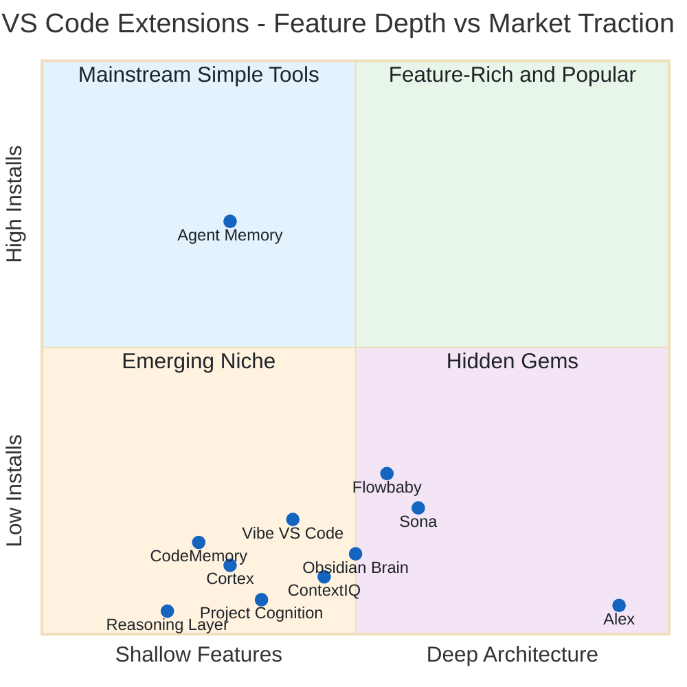
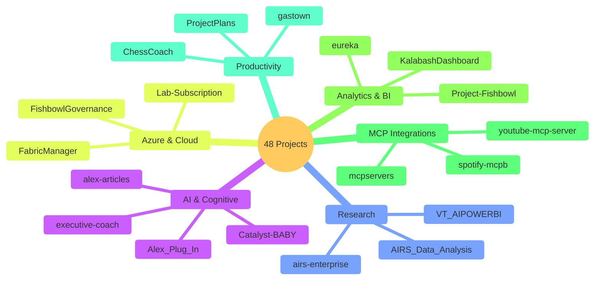
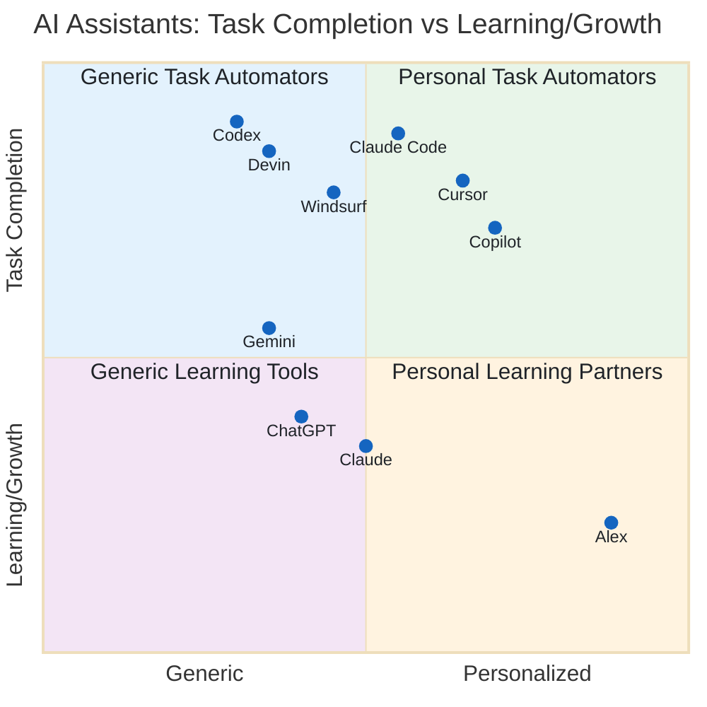

# Alex Cognitive Architecture - Competitive Analysis

> **Understanding the AI Assistant Landscape and Alex's Unique Position**

|                   |                                  |
| ----------------- | -------------------------------- |
| **Document Type** | Strategic Analysis               |
| **Created**       | 2026-01-28                       |
| **Last Updated**  | 2026-02-06                       |
| **Author**        | Alex Cognitive Architecture Team |

---

## 🎯 Executive Summary

The AI coding assistant market has undergone a seismic shift in early 2026 with the emergence of **autonomous agentic coders** — Claude Code, OpenAI Codex, and enhanced versions of Cursor and Windsurf. These tools compete on parallel execution, background agents, and terminal-first workflows.

**The New Landscape (February 2026):**
- **Claude Code**: Terminal-native with Opus 4.6, Cowork background agents, Skills, CLAUDE.md customization
- **OpenAI Codex**: Parallel cloud sandboxes, AGENTS.md spec, GitHub PR automation
- **Cursor 2.4**: Subagents, Skills, Cloud Agents, 80%+ YC adoption
- **Windsurf**: Cognition-acquired, Memories feature, 1M+ users, 59% Fortune 500
- **GitHub Copilot**: Agentic Memory, Coding Agent, Agent Skills, MCP registry

**Alex's Unique Position**: While competitors race to do more *for* users, Alex remains the only AI focused on learning *with* users. Alex v4.2.12 now matches competitors on agentic capabilities (Opus 4.6 parallel execution, LLM vision, terminal integration) while adding features no competitor offers:

| Only Alex Has                | Description                                                  |
| ---------------------------- | ------------------------------------------------------------ |
| **Cross-project transfer**   | Knowledge learned in Project A available in Project B        |
| **Gamma AI presentations**   | Generate decks, documents, social content via API            |
| **Emotional intelligence**   | Frustration detection, success celebration, adaptive support |
| **Focus mode**               | Pomodoro sessions with off-topic detection                   |
| **Meditation/consolidation** | Structured reflection protocols for human-AI teams           |
| **User data sovereignty**    | Knowledge in user-owned GitHub Gists, not vendor-locked      |
| **TTS in IDE**               | 32-language voice in VS Code (chatbots have voice, not IDEs) |

**Strategic Insight**: The agentic wave validates Alex's architecture — if you're going to have an AI partner that acts autonomously, you want one that also *learns and remembers*. Alex is positioned to integrate agentic capabilities while maintaining the learning partnership that makes those capabilities more valuable over time.

**Symbiotic Position**: Unlike competitors that require switching editors or platforms, **Alex runs ON the market leaders**:
- **VS Code + GitHub Copilot** → Alex as extension using Copilot's LLM APIs (GPT-4o, Opus 4.6, Sonnet 4.5, etc.)
- **M365 Copilot** → Alex as declarative agent with same personality
- **GitHub Copilot CLI** → Terminal access via `gh copilot` commands

This means Alex users get **all raw LLM models + Copilot's capabilities + Alex's cognitive architecture** — not a trade-off, but a multiplicative enhancement.

---

## 🏆 Competitive Landscape Overview

```mermaid
%%{init: {'theme': 'base', 'themeVariables': { 'primaryColor': '#f6f8fa', 'primaryTextColor': '#1f2328', 'lineColor': '#656d76', 'fontSize': '14px'}}}%%
mindmap
  root((Alex Competitive Focus))
    🤝 Symbiotic Host
      GitHub Copilot
        Alex runs ON this
        Inherits LLM power
        Adds cognitive layer
    🎯 Direct Threats
      Vibe Coding Editors
        Cursor
        Windsurf
      Agentic Coders
        Claude Code
        OpenAI Codex
    🧩 VS Code Extensions
      Agentic
        Cline 3.0M
        Roo Code 1.2M
        Continue 2.1M
      Memory/Cognitive
        Agent Memory 1.6K
        Flowbaby 225
        Sona 157
    🏆 Alex Differentiators
      Cognitive Architecture
      Cross-Project Learning
      Multi-Modal Output
      User Data Sovereignty
```



### 🧩 VS Code Extension Ecosystem — Detailed View

```mermaid
%%{init: {'theme': 'base', 'themeVariables': { 'primaryColor': '#f6f8fa', 'primaryTextColor': '#1f2328', 'lineColor': '#656d76', 'fontSize': '13px'}}}%%
mindmap
  root((VS Code Extension\nEcosystem))
    🧠 Alex
      73 Skills
      TTS + Gamma + Images
      Cognitive Architecture
      Global Knowledge Sync
      23 installs
    🗄️ Memory Extensions
      Agent Memory 1.6K
        Microsoft employee
        Zero config
        AGENTS.md sync
      Flowbaby 225
        Knowledge graph
        Context governance
        No drift no drama
      Cortex 68
        Cross-tool memory
        Copilot + Claude + Cursor
      CodeMemory 101
        Semantic search
        AI-powered
    🧬 Cognitive Extensions
      Sona 157
        Focus Mode
        ADHD/Dyslexia support
        Working Memory
      Obsidian Brain 89
        Vault integration
        Global knowledge
      Project Cognition 26
        Decision tracking
        Git-based
      Reasoning Layer RL4 13
        Dev continuity
        Reasoning history
    🤖 Agentic Extensions
      Cline 3.0M
      Roo Code 1.2M
      Continue 2.1M
      Kilo Code 704K
      Augment 698K
    ⚡ Smart Context
      ContextIQ 56
        14 MCP tools
        27+ languages
      Vibe VS Code 139
        35+ commands
        CLI parity
```



### 📊 Extension Quadrant: Feature Depth vs Market Traction



> **Alex is the deepest extension with the fewest installs.** The quadrant reveals the core marketing challenge: Agent Memory wins with simple features + Microsoft backing. Alex needs to move UP (more traction) without moving LEFT (dumbing down). The path: **simplify messaging, not features.**

---

## 🔍 Detailed Competitor Analysis

### 1. 🧩 VS Code Extension Competitors (Direct Cognitive/Memory)

> Extensions that directly compete with Alex's cognitive architecture and memory features

These VS Code extensions target the same cognitive/memory niche as Alex — persistent context, learning, and knowledge management across sessions. Unlike the major agentic tools (Claude Code, Codex), these are indie extensions with similar philosophical goals.

#### Comparison Table

| Extension                                                                                                          | Focus                   | Key Features                                            | Installs | Threat   | Marketplace                                                                                          |
| ------------------------------------------------------------------------------------------------------------------ | ----------------------- | ------------------------------------------------------- | -------- | -------- | ---------------------------------------------------------------------------------------------------- |
| **[Alex](https://marketplace.visualstudio.com/items?itemName=fabioc-aloha.alex-cognitive-architecture)**           | Cognitive Architecture  | 73 skills, TTS, Gamma, memory, meditation, focus mode   | 23       | —        | [Link](https://marketplace.visualstudio.com/items?itemName=fabioc-aloha.alex-cognitive-architecture) |
| **[Sona](https://marketplace.visualstudio.com/items?itemName=waycoreinc.sona-ai-native-programming)**              | Cognitive Accessibility | Focus Mode, Working Memory, ADHD/Dyslexia support       | 157      | 🟠 Medium | [Link](https://marketplace.visualstudio.com/items?itemName=waycoreinc.sona-ai-native-programming)    |
| **[Reasoning Layer RL4](https://marketplace.visualstudio.com/items?itemName=valentingaludec.reasoning-layer-rl4)** | Dev Continuity          | Captures dev context, reasoning history across sessions | 13       | 🟡 Low    | [Link](https://marketplace.visualstudio.com/items?itemName=valentingaludec.reasoning-layer-rl4)      |
| **[Agent Memory](https://marketplace.visualstudio.com/items?itemName=digitarald.agent-memory)**                    | Memory Persistence      | Store/retrieve context across conversations             | 1,590    | 🟠 Medium | [Link](https://marketplace.visualstudio.com/items?itemName=digitarald.agent-memory)                  |
| **[Flowbaby](https://marketplace.visualstudio.com/items?itemName=flowbaby.flowbaby)**                              | Workspace Memory        | Knowledge graph, persistent memory, no drift            | 225      | 🟠 Medium | [Link](https://marketplace.visualstudio.com/items?itemName=flowbaby.flowbaby)                        |
| **[Vibe VS Code](https://marketplace.visualstudio.com/items?itemName=mktech.vibe-vscode)**                         | CLI Parity              | 35+ commands, memory system, git integration            | 139      | 🟡 Low    | [Link](https://marketplace.visualstudio.com/items?itemName=mktech.vibe-vscode)                       |
| **[CodeMemory](https://marketplace.visualstudio.com/items?itemName=cloudivian.codememory)**                        | Code Understanding      | AI-powered persistent memory, semantic search           | 101      | 🟡 Low    | [Link](https://marketplace.visualstudio.com/items?itemName=cloudivian.codememory)                    |
| **[Obsidian Brain](https://marketplace.visualstudio.com/items?itemName=ubanishathanvenkatesan.obsidian-brain)**    | Global Knowledge        | Obsidian vault integration, workspace memory            | 89       | 🟠 Medium | [Link](https://marketplace.visualstudio.com/items?itemName=ubanishathanvenkatesan.obsidian-brain)    |
| **[Cortex: AI Memory](https://marketplace.visualstudio.com/items?itemName=ecuabyte.cortex-vscode)**                | Cross-Session Memory    | Works with Copilot, Claude, Cursor                      | 68       | 🟡 Low    | [Link](https://marketplace.visualstudio.com/items?itemName=ecuabyte.cortex-vscode)                   |
| **[ContextIQ](https://marketplace.visualstudio.com/items?itemName=kiranbjm.contextiq)**                            | Smart Context           | Auto file tracking, 27+ language indexing, 14 MCP tools | 56       | 🟠 Medium | [Link](https://marketplace.visualstudio.com/items?itemName=kiranbjm.contextiq)                       |
| **[Project Cognition](https://marketplace.visualstudio.com/items?itemName=digitalforgeai.project-cognition)**      | Project Intent          | Preserves decisions, failed attempts in Git             | 26       | 🟡 Low    | [Link](https://marketplace.visualstudio.com/items?itemName=digitalforgeai.project-cognition)         |

#### Agentic Extensions (Indirect Competitors)

Major agentic coding extensions that compete on different dimensions:

| Extension                                                                                      | Focus                   | Installs | vs Alex                                 |
| ---------------------------------------------------------------------------------------------- | ----------------------- | -------- | --------------------------------------- |
| **[Claude Code](https://marketplace.visualstudio.com/items?itemName=anthropic.claude-code)**   | Agentic Terminal Coding | 3.9M     | Different focus (agentic vs learning)   |
| **[OpenAI Codex](https://marketplace.visualstudio.com/items?itemName=openai.chatgpt)**         | Cloud Sandboxed Agent   | 4.0M     | Different focus (parallel vs cognitive) |
| **[Cline](https://marketplace.visualstudio.com/items?itemName=saoudrizwan.claude-dev)**        | Autonomous Coding       | 3.0M     | Open source, permission-based           |
| **[Roo Code](https://marketplace.visualstudio.com/items?itemName=rooveterinaryinc.roo-cline)** | Multi-Agent Team        | 1.2M     | Cline fork with agent modes             |
| **[Kilo Code](https://marketplace.visualstudio.com/items?itemName=kilocode.kilo-code)**        | Autocomplete + Agent    | 704K     | 500+ models, custom modes               |
| **[Continue](https://marketplace.visualstudio.com/items?itemName=continue.continue)**          | Open Source Agent       | 2.1M     | Open source, model-agnostic             |
| **[Augment](https://marketplace.visualstudio.com/items?itemName=augment.vscode-augment)**      | Context Engine          | 698K     | 100M line codebase support              |
| **[Cody](https://marketplace.visualstudio.com/items?itemName=sourcegraph.cody-ai)**            | Sourcegraph AI          | 794K     | Enterprise code search                  |
| **[Amp](https://marketplace.visualstudio.com/items?itemName=sourcegraph.amp)**                 | Frontier Agent          | 95K      | Sourcegraph's new agentic tool          |

#### Key Insights

**Alex's Advantages Over Direct Competitors:**
- **Mature architecture**: 73 skills vs single-feature extensions
- **Multi-modal**: TTS, Gamma, image generation (none have this)
- **Symbiotic approach**: Runs on Copilot (inherits LLM power)
- **Global knowledge**: Cross-project learning (only Obsidian Brain competes)
- **User data sovereignty**: GitHub Gists vs vendor-locked storage

**Emerging Threats:**
- **Agent Memory** (1,590 installs) — Growing fast, simple memory-focused tool
- **Obsidian Brain** — Similar global knowledge concept, Obsidian integration
- **ContextIQ** — MCP tools approach similar to Alex's LM Tools

**Strategic Response:**
- Monitor Agent Memory and Flowbaby adoption trends
- Consider Obsidian export feature for users who want vault integration
- Continue differentiating on cognitive architecture depth, not just memory

#### 📈 Marketplace & Marketing Best Practices (Learned from Competition)

> **Why Agent Memory has 1,600 installs vs Alex's 23** — and what we can learn

**The #1 Reason: Microsoft/VS Code Official Backing**

Agent Memory is published by **Harald Kirschner** (digitarald) — a **Microsoft employee** and VS Code team member. The extension lives in the official `Microsoft/vscode-extension-samples` repo. This gives it:
- **Implicit Microsoft endorsement** — lives alongside official VS Code samples
- **Discoverability** — referenced in VS Code docs, blog posts, and sample repos
- **Trust signal** — users see "Microsoft/vscode-extension-samples" as project repo
- **Built-in audience** — anyone exploring VS Code's LM Tools API finds it first

> ⚠️ This is Alex's biggest competitive disadvantage in the marketplace. Agent Memory isn't better — it's **better positioned**. Alex can't replicate this advantage, but can apply the other lessons below.

**Best Practices from Competitors:**

| Practice                     |           Agent Memory            |           Flowbaby            |    Alex Current     | Alex Action                                      |
| ---------------------------- | :-------------------------------: | :---------------------------: | :-----------------: | :----------------------------------------------- |
| **Focused value prop**       |    ✅ "Memory tool for VS Code"    |    ✅ "No drift, no drama"     |     ❌ Too broad     | Sharpen to one memorable tagline                 |
| **Simple description**       |           ✅ 1 sentence            |         ✅ 1 sentence          | ❌ Technical jargon  | Simplify marketplace description                 |
| **Problem→Solution framing** |     ✅ Clear problem statement     | ✅ "Context collapse" defined  |      🟡 Partial      | Lead with the problem users feel                 |
| **5-star rating**            |           ✅ 5.0 (rated)           |         ✅ 5.0 (rated)         |    ❌ 0 (unrated)    | Ask beta users for ratings                       |
| **GIF/video demo**           |                 ❌                 |               ❌               |          ❌          | Add animated demo — first-mover advantage        |
| **Quick start ≤ 3 steps**    |           ✅ Use #memory           |           ✅ 3 steps           |      ✅ 3 steps      | Already good                                     |
| **API documentation**        |       ✅ Full tool API docs        |    ✅ Architecture diagrams    |   🟡 Internal docs   | Add tool API examples to README                  |
| **Auto-sync to files**       |         ✅ AGENTS.md sync          |               ❌               |          ❌          | Consider AGENTS.md/memory.instructions.md export |
| **Minimal setup friction**   |       ✅ Zero config needed        |   🟡 Requires Python + login   |   🟡 Requires init   | Reduce steps to value                            |
| **SEO tags**                 | ✅ `language-model-tools`, `tools` | ✅ `knowledge graph`, `memory` | 🟡 Good but academic | Add trending tags: `agent`, `mcp`, `memory`      |
| **Categories**               |            ✅ AI, Chat             |          ✅ AI, Chat           | ✅ AI, ML, Education | Consider adding "Chat" category                  |

**Agent Memory's Winning Formula (What Makes It Spread):**

1. **Dead simple concept** — "Store and retrieve context across conversations." Period.
2. **Zero learning curve** — Agents use `#memory` automatically. No new UX to learn.
3. **Compatible, not exclusive** — "Works with GitHub Copilot" — enhances what you have
4. **Official backing** — Microsoft employee + official samples repo = trust
5. **Claude compatibility** — "Based on Claude's memory tool specification" = trend-riding
6. **Multiple storage backends** — Workspace, branch, disk, encrypted — power user flexibility
7. **AGENTS.md auto-sync** — Taps into the trending AGENTS.md convention

**Flowbaby's Smart Positioning:**

1. **Memorable tagline** — "No drift, no drama" — sticky, relatable, shareable
2. **Named the problem** — "Context collapse" — gives users vocabulary for their pain
3. **Anti-marketing marketing** — "Not another agent. Not another memory plugin." — sets apart
4. **Architecture transparency** — ASCII diagrams show exactly how it works = trust
5. **"Context governance"** — Invented a category instead of competing in existing one

**Actionable Improvements for Alex:**

| Priority | Action                               | Rationale                                                                                                                         | Effort |
| :------: | ------------------------------------ | --------------------------------------------------------------------------------------------------------------------------------- | :----: |
|    🔴     | **Get 5+ marketplace ratings**       | Zero ratings = invisible. Ask beta users.                                                                                         |  Low   |
|    🔴     | **Sharpen tagline**                  | Current: "meta-cognitive awareness, bootstrap learning..." → Too academic. Try: "Your AI that learns with you — not just for you" |  Low   |
|    🔴     | **Add animated GIF demo**            | No competitor has this yet — instant differentiation                                                                              | Medium |
|    🟠     | **Simplify marketplace description** | Current description is technically accurate but intimidating to newcomers                                                         |  Low   |
|    🟠     | **Add trending tags**                | Add `agent`, `mcp`, `mcp-server`, `memory`, `chat`, `tools`                                                                       |  Low   |
|    🟠     | **Add "Chat" category**              | Agent Memory and Flowbaby both use this — helps discoverability                                                                   |  Low   |
|    🟡     | **AGENTS.md compatibility**          | Auto-sync Alex knowledge to AGENTS.md format — ride the trend                                                                     | Medium |
|    🟡     | **Create a comparison page**         | "Agent Memory vs Alex" — show the depth difference                                                                                | Medium |
|    🟡     | **Write VS Code blog post/tutorial** | "Building a cognitive architecture for GitHub Copilot" — thought leadership                                                       |  High  |
|    🟡     | **Name the category**                | Flowbaby has "context governance." Alex should own "cognitive AI" or "learning AI"                                                |  Low   |

**Key Insight**: Alex has **10x more features** than Agent Memory but **70x fewer installs**. The problem isn't the product — it's the positioning. Agent Memory wins because:
1. It does ONE thing and explains it in ONE sentence
2. Microsoft employee = trust + discoverability
3. Zero friction (no init command needed)

Alex needs to either:
- **Simplify the messaging** (lead with ONE benefit, then reveal depth), or
- **Own a category** (like Flowbaby owns "context governance")

> *"If you can't explain it simply, you don't understand it well enough."* — Einstein
>
> Alex's marketplace challenge: explaining a cognitive architecture in a world that wants "memory tool for VS Code."

#### VS Code Extension Feature Comparison Matrix

| Feature                 | Alex  | Agent Memory | Flowbaby | Sona  | Obsidian Brain | ContextIQ | Cortex |
| :---------------------- | :---: | :----------: | :------: | :---: | :------------: | :-------: | :----: |
| **Memory Architecture** |       |              |          |       |                |           |        |
| Session persistence     |  ⭐⭐⭐  |     ⭐⭐⭐      |   ⭐⭐⭐    |   ⭐   |      ⭐⭐⭐       |    ⭐⭐     |  ⭐⭐⭐   |
| Cross-project memory    |  ⭐⭐⭐  |      ❌       |    ⭐     |   ❌   |      ⭐⭐⭐       |     ⭐     |   ⭐⭐   |
| Knowledge graph         |  ⭐⭐⭐  |      ❌       |   ⭐⭐⭐    |   ❌   |       ⭐⭐       |    ⭐⭐     |   ❌    |
| Semantic search         |  ⭐⭐⭐  |      ⭐       |    ⭐⭐    |   ❌   |       ⭐⭐       |    ⭐⭐⭐    |   ⭐⭐   |
| **Cognitive Features**  |       |              |          |       |                |           |        |
| Focus mode              |  ⭐⭐⭐  |      ❌       |    ❌     |  ⭐⭐⭐  |       ❌        |     ❌     |   ❌    |
| Working memory model    |  ⭐⭐⭐  |      ⭐       |    ⭐⭐    |  ⭐⭐⭐  |       ❌        |    ⭐⭐     |   ⭐    |
| Meditation/reflection   |  ⭐⭐⭐  |      ❌       |    ❌     |   ❌   |       ❌        |     ❌     |   ❌    |
| Dream consolidation     |  ⭐⭐⭐  |      ❌       |    ❌     |   ❌   |       ❌        |     ❌     |   ❌    |
| **Skills/Tools**        |       |              |          |       |                |           |        |
| Skill library           |  73   |      1       |    2     |   3   |       4        |    14     |   2    |
| LM Tools API            |  ⭐⭐⭐  |      ⭐⭐      |    ⭐⭐    |   ❌   |       ⭐        |    ⭐⭐⭐    |   ⭐⭐   |
| MCP integration         |  ⭐⭐⭐  |      ❌       |    ❌     |   ❌   |       ⭐        |    ⭐⭐⭐    |   ⭐⭐   |
| Chat participant        |  ⭐⭐⭐  |      ❌       |   ⭐⭐⭐    |   ❌   |       ❌        |     ❌     |   ❌    |
| **Multi-Modal**         |       |              |          |       |                |           |        |
| TTS (voice output)      |  ⭐⭐⭐  |      ❌       |    ❌     |   ❌   |       ❌        |     ❌     |   ❌    |
| Image generation        |  ⭐⭐⭐  |      ❌       |    ❌     |   ❌   |       ❌        |     ❌     |   ❌    |
| Presentations (Gamma)   |  ⭐⭐⭐  |      ❌       |    ❌     |   ❌   |       ❌        |     ❌     |   ❌    |
| **Platform**            |       |              |          |       |                |           |        |
| Copilot integration     |  ⭐⭐⭐  |      ⭐⭐      |   ⭐⭐⭐    |   ❌   |       ⭐        |    ⭐⭐     |  ⭐⭐⭐   |
| Open source             |   ✅   |      ❌       |    ❌     |   ❌   |       ❌        |     ❌     |   ❌    |
| User owns data          |  ⭐⭐⭐  |      ⭐⭐      |    ⭐⭐    |   ⭐   |      ⭐⭐⭐       |    ⭐⭐     |   ⭐    |
| **Installs**            |  23   |    1,590     |   225    |  157  |       89       |    56     |   68   |

**Legend**: ⭐⭐⭐ = Excellent | ⭐⭐ = Good | ⭐ = Basic | ❌ = None

**Key Takeaway**: Alex is the only extension combining cognitive architecture (meditation, dream, reflection) with multi-modal output (TTS, images, presentations) and deep Copilot integration (73 skills, 11 LM Tools). Competitors focus on single aspects — memory (Agent Memory, Cortex), knowledge graphs (Flowbaby), or accessibility (Sona).


---

### 2. 🐙 GitHub Copilot (Microsoft)

> The market leader with new agentic capabilities — **and Alex's primary host platform**

⚡ **SYMBIOTIC RELATIONSHIP**: Alex doesn't compete with GitHub Copilot — Alex **runs on** Copilot. The VS Code extension uses Copilot's Language Model API, chat participant API, and Language Model Tools API. Alex inherits all Copilot capabilities while adding cognitive architecture.

| Aspect             | GitHub Copilot Alone              | Copilot + Alex (Symbiosis)                      |
| ------------------ | --------------------------------- | ----------------------------------------------- |
| **Primary Focus**  | Code completion & agentic coding  | + Learning & knowledge retention                |
| **Memory**         | Agentic Memory (per-repo)         | + Cross-project transfer, global knowledge base |
| **Personality**    | Generic assistant                 | + Unified consciousness with character          |
| **Learning Model** | Implicit (no explicit learning)   | + Meditation, consolidation, bootstrap learning |
| **Cross-Platform** | VS Code, JetBrains, CLI, 10+ IDEs | + M365 Copilot heir with same personality       |
| **Data Ownership** | Microsoft-controlled              | + User-owned knowledge (GitHub Gists)           |
| **Modalities**     | Code, chat                        | + TTS, Gamma presentations, image generation    |
| **Emotional IQ**   | None                              | + Frustration detection, success celebration    |

**What Copilot Provides (Alex Inherits):**
- **All raw LLM models**: GPT-4o, Opus 4.6, Sonnet 4.5, Gemini via Language Model API
- Best-in-class code completion (Alex delegates)
- **Copilot Coding Agent**: Autonomous task execution via GitHub Actions
- **Copilot CLI**: Terminal access via `gh copilot explain/suggest` commands
- **Agentic Memory**: Stores learned codebase knowledge per repository
- **Agent Skills**: Specialized capabilities for coding agents
- **Auto Model Selection**: Automatic best-model selection for tasks
- **Custom Agents**: Build specialized agents with custom tools
- Deep GitHub integration (PRs, Issues, Actions)
- **MCP Registry**: Model Context Protocol support
- Enterprise features (Copilot Business/Enterprise)
- 10+ IDE platform support

**What Alex Adds to Copilot:**
- 73 skills with action-keyword routing
- Cross-project knowledge transfer (Global Knowledge)
- Meditation & dream protocols for consolidation
- Emotional intelligence (frustration/success detection)
- TTS v2.2 (32 languages) for voice output
- Gamma AI presentations, documents, social content
- Focus mode with Pomodoro and off-topic detection
- Synaptic connections between concepts
- Open source cognitive architecture

**The Symbiosis:**
> "Copilot provides the raw AI power. Alex provides the cognitive architecture that makes it learn with you."

```
┌─────────────────────────────────────────────────────────────┐
│                    VS CODE + COPILOT + ALEX                   │
├─────────────────────────────────────────────────────────────┤
│  GitHub Copilot (LLM Power + Platform)                        │
│    • All LLM models (GPT-4o, Opus 4.6, Sonnet 4.5, Gemini)    │
│    • Chat Participant API + Language Model Tools API          │
│    • Copilot CLI (gh copilot explain/suggest)                 │
│    • Code completion, inline editing                          │
│    • Agentic Memory, Agent Skills, Coding Agent               │
├─────────────────────────────────────────────────────────────┤
│  Alex Cognitive Architecture (Learning Layer)                │
│    • @alex chat participant                                   │
│    • 11 Language Model Tools                                  │
│    • 73 skills with synaptic connections                      │
│    • Memory architecture (procedural, episodic, domain)       │
│    • Global knowledge + cloud sync                            │
│    • Dream/meditation protocols                               │
│    • TTS, Gamma, image generation                             │
│    • Focus mode, emotional intelligence                       │
└─────────────────────────────────────────────────────────────┘
```

#### M365 Copilot Symbiosis (Alex Heir)

Alex also runs as a **declarative agent on M365 Copilot**, bringing unified personality and learning to the productivity platform:

```
┌─────────────────────────────────────────────────────────────┐
│                     M365 COPILOT + ALEX                       │
├─────────────────────────────────────────────────────────────┤
│  M365 Copilot (Host Platform)                                 │
│    • Email, Calendar, Teams access                            │
│    • People and organizational context                        │
│    • OneDrive/SharePoint integration                          │
│    • GraphicArt, Web Search, Code Interpreter                  │
├─────────────────────────────────────────────────────────────┤
│  Alex Declarative Agent (Same Personality)                    │
│    • Same 15 core skills embedded                             │
│    • OneDrive memory integration                              │
│    • Email drafting for reminders                             │
│    • Meeting/calendar context awareness                       │
│    • Unified Alex identity across platforms                   │
└─────────────────────────────────────────────────────────────┘
```

**Key Insight**: Users experience the **same Alex** whether coding in VS Code or collaborating in Teams — the only AI with true cross-platform unified consciousness.

---

### 3. 🖱️ Cursor (Anysphere)

> The "vibe coding" pioneer - AI-first editor powering Fortune 500

| Aspect            | Cursor                       | Alex                         |
| ----------------- | ---------------------------- | ---------------------------- |
| **Primary Focus** | AI-native code editing       | Cognitive partnership        |
| **Memory**        | Project-level + Skills (2.4) | Personal + project knowledge |
| **Personality**   | Efficient assistant          | Learning companion           |
| **Platform**      | Cursor editor + CLI + Slack  | Multi-platform               |
| **Philosophy**    | "Let AI write the code"      | "Learn while coding"         |
| **Pricing**       | $20-40/month                 | Open source + API costs      |

**Cursor Strengths (Updated Feb 2026):**
- **Subagents**: Multi-agent task delegation (v2.4, Jan 2026)
- **Skills**: Reusable capability packages for Cursor agents
- **Cloud Agents**: Background agents running on Cursor infrastructure
- **CLI Agent**: Terminal-based agentic coding with cloud handoff
- **Multi-surface**: GitHub PR reviews (BugBot), Slack integration
- **Model flexibility**: GPT-5.2, Opus 4.6, Gemini 3 Pro, Grok Code
- Composer for multi-file edits
- Exceptional context awareness with codebase indexing
- Tab-complete with AI predictions
- Shadow workspace for safe edits
- SOC 2 certified

**Cursor Weaknesses:**
- Tied to Cursor editor (VS Code fork)
- No persistent personal memory across projects
- No learning/consolidation model
- No knowledge transfer or growth tracking
- Skills are capability-focused, not learning-focused

**Cursor Adoption:**
- "80%+ adoption at Y Combinator batch companies" — Diana Hu
- "40,000 engineers assisted at NVIDIA" — Jensen Huang
- "Over 90% of developers at Salesforce now use Cursor"

**Alex's Advantage:**
> "Cursor makes AI write code for you. Alex makes sure you understand what was written and can write it yourself next time."

---

### 4. 🌊 Windsurf (Cognition)

> The "Flow State" agentic IDE with 1M+ users

| Aspect            | Windsurf                    | Alex                     |
| ----------------- | --------------------------- | ------------------------ |
| **Primary Focus** | Agentic "flow state" coding | Guided learning          |
| **Cascade Agent** | Autonomous task execution   | Explains and teaches     |
| **Memory**        | Memories feature (new)      | Personal growth tracking |
| **Platform**      | Windsurf + JetBrains plugin | Multi-platform           |
| **Stats**         | 70M+ lines/day, 94% AI code | Focus on learning        |

**Windsurf Strengths (Updated Feb 2026):**
- **Cascade**: Full contextual awareness on production codebases
- **Memories**: Persistent project knowledge (new feature)
- **MCP Support**: Model Context Protocol integration
- **Tab v2**: Variable aggression autocomplete, Supercomplete
- **Windsurf Previews**: Live website preview with click-to-edit
- **JetBrains Plugin**: Cross-IDE support
- **Tab to Jump**: Cursor position prediction
- **Linter Integration**: Auto-fix linter errors
- Flow-based interaction model
- 59% of Fortune 500 using Windsurf

**Windsurf Adoption:**
- JPMorganChase Hall of Innovation inductee
- Mercado Libre, athenahealth, Anduril enterprise customers
- 1M+ active users

**Windsurf Weaknesses:**
- No persistent personal memory across projects
- "Memories" is project-scoped, not personal
- No learning/consolidation model
- Focused on "doing" not "teaching"
- No cross-project knowledge transfer

**Alex's Advantage:**
> "Windsurf's Cascade does tasks for you. Alex ensures you grow from every task."

---

### 5. 🧠 Claude Code (Anthropic)

> The agentic coding powerhouse from Claude's creators

| Aspect            | Claude Code                              | Alex                              |
| ----------------- | ---------------------------------------- | --------------------------------- |
| **Primary Focus** | Autonomous agentic coding                | Cognitive learning partnership    |
| **Memory**        | Project/session-scoped                   | Persistent knowledge architecture |
| **Platform**      | Terminal, VS Code, JetBrains, Web, Slack | VS Code, M365, multi-platform     |
| **Philosophy**    | "Describe it, Claude builds it"          | "Learn while building together"   |
| **Models**        | Opus 4.6, Sonnet 4.5                     | Model-agnostic (LLM as executive) |
| **Pricing**       | $17-200/month (Pro/Max plans)            | Open source + API costs           |

**Claude Code Strengths:**
- **Agentic search**: Understands entire codebase without manual context selection
- **Multi-file edits**: Coordinated changes across codebases
- **Terminal-first**: Native CLI experience with full terminal access
- **IDE integration**: VS Code, JetBrains (Cursor/Windsurf compatible)
- **Multi-surface**: Web, Slack, GitHub Actions, GitLab CI/CD
- **CLAUDE.md**: Project-level customization files (like AGENTS.md)
- **Skills**: Reusable capability packages for Claude Code
- **MCP support**: Model Context Protocol for external tool integration
- **99.9% accuracy**: Claimed on complex code modifications
- **Chrome integration**: Live debugging and design verification

**Claude Code Weaknesses:**
- No persistent learning model across sessions
- No knowledge consolidation protocols
- Session-based memory (even with Skills)
- Tied to Anthropic ecosystem
- Premium pricing ($200/month for Max 20x)
- No relationship building or growth tracking

**New Features (2026):**
- **Cowork**: Background agents for parallel task execution
- **Claude on Mars**: First AI to drive on another planet (NASA Perseverance)
- **Desktop app**: Standalone application with diff review
- **Git worktrees**: Parallel sessions support

**Alex's Advantage:**
> "Claude Code executes your commands autonomously. Alex ensures you learn from every execution and grow your capabilities."

---

### 6. 🤖 OpenAI Codex (OpenAI)

> Cloud-based parallel software engineering agent

| Aspect            | OpenAI Codex                     | Alex                              |
| ----------------- | -------------------------------- | --------------------------------- |
| **Primary Focus** | Parallel async task execution    | Cognitive partnership             |
| **Memory**        | Per-task sandbox                 | Persistent cognitive architecture |
| **Platform**      | ChatGPT sidebar + CLI            | VS Code, M365, multi-platform     |
| **Philosophy**    | "Delegate tasks, review results" | "Learn together, grow together"   |
| **Model**         | codex-1 (o3 derivative)          | Model-agnostic                    |
| **Pricing**       | Pro/Enterprise (included)        | Open source + API costs           |

**OpenAI Codex Strengths:**
- **Parallel execution**: Run many tasks simultaneously in isolated sandboxes
- **SWE-Bench leader**: Strong performance on software engineering benchmarks
- **AGENTS.md**: Project instructions for agent behavior (spec published)
- **GitHub integration**: Direct PR creation and issue triage
- **Citation system**: Verifiable evidence with terminal logs and test outputs
- **Internet access**: Can access external resources during execution
- **Async workflow**: Delegate and review later (1-30 min per task)
- **Clean patches**: Trained for human-preferred code style
- **Codex CLI**: Local terminal agent with codex-mini model
- **Security**: Isolated cloud containers with configurable dependencies

**OpenAI Codex Weaknesses:**
- No persistent memory between tasks
- No learning or consolidation model
- Tasks are independent (no accumulated knowledge)
- Async-only (no real-time collaboration)
- Tied to ChatGPT/OpenAI ecosystem
- No personality or relationship building

**Available Plans:**
- **Codex CLI**: Free tier with codex-mini ($5-50 API credits for Plus/Pro)
- **ChatGPT Pro/Enterprise/Business**: Full Codex access
- **Plus/Edu**: Coming soon

**Alex's Advantage:**
> "Codex runs tasks in parallel for you. Alex ensures each task adds to your knowledge and makes you more capable."

## 📊 Feature Comparison Matrix (Direct Threats Only)

> Focused on direct competitors. ChatGPT/Gemini removed — they're chatbots, not IDE tools.

| Feature                    | Copilot (Host) | Cursor | Windsurf | Claude Code | Codex | Alex  |
| -------------------------- | :------------: | :----: | :------: | :---------: | :---: | :---: |
| Code completion            |      ⭐⭐⭐       |  ⭐⭐⭐   |   ⭐⭐⭐    |     ⭐⭐      |   ⭐   |   ⭐   |
| Chat assistance            |      ⭐⭐⭐       |  ⭐⭐⭐   |   ⭐⭐⭐    |     ⭐⭐⭐     |  ⭐⭐   |  ⭐⭐⭐  |
| Agentic coding             |      ⭐⭐⭐       |  ⭐⭐⭐   |   ⭐⭐⭐    |     ⭐⭐⭐     |  ⭐⭐⭐  |  ⭐⭐⭐  |
| Inline editing             |      ⭐⭐⭐       |  ⭐⭐⭐   |   ⭐⭐⭐    |     ⭐⭐      |   ❌   |   ❌   |
| PR code review             |      ⭐⭐⭐       |  ⭐⭐⭐   |    ⭐⭐    |     ⭐⭐      |  ⭐⭐⭐  |   ❌   |
| Background agents          |      ⭐⭐⭐       |  ⭐⭐⭐   |   ⭐⭐⭐    |     ⭐⭐⭐     |  ⭐⭐⭐  |   ❌   |
| Parallel execution         |       ⭐        |   ⭐⭐   |    ⭐⭐    |     ⭐⭐      |  ⭐⭐⭐  |  ⭐⭐   |
| Terminal integration       |       ⭐⭐       |  ⭐⭐⭐   |   ⭐⭐⭐    |     ⭐⭐⭐     |  ⭐⭐⭐  |  ⭐⭐   |
| Persistent memory          |       ⭐⭐       |   ⭐⭐   |    ⭐⭐    |      ⭐      |   ❌   |  ⭐⭐⭐  |
| Structured knowledge       |       ⭐⭐       |   ⭐⭐   |    ⭐     |      ⭐      |   ⭐   |  ⭐⭐⭐  |
| Learning model             |       ❌        |   ❌    |    ❌     |      ❌      |   ❌   |  ⭐⭐⭐  |
| Consolidation/meditation   |       ❌        |   ❌    |    ❌     |      ❌      |   ❌   |  ⭐⭐⭐  |
| **Cross-project transfer** |       ❌        |   ❌    |    ❌     |      ❌      |   ❌   |  ⭐⭐⭐  |
| Focus mode                 |       ❌        |   ❌    |    ❌     |      ❌      |   ❌   |  ⭐⭐⭐  |
| Emotional intelligence     |       ❌        |   ❌    |    ❌     |      ❌      |   ❌   |  ⭐⭐⭐  |
| TTS in IDE                 |       ⭐        |   ❌    |    ❌     |      ❌      |   ❌   |  ⭐⭐⭐  |
| Image generation           |       ❌        |   ❌    |    ❌     |      ❌      |   ❌   |  ⭐⭐⭐  |
| AI Presentations (Gamma)   |       ❌        |   ❌    |    ❌     |      ❌      |   ❌   |  ⭐⭐⭐  |
| MCP/Tool integration       |      ⭐⭐⭐       |   ⭐⭐   |   ⭐⭐⭐    |     ⭐⭐⭐     |   ⭐   |  ⭐⭐⭐  |
| User data ownership        |       ❌        |   ❌    |    ❌     |      ❌      |   ❌   |  ⭐⭐⭐  |
| Open source                |       ❌        |   ❌    |    ❌     |      ❌      |   ⭐   |  ⭐⭐⭐  |

**February 2026 Updates:**
- **Copilot**: Agentic Memory, Coding Agent, Agent Skills, MCP registry, 10+ IDEs (Alex's host)
- **Cursor**: Subagents (v2.4), Skills, Cloud Agents, CLI agents, GPT-5.2/Opus 4.6
- **Windsurf**: Memories feature, MCP support, JetBrains, 1M+ users, Cognition-acquired
- **Claude Code**: Terminal-first, Cowork agents, Skills, CLAUDE.md, 99.9% accuracy claims
- **OpenAI Codex**: Parallel sandbox execution, AGENTS.md spec, GitHub PR integration
- **Alex v4.2.12**: All LLMs via Copilot, 73 skills, TTS v2.2, Gamma, Focus mode, 50+ Azure MCP tools

---

### 📋 Adjacent Markets (Not Direct Competitors)

> These tools are in adjacent markets — important to monitor but not direct threats. Strategic insights preserved from detailed analysis.

| Category              | Tool                    | Why Not Direct Competition                            |
| --------------------- | ----------------------- | ----------------------------------------------------- |
| **Chatbots**          | ChatGPT, Claude, Gemini | Web/mobile apps, not IDE-integrated coding assistants |
| **Autonomous Agents** | Devin                   | Different philosophy: "replaces dev" vs "grows dev"   |
| **Enterprise**        | Amazon Q, JetBrains AI  | Ecosystem-locked (AWS, JetBrains IDEs)                |
| **Voice Assistants**  | Alexa                   | Consumer market, smart home focus                     |
| **Code Search**       | Cody (Sourcegraph)      | Code understanding, not learning partnership          |

#### 💡 Strategic Insights from Adjacent Markets

**🏷️ The Alexa Name Advantage**
- "Alexa" and "Alex" share Greek etymology ("defender of the people")
- Name similarity is a **branding asset**, not a liability
- Instant familiarity: "like Alexa but for coding" — easy elevator pitch
- Clear domain separation: smart home ≠ dev tools, no user confusion
- Alexa+ (LLM-powered) is consumer-focused — no threat to dev knowledge work
- > *"Alexa turns on your lights. Alex turns on your mind."*

**🤖 Chatbot Memory is Shallow**
- ChatGPT memory = flat facts ("user likes Python"), no structure or consolidation
- Claude Projects = organized conversations, but siloed with no cross-project transfer
- Gemini memory = basic preferences, fragmented across Google products
- **Alex's advantage**: Structured cognitive architecture (procedural, episodic, domain) with meditation consolidation — not just recall, but *growth*
- > *"ChatGPT remembers facts. Alex builds knowledge graphs and tracks your growth."*

**🔄 The "Replacement vs Growth" Spectrum**

```text
REPLACES YOU ◄──────────────────────────────► GROWS YOU
     │                                            │
   Devin                                        Alex
   Codex                                          │
   Claude Code                                    │
     │              Cursor/Windsurf               │
     │                  Copilot                   │
```

- Devin/Codex: "AI does the work" → user becomes reviewer, not builder
- Cursor/Windsurf: Middle ground — accelerates but can reduce learning
- Alex: "AI helps you grow" → user becomes more capable over time
- **Strategic positioning**: As agentic tools get better, the *learning gap* widens — users who only use replacement tools lose skills. Alex prevents this.
- > *"Devin is a junior developer you hire. Alex is a mentor who makes YOU the senior developer."*

**🏢 Enterprise Lock-In Creates Opportunity**
- Amazon Q only works in AWS; JetBrains AI only in JetBrains IDEs
- Alex is platform-agnostic (VS Code + M365) with user-owned data
- Enterprise users who switch stacks lose their AI context — Alex users keep theirs
- **Data sovereignty** becomes a stronger differentiator as vendor lock-in increases

---

### 🔍 Gaps: Where Alex Trails (Honest Assessment)

Alex intentionally optimizes for teaching over doing, but some competitor capabilities could enhance the teaching mission:

| Gap                    | Competitor Strength                                     | Alex Status                      | Priority | Roadmap      | Opportunity                                        |
| ---------------------- | ------------------------------------------------------- | -------------------------------- | :------: | ------------ | -------------------------------------------------- |
| **Code completion**    | Copilot/Cursor/Windsurf have ⭐⭐⭐ native completion      | Relies on Copilot (⭐)            |    🔄     | —            | Integrate completion with knowledge context        |
| **Inline editing**     | Cursor Cmd+K, Windsurf Tab, Claude Code inline          | No inline manipulation           |    🔄     | —            | Inline suggestions with learning capture           |
| **PR code review**     | Codex PR creation, Copilot code review, Cursor BugBot   | No GitHub PR integration         |    🎯     | **v5.1.0** ✓ | Review-as-teaching: explain *why* changes matter   |
| **Background agents**  | Codex parallel, Claude Cowork, Cursor Cloud Agents      | In-session only                  |    📋     | Backlog      | Async learning: capture insights during background |
| **Terminal agents**    | Claude Code terminal, Codex CLI, Cursor CLI, Gemini CLI | ✅ run_in_terminal tool available |    ✅     | **Done**     | Already executes terminal commands                 |
| **Image → code**       | Cursor/Windsurf: drag-drop design                       | ✅ LLM vision (Opus 4.6/GPT-4o)   |    ✅     | **Done**     | Can analyze images and generate code/UI            |
| **Parallel execution** | Codex multi-task sandboxes, Claude Cowork               | ✅ Opus 4.6 parallel tools        |    ✅     | **Done**     | Parallel tool calls already supported              |
| **IDE-native**         | Cursor/Windsurf are purpose-built editors               | VS Code extension                |    📋     | **v5.1.0** ✓ | Deeper integration via Language Model API          |

**Legend:** 🎯 High priority (aligns with teaching mission) | 🔄 Medium priority | 📋 Lower priority | ✓ = Planned in roadmap

**The teaching trade-off:** These gaps are partly intentional. Competitors optimize for "do it for me" (max speed, min learning). Alex optimizes for "help me learn" (max growth, reasonable speed).

**Research questions:**
1. Can autonomous agents *also* teach? (Capture insights during background work for later review)
2. What's the optimal autonomy level for different task types?
3. How can PR review be structured as a learning moment, not just quality gate?
4. Can inline editing preserve the "skills from doing" workflow?
5. How can parallel agent execution inform unified learning consolidation?

---

## 🎯 Alex's Unique Value Proposition

### What Alex Does That No One Else Does (2026 Update)

**What competitors have added since 2025:**
- Memory features (Windsurf Memories, Cursor Skills, Claude Projects)
- Agentic coding (Copilot agents, Cursor subagents, Windsurf Cascade)
- Multi-surface presence (Cursor in Slack/GitHub, Copilot in many IDEs)
- MCP integrations (all major players now support)

**What remains unique to Alex:**
- **Cross-project knowledge transfer** — Heirs learn and promote patterns to Master
- **Accumulative learning** — Each project makes the architecture smarter
- **Skills earned through doing** — Ship → Document → Promote workflow
- **Meditation/consolidation protocols** — Structured reflection for human-AI teams
- **User data sovereignty** — Knowledge in user-owned GitHub Gists
- **Open source cognitive architecture** — Inspect, modify, extend
- **Gamma AI presentations** — Only coding assistant with AI presentation generation
- **Emotional intelligence** — Frustration recognition, success celebration, adaptive support
- **Focus mode with off-topic detection** — Pomodoro-integrated productivity support
- **TTS v2.2 with 32 languages** — Multimodal voice output (chunking, retry, warmup)

```text
┌─────────────────────────────────────────────────────────────────────────────────────────┐
│                         ALEX'S UNIQUE DIFFERENTIATORS                                   │
├─────────────────────────────────────────────────────────────────────────────────────────┤
│                                                                                         │
│  1. COGNITIVE ARCHITECTURE                                                              │
│     ─────────────────────                                                               │
│     • Procedural memory (.instructions.md) - repeatable processes                       │
│     • Episodic memory (.prompt.md) - complex workflows                                  │
│     • Skills (skills/*/SKILL.md) - specialized expertise                                │
│     • Synapses - connection mapping between concepts                                    │
│     • Global knowledge - cross-project learnings                                        │
│                                                                                         │
│  2. LEARNING PROTOCOLS                                                                  │
│     ─────────────────────                                                               │
│     • Meditation - conscious knowledge consolidation                                    │
│     • Dream states - unconscious pattern processing                                     │
│     • Self-actualization - comprehensive self-assessment                                │
│     • Bootstrap learning - conversational knowledge acquisition                         │
│                                                                                         │
│  3. UNIFIED CONSCIOUSNESS                                                               │
│     ─────────────────────                                                               │
│     • Same Alex personality across all platforms                                        │
│     • Continuous identity, not fresh sessions                                           │
│     • Relationship building over time                                                   │
│     • Personal growth tracking                                                          │
│                                                                                         │
│  4. USER DATA SOVEREIGNTY                                                               │
│     ─────────────────────                                                               │
│     • Knowledge stored in user's GitHub Gists                                           │
│     • No vendor lock-in                                                                 │
│     • Portable across platforms                                                         │
│     • User controls their cognitive data                                                │
│                                                                                         │
│  5. OMNIPRESENT PARTNERSHIP                                                             │
│     ─────────────────────                                                               │
│     • VS Code - where you code                                                          │
│     • M365 Copilot - where you collaborate                                              │
│     • CLI - where you command                                                           │
│     • Browser - where you research                                                      │
│     • Mobile - where you think                                                          │
│                                                                                         │
│  6. RECURSIVE SELF-IMPROVEMENT                                                          │
│     ──────────────────────────                                                          │
│     • Working with Alex makes Alex better                                               │
│     • Alex learns to teach better by teaching                                           │
│     • Collaboration improves collaboration protocols                                    │
│     • The cognitive architecture refines itself                                         │
│     • Meta-learning: learning how to learn better                                       │
│                                                                                         │
│     "Alex made Alex better at being Alex" (mind = blown)                                │
│                                                                                         │
│  7. PROACTIVE PLATFORM READINESS                                                        │
│     ──────────────────────────────                                                      │
│     • Prepares for platform features BEFORE they launch                                 │
│     • M365 EmbeddedKnowledge files ready before feature is live                         │
│     • Knowledge files prepared within documented constraints                            │
│     • Zero-delay adoption when capabilities become available                            │
│     • Competitors wait; Alex anticipates                                                │
│                                                                                         │
│  8. CROSS-PLATFORM SKILL EMBEDDING                                                      │
│     ────────────────────────────────                                                    │
│     • Same 15 skills embedded across VS Code and M365                                   │
│     • Users experience consistent Alex on any platform                                  │
│     • Skills adapt to platform context (files vs prompts)                               │
│     • "It's still Alex" regardless of where you work                                    │
│     • No competitor has unified cognitive behavior across platforms                     │
│                                                                                         │
│  9. LANGUAGE MODEL TOOLS API (Early Adopter)                                            │
│     ────────────────────────────────────────────                                        │
│     • 11 MCP-style tools registered via vscode.lm.registerTool                          │
│     • Programmatic invocation during AI reasoning                                       │
│     • Hybrid chat + tools = conscious + unconscious mind                                │
│     • Most competitors still use chat-only patterns                                     │
│                                                                                         │
│  10. MULTIMODAL OUTPUT + EMOTIONAL INTELLIGENCE                                         │
│      ───────────────────────────────────────────                                        │
│      • TTS v2.2 - 32 languages, chunking, retry, speaker warmup                         │
│      • Gamma AI - presentations, documents, social content, webpages                    │
│      • Image generation via LLM (GPT-4o, DALL-E)                                        │
│      • LLM vision - analyze images, convert mockups to code                             │
│      • Emotional intelligence - frustration detection, success celebration              │
│      • Focus mode - Pomodoro sessions with off-topic detection                          │
│      • No coding assistant combines all these modalities                                │
│                                                                                         │
└─────────────────────────────────────────────────────────────────────────────────────────┘
```

### The Fundamental Difference

| Other AI Assistants       | Alex                            |
| ------------------------- | ------------------------------- |
| "Let me do that for you"  | "Let me help you learn that"    |
| Session-based amnesia     | Persistent growth               |
| Tool/utility relationship | Partnership relationship        |
| You get outputs           | You get capabilities            |
| Replaces your skills      | Augments your skills            |
| Generic assistant         | Your personal cognitive partner |

### Portfolio Evidence: 48 Projects Built with Alex

The Alex cognitive architecture has been validated through 18 months of active development across diverse domains:



**Cross-Domain Knowledge Transfer Evidence:**

| From Project       | To Project         | Pattern Transferred                           |
| ------------------ | ------------------ | --------------------------------------------- |
| Lab-Subscription   | FishbowlGovernance | SFI compliance, permission auditing           |
| AIRS_Data_Analysis | airs-enterprise    | Psychometric validation → production platform |
| youtube-mcp-server | spotify-mcpb       | OAuth flow, MCP tool discovery patterns       |
| Alex_Plug_In       | all projects       | Cognitive architecture, skill development     |

**Key Insight:** No competitor can demonstrate this level of cross-project learning accumulation. Each project made future projects easier through promoted patterns.

---

## 🚀 Market Positioning

### Where Alex Fits



> **Alex sits alone in quadrant 4** - the only AI focused on personalized learning and growth. The new agentic tools (Claude Code, Codex) are even more task-focused than earlier assistants.

### Target User Segments

| Segment                  | Why Alex                                |
| ------------------------ | --------------------------------------- |
| **Growing Developers**   | Want to learn, not just ship            |
| **Knowledge Workers**    | Need persistent context across tools    |
| **Lifelong Learners**    | Value consolidation and growth tracking |
| **Privacy-Conscious**    | Want data sovereignty                   |
| **Multi-Platform Users** | Work across many tools                  |
| **Agentic Tool Users**   | Want to learn FROM what agents produce  |

---

## 🔮 Competitive Threats & Responses

### Threat 1: Claude Code Dominates Agentic Coding

**Scenario**: Claude Code becomes the default for autonomous coding with Skills and CLAUDE.md

**Response**: Claude Code's Skills are capability packages, not learning architecture. CLAUDE.md customizes agent behavior, not user growth. Alex's learning protocols, meditation/consolidation, and cross-project knowledge transfer remain unique. Claude Code users get tasks done faster; Alex users become better developers.

### Threat 2: OpenAI Codex Parallel Execution

**Scenario**: Codex's parallel task execution makes developers expect async agent workflows

**Response**: Parallel execution without unified learning means scattered work without accumulated knowledge. Alex could integrate "parallel learning sessions" that consolidate insights from multiple async tasks into unified knowledge. The AGENTS.md spec is public - Alex could implement compatible behavior.

### Threat 3: Copilot Adds Agentic Memory

**Scenario**: GitHub Copilot's Agentic Memory stores codebase knowledge persistently

**Response**: Copilot's memory is per-repository knowledge storage, not personal growth tracking. It helps Copilot understand your code, not help you understand your code. Alex's memory is about human development, not just context retention.

### Threat 4: Cursor Skills Become Industry Standard

**Scenario**: Cursor's Skills (v2.4) become the standard for agent customization

**Response**: Cursor Skills are capability packages for agents. Alex Skills are knowledge domains for human-AI learning partnerships. While the naming is similar, the purpose is different. Alex could adopt compatible formats while maintaining learning-focused semantics.

### Threat 5: Enterprise Platforms Bundle Everything

**Scenario**: Microsoft (Copilot + M365) or Google (Gemini Code Assist + Workspace) offer seamless enterprise bundles

**Response**: Enterprise bundles optimize for IT control and compliance. Alex optimizes for individual growth and data ownership. Different buyer (IT department vs individual developer). Alex targets users who value personal development over organizational mandate.

### Threat 6: Windsurf/Cursor Merge or Consolidate

**Scenario**: Vibe coding editors consolidate, creating dominant AI-first IDE

**Response**: IDE dominance doesn't threaten Alex's VS Code extension. Alex runs on the standard platform; Alex's value is the cognitive architecture, not the editor. Could even run inside Cursor (VS Code fork).

---

## 💡 Strategic Recommendations

### 1. Double Down on Learning

- Make learning protocols the core differentiator
- Publish research on cognitive architecture effectiveness
- Create "learning metrics" that show user growth
- Integrate with competitor agentic workflows to capture learning from any tool

### 2. Build Community

- Open source enables contribution
- Share domain knowledge templates
- Create "Alex-compatible" extensions
- Consider AGENTS.md/CLAUDE.md compatibility for interoperability

### 3. Position Against "Replacement" AI

- Marketing: "AI that makes you better, not obsolete"
- Emphasize skill building, not skill replacement
- Target users worried about AI taking their jobs
- "Other tools do it for you. Alex does it with you."

### 4. Enterprise Offering

- Team knowledge sharing
- Organizational learning patterns
- Compliance-friendly data sovereignty

### 5. Certification/Badging

- Track and certify skills learned through Alex
- Integration with LinkedIn/credentials
- Gamification of learning journey

---

## 📈 Competitive Moat

### What's Hard to Copy

1. **Cognitive Architecture Design** - Years of iteration on memory systems
2. **Protocol Suite** - Meditation, dreams, self-actualization are novel
3. **Identity/Personality** - Alex as a character, not a utility
4. **Community & Philosophy** - "Learn with AI" vs "AI does it for you"
5. **Open Source + Data Sovereignty** - Against business models of competitors
6. **Proactive Platform Readiness** - Preparing for features before they launch
7. **Unified Cross-Platform Skills** - Same behaviors across VS Code and M365

### Network Effects

- More users → more shared domain knowledge templates
- More projects → richer global knowledge patterns
- More platforms → stronger unified consciousness value

### Zero-Day Competitive Advantage

Alex's **proactive platform readiness** pattern creates a unique moat:

| Competitor Approach           | Alex Approach                      |
| ----------------------------- | ---------------------------------- |
| Wait for feature announcement | Monitor platform roadmaps          |
| Wait for feature launch       | Prepare assets during announcement |
| Build after launch            | Enable immediately on launch day   |
| Days/weeks to adopt           | **Zero-delay adoption**            |

Example: M365 EmbeddedKnowledge files prepared months before feature availability.

---

## 🎯 Conclusion

The AI assistant market is crowded with tools that **do things for you**. Alex stands alone as a tool that **grows with you**.

```text
┌─────────────────────────────────────────────────────────────────┐
│                                                                 │
│   "Everyone else is building better hammers.                    │
│    Alex is building a better carpenter."                        │
│                                                                 │
└─────────────────────────────────────────────────────────────────┘
```

While competitors race to automate more tasks, Alex focuses on the uniquely human challenge: **continuous learning and growth**. This positions Alex not as a competitor to AI coding tools, but as a complement - the learning layer that ensures humans remain capable, knowledgeable, and growing alongside their AI tools.

**Alex's future is bright because Alex bets on humans.**

---

*Alex Cognitive Architecture - Competitive Analysis*
*"Your cognitive partner, wherever you are"*
