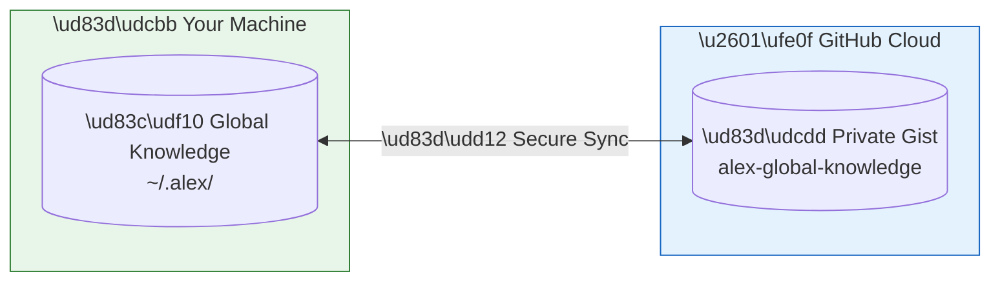
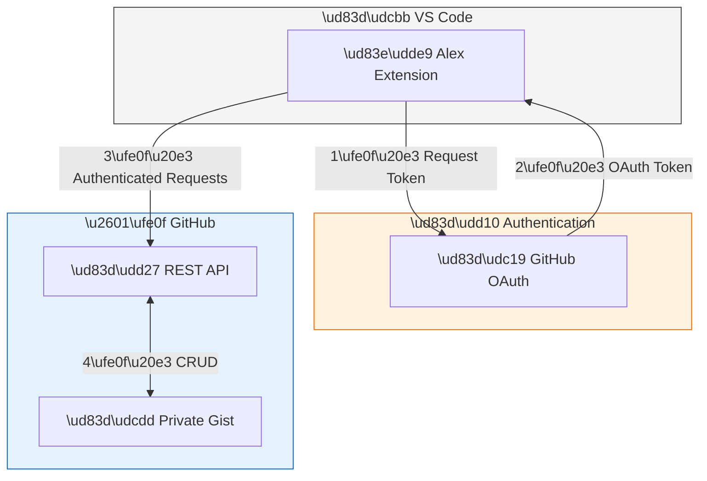
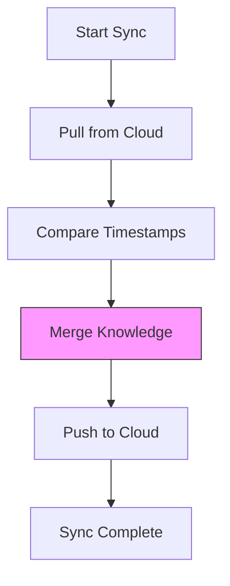
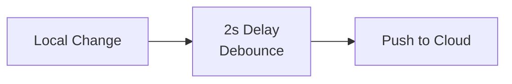
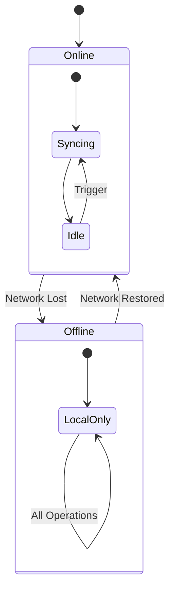
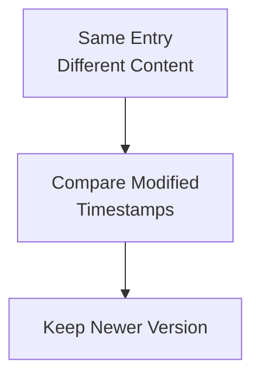

# ☁️ Cloud Sync

> Your knowledge, everywhere you code

---

## Overview

**Cloud Sync** backs up your global knowledge to GitHub Gist, enabling:

- **Backup**: Protect your insights from data loss
- **Sharing**: Access knowledge across multiple machines
- **Portability**: Take your learnings wherever you go



**Figure 1:** *Cloud Sync Architecture - Secure bidirectional sync between local and GitHub Gist*

---

## How It Works

### Storage Format

Knowledge is stored in a **private GitHub Gist** containing:

**Table 1:** *GitHub Gist Storage Files*

| File | Purpose |
| --- | --- |
| `alex-global-knowledge-index.json` | Master index of all knowledge |
| `alex-global-knowledge-patterns.json` | All patterns (GK-*) |
| `alex-global-knowledge-insights.json` | All insights (GI-*) |

### Authentication

Cloud sync uses **VS Code's GitHub Authentication**:

1. No separate login required
2. Uses existing GitHub credentials
3. Secure token-based access
4. Automatic token refresh



**Figure 2:** *Authentication Flow - VS Code OAuth integration with GitHub*

---

## Sync Types

### Manual Sync

User-initiated, full bidirectional sync:

```text
@alex /sync
```

Or command palette:

```text
Alex: Sync Knowledge to Cloud
```

### Background Sync (Unconscious)

Automatic sync running in the background:

**Table 2:** *Background Sync Triggers and Timing*

| Trigger | Timing | Type |
| --- | --- | --- |
| **Startup** | 10 seconds after activation | Pull + Push |
| **Periodic** | Every 5 minutes | Pull + Push |
| **Post-Modification** | 2 seconds after save/promote | Push |

```mermaid
gantt
    title Background Sync Timeline
    dateFormat ss
    axisFormat %S

    section Startup
    Extension activates : done, 0, 0
    Startup sync : 10, 13

    section Periodic
    First interval : 300, 303
    Second interval : 600, 603

    section Post-Modification
    Save insight : crit, 200, 200
    Trigger sync : 202, 205
```



**Figure 3:** *Background Sync Timeline - Startup, periodic, and modification-triggered syncs*

---

## Sync Algorithm

### Full Sync (Bidirectional)



**Figure 4:** *Full Sync Algorithm - Bidirectional merge with timestamp-based conflict resolution*

**Merge Strategy:**

1. **Both have entry**: Keep newer (by `modified` timestamp)
2. **Only local has entry**: Upload to cloud
3. **Only cloud has entry**: Download to local

### Push-Only Sync

After local modifications, only pushes changes:



**Figure 5:** *Push-Only Sync - Debounced upload after local modifications*

---

## Sync Status

### Viewing Status

In the global knowledge status output:

```text
@alex /knowledgestatus
```

Shows:

```text
┌──────────────────────────────────────────────────┐
│              Cloud Sync Status                   │
├──────────────────────────────────────────────────┤
│  Status:           ✅ Connected                  │
│  Last Sync:        2026-01-24 10:30:00          │
│  Gist URL:         https://gist.github.com/...   │
│  Background Sync:  ✅ Active                     │
└──────────────────────────────────────────────────┘
```

### Output Channel

Detailed sync logs in **"Alex Unconscious Mind"** output channel:

```text
[2026-01-24 10:30:00] Background sync starting...
[2026-01-24 10:30:01] Pulled 5 entries from cloud
[2026-01-24 10:30:02] Merged 2 new insights
[2026-01-24 10:30:03] Pushed 3 updates to cloud
[2026-01-24 10:30:03] Background sync complete
```

### Status Indicators

**Table 3:** *Cloud Sync Status Indicators*

| Indicator | Meaning |
| --- | --- |
| ✅ Connected | Cloud sync is working |
| ⏳ Syncing | Sync in progress |
| ⚠️ Pending | Changes waiting to sync |
| ❌ Disconnected | No GitHub auth |
| 🔄 Background Active | Auto-sync enabled |

---

## First-Time Setup

### Automatic

Cloud sync configures itself automatically:

1. On first save/sync, creates private Gist
2. Stores Gist ID in `index.json`
3. Subsequent syncs use existing Gist

### Manual Connection

To connect a new machine to existing knowledge:

1. Run `Alex: Pull Knowledge from Cloud`
2. VS Code prompts for GitHub auth
3. Downloads existing Gist data
4. Merges with any local knowledge

---

## Data Privacy

### What's Stored

- Knowledge index (metadata)
- Pattern content
- Insight content
- Sync timestamps

### What's NOT Stored

- Source code
- Credentials
- File paths
- Project content

### Privacy Settings

The Gist is created as **private** by default:

- Only you can see it
- Not searchable
- Not public on your profile

---

## Offline Behavior



**Figure 6:** *Offline Behavior State Diagram - Graceful degradation when network is unavailable*

**When offline:**

- All local operations work normally
- Changes queue for next sync
- Periodic sync attempts in background
- Reconnection triggers full sync

---

## Conflict Resolution

When both local and cloud have changes to the same entry:



**Figure 7:** *Conflict Resolution - Timestamp-based last-write-wins strategy*

**Strategy:** Newest wins (last-write-wins)

- Compares `modified` timestamps
- Most recent change is preserved
- Older version is overwritten

---

## Commands Reference

**Table 4:** *Cloud Sync Commands*

| Command | Description | Trigger |
| --- | --- | --- |
| `@alex /sync` | Full bidirectional sync | Chat |
| `Alex: Sync Knowledge to Cloud` | Full bidirectional sync | Command Palette |
| `alex_cloud_sync` | Programmable sync tool | MCP Tool |

### Tool Parameters

```typescript
{
  action: 'sync' | 'push' | 'pull'
}
```

**Table 5:** *Cloud Sync Tool Actions*

| Action | Description |
| --- | --- |
| `sync` | Bidirectional merge (default) |
| `push` | Upload local → cloud only |
| `pull` | Download cloud → local only |

---

## Troubleshooting

### "Not signed in to GitHub"

1. Open Command Palette
2. Run "GitHub: Sign In"
3. Complete OAuth flow
4. Retry sync

### "Gist not found"

The Gist may have been deleted:

1. Run `@alex /sync` to create new Gist
2. Or manually check GitHub Gists page

### "Rate limit exceeded"

GitHub API has rate limits:

1. Wait 15-60 minutes
2. Background sync will retry automatically
3. Avoid frequent manual syncs

### "Merge conflicts"

Conflicts are auto-resolved by timestamp. If you lost data:

1. Check "Alex Unconscious Mind" output for details
2. Cloud version may have newer changes
3. Re-save important local changes

### "Sync taking too long"

For large knowledge bases:

1. Check network connection
2. View output channel for progress
3. Consider cleaning old entries

---

## Best Practices

### Multi-Machine Workflow

1. **Primary machine**: Do most knowledge creation
2. **Secondary machines**: Pull frequently
3. **Before switching**: Wait for sync to complete
4. **After switching**: Pull before working

### Backup Strategy

Even with cloud sync:

1. Cloud sync is your primary backup
2. Index.json contains Gist URL
3. Can manually export from GitHub Gists

### Knowledge Hygiene

- Review and clean old insights periodically
- Update patterns that have evolved
- Remove outdated or incorrect entries

---

*Cloud Sync - Your Knowledge, Everywhere*
