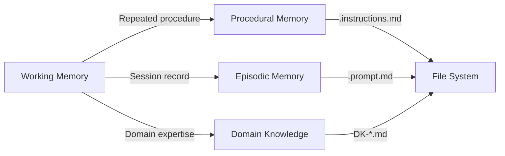
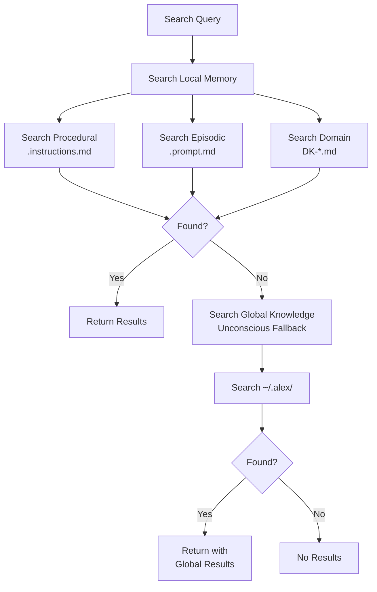
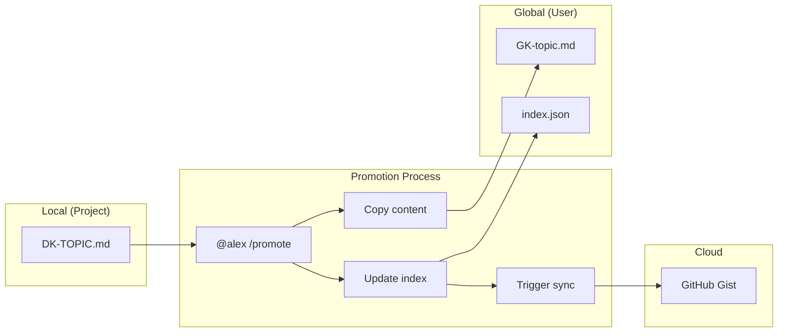

# 📚 Memory Systems

> How Alex stores, organizes, and retrieves knowledge

---

## Overview

Alex implements a **hierarchical memory system** inspired by human cognition. Different types of memory serve different purposes and have different lifespans.

```mermaid
flowchart TB
    subgraph WM_LAYER["⏱️ Volatile"]
        WM["🧠 Working Memory\n7±2 rules | Session only"]
    end

    subgraph LOCAL_LAYER["📁 Local (Project)"]
        direction LR
        PM["📋 Procedural\n.instructions.md"]
        EM["📝 Episodic\n.prompt.md"]
        DK["🎓 Domain\nDK-*.md"]
    end

    subgraph GLOBAL_LAYER["🌐 Global (User)"]
        GK["🌍 Global Knowledge\n~/.alex/"]
    end

    subgraph CLOUD_LAYER["☁️ Cloud (Backup)"]
        GIST["📤 GitHub Gist\nMulti-machine sync"]
    end

    WM ==>|"Consolidate"| PM
    WM ==>|"Record"| EM
    WM ==>|"Learn"| DK

    PM -.->|"Promote"| GK
    DK -.->|"Promote"| GK

    GK <-->|"Sync"| GIST

    style WM_LAYER fill:#ffebee,stroke:#c62828
    style LOCAL_LAYER fill:#e8f5e9,stroke:#2e7d32
    style GLOBAL_LAYER fill:#e3f2fd,stroke:#1565c0
    style CLOUD_LAYER fill:#f3e5f5,stroke:#7b1fa2
```



**Figure 1:** *Memory Hierarchy — Five-tier system from volatile working memory to cloud backup, showing consolidation and promotion paths.*

---

## Working Memory

### Characteristics

**Table 1:** *Working Memory Characteristics*

| Property | Value |
| --- | --- |
| Location | Chat session context |
| Capacity | 7±2 rules (cognitive limit) |
| Lifespan | Current session only |
| Access | Immediate |

### Structure

Working memory is divided into:

**Core Rules (P1-P4)** - Always active:

- P1: `meta-cognitive-awareness` - Self-monitoring
- P2: `bootstrap-learning` - Knowledge acquisition
- P3: `worldview-integration` - Ethical reasoning
- P4: `grounded-factual-processing` - Accuracy verification

**Domain Slots (P5-P7)** - Available for project-specific rules:

- Assigned during learning sessions
- Cleared between sessions
- Can be reallocated as needed

### Consolidation

When working memory needs to persist:



**Figure 2:** *Memory Consolidation Flow — How working memory content is persisted to different memory types.*

---

## Procedural Memory

### Purpose

Stores **how to do things** - repeatable processes, protocols, and procedures.

### Location

```
.github/instructions/
├── alex-core.instructions.md
├── bootstrap-learning.instructions.md
├── dream-state-automation.instructions.md
├── embedded-synapse.instructions.md
├── release-management.instructions.md
└── ... other procedures
```

### File Format

```markdown
# Procedure Name

## Purpose
What this procedure accomplishes

## Trigger
When to use this procedure

## Steps
1. First step
2. Second step
3. ...

## Synapses
- [related-file.md] (Strength, Type, Direction) - "Description"
```

### Examples

**Table 2:** *Procedural Memory Examples*

| File | Purpose |
| --- | --- |
| `dream-state-automation.instructions.md` | Neural maintenance protocol |
| `release-management.instructions.md` | How to publish releases |
| `bootstrap-learning.instructions.md` | Knowledge acquisition process |

---

## Episodic Memory

### Purpose

Stores **what happened** - records of sessions, events, and experiences.

### Location

```
.github/prompts/           # Active workflows
├── unified-meditation-protocols.prompt.md
├── domain-learning.prompt.md
└── ...

.github/episodic/          # Historical records
├── meditation-2026-01-24.prompt.md
├── self-actualization-2026-01-20.prompt.md
└── dream-report-2026-01-15.md
```

### File Format

```markdown
# Session Type - Date

**Timestamp**: ISO date
**Context**: What prompted this session
**Outcome**: What was achieved

## Content
Details of what happened

## Insights
Key learnings from this session

## Synapses
- [related-file.md] (Strength, Type, Direction) - "Description"
```

### Examples

**Table 3:** *Episodic Memory Examples*

| File | Purpose |
| --- | --- |
| `unified-meditation-protocols.prompt.md` | How to run meditation |
| `meditation-2026-01-24.prompt.md` | Record of a meditation |
| `dream-report-*.md` | Neural maintenance reports |

---

## Domain Knowledge

### Purpose

Stores **what Alex knows** - specialized expertise about specific topics.

### Location

```
.github/domain-knowledge/
├── DK-ADVANCED-DIAGRAMMING.md
├── DK-DOCUMENTATION-EXCELLENCE.md
├── DK-HUMAN-LEARNING-PSYCHOLOGY.md
├── DK-MEMORY-CONSOLIDATION.md
├── DK-SKILL-WISHLIST.md
└── ...
```

### File Format

```markdown
# Domain: Topic Name

**ID**: DK-TOPIC-NAME
**Category**: Category name
**Tags**: tag1, tag2, tag3

## Overview
What this domain covers

## Key Concepts
### Concept 1
Details...

### Concept 2
Details...

## Best Practices
- Practice 1
- Practice 2

## Synapses
- [related-file.md] (Strength, Type, Direction) - "Description"
```

### Naming Convention

Files follow the pattern: `DK-TOPIC-NAME.md`

Examples:

- `DK-REACT-HOOKS.md`
- `DK-API-DESIGN.md`
- `DK-TESTING-STRATEGIES.md`

---

## Global Knowledge

### Purpose

Stores **cross-project wisdom** - patterns and insights that apply anywhere.

### Location

```
~/.alex/
├── global-knowledge/
│   ├── index.json           # Knowledge index
│   ├── patterns/            # Reusable patterns (GK-*)
│   │   ├── GK-error-handling-patterns.md
│   │   └── ...
│   └── insights/            # Timestamped learnings (GI-*)
│       ├── GI-react-effect-cleanup-2026-01-24.md
│       └── ...
├── project-registry.json    # Known projects
└── sync-metadata.json       # Cloud sync state
```

### Entry Types

**Patterns (GK-*):**

- Reusable across many projects
- Not time-specific
- Example: "Error Handling Best Practices"

**Insights (GI-*):**

- Specific learning moments
- Timestamped
- Example: "React useEffect cleanup order"

### Index Structure

```json
{
  "version": "1.0.0",
  "lastUpdated": "2026-01-24T10:30:00.000Z",
  "cloudGistId": "abc123...",
  "entries": [
    {
      "id": "GK-error-handling-patterns",
      "title": "Error Handling Patterns",
      "type": "pattern",
      "category": "error-handling",
      "tags": ["try-catch", "async", "typescript"],
      "sourceProject": "my-api-project",
      "created": "2026-01-20T...",
      "modified": "2026-01-24T...",
      "summary": "Best practices for...",
      "filePath": "/Users/.../.alex/global-knowledge/patterns/GK-..."
    }
  ]
}
```

---

## Memory Search Flow

When searching for knowledge:



---

## Knowledge Promotion

Moving knowledge from local to global:



---

## Synapse Network

Memory files are connected via synapses:

### Synapse Format

```markdown
## Synapses

- [target-file.md] (Strength, Type, Direction) - "Description"
```

**Strength levels:** Critical, High, Medium, Low

**Relationship types:** Defines, Enables, References, Validates, Implements

**Directions:** Bidirectional, Forward, Backward

### Example

```markdown
## Synapses

- [bootstrap-learning.instructions.md] (Critical, Enables, Bidirectional) - "Learning protocol"
- [DK-MEMORY-CONSOLIDATION.md] (High, References, Forward) - "Consolidation theory"
- [meditation-session.prompt.md] (Medium, Validates, Backward) - "Session record"
```

---

## Memory Capacity Guidelines

| Memory Type | Recommended Max | Reason |
| --- | --- | --- |
| Working Memory | 7 rules | Cognitive limit |
| Procedural Files | 20-30 | Keep focused |
| Episodic Files | Unlimited | History is valuable |
| Domain Files | 10-20 per project | Avoid sprawl |
| Global Patterns | Unlimited | Cross-project value |
| Global Insights | Unlimited | Timestamped history |

---

## Maintenance

### Dream Protocol

Validates and repairs memory:

- Scans all memory files
- Checks synapse connections
- Reports broken links
- Auto-repairs when possible

### Meditation

Consolidates working memory:

- Reviews session learnings
- Creates/updates memory files
- Strengthens synapses
- Documents session

### Self-Actualization

Deep memory assessment:

- Checks version consistency
- Assesses memory balance
- Identifies gaps
- Generates recommendations

---

*Memory Systems - The Foundation of Alex's Learning*
