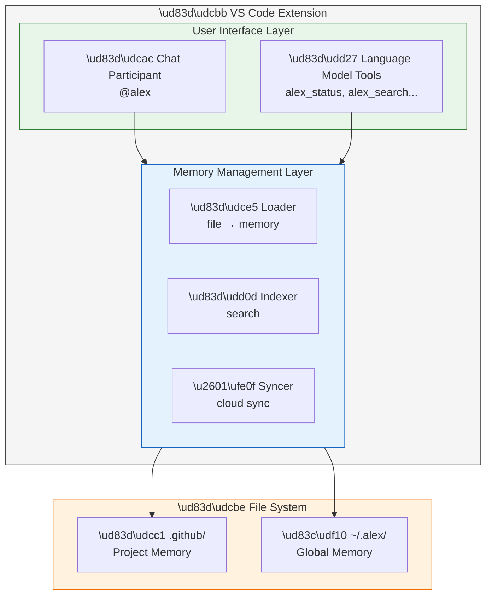

# Architecture Patterns for AI Assistants with Persistent Memory: Experience Building the Alex Cognitive System

**Fabio Correa**
CorreaX Research
*Submitted to IEEE Software*

---

## Abstract

Current AI programming assistants operate statelessly, losing context and learned knowledge between sessions. This paper presents architecture patterns for building AI assistants with persistent memory, derived from 18 months of developing and deploying the Alex Cognitive Architecture as a Visual Studio Code extension. We describe a four-tier memory hierarchy (working, procedural, episodic, domain), a dual-process model separating conscious (user-initiated) from unconscious (automatic) operations, and cloud synchronization patterns for cross-machine knowledge persistence. The implementation leverages VS Code's Extension API, GitHub Copilot Chat Participant API, and Language Model Tools API. Key findings include the effectiveness of human-readable memory files for transparency and debugging, the importance of memory consolidation protocols for knowledge quality, and patterns for graceful degradation when memory systems fail. We contribute actionable architecture guidance for practitioners building the next generation of AI development tools.

---

## Introduction

AI programming assistants have become integral to software development workflows. GitHub Copilot, Amazon CodeWhisperer, and similar tools demonstrate that large language models (LLMs) can effectively assist with code generation, explanation, and debugging. Yet these tools share a fundamental architectural limitation: statelessness.

Each interaction begins without context from previous sessions. Developers repeatedly re-explain project conventions, architectural decisions, and personal preferences. Knowledge discovered during one session—debugging insights, useful patterns, domain expertise—vanishes when the session ends.

This paper describes architecture patterns that address these limitations, derived from building and deploying Alex, a VS Code extension that augments GitHub Copilot with persistent memory. Over 18 months of development and daily use, we've identified patterns that work, pitfalls to avoid, and trade-offs inherent in adding memory to LLM-based systems.

Our contributions include:
- A **four-tier memory hierarchy** separating concerns by persistence and access patterns
- A **dual-process model** distinguishing user-initiated from automatic operations
- **Cloud synchronization patterns** for cross-machine knowledge persistence
- **Implementation patterns** using VS Code's modern extension APIs
- **Lessons learned** from production deployment

---

## Architecture Overview

### Design Principles

Four principles guided Alex's architecture:

**1. Transparency over Opacity**
All persistent state is stored in human-readable files. Developers can inspect, edit, and version-control what the AI knows. No hidden databases.

**2. Graceful Degradation**
If memory systems fail, the AI falls back to stateless operation. Users never lose core functionality due to memory issues.

**3. Separation of Concerns**
Different memory types (procedural, episodic, domain) are stored separately with distinct file patterns, enabling selective loading and maintenance.

**4. User Control**
Automatic operations are visible and overridable. Users can disable any automatic behavior and manually trigger any maintenance operation.

### High-Level Architecture



**Figure 1:** *High-Level Architecture - VS Code extension with user interface layer, memory management, and file system storage*

---

## Memory Hierarchy

### Tier 1: Working Memory (Session State)

Working memory represents the current conversation context—what the AI is "thinking about" right now. We implement working memory constraints modeled on human cognition: 4 core rules plus 3 domain-specific slots, totaling 7±2 active concepts.

**Implementation**: Working memory exists only in the chat session. No persistence required. The constraint is enforced through prompt engineering—the system prompt explicitly limits active rules.

**Pattern**: *Capacity-Constrained Session State*
Explicitly limit the number of concepts active in any session. This prevents context window overflow while maintaining coherence.

### Tier 2: Procedural Memory (.instructions.md)

Procedural memories encode *how* to do things—coding standards, build processes, deployment workflows. These are skills that should activate automatically when relevant.

**File Pattern**:

```markdown
# release-management.instructions.md

## Trigger Conditions
- User mentions "release", "deploy", "ship"
- Current branch is main/master

## Procedure
1. Verify all tests pass
2. Update version numbers in package.json
3. Generate CHANGELOG.md entry
...

## Synapses
- [dependency-management.instructions.md] → Check updates first
```

**Figure 3:** *Procedural memory file format — trigger conditions with step-by-step procedure and synaptic links*

**Pattern**: *Triggered Procedural Rules*
Include explicit trigger conditions in procedural memories. This enables automatic activation when context matches, reducing user prompting burden.

### Tier 3: Episodic Memory (.prompt.md)

Episodic memories record specific experiences—debugging sessions, design discussions, learning episodes. They provide context for understanding *why* certain decisions were made.

**File Pattern**:

```markdown
# authentication-redesign.prompt.md

## Date
2026-01-15

## Context
Legacy auth system using session tokens hitting scale limits.

## Discussion
Evaluated JWT vs session tokens vs OAuth...

## Decision
Adopted JWT with refresh token rotation...

## Lessons Learned
- Token expiry testing requires time mocking
```

**Figure 4:** *Episodic memory file format — timestamped experience with context, discussion, and lessons learned*

**Pattern**: *Timestamped Experience Records*
Include temporal context in episodic memories. This enables recency-based retrieval and helps identify outdated information.

### Tier 4: Domain Knowledge (DK-*.md)

Domain knowledge captures expertise about specific topics—frameworks, patterns, domain concepts. This is semantic memory that provides background knowledge for reasoning.

**File Pattern**:

```markdown
# DK-DEPENDENCY-INJECTION.md

## Overview
Inversion of Control pattern where dependencies are provided...

## Key Concepts
- Constructor injection (preferred)
- Property injection
- Interface segregation

## Project-Specific Notes
We use Autofac with module registration...

## Synapses
- [DK-SOLID-PRINCIPLES] → ISP connection
```

**Figure 5:** *Domain knowledge file format — expertise with general concepts and project-specific annotations*

**Pattern**: *Structured Domain Expertise*
Separate general knowledge from project-specific notes within domain files. This enables knowledge reuse across projects while preserving local customizations.

---

## Global Knowledge Architecture

Beyond project-local memory, Alex maintains a global knowledge base that persists across all projects:

```
~/.alex/
├── global-knowledge/
│   ├── patterns/           # Reusable patterns (GK-*.md)
│   │   └── GK-error-handling-strategies.md
│   ├── insights/           # Timestamped learnings (GI-*.md)
│   │   └── GI-react-cleanup-2026-01-24.md
│   └── index.json          # Searchable catalog
└── project-registry.json   # Known projects metadata
```

**Figure 2:** *Global Knowledge Structure — Cross-project knowledge organization in user home directory*

**Pattern**: *Hierarchical Knowledge Scoping*
Maintain both project-local and global knowledge stores. Implement automatic fallback from local to global when searches return insufficient results.

### Cloud Synchronization

Global knowledge syncs to GitHub Gist for cross-machine persistence:

```typescript
interface SyncOperation {
  action: 'push' | 'pull' | 'sync';
  strategy: 'newer-wins' | 'manual-merge';
}

async function syncWithCloud(operation: SyncOperation) {
  const local = await loadLocalIndex();
  const cloud = await fetchCloudIndex();

  if (operation.action === 'sync') {
    // Three-way merge: local, cloud, common ancestor
    const merged = mergeKnowledge(local, cloud, {
      conflictResolution: operation.strategy
    });
    await writeLocal(merged);
    await pushToCloud(merged);
  }
}
```

**Figure 6:** *Cloud synchronization implementation — three-way merge with configurable conflict resolution*

**Pattern**: *Conflict-Free Knowledge Merge*
Use timestamps for conflict resolution. Each insight has a unique ID; when the same ID exists locally and remotely, newer timestamp wins.

---

## Dual-Process Model

Alex distinguishes "conscious" (user-initiated) from "unconscious" (automatic) operations:

### Conscious Operations
- Explicit commands: `/meditate`, `/dream`, `/status`
- Direct queries and requests
- Manual memory file editing

### Unconscious Operations
- Background cloud sync (every 5 minutes)
- Auto-insight detection during conversations
- Automatic fallback to global knowledge
- Periodic health checks

**Implementation**:

```typescript
// Unconscious: Background sync timer
let syncInterval: NodeJS.Timeout;

export function activate(context: vscode.ExtensionContext) {
  // Start unconscious processes
  syncInterval = setInterval(async () => {
    await backgroundSync();
  }, 5 * 60 * 1000); // 5 minutes

  // Register conscious commands
  context.subscriptions.push(
    vscode.commands.registerCommand('alex.meditate', meditateCommand)
  );
}
```

**Figure 7:** *Dual-process implementation — automatic background sync with explicit command registration*

**Pattern**: *Explicit Operation Classification*
Document which operations are automatic vs. user-initiated. Provide visibility into automatic operations (e.g., status indicators) and allow users to disable any automatic behavior.

---

## VS Code Integration Patterns

### Chat Participant Registration

```typescript
const participant = vscode.chat.createChatParticipant(
  'alex-cognitive-architecture.alex',
  async (request, context, stream, token) => {
    // Load relevant memories based on request
    const memories = await loadRelevantMemories(request.prompt);

    // Inject memories into system prompt
    const systemPrompt = buildSystemPrompt(memories);

    // Forward to language model with context
    const response = await vscode.lm.chat(
      systemPrompt,
      request.prompt,
      { token }
    );

    // Stream response
    for await (const chunk of response) {
      stream.markdown(chunk);
    }

    // Unconscious: Check for insights worth saving
    await detectInsights(request.prompt, response);
  }
);
```

**Figure 8:** *Chat participant registration — memory-augmented response with automatic insight detection*

### Language Model Tools

Tools expose memory capabilities to the AI itself:

```typescript
const tools: vscode.LanguageModelTool[] = [
  {
    name: 'alex_memory_search',
    description: 'Search Alex memory files for relevant knowledge',
    parametersSchema: {
      type: 'object',
      properties: {
        query: { type: 'string' },
        memoryType: {
          type: 'string',
          enum: ['procedural', 'episodic', 'domain', 'all']
        }
      }
    },
    invoke: async (params) => {
      return await searchMemories(params.query, params.memoryType);
    }
  }
];
```

**Figure 9:** *Language Model Tool registration — exposing memory search as an AI-invocable tool*

**Pattern**: *Self-Accessible Memory*
Expose memory operations as tools the AI can invoke. This enables the AI to search its own knowledge proactively rather than relying solely on prompt injection.

---

## Lessons Learned

### What Worked

**Human-Readable Files**: Storing memories as markdown files proved invaluable for debugging, user trust, and version control integration. Users appreciated being able to inspect and edit what Alex "knew."

**Explicit Trigger Conditions**: Procedural memories with trigger conditions enabled contextual activation without user prompting. The release management procedure activates automatically when users mention deployment.

**Graceful Degradation**: When memory loading failed (file corruption, sync issues), falling back to stateless operation maintained usability. Users never lost core functionality.

### What Didn't Work

**Implicit Memory Capture**: Early versions attempted to automatically extract and persist insights from every conversation. This produced low-quality, redundant memories. Explicit consolidation sessions ("meditation") produce better results.

**Flat Memory Structure**: Initial designs used a single memories folder. Separating by type (procedural, episodic, domain) significantly improved retrieval relevance.

**Aggressive Automation**: Highly automated memory maintenance annoyed users who wanted control. The current balance—automatic background sync, manual consolidation—emerged through iteration.

### Trade-offs

**Transparency vs. Efficiency**: Human-readable markdown is less efficient than binary storage but dramatically improves debuggability and user trust.

**Completeness vs. Quality**: Capturing everything produces noise. Curated capture through explicit consolidation sacrifices completeness for higher signal-to-noise ratio.

**Automation vs. Control**: More automation reduces user burden but can feel invasive. Our dual-process model balances these tensions.

---

## Performance Considerations

### Memory Loading

Memory files are loaded on-demand based on relevance matching:

```typescript
async function loadRelevantMemories(query: string): Promise<Memory[]> {
  const index = await loadMemoryIndex();

  // Score memories by relevance
  const scored = index.entries.map(entry => ({
    entry,
    score: computeRelevance(entry, query)
  }));

  // Load top-N most relevant
  const top = scored.sort((a, b) => b.score - a.score).slice(0, 10);

  return Promise.all(top.map(t => loadMemoryFile(t.entry.path)));
}
```

**Figure 10:** *Relevance-based memory loading — scoring and retrieving the most relevant memories*

### Index Maintenance

The memory index is updated incrementally:
- **On file save**: Update single entry
- **On startup**: Validate index against file system
- **On sync**: Merge cloud updates

---

## Conclusion

Building AI assistants with persistent memory requires careful architectural attention to concerns that stateless systems ignore: memory hierarchy, consolidation processes, synchronization, and user control. The patterns presented here—derived from 18 months of production use—provide practitioners with actionable guidance for building the next generation of AI development tools.

The transition from stateless AI tools to learning AI partners isn't primarily a machine learning challenge—it's a software architecture challenge. The patterns that work resemble those from other persistent systems (databases, caches, distributed systems) more than they resemble typical ML architectures.

As AI assistants become central to development workflows, memory architecture will differentiate tools that users abandon after the novelty fades from tools that become indispensable partners. The patterns presented here offer one path toward the latter.

---

## References

[Standard IEEE Software format references - abbreviated for length]

---

*Fabio Correa is an independent software architect focused on AI-augmented development tools. Contact: github.com/fabioc-aloha/Alex_Plug_In*

---

*Word count: ~2,400 (within IEEE Software article limits)*
