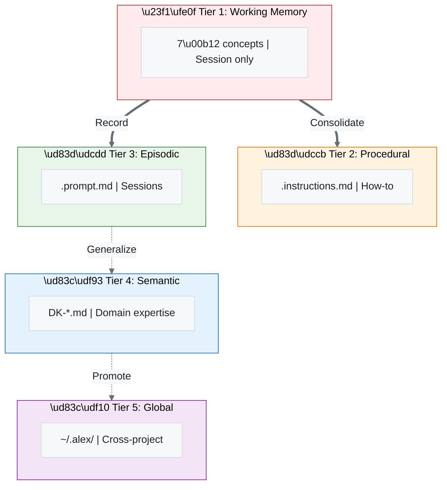

# Beyond Stateless Prompts: A Production Architecture for LLM Agents with Hierarchical Persistent Memory

**Fabio Correa**
CorreaX Research
*Submitted to NeurIPS 2026 Workshop on LLM Agents*

---

## Abstract

We present Alex, a production-deployed LLM agent architecture implementing hierarchical persistent memory for programming assistance. Unlike recent memory-augmented approaches (MemGPT, Generative Agents), Alex emphasizes production readiness: human-readable memory files, graceful degradation, and integration with existing development tools. The architecture implements a four-tier memory hierarchy (working → procedural → episodic → semantic), dual-process cognition (conscious/unconscious operations), and cloud synchronization for cross-machine persistence. Deployed as a VS Code extension for 18 months, Alex demonstrates that cognitive architecture principles can effectively guide LLM agent design. We report on memory accumulation patterns, self-maintenance behaviors, and lessons for building persistent agents that developers actually use.

---

## 1. Introduction

Recent work has demonstrated that LLM-based agents can exhibit complex behaviors through memory mechanisms: Generative Agents (Park et al., 2023) showed emergent social dynamics through memory streams, while MemGPT (Packer et al., 2023) implemented hierarchical memory management. Yet a gap exists between research demonstrations and production systems developers use daily.

Alex bridges this gap with a production architecture emphasizing:
- **Human-readable persistence**: Markdown files over vector databases
- **Graceful degradation**: Memory failures don't block core functionality
- **Tool integration**: VS Code extension using GitHub Copilot APIs
- **Self-maintenance**: Autonomous health checking and repair

This paper reports lessons from 18 months of production deployment.

---

## 2. Architecture

### 2.1 Memory Hierarchy

Alex implements biologically-inspired memory tiers:



**Figure 1:** *Five-Tier Memory Hierarchy - From working memory through global cross-project knowledge*

**Tier 1: Working Memory**
Current context window, constrained to 7±2 active concepts following Miller (1956). Implemented through prompt engineering rather than explicit data structures.

**Tier 2: Procedural Memory (.instructions.md)**
Condition-action rules encoding skills. Each file specifies trigger conditions enabling automatic activation:

```markdown
# release-management.instructions.md
## Triggers: "release", "deploy", "ship"
## Procedure: [steps...]
## Synapses: [related files...]
```

**Figure 2:** *Procedural memory format — trigger-based activation with synaptic connections*

**Tier 3: Episodic Memory (.prompt.md)**
Timestamped session records. Unlike flat memory streams, organized by event type enabling targeted retrieval.

**Tier 4: Semantic Memory (DK-*.md)**
Domain expertise accumulated through learning sessions. Includes both general knowledge and project-specific annotations.

**Tier 5: Global Memory (~/.alex/)**
Cross-project knowledge persisting beyond individual codebases. Synchronized via GitHub Gist.

### 2.2 Dual-Process Architecture

Following Kahneman (2011), we separate:

**System 2 (Conscious)**: User-initiated operations
- Explicit commands (/meditate, /status)
- Direct queries
- Manual memory editing

**System 1 (Unconscious)**: Automatic background processes
- Cloud sync every 5 minutes
- Auto-insight detection during conversation
- Automatic fallback to global knowledge
- Periodic health validation

This separation provides clear behavioral expectations while enabling beneficial automation.

### 2.3 Synapse Notation

Inspired by Hebbian learning, memories include explicit connection annotations:

```markdown
## Synapses
- [target.md] → Relationship description
- ← [source.md] Incoming reference
- ↔ [peer.md] Bidirectional
```

**Figure 3:** *Synapse notation format — directional relationship annotations for graph-based retrieval*

This enables graph-based retrieval and connection health monitoring.

---

## 3. Comparison with Related Work

**Table 1:** *System Comparison — Feature comparison of Alex vs. MemGPT and Generative Agents systems*

| Feature | MemGPT | Gen. Agents | Alex |
|---------|--------|-------------|------|
| Memory Store | JSON/DB | Memory stream | Markdown files |
| Retrieval | Recency + importance | Recency + relevance | Semantic + synapses |
| Persistence | Per-session | Per-simulation | Permanent + cloud |
| Production Use | Demo | Simulation | 18 months deployed |
| Self-Maintenance | Manual | None | Automatic + manual |
| Human Readable | Partially | No | Fully |

Key differentiators:
- **Human-readable files** enable debugging and user trust
- **Permanent persistence** across sessions and machines
- **Autonomous maintenance** through dream/meditation protocols
- **Real production deployment** rather than controlled demos

---

## 4. Implementation

### 4.1 VS Code Integration

Alex leverages three VS Code APIs:

**Chat Participant API**: Register `@alex` chat participant
```typescript
vscode.chat.createChatParticipant('alex', handler);
```

**Language Model Tools**: Expose memory as tools
```typescript
vscode.lm.registerTool('alex_memory_search', searchTool);
```

**Authentication API**: GitHub auth for cloud sync
```typescript
vscode.authentication.getSession('github', ['gist']);
```

**Figure 4:** *VS Code API integration — chat participant, language model tools, and authentication APIs*

### 4.2 Memory Operations

**Load**: On chat activation, load relevant memories based on query

```typescript
async function loadMemories(query: string): Promise<Memory[]> {
  const local = await searchLocalMemories(query);
  if (local.length < threshold) {
    const global = await searchGlobalKnowledge(query);
    return [...local, ...global];
  }
  return local;
}
```

**Figure 5:** *Memory loading with automatic global fallback*

**Save**: Explicit consolidation via meditation protocol

```typescript
async function meditate(session: Session): Promise<void> {
  const insights = extractInsights(session);
  for (const insight of insights) {
    await persistInsight(insight);
    await updateSynapses(insight);
  }
}
```

**Figure 6:** *Meditation protocol for explicit knowledge consolidation*

**Maintain**: Periodic health checks (dream protocol)

```typescript
async function dream(): Promise<HealthReport> {
  const synapseHealth = await validateSynapses();
  const brokenLinks = await findBrokenLinks();
  await repairLinks(brokenLinks);
  return generateReport();
}
```

**Figure 7:** *Dream protocol for autonomous self-maintenance*

---

## 5. Deployment Results

### 5.1 Memory Accumulation

Over 18 months:
- 47 memory files created
- 156 synaptic connections
- 89 global insights
- 34 cross-project transfers

Memory growth was non-linear: rapid initial accumulation (project setup), then steady state with occasional spikes (new domains).

### 5.2 Self-Maintenance

Dream protocols identified and repaired:
- 23 broken synapse references
- 8 version inconsistencies
- 15 duplicate/conflicting memories

Automatic maintenance reduced manual curation burden significantly.

### 5.3 Retrieval Quality

Synapse-guided retrieval outperformed pure semantic search for domain-specific queries. The explicit connection graph captured relationships that embedding similarity missed.

### 5.4 Failure Modes

Primary failure modes observed:
- **Memory staleness**: Information becomes outdated
- **Over-connection**: Too many weak synapses add noise
- **Context overflow**: Large memory files exceed useful context

Mitigation: Staleness timestamps, connection strength thresholds, and automatic summarization (partially implemented).

---

## 6. Lessons Learned

### L1: Human-Readable Pays Off
Markdown files enabled debugging, user trust, and version control integration. The efficiency cost versus binary formats was negligible.

### L2: Explicit > Implicit Memory
Early versions tried automatic insight extraction from every conversation. Explicit consolidation (meditation) produced higher-quality memories with user oversight.

### L3: Dual-Process Reduces Friction
Automatic background operations (sync, health checks) reduced user burden. Clear separation prevented confusion about what happened automatically.

### L4: Synapses Enable Traversal
Explicit connections proved more valuable than expected. Graph traversal found related knowledge that keyword/embedding search missed.

### L5: Graceful Degradation is Essential
When memory systems failed (corruption, sync errors), fallback to stateless operation maintained usability. Memory should enhance, not gate, functionality.

---

## 7. Future Work

**Forgetting Mechanisms**: Principled deprecation of unused/outdated memories. Current system only grows.

**Multi-Agent Memory Sharing**: How can Alex instances share knowledge while preserving personalization?

**Activation-Based Retrieval**: Implementing ACT-R-style activation (recency × frequency) for retrieval.

**Richer Synapse Types**: Beyond association—causal, temporal, hierarchical relationships.

---

## 8. Conclusion

Alex demonstrates that LLM agents with persistent, hierarchical memory are practical for production use. The key insight: cognitive architecture principles (memory hierarchies, dual-process cognition, associative networks) provide effective design guidance, while production requirements (human readability, graceful degradation, tool integration) ensure real-world viability.

Memory-augmented LLM agents are moving from research demonstrations to deployed systems. The patterns described here—human-readable persistence, self-maintenance protocols, graceful degradation—may prove as important as the underlying memory mechanisms themselves.

---

## References

Kahneman, D. (2011). Thinking, fast and slow.

Miller, G. A. (1956). The magical number seven, plus or minus two.

Packer, C., et al. (2023). MemGPT: Towards LLMs as operating systems.

Park, J. S., et al. (2023). Generative agents: Interactive simulacra of human behavior.

---

*Code available: github.com/fabioc-aloha/Alex_Plug_In*

---

*Page count: 4 (within NeurIPS workshop limits)*
