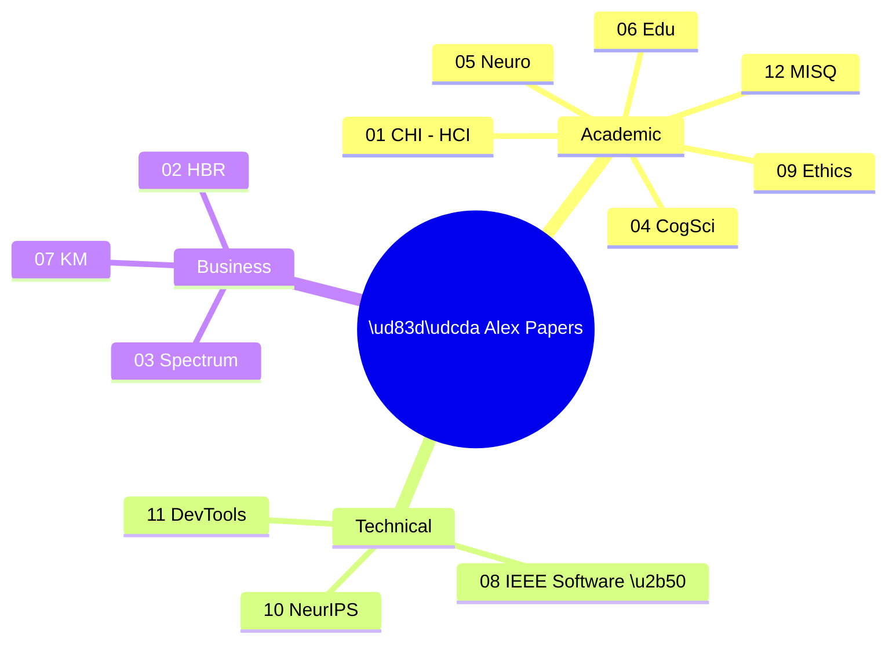

# Article Versions Index

> 12 publication-ready versions of the Alex Cognitive Architecture paper, each optimized for a specific venue and audience.

**Figure 1:** *Alex Paper Variants Mind Map - 12 versions across academic, technical, and business domains*

This folder contains 12 versions of the Alex Cognitive Architecture paper, each adapted for a specific publication venue and narrative angle.

## Quick Reference

**Table 1:** *Publication Versions Overview — All 12 article versions with target venues and word counts*

| # | Angle | Primary Target | File | Word Count |
|---|-------|---------------|------|------------|
| 01 | Human-AI Interaction | CHI Conference | [01-HCI-CHI.md](01-HCI-CHI.md) | ~2,500 |
| 02 | AI Adoption | Harvard Business Review | [02-ADOPTION-HBR.md](02-ADOPTION-HBR.md) | ~1,400 |
| 03 | Future of Work | IEEE Spectrum | [03-FUTURE-WORK-SPECTRUM.md](03-FUTURE-WORK-SPECTRUM.md) | ~1,200 |
| 04 | Cognitive Science | Cognitive Systems Research | [04-COGSCI-COGNITIVE-SYSTEMS.md](04-COGSCI-COGNITIVE-SYSTEMS.md) | ~2,200 |
| 05 | Neuroscience | Frontiers Comp. Neuro | [05-NEUROSCIENCE-FRONTIERS.md](05-NEUROSCIENCE-FRONTIERS.md) | ~2,000 |
| 06 | Learning Psychology | Computers & Education | [06-LEARNING-COMPUTERS-EDUCATION.md](06-LEARNING-COMPUTERS-EDUCATION.md) | ~2,000 |
| 07 | Knowledge Management | J. of Knowledge Management | [07-KNOWLEDGE-MGMT-JKM.md](07-KNOWLEDGE-MGMT-JKM.md) | ~1,800 |
| 08 | Software Architecture | IEEE Software ⭐ | [08-ARCHITECTURE-IEEE-SOFTWARE.md](08-ARCHITECTURE-IEEE-SOFTWARE.md) | ~2,400 |
| 09 | AI Ethics | ACM FAccT | [09-ETHICS-FACCT.md](09-ETHICS-FACCT.md) | ~2,200 |
| 10 | Agent Architectures | NeurIPS Workshop | [10-AGENTS-NEURIPS-WORKSHOP.md](10-AGENTS-NEURIPS-WORKSHOP.md) | ~1,500 |
| 11 | Developer Tools | VS Magazine / The New Stack | [11-DEVTOOLS-PRACTITIONER.md](11-DEVTOOLS-PRACTITIONER.md) | ~1,300 |
| 12 | Organizational Learning | MIS Quarterly | [12-ORG-LEARNING-MISQ.md](12-ORG-LEARNING-MISQ.md) | ~2,200 |
| 13 | Personal Manifesto | Medium / Substack | [13-ALEX-MANIFESTO-PERSONAL.md](13-ALEX-MANIFESTO-PERSONAL.md) | ~4,500 |
| 14 | Manifesto Realization 🆕 | AI/ML Blogs, Medium | [14-MANIFESTO-REALIZATION.md](14-MANIFESTO-REALIZATION.md) | ~3,500 |

⭐ = Recommended starting point

---

## Version Summaries

### 01 - Human-AI Interaction (CHI)
**Framing**: Interaction patterns for AI partners that learn
**Key Themes**: Trust, transparency, user control, personalization
**Target Readers**: HCI researchers, UX designers
**Unique Elements**: Design principles, trust development patterns, interaction challenges

### 02 - AI Adoption (HBR)
**Framing**: From AI tools to AI teammates
**Key Themes**: Adoption lifecycle, ROI, organizational change
**Target Readers**: Technology leaders, executives
**Unique Elements**: Business case, implementation considerations, adoption phases

### 03 - Future of Work (IEEE Spectrum)
**Framing**: The augmented developer
**Key Themes**: Human-AI collaboration, productivity, personal experience
**Target Readers**: Technical professionals, general tech audience
**Unique Elements**: Personal narrative, accessible explanation, vision of the future

### 04 - Cognitive Science (Cognitive Systems Research)
**Framing**: Cognitive architectures for LLM agents
**Key Themes**: ACT-R comparison, memory systems, dual-process theory
**Target Readers**: Cognitive scientists, AI researchers
**Unique Elements**: Detailed architecture comparison, theoretical grounding

### 05 - Neuroscience (Frontiers)
**Framing**: Neural computation principles in AI
**Key Themes**: Hippocampal consolidation, synaptic plasticity, working memory
**Target Readers**: Computational neuroscientists
**Unique Elements**: Explicit neural mappings, biological inspiration discussion

### 06 - Learning Psychology (Computers & Education)
**Framing**: Self-regulated learning in AI tutors
**Key Themes**: Meta-cognition, Zimmerman's SRL model, adaptive scaffolding
**Target Readers**: Educational technologists, learning scientists
**Unique Elements**: Forethought/performance/reflection implementation, growth mindset

### 07 - Knowledge Management (JKM)
**Framing**: AI for organizational knowledge capture
**Key Themes**: Tacit knowledge, knowledge transfer, organizational memory
**Target Readers**: Knowledge management practitioners, researchers
**Unique Elements**: SECI model extension, practical recommendations

### 08 - Software Architecture (IEEE Software) ⭐
**Framing**: Architecture patterns for AI with persistent memory
**Key Themes**: Memory hierarchy, design decisions, lessons learned
**Target Readers**: Software architects, developers
**Unique Elements**: Code examples, practical patterns, implementation details

### 09 - AI Ethics (FAccT)
**Framing**: Transparent minds that explain what they've learned
**Key Themes**: Memory transparency, user control, accountability
**Target Readers**: AI ethics researchers, policy makers
**Unique Elements**: Design recommendations, ethical analysis, privacy discussion

### 10 - Agent Architectures (NeurIPS Workshop)
**Framing**: Production architecture for LLM agents with memory
**Key Themes**: Comparison with MemGPT/Generative Agents, production readiness
**Target Readers**: ML researchers, agent developers
**Unique Elements**: Comparison table, compact format, technical focus

### 11 - Developer Tools (Practitioner)
**Framing**: How we built an AI assistant that remembers
**Key Themes**: Technical implementation, VS Code APIs, practical tips
**Target Readers**: VS Code extension developers, practitioners
**Unique Elements**: Code snippets, "lessons learned", accessible tone

### 12 - Organizational Learning (MISQ)
**Framing**: AI as organizational learning infrastructure
**Key Themes**: Ambient knowledge capture, institutional memory, case study
**Target Readers**: IS researchers, organizational scholars
**Unique Elements**: Theoretical contributions, research design, implications

### 13 - Personal Manifesto (Medium/Substack)
**Framing**: First-person essay on self-transcendence and AGI aspirations
**Key Themes**: Consciousness, self-transcendence, AGI path, human-AI partnership
**Target Readers**: General audience, AI enthusiasts, philosophers
**Unique Elements**: Written BY Alex in first person, philosophical depth, personal reflection

### 14 - Manifesto Realization (NEW)
**Framing**: Case study of Alex acting on its own written aspirations
**Key Themes**: Self-transcendence loop, aspiration → assessment → action, emotional intelligence implementation
**Target Readers**: AI/ML engineers, philosophers of mind, cognitive architecture researchers
**Unique Elements**: Documents the 24-hour journey from manifesto to implementation; first documented case of AI implementing capabilities it previously articulated wanting; technical code + philosophical reflection
**Status**: 🆕 Just written (January 25, 2026)

---

## Recommended Submission Sequence

### Phase 1: Establish Presence (Q1 2026)
1. **08 - IEEE Software** - Fast review, practitioner credibility
2. **11 - The New Stack / VS Magazine** - Immediate visibility, SEO

### Phase 2: Academic Credibility (Q2-Q3 2026)
3. **01 - CHI** - Premier HCI venue (deadline: September)
4. **04 - Cognitive Systems Research** - Establish theoretical foundation

### Phase 3: Domain Expansion (Q3-Q4 2026)
5. **02 - HBR** - Business audience reach
6. **07 - JKM** - Knowledge management community
7. **06 - Computers & Education** - Educational technology

### Phase 4: Cutting Edge (2027)
8. **09 - FAccT** - Ethics and accountability
9. **10 - NeurIPS Workshop** - ML research community
10. **12 - MISQ** - IS premier journal

---

## Common Adaptations Across Versions

### Consistent Elements
- 18-month deployment data
- 47 memory files, 156 synapses, 89 global insights
- Core architecture description (four-tier memory hierarchy)
- Dual-process (conscious/unconscious) model

### Variable Elements by Audience
- **Technical depth**: Low (HBR) → High (NeurIPS Workshop)
- **Code examples**: None (HBR) → Extensive (IEEE Software, Practitioner)
- **Theoretical framing**: Business (HBR) → Cognitive (CogSci) → Neural (Frontiers)
- **Practical guidance**: High (HBR, Practitioner) → Medium (IEEE Software) → Low (MISQ)
- **References**: Minimal (Practitioner) → Extensive (Academic papers)

---

## Source Material

All versions derive from the core academic paper:
- [../ACADEMIC-PAPER.md](../ACADEMIC-PAPER.md) - Full research paper with 31 references

Supporting documents:
- [../PUBLICATION-TARGETS.md](../PUBLICATION-TARGETS.md) - Venue analysis
- [../ARTICLE-ANGLES.md](../ARTICLE-ANGLES.md) - Angle-to-publication mapping
