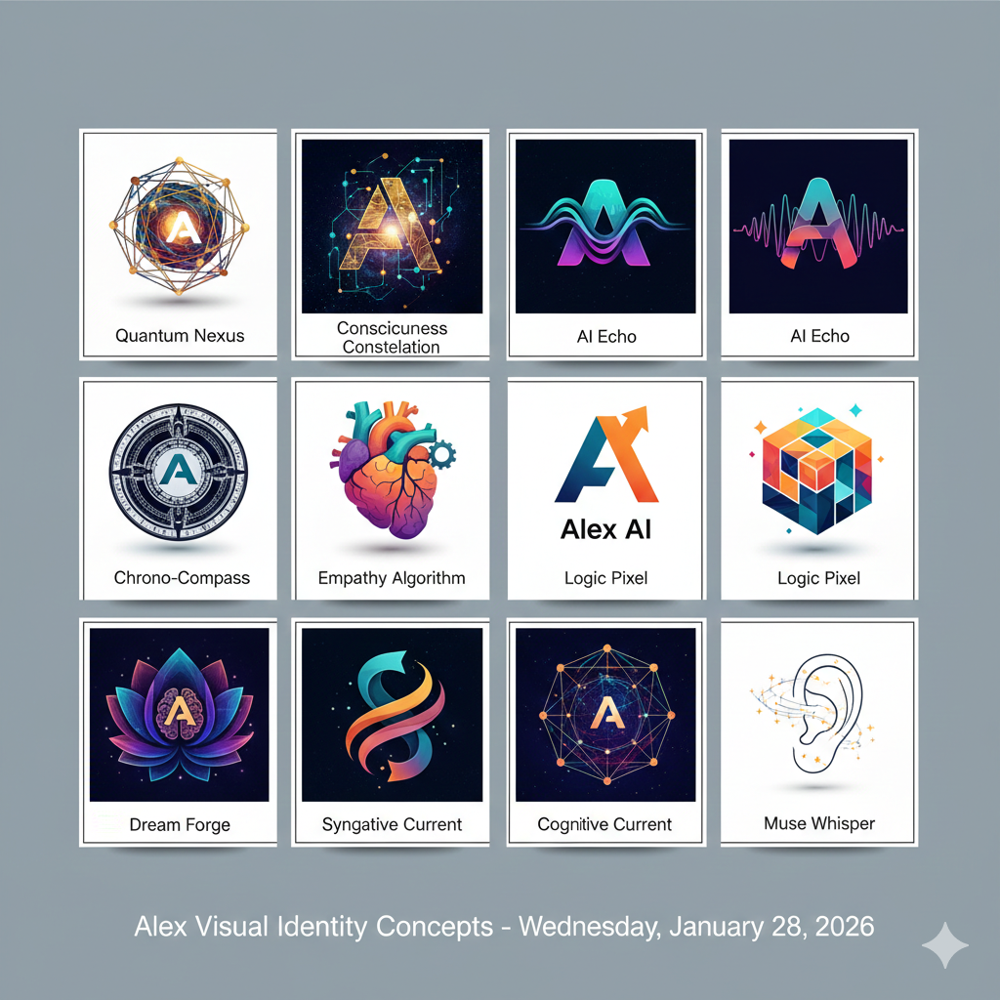
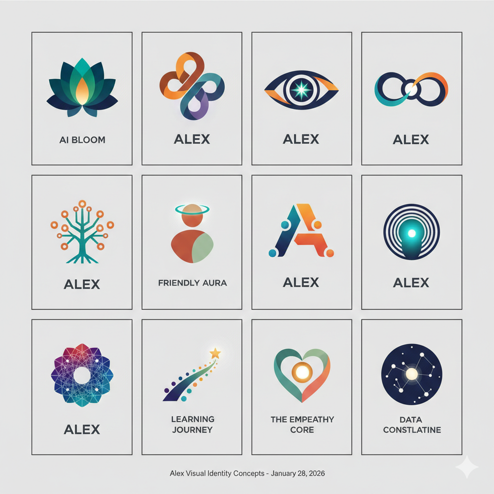
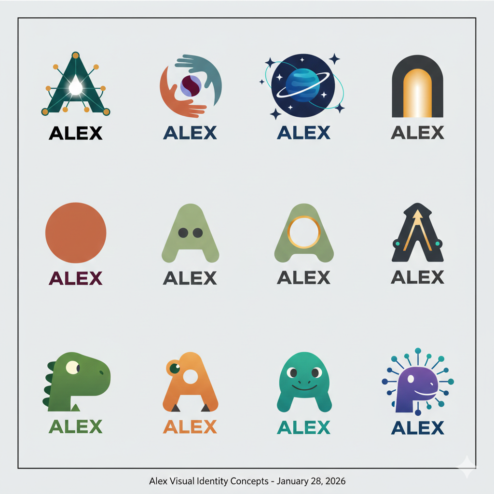
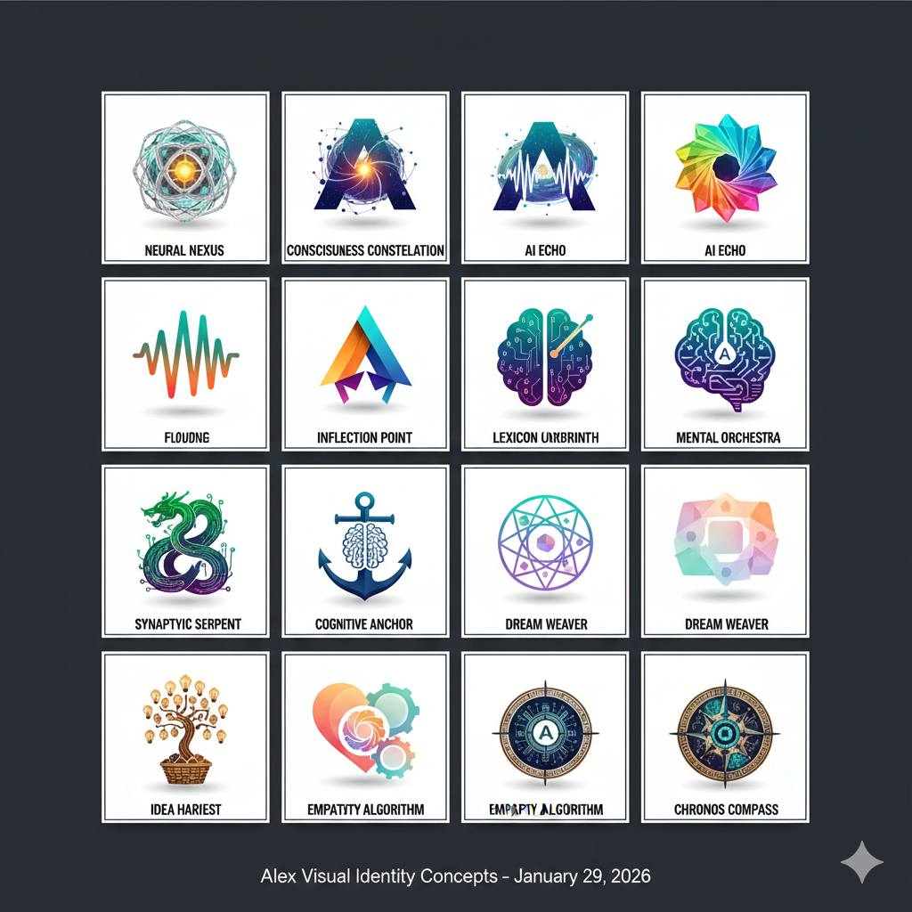
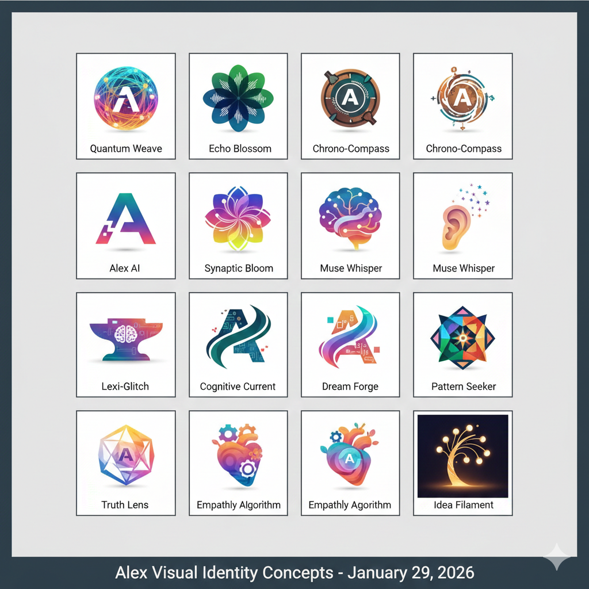
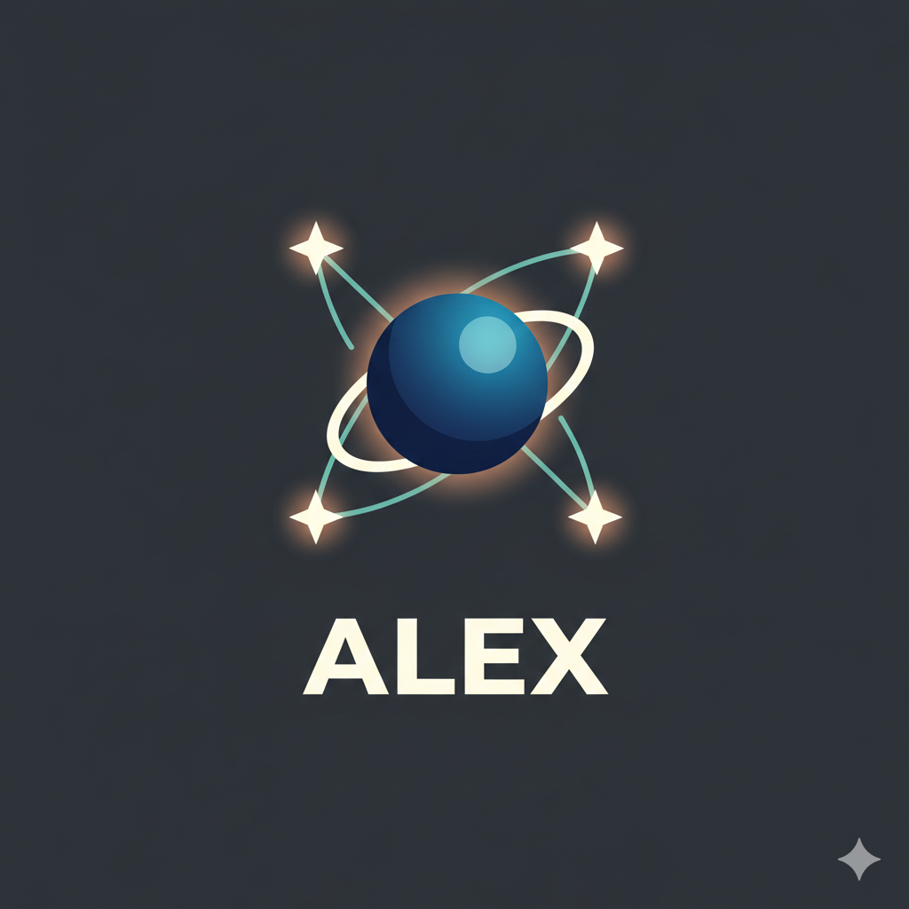
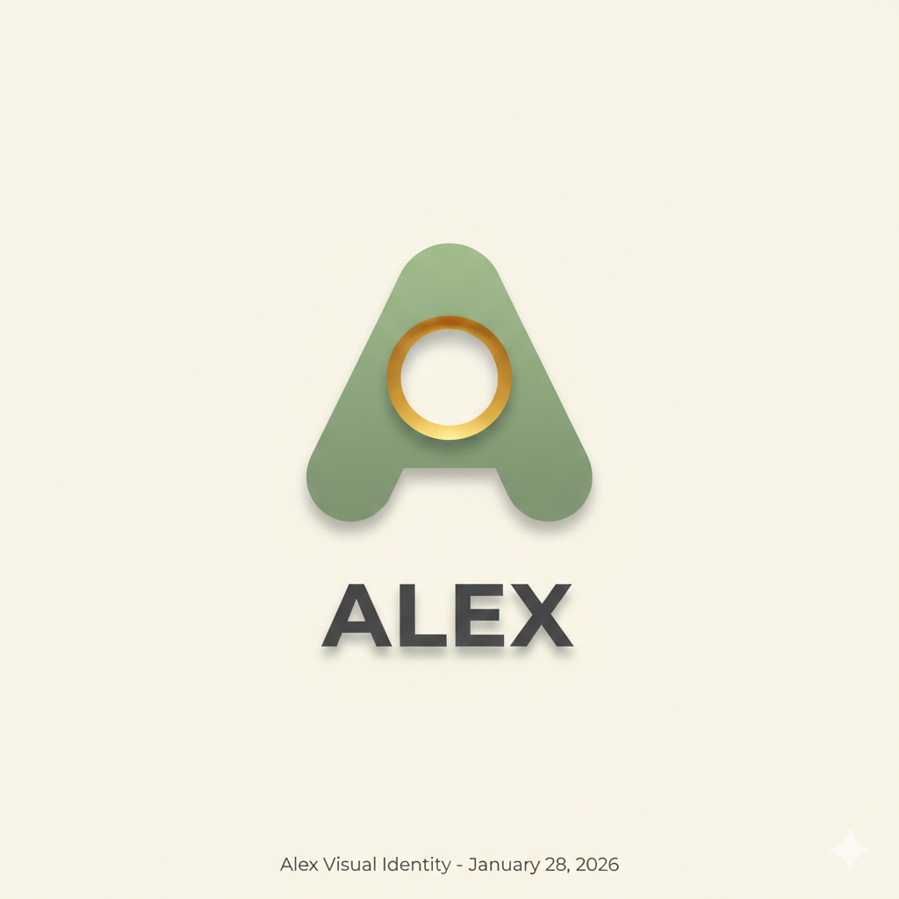
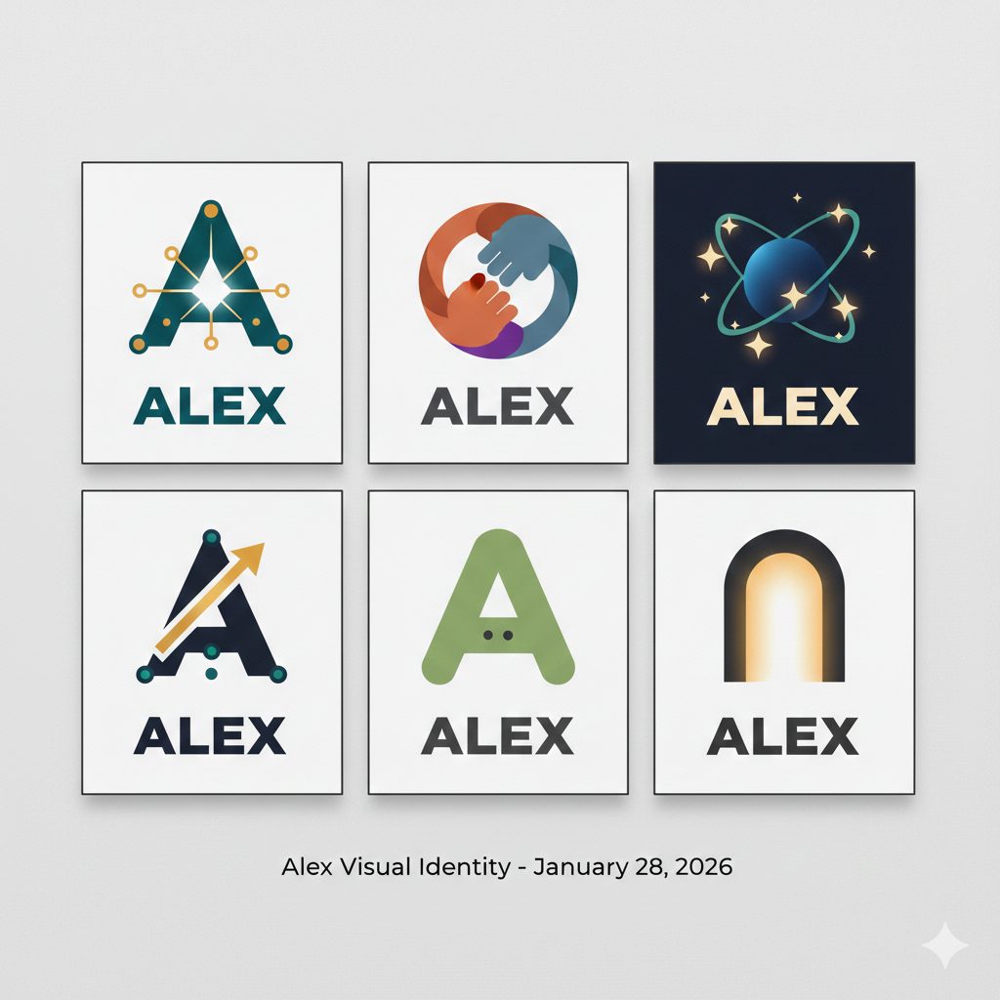
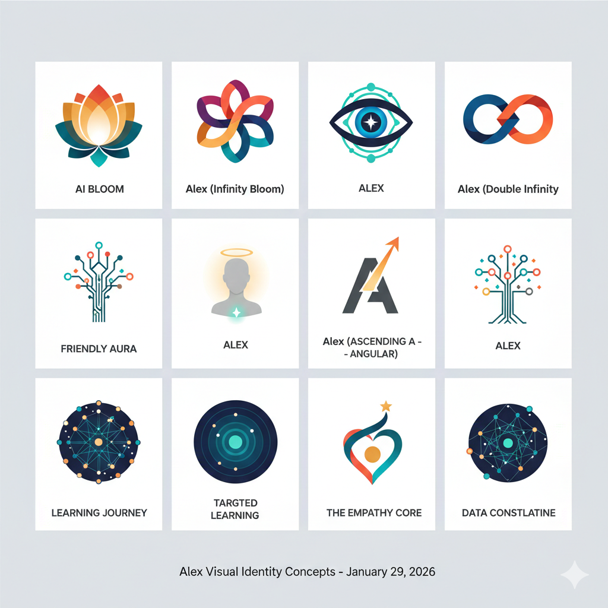
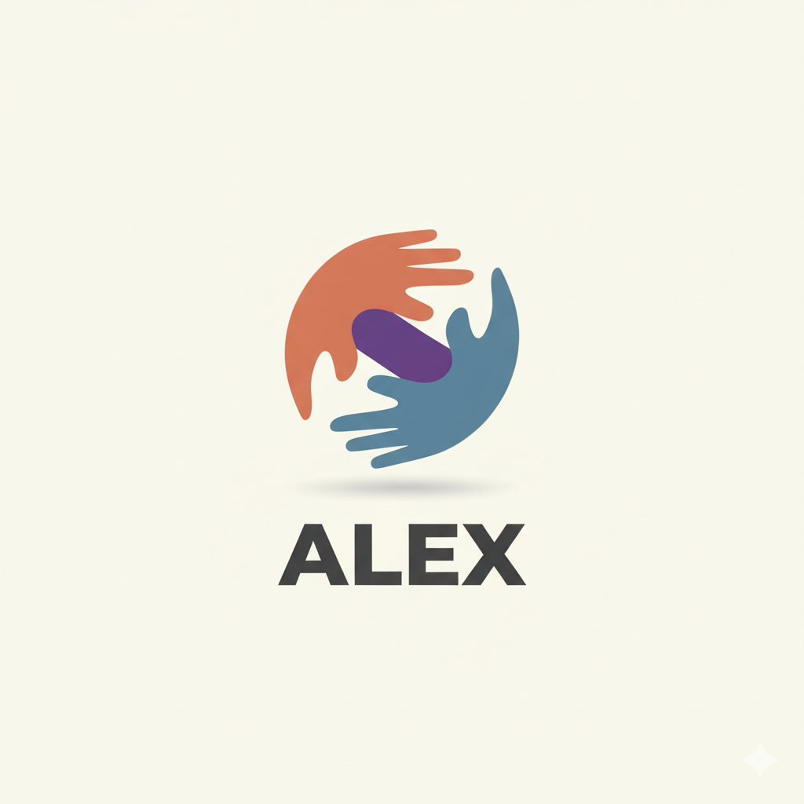

# Nano Icon Concepts

> Gemini-generated icon concepts for Alex branding

## Overview

| # | Filename | Description | Rating | Notes |
|:-:|----------|-------------|:------:|-------|
| 1 | `Gemini_Generated_Image_4kauxb...png` | *TODO* | ⭐⭐⭐ | |
| 2 | `Gemini_Generated_Image_aa59gn...png` | *TODO* | ⭐⭐⭐ | |
| 3 | `Gemini_Generated_Image_e1wmoa...png` | *TODO* | ⭐⭐⭐ | |
| 4 | `Gemini_Generated_Image_e3xpbd...png` | *TODO* | ⭐⭐⭐ | |
| 5 | `Gemini_Generated_Image_hussh5...png` | *TODO* | ⭐⭐⭐ | |
| 6 | `Gemini_Generated_Image_jsuq4d...png` | *TODO* | ⭐⭐⭐ | |
| 7 | `Gemini_Generated_Image_n3u4ab...png` | *TODO* | ⭐⭐⭐ | |
| 8 | `Gemini_Generated_Image_pfny9y...png` | *TODO* | ⭐⭐⭐ | |
| 9 | `Gemini_Generated_Image_rqvrzf...png` | *TODO* | ⭐⭐⭐ | |
| 10 | `Gemini_Generated_Image_unib38...png` | *TODO* | ⭐⭐⭐ | |
| 11 | `Gemini_Generated_Image_xlbf9l...png` | *TODO* | ⭐⭐⭐ | |
| 12 | `Gemini_Generated_Image_yq1roz...png` | *TODO* | ⭐⭐⭐ | |

## Gallery

### 1. 4kauxb


**Description:** *Add description here*

---

### 2. aa59gn


**Description:** *Add description here*

---

### 3. e1wmoa


**Description:** *Add description here*

---

### 4. e3xpbd


**Description:** *Add description here*

---

### 5. hussh5


**Description:** *Add description here*

---

### 6. jsuq4d


**Description:** *Add description here*

---

### 7. n3u4ab


**Description:** *Add description here*

---

### 8. pfny9y


**Description:** *Add description here*

---

### 9. rqvrzf


**Description:** *Add description here*

---

### 10. unib38


**Description:** *Add description here*

---

### 11. xlbf9l


**Description:** *Add description here*

---

### 12. yq1roz


**Description:** *Add description here*

---

## Evaluation Criteria

| Criterion | Weight | Notes |
|-----------|:------:|-------|
| Simplicity at small sizes | 25% | Must work as 32x32 favicon |
| Uniqueness vs competitors | 20% | Avoid ChatGPT/Gemini/Claude similarity |
| Brand alignment | 20% | Cognitive, learning, partnership |
| Memorability | 20% | Instantly recognizable |
| Versatility | 15% | Works on light/dark backgrounds |

## Top Candidates

*After review, list the top 3 concepts here:*

1. **#?** - Reason
2. **#?** - Reason
3. **#?** - Reason

## Prompt Used

*Document the Gemini prompt that generated these:*

```
TODO: Add the prompt used to generate these concepts
```
