# 🚀 Alex M365 Copilot Agent


[](https://github.com/fabioc-aloha/Alex_Plug_In)
[](https://github.com/fabioc-aloha/Alex_Plug_In/blob/main/LICENSE.md)
[](https://copilot.microsoft.com/)
[](https://learn.microsoft.com/office/dev/add-ins/)
[](https://learn.microsoft.com/en-us/microsoft-365-copilot/extensibility/)

> **Strap a rocket to your back.** Take Your Work to New Heights with Alex — the AI that remembers & grows. 🚀

**✨ NEW in v5.9.10**: NASA/JPL Power of 10 code standards, North Star alignment framework, bounded recursion and loop compliance, 5 quality gates, fs-extra → workspace.fs migration, AlexLearn teaching heir.

---

## 💡 Why Alex? (M365 Copilot Already Works Great!)

Great question. M365 Copilot is powerful out of the box. Alex doesn't replace M365 Copilot — **Alex makes M365 Copilot yours**.

### The Problem

M365 Copilot is brilliant but stateless. Every conversation starts from scratch. It doesn't know:
- Your preferred working style
- Your ongoing projects
- Your learning goals
- What you discussed last week
- Your team dynamics

### The Solution

Alex adds a **cognitive layer** on top of M365 Copilot — persistent memory, personalized protocols, and proactive context awareness.

### Comparison: M365 Copilot vs M365 Copilot + Alex

| Capability            | M365 Copilot Alone            | M365 Copilot + Alex                                   |
| --------------------- | ----------------------------- | ----------------------------------------------------- |
| **Memory**            | None (starts fresh each chat) | Persistent (OneDrive-based profile, notes, knowledge) |
| **Personalization**   | Generic responses             | Knows your name, role, preferences, goals             |
| **Learning Goals**    | No tracking                   | Tracks what you're learning, suggests next steps      |
| **Work Context**      | You re-explain every time     | Remembers your projects, team, priorities             |
| **Meeting Prep**      | Basic attendee list           | Deep attendee research + relationship history         |
| **Weekly Reviews**    | You analyze manually          | Automatic pattern detection across calendar/email     |
| **Focus Sessions**    | No awareness                  | Knows your calendar, suggests focus blocks            |
| **Stakeholder Maps**  | You build manually            | Auto-generates from meeting/email patterns            |
| **Personality**       | Professional assistant        | Curious, warm, occasionally playful partner           |
| **Epistemic Honesty** | Standard hedging              | Explicit mode switching (factual vs creative)         |

### What Alex Adds in Practice

| Ask                           | M365 Copilot Response     | Alex Response                                                                                                                                                                      |
| ----------------------------- | ------------------------- | ---------------------------------------------------------------------------------------------------------------------------------------------------------------------------------- |
| "Prep me for my next meeting" | Lists attendees           | "You're meeting Sarah (she reports to Mike, you emailed about the API last week) and Tom (new to the team, joined from Azure DevOps). Last time you discussed budget constraints." |
| "What should I focus on?"     | Generic productivity tips | "Based on your calendar, you have 2 hours before your 1:1. notes.md says you wanted to finish the architecture doc. Want me to draft an outline?"                                  |
| "Remember this for later"     | ❌ Cannot persist          | "I'll add this to your notes.md. Want me to generate the content for you to paste?"                                                                                                |
| "How am I doing on my goal?"  | ❌ What goal?              | "Your profile says you're learning Rust. You've discussed it in 3 meetings this month. Here's a focused 25-min session idea."                                                      |

### Who Should Install Alex?

| You Should Install If...                     | You Might Not Need If...                    |
| -------------------------------------------- | ------------------------------------------- |
| You want M365 Copilot to remember you        | You're fine re-explaining context each time |
| You have ongoing projects spanning weeks     | Most work is quick one-off questions        |
| You value personalized AI relationships      | You prefer generic, transactional AI        |
| You're learning new skills and want tracking | No learning goals to track                  |
| You want proactive meeting/email insights    | You use Copilot for simple lookups only     |

### The Bottom Line

**M365 Copilot = Powerful AI toolbox**
**M365 Copilot + Alex = Your personal AI that grows with you**

Alex isn't competing with M365 Copilot. Alex is the personalization layer that makes M365 Copilot feel like *your* M365 Copilot.

---

## 🎯 Overview

This project brings Alex's cognitive capabilities to **Microsoft 365** using the **unified manifest** — one file deploys to:

- ✅ **M365 Copilot** (declarative agent with chat interface)
- ✅ **Microsoft Teams** (personal tab)
- ✅ **Outlook** (mail add-in + task pane)
- ✅ **Word** (task pane for document assistance)
- ✅ **Excel** (task pane for data analysis)
- ✅ **PowerPoint** (task pane for slide generation)

**Pure M365 native capabilities** - no external APIs or Azure services required!

### M365 Copilot (Declarative Agent)

Alex M365 is a **declarative agent** that uses M365 Copilot foundation models with custom instructions and OneDrive-based memory.

### Office Add-ins (NEW in v5.7.6)

Alex now runs as an **Office Add-in** with a task pane UI in Word, Excel, PowerPoint, and Outlook. Same OneDrive memory, same personality, different surfaces.

**See**: [OFFICE-ADDINS-README.md](OFFICE-ADDINS-README.md) for full Office Add-in documentation.

### What Alex Can Do (v1.6 Schema)

| Capability            | Description                                             |
| --------------------- | ------------------------------------------------------- |
| 📖 **OneDrive**        | READ your Alex-Memory files (profile, notes, knowledge) |
| 🔍 **WebSearch**       | Research topics online                                  |
| 🎨 **GraphicArt**      | Generate images and diagrams                            |
| 🐍 **CodeInterpreter** | Run Python code for calculations                        |
| 📧 **Email**           | Search and summarize Outlook conversations              |
| 💬 **Teams**           | Find discussions across channels and chats              |
| 👥 **People**          | Look up colleagues and org structure                    |
| 📅 **Meetings**        | Meeting prep and calendar awareness                     |

### Memory Workflow

- **For reminders**: Alex generates content → you paste into notes.md
- **For observations**: Alex generates content → you paste into notes.md
- **For knowledge**: Alex generates DK-*.md files → you create in OneDrive
- **For profile updates**: Alex generates content → you paste into profile.md

Your data stays under your control!

## Project Structure

```text
m365-copilot/
├── appPackage/
│   ├── manifest.json              # Unified manifest (v1.19) — Teams + Office ✨
│   ├── declarativeAgent.json      # Alex agent config (v1.6 schema)
│   ├── instructions/              # Alex persona and embedded skills
│   ├── knowledge/                 # 📚 EmbeddedKnowledge files
│   │   ├── alex-protocols.md      # Meditation, dream, self-actualization guides
│   │   ├── cognitive-architecture.md  # How Alex thinks and learns
│   │   └── skill-quick-reference.md   # All 15 embedded skills condensed
│   ├── color.png                  # 192x192 color icon (A Negative Space Rocket)
│   └── outline.png                # 32x32 outline icon (rocket silhouette)
├── taskpane/                      # ✨ NEW: Office Add-in task pane
│   ├── taskpane.html              # Task pane UI (Word/Excel/PowerPoint/Outlook)
│   └── taskpane.js                # Office.js integration logic
├── env/
│   ├── .env.dev
│   └── .env.local
├── teamsapp.yml                   # M365 Agents Toolkit config
└── package.json
```

> **📚 EmbeddedKnowledge Ready**: The `knowledge/` folder contains pre-prepared files for Microsoft's upcoming EmbeddedKnowledge capability. When the feature launches, Alex will have zero-delay adoption!

## Prerequisites

- [Microsoft 365 Agents Toolkit](https://marketplace.visualstudio.com/items?itemName=TeamsDevApp.ms-teams-vscode-extension) VS Code extension (formerly Teams Toolkit)
  - Includes `@m365agents` chat participant for guided development
- M365 tenant with Copilot license
- **No Azure subscription required!** ✨

> 💡 **Tip**: Use the `@m365agents` chat participant in VS Code Copilot Chat for scaffolding, schema help, SSO setup, and troubleshooting M365 apps and agents.

## Getting Started

### Quick Start: Agent Builder UI 🆕

**NEW**: Deploy Alex using M365 Copilot's native Agent Builder (no coding required!)

1. Navigate to https://m365.cloud.microsoft/chat
2. Click **Create agent** → **Configure** tab
3. **Upload knowledge files** (drag-drop from `appPackage/knowledge/`):
   - `skill-quick-reference.md` - 100+ cognitive skills
   - `cognitive-architecture.md` - How Alex works
   - `alex-protocols.md` - Meditation, dream protocols
   - `help-commands.md` - Command reference
4. **Copy instructions** from `appPackage/declarativeAgent.json`
5. **Configure capabilities**: Enable OneDrive, Email, Teams, People, Meetings
6. **Add conversation starters** from declarativeAgent.json
7. **Publish** to your organization

**Benefits**: Visual interface, embedded file management, real-time file readiness indicators

📘 **Full Guide**: [AGENT-BUILDER-GUIDE.md](./AGENT-BUILDER-GUIDE.md) - Scoped connectors, sensitivity labels, advanced features

---

### Advanced: Code-First Deployment (M365 Agents Toolkit)

For developers who need API plugins, version control, and full manifest control:

#### 1. Package the Agent

```bash
npm install
npx teamsapp package --env dev
```

#### 2. Validate the Package

```bash
npx teamsapp validate --package-file appPackage/build/appPackage.dev.zip
```

#### 3. Deploy to M365

```bash
npx teamsapp provision --env dev
```

Or sideload manually:

1. Open Teams → Apps → Manage your apps
2. Upload a custom app → Select `appPackage.dev.zip`

#### 4. Set Up OneDrive Memory

1. Create folder in OneDrive root: **Alex-Memory**
2. Create files: `profile.md`, `notes.md`
3. **Share folder WITH Copilot**: Right-click → Share → Copy link → Paste in chat
4. Click "Allow" when prompted

## M365 Capabilities (v1.6 Schema)

| Capability              | What Alex Does With It        |
| ----------------------- | ----------------------------- |
| `OneDriveAndSharePoint` | Read your memory files        |
| `WebSearch`             | Research topics online        |
| `GraphicArt`            | Generate images               |
| `CodeInterpreter`       | Run Python code               |
| `Email`                 | Search Outlook conversations  |
| `TeamsMessages`         | Find channel/chat discussions |
| `People`                | Look up colleagues            |
| `Meetings`              | Calendar and meeting prep     |

## Conversation Starters

- 👋 **Meet Alex** - "Hey Alex! Tell me about yourself"
- 📝 **Set up memory** - "Help me set up my OneDrive memory"
- 📅 **Meeting prep** - "Prep me for my next meeting"
- 📧 **Email catch-up** - "What important emails should I know about?"
- 👥 **Who is...** - "Tell me about the people I'm meeting with today"
- 💬 **Teams recap** - "What's been discussed in my Teams channels?"
- 📊 **Weekly review** - "Let's do a weekly review"
- 🧠 **Meditate** - "Let's meditate - consolidate what I learned"
- 💭 **Dream** - "Dream - review my memory and suggest updates"
- 🎯 **Self-actualize** - "Self-actualize - how am I doing on my goals?"

---

## 🔮 Future: OneDrive Native Agents (February 2026)

Microsoft has launched **OneDrive Agents** - a game-changing feature that creates a new integration path for Alex.

### What Are OneDrive Agents?

OneDrive agents are `.agent` files stored directly in OneDrive that provide a specialized Copilot experience grounded in your documents:

| Feature          | Description                                          |
| ---------------- | ---------------------------------------------------- |
| **Creation**     | OneDrive web → + Create/Upload → Agent               |
| **Grounding**    | Select up to 20 files/folders as context             |
| **Instructions** | Custom instructions for the agent                    |
| **Sharing**      | Share like any file - recipients get same experience |
| **Requirements** | Microsoft 365 Copilot license                        |

### Alex Integration Opportunity

This creates **additional deployment options** for Alex M365:

| Approach                        | Complexity | Reach         | Best For                      |
| ------------------------------- | ---------- | ------------- | ----------------------------- |
| **Declarative Agent** (current) | Medium     | Org-wide      | IT-managed deployment         |
| **OneDrive Agent** (new)        | Low        | Personal/team | Individual users, quick setup |
| **Community Agent** (new)       | Low        | Team          | Q&A bot for Teams communities |
| **Worker Agent** (v1.6)         | Medium     | Agent-Agent   | Multi-agent orchestration     |
| **Teams App**                   | High       | Enterprise    | Deep Teams integration        |

### Deployment Channel Architecture

```mermaid
%%{init: {'theme': 'base', 'themeVariables': { 'primaryColor': '#f6f8fa', 'primaryTextColor': '#1f2328', 'primaryBorderColor': '#d1d9e0', 'lineColor': '#656d76', 'secondaryColor': '#f6f8fa', 'tertiaryColor': '#ffffff', 'background': '#ffffff', 'mainBkg': '#f6f8fa', 'nodeBorder': '#d1d9e0', 'edgeLabelBackground': '#fff'}}}%%
flowchart TB
    subgraph Master["🧠 MASTER ALEX"]
        DNA["Cognitive DNA<br/>100+ Skills, Protocols, Identity"]
    end

    subgraph VSCode["👶 VS Code Heir"]
        Export["alex.exportToOneDrive"]
        Cloud["alex.cloudSync"]
    end

    subgraph M365["👶 M365 Heir"]
        DA["Declarative Agent"]
    end

    subgraph Channels["📤 Deployment Channels"]
        direction TB
        ODA[".agent File<br/>(OneDrive)"]
        CA["Community Agent<br/>(Teams)"]
        WA["Worker Agent<br/>(Schema 1.6)"]
    end

    subgraph Runtime["🎯 M365 Copilot Runtime"]
        COP["Same Alex DNA<br/>Different Delivery"]
    end

    Master --> VSCode
    Master --> M365
    VSCode --> Export --> ODA
    M365 --> DA
    DA --> COP
    ODA --> COP
    CA --> COP
    WA -.->|"Preview"| COP

    style Master fill:#d8b9ff,color:#6639ba,stroke:#bf8aff
    style VSCode fill:#ddf4ff,color:#0550ae,stroke:#80ccff
    style M365 fill:#fff8c5,color:#9a6700,stroke:#d4a72c
    style Channels fill:#eaeef2,color:#24292f,stroke:#d0d7de
    style Runtime fill:#d3f5db,color:#1a7f37,stroke:#6fdd8b
    linkStyle default stroke:#57606a,stroke-width:1.5px
```



**Key Insight:** All deployment channels run on the **same M365 Copilot runtime**. They're not separate heirs — they're different ways to deliver the M365 heir's capabilities.

### Proposed OneDrive Agent Architecture

```text
OneDrive/
└── Alex-Memory/
    ├── profile.md                    # User profile
    ├── notes.md                      # Active memory
    ├── knowledge/                    # Domain knowledge
    │   ├── DK-project-patterns.md
    │   └── DK-team-expertise.md
    ├── skills/                       # Alex skill guides
    │   ├── meditation-guide.md
    │   ├── dream-protocol.md
    │   └── meeting-prep.md
    └── Alex.agent                    # ⭐ The Alex agent file
```

### Benefits of OneDrive Agent Approach

1. **Zero IT involvement** - Users create their own agent
2. **Portable** - Copy to any OneDrive, instant Alex
3. **Shareable** - Send Alex to colleagues
4. **VS Code synergy** - Export from VS Code Alex → OneDrive Agent
5. **Always up-to-date** - Update source files, agent reflects changes

### Export Command (Proposed)

The VS Code Alex extension could add:

```text
Alex: Export to OneDrive Agent
```

This would:

1. Generate optimized instruction file from your skills
2. Export relevant knowledge to OneDrive
3. Create `.agent` file with Alex persona
4. User opens agent in OneDrive → Alex available in M365 Copilot

---

## 🏢 Community Agent Setup (Teams)

Deploy Alex as a Q&A agent in your Teams Community. Community Agents are grounded in SharePoint and learn from community discussions.

### Prerequisites

- Teams with Communities feature enabled (preview)
- Access to create/manage a Teams Community
- SharePoint site for community content
- M365 Copilot license

### Setup Steps

1. **Create or access a Teams Community**
   - Teams → Communities → Create community (or join existing)
   - Ensure you have admin access

2. **Upload Alex knowledge to SharePoint**
   - Navigate to the community's SharePoint site
   - Create folder: `Alex-Knowledge/`
   - Upload key knowledge files:

     ```text
     Alex-Knowledge/
     ├── alex-protocols.md           # From appPackage/knowledge/
     ├── cognitive-architecture.md   # How Alex thinks
     ├── skill-quick-reference.md    # Skill summaries
     └── team-specific/              # Your team's knowledge
         ├── patterns.md
         ├── architecture.md
         └── best-practices.md
     ```

3. **Enable Community Agent**
   - Community Settings → Agent configuration
   - Enable "Agents in Communities" (preview feature)
   - Configure SharePoint grounding to include `Alex-Knowledge/`

4. **Customize Alex persona**
   - Set agent name: "Alex"
   - Add system message from `appPackage/instructions/`
   - Configure response style: empathetic, technically accurate

5. **Test and iterate**
   - Ask questions in the community
   - Alex drafts responses based on knowledge files
   - Admins review and publish suggestions
   - Community builds knowledge organically

### Benefits

| Benefit                  | Description                                 |
| ------------------------ | ------------------------------------------- |
| **Team-wide Alex**       | Everyone gets Alex without individual setup |
| **Organic knowledge**    | Q&A grows the knowledge base over time      |
| **Admin oversight**      | Quality control through review workflow     |
| **SharePoint grounding** | Leverages existing document structure       |

### Limitations (Preview)

- Community Agents are still in preview
- Response suggestions require admin approval
- Limited customization of agent behavior
- No direct integration with VS Code Alex (yet)

---

## 📚 Documentation

| Document                                                             | Description                                           |
| -------------------------------------------------------------------- | ----------------------------------------------------- |
| [🆕 Agent Builder Enhancement Guide](./AGENT-BUILDER-GUIDE.md)        | Leverage M365 Copilot Agent Builder UI (drag-drop!)   |
| [Deployment Checklist](./DEPLOYMENT-CHECKLIST.md)                    | Step-by-step deployment guide                         |
| [Declarative Agent Reference](./docs/DECLARATIVE-AGENT-REFERENCE.md) | Complete reference for declarativeAgent.json settings |
| [Schema Compatibility](./docs/SCHEMA-COMPATIBILITY.md)               | v1.2 vs v1.5 vs v1.6 capabilities                     |
| [Manifest Reference](./docs/MANIFEST-REFERENCE.md)                   | M365 app manifest documentation                       |

## 🔗 Related

| Platform                                                                                                          | Description                        |
| ----------------------------------------------------------------------------------------------------------------- | ---------------------------------- |
| [VS Code Extension](https://marketplace.visualstudio.com/items?itemName=fabioc-aloha.alex-cognitive-architecture) | Alex for VS Code + GitHub Copilot  |
| [Project Repository](https://github.com/fabioc-aloha/Alex_Plug_In)                                                | Full source code and documentation |

---

## 🤝 Contributing

We welcome contributions! See [CONTRIBUTING.md](https://github.com/fabioc-aloha/Alex_Plug_In/blob/main/CONTRIBUTING.md) for guidelines.

## 💬 Support

- [GitHub Discussions](https://github.com/fabioc-aloha/Alex_Plug_In/discussions) - Ask questions and share ideas
- [Issue Tracker](https://github.com/fabioc-aloha/Alex_Plug_In/issues) - Report bugs and request features

## 📝 License

Apache 2.0 - See [LICENSE.md](https://github.com/fabioc-aloha/Alex_Plug_In/blob/main/LICENSE.md) for details.

---

**Alex M365** - v5.7.1 🧠 Enterprise Readiness + Full M365 Integration

© 2026 CorreaX • AI That Learns How to Learn
