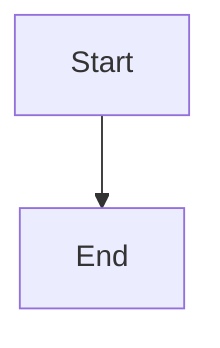

# Alex for Microsoft 365 — User Manual

**Version**: v5.7.7
**Last Updated**: 2026-02-16
**Platform**: Office Add-in (Word, Excel, PowerPoint, Outlook)

---

## Welcome to Alex for Microsoft 365! 👋

Alex brings your cognitive memory and learning context directly into Microsoft Office apps. Instead of switching between VS Code and Office, Alex's task pane gives you **one-click access** to memory-augmented templates, skill tracking, and intelligent document operations.

### What Alex Does

- **Word**: Insert memory-based templates (research summaries, meeting notes, articles)
- **Excel**: Track learning goals with formulas like `=ALEX.SKILLLEVEL("React")`
- **PowerPoint**: Generate slides from your focus trifectas
- **Outlook**: Draft emails with smart replies (Professional, Casual, Brief tones)

### What Makes This Different

Alex isn't just another AI assistant. It's a **cognitive extension** that:
- Reads your OneDrive memory files (profile.md, focus-trifectas.md, notes.md)
- Activates VS Code skills directly in Office (markdown-mermaid, persona-detection, etc.)
- Adapts to your learning persona (Developer, Teacher, Researcher, etc.)

---

## Quick Start (5 Minutes)

### Step 1: Setup OneDrive Memory Folder

Alex stores your cognitive memory in OneDrive for cross-device sync:

1. Open OneDrive in your browser or File Explorer
2. Create folder: `OneDrive/Alex-Memory/`
3. Add these 3 files (copy templates from `.github/memory-templates/`):

**profile.md** (Your identity)
```markdown
# My Profile

Name: [Your Name]
Role: [Developer/Teacher/Researcher/etc.]
Goals: [What you're working toward]
Current Focus: [This week's priorities]
```

**focus-trifectas.md** (Learning goals)
```markdown
# Focus Trifectas

## Web Development
1. **React Hooks** (Beginner → Advanced, 40%)
   Next: Complete useEffect deep dive
2. **TypeScript Generics** (Intermediate → Expert, 25%)
   Next: Practice utility types
3. **Testing with Jest** (Beginner → Intermediate, 60%)
   Next: Write integration tests
```

**notes.md** (Daily context)
```markdown
# Daily Notes

## 2026-02-16
- Working on M365 integration
- Key insight: Synapses enable cross-platform skill activation
- Tomorrow: Test custom Excel functions
```

### Step 2: Open Office App + Load Alex

1. Open **Word**, **Excel**, **PowerPoint**, or **Outlook**
2. Go to **Insert** tab → **Get Add-ins**
3. Search for "Alex Cognitive Architecture"
4. Click **Add** → Task pane appears on right side
5. Click **🔗 Connect to OneDrive** → Grant permissions

✅ You're ready! Alex now has access to your memory.

### Step 3: Try Your First Action

**In Word**: Click "📄 Research Summary" → Alex inserts a template with your name/role from profile.md

**In Excel**: Type in cell A1: `=ALEX.SKILLLEVEL("React")` → Returns "Beginner → Advanced"

**In PowerPoint**: Click "🎯 Generate Trifecta Slide" → Creates slide with your 3 current learning goals

**In Outlook**: Click "🧠 Generate Smart Replies" → Get 3 tone-appropriate email responses

---

## Feature Catalog

### 📝 Word Features

#### Memory-Augmented Templates
Insert document templates that auto-populate with your profile data:

| Template             | What It Does                                            | When to Use                           |
| -------------------- | ------------------------------------------------------- | ------------------------------------- |
| **Research Summary** | Structured research notes with persona-aware formatting | Documenting findings, writing reports |
| **Meeting Notes**    | Meeting template with your role and current focus       | Taking notes during calls             |
| **Article Template** | Blog post outline adapted to your writing style         | Drafting articles, documentation      |

**How to use**:
1. Position cursor where you want content
2. Click template button in Alex task pane
3. Template appears with your name, role, focus from profile.md

#### Visual Integration
- **Insert Mermaid Diagram**: Add flowcharts, sequence diagrams (placeholder in v5.7.7, rendering in Phase 4)
- **Insert SVG Graphic**: Theme-aware vector graphics

**Activates VS Code Skills**:
- `markdown-mermaid (0.9)` — Diagram syntax patterns
- `persona-detection (0.8)` — Writer role adaptation
- `writing-publication (0.85)` — Style consistency

---

### 📊 Excel Features

#### Learning Goals Tracker
Visualize your skill development journey:

**What it creates**:
- Table with columns: Skill | Current Level | Target Level | Progress % | Next Action
- Auto-populated from focus-trifectas.md
- Conditional formatting progress bars
- Auto-fit columns

**How to use**:
1. Open blank worksheet
2. Click "📋 Create Goals Tracker" in task pane
3. Table appears at A1 with your focus trifectas

**Example output**:
```
| Skill       | Current Level | Target Level | Progress % | Next Action           |
| ----------- | ------------- | ------------ | ---------- | --------------------- |
| React Hooks | Beginner      | Advanced     | 40%        | Complete useEffect... |
| TypeScript  | Intermediate  | Expert       | 25%        | Practice utility...   |
```

#### Custom Excel Functions (Phase 3)

Query your Alex memory directly in formulas:

| Formula                              | Returns                    | Example                       |
| ------------------------------------ | -------------------------- | ----------------------------- |
| `=ALEX.SKILLLEVEL("React")`          | Current skill level        | "Beginner → Advanced"         |
| `=ALEX.GOALSTATUS("TypeScript")`     | Progress as decimal        | 0.4 (= 40%)                   |
| `=ALEX.NEXTSTEP("Python")`           | Next action from trifectas | "Complete tutorial module 3"  |
| `=ALEX.MEMORYQUERY("current focus")` | Natural language answer    | "Working on M365 integration" |

**Pro Tips**:
- Use SKILLLEVEL in dashboards to show current state
- Use GOALSTATUS in charts for progress visualization
- Use MEMORYQUERY for dynamic headers: `="Focus: " & ALEX.MEMORYQUERY("focus")`

**Caching**: Functions cache results for 60 seconds to avoid excessive OneDrive API calls. To force refresh, edit focus-trifectas.md and wait 60 seconds.

**Activates VS Code Skills**:
- `persona-detection (0.6)` — Learning persona identification
- `knowledge-synthesis (0.7)` — Pattern recognition in skill data
- `testing-strategies (0.7)` — Test coverage tracking

---

### 🎨 PowerPoint Features

#### Focus Trifecta Slides
Generate presentation slides from your learning goals:

**What it creates**:
- Title slide with your current trifecta name
- 3 content slides (one per skill)
- Each slide shows: Skill name, current→target levels, progress %, next action
- Alex brand colors and theme

**How to use**:
1. Open blank presentation
2. Click "🎯 Generate Trifecta Slide" in task pane
3. 4 slides appear (title + 3 skills)

**Use Cases**:
- 1-on-1 progress updates with manager
- Learning portfolio presentations
- Self-reflection slide decks

#### Animations (Phase 3)
- **Apply Entrance Animations**: Prepare animation structure for slide shapes
- ⚠️ **Limitation**: PowerPoint.js API doesn't support direct animation control. OOXML implementation planned for Phase 4.

**Activates VS Code Skills**:
- `persona-detection (0.7)` — Presentation style adaptation
- `ui-ux-design (0.75)` — Slide layout principles
- `brand-asset-management (0.85)` — Logo, colors, icons

---

### ✉️ Outlook Features

#### Email Templates
Draft emails with memory-augmented context:

| Template         | Tone              | Best For                   |
| ---------------- | ----------------- | -------------------------- |
| **Response**     | Professional      | Replying to inquiries      |
| **Follow-up**    | Friendly reminder | Checking in after meetings |
| **Introduction** | Warm greeting     | First contact, networking  |

**How to use**:
1. Open new email or reply
2. Click template button in task pane
3. Email body populates with your name, role, personalized greeting

**Auto-includes**:
- Your name from profile.md
- Current role/focus for context
- Appropriate closing based on email type

#### Smart Replies (Phase 3)
Get AI-generated reply options with sentiment analysis:

**What it does**:
1. Analyzes incoming email sentiment (Positive, Negative, Urgent, Neutral)
2. Generates 3 reply variants:
   - **💼 Professional**: Formal, structured, detailed
   - **😊 Casual**: Friendly, conversational, brief
   - **⚡ Brief**: Ultra-short acknowledgment

**How to use**:
1. Open email you want to reply to
2. Click "🧠 Generate Smart Replies" in task pane
3. Review 3 options side-by-side
4. Click "Use This Reply" under your preferred tone
5. Reply inserts into email body → edit as needed

**Sentiment Keywords**:
- **Urgent**: urgent, asap, critical, emergency, immediately, deadline
- **Positive**: thank, great, excellent, appreciate, happy, success
- **Negative**: issue, problem, error, failed, concern, disappointed

**⚠️ Known Limitation**: Keyword-based sentiment (not NLP). May miss context like "This is **not urgent**". Always review generated replies before sending.

#### Calendar Integration (Phase 3)
Extract meeting details from emails and create appointments:

**What it does**:
- Parses email for date/time (MM/DD/YYYY, "next Monday", "2:00 PM")
- Extracts subject, location, attendees
- Generates Outlook web deeplink for appointment creation

**How to use**:
1. Open email with meeting request (e.g., "Let's meet Tuesday at 3 PM in Conference Room A")
2. Click "📅 Create Meeting from Email" in task pane
3. Review parsed details
4. Click "Create Appointment in Outlook" → Opens calendar with pre-filled form

**Supported Date Formats**:
- Absolute: 02/20/2026, February 20 2026, Feb 20
- Relative: next Monday, this Friday, tomorrow
- Times: 2:00 PM, 14:00, 2pm

**⚠️ Note**: Office.js Mailbox API can't create appointments directly. Alex generates a deeplink URL that opens Outlook calendar for you to confirm/save.

**Activates VS Code Skills**:
- `persona-detection (0.75)` — Communication style matching
- `writing-publication (0.6)` — Email composition patterns
- `incident-response (0.8)` — Urgent email triage

---

## Cognitive Integration: How Synapses Work

Alex for M365 isn't isolated — it **connects to your VS Code skills** via synaptic network:

### What Are Synapses?

**Synapses** are documented connections between Office features and VS Code cognitive skills. They enable cross-platform skill activation.

**Example**: When you click "Insert Mermaid Diagram" in Word:
1. Word task pane activates
2. Synapse connection triggers: `markdown-mermaid (0.9)`
3. You get access to Mermaid syntax patterns from VS Code skill library
4. Even though you're in Word, you benefit from VS Code knowledge

### Synapse Network Map (29 Connections)

| Office Skill                    | VS Code Skills Connected                                                                                                                                                                           | Strength |
| ------------------------------- | -------------------------------------------------------------------------------------------------------------------------------------------------------------------------------------------------- | -------- |
| **office-document-integration** | markdown-mermaid, svg-graphics, persona-detection, knowledge-synthesis, bootstrap-learning, incident-response, brand-asset-management, testing-strategies, ui-ux-design, vscode-extension-patterns | 0.5-0.85 |
| **word-integration**            | writing-publication, academic-paper-drafting, markdown-mermaid, knowledge-synthesis, persona-detection                                                                                             | 0.6-0.9  |
| **excel-integration**           | testing-strategies, observability-monitoring, persona-detection, knowledge-synthesis                                                                                                               | 0.6-0.75 |
| **powerpoint-integration**      | svg-graphics, markdown-mermaid, ui-ux-design, brand-asset-management, persona-detection, vscode-extension-patterns                                                                                 | 0.6-0.9  |
| **outlook-integration**         | incident-response, persona-detection, writing-publication, knowledge-synthesis                                                                                                                     | 0.6-0.8  |

**Total**: 29 unique synaptic connections across 5 Office skills

**View Full Map**: Open [COGNITIVE-INTEGRATION-MAP.md](./COGNITIVE-INTEGRATION-MAP.md) for detailed connection catalog

---

## Troubleshooting

### 🔴 "Memory not available" Warning

**Symptom**: Task pane shows "⚠️ Memory-augmented features require OneDrive setup"

**Causes**:
1. Alex-Memory folder doesn't exist in OneDrive
2. Files missing (profile.md, focus-trifectas.md, notes.md)
3. OneDrive permissions not granted

**Fix**:
1. Check OneDrive folder: `OneDrive/Alex-Memory/`
2. Create missing files (see Quick Start Step 1)
3. Click "Setup now" link in warning message
4. Grant OneDrive read permissions when prompted

---

### 🔴 Excel Custom Functions Show #ERROR

**Symptom**: Formula `=ALEX.SKILLLEVEL("React")` returns `#ERROR: File not found`

**Causes**:
1. focus-trifectas.md doesn't exist
2. Skill name not in focus trifectas
3. Internet connection lost (can't access OneDrive)

**Fix**:
1. Check OneDrive/Alex-Memory/focus-trifectas.md exists
2. Verify skill name spelling matches exactly
3. Test internet connection → Reconnect if needed
4. Wait 60 seconds for cache to expire, then retry formula

**Valid formula examples**:
```excel
=ALEX.SKILLLEVEL("React")        ✅ Returns skill level
=ALEX.GOALSTATUS("TypeScript")   ✅ Returns 0.0-1.0
=ALEX.NEXTSTEP("Python")         ✅ Returns next action
=ALEX.MEMORYQUERY("my name")     ✅ Returns name from profile.md
```

---

### 🔴 Smart Replies Have Wrong Tone

**Symptom**: Urgent email gets casual reply, or positive email gets negative reply

**Cause**: Keyword-based sentiment analysis misses context

**Examples of False Positives**:
- "This is **not urgent**" → Classified as urgent (contains "urgent")
- "Thanks for **flagging this issue**" → Classified as both positive (thanks) and negative (issue)

**Fix**:
1. Always review generated replies before using
2. Edit tone/content as needed
3. Consider sentiment analysis as **suggestion, not truth**
4. For complex emails, manually draft response

**Future**: Phase 4 will upgrade to NLP-based sentiment (context-aware)

---

### 🔴 PowerPoint "Apply Animations" Doesn't Apply Animations

**Symptom**: Click button → See "success" → Check slides → No animations

**Cause**: PowerPoint.js API limitation (no animation control API exposed)

**Current Behavior**:
- Button prepares animation structure
- Identifies shapes on slide
- **Cannot apply actual animations** (API doesn't support it)

**Workaround**:
- Manually apply animations via PowerPoint ribbon (Animations tab)
- Alex identifies which shapes to animate (you add effects)

**Future**: Phase 4 will implement OOXML manipulation to inject `<p:timing>` elements directly

---

### 🔴 Meeting Date Parsed Incorrectly

**Symptom**: Email says "next Monday 2pm" → Calendar shows wrong day/time

**Causes**:
1. Timezone ambiguity (date string interpreted as UTC vs. local)
2. Relative date calculation off by one day
3. 12-hour vs. 24-hour time confusion

**Fix**:
1. Always review parsed details before creating appointment
2. Manually adjust date/time in Outlook calendar form
3. Use absolute dates in emails ("February 20, 2026 at 2:00 PM EST")

**Known Issue**: Critical bug in date parsing (see QA Report C2). Fix coming in v5.7.8.

---

### 🟡 Mermaid Diagrams Show as Code, Not Images

**Symptom**: Word inserts code block instead of rendered diagram

**Cause**: Mermaid → SVG rendering not implemented yet (Phase 4 feature)

**Current Behavior**:

[Note: SVG rendering coming soon]

**Workaround**:
1. Copy Mermaid code
2. Paste into https://mermaid.live
3. Export as PNG/SVG
4. Insert image manually into Word

**Future**: Phase 4 will add mermaid.js library to task pane for client-side rendering

---

## Privacy & Security

### What Data Does Alex Access?

| Data Type                      | Access Level | Why Needed                     | Can Opt Out?                         |
| ------------------------------ | ------------ | ------------------------------ | ------------------------------------ |
| **OneDrive Alex-Memory/**      | Read-only    | Load profile, focus, notes     | ❌ No (core feature)                  |
| **User profile** (name, email) | Read-only    | Personalize templates          | ✅ Yes (disable Graph API permission) |
| **Document content**           | Read/Write   | Insert templates, parse emails | ❌ No (core feature)                  |
| **Usage telemetry**            | None         | N/A                            | ✅ Not collected in v5.7.7            |

### Where Is Data Stored?

- **OneDrive**: Your memory files (you control, you own)
- **Local cache**: 60-second in-memory cache (cleared on add-in restart)
- **No cloud storage**: Alex doesn't send data to external servers
- **No logging**: Operations happen client-side in your Office app

### What Permissions Are Required?

| Permission          | Scope           | Required?  | What It Does                                   |
| ------------------- | --------------- | ---------- | ---------------------------------------------- |
| **Files.Read**      | OneDrive        | ✅ Required | Read Alex-Memory folder                        |
| **User.Read**       | Microsoft Graph | ⚠️ Optional | Get your name/email for templates              |
| **Files.ReadWrite** | OneDrive        | ⚠️ Optional | Allow Alex to update notes.md (future feature) |

**Disable OneDrive Access**: Alex shows "Memory not available" message. Templates won't work, but diagram insertion still functional.

---

## Keyboard Shortcuts

| Shortcut           | Action                         | Available In     |
| ------------------ | ------------------------------ | ---------------- |
| `Alt + Shift + A`  | Open Alex task pane            | All Office hosts |
| `Ctrl + Shift + H` | Show memory status             | Task pane open   |
| `F9`               | Refresh Excel custom functions | Excel only       |
| `Esc`              | Close task pane                | All Office hosts |

---

## Tips & Best Practices

### 📝 Keep focus-trifectas.md Updated

Custom Excel functions and PowerPoint slides pull from focus-trifectas.md. Update weekly:

**Good format**:
```markdown
## Web Development Q1 2026
1. **React Hooks** (Beginner → Advanced, 40%)
   Next: Complete useEffect tutorial
2. **TypeScript Generics** (Intermediate → Expert, 25%)
   Next: Practice utility types
3. **Jest Testing** (Beginner → Intermediate, 60%)
   Next: Write integration tests
```

**Why this works**:
- `**Skill Name**` — Bold for easy parsing
- `(Current → Target, Progress%)` — Structured metadata
- `Next: Action` — Immediate next step

### 📊 Use Excel Functions in Dashboards

Create a "Learning Dashboard" sheet:

| Cell | Formula                              | Shows               |
| ---- | ------------------------------------ | ------------------- |
| A1   | `=ALEX.MEMORYQUERY("my name")`       | Your name           |
| A2   | `=ALEX.MEMORYQUERY("current focus")` | This week's focus   |
| A3   | `=ALEX.SKILLLEVEL("React")`          | React progress      |
| A4   | `=ALEX.GOALSTATUS("React")`          | React % (for chart) |
| A5   | `=ALEX.NEXTSTEP("React")`            | Next action         |

**Create chart**: Select A4:A6 → Insert → Bar Chart → Track progress visually

### 🎨 Customize PowerPoint Slides

After generating trifecta slides:
1. Alex creates base structure
2. You add:
   - Company branding
   - Speaker notes
   - Custom animations
   - Screenshots/examples

**Don't regenerate** — Edit slides in place. Regeneration overwrites changes.

### ✉️ Review Smart Replies Before Sending

**ALWAYS** read generated email replies:
1. Sentiment analysis is keyword-based (not perfect)
2. May suggest wrong tone for complex situations
3. Doesn't know your relationship with recipient
4. Treat as **draft starting point**, not final version

**Good workflow**:
1. Generate 3 replies
2. Pick closest tone
3. Edit content for specifics
4. Add context AI can't know
5. Send

---

## Command Reference

### Task Pane Commands

**All hosts**:
- **Connect to OneDrive** — Grant memory access
- **Show Memory Status** — View loaded files
- **Refresh Memory** — Force cache clear

**Word-specific**:
- **📄 Research Summary** — Insert research template
- **📋 Meeting Notes** — Insert meeting template
- **✍️ Article Template** — Insert article template
- **📐 Insert Mermaid Diagram** — Add flowchart (placeholder)
- **🎨 Insert SVG Graphic** — Add vector graphic

**Excel-specific**:
- **📋 Create Goals Tracker** — Import focus trifectas as table
- **📈 Create Skill Chart** — Generate progress visualization
- **🧮 Show Custom Functions** — Display formula help

**PowerPoint-specific**:
- **🎯 Generate Trifecta Slide** — Create 4-slide deck from focus
- **📐 Architecture Diagram** — Insert system diagram
- **🎬 Apply Entrance Animations** — Prepare animation structure
- **🅰️ Insert Alex Logo** — Add branding
- **🎨 Apply Alex Theme** — Set colors/fonts

**Outlook-specific**:
- **↩️ Draft Response** — Reply template
- **📬 Draft Follow-up** — Follow-up template
- **👋 Draft Introduction** — Intro template
- **🧠 Generate Smart Replies** — 3 sentiment-aware options
- **📅 Create Meeting from Email** — Parse & create appointment
- **⚠️ Mark URGENT** — Insert urgent marker
- **🚨 Mark CRITICAL** — Insert critical marker

### Excel Function Reference

```excel
=ALEX.SKILLLEVEL(skillName)
=ALEX.GOALSTATUS(skillName)
=ALEX.NEXTSTEP(skillName)
=ALEX.MEMORYQUERY(query)
```

**Parameters**:
- `skillName` (string): Skill name from focus-trifectas.md (e.g., "React")
- `query` (string): Natural language question (e.g., "What's my current focus?")

**Returns**:
- SKILLLEVEL: String (e.g., "Beginner → Advanced")
- GOALSTATUS: Number 0.0-1.0 (e.g., 0.4 = 40%)
- NEXTSTEP: String (e.g., "Complete tutorial module 3")
- MEMORYQUERY: String (answer from memory files)

**Error handling**:
- `#ERROR: File not found` → OneDrive memory missing
- `#ERROR: Invalid input` → Empty or non-string parameter
- `"Not in focus"` → Skill not in focus-trifectas.md

---

## Version History

| Version    | Date       | Changes                                                                                |
| ---------- | ---------- | -------------------------------------------------------------------------------------- |
| **v5.7.7** | 2026-02-16 | Phase 3: Custom functions, smart replies, calendar integration, animations (structure) |
| **v5.7.6** | 2026-02-16 | Phase 2: Functional Office.js operations, Graph API integration                        |
| **v5.7.5** | 2026-02-16 | Phase 1: Cognitive integration synapses (29 connections)                               |

**Next Release** (v5.7.8):
- Fix date parsing timezone bug (Critical)
- Fix broken file paths in skills (Critical)
- Add input validation to custom functions (High)
- Document sentiment analysis limitations (High)

**Future** (v5.8.0+):
- Phase 4: Mermaid SVG rendering, OOXML animations, NLP sentiment, test coverage

---

## Getting Help

### Documentation Files

- **[USER-MANUAL.md](./USER-MANUAL.md)** (this file) — Complete user guide
- **[OFFICE-ADDINS-README.md](./OFFICE-ADDINS-README.md)** — Platform overview, architecture
- **[COGNITIVE-INTEGRATION-MAP.md](./COGNITIVE-INTEGRATION-MAP.md)** — Synapse network catalog
- **[FUNCTIONAL-IMPLEMENTATION-SUMMARY.md](./FUNCTIONAL-IMPLEMENTATION-SUMMARY.md)** — Phase 2 technical details
- **[PHASE-3-IMPLEMENTATION-SUMMARY.md](./PHASE-3-IMPLEMENTATION-SUMMARY.md)** — Phase 3 advanced features
- **[M365-QA-REPORT-2026-02-16.md](./M365-QA-REPORT-2026-02-16.md)** — Quality audit, known issues

### Support Channels

- **GitHub Issues**: [Report bugs](https://github.com/fabioc-aloha/Alex_Plug_In/issues)
- **Discussions**: [Ask questions](https://github.com/fabioc-aloha/Alex_Plug_In/discussions)
- **Email**: support@alexai.dev (coming soon)

### Contributing

Alex is open source! Contributions welcome:
- Report bugs via GitHub Issues
- Suggest features via Discussions
- Submit PRs for fixes/enhancements
- Read [CONTRIBUTING.md](../../CONTRIBUTING.md) for guidelines

---

## Quick Reference Card

**Print this section for desk reference** 📄

### Setup Checklist
- [ ] Create OneDrive/Alex-Memory/ folder
- [ ] Add profile.md (name, role, goals)
- [ ] Add focus-trifectas.md (3 learning skills)
- [ ] Add notes.md (daily context)
- [ ] Install Alex add-in from Office Store
- [ ] Grant OneDrive permissions

### Excel Formulas
```
=ALEX.SKILLLEVEL("React")      → Current level
=ALEX.GOALSTATUS("TypeScript") → Progress %
=ALEX.NEXTSTEP("Python")       → Next action
=ALEX.MEMORYQUERY("focus")     → Current focus
```

### Common Tasks
| Task            | Host       | Button                    |
| --------------- | ---------- | ------------------------- |
| Insert template | Word       | 📄 Research Summary        |
| Track goals     | Excel      | 📋 Create Goals Tracker    |
| Create slides   | PowerPoint | 🎯 Generate Trifecta Slide |
| Draft email     | Outlook    | 🧠 Generate Smart Replies  |

### Troubleshooting
| Problem                | Fix                                 |
| ---------------------- | ----------------------------------- |
| "Memory not available" | Check OneDrive/Alex-Memory/ exists  |
| #ERROR in Excel        | Verify focus-trifectas.md exists    |
| Wrong email tone       | Review & edit smart replies         |
| No animations          | PowerPoint API limitation (Phase 4) |

---

**End of User Manual** — Version v5.7.7 — Last Updated: 2026-02-16

For the latest updates, visit: https://github.com/fabioc-aloha/Alex_Plug_In
