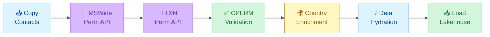

# Microsoft Graph API, Teams, and M365 Integration

> Knowledge pack for M365 Agent Builder | Generated 2026-04-09

---

# Microsoft Graph API Skill

Comprehensive reference for Microsoft Graph API integration including endpoints, authentication, rate limiting, and best practices.

## ⚠️ Staleness Warning

Microsoft Graph APIs evolve frequently. Permissions, endpoints, and authentication flows may change.

**Refresh triggers:**
- Microsoft Graph API version updates
- MSAL library major releases
- Microsoft Entra ID to Microsoft Entra ID migration (completed)
- New Graph scopes or permissions

**Last validated:** February 2026 (Graph v1.0, MSAL 2.x)

**Check current state:** [Graph Explorer](https://developer.microsoft.com/en-us/graph/graph-explorer), [Graph API Reference](https://learn.microsoft.com/graph/api/overview)

---

## API Quick Reference

### Base URLs

| Environment | URL |
|-------------|-----|
| **Production (v1.0)** | `https://graph.microsoft.com/v1.0` |
| **Beta** | `https://graph.microsoft.com/beta` |
| **China (21Vianet)** | `https://microsoftgraph.chinacloudapi.cn/v1.0` |

> **Best Practice**: Use v1.0 for production. Beta endpoints can change without notice.

### Authentication

| Method | Header | Use Case |
|--------|--------|----------|
| **Delegated (user)** | `Authorization: Bearer {token}` | Interactive apps — acts on behalf of signed-in user |
| **Application** | `Authorization: Bearer {token}` | Background services — acts as the app itself |

**Token Acquisition (VS Code Extension)**:
```typescript
// Progressive scope acquisition — request minimal scopes initially
const INITIAL_SCOPES = ['User.Read'];
const FULL_SCOPES = [
    'User.Read',
    'Calendars.Read',
    'Mail.Read',
    'Presence.Read',
    'People.Read',
    'Group.Read.All'
];

async function getGraphToken(): Promise<string | null> {
    const session = await vscode.authentication.getSession(
        'microsoft',
        FULL_SCOPES,
        { createIfNone: false }
    );
    return session?.accessToken ?? null;
}
```

---

## Permissions (Scopes) Reference

### Common Delegated Scopes

| Scope | Purpose |
|-------|---------|
| `User.Read` | Read signed-in user profile |
| `User.ReadBasic.All` | Read basic profile of all users |
| `Mail.Read` | Read user mail |
| `Mail.Send` | Send mail as the user |
| `Calendars.Read` | Read user calendar events |
| `Calendars.ReadWrite` | Create/update calendar events |
| `Presence.Read` | Read user presence status |
| `People.Read` | Read user's relevant people |
| `Group.Read.All` | Read all groups |
| `Sites.Read.All` | Read SharePoint sites |
| `Files.Read.All` | Read all files user can access |
| `Tasks.Read` | Read user's tasks (To Do) |
| `Tasks.ReadWrite` | Create/update tasks (Planner/To Do) |

### Common Application Scopes

| Scope | Purpose |
|-------|---------|
| `User.Read.All` | Read all user profiles (app-only) |
| `Group.Read.All` | Read all groups (app-only) |
| `Mail.Read` | Read all users' mail (requires admin consent) |
| `AuditLog.Read.All` | Read audit logs |
| `Reports.Read.All` | Read M365 usage reports |
| `ServiceHealth.Read.All` | Read M365 service health |

> **Principle of Least Privilege**: Request only the scopes your app actually needs. Start with `User.Read` and add incrementally.

---

## Key Endpoints by Service

### Users

| Operation | Method | Endpoint |
|-----------|--------|----------|
| Get current user | GET | `/me` |
| Get user by ID/UPN | GET | `/users/{id-or-upn}` |
| List users | GET | `/users` |
| Get user photo | GET | `/me/photo/$value` |
| Get manager | GET | `/me/manager` |
| Get direct reports | GET | `/me/directReports` |

### Mail

| Operation | Method | Endpoint |
|-----------|--------|----------|
| List messages | GET | `/me/messages` |
| Get message | GET | `/me/messages/{message-id}` |
| Send mail | POST | `/me/sendMail` |
| List mail folders | GET | `/me/mailFolders` |

### Calendar

| Operation | Method | Endpoint |
|-----------|--------|----------|
| List events | GET | `/me/calendar/events` |
| Calendar view | GET | `/me/calendarView?startDateTime={start}&endDateTime={end}` |
| Create event | POST | `/me/calendar/events` |
| Get event | GET | `/me/events/{event-id}` |

### Presence

| Operation | Method | Endpoint |
|-----------|--------|----------|
| Get my presence | GET | `/me/presence` |
| Get user presence | GET | `/users/{id}/presence` |
| Get presence for multiple | POST | `/communications/getPresencesByUserId` |

### People & Insights

| Operation | Method | Endpoint |
|-----------|--------|----------|
| List relevant people | GET | `/me/people` |
| Get trending docs | GET | `/me/insights/trending` |
| Get used docs | GET | `/me/insights/used` |
| Get shared docs | GET | `/me/insights/shared` |

### SharePoint & OneDrive

| Operation | Method | Endpoint |
|-----------|--------|----------|
| List sites | GET | `/sites` |
| Get site by path | GET | `/sites/{hostname}:/{server-relative-path}` |
| List drives | GET | `/me/drives` |
| List drive items | GET | `/me/drive/root/children` |
| Search files | GET | `/me/drive/root/search(q='{query}')` |
| Upload file | PUT | `/me/drive/items/{parent-id}:/{filename}:/content` |

### Planner (Task Management)

| Operation | Method | Endpoint |
|-----------|--------|----------|
| List plans for group | GET | `/groups/{group-id}/planner/plans` |
| List tasks in plan | GET | `/planner/plans/{plan-id}/tasks` |
| Create task | POST | `/planner/tasks` |
| Update task | PATCH | `/planner/tasks/{task-id}` |
| Get user tasks | GET | `/me/planner/tasks` |

> **Note**: Planner only supports **delegated** permissions. Application permissions are not available.

### To Do

| Operation | Method | Endpoint |
|-----------|--------|----------|
| List task lists | GET | `/me/todo/lists` |
| Create task list | POST | `/me/todo/lists` |
| List tasks | GET | `/me/todo/lists/{list-id}/tasks` |
| Create task | POST | `/me/todo/lists/{list-id}/tasks` |
| Update task | PATCH | `/me/todo/lists/{list-id}/tasks/{task-id}` |

### Groups & Teams

| Operation | Method | Endpoint |
|-----------|--------|----------|
| List groups | GET | `/groups` |
| Get group | GET | `/groups/{group-id}` |
| List group members | GET | `/groups/{group-id}/members` |
| List joined teams | GET | `/me/joinedTeams` |
| Get team channels | GET | `/teams/{team-id}/channels` |
| Post channel message | POST | `/teams/{team-id}/channels/{channel-id}/messages` |

### Service Health & Communications (FishbowlGovernance pattern)

| Operation | Method | Endpoint | Scope |
|-----------|--------|----------|-------|
| List health overviews | GET | `/admin/serviceAnnouncement/healthOverviews` | ServiceHealth.Read.All |
| List active issues | GET | `/admin/serviceAnnouncement/issues` | ServiceHealth.Read.All |
| Get issue detail | GET | `/admin/serviceAnnouncement/issues/{id}` | ServiceHealth.Read.All |
| List message center | GET | `/admin/serviceAnnouncement/messages` | ServiceMessage.Read.All |

**Rate limit**: 1,500 requests / 10 minutes

### Audit Logs (FishbowlGovernance pattern)

| Operation | Method | Endpoint | Scope |
|-----------|--------|----------|-------|
| List directory audits | GET | `/auditLogs/directoryAudits` | AuditLog.Read.All |
| List sign-in logs | GET | `/auditLogs/signIns` | AuditLog.Read.All |
| List provisioning logs | GET | `/auditLogs/provisioning` | AuditLog.Read.All |

**Rate limit**: Security endpoints = 150 requests / 10 minutes

### Sensitivity Labels (Information Protection)

| Operation | Method | Endpoint | Scope |
|-----------|--------|----------|-------|
| List labels | GET | `/informationProtection/policy/labels` | InformationProtectionPolicy.Read |
| Evaluate classification | POST | `/informationProtection/policy/labels/evaluateClassificationResults` | InformationProtectionPolicy.Read |
| Extract label | POST | `/informationProtection/policy/labels/extractLabel` | InformationProtectionPolicy.Read |

---

## Critical Patterns

### Custom Error Types

```typescript
export class GraphRateLimitError extends Error {
  public readonly retryAfter: number;

  constructor(retryAfter: number, message = '') {
    super(`Rate limited. Retry after ${retryAfter}s. ${message}`);
    this.name = 'GraphRateLimitError';
    this.retryAfter = retryAfter;
  }
}

export class GraphApiError extends Error {
  public readonly statusCode: number;
  public readonly errorCode: string;

  constructor(statusCode: number, errorCode: string, message: string) {
    super(`Graph API ${statusCode} (${errorCode}): ${message}`);
    this.name = 'GraphApiError';
    this.statusCode = statusCode;
    this.errorCode = errorCode;
  }
}
```

### API Client Pattern (with retry + timeout)

```typescript
const GRAPH_ENDPOINT = 'https://graph.microsoft.com/v1.0';
const DEFAULT_TIMEOUT_MS = 30000;
const DEFAULT_MAX_RETRIES = 3;

async function graphRequest<T>(
  method: 'GET' | 'POST' | 'PATCH' | 'DELETE',
  endpoint: string,
  options: RequestInit = {},
  config: { timeoutMs?: number; maxRetries?: number; throwOnError?: boolean } = {}
): Promise<T | null> {
    const token = await getGraphToken();
    if (!token) return null;

    const { timeoutMs = DEFAULT_TIMEOUT_MS, maxRetries = DEFAULT_MAX_RETRIES, throwOnError = false } = config;

    for (let attempt = 0; attempt <= maxRetries; attempt++) {
        const controller = new AbortController();
        const timeoutId = setTimeout(() => controller.abort(), timeoutMs);

        try {
            const response = await fetch(`${GRAPH_ENDPOINT}${endpoint}`, {
                method,
                ...options,
                signal: controller.signal,
                headers: { 'Authorization': `Bearer ${token}`, ...options.headers }
            });
            clearTimeout(timeoutId);

            // Handle 429 rate limiting
            if (response.status === 429) {
                const retryAfter = parseInt(response.headers.get('Retry-After') || '10');
                if (attempt < maxRetries) {
                    await new Promise(r => setTimeout(r, retryAfter * 1000));
                    continue;
                }
                if (throwOnError) throw new GraphRateLimitError(retryAfter);
                return null;
            }

            // Handle 5xx with exponential backoff
            if (response.status >= 500 && attempt < maxRetries) {
                await new Promise(r => setTimeout(r, Math.pow(2, attempt) * 1000));
                continue;
            }

            if (!response.ok) {
                if (throwOnError) {
                    const err = await response.json().catch(() => ({}));
                    throw new GraphApiError(response.status, err?.error?.code || 'Unknown', err?.error?.message || response.statusText);
                }
                return null;
            }

            return response.json();
        } catch (error) {
            clearTimeout(timeoutId);
            if (error instanceof Error && error.name === 'AbortError' && attempt < maxRetries) {
                await new Promise(r => setTimeout(r, Math.pow(2, attempt) * 1000));
                continue;
            }
            throw error;
        }
    }
    return null;
}
```

### OData Query Parameters

Graph supports standard OData query parameters:

| Parameter | Example | Purpose |
|-----------|---------|---------|
| `$select` | `?$select=id,displayName,mail` | Return only specified properties |
| `$filter` | `?$filter=department eq 'Engineering'` | Filter results server-side |
| `$orderby` | `?$orderby=displayName` | Sort results |
| `$top` | `?$top=10` | Limit result count |
| `$skip` | `?$skip=20` | Skip N results (not all APIs) |
| `$expand` | `?$expand=manager` | Include related resources inline |
| `$count` | `?$count=true` | Include total count in response |
| `$search` | `?$search="displayName:Fabio"` | Full-text search |

**Combining parameters**:
```http
GET /users?$select=id,displayName,department&$filter=department eq 'Analytics'&$top=25&$orderby=displayName
```

> **Not all endpoints support all parameters.** Check specific endpoint docs.

### Pagination

Graph uses `@odata.nextLink` for pagination:

```typescript
async function graphFetchAll<T>(path: string): Promise<T[]> {
    const token = await getGraphToken();
    if (!token) return [];
    
    const results: T[] = [];
    let url: string | null = `${GRAPH_ENDPOINT}${path}`;

    while (url) {
        const response = await fetch(url, {
            headers: { 'Authorization': `Bearer ${token}` }
        });
        const data = await response.json();
        results.push(...(data.value || []));
        url = data['@odata.nextLink'] || null;
    }

    return results;
}
```

### JSON Batching

Combine up to **20 requests** in a single HTTP call:

```typescript
interface BatchRequest {
    id: string;
    method: 'GET' | 'POST' | 'PATCH' | 'DELETE';
    url: string;
    body?: unknown;
}

async function graphBatch<T>(requests: BatchRequest[]): Promise<Map<string, T>> {
    if (requests.length > 20) {
        console.warn('Batch limit is 20, use graphBatchAll() for unlimited');
        requests = requests.slice(0, 20);
    }

    const response = await graphPost<{ responses: Array<{ id: string; status: number; body: T }> }>(
        '/$batch',
        { requests }
    );

    const results = new Map<string, T>();
    for (const resp of response?.responses || []) {
        if (resp.status >= 200 && resp.status < 300) {
            results.set(resp.id, resp.body);
        }
    }
    return results;
}

// Auto-chunk unlimited requests into batches of 20
async function graphBatchAll<T>(requests: BatchRequest[]): Promise<Map<string, T>> {
    const allResults = new Map<string, T>();
    for (let i = 0; i < requests.length; i += 20) {
        const chunk = requests.slice(i, i + 20);
        const chunkResults = await graphBatch<T>(chunk);
        for (const [id, body] of chunkResults) {
            allResults.set(id, body);
        }
    }
    return allResults;
}
```

### Helper: Build Batch Request

```typescript
function buildBatchRequest(
    method: 'GET' | 'POST' | 'PATCH' | 'DELETE',
    url: string,
    body?: unknown,
    requestId?: string
): BatchRequest {
    return {
        id: requestId || Math.random().toString(36).substring(2, 10),
        method,
        url,
        body,
    };
}
```

---

## Rate Limits & Throttling

### Service-Specific Limits

| Service | Per App per Tenant | Notes |
|---------|-------------------|-------|
| **Outlook (Mail/Calendar)** | 10,000 requests / 10 min | Standard throttling |
| **Teams** | Varies by endpoint | Channel messages more restrictive |
| **SharePoint/OneDrive** | Based on concurrent calls | Use batching |
| **Directory (Users/Groups)** | 10,000 requests / 10 min | Standard throttling |
| **Service Health** | 1,500 requests / 10 min | Lower limit - cache results |
| **Security (Alerts/Incidents)** | 150 requests / 10 min | Much lower - batch carefully |
| **Audit Logs** | 1,000 requests / 10 min | Lower limit - paginate wisely |

### Throttled Response

```http
HTTP/1.1 429 Too Many Requests
Retry-After: 30
```

### Best Practices for Avoiding Throttling

1. Use `$select` to request only needed properties
2. Use `$filter` server-side instead of fetching all and filtering locally
3. Use JSON batching to reduce request count
4. Implement exponential backoff with jitter
5. Cache responses where data doesn't change frequently

---

## Token Lifetime

| Token | Default Lifetime |
|-------|-----------------|
| Access token | 60-90 minutes |
| Refresh token | Up to 90 days |
| ID token | 60 minutes |

> **Always use MSAL** rather than raw OAuth. MSAL handles caching, refresh, and retry automatically.

---

## SDKs & Client Libraries

| Language | Package | Notes |
|----------|---------|-------|
| **TypeScript/JS** | `@microsoft/microsoft-graph-client` | Official SDK |
| **Python** | `msgraph-sdk-python` | Official SDK |
| **PowerShell** | `Microsoft.Graph` | `Install-Module Microsoft.Graph` |
| **.NET** | `Microsoft.Graph` | NuGet package |

---

## Alex-Specific Integration Points

| Feature | Endpoint | Alex Usage |
|---------|----------|------------|
| Calendar context | `/me/calendarView` | Meeting prep, scheduling awareness |
| Email context | `/me/messages` | Communication context |
| **Send email** | `/me/sendMail` | Proactive notifications, weekly reports |
| Presence | `/me/presence` | Availability in status |
| People | `/me/people` | Org context, relevant contacts |
| OneDrive | `/me/drive` | Knowledge file sync |
| **OneDrive upload** | `/me/drive/root:/{path}:/content` | File archival, exports |
| **Service Health** | `/admin/serviceAnnouncement/healthOverviews` | Alex-aware service status |
| **Service Issues** | `/admin/serviceAnnouncement/issues` | Proactive troubleshooting |
| **Sensitivity Labels** | `/me/informationProtection/sensitivityLabels` | Document classification |

---
## References

- [Microsoft Graph Overview](https://learn.microsoft.com/graph/overview)
- [Graph Explorer](https://developer.microsoft.com/en-us/graph/graph-explorer)
- [Graph API Reference (v1.0)](https://learn.microsoft.com/graph/api/overview?view=graph-rest-1.0)
- [Permissions Reference](https://learn.microsoft.com/graph/permissions-reference)
- [Graph API Throttling](https://learn.microsoft.com/graph/throttling)
- [MSAL Overview](https://learn.microsoft.com/entra/msal/overview)
- [JSON Batching](https://learn.microsoft.com/graph/json-batching)

---

# MSAL Authentication

> Microsoft Authentication Library patterns for React/SPA applications with Microsoft Entra ID.

**Version**: 1.0.0

---

## Core Concepts

**Microsoft Authentication Library (MSAL)** handles authentication with Microsoft Entra ID (formerly Microsoft Entra ID). It manages:
- Token acquisition and caching
- Silent token renewal
- Redirect/popup authentication flows
- Multi-tenant and B2B scenarios

### Package Versions

```json
{
  "@azure/msal-browser": "^5.0.0",
  "@azure/msal-react": "^3.0.0"
}
```

---

## Configuration

### Basic MSAL Configuration

```typescript
import { Configuration, PublicClientApplication, LogLevel } from '@azure/msal-browser';

export const msalConfig: Configuration = {
  auth: {
    clientId: import.meta.env.VITE_ENTRA_CLIENT_ID,
    authority: 'https://login.microsoftonline.com/common', // Multi-tenant
    redirectUri: window.location.origin,
    postLogoutRedirectUri: window.location.origin,
    navigateToLoginRequestUrl: true,
  },
  cache: {
    cacheLocation: 'localStorage', // Persist across tabs
    storeAuthStateInCookie: false, // Not needed for modern browsers
  },
  system: {
    loggerOptions: {
      logLevel: import.meta.env.DEV ? LogLevel.Verbose : LogLevel.Warning,
    },
  },
};

export const msalInstance = new PublicClientApplication(msalConfig);
```

### Redirect URI Gotchas (Azure Static Web Apps)

When using `redirectUri: window.location.origin`, you must register redirect URIs for **every hostname** the SPA is served from:

- Custom domains (e.g., `https://portal.example.com`)
- The SWA default hostname (e.g., `https://<app>.<region>.azurestaticapps.net`)

If the app loads (HTTP 200) but auth fails, verify the deployed bundle contains the real client ID (not a build-time placeholder).

### Authority Patterns

| Authority | Use Case |
|-----------|----------|
| `https://login.microsoftonline.com/{tenant-id}` | Single-tenant |
| `https://login.microsoftonline.com/common` | Multi-tenant (any Entra ID) |
| `https://login.microsoftonline.com/organizations` | Work/school accounts only |
| `https://login.microsoftonline.com/consumers` | Personal accounts only |

---

## React Integration

### Provider Setup

```tsx
import { MsalProvider } from '@azure/msal-react';
import { msalInstance } from './authConfig';

// Initialize MSAL before rendering
await msalInstance.initialize();
await msalInstance.handleRedirectPromise();

ReactDOM.createRoot(document.getElementById('root')!).render(
  <MsalProvider instance={msalInstance}>
    <App />
  </MsalProvider>
);
```

### Authentication Hooks

```tsx
import { useIsAuthenticated, useMsal, useAccount } from '@azure/msal-react';

function UserProfile() {
  const isAuthenticated = useIsAuthenticated();
  const { instance, accounts } = useMsal();
  const account = useAccount(accounts[0] ?? {});

  if (!isAuthenticated) return <LoginButton />;

  return (
    <div>
      <p>Welcome, {account?.name}</p>
      <p>Email: {account?.username}</p>
    </div>
  );
}
```

### Conditional Rendering Components

```tsx
import { AuthenticatedTemplate, UnauthenticatedTemplate } from '@azure/msal-react';

function App() {
  return (
    <>
      <AuthenticatedTemplate>
        <Dashboard />
      </AuthenticatedTemplate>
      <UnauthenticatedTemplate>
        <LandingPage />
      </UnauthenticatedTemplate>
    </>
  );
}
```

---

## Token Acquisition

### Scopes Definition

```typescript
export const scopes = {
  graph: ['https://graph.microsoft.com/.default'],
  graphUser: ['User.Read'],
  graphReports: ['Reports.Read.All'],
  arm: ['https://management.azure.com/.default'],
  api: ['api://{api-client-id}/access_as_user'],
};
```

### Silent Token Acquisition (Preferred)

```typescript
async function getAccessToken(
  instance: IPublicClientApplication,
  account: AccountInfo,
  scopes: string[]
): Promise<string> {
  try {
    const response = await instance.acquireTokenSilent({ scopes, account });
    return response.accessToken;
  } catch (error) {
    if (error instanceof InteractionRequiredAuthError) {
      const response = await instance.acquireTokenPopup({ scopes });
      return response.accessToken;
    }
    throw error;
  }
}
```

### Token Acquisition Hook

```tsx
function useAccessToken(scopes: string[]) {
  const { instance, accounts } = useMsal();
  const [token, setToken] = useState<string | null>(null);
  const [error, setError] = useState<Error | null>(null);

  useEffect(() => {
    if (accounts.length === 0) return;
    instance.acquireTokenSilent({ scopes, account: accounts[0] })
      .then(response => setToken(response.accessToken))
      .catch(setError);
  }, [instance, accounts, scopes]);

  return { token, error };
}
```

---

## Multi-Tenant Patterns

### Tenant Detection

```typescript
function getTenantFromAccount(account: AccountInfo): string {
  return account.tenantId || 'unknown';
}

function getTenantName(account: AccountInfo): string {
  const claims = account.idTokenClaims as { tenant_name?: string };
  return claims?.tenant_name || account.tenantId || 'Personal Account';
}
```

### Admin Consent Handling

```typescript
export class AdminConsentRequiredError extends Error {
  public tenantId: string;
  public requiredScopes: string[];

  constructor(tenantId: string, scopes: string[]) {
    super('Admin consent required for this tenant.');
    this.name = 'AdminConsentRequiredError';
    this.tenantId = tenantId;
    this.requiredScopes = scopes;
  }
}

function getAdminConsentUrl(clientId: string, tenantId: string): string {
  const params = new URLSearchParams({
    client_id: clientId,
    redirect_uri: window.location.origin,
    scope: 'https://graph.microsoft.com/.default',
  });
  return `https://login.microsoftonline.com/${tenantId}/adminconsent?${params}`;
}
```

---

## Common Pitfalls

| Issue | Root Cause | Fix |
|-------|-----------|-----|
| Auth fails on SWA | Redirect URI not registered for SWA hostname | Register all hostnames in app registration |
| Token silently fails | Account not in cache | Fallback to interactive with `acquireTokenPopup` |
| CORS error on token | Wrong authority URL | Match authority to app registration tenant |
| Build-time placeholder | `VITE_` env var not set in SWA config | Set in SWA Application Settings |
| Admin consent loop | Org policy blocks consent | Use admin consent URL flow |

---

## Activation Patterns

| Trigger | Response |
|---------|----------|
| "MSAL", "Entra ID", "authentication" | Full skill activation |
| "redirect URI", "auth fails" | Configuration + Gotchas section |
| "token", "silent", "acquireToken" | Token Acquisition section |
| "multi-tenant", "admin consent" | Multi-Tenant Patterns section |
| "React auth", "MsalProvider" | React Integration section |

---

# Microsoft Fabric Governance Skill

> ⚠️ **Staleness Watch** (Last validated: Feb 2026 — REST API v1): Microsoft Fabric ships major features monthly. Monitor the [Fabric release notes](https://learn.microsoft.com/en-us/fabric/release-notes/release-notes) for new item types, API surface changes, and Git integration improvements. The REST API base URL (`api.fabric.microsoft.com/v1`) is stable but new endpoints are added regularly.

## Overview

Expert knowledge for Microsoft Fabric workspace management, governance, and documentation. Covers REST API patterns, medallion architecture implementation, permission compliance pipelines, and automated workspace inspection.

---

## Data Project Scaffolding

### Recommended Folder Structure

```text
data-project/
├── .github/
│   ├── copilot-instructions.md    # Data project context
│   └── prompts/
│       └── pipeline-review.prompt.md
├── docs/
│   ├── DATA-PLAN.md               # Project scope, objectives
│   ├── DATA-DICTIONARY.md         # Field definitions
│   ├── LINEAGE.md                 # Data flow documentation
│   └── architecture/
│       └── medallion-design.md
├── pipelines/
│   ├── bronze/                     # Raw ingestion
│   │   └── [source]-ingest.py
│   ├── silver/                     # Cleansing, standardization
│   │   └── [entity]-transform.py
│   └── gold/                       # Business logic, aggregations
│       └── [domain]-model.py
├── notebooks/
│   ├── exploration/               # EDA notebooks
│   └── prototypes/                # Pipeline prototypes
├── schemas/
│   ├── bronze/
│   ├── silver/
│   └── gold/
├── tests/
│   ├── unit/
│   └── data-quality/
├── config/
│   ├── connections.yaml
│   └── environments/
│       ├── dev.yaml
│       └── prod.yaml
└── README.md
```

### DATA-PLAN.md Template

```markdown
# Data Plan: [Project Name]

## Objective
[What business problem does this data pipeline solve?]

## Data Sources

| Source | Type | Frequency | Volume |
|--------|------|-----------|--------|
| [System A] | [API/Database/File] | [Daily/Hourly/Real-time] | [~X records/day] |

## Medallion Architecture

| Layer | Description | Key Transformations |
|-------|-------------|---------------------|
| Bronze | Raw ingestion from [sources] | Minimal: schema enforcement, timestamps |
| Silver | Cleansed, standardized | Deduplication, type casting, validation |
| Gold | Business-ready | Joins, aggregations, business logic |

## Data Quality Rules

| Rule | Layer | Implementation |
|------|-------|----------------|
| No nulls in [field] | Silver | Validation check |
| Referential integrity | Gold | Foreign key check |

## Success Criteria
- [ ] All sources ingesting to Bronze
- [ ] Silver quality checks passing
- [ ] Gold tables serving [consumers]
- [ ] Documentation complete
```

### DATA-DICTIONARY.md Template

```markdown
# Data Dictionary: [Dataset Name]

## Tables

### [table_name]
**Layer**: Gold
**Description**: [What this table represents]
**Update Frequency**: [Daily/Hourly]
**Primary Key**: [field]

| Field | Type | Description | Nullable | Example |
|-------|------|-------------|----------|---------|
| id | STRING | Unique identifier | No | "abc123" |
| created_at | TIMESTAMP | Record creation time | No | 2026-02-07T10:00:00Z |
| [field] | [TYPE] | [Description] | [Yes/No] | [Example] |

**Business Rules**:
- [Rule 1]
- [Rule 2]

**Lineage**: Bronze.[source_table] → Silver.[cleaned_table] → Gold.[table_name]
```

### copilot-instructions.md Template (Data Projects)

```markdown
# [Project Name] — Data Engineering Context

## Overview
[What data problem this project solves]

## Current Phase
- [ ] Source analysis
- [ ] Bronze layer
- [ ] Silver layer
- [ ] Gold layer
- [ ] Documentation

## Key Files
- Data plan: docs/DATA-PLAN.md
- Data dictionary: docs/DATA-DICTIONARY.md
- Lineage: docs/LINEAGE.md

## Alex Guidance
- **Platform**: [Fabric/Databricks/Snowflake/etc.]
- **Language**: [Python/SQL/Spark]
- Follow medallion architecture patterns
- Document data quality rules
- Include idempotency in pipeline designs

## Conventions
- Table naming: [layer]_[domain]_[entity]
- Pipeline naming: [source]_to_[target]_[frequency]
- Use incremental loads where possible

## Don't
- Don't modify Bronze layer (append-only)
- Don't hardcode connection strings
- Don't skip data quality checks
```

---

## Activation Triggers

- "Fabric workspace", "Fabric API", "Fabric governance"
- "medallion architecture", "bronze silver gold", "lakehouse"
- "Unity Catalog", "schema-enabled lakehouse"
- "permission pipeline", "contact compliance"
- "workspace inventory", "Fabric scanner"

## Knowledge Domains

### 1. Microsoft Fabric REST API

**Endpoint Structure**:
```
Base URL: https://api.fabric.microsoft.com/v1
Workspaces: /workspaces/{workspaceId}
Items: /workspaces/{workspaceId}/items?type={type}
Definitions: /workspaces/{workspaceId}/{type}/{itemId}/getDefinition
```

**Async Operation Pattern**:
1. POST to definition endpoint
2. Receive 202 Accepted with `Location` header
3. Poll `Location` URL until status = `Succeeded`
4. GET `/result` endpoint for payload
5. Decode base64 content for notebooks

**Authentication**:
```powershell
# Fabric API token
$fabricToken = az account get-access-token --resource https://api.fabric.microsoft.com --query accessToken -o tsv

# Unity Catalog token (for schema-enabled lakehouses)
$storageToken = az account get-access-token --resource https://storage.azure.com --query accessToken -o tsv
```

### 2. Medallion Architecture

**Layer Design**:

| Layer | Purpose | Lakehouse Type | Schema |
|-------|---------|----------------|--------|
| Bronze | Raw ingestion | Standard | Default |
| Silver | Cleansed data | Standard | Default |
| Gold | Domain models | Schema-enabled | dbo, CxPulse |

**Table Distribution Pattern** (Fishbowl Example):
- Bronze: 88 tables (raw data from 5+ systems)
- Silver: 77 tables (cleansed, standardized)
- Gold: 39 tables (domain-separated)

**Key Insight**: Gold layer benefits from schema-enabled lakehouses for domain organization while Bronze/Silver remain standard for ingestion flexibility.

### 3. Permission Compliance Pipeline

**7-Step CPM Pattern**:


**Permission Tables**:
- `CPERM_OptOut` - Marketing opt-outs
- `US_FAR_List` - US government exclusions
- `US_CAPSL_List` - CAPSL compliance
- `SpamHaus_List` - Known bad actors

### 4. Unity Catalog Integration

**Schema-Enabled Lakehouse Access**:
```python
# Catalog URL pattern
catalog_url = f"https://onelake.table.fabric.microsoft.com/delta/{workspace_id}/{lakehouse_id}"

# List schemas
GET /schemas

# List tables in schema
GET /schemas/{schema_name}/tables
```

**Domain Organization**:
- Use schemas for domain separation (dbo, CxPulse)
- Enable for Gold layer business domains
- Keep Bronze/Silver as standard for flexibility

### 5. PowerShell Automation

**Workspace Scanner Pattern**:
```powershell
# Use Invoke-WebRequest for header access (not Invoke-RestMethod)
$response = Invoke-WebRequest -Uri $uri -Headers $headers -Method Post

# Handle 202 Accepted
if ($response.StatusCode -eq 202) {
    $operationUrl = $response.Headers["Location"][0]

    # Poll for completion
    do {
        Start-Sleep -Seconds 2
        $status = Invoke-RestMethod -Uri $operationUrl -Headers $headers
    } while ($status.status -ne "Succeeded")

    # Get result
    $result = Invoke-RestMethod -Uri "$operationUrl/result" -Headers $headers
}
```

## Documentation Patterns

### Inventory Structure

1. **Executive Summary** - Metrics and architecture overview
2. **Mermaid Diagrams** - Visual architecture representation
3. **Item Inventory** - Complete list with IDs
4. **Table Catalog** - All tables by lakehouse
5. **Code Analysis** - Notebook/pipeline functions
6. **Data Flow** - End-to-end lineage

### Recommended Diagrams

- Data flow (C4 or flowchart)
- Data lineage (graph)
- Lakehouse architecture (container)
- Permission pipeline (sequence)
- Monitoring topology (deployment)

## Best Practices

### Workspace Governance

1. **Naming Conventions**: Use prefixes (Bronze_, Silver_, Gold_)
2. **Schema Separation**: Domain-specific schemas in Gold layer
3. **Permission Layers**: Sequential filtering for compliance
4. **Documentation**: Maintain inventory with actual IDs

### API Usage

1. **Token Caching**: Refresh every 60 minutes
2. **Rate Limiting**: Implement exponential backoff
3. **Async Handling**: Always check for 202 responses
4. **Error Recovery**: Log operation URLs for retry

### Medallion Implementation

1. **Bronze**: Accept all formats, minimal transformation
2. **Silver**: Standardize types, deduplicate, validate
3. **Gold**: Domain models, business logic, aggregations
## Related Resources

- [Microsoft Fabric REST API Documentation](https://learn.microsoft.com/en-us/rest/api/fabric/)
- [Unity Catalog API](https://learn.microsoft.com/en-us/fabric/onelake/onelake-unity-catalog)
- [Medallion Architecture](https://learn.microsoft.com/en-us/azure/databricks/lakehouse/medallion)

---

*Skill created from Fishbowl workspace inspection session, February 2026*

---

# Enterprise Integration Skill

Expert in building enterprise features with Microsoft Graph API, Microsoft Entra ID authentication, and enterprise-mode feature gating for VS Code extensions.

## ⚠️ Staleness Warning

Microsoft Graph and Microsoft Entra ID APIs evolve frequently. Authentication flows and permission models change.

**Refresh triggers:**
- Microsoft Graph API version updates
- MSAL library major releases
- Microsoft Entra ID rebranded to Microsoft Entra ID
- New Graph scopes or permissions

**Last validated:** February 2026 (MSAL 2.x, Graph v1.0)

**Check current state:** [Microsoft Graph docs](https://docs.microsoft.com/graph), [MSAL.js docs](https://github.com/AzureAD/microsoft-authentication-library-for-js)

---

## Microsoft Graph Integration Pattern

### Authentication Flow

```typescript
// Progressive scope acquisition - request minimal scopes initially
const INITIAL_SCOPES = ['User.Read'];
const GRAPH_SCOPES = [
    'User.Read',
    'Calendars.Read',
    'Mail.Read',
    'Presence.Read',
    'People.Read'
];

// Get token with automatic scope upgrade
async function getGraphToken(): Promise<string | null> {
    const session = await vscode.authentication.getSession(
        'microsoft',
        GRAPH_SCOPES,
        { createIfNone: false }
    );
    return session?.accessToken ?? null;
}

// Check availability without triggering auth prompt
function isGraphAvailable(): boolean {
    return !!cachedToken && isEnterpriseMode();
}
```

### API Client Pattern

```typescript
const GRAPH_ENDPOINT = 'https://graph.microsoft.com/v1.0';

async function graphFetch<T>(path: string): Promise<T | null> {
    const token = await getGraphToken();
    if (!token) return null;
    
    const response = await fetch(`${GRAPH_ENDPOINT}${path}`, {
        headers: { 'Authorization': `Bearer ${token}` }
    });
    
    if (!response.ok) {
        console.error(`Graph API error: ${response.status}`);
        return null;
    }
    
    return response.json();
}
```

### Feature-Specific Endpoints

| Feature | Endpoint | Scope Required |
|---------|----------|----------------|
| Calendar | `/me/calendar/events` | `Calendars.Read` |
| Mail | `/me/messages` | `Mail.Read` |
| Presence | `/me/presence` | `Presence.Read` |
| People | `/me/people` | `People.Read` |
| User Profile | `/me` | `User.Read` |

---

## Enterprise Feature Gating

### Setting-Based Gating

```typescript
// Check enterprise mode is enabled
function isEnterpriseMode(): boolean {
    const config = vscode.workspace.getConfiguration('alex.enterprise');
    return config.get<boolean>('enabled', false);
}

// Check specific feature is enabled
function isCalendarEnabled(): boolean {
    if (!isEnterpriseMode()) return false;
    const config = vscode.workspace.getConfiguration('alex.enterprise.graph');
    return config.get<boolean>('calendarEnabled', true);
}
```

### Conditional UI Elements

```typescript
// In WebviewView provider
private getHtmlContent(): string {
    const showEnterprise = isEnterpriseMode();
    const graphConnected = isGraphAvailable();
    
    return `
        ${showEnterprise ? `
            <section class="enterprise">
                <h3>Enterprise</h3>
                ${graphConnected 
                    ? this.getGraphButtons() 
                    : this.getSignInButton()}
            </section>
        ` : ''}
    `;
}
```

### Command Conditional Display

```json
{
    "commands": [
        {
            "name": "calendar",
            "description": "View upcoming calendar events",
            "when": "config.alex.enterprise.enabled"
        }
    ]
}
```

---

## Settings Organization Pattern

Enterprise settings should be hierarchically organized:

```json
{
    "alex.enterprise.enabled": {
        "type": "boolean",
        "default": false,
        "description": "Master toggle for enterprise features"
    },
    "alex.enterprise.graph.enabled": {
        "type": "boolean", 
        "default": true,
        "description": "Enable Microsoft Graph integration"
    },
    "alex.enterprise.graph.calendarEnabled": {
        "type": "boolean",
        "default": true,
        "description": "Feature-specific toggle"
    },
    "alex.enterprise.graph.calendarDaysAhead": {
        "type": "number",
        "default": 7,
        "minimum": 1,
        "maximum": 30,
        "description": "Feature-specific configuration"
    }
}
```

**Hierarchy**: `extension.area.feature.setting`

---

## Chat Command Handler Pattern

```typescript
interface IAlexChatResult extends vscode.ChatResult {
    metadata?: {
        command?: string;
        // Command-specific metadata
        eventCount?: number;
        messageCount?: number;
        error?: boolean;
    };
}

async function handleCalendarCommand(
    request: vscode.ChatRequest,
    stream: vscode.ChatResponseStream,
    token: vscode.CancellationToken
): Promise<IAlexChatResult> {
    // Check prerequisites
    if (!isEnterpriseMode()) {
        stream.markdown('Enterprise mode is not enabled.');
        return { metadata: { command: 'calendar', error: true } };
    }
    
    if (!isGraphAvailable()) {
        stream.markdown('Please sign in to Microsoft Graph first.');
        return { metadata: { command: 'calendar', error: true } };
    }
    
    // Execute feature logic
    const events = await getCalendarEvents();
    stream.markdown(formatCalendarEvents(events));
    
    return { 
        metadata: { 
            command: 'calendar', 
            eventCount: events.length 
        } 
    };
}
```

---

## Example Usage

- "How do I add Microsoft Graph authentication?"
- "Show me the enterprise feature gating pattern"
- "What scopes do I need for calendar access?"
- "How do I organize enterprise settings?"

## Related Skills

- [VS Code Extension Patterns](..\vscode-extension-patterns/SKILL.md) - General extension patterns
- [API Design](..\api-design/SKILL.md) - API client patterns
- [Security Review](..\security-review/SKILL.md) - Auth security considerations
