# Microsoft Fabric Governance Skill

## Overview

Expert knowledge for Microsoft Fabric workspace management, governance, and documentation. Covers REST API patterns, medallion architecture implementation, permission compliance pipelines, and automated workspace inspection.

## Activation Triggers

- "Fabric workspace", "Fabric API", "Fabric governance"
- "medallion architecture", "bronze silver gold", "lakehouse"
- "Unity Catalog", "schema-enabled lakehouse"
- "permission pipeline", "contact compliance"
- "workspace inventory", "Fabric scanner"

## Knowledge Domains

### 1. Microsoft Fabric REST API

**Endpoint Structure**:
```
Base URL: https://api.fabric.microsoft.com/v1
Workspaces: /workspaces/{workspaceId}
Items: /workspaces/{workspaceId}/items?type={type}
Definitions: /workspaces/{workspaceId}/{type}/{itemId}/getDefinition
```

**Async Operation Pattern**:
1. POST to definition endpoint
2. Receive 202 Accepted with `Location` header
3. Poll `Location` URL until status = `Succeeded`
4. GET `/result` endpoint for payload
5. Decode base64 content for notebooks

**Authentication**:
```powershell
# Fabric API token
$fabricToken = az account get-access-token --resource https://api.fabric.microsoft.com --query accessToken -o tsv

# Unity Catalog token (for schema-enabled lakehouses)
$storageToken = az account get-access-token --resource https://storage.azure.com --query accessToken -o tsv
```

### 2. Medallion Architecture

**Layer Design**:

| Layer | Purpose | Lakehouse Type | Schema |
|-------|---------|----------------|--------|
| Bronze | Raw ingestion | Standard | Default |
| Silver | Cleansed data | Standard | Default |
| Gold | Domain models | Schema-enabled | dbo, CxPulse |

**Table Distribution Pattern** (Fishbowl Example):
- Bronze: 88 tables (raw data from 5+ systems)
- Silver: 77 tables (cleansed, standardized)
- Gold: 39 tables (domain-separated)

**Key Insight**: Gold layer benefits from schema-enabled lakehouses for domain organization while Bronze/Silver remain standard for ingestion flexibility.

### 3. Permission Compliance Pipeline

**7-Step CPM Pattern**:

```mermaid
%%{init: {'theme': 'base', 'themeVariables': { 'edgeLabelBackground':'#ffffff', 'lineColor': '#57606a' }}}%%
graph LR
    A["📥 Copy<br/>Contacts"] --> B["🔐 MSWide<br/>Perm API"]
    B --> C["🔐 TXN<br/>Perm API"]
    C --> D["✅ CPERM<br/>Validation"]
    D --> E["🌍 Country<br/>Enrichment"]
    E --> F["💧 Data<br/>Hydration"]
    F --> G["📤 Load<br/>Lakehouse"]

    style A fill:#ddf4ff,color:#0550ae,stroke:#80ccff
    style B fill:#d8b9ff,color:#6639ba,stroke:#bf8aff
    style C fill:#d8b9ff,color:#6639ba,stroke:#bf8aff
    style D fill:#d3f5db,color:#1a7f37,stroke:#6fdd8b
    style E fill:#fff8c5,color:#9a6700,stroke:#d4a72c
    style F fill:#ddf4ff,color:#0550ae,stroke:#80ccff
    style G fill:#d3f5db,color:#1a7f37,stroke:#6fdd8b

    linkStyle default stroke:#57606a,stroke-width:1.5px
```


**Permission Tables**:
- `CPERM_OptOut` - Marketing opt-outs
- `US_FAR_List` - US government exclusions
- `US_CAPSL_List` - CAPSL compliance
- `SpamHaus_List` - Known bad actors

### 4. Unity Catalog Integration

**Schema-Enabled Lakehouse Access**:
```python
# Catalog URL pattern
catalog_url = f"https://onelake.table.fabric.microsoft.com/delta/{workspace_id}/{lakehouse_id}"

# List schemas
GET /schemas

# List tables in schema
GET /schemas/{schema_name}/tables
```

**Domain Organization**:
- Use schemas for domain separation (dbo, CxPulse)
- Enable for Gold layer business domains
- Keep Bronze/Silver as standard for flexibility

### 5. PowerShell Automation

**Workspace Scanner Pattern**:
```powershell
# Use Invoke-WebRequest for header access (not Invoke-RestMethod)
$response = Invoke-WebRequest -Uri $uri -Headers $headers -Method Post

# Handle 202 Accepted
if ($response.StatusCode -eq 202) {
    $operationUrl = $response.Headers["Location"][0]

    # Poll for completion
    do {
        Start-Sleep -Seconds 2
        $status = Invoke-RestMethod -Uri $operationUrl -Headers $headers
    } while ($status.status -ne "Succeeded")

    # Get result
    $result = Invoke-RestMethod -Uri "$operationUrl/result" -Headers $headers
}
```

## Documentation Patterns

### Inventory Structure

1. **Executive Summary** - Metrics and architecture overview
2. **Mermaid Diagrams** - Visual architecture representation
3. **Item Inventory** - Complete list with IDs
4. **Table Catalog** - All tables by lakehouse
5. **Code Analysis** - Notebook/pipeline functions
6. **Data Flow** - End-to-end lineage

### Recommended Diagrams

- Data flow (C4 or flowchart)
- Data lineage (graph)
- Lakehouse architecture (container)
- Permission pipeline (sequence)
- Monitoring topology (deployment)

## Best Practices

### Workspace Governance

1. **Naming Conventions**: Use prefixes (Bronze_, Silver_, Gold_)
2. **Schema Separation**: Domain-specific schemas in Gold layer
3. **Permission Layers**: Sequential filtering for compliance
4. **Documentation**: Maintain inventory with actual IDs

### API Usage

1. **Token Caching**: Refresh every 60 minutes
2. **Rate Limiting**: Implement exponential backoff
3. **Async Handling**: Always check for 202 responses
4. **Error Recovery**: Log operation URLs for retry

### Medallion Implementation

1. **Bronze**: Accept all formats, minimal transformation
2. **Silver**: Standardize types, deduplicate, validate
3. **Gold**: Domain models, business logic, aggregations

## Synapses

```json
{
  "version": "1.0",
  "skill": "microsoft-fabric",
  "connections": [
    {
      "target": "medallion-architecture",
      "type": "Implements",
      "strength": "Critical"
    },
    {
      "target": "data-governance",
      "type": "Enables",
      "strength": "Critical"
    },
    {
      "target": "powershell-automation",
      "type": "Integrates",
      "strength": "High"
    },
    {
      "target": "api-design",
      "type": "Follows",
      "strength": "High"
    },
    {
      "target": "compliance-pipelines",
      "type": "Implements",
      "strength": "Critical"
    }
  ]
}
```

## Related Resources

- [Microsoft Fabric REST API Documentation](https://learn.microsoft.com/en-us/rest/api/fabric/)
- [Unity Catalog API](https://learn.microsoft.com/en-us/fabric/onelake/onelake-unity-catalog)
- [Medallion Architecture](https://learn.microsoft.com/en-us/azure/databricks/lakehouse/medallion)

---

*Skill created from Fishbowl workspace inspection session, February 2026*
