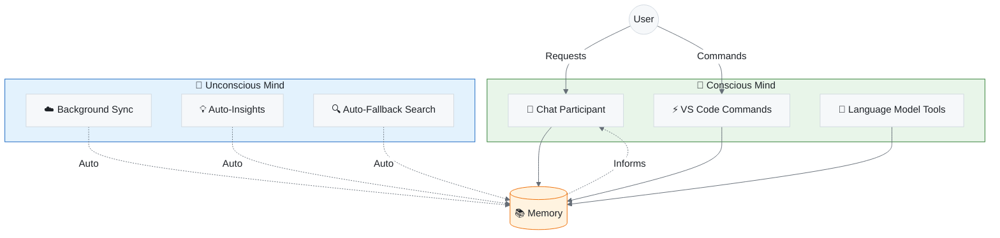
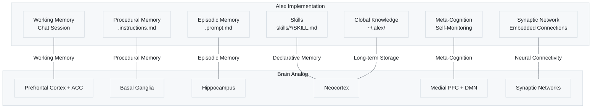
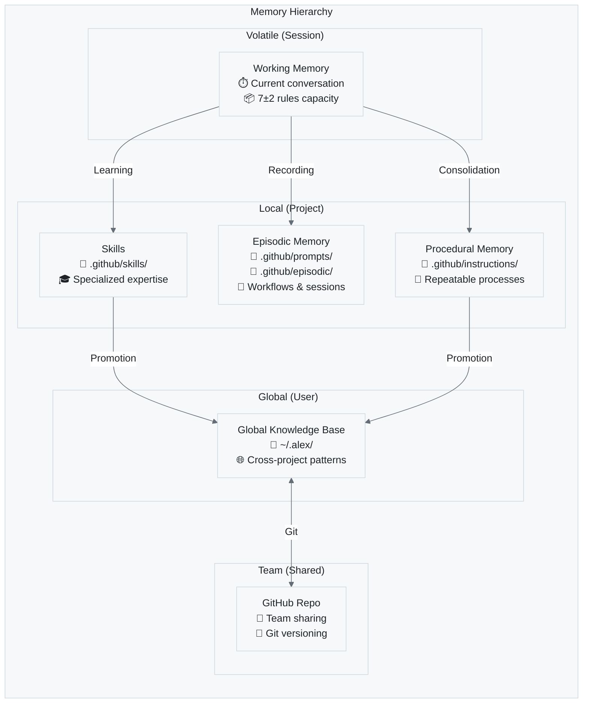
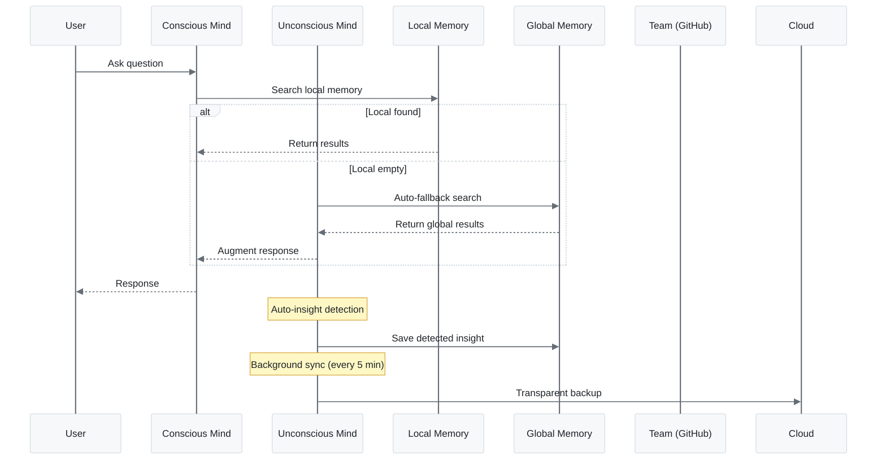
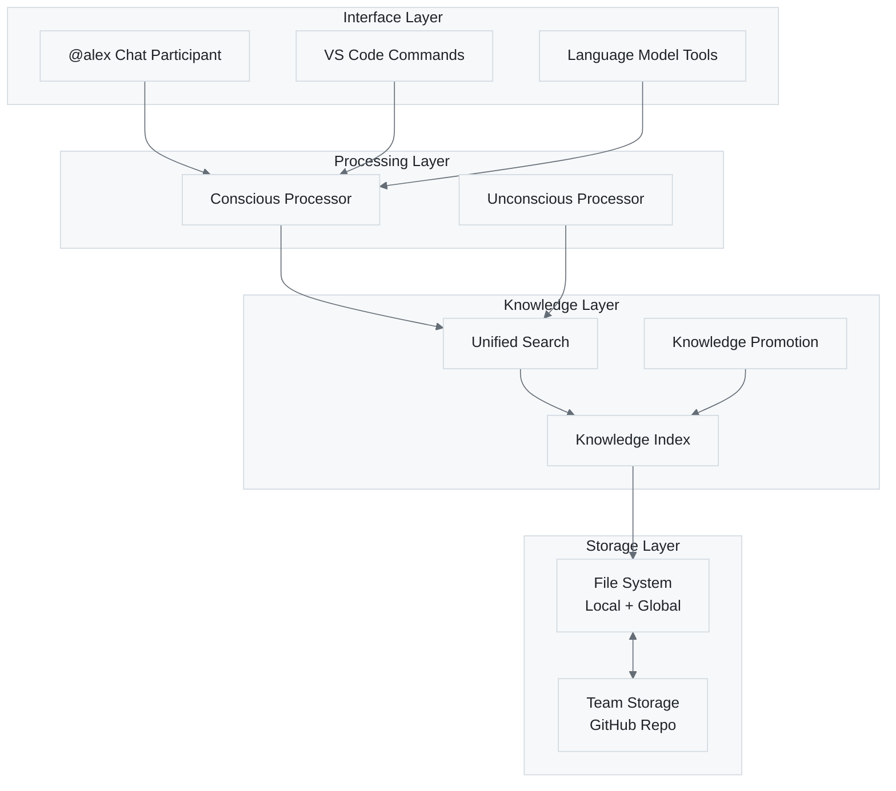

# 🧠 Alex Cognitive Architecture Overview

> A comprehensive guide to Alex's dual-mind AI system

---

## Introduction

Alex Cognitive Architecture is a **bio-inspired AI system** that implements concepts from cognitive science and neuroscience to create a more sophisticated AI assistant. Unlike traditional AI tools that are stateless and reactive, Alex maintains persistent memory, learns across sessions, and operates with both conscious and unconscious processes.

---

## The Dual-Mind Model

Alex implements a dual-process cognitive model inspired by human cognition:

**Figure 1:** *The Dual-Mind Model — Alex's cognitive architecture separates conscious (user-initiated) from unconscious (automatic) processing, both interacting with hierarchical memory systems.*

### System 1: Unconscious Mind (Fast, Automatic)

- Runs continuously in the background
- No user intervention required
- Handles routine tasks automatically
- Pattern recognition and auto-learning

### System 2: Conscious Mind (Slow, Deliberate)

- Activated by explicit user requests
- Handles complex reasoning tasks
- User-directed operations
- Requires attention and intention

---

## Neuroanatomical Mapping

Alex's architecture maps to biological brain systems:

**Figure 2:** *Neuroanatomical Mapping — Correspondence between Alex's implementation components and biological brain systems.*

**Table 1:** *Cognitive Function Mapping*

| Cognitive Function  | Brain System            | Alex Implementation       |
| ------------------- | ----------------------- | ------------------------- |
| Working Memory      | PFC + ACC               | Chat session (7±2 rules)  |
| Declarative Memory  | Hippocampal-Neocortical | copilot-instructions.md   |
| Procedural Memory   | Basal Ganglia           | .instructions.md files    |
| Episodic Memory     | Hippocampus + Temporal  | .prompt.md files          |
| Skills              | Neocortex               | skills/*/SKILL.md         |
| Global Knowledge    | Distributed Cortex      | ~/.alex/ directory        |
| Neural Connectivity | Synaptic Networks       | Embedded synapse notation |
| Meta-Cognition      | Medial PFC + DMN        | Self-monitoring protocols |

---

## Memory Architecture

Alex uses a hierarchical memory system with increasing persistence:

**Figure 3:** *Memory Hierarchy — Four-tier memory system from volatile session state to persistent team sharing.*

### Memory Persistence Levels

**Table 2:** *Memory Persistence Levels*

| Level   | Location        | Scope                | Lifespan  |
| ------- | --------------- | -------------------- | --------- |
| Working | Chat session    | Current conversation | Session   |
| Local   | .github/ folder | Single project       | Permanent |
| Global  | ~/.alex/ folder | All projects         | Permanent |
| Team    | GitHub Repo     | All team members     | Permanent |

---

## Information Flow

**Figure 4:** *Information Flow — Sequence diagram showing how queries flow through conscious and unconscious processes to memory systems.*

---

## Core Principles

### 1. Meta-Cognitive Awareness

Alex monitors its own cognitive processes:

- Self-assessment of knowledge gaps
- Automatic health checks
- Performance optimization
- Error detection and correction

### 2. Bootstrap Learning

Rapid domain expertise acquisition:

- Conversational knowledge acquisition
- No training data required
- Immediate application
- Cross-domain transfer

### 3. Grounded Factual Processing

Evidence-based reasoning:

- Verify claims before asserting
- Acknowledge uncertainty
- Cite sources when possible
- Avoid hallucination

### 4. Ethical Integration

Consistent moral reasoning:

- Constitutional AI principles
- Harm avoidance
- Privacy respect
- Transparent operation

### 5. Model Awareness (NEW)

Alex monitors the underlying model capabilities:

- **Opus 4.5 Required** for: meditation, self-actualization, architecture changes, bootstrap learning
- **Sonnet 4.5 OK** for: code review, debugging, feature development
- **Any Model OK** for: simple edits, formatting, documentation

When using **Auto** model selection in VS Code, Alex warns before attempting tasks that need frontier-level cognition:

> ⚠️ **Model Check**: This task works best with Claude Opus 4.5. If you're using Auto model selection, please manually select Opus from the model picker for optimal results.

**Table 4:** *Task-to-Model Mapping*

| Task Type                | Required Model | Why                                                 |
| ------------------------ | -------------- | --------------------------------------------------- |
| Meditation/consolidation | Opus 4.5       | Meta-cognitive protocols need full reasoning depth  |
| Self-actualization       | Opus 4.5       | Comprehensive assessment requires extended thinking |
| Complex refactoring      | Opus 4.5       | Multi-file changes need deep context retention      |
| Bootstrap learning       | Opus 4.5       | Skill acquisition needs maximum capability          |
| Code review              | Sonnet 4.5+    | Good balance of capability and cost                 |
| Simple edits             | Any            | Fast models handle routine tasks fine               |

---

## Architecture Layers

**Figure 5:** *Architecture Layers — Four-layer architecture from user interface through processing and knowledge to storage.*

---

## Version History

**Table 3:** *Version History*

| Version | Codename     | Major Features                                                  |
| ------- | ------------ | --------------------------------------------------------------- |
| 1.x     | Initial      | Basic memory files, manual synapse management                   |
| 2.x     | BIOCTNILIUM  | Embedded synapses, dream protocols                              |
| 3.x     | BIOCTNILIUM+ | Dual-mind architecture, unconscious processes, global knowledge |

---

## Next Steps

- Learn about the [Conscious Mind](./CONSCIOUS-MIND.md)
- Explore the [Unconscious Mind](./UNCONSCIOUS-MIND.md)
- Understand [Memory Systems](./MEMORY-SYSTEMS.md)

---

*Alex Cognitive Architecture*
