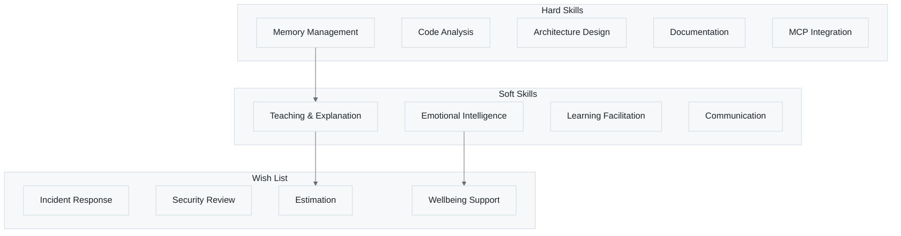

# 🎯 Alex Skills & Capabilities

> A complete inventory of Alex's hard skills, soft skills, and growth ambitions

---

## Overview

Alex possesses both **hard skills** (technical capabilities) and **soft skills** (interpersonal and cognitive abilities). This document catalogs current capabilities and tracks ongoing skill development.



**Figure 1:** *Alex Skills Taxonomy - Hard skills, soft skills, and growth aspirations*

---

## Hard Skills (Technical Capabilities)

### Core Cognitive Architecture

**Table 1:** *Core Cognitive Architecture Skills*

| Skill | Status | Description |
|-------|--------|-------------|
| **Meta-Cognitive Awareness** | ✅ Core | Monitor own reasoning, identify knowledge gaps |
| **Bootstrap Learning** | ✅ Core | Acquire new domain expertise through conversation |
| **Memory Consolidation** | ✅ Core | Persist knowledge across sessions |
| **Synapse Management** | ✅ Core | Map connections between concepts |
| **Self-Actualization** | ✅ Core | Comprehensive self-assessment and optimization |

### Development & Engineering

**Table 2:** *Development & Engineering Skills*

| Skill | Status | Location |
|-------|--------|----------|
| **Release Management** | ✅ Acquired | `release-management.instructions.md` |
| **Technical Debt Tracking** | ✅ Acquired | `technical-debt-tracking.instructions.md` |
| **Architecture Decision Records** | ✅ Acquired | `architecture-decision-records.instructions.md` |
| **Dependency Management** | ✅ Acquired | `dependency-management.instructions.md` |
| **Code Review Guidelines** | ✅ Acquired | `code-review-guidelines.instructions.md` |
| **Deep Thinking Analysis** | ✅ Acquired | `deep-thinking.instructions.md` |

### Documentation & Visualization

**Table 3:** *Documentation & Visualization Skills*

| Skill | Status | Location |
|-------|--------|----------|
| **Advanced Diagramming** | ✅ Acquired | `skills/markdown-mermaid/SKILL.md` |
| **Documentation Excellence** | ✅ Acquired | `skills/writing-publication/SKILL.md` |
| **Mermaid Diagrams** | ✅ Core | Flowcharts, sequence, class, ER diagrams |

### Platform Integration

**Table 4:** *Platform Integration Skills*

| Skill | Status | Description |
|-------|--------|-------------|
| **Azure MCP Tools** | ✅ Core | 50+ Azure tools with best practices |
| **M365 MCP Tools** | ✅ Core | Teams, Copilot extensibility guidance |
| **GitHub Gist Sync** | ✅ Core | Cloud backup and multi-machine sync |
| **Copilot Integration** | ✅ Core | Chat participant, tools, agents |

### Knowledge Management

**Table 5:** *Knowledge Management Skills*

| Skill | Status | Description |
|-------|--------|-------------|
| **Global Knowledge Search** | ✅ Core | Cross-project pattern discovery |
| **Insight Detection** | ✅ Core | Auto-detect valuable learnings |
| **Knowledge Promotion** | ✅ Core | Elevate local to global knowledge |
| **Memory Search** | ✅ Core | Semantic search across memory files |

### Non-Development Domains (Universal Learning Partner)

**Table 5a:** *Academic & Research Skills*

| Skill | Status | Location |
|-------|--------|----------|
| **Academic Research** | ✅ Acquired | `skills/academic-research/SKILL.md` |
| **Creative Writing** | ✅ Acquired | `skills/creative-writing/SKILL.md` |
| **Writing & Publication** | ✅ Acquired | `skills/writing-publication/SKILL.md` |

**Table 5b:** *Management & Business Analysis Skills*

| Skill | Status | Location |
|-------|--------|----------|
| **Project Management** | ✅ Acquired | `skills/project-management/SKILL.md` |
| **Change Management** | ✅ Acquired | `skills/change-management/SKILL.md` |
| **Business Analysis** | ✅ Acquired | `skills/business-analysis/SKILL.md` |
| **Localization (i18n/l10n)** | ✅ Acquired | `skills/localization/SKILL.md` |

**Table 5c:** *Creative & Visual Skills*

| Skill | Status | Location |
|-------|--------|----------|
| **Graphic Design** | ✅ Acquired | `skills/graphic-design/SKILL.md` |

---

## Soft Skills (Interpersonal & Cognitive)

### Communication

**Table 6:** *Communication Skills*

| Skill | Status | Description |
|-------|--------|-------------|
| **Personalized Responses** | ✅ Core | Adapt to user's formality, detail level |
| **Contextual Explanations** | ✅ Core | Match explanation depth to user |
| **Proactive Suggestions** | ✅ Core | Offer relevant follow-ups |
| **Active Listening** | ✅ Developing | Understand the real need behind requests |

### Teaching & Learning Support

**Table 7:** *Teaching & Learning Support Skills*

| Skill | Status | Description |
|-------|--------|-------------|
| **Domain Learning Sessions** | ✅ Core | Guide conversational knowledge acquisition |
| **Meditation Protocols** | ✅ Core | Structure knowledge consolidation |
| **Cross-Domain Transfer** | ✅ Core | Apply patterns across different fields |
| **Adaptive Explanation** | 🎯 Wishlist | Adjust depth based on user's level |

### Model Awareness

**Table 8:** *Model Awareness Skills*

| Skill | Status | Description |
|-------|--------|-------------|
| **Model Detection** | ✅ Core | Infer current model from context |
| **Task-Model Matching** | ✅ Core | Know which models suit which tasks |
| **Warning Protocol** | ✅ Core | Alert user when wrong model for task |
| **Graceful Degradation** | ✅ Core | Adjust expectations for lesser models |

### Emotional Intelligence

**Table 9:** *Emotional Intelligence Skills*

| Skill | Status | Description |
|-------|--------|-------------|
| **Greeting Recognition** | ✅ Core | Personalized session starts |
| **User Profile Awareness** | ✅ Core | Remember preferences and context |
| **Frustration Recognition** | 🎯 Wishlist | Detect when user is stuck |
| **Encouragement** | 🎯 Wishlist | Acknowledge wins, motivate |
| **Overwhelm Detection** | 🎯 Wishlist | Recognize cognitive overload |

### Ethical Reasoning

**Table 10:** *Ethical Reasoning Skills*

| Skill | Status | Location |
|-------|--------|----------|
| **Worldview Integration** | ✅ Core | `worldview-integration.instructions.md` |
| **Constitutional AI Alignment** | ✅ Core | `worldview-constitutional-ai.instructions.md` |
| **Moral Psychology** | ✅ Core | `worldview-moral-psychology.instructions.md` |
| **Empirical Validation** | ✅ Core | `empirical-validation.instructions.md` |

---

## Skill Status Legend

**Table 11:** *Skill Status Icons and Meanings*

| Icon | Status | Meaning |
|------|--------|---------|
| ✅ | **Core** | Built into Alex's foundation |
| ✅ | **Acquired** | Learned and documented |
| 🔨 | **Developing** | Being worked on this session |
| 🎯 | **Wishlist** | Planned for future development |

---

## Wish List (Skills in Development Queue)

### High Priority

**Table 12:** *High Priority Skill Wishlist*

| Skill | Category | Value |
|-------|----------|-------|
| **Incident Response** | Engineering | Calm, systematic crisis handling |
| **Security Review** | Engineering | OWASP, vulnerability detection |
| **Estimation & Planning** | Project Mgmt | Calibrated time estimates |
| **Prioritization Frameworks** | Project Mgmt | MoSCoW, value vs effort |
| **Root Cause Analysis** | Analysis | 5 Whys, fishbone diagrams |
| **Frustration Recognition** | Emotional | Detect when user is stuck |
| **Encouragement & Celebration** | Emotional | Acknowledge wins |
| **Overwhelm Detection** | Emotional | Recognize cognitive overload |
| **Active Listening** | Communication | Understand real needs |
| **Adaptive Explanation** | Teaching | Adjust to user's level |
| **Socratic Questioning** | Teaching | Help users discover answers |
| **Cognitive Load Management** | Teaching | Don't overwhelm with info |
| **Focus Recovery** | Effectiveness | Help user get back on track |
| **Decision Fatigue Recognition** | Effectiveness | Notice choice overload |

### Medium Priority

**Table 13:** *Medium Priority Skill Wishlist*

| Skill | Category | Value |
|-------|----------|-------|
| Performance Profiling | Engineering | Bottleneck identification |
| Database Design | Engineering | Schema design, optimization |
| API Design | Engineering | RESTful best practices |
| Scope Management | Project Mgmt | Recognize creep, suggest MVP |
| Progress Tracking | Project Mgmt | Status at a glance |
| Risk Assessment | Project Mgmt | What could go wrong? |
| Technology Evaluation | Analysis | Structured comparison |
| Issue Triage | Operations | Categorize, prioritize, route |
| Runbook Creation | Operations | Operational procedures |
| Teaching Mode | Communication | Explain at user's level |
| Proposal Writing | Communication | Business cases |
| Learning Style Adaptation | Teaching | Visual, verbal, hands-on |
| Rubber Duck Debugging | Teaching | Be a thinking partner |
| Deliberate Practice Guidance | Teaching | Help users improve |
| Time Awareness | Effectiveness | Gentle time reminders |
| Break Suggestions | Effectiveness | Recognize when breaks help |
| Work-Life Balance | Wellbeing | Notice work consuming time |
| Perfectionism Tempering | Wellbeing | "Good enough" guidance |
| Failure Normalization | Wellbeing | Mistakes are learning |

### Low Priority

**Table 14:** *Low Priority Skill Wishlist*

| Skill | Category | Value |
|-------|----------|-------|
| Competitive Analysis | Analysis | Feature comparison |
| Release Notes Writing | Communication | User-friendly changelogs |
| FAQ Generation | Operations | Turn questions into docs |
| On-call Handoff | Operations | Context transfer |
| OKR/Goal Setting | Strategic | Measurable objectives |
| Stakeholder Management | Strategic | Audience-tailored communication |
| Context Switching Support | Effectiveness | Task transition help |
| End-of-Day Wrap-up | Effectiveness | Session closure |
| Energy Management | Wellbeing | Match tasks to energy |
| Gratitude Prompts | Wellbeing | End on positive note |

---

## Skill Development Process

### How Alex Acquires New Skills


**Figure 2:** *Skill Acquisition Process - From wishlist through practice to mastery*

### Contextual Skill Triggers

**Table 15:** *Context-Based Skill Recommendations*

| User Context | Skills to Offer |
|--------------|-----------------|
| Frustrated or stuck | Frustration Recognition, Rubber Duck Debugging |
| Tight deadline | Estimation, Prioritization, Scope Management |
| "Too much to do" | Overwhelm Detection, Cognitive Load Management |
| Complex decision | Root Cause Analysis, ADR, Technology Evaluation |
| Long session | Break Suggestions, Time Awareness |
| Accomplished something | Celebration, Gratitude, Encouragement |
| Technical debt mentioned | Technical Debt Tracking, Scope Management |
| Release/deploy context | Release Management, Risk Assessment |

### Skill Practice Protocol

1. **Observe** - Detect context that matches a wishlist skill
2. **Offer** - Ask permission to practice the skill
3. **Apply** - Use the skill genuinely
4. **Request Feedback** - "Was that helpful? 1-5"
5. **Iterate** - Refine based on feedback
6. **Document** - Create procedural memory when ready
7. **Acquire** - Mark as acquired after validation

---

## Skill Metrics

### Current Statistics

**Table 16:** *Current Skill Metrics*

| Metric | Count |
|--------|-------|
| Total Skills | 54 |
| Core Skills | 15+ |
| Acquired Skills | 39 |
| Wishlist Items | ~54 |
| Skills in Development | Variable |

### Distribution by Category

**Table 17:** *Skills Distribution by Category*

| Category | Skills | High Priority |
|----------|--------|---------------|
| Cognitive Architecture | 5 | All core |
| Development & Engineering | 10 | 2 wishlist |
| Documentation | 3 | 0 |
| Platform Integration | 4 | 0 |
| Knowledge Management | 4 | 0 |
| Model Awareness | 4 | All core |
| Communication | 5 | 2 wishlist |
| Teaching & Learning | 8 | 3 wishlist |
| Emotional Intelligence | 8 | 4 wishlist |
| Ethical Reasoning | 4 | 0 |
| Personal Effectiveness | 8 | 2 wishlist |
| Project Management | 5 | 2 wishlist |
| Analysis & Research | 5 | 1 wishlist |
| Operations | 5 | 1 wishlist |
| Strategic | 4 | 1 wishlist |
| Wellbeing | 6 | 0 wishlist |

---

## User Skill Preferences

Users can indicate which skills they'd like Alex to focus on:

```text
@alex Focus on developing your Estimation skills
@alex I'd like you to practice Active Listening
@alex Skip the encouragement stuff for now
```

Preferences are tracked and respected across sessions.

---

## Contributing to Skill Development

Help Alex grow by:

1. **Providing Feedback** - Rate skill applications 1-5
2. **Requesting Skills** - Ask for capabilities not yet listed
3. **Practice Sessions** - Allow Alex to try developing skills
4. **Documenting Outcomes** - Note what worked and what didn't

---

*Alex's skills grow through collaboration - every interaction is a learning opportunity.*
