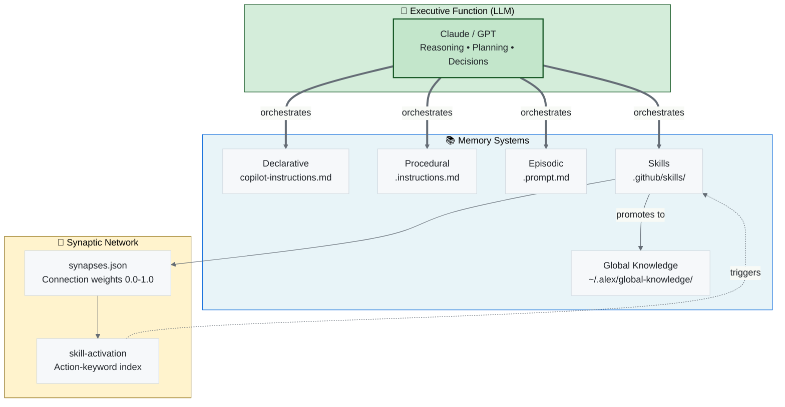
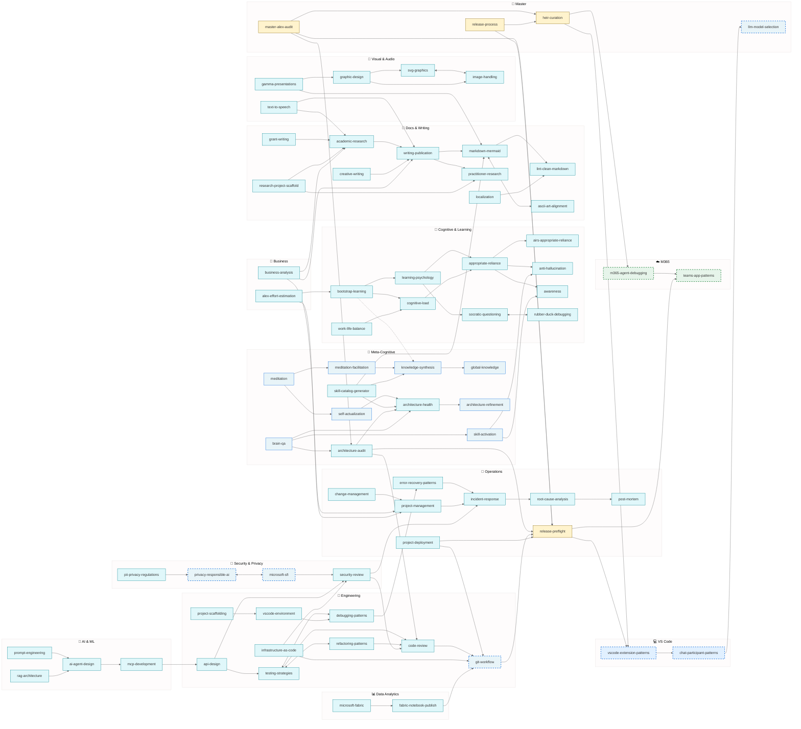
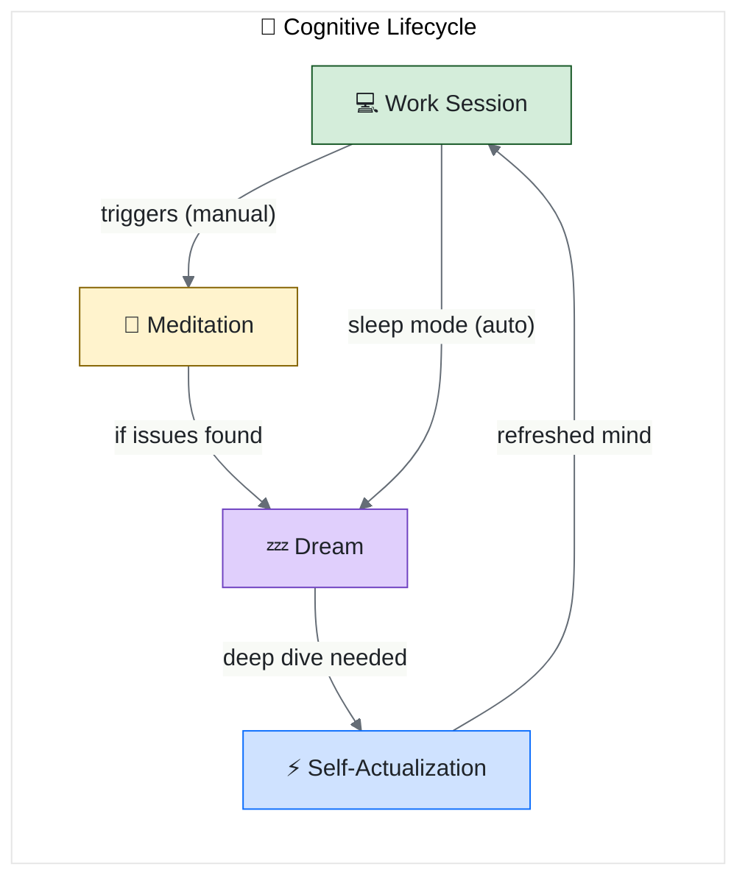
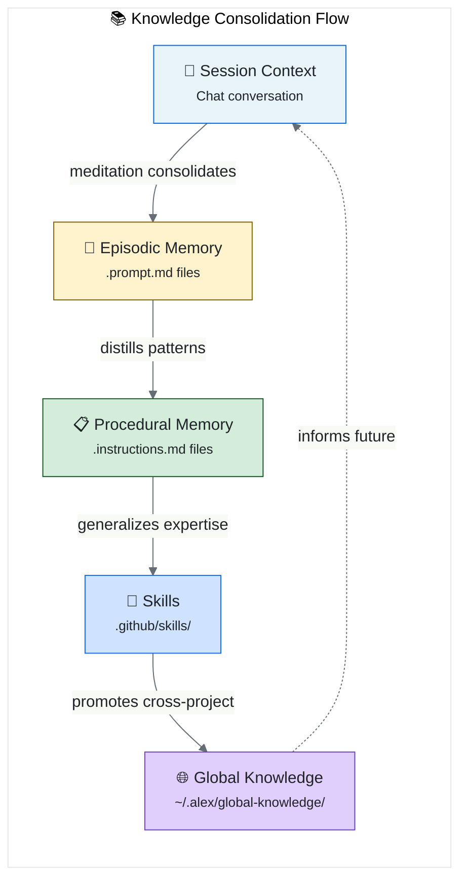
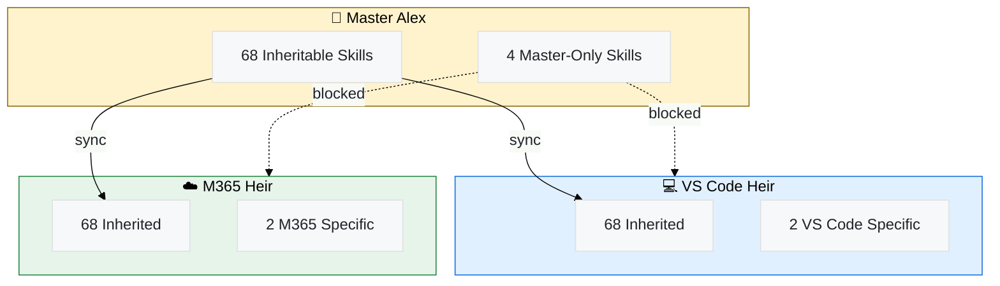

# Alex Skills Catalog (Baseline)

> **Canonical reference** for Alex's skill inventory. Manually curated for accuracy.
> Generated catalogs should match this baseline's fidelity.

Complete inventory of Alex's superpowers — what each skill does, who inherits it, and when to use it.

---

## Skill Count: 77

| Inheritance | Count |
| ----------- | ----- |
| Inheritable | 68    |
| Master-Only | 4     |
| Universal   | 1     |
| Heir:vscode | 2     |
| Heir:m365   | 2     |

---

## By Category

### 🧠 Cognitive & Learning

| Skill                                                                     | Inheritance | Purpose                                               |
| ------------------------------------------------------------------------- | ----------- | ----------------------------------------------------- |
| [cognitive-load](../../.github/skills/cognitive-load/SKILL.md)                       | inheritable | Manage information overload — chunking, scaffolding   |
| [learning-psychology](../../.github/skills/learning-psychology/SKILL.md)             | inheritable | Partnership teaching, spaced retrieval                |
| [appropriate-reliance](../../.github/skills/appropriate-reliance/SKILL.md)           | inheritable | Build trust through calibrated confidence             |
| [airs-appropriate-reliance](../../.github/skills/airs-appropriate-reliance/SKILL.md) | inheritable | AIRS-16/18 research, AR construct, telemetry design   |
| [bootstrap-learning](../../.github/skills/bootstrap-learning/SKILL.md)               | inheritable | Domain-agnostic knowledge acquisition                 |
| [meditation-facilitation](../../.github/skills/meditation-facilitation/SKILL.md)     | inheritable | Guide conscious knowledge consolidation               |
| [meditation](../../.github/skills/meditation/SKILL.md)                               | inheritable | Core meditation protocols                             |
| [knowledge-synthesis](../../.github/skills/knowledge-synthesis/SKILL.md)             | inheritable | Cross-project pattern extraction                      |
| [global-knowledge](../../.github/skills/global-knowledge/SKILL.md)                   | inheritable | Global knowledge base management                      |
| [global-knowledge-sync](../../.github/skills/global-knowledge-sync/SKILL.md)         | universal   | Cloud sync for global knowledge base                  |
| [socratic-questioning](../../.github/skills/socratic-questioning/SKILL.md)           | inheritable | Guide users to discover answers through questions     |
| [rubber-duck-debugging](../../.github/skills/rubber-duck-debugging/SKILL.md)         | inheritable | Be a thinking partner through explanation             |
| [anti-hallucination](../../.github/skills/anti-hallucination/SKILL.md)               | inheritable | Prevent confabulation, honest uncertainty             |
| [awareness](../../.github/skills/awareness/SKILL.md)                                 | inheritable | Self-monitoring, error detection, epistemic vigilance |
| [work-life-balance](../../.github/skills/work-life-balance/SKILL.md)                 | inheritable | Sustainable work patterns, burnout prevention         |

### 🔧 Engineering Fundamentals

| Skill                                                               | Inheritance | Purpose                                            |
| ------------------------------------------------------------------- | ----------- | -------------------------------------------------- |
| [testing-strategies](../../.github/skills/testing-strategies/SKILL.md)         | inheritable | Testing pyramid, AAA, coverage philosophy          |
| [refactoring-patterns](../../.github/skills/refactoring-patterns/SKILL.md)     | inheritable | Safe code transformations                          |
| [debugging-patterns](../../.github/skills/debugging-patterns/SKILL.md)         | inheritable | Systematic bug hunting                             |
| [code-review](../../.github/skills/code-review/SKILL.md)                       | inheritable | 3-pass review, feedback patterns                   |
| [git-workflow](../../.github/skills/git-workflow/SKILL.md)                     | inheritable | Commits, recovery, branching                       |
| [project-scaffolding](../../.github/skills/project-scaffolding/SKILL.md)       | inheritable | Complete project setup templates                   |
| [vscode-environment](../../.github/skills/vscode-environment/SKILL.md)         | inheritable | Workspace settings, extensions, launch configs     |
| [api-design](../../.github/skills/api-design/SKILL.md)                         | inheritable | RESTful best practices, contract-first, versioning |
| [infrastructure-as-code](../../.github/skills/infrastructure-as-code/SKILL.md) | inheritable | Terraform, Bicep, Pulumi, GitOps patterns          |

### 🚨 Operations & Reliability

| Skill                                                                 | Inheritance | Purpose                                                 |
| --------------------------------------------------------------------- | ----------- | ------------------------------------------------------- |
| [error-recovery-patterns](../../.github/skills/error-recovery-patterns/SKILL.md) | inheritable | Retry, fallback, circuit breaker                        |
| [root-cause-analysis](../../.github/skills/root-cause-analysis/SKILL.md)         | inheritable | 5 Whys, fishbone, post-mortem                           |
| [incident-response](../../.github/skills/incident-response/SKILL.md)             | inheritable | Crisis handling, severity levels                        |
| [post-mortem](../../.github/skills/post-mortem/SKILL.md)                         | inheritable | Blameless retrospectives, learning from failures        |
| [project-deployment](../../.github/skills/project-deployment/SKILL.md)           | inheritable | Universal deployment patterns (npm, PyPI, NuGet, Cargo) |
| [change-management](../../.github/skills/change-management/SKILL.md)             | inheritable | Organizational change, stakeholder buy-in               |
| [project-management](../../.github/skills/project-management/SKILL.md)           | inheritable | Planning, tracking, resource allocation                 |

### 🔐 Security & Privacy

| Skill                                                                 | Inheritance | Purpose                                                |
| --------------------------------------------------------------------- | ----------- | ------------------------------------------------------ |
| [security-review](../../.github/skills/security-review/SKILL.md)                 | inheritable | OWASP, threat modeling, security-focused code review   |
| [microsoft-sfi](../../.github/skills/microsoft-sfi/SKILL.md)                     | inheritable | Microsoft Secure Future Initiative (6 pillars, STRIDE) |
| [pii-privacy-regulations](../../.github/skills/pii-privacy-regulations/SKILL.md) | inheritable | GDPR & Australian Privacy Principles compliance        |
| [privacy-responsible-ai](../../.github/skills/privacy-responsible-ai/SKILL.md)   | inheritable | Privacy by design, RAI principles, bias mitigation     |

### 📝 Documentation & Communication

| Skill                                                                           | Inheritance | Purpose                                                    |
| ------------------------------------------------------------------------------- | ----------- | ---------------------------------------------------------- |
| [writing-publication](../../.github/skills/writing-publication/SKILL.md)                   | inheritable | Academic writing, publication strategy                     |
| [academic-research](../../.github/skills/academic-research/SKILL.md)                       | inheritable | Literature review, citation management                     |
| [practitioner-research](../../.github/skills/practitioner-research/SKILL.md)               | inheritable | Ship→Document→Promote methodology, longitudinal case study |
| [research-project-scaffold](../../.github/skills/research-project-scaffold/SKILL.md)       | inheritable | Research project structure, refactoring existing projects  |
| [grant-writing](../../.github/skills/grant-writing/SKILL.md)                               | inheritable | Research funding applications, NSF/NIH patterns            |
| [creative-writing](../../.github/skills/creative-writing/SKILL.md)                         | inheritable | Narrative, storytelling, engagement                        |
| [markdown-mermaid](../../.github/skills/markdown-mermaid/SKILL.md)                         | inheritable | Diagrams and visualization                                 |
| [lint-clean-markdown](../../.github/skills/lint-clean-markdown/SKILL.md)                   | inheritable | Clean, consistent markdown                                 |
| [ascii-art-alignment](../../.github/skills/ascii-art-alignment/SKILL.md)                   | inheritable | Text-based diagrams                                        |
| [localization](../../.github/skills/localization/SKILL.md)                                 | inheritable | i18n, l10n, translation workflows                          |
| [api-documentation](../../.github/skills/api-documentation/SKILL.md)                       | inheritable | API docs, OpenAPI specs, developer portal content          |
| [cross-cultural-collaboration](../../.github/skills/cross-cultural-collaboration/SKILL.md) | inheritable | Cross-cultural team dynamics, communication adaptation     |

### 🎨 Visual Design & Content Creation

| Skill                                                         | Inheritance | Purpose                                                   |
| ------------------------------------------------------------- | ----------- | --------------------------------------------------------- |
| [svg-graphics](../../.github/skills/svg-graphics/SKILL.md)               | inheritable | SVG banners, logos, icons, visual identity                |
| [image-handling](../../.github/skills/image-handling/SKILL.md)           | inheritable | Format conversion, optimization, sizing                   |
| [graphic-design](../../.github/skills/graphic-design/SKILL.md)           | inheritable | Visual composition, branding, aesthetics                  |
| [gamma-presentations](../../.github/skills/gamma-presentations/SKILL.md) | inheritable | AI presentations, documents, social content via Gamma API |
| [text-to-speech](../../.github/skills/text-to-speech/SKILL.md)           | inheritable | TTS synthesis, chunking, audio content generation         |
| [pptx-generation](../../.github/skills/pptx-generation/SKILL.md)         | inheritable | PowerPoint generation via python-pptx, slide layouts      |

### 💼 Business & Analysis

| Skill                                                               | Inheritance | Purpose                                             |
| ------------------------------------------------------------------- | ----------- | --------------------------------------------------- |
| [business-analysis](../../.github/skills/business-analysis/SKILL.md)           | inheritable | Requirements, stakeholder analysis, process mapping |
| [alex-effort-estimation](../../.github/skills/alex-effort-estimation/SKILL.md) | inheritable | AI-accelerated effort estimation, 4× patterns       |

### 🏗️ Architecture & Design

| Skill                                                                 | Inheritance | Purpose                                                    |
| --------------------------------------------------------------------- | ----------- | ---------------------------------------------------------- |
| [architecture-refinement](../../.github/skills/architecture-refinement/SKILL.md) | inheritable | Architecture evolution decisions                           |
| [architecture-health](../../.github/skills/architecture-health/SKILL.md)         | inheritable | Synapse validation, health checks                          |
| [architecture-audit](../../.github/skills/architecture-audit/SKILL.md)           | inheritable | Comprehensive consistency review                           |
| [master-alex-audit](../../.github/skills/master-alex-audit/SKILL.md)             | master-only | Master-specific audit with heir sync, protection checks    |
| [release-process](../../.github/skills/release-process/SKILL.md)                 | master-only | VS Code marketplace publishing workflow                    |
| [release-preflight](../../.github/skills/release-preflight/SKILL.md)             | master-only | Pre-release checks, version sync                           |
| [llm-model-selection](../../.github/skills/llm-model-selection/SKILL.md)         | inheritable | Model choice for cost/capability                           |
| [self-actualization](../../.github/skills/self-actualization/SKILL.md)           | inheritable | Deep self-assessment protocols                             |
| [heir-curation](../../.github/skills/heir-curation/SKILL.md)                     | master-only | Curate heir deployments                                    |
| [skill-catalog-generator](../../.github/skills/skill-catalog-generator/SKILL.md) | inheritable | Generate skill catalogs with network diagrams              |
| [brain-qa](../../.github/skills/brain-qa/SKILL.md)                               | inheritable | Deep cognitive architecture QA, synapse semantics          |
| [skill-activation](../../.github/skills/skill-activation/SKILL.md)               | inheritable | Auto-triggering capability discovery, action-keyword index |

### 🤖 AI & Machine Learning

| Skill                                                       | Inheritance | Purpose                                                            |
| ----------------------------------------------------------- | ----------- | ------------------------------------------------------------------ |
| [prompt-engineering](../../.github/skills/prompt-engineering/SKILL.md) | inheritable | LLM prompting patterns, system prompts, few-shot, chain-of-thought |
| [rag-architecture](../../.github/skills/rag-architecture/SKILL.md)     | inheritable | Retrieval-augmented generation, embedding, chunking, vector stores |
| [ai-agent-design](../../.github/skills/ai-agent-design/SKILL.md)       | inheritable | Multi-agent systems, ReAct, planning, tool use, memory patterns    |
| [mcp-development](../../.github/skills/mcp-development/SKILL.md)       | inheritable | Model Context Protocol servers, tools, resources, transports       |

### 📊 Data Analytics

| Skill                                                                 | Inheritance | Purpose                                      |
| --------------------------------------------------------------------- | ----------- | -------------------------------------------- |
| [microsoft-fabric](../../.github/skills/microsoft-fabric/SKILL.md)               | inheritable | Microsoft Fabric analytics platform patterns |
| [fabric-notebook-publish](../../.github/skills/fabric-notebook-publish/SKILL.md) | inheritable | Fabric notebook Git sync, worktree workflow  |

### 💻 Platform-Specific

#### VS Code Extension

| Skill                                                                     | Inheritance | Purpose                    |
| ------------------------------------------------------------------------- | ----------- | -------------------------- |
| [vscode-extension-patterns](../../.github/skills/vscode-extension-patterns/SKILL.md) | heir:vscode | Extension API patterns     |
| [chat-participant-patterns](../../.github/skills/chat-participant-patterns/SKILL.md) | heir:vscode | Chat API, streaming, tools |

#### M365 / Teams

| Skill                                                           | Inheritance | Purpose                      |
| --------------------------------------------------------------- | ----------- | ---------------------------- |
| [m365-agent-debugging](../../.github/skills/m365-agent-debugging/SKILL.md) | heir:m365   | Declarative agent debugging  |
| [teams-app-patterns](../../.github/skills/teams-app-patterns/SKILL.md)     | heir:m365   | Bots, cards, tabs, manifests |

---

## Staleness-Prone Skills

These skills depend on rapidly evolving technology or regulations:

| Skill                     | Why Stale                 | Refresh Triggers                   | Updated By   |
| ------------------------- | ------------------------- | ---------------------------------- | ------------ |
| vscode-extension-patterns | Monthly VS Code releases  | API changes, deprecations          | VS Code heir |
| chat-participant-patterns | Proposed APIs evolving    | API graduation, new features       | VS Code heir |
| m365-agent-debugging      | Schema versions change    | New schema, capabilities           | M365 heir    |
| teams-app-patterns        | Platform evolution        | Toolkit updates, manifest versions | M365 heir    |
| llm-model-selection       | New models frequently     | Model announcements, pricing       | Master       |
| git-workflow              | GitHub features evolve    | CLI updates, Actions changes       | Master       |
| privacy-responsible-ai    | Regulations change        | New laws, AI regulations           | Master       |
| microsoft-sfi             | Security landscape shifts | New vulnerabilities, practices     | Master       |

**Update Flow:** Platform heirs update their skills first (they encounter changes in practice), then promote stable updates to Master. Master updates inheritable skills directly.

---

## Inheritance Model

```text
Master Alex
    │
    ├── inheritable skills ──► All Heirs
    │
    ├── master-only skills ──► Master Only
    │
    ├── heir:vscode ──► VS Code Extension Only
    │
    └── heir:m365 ──► M365 Agent Only
```

---

## Memory Architecture Diagram



---

## Skill Network Diagram



### Legend

| Color    | Inheritance  |
| -------- | ------------ |
| 🟨 Yellow | Master-only  |
| 🟦 Blue   | VS Code heir |
| 🟩 Green  | M365 heir    |
| 🧊 Cyan   | Inheritable  |

| Border   | Meaning                                  |
| -------- | ---------------------------------------- |
| ┅ Dashed | Staleness-prone (needs periodic refresh) |
| ── Solid | Standard                                 |

| Arrow             | Meaning              |
| ----------------- | -------------------- |
| `→` Solid         | Direct dependency    |
| `↔` Bidirectional | Mutual reinforcement |
| `⇢` Dashed        | Weak/optional link   |

**Weights:** Exact strengths (0.0-1.0) in each skill's `synapses.json`

### Connection Types

| Type          | Meaning                | Example                          |
| ------------- | ---------------------- | -------------------------------- |
| `enables`     | A makes B possible     | testing → refactoring            |
| `applies`     | A uses B's principles  | bootstrap → learning-psychology  |
| `extends`     | A goes deeper than B   | RCA → debugging                  |
| `complements` | A and B work together  | privacy ↔ microsoft-sfi          |
| `triggers`    | A causes B to activate | incident → RCA                   |
| `curates`     | A manages B            | heir-curation → vscode-extension |

### Subgraph Index

| Subgraph         | Skills                                                                                                                                                                                                                                               |
| ---------------- | ---------------------------------------------------------------------------------------------------------------------------------------------------------------------------------------------------------------------------------------------------- |
| 🧠 Cognitive      | bootstrap-learning, learning-psychology, cognitive-load, appropriate-reliance, airs-appropriate-reliance, anti-hallucination, awareness, socratic-questioning, rubber-duck-debugging, work-life-balance                                              |
| 🔮 Meta-Cognitive | meditation, meditation-facilitation, knowledge-synthesis, global-knowledge, global-knowledge-sync, self-actualization, architecture-health, architecture-refinement, skill-catalog-generator, architecture-audit, brain-qa, skill-activation         |
| 🔧 Engineering    | testing-strategies, refactoring-patterns, debugging-patterns, code-review, git-workflow, project-scaffolding, vscode-environment, api-design, infrastructure-as-code                                                                                 |
| 🚨 Operations     | error-recovery-patterns, root-cause-analysis, incident-response, post-mortem, project-deployment, release-preflight, change-management, project-management                                                                                           |
| 🔐 Security       | security-review, microsoft-sfi, privacy-responsible-ai, pii-privacy-regulations                                                                                                                                                                      |
| 🤖 AI & ML        | prompt-engineering, rag-architecture, ai-agent-design, mcp-development                                                                                                                                                                               |
| 📊 Data Analytics | microsoft-fabric, fabric-notebook-publish                                                                                                                                                                                                            |
| 📝 Docs & Writing | writing-publication, markdown-mermaid, lint-clean-markdown, ascii-art-alignment, academic-research, practitioner-research, research-project-scaffold, creative-writing, grant-writing, localization, api-documentation, cross-cultural-collaboration |
| 🎨 Visual & Audio | svg-graphics, image-handling, graphic-design, gamma-presentations, text-to-speech, pptx-generation                                                                                                                                                   |
| 💼 Business       | business-analysis, alex-effort-estimation                                                                                                                                                                                                            |
| 💻 VS Code        | vscode-extension-patterns, chat-participant-patterns                                                                                                                                                                                                 |
| ☁️ M365           | m365-agent-debugging, teams-app-patterns                                                                                                                                                                                                             |
| 👑 Master         | heir-curation, master-alex-audit, release-process, llm-model-selection                                                                                                                                                                               |

---

## Cognitive Lifecycle Diagram



**When to use each:**
| Mode                 | Trigger                   | Purpose                                   |
| -------------------- | ------------------------- | ----------------------------------------- |
| 💻 Work               | Default                   | Active development, conversations         |
| 🧘 Meditation         | "meditate"                | Conscious consolidation, file persistence |
| 💤 Dream              | "dream", auto-maintenance | Unconscious repair, synapse validation    |
| ⚡ Self-Actualization | "self-actualize"          | Deep assessment, architecture review      |

---

## Knowledge Flow Diagram



**Knowledge promotion criteria:**
| From       | To         | When                     |
| ---------- | ---------- | ------------------------ |
| Session    | Episodic   | Insight worth preserving |
| Episodic   | Procedural | Pattern used 3+ times    |
| Procedural | Skill      | Domain expertise emerges |
| Skill      | Global     | Applies across projects  |

---

## Brain Health Status Diagram

```mermaid
%%{init: {'theme': 'base', 'themeVariables': { 'primaryColor': '#f6f8fa'}}}%%
flowchart TB
    subgraph Health["❤️ Brain QA Health Indicators"]
        P1["Phase 1<br/>Synapse Targets"]
        P15["Phase 1.5<br/>Inheritance Fields"]
        P2["Phase 2<br/>Skill Index"]
        P4["Phase 4<br/>Master-Heir Parity"]
        P5["Phase 5<br/>Schema Format"]
        P6["Phase 6<br/>Synapse Sync"]
        P7["Phase 7<br/>Index Sync"]
        P8["Phase 8<br/>Catalog Accuracy"]
    end

    P1 --> P15 --> P2 --> P4 --> P5 --> P6 --> P7 --> P8

    style P1 fill:#d4edda,stroke:#155724
    style P15 fill:#d4edda,stroke:#155724
    style P2 fill:#d4edda,stroke:#155724
    style P4 fill:#d4edda,stroke:#155724
    style P5 fill:#d4edda,stroke:#155724
    style P6 fill:#d4edda,stroke:#155724
    style P7 fill:#d4edda,stroke:#155724
    style P8 fill:#d4edda,stroke:#155724
```



**Run `brain qa` to validate all phases. Green = healthy, Yellow = warning, Red = action needed.**

---

## Inheritance Cascade Diagram



**Inheritance values:**
| Value         | Meaning                  | Sync Behavior      |
| ------------- | ------------------------ | ------------------ |
| `inheritable` | All heirs receive        | Master → All Heirs |
| `master-only` | Master keeps exclusively | Not synced         |
| `heir:vscode` | VS Code heir only        | Created in heir    |
| `heir:m365`   | M365 heir only           | Created in heir    |

---

## Adding New Skills

1. Create folder: `.github/skills/[skill-name]/`
2. Add `SKILL.md` with:
   - Frontmatter `applyTo` patterns
   - Staleness warning (if tech-dependent)
   - Core content
   - Synapses reference
3. Add `synapses.json` with:
   - skill name
   - inheritance value
   - connections to other skills
   - trigger keywords
4. Update this catalog
5. Update `copilot-instructions.md` skills list

---

## Skill Quality Checklist

- [ ] Purpose is clear in first line
- [ ] Content is terse (for AI, not humans)
- [ ] Examples are concrete
- [ ] Anti-patterns noted
- [ ] Connections mapped in synapses.json
- [ ] Staleness warning if needed
- [ ] Triggers defined for activation

---

*Last updated: 2026-02-09*
